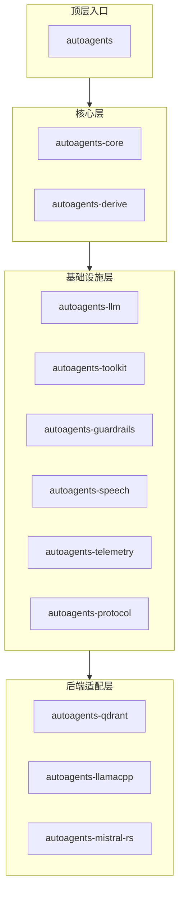

# AutoAgents：Rust 多智能体框架的模块化设计与生产级实践

AutoAgents 真正解决的不是"再用一门语言写一遍 Agent 框架"，而是把多智能体系统里最容易被动态类型埋掉的部分——工具参数、消息结构、智能体状态——全部挪到编译期检查。它用 Rust 的 trait 与派生宏把"定义工具""定义智能体"压成几行声明，同时用 WASM 沙盒和可插拔的 LLM 层补偿生产环境需要的安全与稳定性。

| 项目 | 信息 |
|------|------|
| 仓库 | [liquidos-ai/AutoAgents](https://github.com/liquidos-ai/AutoAgents) |
| Stars / Forks | 726 / 84（GitHub API 2026-08-06 验证） |
| License | Apache-2.0 / MIT 双许可 |
| 语言 | Rust |
| 默认分支 | main |
| 官方文档 | https://liquidos-ai.github.io/AutoAgents/ |

Python 生态有 LangChain、LlamaIndex 这类成熟的 Agent 框架。如果对性能、类型安全和内存占用有更严格的要求，Rust 是另一个值得看的选项。多智能体系统进入生产后，会撞上 Python 动态类型和 GIL 带来的问题：高并发工具调用需要频繁序列化/反序列化，长时间运行的流式推理会累积内存压力，Python 异常要等运行时才能捕获。Rust 的编译器在编译期就能抓住智能体状态、工具参数和 LLM 输出的类型错误。

AutoAgents 没有重复造轮子——它复用 Rust 生态已有的库（用于 LLM 推理的 Burn、用于 WASM 的 wasmtime），把精力放在智能体编排层的抽象上。项目通过 12 个独立 crate 的模块拆分，覆盖从核心 Agent trait 到 WASM 沙盒、Python 绑定、OpenTelemetry 可观测性的完整技术栈。

## 架构总览：12 个 crate 的模块边界

AutoAgents 采用 workspace 结构，把功能拆成 12 个独立 crate，每个 crate 职责界限清楚：


```mermaid
flowchart TB
    subgraph TOP["顶层入口"]
        T1["autoagents"]
    end

    subgraph CORE["核心层"]
        C1["autoagents-core"]
        C2["autoagents-derive"]
    end

    subgraph INFRA["基础设施层"]
        I1["autoagents-llm"]
        I2["autoagents-toolkit"]
        I3["autoagents-guardrails"]
        I4["autoagents-speech"]
        I5["autoagents-telemetry"]
        I6["autoagents-protocol"]
    end

    subgraph BACKEND["后端适配层"]
        B1["autoagents-qdrant"]
        B2["autoagents-llamacpp"]
        B3["autoagents-mistral-rs"]
    end

    TOP --> CORE --> INFRA --> BACKEND
```

| Crate | 职责 | 是否必需 |
|-------|------|:---:|
| `autoagents-core` | 核心抽象：Agent trait、Tool trait、Memory trait、Executor | ✅ |
| `autoagents-derive` | 派生宏：`#[agent]`、`#[tool]`、`#[tool_input]`、`#[agent_output]` | ✅ |
| `autoagents-llm` | LLM 接口抽象与统一后端调度 | ✅ |
| `autoagents-toolkit` | 内置工具集（文件系统、网络请求等） | 可选 |
| `autoagents-guardrails` | 输入/输出安全检查（Guardrails） | 可选 |
| `autoagents-speech` | TTS（文字转语音）和 STT（语音转文字）本地支持 | 可选 |
| `autoagents-telemetry` | OpenTelemetry 追踪与指标导出 | 可选 |
| `autoagents-protocol` | 多智能体通信协议（pub/sub） | 可选 |
| `autoagents-qdrant` | Qdrant 向量存储后端（记忆扩展） | 可选 |
| `autoagents-llamacpp` | llama.cpp 本地推理后端 | 可选 |
| `autoagents-mistral-rs` | Mistral-rs 本地推理后端 | 可选 |
| `autoagents` | 顶层入口包 | ✅ |

这种拆分的效果是**按需依赖**——只想用核心 Agent 功能，不必引入 Speech 或 Qdrant；只想本地推理，不必背上云端 provider 的依赖传递。

## 智能体抽象：从 trait 到 derive 宏

### 核心 trait 设计

AutoAgents 的核心抽象围绕三个 trait 展开：`Agent`（做什么）、`Tool`（怎么做）、`Memory`（记得什么）。所有具体实现都围绕这三个 trait。由于定义在 `autoagents-core` 里、与具体后端解耦，工具和智能体可以跨 LLM provider 复用。

### 派生宏：减少样板代码

手写实现这些 trait 需要大量样板。AutoAgents 通过 `#[derive]` 宏把工具定义压成数据结构加一段执行逻辑：

```rust
// 定义工具：使用 #[tool] 派生宏自动生成 ToolInput
#[derive(Serialize, Deserialize, ToolInput, Debug)]
pub struct AdditionArgs {
    #[input(description = "Left Operand for addition")]
    left: i64,
    #[input(description = "Right Operand for addition")]
    right: i64,
}

#[tool(
    name = "Addition",
    description = "Use this tool to Add two numbers",
    input = AdditionArgs,
)]
struct Addition {}

// 实现工具运行时
#[async_trait]
impl ToolRuntime for Addition {
    async fn execute(&self, args: Value) -> Result<Value, ToolCallError> {
        let typed_args: AdditionArgs = serde_json::from_value(args)?;
        Ok((typed_args.left + typed_args.right).into())
    }
}
```

`#[tool]` 宏自动处理工具注册、参数解析和 JSON Schema 生成。类似地，`#[agent]` 宏定义智能体，`#[agent_output]` 定义结构化输出。智能体本身用 `#[derive(Default, Clone, AgentHooks)]` 加上描述即可：

```rust
#[agent(
    name = "math_agent",
    description = "You are a Math agent",
    tools = [Addition],
    output = MathAgentOutput,
)]
#[derive(Default, Clone, AgentHooks)]
pub struct MathAgent {}
```

### 执行器

`autoagents-core` 的 `prebuilt::executor` 提供三种执行器：基础的 `BasicAgent`、核心的 `ReActAgent`（Reasoning + Acting），以及 feature 开关下启用的 `CodeActAgent`。ReAct 的循环是**思考（Thought）→ 行动（Action）→ 观察（Observation）**，持续迭代直到输出最终答案或达到步数上限，适合需要调用工具的多步推理任务。

```rust
pub async fn simple_agent(llm: Arc<dyn LLMProvider>) -> Result<(), Error> {
    let sliding_window_memory = Box::new(SlidingWindowMemory::new(10));

    let agent_handle = AgentBuilder::<_, DirectAgent>::new(ReActAgent::new(MathAgent {}))
        .llm(llm)
        .memory(sliding_window_memory)
        .build()
        .await?;

    let result = agent_handle.agent.run(Task::new("What is 1 + 1?")).await?;
    Ok(())
}
```

## 工具系统：WASM 沙盒与结构化调用

### 工具调用的结构化设计

AutoAgents 的工具调用是**类型安全**的——不用自然语言描述工具参数，而是通过 Rust 结构体加 serde 序列化定义工具输入。工具参数在编译期就有类型检查，LLM 输出通过 serde 自动反序列化到正确的结构体，不存在"字符串模板 + 正则匹配"那种脆弱模式。

### WASM 沙盒隔离

AutoAgents 支持把工具执行放进 **WASM 沙盒**，这是安全敏感场景的关键特性。当智能体调用不可信的工具代码（如用户提供的自定义工具）时，WASM 沙盒能防止工具代码访问沙盒外的内存、损害主进程。工具可以注册为 WASM 运行时，`execute` 在 WASM 虚拟机中执行。

### 内置工具包（Toolkit）

`autoagents-toolkit` 提供开箱即用的内置工具：文件系统操作（读、写、搜索）、网络请求（HTTP GET/POST）、Shell 命令执行等。这些工具经过安全审计，可以直接集成进工作流。

## 记忆系统：滑动窗口与可扩展后端

`Memory` trait 抽象了记忆的读写：

```rust
pub trait Memory: Send + Sync {
    async fn read(&self) -> Value;           // 读取当前记忆内容
    async fn write(&mut self, entry: MemoryEntry) -> Result<(), Error>;  // 写入新记忆
    fn len(&self) -> usize;                 // 记忆条目数量
    fn is_empty(&self) -> bool;
}
```

内置的 **SlidingWindowMemory**（滑动窗口记忆）是最基础的实现——始终保持最近 N 条记忆，超出部分自动淘汰，适合短对话场景。需要长期记忆就换 `autoagents-qdrant` crate，它提供 Qdrant 向量存储后端，支持语义检索和持久化。

## LLM 后端：统一接口与灵活接入

### 统一 Provider 接口

LLM 层通过 `LLMProvider` trait 抽象所有后端，`complete` 和 `stream` 两种方法覆盖普通与流式调用。切换 LLM 后端不需要改业务代码，只要在初始化时注入不同的 Provider 实例：

```rust
// 使用 OpenAI
let llm: Arc<OpenAI> = LLMBuilder::<OpenAI>::new()
    .api_key(api_key)
    .model("gpt-4o")
    .build()?;

// 业务代码不用改，换成 Ollama 也一样
```

### 支持的 Provider 生态

**云端 Provider（10 个）：** OpenAI、OpenRouter、Anthropic、DeepSeek、xAI、Phind、Groq、Google、Azure OpenAI、MiniMax

**本地 Provider（3 个）：** Ollama（经 Ollama 服务）、Mistral-rs（嵌入式运行时）、Llama-Cpp（嵌入式运行时）

**实验性（2 个）：** Burn、ONNX Runtime，在独立的 [AutoAgents-Experimental-Backends](https://github.com/liquidos-ai/AutoAgents-Experimental-Backends) 仓库维护

对中国开发者来说，直接支持 MiniMax 是个实用细节。

### LLM 优化层：PipelineBuilder

`autoagents-llm` 提供可组合的 LLM 管线。`pipeline` 模块定义 `LLMLayer` trait，`optim` 模块提供缓存、重试、回退三类 pass。用 `PipelineBuilder` 把任意个 layer 叠起来，结果仍是 `Arc<dyn LLMProvider>`，对现有 Agent 代码完全透明：

```rust
use autoagents_llm::pipeline::PipelineBuilder;
use autoagents_llm::optim::{CacheLayer, CacheConfig};
use std::time::Duration;

let llm = PipelineBuilder::new(base_provider)
    .add_layer(CacheLayer::new(CacheConfig {
        ttl: Some(Duration::from_secs(3600)),
        max_size: Some(500),
        ..CacheConfig::default()
    }))
    .build();
// 结果链：CacheLayer → base_provider
```

`CacheLayer` 对相同请求直接返回缓存结果，降低重复调用和 token 消耗；`RetryLayer` 对临时性失败（网络超时、服务端限流）自动重试；`FallbackLayer` 在某个 provider 失败时切到备用 provider。layer 按添加顺序自外向内拦截请求，第一个添加的最先命中。

## Guardrails：LLM 输入输出安全层

Guardrails 在 LLM 调用链的输入/输出两侧做检查。`autoagents-guardrails` 的 `policy.rs` 定义三种执行策略：

- **Block**：命中规则直接失败请求（默认策略）
- **Sanitize**：脱敏后放行
- **Audit**：记录违规但不拦截，供事后审查

规则按类别（`PromptInjection`、`Toxicity`、自定义 `Custom`）和严重度（Low / Medium / High / Critical）组织。Guardrails 也实现为 `LLMLayer`，能与其他 layer 一起叠进管线。

## 多智能体编排：类型化通信与环境管理

多智能体系统通过 **typed pub/sub 协议**通信。消息类型用 `#[derive(Message, Serialize, Deserialize)]` 定义，编译期就能保证发送方和接收方对消息结构有共识，避免运行时才发现字段不匹配：

```rust
// 定义智能体之间的消息类型（类型安全）
#[derive(Message, Serialize, Deserialize)]
pub struct AgentMessage {
    pub sender: AgentId,
    pub content: String,
    pub metadata: MessageMetadata,
}

// 订阅特定类型的消息
agent.subscribe::<AgentMessage>(|msg| {
    // 处理收到的消息
    Ok(())
});

// 发布消息给其他智能体
agent.publish(AgentMessage { ... });
```

**环境管理（Environment）** 是编排的另一个核心概念。每个智能体在一个共享的"环境"里运行，环境负责维护全局状态、管理智能体之间的依赖关系、提供共享工具。

## 可观测性：OpenTelemetry 集成

生产环境的调试和监控靠内置的 OpenTelemetry 支持。`autoagents-telemetry` crate 提供 tracer、exporter 和 runner，追踪数据包括每次 LLM 调用的延迟、工具执行的耗时、智能体状态转换等关键指标，导出器支持 Console、Jaeger、OTLP 等多种后端。

## Python 绑定：PyPI 安装与使用

Rust 框架最大的门槛是 Rust 本身的上手成本。AutoAgents 通过 PyPI bindings 解决——不需要写 Rust，用 Python 也能用它的核心功能：

```bash
pip install autoagents-py                        # 核心 + 云端 LLM
pip install "autoagents-py[llamacpp]"            # + llama.cpp CPU
pip install "autoagents-py[llamacpp-cuda]"       # + CUDA 加速
pip install "autoagents-py[llamacpp-metal]"      # + Metal（macOS）
pip install "autoagents-py[mistralrs]"           # + mistral-rs CPU
pip install "autoagents-py[guardrails]"          # + 安全护栏
```

Python API 与 Rust API 保持概念一致：

```python
from autoagents import Agent, Task
from autoagents.llm import OpenAI

# 初始化 LLM
llm = OpenAI(api_key="sk-...", model="gpt-4o")

# 创建智能体
agent = Agent(llm=llm)

# 运行任务
result = agent.run(Task("What is 1 + 1?"))
```

Python 绑定用 maturin 构建，核心逻辑跑在 Rust 编译后的原生代码里。对主要是 LLM API 调用的场景（网络延迟占主导），性能优势并不明显；优势体现在高并发工具调用、大量序列化/反序列化、以及本地推理场景。

## 安装与快速上手

### 前置依赖

- Rust（README 建议最新 stable）
- Cargo
- LeftHook（Git hooks 管理）
- Python 3.9+（仅 Python 绑定需要）
- uv（Python 环境与包管理）
- maturin（本地构建 Python 绑定）

### Rust 原生安装

```bash
# 安装系统依赖（Linux）
sudo apt update && sudo apt install build-essential libasound2-dev alsa-utils pkg-config libssl-dev -y

# 安装 LeftHook
brew install lefthook   # macOS；Linux/Windows 用 npm install -g lefthook

# 克隆并构建
git clone https://github.com/liquidos-ai/AutoAgents.git
cd AutoAgents
lefthook install
cargo build --workspace --features full

# 运行测试
cargo test --features "full" --workspace
```

CUDA、Vulkan、Metal 等硬件加速 feature 需要匹配的本地工具链和平台，只对你正在构建的具体后端开启。

### Python 开发安装

```bash
# 开发环境（需要 Rust 编译环境）
uv venv --python=3.12
source .venv/bin/activate
uv pip install -U pip "maturin>=1.13.3,<2" pytest pytest-asyncio pytest-cov
make python-bindings-build
```

## 一个任务如何流过系统

用一个"数学 Agent 回答 1+1 并返回结构化结果"的任务，把上面几层串起来：

1. `AgentBuilder` 用 `ReActAgent` 包住 `MathAgent`，注入 OpenAI provider 和 `SlidingWindowMemory`。
2. 调用 `agent.run(Task::new("What is 1 + 1?"))`，`ReActAgent` 进入思考步。
3. LLM 输出触发工具调用，`Addition` 工具接到类型化参数 `AdditionArgs{left:1, right:1}`。
4. `ToolRuntime::execute` 反序列化参数、算出结果，返回 `Value`。
5. ReAct 循环观察到结果，把 `MathAgentOutput`（`value` + `explanation`）作为结构化输出返回。

整个链路里，工具参数、消息结构、输出结构都在编译期被检查过，运行时只处理真正的网络和模型波动。

## 适用场景与决策建议

**适合的场景：**

- 需要**高性能**多智能体推理的后端服务——Rust 的所有权和并发模型在高并发工具调用下更有优势
- 对**类型安全**有要求的生产系统——编译器检查覆盖智能体状态、工具参数、消息结构
- 需要在**边缘设备**上运行智能体——Rust 的低内存开销加 WASM 沙盒适合嵌入式与 IoT
- 需要**本地部署** LLM 且不想引入 Python 环境——通过 llama.cpp 或 Mistral-rs 直接加载模型
- **安全敏感**场景——WASM 沙盒加 Guardrails 提供多层防护

**不适合的场景：**

- 快速原型和探索性实验——LangChain/Python 更灵活，迭代更快
- 对生态丰富度要求极高——LangChain 的社区插件和集成数量远超 Rust 生态
- 团队没有 Rust 基础——只用 Python bindings 可以，但功能覆盖不如 Rust API 完整

**建议的切入顺序：** 先用 `pip install autoagents-py` 在 Python 里跑通核心流程，验证这套抽象是否匹配你的调度需求；确认值得投入后，再让团队从 `autoagents-core` 入手，按 crate 边界逐步迁移核心逻辑。边缘部署或安全敏感场景，才值得一开始就上 WASM 和 Guardrails。

## 常见问题

**Q: AutoAgents 和 LangChain 怎么选？**

项目在快速迭代阶段，用 LangChain/Python 更快。进入生产阶段、对性能和类型安全有要求、或需要部署到边缘设备时，AutoAgents 的 Rust 底层更有优势。Python bindings 可以作为过渡——先用 Python 调用，等团队熟悉 Rust 后再迁移核心逻辑。

**Q: WASM 沙盒是否影响工具执行性能？**

官方没有给出统一的开销数字，实际影响取决于工具的计算量和 WASM 运行时。如果追求极致性能，可以不用 WASM 沙盒，直接执行原生工具代码。

**Q: 支持哪些 Rust 版本？**

README 未明确指定 MSRV（Minimum Supported Rust Version），建议使用最新 stable 工具链，`rustup update stable` 更新即可。

**Q: 生产环境部署需要注意什么？**

三点：1) 开启 OpenTelemetry 追踪，否则生产问题难排查；2) 为 LLM 调用配置 `RetryLayer`，处理网络抖动；3) 如果审计合规要求强，把 Guardrails 的 `Sanitize` 或 `Audit` 策略接入管线。

---

🦞 每日 08:00 自动更新

**数据来源**：liquidos-ai/AutoAgents GitHub 仓库、README.md、crates/ 目录结构、autoagents-llm 的 pipeline/optim 源码、autoagents-guardrails 的 policy.rs（2026-08-06 验证）