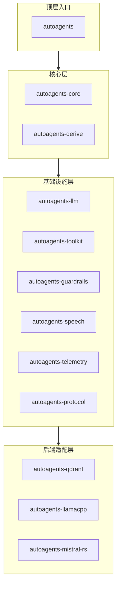

# AutoAgents：Rust 多智能体框架如何把类型安全压到编译期

多智能体系统里最容易被动态类型埋掉的部分——工具参数、输出结构、智能体状态——放在 Rust 里可以提前到编译期去检查。AutoAgents 就围绕这一点展开：用 Rust 的 trait 与派生宏把「定义工具」「定义智能体」压成几行声明，再用 WASM 沙盒和可插拔的大语言模型（LLM）层兜住生产环境需要的安全与稳定性。消息通信是例外：多智能体之间走的是带类型参数的主题（topic）分发，类型约束比编译期弱一档，本文会把这条边界说清楚。

| 项目 | 信息 |
|------|------|
| 仓库 | [liquidos-ai/AutoAgents](https://github.com/liquidos-ai/AutoAgents) |
| Stars / Forks | 761 / 88（2026-09-27 经 GitHub 应用程序接口（API）验证） |
| 当前版本 | 0.4.0（crates.io 与 PyPI 同步） |
| License | MIT OR Apache-2.0 双许可，用时可任选其一 |
| 语言 | Rust（edition 2024） |
| 默认分支 | main |
| 官方文档 | https://liquidos-ai.github.io/AutoAgents/ |
| 配套仓库 | [AutoAgents-CLI](https://github.com/liquidos-ai/AutoAgents-CLI)（YAML 工作流 + HTTP 服务）、[AutoAgents-Experimental-Backends](https://github.com/liquidos-ai/AutoAgents-Experimental-Backends)（实验性推理后端）、[AutoAgents-Android-Example](https://github.com/liquidos-ai/AutoAgents-Android-Example)（安卓本地推理示例） |

Python 生态有 LangChain、LlamaIndex 这类成熟的 Agent 框架。如果对性能、类型安全和内存占用有更严格的要求，Rust 是另一个值得看的选项。多智能体系统进入生产后，会撞上 Python 动态类型和 GIL（全局解释器锁）带来的问题：高并发工具调用需要频繁序列化/反序列化，长时间运行的流式推理会累积内存压力，Python 异常要等运行时才能捕获。Rust 的编译器在编译期就能抓住智能体状态、工具参数和 LLM 输出的类型错误。

AutoAgents 没有重复造轮子——它复用 Rust 生态已有的库（WASM 运行时用 wasmtime，多智能体通信底层用 ractor），把精力放在智能体编排层的抽象上。项目通过 12 个 crate 的模块拆分，覆盖从核心 Agent trait 到 WASM 沙盒、Python 绑定、OpenTelemetry 可观测性的完整技术栈。

## 学习目标

读完这篇，你将能：

- 说清 AutoAgents 把哪些错误检查从运行期挪到了编译期，哪些没挪、为什么。
- 看懂 12 个 crate 的分层，以及「按需依赖」在 Rust workspace 里怎么落地。
- 分辨「类型安全」在工具参数、输出结构上成立，在消息通信上只是部分成立的边界。
- 按自己的场景选切入点：Python 绑定先跑通、Rust 侧逐步迁移，或者用 CLI 走 YAML 配置。

## 目录

- [架构总览：12 个 crate 的模块边界](#架构总览12-个-crate-的模块边界)
- [智能体抽象：从 trait 到 derive 宏](#智能体抽象从-trait-到-derive-宏)
- [工具系统：WASM 沙盒与结构化调用](#工具系统wasm-沙盒与结构化调用)
- [记忆系统：MemoryProvider 与可扩展后端](#记忆系统memoryprovider-与可扩展后端)
- [LLM 后端：统一接口与灵活接入](#llm-后端统一接口与灵活接入)
- [Guardrails：LLM 输入输出安全层](#guardrailsllm-输入输出安全层)
- [多智能体编排：actor、Topic 与 Environment](#多智能体编排actortopic-与-environment)
- [可观测性：OpenTelemetry 集成](#可观测性opentelemetry-集成)
- [Python 绑定：PyPI 安装与使用](#python-绑定pypi-安装与使用)
- [AutoAgents CLI：把工作流写进 YAML](#autoagents-cli把工作流写进-yaml)
- [安装与快速上手](#安装与快速上手)
- [一个任务如何流过系统](#一个任务如何流过系统)
- [适用场景与决策建议](#适用场景与决策建议)
- [常见问题](#常见问题)

## 架构总览：12 个 crate 的模块边界

AutoAgents 采用 workspace 结构，把功能拆成 12 个独立 crate，每个 crate 职责界限清楚：


```mermaid
flowchart TB
    subgraph TOP["顶层入口"]
        T1["autoagents"]
    end

    subgraph CORE["核心层"]
        C1["autoagents-core"]
        C2["autoagents-derive"]
    end

    subgraph INFRA["基础设施层"]
        I1["autoagents-llm"]
        I2["autoagents-toolkit"]
        I3["autoagents-guardrails"]
        I4["autoagents-speech"]
        I5["autoagents-telemetry"]
        I6["autoagents-protocol"]
    end

    subgraph BACKEND["后端适配层"]
        B1["autoagents-qdrant"]
        B2["autoagents-llamacpp"]
        B3["autoagents-mistral-rs"]
    end

    TOP --> CORE --> INFRA --> BACKEND
```

| Crate | 职责 | 是否必需 |
|-------|------|:---:|
| `autoagents-core` | 核心抽象：Agent trait、Tool trait、MemoryProvider、执行器、Environment | ✅ |
| `autoagents-derive` | 派生宏：`#[tool]`、`#[agent]`、`ToolInput`、`AgentOutput`、`AgentHooks` | ✅ |
| `autoagents-llm` | LLM 接口抽象与统一后端调度，含 pipeline 优化层 | ✅ |
| `autoagents-protocol` | 共享协议与事件类型（actor 事件、任务、工具调用结果） | ✅ |
| `autoagents-toolkit` | 内置工具集（文件系统、搜索、文档解析、MCP） | 可选 |
| `autoagents-guardrails` | 输入/输出安全检查（Guardrails） | 可选 |
| `autoagents-speech` | TTS（文字转语音）和 STT（语音转文字）本地支持 | 可选 |
| `autoagents-telemetry` | OpenTelemetry 追踪与指标导出 | 可选 |
| `autoagents-qdrant` | Qdrant 向量存储后端（记忆扩展） | 可选 |
| `autoagents-llamacpp` | llama.cpp 本地推理后端 | 可选 |
| `autoagents-mistral-rs` | Mistral-rs 本地推理后端 | 可选 |
| `autoagents` | 顶层入口包 | ✅ |

拆成 12 个独立 crate，收益是**按需依赖**：只想用核心 Agent 功能，就不必引入 Speech 或 Qdrant；只想本地推理，就不会带上云端 provider 的传递依赖。workspace 的 `default-members` 里只有 9 个 crate，三个本地推理后端和 toolkit 都要显式启用。

## 智能体抽象：从 trait 到 derive 宏

### 核心 trait 设计

AutoAgents 的核心抽象落在三组 trait 上，都定义在 `autoagents-core` 里、与具体后端解耦，所以工具和智能体可以跨 LLM provider 复用：

- **智能体侧**：`AgentDeriveT` 承载 `#[agent]` 宏生成的元信息（名字、描述、工具列表、输出类型），`AgentExecutor` 定义执行循环，`AgentHooks` 提供生命周期钩子；
- **工具侧**：`ToolT` 组合 `ToolRuntime`（工具的执行入口），`ToolInputT` 承载类型化输入（由 `ToolInput` 派生宏自动实现）；
- **记忆侧**：`MemoryProvider` 管存取与检索。

### 派生宏：减少样板代码

手写实现这些 trait 需要大量样板。AutoAgents 通过派生宏把工具定义压成数据结构加一段执行逻辑：

```rust
// 定义工具：使用 ToolInput 派生宏自动生成 ToolInputT
#[derive(Serialize, Deserialize, ToolInput, Debug)]
pub struct AdditionArgs {
    #[input(description = "Left Operand for addition")]
    left: i64,
    #[input(description = "Right Operand for addition")]
    right: i64,
}

#[tool(
    name = "Addition",
    description = "Use this tool to Add two numbers",
    input = AdditionArgs,
)]
struct Addition {}

// 实现工具运行时
#[async_trait]
impl ToolRuntime for Addition {
    async fn execute(&self, args: Value) -> Result<Value, ToolCallError> {
        let typed_args: AdditionArgs = serde_json::from_value(args)?;
        let result = typed_args.left + typed_args.right;
        Ok(result.into())
    }
}
```

`#[tool]` 宏自动处理工具注册、参数解析和 JSON Schema 生成。参数类型是普通的 Rust 结构体，字段类型在编译期就定死了——LLM 吐出来的 JSON 经过 serde 反序列化，类型对不上直接报错，不会流进业务代码。

智能体本身用 `#[agent]` 属性宏定义，`AgentOutput` 派生宏定义结构化输出：

```rust
#[derive(Debug, Serialize, Deserialize, AgentOutput)]
pub struct MathAgentOutput {
    #[output(description = "The addition result")]
    value: i64,
    #[output(description = "Explanation of the logic")]
    explanation: String,
    #[output(description = "If user asks other than math questions, use this to answer them.")]
    generic: Option<String>,
}

#[agent(
    name = "math_agent",
    description = "You are a Math agent",
    tools = [Addition],
    output = MathAgentOutput,
)]
#[derive(Default, Clone, AgentHooks)]
pub struct MathAgent {}
```

`autoagents-derive` 一共就导出这五个宏（`tool`、`agent`、`ToolInput`、`AgentOutput`、`AgentHooks`），宏的表面越小，出问题时越容易定位。

### 执行器

`autoagents-core` 的 `prebuilt::executor` 提供三种执行器：基础的 `BasicAgent`、核心的 `ReActAgent`（Reasoning + Acting，推理 + 行动循环），以及 feature 开关 `codeact` 下启用的 `CodeActAgent`——后者把推理步骤生成为代码、在带资源限制（`CodeActSandboxLimits`）的沙盒里执行。ReAct 的循环是**思考（Thought）→ 行动（Action）→ 观察（Observation）**，持续迭代直到输出最终答案或达到步数上限，适合需要调用工具的多步推理任务。

```rust
pub async fn simple_agent(llm: Arc<dyn LLMProvider>) -> Result<(), Error> {
    let sliding_window_memory = Box::new(SlidingWindowMemory::new(10));

    let agent_handle = AgentBuilder::<_, DirectAgent>::new(ReActAgent::new(MathAgent {}))
        .llm(llm)
        .memory(sliding_window_memory)
        .build()
        .await?;

    let result = agent_handle.agent.run(Task::new("What is 1 + 1?")).await?;
    Ok(())
}
```

## 工具系统：WASM 沙盒与结构化调用

### 工具调用的结构化设计

AutoAgents 的工具调用是**类型安全**的。工具输入由 Rust 结构体加 serde 序列化定义，参数类型在编译期就被检查；LLM 输出经 serde 自动反序列化到对应结构体，不会落入「字符串模板 + 正则匹配」那种薄弱模式。

### WASM 沙盒隔离

AutoAgents 支持把工具执行放进 **WASM 沙盒**（WebAssembly 字节码沙箱），这是安全敏感场景的关键特性。当智能体调用不可信的工具代码（如用户提供的自定义工具）时，WASM 沙盒能防止工具代码访问沙盒外的内存、损害主进程。仓库里的 `examples/wasm_runner` 演示了在 WASM 运行时中跑工具的完整智能体。

### 内置工具包（Toolkit）

`autoagents-toolkit` 的内置工具全部按 feature 门控，装什么用什么：

| 工具组 | feature | 内容 |
|--------|---------|------|
| `filesystem` | `filesystem` | 读、写、复制、移动、删除、建目录、列目录、搜文件，共 8 个文件操作工具 |
| `search` | `search` | Brave Search 网页搜索（需自备 API key） |
| `wolfram_alpha` | `wolfram-alpha` | WolframAlpha 计算查询 |
| `document_parsing` | `document-parsing` | 文档解析 |
| `mcp` | `mcp`（且非 wasm32 目标） | MCP（Model Context Protocol，模型上下文协议）客户端接入 |

注意 toolkit 里没有「执行任意 Shell 命令」或「通用 HTTP 请求」这类工具——开放这两种能力等于放弃沙盒边界，想接入外部系统时应走 MCP 或自己实现 `Tool` trait。

## 记忆系统：MemoryProvider 与可扩展后端

记忆的抽象是 `MemoryProvider` trait，核心方法是一组存取操作：

```rust
#[async_trait]
pub trait MemoryProvider: Send + Sync {
    /// 存入一条消息
    async fn remember(&mut self, message: &ChatMessage) -> Result<(), LLMError>;
    /// 按查询检索相关消息
    async fn recall(&self, query: &str, limit: Option<usize>)
        -> Result<Vec<ChatMessage>, LLMError>;
    /// 清空记忆
    async fn clear(&mut self) -> Result<(), LLMError>;
    /// 当前消息数量
    fn size(&self) -> usize;
    // 另有一组带默认实现的方法：remember_many 批量写入、
    // needs_summary / mark_for_summary / replace_with_summary 摘要钩子、
    // id / preload / export 缓存与持久化支撑
}
```

内置的 **SlidingWindowMemory**（滑动窗口记忆）是最基础的实现——始终保持最近 N 条消息。窗口满了怎么处理，源码里给了两种策略：

```rust
let mem = SlidingWindowMemory::new(10); // 默认 TrimStrategy::Drop：弹出最旧一条
let mem = SlidingWindowMemory::with_strategy(50, TrimStrategy::Summarize);
```

`Drop` 直接丢弃最旧消息；`Summarize` 不丢——窗口满后再进一条，同时给窗口打上待摘要标记，继续写入会得到 `summary_required` 错误，直到调用方生成摘要、用 `replace_with_summary` 换掉旧内容。短对话用默认的 `Drop` 就够了；长对话想让上下文「越滚越薄但不断线」，用 `Summarize` 配合自己的摘要调用。

需要语义检索和持久化时，换 `autoagents-qdrant` crate，它把记忆落到 Qdrant 向量存储后端，`recall` 从窗口截取变成相似度检索。

## LLM 后端：统一接口与灵活接入

### 统一 Provider 接口

LLM 层的统一入口 `LLMProvider` 本身是个组合 trait：

```rust
pub trait LLMProvider:
    chat::ChatProvider            // 对话：chat / chat_with_tools / chat_stream 等
    + completion::CompletionProvider  // 补全：complete
    + embedding::EmbeddingProvider    // 向量
    + models::ModelsProvider          // 模型列表
    + Send + Sync + 'static
{}
```

对话、补全、向量、模型列表四种能力各占一个 trait，provider 按能力逐个实现，缺什么编译器会指出来。切换 LLM 后端不需要改业务代码，只要在初始化时注入不同的 Provider 实例：

```rust
// 使用 OpenAI
let llm: Arc<OpenAI> = LLMBuilder::<OpenAI>::new()
    .api_key(api_key)
    .model("gpt-4o")
    .build()?;

// 业务代码不用改，换成 Ollama 也一样
```

### 支持的 Provider 生态

**云端 Provider（10 个）：** OpenAI、OpenRouter、Anthropic、DeepSeek、xAI、Phind、Groq、Google、Azure OpenAI、MiniMax

**本地 Provider（3 个）：** Ollama（经 Ollama 服务）、Mistral-rs（嵌入式运行时）、Llama-Cpp（嵌入式运行时）

**实验性（2 个）：** Burn、ONNX Runtime，在独立的 AutoAgents-Experimental-Backends 仓库维护

各 provider 的能力差异值得看一眼：同样是云端 provider，Phind 不支持流式输出和工具调用，xAI 不支持工具调用，MiniMax 不支持结构化输出，Anthropic 和 Google 的多模态输入走各自的内容块格式。README 的 provider 表把这些差异逐行列了出来，选型时先对表再写代码。列表里有 MiniMax，国内项目可以直接接。

### LLM 优化层：PipelineBuilder

`autoagents-llm` 提供可组合的 LLM 管线。`pipeline` 模块定义 `LLMLayer` trait，`optim` 模块提供缓存、重试、回退三类 pass。用 `PipelineBuilder` 把任意个 layer 叠起来，结果仍是 `Arc<dyn LLMProvider>`，对现有 Agent 代码完全透明：

```rust
use autoagents_llm::pipeline::PipelineBuilder;
use autoagents_llm::optim::{CacheLayer, CacheConfig};
use std::time::Duration;

let llm = PipelineBuilder::new(base_provider)
    .add_layer(CacheLayer::new(CacheConfig {
        ttl: Some(Duration::from_secs(3600)),
        max_size: Some(500),
        ..CacheConfig::default()
    }))
    .build();
// 结果链：CacheLayer → base_provider
```

`CacheLayer` 对相同请求直接返回缓存结果，降低重复调用和词元（token）消耗；`RetryLayer` 对临时性失败（网络超时、服务端限流）自动重试；`FallbackLayer` 在某个 provider 失败时切到备用 provider。layer 按添加顺序自外向内拦截请求，第一个添加的最先命中。`LLMLayer` trait 没有封闭限制，第三方 crate 依赖 `autoagents-llm` 实现自己的 layer 就能接进管线。

## Guardrails：LLM 输入输出安全层

Guardrails 在 LLM 调用链的输入/输出两侧做检查。`autoagents-guardrails` 的 `policy.rs` 定义三种执行策略：

- **Block**：命中规则直接失败请求（默认策略）
- **Sanitize**：脱敏后放行
- **Audit**：记录违规但不拦截，供事后审查

规则按类别（`PromptInjection`、`Toxicity`、自定义 `Custom`）和严重度（Low / Medium / High / Critical）组织。Guardrails 也实现为 `LLMLayer`，能与其他 layer 一起叠进管线。

## 多智能体编排：actor、Topic 与 Environment

单智能体跑通之后，多智能体的通信和生命周期管理由三层东西接手：actor、Topic、Environment。底层用的是 Rust actor 框架 ractor。

**消息与主题**。智能体之间不直接互调，而是往主题（Topic）发消息。Topic 带泛型类型参数，发布方和订阅方引用同一个 `Topic::<T>`，消息结构就对上了：

```rust
// 消息类型：普通结构体，实现两个标记 trait
#[derive(Debug, Clone, Serialize, Deserialize)]
pub struct SimpleMessage {
    pub content: usize,
}
impl CloneableMessage for SimpleMessage {}
impl ActorMessage for SimpleMessage {}

// 建主题、订阅、发布
let general_topic = Topic::<SimpleMessage>::new("general");
runtime.subscribe(&general_topic, actor1_ref.clone()).await?;
runtime.publish(&general_topic, message).await?;

// 点对点直发不需要主题
runtime.send_message(message, actor1_ref).await?;
```

类型检查发生在编译期（泛型参数），但最终分发靠的是运行期的类型标识——运行时内部按 `TypeId` 路由 `PublishMessage` 事件。所以「消息结构有共识」这句话要打个折：比 Python 的纯字典传参强，但不是工具参数那种编译期硬校验，发错主题、订阅漏配这类问题仍要到运行时才暴露。

**Environment**。Environment 是 actor 的宿主：注册 runtime、启动事件循环、对外分发事件流、优雅停机。官方的 actor 示例把完整流程串了出来：

```rust
let runtime = SingleThreadedRuntime::new(Some(10));

let mut environment = Environment::new(None);
environment.register_runtime(runtime.clone()).await?;

// 旁路接走事件流，自己做日志或监控
let receiver = environment.take_event_receiver(None).await?;
handle_events(receiver);

// spawn actor、订阅、发布……
environment.run()?;
environment.wait().await?;
```

事件流里能看到的远不止消息：任务提交、开始、完成、出错，工具调用请求与结果，代码执行起止，都在 `autoagents-protocol` 的 `Event` 枚举里定义。给多智能体系统做观测或审计，从这个事件流入手比拦截每条消息省事。

README 的 examples 目录还给了几种多智能体协作的设计模式（Chaining、Planning、Routing、Parallel、Reflection），以及一个基于 ReAct 的文件操作 Coding Agent 示例，可以直接对照源码看。

## 可观测性：OpenTelemetry 集成

生产环境的调试和监控靠 `autoagents-telemetry`。它把协议层的事件流转成 OpenTelemetry 的 span 和指标——LLM 调用延迟、工具执行耗时、智能体状态转换都在追踪范围内。导出器目前支持两种：OTLP（协议可配）和标准输出；`RedactionConfig` 支持对导出内容做脱敏。Tracer 带优雅停机配置（`with_shutdown_grace`），进程退出时不会硬切追踪数据。

## Python 绑定：PyPI 安装与使用

Rust 框架最大的门槛是 Rust 本身的上手成本。AutoAgents 通过 PyPI 绑定解决——不需要写 Rust，用 Python 也能用它的核心功能。后端按 extras 拆分安装：

```bash
pip install autoagents-py                            # 核心 + 云端 LLM provider
pip install "autoagents-py[llamacpp]"                # + llama.cpp CPU
pip install "autoagents-py[llamacpp-cuda]"           # + llama.cpp CUDA
pip install "autoagents-py[llamacpp-metal]"          # + llama.cpp Metal（macOS）
pip install "autoagents-py[llamacpp-vulkan]"         # + llama.cpp Vulkan
pip install "autoagents-py[mistralrs]"               # + mistral-rs CPU
pip install "autoagents-py[mistralrs-cuda]"          # + mistral-rs CUDA
pip install "autoagents-py[mistralrs-metal]"         # + mistral-rs Metal（macOS）
pip install "autoagents-py[guardrails]"              # + Guardrails
pip install "autoagents-py[llamacpp-cuda,guardrails]"  # extras 可以组合
```

Python 侧概念与 Rust 一一对应：`LLMBuilder`、`AgentBuilder`、`SlidingWindowMemory`、`Task` 两边同名同职。来自仓库官方示例的一个最小流程：

```python
import asyncio
import os

from autoagents_py import AgentBuilder, LLMBuilder, Task, tool
from autoagents_py.prebuilt import BasicAgent, SlidingWindowMemory


@tool(description="Add two numbers")
def add(a: float, b: float) -> float:
    return a + b


async def main() -> None:
    llm = (
        LLMBuilder("openai")
        .api_key(os.environ["OPENAI_API_KEY"])
        .model("gpt-4o-mini")
        .build()
    )

    executor = BasicAgent("math_agent", "You are a Math agent").tools([add])

    handle = await (
        AgentBuilder(executor)
        .llm(llm)
        .memory(SlidingWindowMemory(window_size=10))
        .build()
    )

    result = await handle.run(Task(prompt="What is 20 + 10?"))
    print("Result:", result["response"])


asyncio.run(main())
```

Python 绑定用 maturin 构建，核心逻辑跑在 Rust 编译后的原生代码里。对主要是 LLM API 调用的场景（网络延迟占主导），性能优势并不明显；优势体现在高并发工具调用、大量序列化/反序列化、以及本地推理场景。

## AutoAgents CLI：把工作流写进 YAML

如果连 Python 都不想写，还有一条更轻的路：[AutoAgents-CLI](https://github.com/liquidos-ai/AutoAgents-CLI)。它从 YAML 配置读入 agentic workflow 并通过 HTTP 对外服务——智能体定义、工具绑定、编排关系都写在配置文件里，改行为不用重新编译。这个仓库还很年轻，功能面比主框架窄，适合把「跑起来」和「配置化」分两步走：先用它验证工作流设计，需要深度定制再回到底层 API。

## 安装与快速上手

### 前置依赖

- Rust（README 建议最新 stable）
- Cargo
- LeftHook（Git hooks 管理）
- Python 3.9+（仅 Python 绑定需要）
- uv（Python 环境与包管理）
- maturin（本地构建 Python 绑定）

### Rust 原生安装

```bash
# 安装系统依赖（Linux）
sudo apt update && sudo apt install build-essential libasound2-dev alsa-utils pkg-config libssl-dev -y

# 安装 LeftHook
brew install lefthook   # macOS；Linux/Windows 用 npm install -g lefthook

# 克隆并构建
git clone https://github.com/liquidos-ai/AutoAgents.git
cd AutoAgents
lefthook install
cargo build --workspace --features full

# 运行测试
cargo test --features "full" --workspace
```

CUDA、Vulkan、Metal 等硬件加速 feature 需要匹配的本地工具链和平台，只对你正在构建的具体后端开启。

### Python 开发安装

```bash
# 开发环境（需要 Rust 编译环境）
uv venv --python=3.12
source .venv/bin/activate
uv pip install -U pip "maturin>=1.13.3,<2" pytest pytest-asyncio pytest-cov
make python-bindings-build
```

## 一个任务如何流过系统

用一个「数学 Agent 回答 1+1 并返回结构化结果」的任务，把上面几层串起来：

1. `AgentBuilder` 用 `ReActAgent` 包住 `MathAgent`，注入 OpenAI provider 和 `SlidingWindowMemory`。
2. 调用 `agent.run(Task::new("What is 1 + 1?"))`，`ReActAgent` 进入思考步。
3. LLM 输出触发工具调用，`Addition` 工具接到类型化参数 `AdditionArgs{left:1, right:1}`。
4. `ToolRuntime::execute` 反序列化参数、算出结果，返回 `Value`。
5. ReAct 循环观察到结果，把 `MathAgentOutput`（`value` + `explanation`）作为结构化输出返回。

这一圈下来，工具参数、输出结构都在编译期被检查过，运行时只需要处理真正的网络和模型波动。

## 适用场景与决策建议

**适合的场景：**

- 需要**高性能**多智能体推理的后端服务——Rust 的所有权和并发模型在高并发工具调用下更有优势
- 对**类型安全**有要求的生产系统——编译器检查覆盖智能体状态、工具参数、输出结构
- 需要在**边缘设备**上运行智能体——Rust 的低内存开销加 WASM 沙盒适合嵌入式与 IoT，官方的 Android 示例用 llamacpp 后端在手机上跑本地模型
- 需要**本地部署** LLM 且不想引入 Python 环境——通过 llama.cpp 或 Mistral-rs 直接加载模型
- **安全敏感**场景——WASM 沙盒加 Guardrails 提供多层防护

**不适合的场景：**

- 快速原型和探索性实验——LangChain/Python 更灵活，迭代更快
- 对生态丰富度要求极高——LangChain 的社区插件和集成数量远超 Rust 生态
- 团队没有 Rust 基础——只用 Python 绑定可以，但功能覆盖不如 Rust API 完整

**建议的切入顺序：** 先用 `pip install autoagents-py` 在 Python 里跑通核心流程，验证这套抽象是否匹配你的调度需求；想把编排配置交给非研发维护，试试 CLI 的 YAML 工作流；确认值得投入后，再让团队从 `autoagents-core` 入手，按 crate 边界逐步迁移核心逻辑。边缘部署或安全敏感场景，才值得一开始就上 WASM 和 Guardrails。

## 常见问题

**Q: AutoAgents 和 LangChain 怎么选？**

项目在快速迭代阶段，用 LangChain/Python 更快。进入生产阶段、对性能和类型安全有要求、或需要部署到边缘设备时，AutoAgents 的 Rust 底层更有优势。Python 绑定可以作为过渡——先用 Python 调用，等团队熟悉 Rust 后再迁移核心逻辑。

**Q: WASM 沙盒是否影响工具执行性能？**

官方没有给出统一的开销数字，实际影响取决于工具的计算量和 WASM 运行时。如果追求极致性能，可以不用 WASM 沙盒，直接执行原生工具代码。

**Q: 支持哪些 Rust 版本？**

README 未明确指定 MSRV（Minimum Supported Rust Version），建议使用最新 stable 工具链，`rustup update stable` 更新即可。

**Q: 生产环境部署需要注意什么？**

三点：1) 开启 OpenTelemetry 追踪（OTLP 或标准输出口径），否则生产问题难排查；2) 为 LLM 调用配置 `RetryLayer`，处理网络抖动；3) 如果审计合规要求强，把 Guardrails 的 `Sanitize` 或 `Audit` 策略接入管线。

---

**数据来源**：本文的仓库结构、API 签名与代码示例对照 liquidos-ai/AutoAgents（v0.4.0，main 分支）的 README 与 crates/ 源码逐项核实，2026-09-27 经 GitHub API 验证 Stars/Forks/License/依赖清单；Python 绑定对照 PyPI 的 autoagents-py 0.4.0 与仓库内 bindings/python 官方示例；MemoryProvider、policy.rs、pipeline、environment、actor 示例等关键代码均取自仓库源码原文。
