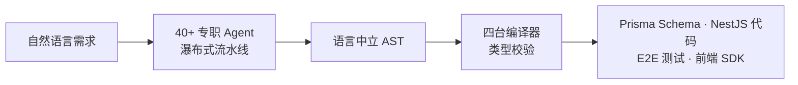

# AutoBE：用 AST 兜底的 AI 后端生成器，能交付到什么程度

AutoBE 由韩国团队 wrtnlabs 开源，定位是 AI 后端构建器（GitHub 简介的最新说法是 "AI Vibe Coding Agent of TS backend server"）：输入自然语言需求，输出包含数据库 Schema、API 控制器、DTO（Data Transfer Object，数据传输对象）、E2E（end-to-end，端到端）测试和 NestJS 实现的完整后端工程，外加一份类型安全的前端 SDK。它保证的是一件事——生成的代码 100% 能通过编译。它不保证的是另一件事——代码跑起来行为正确。这两句话之间的落差，就是理解 AutoBE 的关键。

把"编译成功"从 LLM 的职责里剥离出来，交给确定性编译器，是 AutoBE 区别于"让模型直接吐代码"的地方。模型负责结构和语义，语法正确性由 AST（Abstract Syntax Tree，抽象语法树）编译管道兜底。这个切分让编译成功率成为可工程化保证的指标，也让它的适用边界相当清楚：适合快速验证想法、搭 MVP 骨架、给前端提供可联调的 mock 后端；不适合直接当生产后端交付。

截至 2026-09-19，仓库的关键数据如下，来源为 GitHub API 与仓库 README：

| 指标 | 数值 |
|------|------|
| Stars / Forks | 1,360 / 156 |
| 贡献者 | 13 |
| 最新版本 | v0.31.1（2026-04-10 发布） |
| 主语言 | TypeScript |
| 许可证 | AGPL-3.0（生成代码可另行授权，见下文） |

仓库最后一次推送停在 2026-06-24，官网路线图却已推进到 Epsilon 阶段——代码主仓库的节奏在放缓，项目并未停摆。

## 系统地图：三条互相独立的机制

理解 AutoBE 需要先拆开三条协作但职责不同的机制，避免把它们看成一条单线故事：Agent 流水线决定"能不能跑通"，AST 管道决定"产物能不能编译"，Benchmark 决定"换模型后质量会不会塌"。



### Agent 流水线：业务怎么推进

按瀑布式方法论分五个阶段，每段由专职 Agent 负责，前一阶段的产物是下一阶段的输入：

| 阶段 | 主导 Agent | 产物 |
|------|-----------|------|
| 需求分析 | Requirements Agent | 需求分析报告 |
| 数据库设计 | Database Agent | ERD + Prisma Schema |
| API 设计 | API Agent | 控制器 + DTO |
| 测试生成 | Test Agent | E2E 测试函数 |
| 实现 | Implementation Agent | NestJS 代码 |

瀑布式在这里的工程意义是降低 LLM（Large Language Model，大语言模型）的上下文负担：每个 Agent 只看前一阶段的结构化产物，不必把整个项目塞进上下文。代价是反馈慢——需求阶段的错误要等到测试阶段才暴露。

阶段不必跑满。你可以在需求分析或数据库设计后停下来，只取规格文档；也可以一路跑到实现。README 明确说明了这一点。

### AST 编译管道：质量怎么兜底

LLM 不直接产出源码，而是先构建语言中立的 AST——每个节点按预定义 Schema 生成，先过类型规则校验，再进入代码生成。五台编译器各管一段：

| 阶段 | 编译器 | 校验对象 |
|------|--------|----------|
| Database | Database Compiler | Prisma Schema 类型 |
| Interface | OpenAPI Compiler | API 规范（OpenAPI + JSON Schema） |
| Test | Test Compiler | E2E 测试代码 |
| Realize | Hybrid Compiler | NestJS 实现代码 |

任何一台编译器校验失败，产物会回退给对应的 Agent 重试。所谓"100% 编译保证"，指的就是这条循环最终落盘的代码能通过 `tsc`，而不是模型每次都一次写对。

为什么绕 AST 这一层？LLM 直接生成源码的主要失败模式是语法和类型错误，靠反复改 prompt 修正成本高且不稳定。把语法正确性交给确定性编译器后，结构错误在概念阶段就被拦下；同时语言中立的 AST 为多语言扩展留了口子——Java/Spring 生成已在路线图中落地了一部分（见路线图一节）。代价是 Agent 的产出受 AST 表达能力约束，复杂业务逻辑需要 Implementation Agent 在源码层补齐。

### Benchmark 系统：模型怎么选

`packages/estimate` 内置一套评估流程，在 todo、reddit、shopping、erp 四个固定项目上跑同一组需求，对比不同 LLM 的生成质量。AutoBE 团队用它回归验证 Agent 改动，使用者用它决定该选哪个模型。榜单数字在 Benchmark 一节细说。

## 快速启动

```bash
git clone https://github.com/wrtnlabs/autobe --depth=1
cd autobe
pnpm install
pnpm run playground
```

启动后访问 `http://localhost:5173`。Playground 提供对话界面和会话 Replay（`/replay/index.html`），后者可以回看官方测试与 Benchmark 的完整会话记录，是理解 Agent 各阶段产物的捷径。

典型对话流如下，每一步对应流水线的一个阶段：

```text
需求分析："我想创建一个经济/政治讨论板。由于我不熟悉编程，请帮我撰写需求分析报告。"
数据库设计："设计数据库 Schema。"
API 规范："创建 API 接口规范。"
测试："生成 E2E 测试函数。"
实现："实现 API 函数。"
```

## 任务流案例：ERP 项目从需求到代码

官方示例仓库 `wrtnlabs/autobe-examples` 里的 `erp` 项目（`z-ai/glm-5/erp` 路径）是一次完整生成的存档。ERP 适合当案例，因为它涉及多实体关联、复杂权限和大量 API，最能暴露 Agent 协作的成色：

```text
erp/
├── docs/
│   ├── analysis/          # 阶段 1：需求分析报告
│   └── ERD.md             # 阶段 2：实体关系图
├── prisma/
│   └── schema/            # 阶段 2：Prisma Schema
├── src/
│   ├── controllers/       # 阶段 3：API 控制器
│   ├── api/
│   │   └── structures/    # 阶段 3：DTO
│   └── providers/         # 阶段 5：NestJS 实现
└── test/
    └── features/
        └── api/           # 阶段 4：E2E 测试
```

Requirements Agent 产出结构化分析报告（领域实体、业务规则、用例清单），Database Agent 把它变成 ERD 和 Prisma Schema，API Agent 基于 Schema 生成控制器声明与 DTO，Test Agent 依据控制器签名写 E2E 测试，Implementation Agent 最后在 `src/providers/` 补全逻辑。每个环节的产物先过编译器校验再落盘，失败即回退重试。

这份存档的价值在于：五个阶段的产物全部可查，你可以在写第一行 prompt 之前，先看看这条流水线在真实项目上交出了什么。

## 类型安全 SDK：前端怎么消费

每个生成的后端自带 TypeScript SDK，由 AST 编译管道同步生成，字段类型与后端 DTO 完全一致：

```typescript
import api, { IPost } from "autobe-generated-sdk";

const connection: api.IConnection = {
  host: "http://localhost:1234",
};

const post: IPost = await api.functional.posts.create(connection, {
  body: {
    title: "Hello World",
    content: "My first post",
    // authorId: "123" <- 缺少必填字段时 TypeScript 编译报错
  },
});
```

前端框架无关，React/Vue/Angular 或任意 TS 项目都能直接消费。E2E 测试也用同一份 SDK 编写，测试走的调用路径和前端一致——模型生成的测试因此有了确定的类型契约，不靠猜。

## Benchmark 榜单怎么读

评估分两层：先过 Gate（TypeScript 编译 + ESLint，不过直接判零），再按六个维度打分——编译正确性、文档质量、需求覆盖、测试覆盖、逻辑完整性、API 完整性——外加三个 AI 评审 Agent 分别检查安全性、代码质量和幻觉（识别未实现函数与伪造逻辑）。每个模型 0-100 分，A-F 级。

榜单测的是：固定 4 个项目、相同需求输入下，各 LLM 产出可编译后端的工程完整度。它反映的是"在这个项目规模下模型的产出质量"，不能推出三件事：运行时正确性（Gate 只查编译和静态检查）、自定义业务场景的表现（4 个项目覆盖的实体关系有限）、长期维护成本（评估只看首次生成）。

以下榜单摘自仓库 README（2026-09-19 抓取），完整榜单见[官网 Benchmark 页](https://autobe.dev/benchmark/)：

| 模型 | Todo | Reddit | Shopping | ERP | 平均 |
|-------|------|--------|----------|-----|------|
| glm-5 | 88 (B) | 87 (B) | 82 (B) | 87 (B) | **86** |
| claude-sonnet-4.6 | 87 (B) | 85 (B) | 72 (C) | 85 (B) | 82 |
| gpt-5.4-mini | 89 (B) | 87 (B) | 74 (C) | 78 (C) | 82 |
| qwen3-coder-next | 86 (B) | 76 (C) | 75 (C) | 88 (B) | 81 |
| qwen3.5-27b | 88 (B) | 81 (B) | 77 (C) | 78 (C) | 81 |
| minimax-m2.7 | 90 (A) | 71 (C) | 77 (C) | 79 (C) | 79 |
| gpt-5.4 | 79 (C) | 78 (C) | 79 (C) | 80 (B) | 79 |

两个读法经得起对照：glm-5 平均分领先且四个项目全部 B 级，是榜单上最稳的一个；Shopping 几乎是所有模型的最低列，电商领域的实体关系复杂度可能是主因。选型时优先看与目标项目复杂度最接近的那一列，平均分参考价值有限。

复现命令：

```bash
pnpm estimate                          # 评估所有模型
pnpm estimate -- --model kimi-k2.5     # 评估单个模型
pnpm estimate -- --project todo        # 评估单个项目
```

报告落在 `packages/estimate/reports/benchmark/{model}/{project}/estimate-report.json`。

## 当前局限与成本

README 的 Current Limitations 一节列了四条，全部值得当真：

- **运行时行为**。编译通过不等于运行正确——数据库连接、API 端点、业务逻辑的运行期错误都可能漏到执行阶段。官方建议生产部署前在开发环境充分测试。
- **设计理解偏差**。AI 生成的库表和 API 设计可能与预期不同，进入实现前先人工审查规格。
- **Token 消耗**。官方测试数据：简单 todo 项目约 4M tokens，复杂项目落在 30M-250M+ 区间，电商类复杂项目可达 250M+。官方没有公布按项目类型的细分数字，用高阶商用模型时这笔开销要先估算。
- **不负责维护**。AutoBE 只管首次生成，bug 修复、性能优化、安全更新都要自己接手，官方建议搭配 Claude Code 之类的编码助手做后续维护。

## 路线图：Epsilon 把目标从编译转向运行时

Alpha、Beta、Gamma 三个阶段已完成，奠定了基础架构、RAG（Retrieval-Augmented Generation，检索增强生成）与模块化。Delta 已收尾：官网 Epsilon 路线图页披露，模块化重构曾把编译成功率拉低到 40%，Delta 用 Qwen3 等开源模型反复跑基准、强化验证逻辑，把它重新拉回 100%——这解释了为什么 Delta 的重点是"纵深加固"而非新功能。

当前的 **Epsilon 阶段（active）** 把目标从编译转向运行时，官网的说法是在三个月内把运行时成功率做到 100%。主要工作项：

- **Runtime Feedback Agent**：实际运行生成的后端与 E2E 测试，收集失败信息反馈给管道重新生成——相当于给运行时配一个 Delta 式的反馈循环。
- **Estimation Agent 与 Benchmark Pipeline**：多维度评估生成物质量；多模型 × 多场景的自动化实验框架。
- **Spiral Workflow**：允许阶段回退，比如 Interface 阶段发现数据库缺陷时退回 Database 阶段，缓解瀑布式反馈慢的问题。
- **Human Modification Support**：解析用户手改后的 Prisma Schema 和 Controller/DTO 代码，回写进 AutoBE 的 AST——这项在 Delta 被延后，Epsilon 恢复。
- **Lazy Joining ORM**：研究性项目，用 ORM 包装层兼顾多语言（如 Java Hibernate）与更低的运行时错误率。

对照现状看，这份路线图回答的是本文开头的落差：编译保证已经做到，运行时保证正在补。

## 许可证：工具链 copyleft，产物自由

AutoBE 本体是 AGPL-3.0：修改后分发或做成网络服务，必须按同协议开源。但生成的后端应用不受约束，可以任选许可证（MIT、Apache、商业闭源均可）。工具链强 copyleft、产物不约束，这个组合对商业使用相当友好——用它的成本主要是 token，不是法务。

## 采用建议

**值得用的场景**：几小时内要一个可编译、带测试的后端骨架验证产品想法；前端团队要类型对齐的可联调 mock 后端；想横向对比不同 LLM 在结构化代码生成上的工程能力。

**先别用的场景**：目标是生产后端且对运行时正确性有硬性要求（金融、交易、医疗）；业务领域高度定制且没有预算做 token 消耗验证；团队已有成熟的架构范式，而 AutoBE 生成的 NestJS 结构与之差异大。

**上手顺序**：先跑 `todo` 示例熟悉 Playground 和各阶段产物；再用一个内部小项目试跑，重点看需求分析报告是否符合预期；然后跑 Benchmark 选定当前性价比最高的模型；最后把生成产物当起点，用 Claude Code 或人工补齐运行时逻辑和边界用例。

AutoBE 真正推进的是一件事：把"AI 生成后端"从一次性 demo 变成可复现的工程流程。把它当"快速拿到可编译骨架的流水线"用，符合当前版本的实际能力；当"替代后端工程师的方案"用，则超出了它能兑现的承诺。

## 常见问题

**生成的代码能直接上生产吗？** 不能直接上。编译保证不含运行时保证，这正是 Epsilon 阶段要解决的问题。生成的代码当起点，人工 review 加测试之后再谈生产。

**支持哪些技术栈？** 目前是 TypeScript + Prisma + NestJS。Java/Spring 的部分能力已在路线图中落地（Database、Interface 阶段），完整支持还在推进。AST 架构理论上可扩展到其他语言，前提是为每种语言开发对应的编译器。

**成本主要花在哪？** LLM API 调用。每个 Agent 阶段都要调模型，复杂项目 30M-250M+ tokens 的官方数字要当预算输入，先用 Benchmark 选模型，再从小项目试起。

**手改了生成的代码，还能继续用 AutoBE 迭代吗？** 目前只能通过会话 Replay 回放生成过程、调整需求重新生成。解析手改代码回写 AST 的能力在 Epsilon 路线图中恢复开发，尚未发布。

## 资源与数据来源

| 资源 | 链接 |
|------|------|
| GitHub 仓库 | <https://github.com/wrtnlabs/autobe> |
| 官网与文档 | <https://autobe.dev> / <https://autobe.dev/docs> |
| Benchmark 榜单 | <https://autobe.dev/benchmark> |
| npm 包 | <https://www.npmjs.com/package/@autobe/agent> |
| 示例仓库 | <https://github.com/wrtnlabs/autobe-examples> |
| Discord | <https://discord.gg/aMhRmzkqCx> |

仓库数据（Stars、Forks、贡献者、版本、最后推送时间）核验于 2026-09-19（GitHub API）；架构描述、局限与 Token 消耗数字来自仓库 README；Epsilon 阶段目标来自[官网路线图](https://autobe.dev/docs/roadmap/epsilon)；Benchmark 榜单摘自 README。项目仍在迭代，包结构、模型榜单与路线图状态以 GitHub 和官网最新数据为准。
