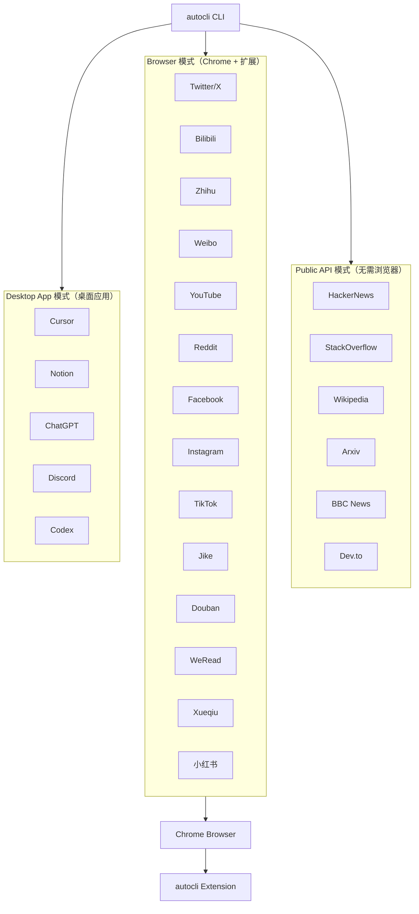

# AutoCLI Skill：AI Agent 多平台浏览器自动化工具

## 🎯 概述

**AutoCLI Skill** 是一个为 Claude Code/OpenClaw/AI Agent 打造的终极平台集成工具，让 AI 能够像人一样操控 55+ 个主流平台——无需 API Key、无需复杂配置、直接复用你 Chrome 浏览器里已有的登录态。

> **GitHub**: [nashsu/autocli-skill](https://github.com/nashsu/autocli-skill)  
> **Stars**: 582 ⭐  
> **Forks**: 62  
> **核心特性**: 55+平台支持 | 零 API Key | Chrome 登录态复用 | Rust 编写 | 4.7MB 二进制

### 一句话定位

**"Give your AI Agent the ability to reach information across the entire web"** —— 让 AI Agent 能够像人一样浏览整个互联网。

### 解决的核心痛点

| 痛点 | 传统方案 | AutoCLI Skill |
|------|---------|--------------|
| AI 无法访问社交媒体 | 手动复制粘贴 | 自然语言控制 |
| 各平台 API 申请复杂 | API Key 申请流程繁琐 | 零配置，复用 Chrome 登录态 |
| Playwright 自动化门槛高 | 需要处理 Cookie、UA、指纹 | 一条命令搞定 |
| 跨平台数据采集困难 | 每个平台单独写爬虫 | 统一 CLI 接口 |
| 桌面应用控制复杂 | App API 各不相同 | 标准化命令控制 |

---

## 🏛️ 系统架构

### 核心设计：三重模式覆盖

AutoCLI Skill 的架构设计围绕三种不同的平台访问模式展开，确保对 55+ 平台的全覆盖：



### 三种模式的对比

| 模式 | 是否需要 Chrome | 是否需要扩展 | 是否需要桌面应用 | 代表平台 |
|------|----------------|-------------|----------------|---------|
| **Public API** | ❌ 否 | ❌ 否 | ❌ 否 | HackerNews, Wikipedia, Arxiv, BBC |
| **Browser** | ✅ 是 | ✅ 是 | ❌ 否 | Twitter/X, Bilibili, Zhihu, YouTube, Reddit |
| **Desktop App** | ❌ 否 | ❌ 否 | ✅ 是 | Cursor, Notion, ChatGPT, Discord, Codex |

### 技术选型分析

| 技术选型 | 理由 | 权衡 |
|---------|------|------|
| **Rust 编写** | 极致性能、内存安全、零依赖 | 学习曲线较陡 |
| **复用 Chrome 登录态** | 绕过 OAuth、API Key 申请流程 | 依赖 Chrome 环境 |
| **CLI 优先** | 轻量、可脚本化、易于 AI 调用 | 无原生 GUI |
| **单一二进制** | 4.7MB、下载即用 | 功能复杂度受限于 CLI |

---

## 🔌 55+平台支持详解

### 社交媒体矩阵

| 平台 | 模式 | 命令数量 | 核心功能 |
|------|------|---------|---------|
| **Twitter/X** | Browser | 24 个 | trending, timeline, post, reply, search, bookmarks, profile |
| **Bilibili (B 站)** | Browser | 12 个 | hot, search, me, favorite, history, feed, subtitle, download |
| **Zhihu (知乎)** | Browser | 4 个 | hot, search, question, download |
| **Weibo (微博)** | Browser | 2 个 | hot, search |
| **Reddit** | Browser | 15 个 | hot, frontpage, popular, search, subreddit, upvote, comment |
| **Facebook** | Browser | 10 个 | feed, profile, search, friends, groups, events |
| **Instagram** | Browser | 14 个 | explore, profile, search, follow, like, comment |
| **TikTok** | Browser | 15 个 | explore, search, profile, follow, like, comment |
| **Jike (即刻)** | Browser | 10 个 | feed, search, create, like, comment, repost |

### 视频与内容平台

| 平台 | 模式 | 命令数量 | 核心功能 |
|------|------|---------|---------|
| **YouTube** | Browser | 3 个 | search, video, transcript |
| **小红书** | Browser | 11 个 | search, feed, user, publish, creator-notes |
| **Douban (豆瓣)** | Browser | 7 个 | search, top250, subject, movie-hot, book-hot |
| **Medium** | Browser | 3 个 | feed, search, user |
| **Substack** | Browser | 3 个 | feed, search, publication |

### 桌面应用控制

| 应用 | 模式 | 命令数量 | 核心功能 |
|------|------|---------|---------|
| **Cursor** | Desktop | 12 个 | status, send, read, new, dump, composer, model, ask |
| **Notion** | Desktop | 8 个 | status, search, read, new, write, sidebar, favorites, export |
| **ChatGPT** | Desktop | 5 个 | status, new, send, read, ask |
| **Discord** | Desktop | 6 个 | status, send, read, channels, servers, search, members |
| **Codex** | Desktop | 11 个 | status, send, read, new, dump, model, ask |

### 金融数据平台

| 平台 | 模式 | 命令数量 | 核心功能 |
|------|------|---------|---------|
| **Yahoo Finance** | Browser | 1 个 | quote |
| **Xueqiu (雪球)** | Browser | 7 个 | feed, hot-stock, hot, search, stock, watchlist |
| **Bloomberg** | Public/Browser | 10 个 | main, markets, economics, tech, politics |

### 开发者平台

| 平台 | 模式 | 命令数量 | 核心功能 |
|------|------|---------|---------|
| **HackerNews** | Public | 8 个 | top, new, best, ask, show, jobs, search, user |
| **StackOverflow** | Public | 4 个 | hot, search, bounties, unanswered |
| **Dev.to** | Public | 3 个 | top, tag, user |
| **Lobsters** | Public | 4 个 | hot, newest, active, tag |
| **Wikipedia** | Public | 4 个 | search, summary, random, trending |
| **Arxiv** | Public | 2 个 | search, paper |
| **V2EX** | Public/Browser | 11 个 | hot, latest, topic, node, user, daily, me |

### 命令行工具集成

| 工具 | 模式 | 功能 |
|------|------|------|
| **GitHub CLI** | Desktop | issues, pr, repo, gh |
| **Docker** | Desktop | ps, images, run, logs |
| **kubectl** | Desktop | get, describe, logs, exec |

---

## 🚀 安装与配置

### 前置条件

安装 AutoCLI Skill 前，需要确认以下条件：

- [ ] **Chrome 浏览器** 已打开，并已登录目标网站
- [ ] **autocli Chrome 扩展** 已安装（从 [GitHub Releases](https://github.com/nashsu/AutoCLI/releases/latest) 下载）

### 安装步骤

#### 方式一：让 AI Agent 帮你安装（推荐）

```
Help me install this skill: https://github.com/nashsu/AutoCLI-skill
```

#### 方式二：手动安装

```bash
# 1. 安装 autocli CLI 工具
# 参考：https://github.com/nashsu/AutoCLI

# 2. 安装本 Skill
npx skills add https://github.com/nashsu/AutoCLI-skill

# 3. 重启 Claude Code 激活 Skill
```

### 验证安装

```bash
# 检查 autocli 是否安装成功
autocli --version

# 查看所有可用命令
autocli --help

# 运行诊断
autocli doctor
```

---

## 📖 使用方法

### 自然语言交互示例

确保 Chrome 已打开且已登录目标网站，然后对 Claude Code 说：

```
"Search YouTube for LLM tutorials"
"What's trending on Twitter right now?"
"Get the top 20 stories on HackerNews"
"Search Reddit r/MachineLearning for transformer papers"
"Check AAPL stock price"
"Post a tweet: Just discovered Claude Code skills!"
"What's hot on Bilibili?"
"Search Douban for top-rated movies"
"Check my WeRead highlights"
```

Claude 会自动调用正确的 autocli 命令，运行后以表格形式展示结果，英文标题附带中文翻译。

### 命令行直接调用

```bash
# Bilibili
autocli bilibili hot --limit 10 --format json
autocli bilibili search --keyword "AI"

# Twitter/X
autocli twitter timeline --format json
autocli twitter post --text "Hello from Claude!"
autocli twitter search "claude AI" --limit 10

# YouTube
autocli youtube search --query "LLM tutorial"
autocli youtube transcript --video-id YOUR_VIDEO_ID

# HackerNews
autocli hackernews top --limit 20 --format json

# Reddit
autocli reddit hot --subreddit MachineLearning

# Yahoo Finance
autocli yahoo-finance quote --symbol AAPL

# 雪球
autocli xueqiu stock --symbol SH600519   # 茅台行情
autocli xueqiu watchlist                  # 我的自选股

# 豆瓣
autocli douban top250 --format json

# Cursor
autocli cursor status
autocli cursor send --text "Write a function to..."

# Notion
autocli notion search "会议记录"
autocli notion new --title "New Page"
```

---

## 🔧 命令参考

### Twitter/X 命令（24 个）

| 命令 | 功能 | 示例 |
|------|------|------|
| `twitter trending` | 获取热搜 | `autocli twitter trending` |
| `twitter timeline` | 获取时间线 | `autocli twitter timeline --limit 20` |
| `twitter post` | 发布推文 | `autocli twitter post --text "Hello"` |
| `twitter reply` | 回复推文 | `autocli twitter reply --id 123 --text "Reply"` |
| `twitter search` | 搜索推文 | `autocli twitter search "AI" --limit 10` |
| `twitter bookmarks` | 获取收藏 | `autocli twitter bookmarks` |
| `twitter profile` | 获取用户信息 | `autocli twitter profile --user username` |
| `twitter article` | 获取推文文章 | `autocli twitter article --id 123` |

### Bilibili 命令（12 个）

| 命令 | 功能 | 示例 |
|------|------|------|
| `bilibili hot` | 获取热门 | `autocli bilibili hot --limit 10` |
| `bilibili search` | 搜索视频 | `autocli bilibili search --keyword "教程"` |
| `bilibili me` | 我的信息 | `autocli bilibili me` |
| `bilibili favorite` | 我的收藏 | `autocli bilibili favorite` |
| `bilibili history` | 浏览历史 | `autocli bilibili history` |
| `bilibili feed` | 推荐 feed | `autocli bilibili feed` |
| `bilibili subtitle` | 获取字幕 | `autocli bilibili subtitle --avid 123` |
| `bilibili download` | 下载视频 | `autocli bilibili download --avid 123` |

### HackerNews 命令（8 个）

| 命令 | 功能 | 示例 |
|------|------|------|
| `hackernews top` | 热榜 | `autocli hackernews top --limit 20` |
| `hackernews new` | 最新 | `autocli hackernews new --limit 20` |
| `hackernews best` | 精华 | `autocli hackernews best --limit 20` |
| `hackernews ask` | Ask HN | `autocli hackernews ask --limit 10` |
| `hackernews show` | Show HN | `autocli hackernews show --limit 10` |
| `hackernews jobs` | 招聘 | `autocli hackernews jobs --limit 10` |
| `hackernews search` | 搜索 | `autocli hackernews search "keyword"` |
| `hackernews user` | 用户信息 | `autocli hackernews user --name username` |

### Cursor 控制命令（12 个）

| 命令 | 功能 | 示例 |
|------|------|------|
| `cursor status` | 状态 | `autocli cursor status` |
| `cursor send` | 发送消息 | `autocli cursor send --text "Hello"` |
| `cursor read` | 读取响应 | `autocli cursor read` |
| `cursor new` | 新对话 | `autocli cursor new` |
| `cursor dump` | 导出历史 | `autocli cursor dump` |
| `cursor composer` | Composer 模式 | `autocli cursor composer` |
| `cursor model` | 切换模型 | `autocli cursor model` |
| `cursor ask` | 提问 | `autocli cursor ask --text "How do I..."` |

### Notion 控制命令（8 个）

| 命令 | 功能 | 示例 |
|------|------|------|
| `notion status` | 状态 | `autocli notion status` |
| `notion search` | 搜索页面 | `autocli notion search "keyword"` |
| `notion read` | 读取页面 | `autocli notion read --page-id xxx` |
| `notion new` | 新建页面 | `autocli notion new --title "Title"` |
| `notion write` | 写入内容 | `autocli notion write --page-id xxx --content "..."` |
| `notion sidebar` | 侧边栏 | `autocli notion sidebar` |
| `notion favorites` | 收藏页面 | `autocli notion favorites` |
| `notion export` | 导出页面 | `autocli notion export --page-id xxx` |

---

## 🐛 故障排除

### 常见问题与解决方案

| 问题 | 原因 | 解决方案 |
|------|------|---------|
| `autocli: command not found` | 未正确安装 | 重新运行安装脚本，检查 PATH |
| Chrome 无法被控制 | Chrome 未打开 | 确保 Chrome 已启动 |
| 登录态未识别 | 未在 Chrome 中登录 | 在 Chrome 中手动登录目标网站 |
| Browser 命令超时 | 网络问题 | 运行 `autocli doctor` 进行诊断 |
| 扩展未加载 | 扩展未启用 | 检查 Chrome 扩展管理器 |

### 诊断命令

```bash
# 运行完整诊断
autocli doctor

# 检查特定平台
autocli doctor --platform twitter

# 查看详细日志
autocli --debug twitter trending
```

---

## 🆚 与同类工具对比

| 特性 | AutoCLI Skill | Playwright | Puppeteer | Selenium |
|------|---------------|-------------|------------|----------|
| **安装复杂度** | ⭐ 极简（一条命令） | ⭐ 简单 | ⭐ 简单 | ⭐⭐ 中等 |
| **登录态管理** | ✅ 自动复用 Chrome | ❌ 需手动处理 | ❌ 需手动处理 | ❌ 需手动处理 |
| **API Key** | ❌ 不需要 | N/A | N/A | N/A |
| **跨平台支持** | ✅ 55+ | ❌ 需单独配置 | ❌ 需单独配置 | ❌ 需单独配置 |
| **桌面应用控制** | ✅ Cursor/Notion 等 | ❌ 不支持 | ❌ 不支持 | ❌ 不支持 |
| **二进制大小** | ✅ 4.7MB | ❌ Node.js 依赖 | ❌ Node.js 依赖 | ❌ Java 依赖 |
| **AI 集成** | ✅ 原生支持 | ❌ 需包装 | ❌ 需包装 | ❌ 需包装 |

---

## 🎓 设计原则总结

### 核心设计理念

1. **复用优于重造**：不重新发明轮子，直接复用用户已有的 Chrome 登录态
2. **CLI 优先**：轻量、可组合、易于 AI 调用
3. **零配置**：下载即用，无需复杂配置
4. **统一接口**：55+ 平台，统一的 CLI 接口

### 可复用的架构经验

| 经验 | 应用场景 |
|------|---------|
| **复用而非重建** | 当平台已有完善认证时，复用是最快路径 |
| **CLI 作为桥梁** | CLI 是 AI 与系统交互的最佳界面 |
| **三重模式覆盖** | Public API → Browser → Desktop，覆盖所有场景 |
| **单二进制分发** | 4.7MB 零依赖 vs Node.js 数百 MB 依赖 |

### 常见陷阱

| 陷阱 | 避免方法 |
|------|---------|
| **过度依赖浏览器** | Public API 优先，减少依赖 |
| **登录态失效** | 定期验证 Chrome 登录状态 |
| **平台变更** | 关注平台 UI 变化，及时更新选择器 |

---

## 🔗 资源链接

| 资源 | 链接 |
|------|------|
| GitHub 仓库 | [nashsu/autocli-skill](https://github.com/nashsu/autocli-skill) |
| AutoCLI 核心 | [nashsu/AutoCLI](https://github.com/nashsu/AutoCLI) |
| Chrome 扩展下载 | [AutoCLI Releases](https://github.com/nashsu/AutoCLI/releases/latest) |
| 相关项目 | [nashsu/autocli-skill (Skill版)](https://github.com/nashsu/autocli-skill) |

---

## 📊 平台覆盖一览

```
社交媒体 (8)
├── Twitter/X (24 commands)
├── Bilibili (12 commands)
├── Zhihu (4 commands)
├── Weibo (2 commands)
├── Reddit (15 commands)
├── Facebook (10 commands)
├── Instagram (14 commands)
└── TikTok (15 commands)

视频内容 (5)
├── YouTube (3 commands)
├── 小红书 (11 commands)
├── Douban (7 commands)
├── Medium (3 commands)
└── Substack (3 commands)

桌面应用 (5)
├── Cursor (12 commands)
├── Notion (8 commands)
├── ChatGPT (5 commands)
├── Discord (6 commands)
└── Codex (11 commands)

开发者平台 (6)
├── HackerNews (8 commands)
├── StackOverflow (4 commands)
├── Dev.to (3 commands)
├── Lobsters (4 commands)
├── Wikipedia (4 commands)
└── Arxiv (2 commands)

金融数据 (3)
├── Yahoo Finance (1 command)
├── Xueqiu (7 commands)
└── Bloomberg (10 commands)

其他平台 (4)
├── V2EX (11 commands)
├── GitHub CLI
├── Docker
└── kubectl
```

---

*🦞 AutoCLI Skill：让 AI Agent 真正掌控互联网，55+ 平台，一个命令搞定。*
