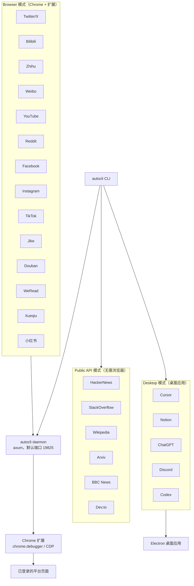

# AutoCLI Skill：AI Agent 多平台浏览器自动化工具

## 一句话判断

AutoCLI Skill 把"AI Agent 操控 55 个站点、333 条命令"这件事压成一个 4.7MB 的 Rust 二进制加一个 Chrome 扩展，靠复用浏览器已有登录态绕开 OAuth 与 API Key 申请，代价是 Chrome 必须保持运行并登录目标平台、且依赖平台前端结构稳定。它适合个人开发者快速搭建跨平台信息流助手，不适合做生产级多租户服务；另外仓库主分支与 release 都停在 2026 年 4 月下旬（2026-10-01 复核），选型时要把这点计入。

> 本文 2026-04-22 首发，2026-10-01 对照仓库复核更新。Stars/Forks/命令数均可能随版本变化，请以仓库主页与 `autocli --help` 输出为准。

先分清两个名字：**AutoCLI** 是 CLI 本体（`nashsu/AutoCLI`），负责真正执行；**AutoCLI Skill** 是把它接进 Claude Code/OpenClaw 的技能包（`nashsu/autocli-skill`），里面是一份让 AI Agent 学会调用这些命令的说明书。本文两者都讲，安装、使用以 Skill 为主，机制以 CLI 本体为主。

## 学习目标

读完本文应能：

1. 说清 AutoCLI 的三种访问模式（Public API / Browser / Desktop）各自的适用场景和运行前提
2. 解释"复用 Chrome 登录态"的代价与边界，能判断某个业务场景是否适合用 AutoCLI
3. 根据业务需求（如"聚合 HackerNews 和 B 站热榜"）选出正确的模式并写出对应命令
4. 识别 Browser 模式下的常见失效信号（平台改版、Chrome 未打开、daemon 或扩展连接断开、登录态失效）并知道如何诊断
5. 对比 AutoCLI 与 Playwright/Puppeteer 的取舍，能向团队解释"为什么选它"和"什么时候不该用"
6. 用 explore/generate 或手写 YAML adapter 把一个未内置的网站接入 autocli，并说清云路径与本地路径的依赖差异

## 目录

- [一句话判断](#一句话判断)
- [学习目标](#学习目标)
- [它解决什么问题](#它解决什么问题)
- [总览地图：三重模式如何分工](#总览地图三重模式如何分工)
- [技术选型背后的取舍](#技术选型背后的取舍)
- [核心机制：一条命令背后的四层结构](#核心机制一条命令背后的四层结构)
- [性能数据怎么读](#性能数据怎么读)
- [平台支持矩阵](#平台支持矩阵)
- [安装与配置](#安装与配置)
- [任务流案例：从自然语言到平台动作](#任务流案例从自然语言到平台动作)
- [使用方法](#使用方法)
- [命令参考](#命令参考)
- [扩展新站点：explore、generate 与 adapter 市场](#扩展新站点exploregenerate-与-adapter-市场)
- [故障排除](#故障排除)
- [与同类工具对比](#与同类工具对比)
- [采用建议](#采用建议)
- [自测题](#自测题)
- [进阶路径](#进阶路径)
- [资源链接](#资源链接)

## 它解决什么问题

让 AI Agent 跨平台获取信息或执行动作，传统路径有三条，每条都有明显成本：

| 痛点 | 传统方案 | 实际成本 |
|------|---------|---------|
| AI 无法访问社交媒体 | 手动复制粘贴 | 上下文断裂，无法批量 |
| 各平台 API 申请复杂 | 申请 API Key | Twitter/X 等平台已关闭免费 API，部分平台需企业资质 |
| Playwright 自动化门槛高 | 自行处理 Cookie、UA、指纹 | 每个平台单独写选择器，维护成本高 |
| 跨平台数据采集困难 | 每个平台单独写爬虫 | 反爬升级即失效 |
| 桌面应用控制复杂 | 各 App API 不互通 | Cursor/Notion 无统一接口 |

AutoCLI Skill 的取舍是：放弃多租户与并发能力，换"零配置 + 复用登录态 + 统一 CLI 接口"。这套取舍成立的前提是单用户、单机、Chrome 常驻。

## 总览地图：三重模式如何分工

AutoCLI 的 55 个站点按访问方式分成三组互不重叠的模式。理解这三组的边界，是判断某个平台能否被支持、以及为什么命令数量差异巨大的关键。


```mermaid
graph TB
 subgraph Public_API["Public API 模式（无需浏览器）"]
 HN[HackerNews]
 SO[StackOverflow]
 WIKI[Wikipedia]
 ARXIV[Arxiv]
 BBC[BBC News]
 DEV[Dev.to]
 end

 subgraph Browser_Mode["Browser 模式（Chrome + 扩展）"]
 TW[Twitter/X]
 BB[Bilibili]
 ZH[Zhihu]
 WB[Weibo]
 YT[YouTube]
 RD[Reddit]
 FB[Facebook]
 IG[Instagram]
 TT[TikTok]
 JK[Jike]
 DB[Douban]
 WR[WeRead]
 XQ[Xueqiu]
 BH[小红书]
 end

 subgraph Desktop_Mode["Desktop 模式（桌面应用）"]
 CU[Cursor]
 NT[Notion]
 CG[ChatGPT]
 DC[Discord]
 CX[Codex]
 end

 CLI[autocli CLI] --> Public_API
 CLI --> Daemon[autocli daemon<br/>axum，默认端口 19825]
 Daemon --> Ext[Chrome 扩展<br/>chrome.debugger / CDP]
 Ext --> Page[已登录的平台页面]
 Browser_Mode --> Daemon
 CLI --> Desktop_Mode
 Desktop_Mode --> App[Electron 桌面应用]
```

三种模式的边界如下表。是否需要 Chrome、是否需要扩展、是否需要桌面应用，决定了同一套 CLI 在不同平台上的运行前提。

| 模式 | 是否需要 Chrome | 是否需要扩展 | 是否需要桌面应用 | 代表平台 |
|------|----------------|-------------|----------------|---------|
| **Public API** | 否 | 否 | 否 | HackerNews, Wikipedia, Arxiv, BBC |
| **Browser** | 是 | 是 | 否 | Twitter/X, Bilibili, Zhihu, YouTube, Reddit |
| **Desktop** | 否 | 否 | 是 | Cursor, Notion, ChatGPT, Discord, Codex |

这三条路径的分工由平台的开放程度决定。Public API 模式走平台开放接口，最稳定也最快，但能覆盖的平台有限——多数社交平台已关闭公开 API。Browser 模式靠 Chrome 扩展注入脚本操作页面，覆盖面最广，代价是受平台前端改版影响。Desktop 模式面向 Cursor、Notion 这类 Electron 桌面应用（README 对它的定位是 "controlling Electron desktop apps"），填补了它们没有 Web API 的空白。三类平台形态各不相同，少任何一条路径，对应形态的平台就接不进来。

## 技术选型背后的取舍

| 技术选型 | 理由 | 代价 |
|---------|------|------|
| **Rust 编写** | 单二进制分发，启动快，内存安全 | 贡献门槛高于 Node.js/Python |
| **复用 Chrome 登录态** | 绕过 OAuth 申请与 API Key 配置 | 强依赖 Chrome 进程常驻，无法多用户隔离 |
| **CLI 优先** | 文本输入输出天然适配 LLM | 无原生 GUI，非技术用户上手需借助 AI Agent |
| **Chrome 扩展注入** | 直接操作已登录页面的 DOM | 平台前端改版即失效，需维护选择器 |
| **声明式 YAML pipeline** | 333 条命令全部是 YAML 定义的 adapter，加新站点零 Rust 代码 | 复杂交互仍需在 pipeline 里写 JS 片段 |

4.7MB 二进制大小是相对于原版 opencli（Node.js 运行时 + 约 50MB 的 node_modules）的对比结论，来自 README 的性能对照表。这个数字会随平台命令增加而增长，建议以仓库 Releases 页最新版本为准。

### 从 opencli 到 AutoCLI

AutoCLI 前身名为 opencli-rs，从 v0.2.4 起改为现名；它是对 jackwener/opencli（TypeScript）的纯 Rust 重写，README 致谢一节写明 "built on top of OpenCLI"，仓库里的 adapter YAML 文件头部至今保留 "Adapter logic derived from OpenCLI" 的标注。重写的收益不只是体积：模板引擎从 JS eval 换成 pest PEG 解析器（README 标注原方案有安全风险），非浏览器并发抓取从 5 提到 10，HTTP 连接改用 reqwest 连接池复用，错误信息从单条提示改为带建议的结构化错误链。

## 核心机制：一条命令背后的四层结构

`autocli bilibili hot --limit 10` 这样一条命令，实际穿过四层。

**第一层：YAML adapter。** 333 条内置命令全部是 YAML 定义的 adapter，编译时由 build.rs 嵌进二进制，运行时零文件读取——这也是单二进制能保持启动速度的原因。每个 adapter 声明站点、认证策略、参数和一条 pipeline；pipeline 由 fetch、evaluate、navigate、click、select、map、filter、sort、limit、intercept 等十余种步骤组成，配合 `${{ }}` 模板表达式做数据映射。自定义 adapter 只需把 YAML 文件放进 `~/.autocli/adapters/<站点>/`，不用碰 Rust 代码。

**第二层：认证策略。** 每条命令按平台接口的开放程度选择五种策略之一：

| 策略 | 含义 | 需要 Chrome |
|------|------|------------|
| `public` | 公开 API，无需认证 | 否 |
| `cookie` | 复用浏览器 Cookie | 是 |
| `header` | 需要特定请求头 | 是 |
| `intercept` | 需要拦截网络请求 | 是 |
| `ui` | 需要操作界面 | 是 |

**第三层：Browser 桥。** Browser 命令不直接操作 Chrome，而是先连接 daemon（axum 实现，默认端口 19825，可用 `OPENCLI_DAEMON_PORT` 修改），daemon 再通过 Chrome 扩展的 chrome.debugger API（CDP 协议）驱动已打开的标签页。CLI 和扩展之间因此多了一层进程，排查连接问题时要把 daemon 的状态也算进去。

**第四层：输出渲染。** 所有命令的结果走同一套渲染器，`--format` 全局参数支持 table（默认）、json、yaml、csv、md 五种格式。AI Agent 能用一套方式消费 55 个站点的输出，靠的就是这一层。

## 性能数据怎么读

README 给出一组与原版 opencli（TypeScript）的对照数字：常驻内存方面，Public 命令 15 MB 对 99 MB，Browser 命令 9 MB 对 95 MB；二进制体积 4.7 MB 对约 50 MB 的 node_modules，且零运行时依赖；端到端耗时上，`bilibili hot` 1.66 秒对 20.1 秒（12 倍），`zhihu hot` 1.77 秒对 20.5 秒，`xueqiu search` 1.82 秒对 9.2 秒。测试口径是 122 条命令、55 个站点的自动化跑批，环境为 macOS Apple Silicon。

读这组数字要分三层看：

1. **测的是什么**——内存与体积测的是分发形态（单二进制、编译期嵌入 adapter 对 Node.js 运行时加依赖目录），耗时测的是单条命令从回车到出结果的完整过程。
2. **数字主要反映什么**——12 倍的耗时差里，大头来自 opencli 侧的启动与依赖加载，而不是网络或页面渲染；Browser 命令约 2 秒的绝对耗时主要由页面加载决定，Rust 重写压缩的是命令启动的那部分开销。
3. **不能推出什么**——这组数字只对 opencli 成立，不能推广为"比所有自动化方案快 12 倍"；README 同时给出测试通过率 103/122（84%），略低于原版的 104/122（85%），意味着跑批中约六分之一的命令未通过。选型前应对自己要用的平台逐条实测，而不是默认 333 条命令全部可用。

## 平台支持矩阵

下表按平台类型分组，列出主要平台的访问模式、声明命令数与核心功能。55 个站点的完整清单见 README 或 `autocli --help`；命令数为 README 声明值，实际以命令输出为准。

### 社交媒体

| 平台 | 模式 | 命令数量 | 核心功能 |
|------|------|---------|---------|
| **Twitter/X** | Browser | 24 个 | trending, timeline, post, reply, search, bookmarks, profile |
| **Bilibili (B 站)** | Browser | 12 个 | hot, search, me, favorite, history, feed, subtitle, download |
| **Zhihu (知乎)** | Browser | 4 个 | hot, search, question, download |
| **Weibo (微博)** | Browser | 2 个 | hot, search |
| **Reddit** | Browser | 15 个 | hot, frontpage, popular, search, subreddit, upvote, comment |
| **Facebook** | Browser | 10 个 | feed, profile, search, friends, groups, events |
| **Instagram** | Browser | 14 个 | explore, profile, search, follow, like, comment |
| **TikTok** | Browser | 15 个 | explore, search, profile, follow, like, comment |
| **Jike (即刻)** | Browser | 10 个 | feed, search, create, like, comment, repost |
| **BOSS 直聘** | Browser | 14 个 | search, detail, recommend, greet, batchgreet, chatlist, resume |
| **豆包（网页版）** | Browser | 5 个 | status, new, send, read, ask |

### 视频与内容平台

| 平台 | 模式 | 命令数量 | 核心功能 |
|------|------|---------|---------|
| **YouTube** | Browser | 3 个 | search, video, transcript |
| **小红书** | Browser | 11 个 | search, feed, user, publish, creator-notes |
| **Douban (豆瓣)** | Browser | 7 个 | search, top250, subject, movie-hot, book-hot |
| **WeRead (微信读书)** | Browser | 7 个 | shelf, search, book, highlights, notes, ranking |
| **Medium** | Browser | 3 个 | feed, search, user |
| **Substack** | Browser | 3 个 | feed, search, publication |

### 桌面应用控制

| 应用 | 模式 | 命令数量 | 核心功能 |
|------|------|---------|---------|
| **Cursor** | Desktop | 12 个 | status, send, read, new, dump, composer, model, ask |
| **Notion** | Desktop | 8 个 | status, search, read, new, write, sidebar, favorites, export |
| **ChatGPT** | Desktop | 5 个 | status, new, send, read, ask |
| **Discord** | Desktop | 7 个 | status, send, read, channels, servers, search, members |
| **Codex** | Desktop | 11 个 | status, send, read, new, dump, model, ask |
| **ChatWise** | Desktop | 9 个 | status, new, send, read, ask, model, history, export, screenshot |
| **豆包桌面版** | Desktop | 7 个 | status, new, send, read, ask, screenshot, dump |
| **Antigravity** | Desktop | 8 个 | status, send, read, new, dump, extract-code, model, watch |

### 金融数据平台

| 平台 | 模式 | 命令数量 | 核心功能 |
|------|------|---------|---------|
| **Yahoo Finance** | Browser | 1 个 | quote |
| **Xueqiu (雪球)** | Browser | 7 个 | feed, hot-stock, hot, search, stock, watchlist |
| **Barchart** | Browser | 4 个 | quote, options, greeks, flow |
| **Bloomberg** | Public/Browser | 10 个 | main, markets, economics, tech, politics |

### 开发者平台

| 平台 | 模式 | 命令数量 | 核心功能 |
|------|------|---------|---------|
| **HackerNews** | Public | 8 个 | top, new, best, ask, show, jobs, search, user |
| **StackOverflow** | Public | 4 个 | hot, search, bounties, unanswered |
| **Dev.to** | Public | 3 个 | top, tag, user |
| **Lobsters** | Public | 4 个 | hot, newest, active, tag |
| **Wikipedia** | Public | 4 个 | search, summary, random, trending |
| **Arxiv** | Public | 2 个 | search, paper |
| **Google** | Public/Browser | 4 个 | news, search, suggest, trends |
| **V2EX** | Public/Browser | 11 个 | hot, latest, topic, node, user, daily, me |

### 外部 CLI 直通

除站点 adapter 外，autocli 还能透传执行本机已有的命令行工具，即 `autocli docker ps` 等价于直接运行 `docker ps`：

| 工具 | 用途 |
|------|------|
| `gh` | GitHub CLI |
| `docker` | Docker CLI |
| `kubectl` | Kubernetes CLI |
| `obsidian` | Obsidian 笔记管理 |
| `readwise` | Readwise 阅读管理 |
| `gws` | Google Workspace CLI |

透传走的是注册机制：内置工具开箱即用，自己的 CLI 可用 `autocli register mycli` 注册，注册后 AI Agent 也能发现并调用它们。

## 安装与配置

### 第一步：安装 autocli CLI

macOS / Linux 一键脚本（自动识别架构，装入 `/usr/local/bin/`）：

```bash
curl -fsSL https://raw.githubusercontent.com/nashsu/autocli/main/scripts/install.sh | sh
```

Windows（PowerShell）：

```powershell
Invoke-WebRequest -Uri "https://github.com/nashsu/autocli/releases/latest/download/autocli-x86_64-pc-windows-msvc.zip" -OutFile autocli.zip
Expand-Archive autocli.zip -DestinationPath .
Move-Item autocli.exe "$env:LOCALAPPDATA\Microsoft\WindowsApps\"
```

也可以从 [GitHub Releases](https://github.com/nashsu/autocli/releases/latest) 手动下载对应平台压缩包，解压后把 `autocli` 放进 PATH；或从源码构建：

```bash
git clone https://github.com/nashsu/autocli.git
cd autocli
cargo build --release
cp target/release/autocli /usr/local/bin/   # macOS / Linux
```

### 第二步：安装 Chrome 扩展（Browser 命令必需）

1. 从 [GitHub Releases](https://github.com/nashsu/autocli/releases/latest) 下载 `autocli-chrome-extension.zip`
2. 解压到任意目录
3. 打开 Chrome，进入 `chrome://extensions`
4. 打开右上角的"开发者模式"
5. 点击"加载已解压的扩展程序"，选择解压后的目录
6. 扩展会自动连接 autocli daemon

Public 模式命令（hackernews、devto、lobsters 等）不需要扩展即可运行。

### 第三步：安装 Skill

**方式一：让 AI Agent 帮你安装**

```text
Help me install this skill: https://github.com/nashsu/AutoCLI-skill
```

**方式二：手动安装**

```bash
npx skills add https://github.com/nashsu/AutoCLI-skill
```

安装完成后重启 Claude Code 激活 Skill。

### 验证安装

```bash
autocli --version

# 查看 55 站点 333 命令的完整清单
autocli --help

# 运行诊断
autocli doctor
```

## 任务流案例：从自然语言到平台动作

下面用一个完整任务流串起三重模式的差异。假设用户对 Claude Code 说："查一下今天 HackerNews 头条和 Twitter 热搜，把结果整理成 Markdown"。

**步骤 1：AI Agent 解析意图**

Claude Code 收到自然语言后，识别出两个子任务：HackerNews 头条（Public API 模式）和 Twitter 热搜（Browser 模式）。

**步骤 2：分别调用 autocli 命令**

```bash
# Public API 模式：无需 Chrome，直接走 HTTP
autocli hackernews top --limit 10 --format json

# Browser 模式：需要 Chrome 已打开且已登录 Twitter
autocli twitter trending --format json
```

**步骤 3：模式差异体现与结果聚合**

两条命令的返回路径完全不同：HackerNews 走公开 API 直接返回，亚秒级；Twitter 要经 daemon 转到 Chrome 扩展、注入已打开的标签页，秒级返回，且依赖 Twitter 前端结构未改版。AI Agent 拿到两份 JSON 后，按用户要求整理成 Markdown 表格。对上层调用者来说，两种模式的差异被统一的 CLI 输出格式抹平了——用户全程不需要关心背后走的是哪条路径。

## 使用方法

### 自然语言交互示例

确保 Chrome 已打开且已登录目标网站，然后对 Claude Code 说：

```text
"Search YouTube for LLM tutorials"
"What's trending on Twitter right now?"
"Get the top 20 stories on HackerNews"
"Search Reddit r/MachineLearning for transformer papers"
"Check AAPL stock price"
"Post a tweet: Just discovered Claude Code skills!"
"What's hot on Bilibili?"
"Search Douban for top-rated movies"
"Check my WeRead highlights"
```

Claude 会自动调用正确的 autocli 命令，运行后以表格形式展示结果，英文标题附带中文翻译。

### 命令行直接调用

多数命令的主参数是位置参数（直接跟在子命令后），不需要写 flag。以下示例均按 v0.3.8 二进制的 `--help` 输出与源码 adapter 定义核对过：

```bash
# Bilibili
autocli bilibili hot --limit 10 --format json
autocli bilibili search "AI"

# Twitter/X
autocli twitter timeline --format json
autocli twitter post "Hello from Claude!"
autocli twitter search "claude AI" --limit 10

# YouTube
autocli youtube search "LLM tutorial"
autocli youtube transcript "https://www.youtube.com/watch?v=VIDEO_ID"

# HackerNews
autocli hackernews top --limit 20 --format json

# Reddit
autocli reddit hot --subreddit MachineLearning

# Yahoo Finance
autocli yahoo-finance quote AAPL

# 雪球
autocli xueqiu stock SH600519 # 茅台行情
autocli xueqiu watchlist # 我的自选股

# 豆瓣
autocli douban top250 --format json

# Cursor
autocli cursor status
autocli cursor send "Write a function to..."

# Notion
autocli notion search "会议记录"
autocli notion new "New Page"
```

一个容易踩的坑：Skill 仓库 README 的部分示例仍沿用 flag 风格写法（如 `bilibili search --keyword`），但 v0.3.8 的实际用法是位置参数（`bilibili search "AI"`），照抄会报参数错误。拿不准时以 `autocli <站点> <命令> --help` 的 Usage 行为准。

## 命令参考

下表列出各平台常用命令。受篇幅限制，此处仅展示部分高频命令，完整命令列表请运行 `autocli --help` 或查阅仓库 README。

### Twitter/X 常用命令

| 命令 | 功能 | 示例 |
|------|------|------|
| `twitter trending` | 获取热搜 | `autocli twitter trending` |
| `twitter timeline` | 获取时间线 | `autocli twitter timeline --limit 20` |
| `twitter post` | 发布推文 | `autocli twitter post "Hello"` |
| `twitter reply` | 回复推文 | `autocli twitter reply <推文URL> "Reply text"` |
| `twitter search` | 搜索推文 | `autocli twitter search "AI" --limit 10` |
| `twitter bookmarks` | 获取收藏 | `autocli twitter bookmarks` |
| `twitter profile` | 获取用户信息 | `autocli twitter profile username` |
| `twitter article` | 获取推文文章 | `autocli twitter article <推文URL>` |

### Bilibili 常用命令

| 命令 | 功能 | 示例 |
|------|------|------|
| `bilibili hot` | 获取热门 | `autocli bilibili hot --limit 10` |
| `bilibili search` | 搜索视频 | `autocli bilibili search "教程"` |
| `bilibili me` | 我的信息 | `autocli bilibili me` |
| `bilibili favorite` | 我的收藏 | `autocli bilibili favorite` |
| `bilibili history` | 浏览历史 | `autocli bilibili history` |
| `bilibili feed` | 推荐 feed | `autocli bilibili feed` |
| `bilibili subtitle` | 获取字幕 | `autocli bilibili subtitle BV1xxx`（可选 `--lang` 指定语言） |
| `bilibili download` | 下载视频 | `autocli bilibili download BV1xxx --output ./videos`（需已安装 yt-dlp） |

### HackerNews 命令

| 命令 | 功能 | 示例 |
|------|------|------|
| `hackernews top` | 热榜 | `autocli hackernews top --limit 20` |
| `hackernews new` | 最新 | `autocli hackernews new --limit 20` |
| `hackernews best` | 精华 | `autocli hackernews best --limit 20` |
| `hackernews ask` | Ask HN | `autocli hackernews ask --limit 10` |
| `hackernews show` | Show HN | `autocli hackernews show --limit 10` |
| `hackernews jobs` | 招聘 | `autocli hackernews jobs --limit 10` |
| `hackernews search` | 搜索 | `autocli hackernews search "keyword"` |
| `hackernews user` | 用户信息 | `autocli hackernews user username` |

### Cursor 控制命令

| 命令 | 功能 | 示例 |
|------|------|------|
| `cursor status` | 状态 | `autocli cursor status` |
| `cursor send` | 发送消息 | `autocli cursor send "Hello"` |
| `cursor read` | 读取响应 | `autocli cursor read` |
| `cursor new` | 新对话 | `autocli cursor new` |
| `cursor dump` | 导出历史 | `autocli cursor dump` |
| `cursor composer` | Composer 模式 | `autocli cursor composer` |
| `cursor model` | 切换模型 | `autocli cursor model` |
| `cursor ask` | 提问 | `autocli cursor ask "How do I..."` |

### Notion 控制命令

Notion 的 read/write/export 操作的是**当前打开的页面**，不是按页面 ID 指定——先在 Notion 桌面版里打开目标页，再执行命令：

| 命令 | 功能 | 示例 |
|------|------|------|
| `notion status` | 状态 | `autocli notion status` |
| `notion search` | 搜索页面 | `autocli notion search "keyword"` |
| `notion read` | 读取当前打开的页面 | `autocli notion read` |
| `notion new` | 新建页面 | `autocli notion new "Title"` |
| `notion write` | 向当前打开的页面追加文本 | `autocli notion write "要追加的内容"` |
| `notion sidebar` | 侧边栏 | `autocli notion sidebar` |
| `notion favorites` | 收藏页面 | `autocli notion favorites` |
| `notion export` | 导出当前页为 Markdown | `autocli notion export`（默认输出到 /tmp/notion-export.md，可用 `--output` 改路径） |

## 扩展新站点：explore、generate 与 adapter 市场

55 个内置站点之外，v0.3.x 提供三条把新网站接进来的路径：

```bash
# 探测目标网站的 API 面：端点、框架、状态存储
autocli explore https://www.example.com --site mysite

# 规则式生成 adapter（启发式分析，不依赖 AI）
autocli generate https://www.example.com --goal hot

# AI 生成：先查市场有无现成 adapter，没有再让 LLM 分析页面生成
autocli generate https://www.example.com --goal hot --ai

# 探测接口的认证策略（PUBLIC → COOKIE → HEADER 逐级尝试）
autocli cascade https://api.example.com/hot
```

`explore` 会列出站点用到的端点、前端框架（Vue/React/Next.js/Nuxt）和 Pinia/Vuex store，支持 `--auto --click "Comments,CC"` 交互式点击触发隐藏接口。`generate --ai` 依赖 AutoCLI.ai 云服务：`autocli auth` 获取 token（保存到 `~/.autocli/config.json`），`autocli search <url>` 搜索社区共享的 adapter。需要留意的是，截至 2026-10-01 复核，autocli.ai 返回 502，这条云路径是否可用请以实际访问为准；规则式 `generate` 与手写 YAML 不依赖云端。

不想用生成命令时，也可以直接手写 YAML。最小示例（来自 README）：

```yaml
# ~/.autocli/adapters/mysite/hot.yaml
site: mysite
name: hot
description: My site hot posts
strategy: public
browser: false

args:
  limit:
    type: int
    default: 20
    description: Number of items

columns: [rank, title, score]

pipeline:
  - fetch: https://api.mysite.com/hot
  - select: data.posts
  - map:
      rank: "${{ index + 1 }}"
      title: "${{ item.title }}"
      score: "${{ item.score }}"
  - limit: "${{ args.limit }}"
```

这条能力也是应对平台改版的底气：官方 adapter 没跟上时，可以自己改 YAML 或生成新的，而不必等仓库发版。

## 故障排除

### 常见问题与解决方案

| 问题 | 原因 | 解决方案 |
|------|------|---------|
| `autocli: command not found` | 未正确安装或不在 PATH | 重新运行安装脚本，检查 PATH |
| Chrome 无法被控制 | Chrome 未打开，或 daemon/扩展未连上 | 确保 Chrome 已启动；确认扩展已加载、daemon 正常（默认端口 19825） |
| 登录态未识别 | 未在 Chrome 中登录 | 在 Chrome 中手动登录目标网站 |
| Browser 命令超时 | 网络或页面加载慢 | 运行 `autocli doctor` 诊断；需要时用 `OPENCLI_BROWSER_COMMAND_TIMEOUT` 调整超时（默认 60 秒） |
| 扩展未加载 | 扩展未启用 | 检查 Chrome 扩展管理器 |
| Browser 命令返回空 | 平台前端改版，adapter 失效 | 关注仓库 issue 等官方更新；应急可用 explore/generate 自建 adapter |

### 诊断命令

```bash
# 运行完整诊断
autocli doctor

# 开启详细输出排查单条命令
OPENCLI_VERBOSE=1 autocli twitter trending
```

## 与同类工具对比

| 特性 | AutoCLI Skill | Playwright / Puppeteer | Selenium |
|------|---------------|------------------------|----------|
| **安装复杂度** | 一条命令（单二进制） | npm/pip 安装 + 浏览器内核 | pip 安装 + WebDriver |
| **登录态管理** | 自动复用 Chrome 登录态 | 需自行处理 Cookie/存储 | 需自行处理 |
| **跨平台支持** | 55 站点 333 命令预置 | 每个平台单独写脚本 | 每个平台单独写脚本 |
| **桌面应用控制** | 支持 Cursor/Notion 等 Electron 应用 | 不支持 | 不支持 |
| **体积** | 4.7MB，零运行时依赖 | Node.js 依赖 + 浏览器内核 | Java/Python + WebDriver |
| **AI 集成** | 原生 CLI 输出，适配 Agent | 需自行包装 | 需自行包装 |
| **多用户隔离** | 不支持（共享 Chrome 登录态） | 支持（多 context） | 支持 |
| **平台改版影响** | 受影响，官方更新 adapter | 同样受影响，需自行修脚本 | 同样受影响，需自行修脚本 |

这组对比的实质是：AutoCLI 把"登录态 + 每平台脚本"这两块最重的维护工作接了过来，代价是绑定单用户单机。个人场景里这两块恰好是最大的时间成本，所以它划算；多租户、高并发场景里隔离与并发是硬需求，该从 Playwright 的多 context 架构起步自行搭建。

## 采用建议

### 适合的场景

- **个人开发者构建信息流助手**：聚合 HackerNews、Twitter、Bilibili 等平台的热门内容
- **AI Agent 跨平台操作**：让 Claude Code/Cursor 统一操控多个已登录平台
- **快速原型验证**：无需申请 API Key 即可测试跨平台数据获取可行性
- **桌面应用自动化**：统一操控 Cursor/Notion/ChatGPT 等桌面工具

### 不适合的场景

- **多租户 SaaS 服务**：Chrome 登录态无法隔离，存在账号安全风险
- **高并发采集**：Browser 模式受 Chrome 单实例性能限制
- **长期稳定生产环境**：平台前端改版会导致 Browser 模式命令失效
- **需要严格审计的场景**：CLI 操作直接复用用户登录态，缺乏操作日志与权限分级

### 采用顺序建议

1. **先试 Public API 模式**：HackerNews、Wikipedia 等平台无需 Chrome，验证 AI Agent 与 autocli 的协作链路
2. **再试 Browser 模式**：选 1-2 个已登录平台（如 Bilibili、知乎），测试 DOM 操作稳定性
3. **最后试 Desktop 模式**：在 Cursor/Notion 等高频桌面应用上验证自动化价值
4. **把更新节奏纳入评估**：主分支与 release 自 2026 年 4 月下旬未见推进，平台改版后需评估自建 adapter 的自救成本

### 风险与限制

- **更新节奏风险**：仓库最后一次代码提交与最后一个 release（v0.3.8）都停在 2026 年 4 月下旬（2026-10-01 复核）。平台改版后官方 adapter 更新可能滞后，需依赖 YAML 自定义能力自救
- **平台依赖风险**：Browser 模式依赖平台前端结构，改版即失效
- **登录态共享风险**：所有命令共享 Chrome 登录态，无账号隔离
- **并发限制**：Chrome 单实例无法高并发，多任务需排队
- **合规风险**：自动化操作可能违反部分平台 ToS，使用前请查阅目标平台条款

## 自测题

回答下面 6 个问题，能答对说明已经理解 AutoCLI 的适用边界和调用方式：

1. AutoCLI 的三种模式各需要什么运行前提？如果 Chrome 未打开，哪些命令会失败？
2. "复用 Chrome 登录态"的核心代价是什么？什么场景下这个代价不可接受？
3. 给一个需要同时查 HackerNews 热榜和 Twitter 热搜的任务，写出完整的命令调用思路。
4. Browser 模式的命令返回空结果，可能的原因有哪三类？分别如何诊断？
5. 为什么 AutoCLI 不适合做生产级多租户服务？如果要支持多租户，需要在哪些方面自行搭建？
6. 平台改版导致某条 Browser 命令失效，除了等官方更新，还有哪些自救路径？各自依赖什么条件？

**参考答案方向**：

1. Public API 无需 Chrome；Browser 需 Chrome + 扩展 + daemon；Desktop 需对应桌面应用已打开。Chrome 未打开时所有 Browser 模式命令失败。
2. 代价是无账号隔离、Chrome 进程强依赖、无法多用户并发。多租户 SaaS 场景下不可接受。
3. 先调 `autocli hackernews top` 再调 `autocli twitter trending`，AI Agent 聚合成 Markdown。
4. 平台前端改版（等仓库更新或自建 adapter）、Chrome 未登录对应平台、daemon/扩展连接问题（`autocli doctor` 诊断）。
5. 登录态无法隔离，存在账号安全风险；需自行搭建登录态管理、并发控制、操作审计层。
6. 规则式 `generate`（本地启发式分析，不依赖云端）；`generate --ai` 或 `autocli search`（依赖 AutoCLI.ai 可访问）；手写 YAML adapter 放进 `~/.autocli/adapters/` 后重编译即可用。

## 进阶路径

完成本文阅读后，按以下四个阶段深化理解：

- [ ] **阶段一：跑通 Public API 模式** — 用 HackerNews 或 Wikipedia 验证 AI Agent 与 autocli 的协作链路，确认输出格式符合预期
- [ ] **阶段二：测试 Browser 模式稳定性** — 选 1-2 个已登录平台（如 B 站、知乎），实测 DOM 操作在平台改版后的失效频率
- [ ] **阶段三：接入 Desktop 模式** — 在 Cursor 或 Notion 上验证自动化价值，评估是否纳入日常工作流
- [ ] **阶段四：评估生产可行性** — 梳理 Chrome 依赖、并发限制、更新节奏与合规风险，判断是否需要回到 Playwright 自行搭建

## 资源链接

| 资源 | 链接 |
|------|------|
| GitHub 仓库（Skill） | [nashsu/autocli-skill](https://github.com/nashsu/autocli-skill) |
| AutoCLI 核心 | [nashsu/AutoCLI](https://github.com/nashsu/AutoCLI) |
| Chrome 扩展下载 | [AutoCLI Releases](https://github.com/nashsu/autocli/releases/latest) |
| 官网与 adapter 市场 | [autocli.ai](https://autocli.ai)（2026-10-01 复核返回 502，使用前请确认） |
| 前身项目 | [jackwener/opencli](https://github.com/jackwener/opencli) |

> 本文 2026-04-22 首发（当时 582 Stars / 62 Forks），2026-10-01 对照仓库复核更新（3002 Stars / 275 Forks；最新 release v0.3.8 发布于 2026-04-20，主分支提交同期停止）。4.7MB 二进制为 README 性能对照表口径（同文另有 4.1MB/4MB 表述），本文实测 v0.3.8 macOS Apple Silicon 版约 6.0MB，请以 Releases 页为准；55 站点、333 命令及各平台命令数均为 README 声明值，实际以 `autocli --help` 输出为准。文中全部命令示例已按 v0.3.8 二进制 `--help` 与源码 adapter 定义核对。
