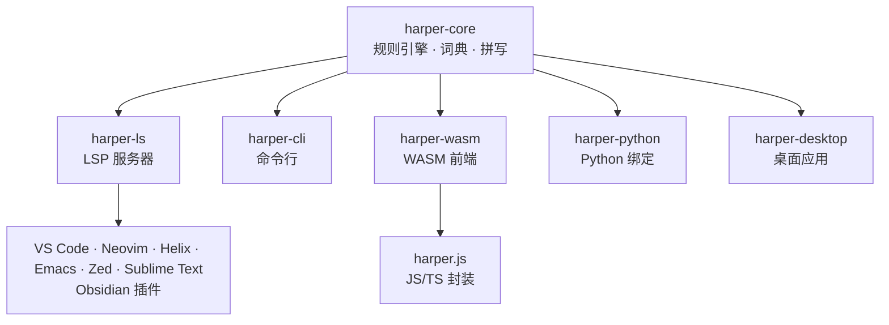

# Harper：把语法检查从云端拉回本地

## 一句话判断

语法检查这个领域长期被两个名字占着：Grammarly 和 LanguageTool。前者是闭源 SaaS，你敲的每一个字符都会发到它的服务器；后者是 Java 开源项目，可以本地部署，但完整运行要下载约 16 GB 的 n-gram 数据集。Harper 是给写作者和开发者准备的 Rust 开源语法检查器，2024 年 11 月被 Automattic（WordPress 母公司）收购，核心判断只有一句：**语法检查不应该是云服务，也不该吃掉你一半内存。**

这句话值得认真对待。三个数字放在一起才显出分量：本地运行、毫秒级响应、内存不到 LanguageTool 的五十分之一。在它之前，很少有语法检查器能同时做到这三件事。

## 系统地图

Harper 是一个 Rust workspace，核心逻辑按职责拆成几个 crate，外部通过四种入口调用同一个引擎：



所有入口都指向同一个 `harper-core`：规则、词典、拼写检查都在这一个 crate 里。外层入口只负责把文本送进去、把结果接出来。这种单引擎多入口的形态，是它能把一套逻辑同时铺到编辑器、命令行、浏览器和桌面的原因。

仓库里几个辅助 crate 各有分工：`harper-brill` 提供词性标注与句块切分（内嵌的 Brill 标注器加一个小型模型）；`harper-thesaurus` 提供同义词数据；`harper-comments` 是 tree-sitter 的封装，在各种编程语言里定位注释；`harper-core` 内部用 `pulldown-cmark` 解析 Markdown，知道哪些是正文、哪些是代码块。拼写检查只跑在正文和注释上：Markdown 代码块、行内代码，以及代码文件里的标识符（函数名、变量名），都不会因为不在词典里而被误报。`harper-wasm` 是引擎编译成的 WebAssembly 绑定，`harper-python` 是 Python 绑定。仓库里还按文档格式拆了一组解析器 crate（HTML、LaTeX、AsciiDoc、Typst），同一个引擎能认出更多文件类型。

## 两条旧路各自的代价

### Grammarly：把"准确"建立在"上传一切"上

Grammarly 的问题不是能力，是模型位置。它把文本发到云端再返回建议，换来的是大规模训练出的覆盖面，代价是两件事：

- 隐私不可控。隐私政策只说"不出售数据"，没说"不用来训练模型"。
- 延迟受网络支配。每次修订都是一次 RTT（往返时延），在实时编辑器里很拖沓。

对企业文档、法律文件、个人通信这类场景，上传本身就是一个否决项，跟检查质量无关。

### LanguageTool：把"本地"建立在"吃掉内存"上

LanguageTool 是另一条路的代表：能本地部署，但它的统计模型依赖约 16 GB 的 n-gram 数据集，中等长度文档检查也要数秒。在一台开发机上背 16 GB 数据换语法检查，大多数人会觉得不值。这也是它"开源但难以普及"的根源——问题不在协议，在体积。

## 核心机制：规则引擎的五处设计

### 1. 规则引擎代替统计模型

Harper 不用 n-gram 数据集，也不用云端大模型。检查逻辑的主体是一套手写规则，每条规则用 Rust 实现，编译成原生机器码。词性判断交给 `harper-brill`——内嵌的 Brill 标注器加一个小型句块模型，整个包依然小到能装进 WASM。这带来两个直接后果：

- **内存占用不到 LanguageTool 的五十分之一**。没有 16 GB 数据集，只有规则和词典。
- **响应进入毫秒级**。没有 JVM 预热、没有 GC 停顿、没有网络往返，规则在本地 CPU 上直接跑。

代价同样清楚：规则覆盖的是可枚举的语法模式，而不是语言的全部分布。Harper 的 README 自己承认目前只支持英语，并说明核心是可扩展的、欢迎其他语言的贡献。

### 2. LSP 让一个引擎接入所有编辑器

`harper-ls` 实现了 Language Server Protocol。只要编辑器支持 LSP 就能接 Harper，官方集成指南覆盖 VS Code、Neovim、Helix、Emacs、Zed、Sublime Text，另有 Obsidian 插件。作者不需要为每个编辑器各写一套插件，编辑器也不需要理解 Harper 的内部实现——它们只对话协议。

### 3. WASM 让浏览器零上传

整个引擎可以编译成 WebAssembly。`harper.js` 是 JavaScript/TypeScript 封装，负责加载和管理底层的 `harper-wasm`，Obsidian 插件与在线写作平台 writewithharper.com 都跑在它上面：你的文本从头到尾不离开浏览器。这一层把"本地检查"从桌面扩展到了网页，且不需要服务器参与。要注意 `harper.js` 目前处于 early access，API 还没有冻结，接进生产前先锁版本。

### 4. 词典：四层作用域

拼写检查怎么知道一个词"在不在词典里"？`harper-ls` 把四类词典合并使用：

- **用户词典**：跟着用户走，macOS 在 `~/Library/Application Support/harper-ls/dictionary.txt`，Linux 在 `~/.config/harper-ls/dictionary.txt`。你加进去的人名、缩写，换项目也认得。
- **工作区词典**：项目根目录的 `.harper-dictionary.txt`，随仓库提交。团队的领域术语写在这里，成员都不会被误报。
- **文件级词典**：按文件或目录单独维护，路径可配置。
- **静态词典**：内置的单词表。

对团队来说关键的是工作区词典：把产品名、内部代号、领域黑话写进去，一份提交，全组共享，不用每个人在编辑器里手动忽略。

### 5. 给规则引擎加一条规则

规则不是黑盒。要加一条规则，在 `harper-core` 的 `linters` 模块里新建一个公开结构体，实现 `Linter` trait（或实现 `PatternLinter` 描述词法模式），引擎每次 lint 时就会执行它。想让它出现在编辑器里、有持久化设置，还需要在仓库其他几处登记。对想贡献的人来说，这是最自然的入口。

## 一次 lint 任务如何流过系统

以你在 VS Code 里打开一篇 Markdown 文档为例：

1. **发现改动**。`harper-ls` 通过 LSP 收到文档内容或增量变更，把它交给 `harper-core`。
2. **按格式分流**。`harper-core` 识别文档格式：Markdown 用 `pulldown-cmark` 解析出正文与代码块，代码文件由 `harper-comments`（基于 tree-sitter）定位注释。只有正文和注释会进入检查。
3. **分词与规则匹配**。引擎对文本分词，逐条跑规则和拼写检查，命中即生成一条 lint 诊断，含位置、原因和建议改法。
4. **回传渲染**。诊断经 LSP 返回编辑器，标成波浪线或提示。全部过程在本机完成，无网络请求。

这条链路的关键在第 2 步：先按格式把"该检查的部分"和"该跳过的部分"分开，再决定在哪部分上跑规则。写代码时常见的 Markdown 代码块、行内代码，或代码里的标识符，都不会被当成英文误报。

## 数据怎么读

README 给出的核心对比数字是：毫秒级检查、内存不到 LanguageTool 的五十分之一、可经 WASM 加载。仓库里的对比表补充了更细的参考值：单次建议 Harper 10 ms、LanguageTool 650 ms、Grammarly 4000 ms。理解这些数字需要知道它们在测什么：

- **测的是响应时间和进程内存**，反映的是"规则引擎 + 原生编译"相对"统计模型 + 大数据集"的资源差异。
- **数字的来源是项目自述**，不是第三方独立基准。它说明的是"Harper 在资源占用上比 LanguageTool 轻得多"，不能推出"Harper 检查得比 LanguageTool 准"——准确率取决于规则覆盖度，README 没有给出量化的准确率对比。
- **不能推出的结论**包括：不支持英语以外的语言（目前只支持英语）、没有 Grammarly 级别的风格建议与语气调整、不具备统计模型那种上下文语义消歧能力。

把"快、小、私密"和"仅英语、规则覆盖有限"放在一起看，Harper 选的是一个明确的位置，不是万能的语法检查器。

## 快速上手

**编辑器**。VS Code 用户装 Harper 扩展即可，打开 Markdown 或文本文档会自动开始检查。Neovim / Helix / Emacs / Zed / Sublime Text 用户把 `harper-ls` 配成 LSP 服务器，步骤见[官方集成文档](https://writewithharper.com/docs/integrations/language-server)。`harper-ls` 可以用 Homebrew（macOS / Linux）、Scoop（Windows）、pacman（Arch）安装，也可以 `cargo install harper-ls --locked`。macOS 用户想全系统检查，可以装 Harper Desktop——不止编辑器，所有文本输入框都能用。

**命令行**。仓库里的 `harper-cli` 适合批量检查文件，目前标注为实验性质，要从源码构建：

```bash
harper-cli lint --count README.md   # 只输出错误数量，适合 CI
cat notes.txt | harper-cli lint     # 不传文件就从标准输入读
```

**浏览器扩展**。Chrome 和 Firefox 都有官方扩展，网页里的输入框直接在本地检查。WordPress 用户还可以装块编辑器插件。

**Web 应用内嵌**。用 npm 安装 `harper.js`，检查在浏览器内完成，不需要后端 API：

```bash
npm install harper.js
```

`harper.js` 还在 early access，API 可能变化，升级前留意版本。

## 采用顺序与适用边界

**适合**：

- 隐私敏感场景下的英语写作（企业、法律、医疗）。
- 在 Web 应用里内嵌语法检查，且不想为此架后端（WASM 形态）。
- 在 Obsidian / VS Code / Neovim 等本地编辑器里替代 Grammarly，或与 LanguageTool 并排对比。
- 对启动速度和内存占用敏感的环境，比如 CI 流水线里的拼写检查步骤。
- 想在任意 macOS 文本输入框里获得检查（Harper Desktop）。

**不适合**：

- 需要非英语语法检查的场景（目前仅英语）。
- 需要 Grammarly 级别风格建议和语气调整的场景，Harper 聚焦语法正确性。
- 需要统计型 NLP 能力（上下文语义消歧）的场景。

**推荐顺序**：先在 writewithharper.com 试一次，确认检查风格合不合用；再装编辑器插件跑一周真实写作；最后才考虑把它接进 CI 或 Web 应用。语法检查器的主观性很强，直接上生产前，值得先让它在你最常写的文体上跑一段时间。

## 常见问题

**问：Harper 和 Grammarly 能共存吗？** 可以。两者在不同编辑器里独立运行，Harper 全本地，Grammarly 走云端，互不冲突。想对比准确率就并排用，一段文字两边都过一遍。

**问：为什么 README 说"只支持英语"？** 规则引擎的规则、词典目前都是英语的。核心架构支持扩展，官方欢迎其他语言的贡献，但目前没有官方支持的其他语言。

**问：CI 里怎么用？** 用 `harper-cli` 的 `lint` 子命令，直接传文件路径，加 `--count` 就只输出错误数量，适合在 CI 里对 Markdown 或文档文件做拼写与语法检查。注意它目前是实验性质，输出格式还不稳定。

**问：Harper 检查代码吗？** 检查的是英文正文和代码注释，不碰代码逻辑。代码文件只取注释部分，标识符不会因为不在词典里而被误报。

## 资料来源与边界

- [GitHub 仓库](https://github.com/Automattic/harper) — 源码、crate 列表、README
- [writewithharper.com](https://writewithharper.com) — 在线试用与官方文档
- [Discord 社区](https://discord.com/invite/JBqcAaKrzQ) — 问题讨论与贡献指南

数据与事实以仓库 README、ARCHITECTURE.md、COMPARISON.md（2026-09 抓取）和仓库结构为准；性能数字是项目自述，非第三方独立基准。项目仍在快速迭代，仓库结构、crate 名称、支持的编辑器与语言范围都可能变化，以 GitHub 最新状态为准。
