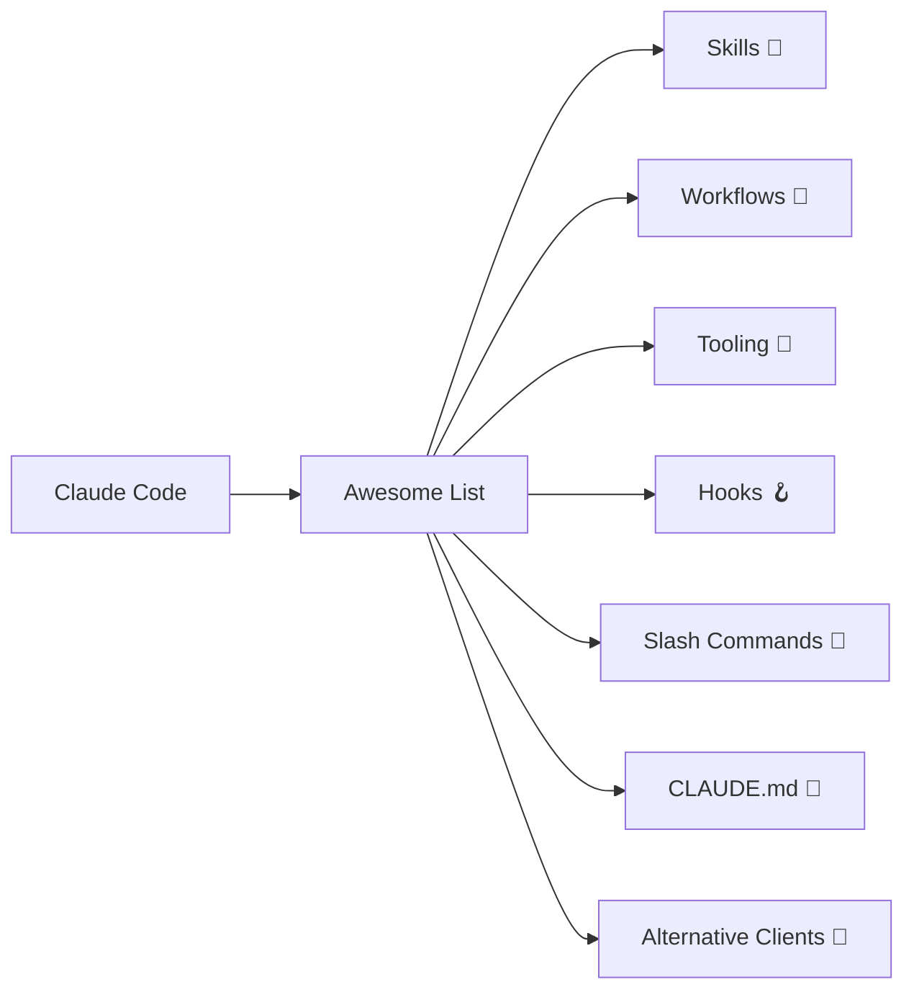
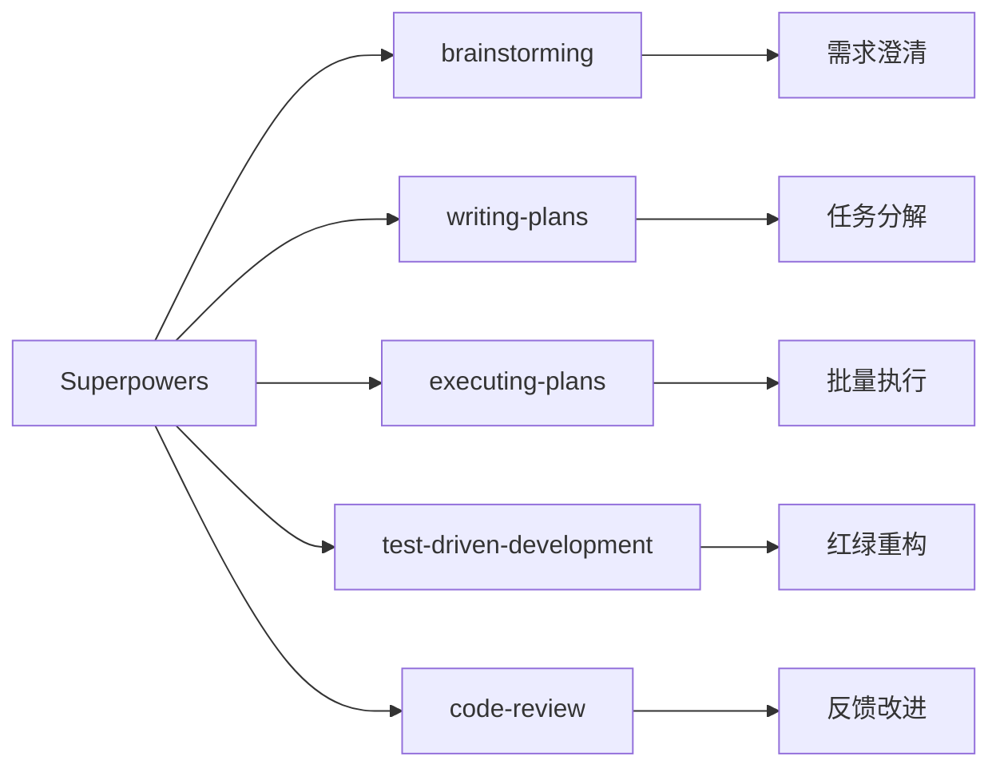

# Awesome Claude Code：从入门到精通 — Claude Code 资源大全

> **目标读者**：Claude Code 用户、AI 编程爱好者、想提升开发效率的工程师
> **前置知识**：了解 Claude Code 基础用法、有编程经验
> **预计学习时间**：1-2 小时（入门），3-4 小时（精通）

---

## 🎯 学习目标

完成本文档后，你将掌握：

- ✅ 理解 Awesome Claude Code 的定位与价值
- ✅ 掌握 Agent Skills 的核心概念与使用方法
- ✅ 熟练使用 Workflows 提升开发效率
- ✅ 配置 Tooling 工具链
- ✅ 使用 Hooks 自动化工作流
- ✅ 掌握 Slash Commands 高效操作
- ✅ 编写高质量 CLAUDE.md 文件
- ✅ 选择适合的 Alternative Clients
- ✅ 了解最新热门项目（2026 年）

---

## 一、项目概述与背景

### 1.1 什么是 Awesome Claude Code？

Awesome Claude Code（[hesreallyhim/awesome-claude-code](https://github.com/hesreallyhim/awesome-claude-code)）是 **Claude Code 资源精选列表**，收录了skills、agents、plugins、hooks、commands 等增强 Claude Code 能力的优质开源项目。

**核心定位**：帮助开发者找到最适合自己工作流的 Claude Code 扩展工具。



### 1.2 项目数据

| 指标 | 数值 |
|------|------|
| GitHub Stars | **34.4k** |
| GitHub Forks | **2.5k** |
| Commits | **935** |

### 1.3 最新添加项目（2026 年热门）

| 项目 | 类型 | 说明 |
|------|------|------|
| **claude-devtools** | Desktop App | Claude Code 会话可视化分析工具 |
| **agnix** | Linter | Agent 配置文件代码检查工具 |
| **Codebase to Course** | Skill | 将代码库转换为交互式 HTML 课程 |
| **Ruflo** | Orchestrator | 多智能体 swarm 编排平台 |

---

## 二、目录结构解析

### 2.1 仓库目录

```
awesome-claude-code/
├── .claude/commands/      # Claude Code 命令
├── .github/               # GitHub 配置
├── README_ALTERNATIVES/    # 替代 README 样式
├── assets/               # 静态资源
├── data/                 # 数据文件
├── docs/                 # 文档
├── resources/            # 资源文件
├── scripts/              # 脚本
├── templates/            # 模板
├── tests/                # 测试
├── tools/                # 工具
├── docs/                 # 文档
├── tools/                # 工具集
├── README.md            # 主文档
├── THE_RESOURCES_TABLE.csv  # 资源表
└── pyproject.toml      # Python 配置
```

### 2.2 核心文件说明

| 文件/目录 | 说明 |
|-----------|------|
| `.claude/commands/` | Claude Code 可执行的命令 |
| `docs/` | 项目文档 |
| `resources/` | 资源文件 |
| `templates/` | 各类模板 |
| `THE_RESOURCES_TABLE.csv` | 所有资源的 CSV 索引 |

---

## 三、核心分类详解

### 3.1 Agent Skills 🤖

**定义**：Agent Skills 是模型控制的配置文件（文件、脚本、资源等），使 Claude Code 能够执行需要专门知识或能力的任务。

| 技能 | 作者 | 说明 |
|------|------|------|
| **AgentSys** | avifenesh | DevOps 工作流自动化，支持 IaC 代码生成 |
| **Claude Scientific Skills** | K-Dense | 科研、 工程、分析、金融研究技能集 |
| **Superpowers** | obra | 软件工程核心能力，涵盖 SDLC 全流程 |
| **Book Factory** | robertguss | 自动化电子书出版流水线 |
| **cc-devops-skills** | akin-ozer | DevOps 工程师必备技能集 |
| **Claude Mountaineering** | dreamiurg | 登山路线研究自动化 |
| **Trail of Bits Security** | trailofbits | 安全审计与漏洞检测 |

#### 3.1.1 Superpowers 详解

Superpowers 是最受欢迎的 Skills 集合之一：



### 3.2 Workflows & Knowledge Guides 🧠

**定义**：Workflow 是紧密关联的 Claude Code 原生资源集合，用于完成特定项目。

| 工作流 | 作者 | 说明 |
|--------|------|------|
| **AB Method** | ayoubben18 | 原则驱动的 spec 驱动开发 |
| **Claude Code PM** | ranaroussi | 项目管理完整工作流 |
| **RIPER Workflow** | tony | Research-Plan-Execute-Review 阶段分离 |
| **Ralph Wiggum** | 多个作者 | 自主 AI 循环直到任务完成 |
| **Learn Claude Code** | shareAI-Lab | 编码智能体设计分析学习 |

#### 3.2.1 Ralph Wiggum 模式

Ralph Wiggum 是一种自主开发循环技术：

```bash
# Ralph 工作原理
while [任务未完成] && [未超限]; do
    Claude_Code 执行任务
    if [满足完成条件]; then
        标记完成
    fi
done
```

**相关项目**：
| 项目 | Stars | 特点 |
|------|-------|------|
| **awesome-ralph** | - | Ralph 资源合集 |
| **ralph-claude-code** | - | 自主开发框架，智能退出检测 |
| **ralph-orchestrator** | - | 被 Anthropic 官方文档引用 |
| **The Ralph Playbook** | - | 详细的 Ralph 技术指南 |

### 3.3 Tooling 🧰

**定义**：Tooling 是构建在 Claude Code 之上的应用程序，包含比 slash-commands 和 CLAUDE.md 更复杂的组件。

| 工具 | 作者 | 说明 |
|------|------|------|
| **claude-devtools** | matt1398 | 会话可视化分析桌面应用 |
| **Claude Composer** | possibilities | Claude Code 小增强工具 |
| **recall** | zippoxer | 会话全文搜索 |
| **cclogviewer** | Brads3290 | JSONL 会话文件 HTML 查看器 |
| **cc-tools** | Veraticus | Go 实现的 hooks 和工具 |
| **ContextKit** | FlineDev | 4 阶段规划方法论 |

#### 3.3.1 claude-devtools 功能

```
功能列表：
├── 会话日志分析
├── Turn-by-turn 上下文数据
├── Compaction 可视化
├── Subagent 执行树
└── 自定义通知触发器
```

### 3.4 Status Lines 📊

状态栏显示工具，实时监控 Claude Code 运行状态。

**推荐项目**：
- Claude HUD（jarrodwatts）— 显示上下文使用量、活动工具、运行中的 agents、待办进度

### 3.5 Hooks 🪝

Hooks 是在特定事件触发时执行的自动化脚本。

| Hook 类型 | 用途 |
|-----------|------|
| `pre-tool` | 工具执行前处理 |
| `post-tool` | 工具执行后处理 |
| `on-compact` | 上下文压缩时触发 |
| `on-error` | 错误发生时触发 |

### 3.6 Slash-Commands 🔪

Slash Commands 是用户调用的提示词模板。

| 命令类别 | 示例 |
|----------|------|
| **版本控制** | `/git-commit`, `/pr-create` |
| **代码分析** | `/explain`, `/review` |
| **上下文加载** | `/context-load`, `/prime` |
| **文档** | `/readme`, `/changelog` |
| **CI/CD** | `/deploy`, `/test` |

---

## 四、快速开始

### 4.1 安装 Claude Code

```bash
# macOS/Linux
npm install -g @anthropic-ai/claude-code

# 启动
claude
```

### 4.2 使用 Skills

```bash
# 安装 Skill
/claude-code install https://github.com/obra/superpowers

# 使用 Skill
/superpowers brainstorm
```

### 4.3 配置 Hooks

在 `~/.claude/settings.json` 中配置：

```json
{
  "hooks": {
    "pre-tool": "./hooks/pre-tool.sh",
    "post-tool": "./hooks/post-tool.sh"
  }
}
```

### 4.4 编写 CLAUDE.md

在项目根目录创建 `CLAUDE.md`：

```markdown
# 项目背景
这是一个 Python Web 应用，使用 FastAPI + React。

# 技术栈
- 后端：FastAPI, SQLAlchemy, PostgreSQL
- 前端：React 18, TypeScript, TailwindCSS

# 代码规范
- 使用 Black 格式化
- 类型注解必须完整
- 提交信息遵循 Conventional Commits
```

---

## 五、精选项目详解

### 5.1 Superpowers（最受欢迎）

**GitHub**: [obra/superpowers](https://github.com/obra/superpowers)
**Stars**: 118k+

**核心 Skills**：
| Skill | 功能 |
|-------|------|
| `brainstorming` | 苏格拉底式需求澄清 |
| `writing-plans` | 分解成 2-5 分钟的小任务 |
| `subagent-driven-development` | 子 agent 并行执行 |
| `test-driven-development` | RED-GREEN-REFACTOR 循环 |

**安装**：
```bash
/claude-code install https://github.com/obra/superpowers
```

### 5.2 Claude Scientific Skills（科研神器）

**GitHub**: [K-Dense/claude-scientific-skills](https://github.com/K-Dense-AI/claude-scientific-skills)

涵盖领域：
- 科研方法论
- 工程计算
- 数据分析
- 金融建模
- 学术写作

### 5.3 Trail of Bits Security Skills（安全审计）

**GitHub**: [trailofbits/skills](https://github.com/trailofbits/skills)

包含技能：
- CodeQL 静态分析
- Semgrep 规则编写
- 变体分析
- 修复验证
- 差异代码审查

### 5.4 claudekit（全能工具箱）

**功能**：
| 功能 | 说明 |
|------|------|
| 自动保存检查点 | 防止工作丢失 |
| 代码质量 Hooks | 自动化质量门禁 |
| 规格生成执行 | TDD 支持 |
| 20+ 专业 Subagents | Oracle、Code Reviewer 等 |

---

## 六、Ralph Wiggum 深度解析

### 6.1 什么是 Ralph 循环？

Ralph Wiggum 循环是一种自主开发模式，让 AI 持续运行直到任务完成：

```mermaid
graph TB
    A["开始任务"] --> B["Ralph 执行"]
    B --> C{"任务完成？"}
    C -->|"是" D["标记完成"]
    C -->|"否" E{"超限？"}
    E -->|"否" B
    E -->|"是" F["停止"]
```

### 6.2 核心组件

| 组件 | 说明 |
|------|------|
| Prompt File | 任务描述文件 |
| Exit Detection | 完成条件检测 |
| Rate Limiting | 防止 API 过载 |
| Circuit Breaker | 安全熔断机制 |

### 6.3 最佳实践

```bash
# 1. 创建任务描述
echo "实现用户认证功能" > task.txt

# 2. 运行 Ralph
ralph --task task.txt --limit 10

# 3. 检查结果
cat output.log
```

---

## 七、CLAUDE.md 编写指南

### 7.1 基本结构

```markdown
# 项目名称

简短描述项目做什么。

## 技术栈
- 框架/语言/数据库

## 代码规范
- 格式化工具
- 命名约定
- 提交规范

## 项目结构
├── src/       # 源代码
├── tests/     # 测试
└── docs/      # 文档
```

### 7.2 分类 CLAUDE.md

| 类型 | 示例 |
|------|------|
| **语言特定** | Python、JavaScript、Go |
| **领域特定** | Web 开发、数据科学 |
| **项目脚手架** | Next.js、Django |

---

## 八、Alternative Clients 📱

Claude Code 的替代客户端：

| 客户端 | 说明 |
|--------|------|
| **Cursor** | AI 代码编辑器 |
| **Windsurf** | Codeium 产品 |
| **GitHub Copilot** | 微软出品 |
| **Cline** | 开源替代 |

---

## 九、最佳实践

### 9.1 Skill 选择建议

| 场景 | 推荐 Skill |
|------|-----------|
| 全栈开发 | Superpowers |
| 安全审计 | Trail of Bits |
| 科研计算 | Claude Scientific |
| DevOps | cc-devops-skills |

### 9.2 Hooks 自动化

```bash
# pre-tool hook 示例：自动格式化
#!/bin/bash
if [[ "$CLAUDE_TOOL" == "Write" ]]; then
    prettier --write "$CLAUDE_TOOL_INPUT"
fi
```

### 9.3 工作流集成

```bash
# 使用 RIPER 工作流
/riper-research 研究新功能
/riper-plan 制定计划
/riper-execute 执行开发
/riper-review 代码审查
```

---

## 十、常见问题

### Q1: 如何选择合适的 Skill？

| 需求 | 推荐 |
|------|------|
| 快速上手 | Superpowers |
| 专业领域 | 领域特定 Skills |
| 安全审计 | Trail of Bits |

### Q2: Ralph 循环安全吗？

Ralph 有多重保护：
- Rate Limiting 防止过度调用
- Circuit Breaker 自动熔断
- 人工监督模式可用

### Q3: 如何贡献到 Awesome List？

1. Fork 仓库
2. 添加项目到相应分类
3. 更新 `THE_RESOURCES_TABLE.csv`
4. 提交 PR

---

## 十一、总结

Awesome Claude Code 是 Claude Code 生态的精华资源库：

| 分类 | 资源数 | 代表项目 |
|------|--------|----------|
| Agent Skills | 50+ | Superpowers, Claude Scientific |
| Workflows | 30+ | RIPER, AB Method |
| Tooling | 20+ | claude-devtools, recall |
| Hooks | 15+ | Pre-tool, Post-tool |
| Slash Commands | 100+ | 各类场景命令 |
| CLAUDE.md | 50+ | 各类模板 |

**下一步推荐**：

1. 安装 [Superpowers](https://github.com/obra/superpowers) 体验核心功能
2. 尝试 [Ralph Wiggum](https://github.com/frankbria/ralph-claude-code) 自主开发
3. 阅读 [The Ralph Playbook](https://github.com/ClaytonFarr/ralph-playbook) 深入理解
4. 为 Awesome List 贡献你的发现

---

**文档信息**

- 难度：⭐⭐（进阶）
- 类型：资源导航
- 更新日期：2026-03-31
- 预计学习时间：1-2 小时（入门），3-4 小时（精通）
- GitHub：https://github.com/hesreallyhim/awesome-claude-code
- Stars：34.4k ⭐

🦞 由钳岳星君撰写 | 项目源码：https://github.com/hesreallyhim/awesome-claude-code