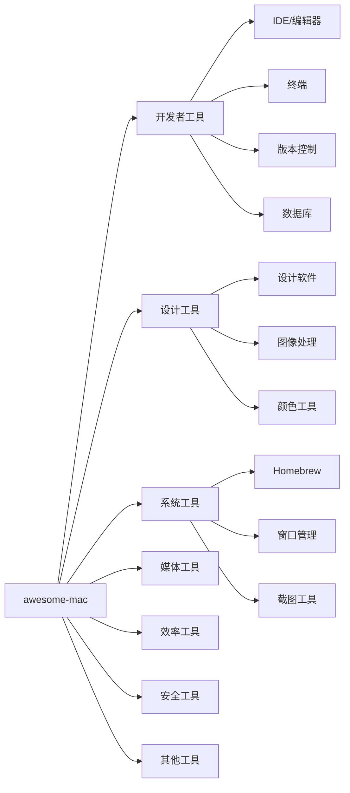

# awesome-mac：17K Stars·macOS 软件资源大全·开发者工具/设计/媒体/效率工具

## 目录

- [一、判断：如果你只装一个工具](#一判断如果你只装一个工具)
- [二、项目概述](#二项目概述)
- [三、开发者工具](#三开发者工具)
- [四、设计工具](#四设计工具)
- [五、系统工具](#五系统工具)
- [六、媒体工具](#六媒体工具)
- [七、效率工具](#七效率工具)
- [八、安全工具](#八安全工具)
- [九、其他工具](#九其他工具)
- [十、Homebrew 高级用法](#十homebrew-高级用法)
- [十一、采用顺序与适用边界](#十一采用顺序与适用边界)
- [自测题](#自测题)
- [进阶路径](#进阶路径)
- [FAQ](#faq)

## 学习目标

完成本文阅读后，你将能够：

- 用 Homebrew 在新 Mac 上快速搭建开发环境
- 按场景选择合适的 macOS 工具，而不是盲目安装
- 判断哪些分类的工具值得投入时间配置，哪些用系统自带就够
- 写出一个一键安装的开发环境脚本

---

## 一、判断：如果你只装一个工具

装 Homebrew。它是 macOS 上所有其他工具的入口。没有它，你需要在十几个网站手动下载安装包；有了它，一行命令装完。

[awesome-mac](https://github.com/jaywcjlove/awesome-mac) 收录了 17K Stars 的 macOS 软件资源，从开发者工具到日常效率工具。但清单本身不解决问题，选型才解决问题。下面按分类整理，每个分类附选型要点。

---

## 二、项目概述

| 指标 | 数值 |
|------|------|
| Stars | 17K ⭐ |
| Forks | 1.7K |
| 许可证 | CC0-1.0（公共领域） |
| 最新更新 | 2026-04-11 |

**定位**：macOS 软件推荐导航，覆盖开发、设计、媒体、效率、安全等领域。安装方式以 Homebrew 为主，Mac App Store 为辅。



---

## 三、开发者工具

开发者工具是 awesome-mac 的核心分类。选型要点：IDE 选一个主力加一个轻量编辑器；终端选一个顺手模拟器加一个 shell；版本控制必装 Git，GUI 客户端按需；数据库工具按技术栈选，不要装一堆用不上的。

### 3.1 IDE 与编辑器

| 软件 | 说明 | 安装命令 | 许可证 |
|------|------|---------|--------|
| Visual Studio Code | 轻量级代码编辑器 | `brew install --cask visual-studio-code` | 免费 |
| IntelliJ IDEA | JetBrains 全家桶主力 | `brew install --cask intellij-idea` | 商业 |
| PyCharm | Python IDE | `brew install --cask pycharm` | 商业 |
| WebStorm | 前端 IDE | `brew install --cask webstorm` | 商业 |
| Sublime Text | 速度优先的编辑器 | `brew install --cask sublime-text` | 商业 |
| BBEdit | macOS 原生文本编辑器 | `brew install --cask bbedit` | 商业 |
| Nova | Panic 出品的现代 IDE | `brew install --cask nova` | 商业 |

### 3.2 终端工具

终端选型看两点：GPU 加速是否需要（Alacritty、kitty），以及是否要内置 AI 补全（Warp）。

| 软件 | 说明 | 安装命令 | 许可证 |
|------|------|---------|--------|
| iTerm2 | macOS 终端模拟器标杆 | `brew install --cask iterm2` | 免费 |
| Warp | 内置 AI 的现代终端 | `brew install --cask warp` | 免费 |
| Hyper | 基于 Electron 的终端 | `brew install --cask hyper` | 免费 |
| Alacritty | GPU 加速终端 | `brew install --cask alacritty` | 免费 |
| kitty | 跨平台 GPU 终端 | `brew install --cask kitty` | 免费 |
| Fish Shell | 开箱即用的智能 shell | `brew install fish` | 免费 |

### 3.3 版本控制

Git 是必装项。GUI 客户端选型看团队协作需求：单人开发用 Lazygit 足够，团队协作考虑 Tower 或 GitKraken。

| 软件 | 说明 | 安装命令 | 许可证 |
|------|------|---------|--------|
| Git | 版本控制基础 | `brew install git` | 免费 |
| GitHub Desktop | GitHub 官方客户端 | `brew install --cask github` | 免费 |
| Sourcetree | Atlassian 出品的 Git 客户端 | `brew install --cask sourcetree` | 免费 |
| GitKraken | 跨平台 Git 客户端 | `brew install --cask gitkraken` | 商业 |
| Sublime Merge | Sublime Text 出品 | `brew install --cask sublime-merge` | 商业 |
| Tower | 专业 Git 客户端 | `brew install --cask tower` | 商业 |
| Lazygit | 终端 Git UI | `brew install lazygit` | 免费 |

### 3.4 数据库工具

数据库工具按技术栈选：PostgreSQL 用 Postico，MySQL 用 TablePlus，MongoDB 用 Compass。TablePlus 支持多数据库，适合不固定的场景。

| 软件 | 说明 | 安装命令 | 许可证 |
|------|------|---------|--------|
| TablePlus | 多数据库客户端 | `brew install --cask tableplus` | 商业 |
| DataGrip | JetBrains 出品 | `brew install --cask datagrip` | 商业 |
| Postico | PostgreSQL 客户端 | `brew install --cask postico` | 商业 |
| PSequel | PostgreSQL GUI | `brew install --cask psequel` | 免费 |
| MongoDB Compass | MongoDB GUI | `brew install --cask mongodb-compass` | 免费 |
| RedisInsight | Redis GUI | `brew install --cask redis-insight` | 免费 |
| Azure Data Studio | SQL Server / PostgreSQL | `brew install --cask azure-data-studio` | 免费 |

---

## 四、设计工具

设计工具选型看协作需求：团队协作选 Figma，独立设计选 Sketch 或 Affinity 全家桶。Adobe 全家桶适合已经在用且依赖特定功能的用户，新用户建议先试 Affinity。

### 4.1 设计软件

| 软件 | 说明 | 安装命令 | 许可证 |
|------|------|---------|--------|
| Figma | 协作设计工具 | Web / macOS 通用 | 免费 |
| Sketch | macOS 原生设计工具 | `brew install --cask sketch` | 商业 |
| Adobe Photoshop | 图像处理 | `brew install --cask adobe-photoshop` | 商业 |
| Adobe Illustrator | 矢量图形 | `brew install --cask adobe-illustrator` | 商业 |
| Adobe XD | UX 设计 | `brew install --cask adobe-xd` | 商业 |
| Affinity Designer | 矢量图形设计 | `brew install --cask affinity-designer` | 商业 |
| Affinity Photo | 照片编辑 | `brew install --cask affinity-photo` | 商业 |
| Affinity Publisher | 出版设计 | `brew install --cask affinity-publisher` | 商业 |
| Canva | 在线设计工具 | Web 通用 | 免费 |

### 4.2 图像处理

图像处理选型看用途：日常修图用 Pixelmator Pro，开源需求用 GIMP，批量压缩用 ImageOptim。

| 软件 | 说明 | 安装命令 | 许可证 |
|------|------|---------|--------|
| Pixelmator Pro | macOS 原生图像编辑 | `brew install --cask pixelmator-pro` | 商业 |
| Acorn | 图像编辑器 | `brew install --cask acorn` | 商业 |
| GIMP | 开源图像编辑器 | `brew install --cask gimp` | 免费 |
| ImageOptim | 图像压缩优化 | `brew install --cask imageoptim` | 免费 |
| Squoosh | WebP/AVIF 压缩 | Web 工具 | 免费 |
| Lens Studio | Snapchat 滤镜 | `brew install --cask lens-studio` | 免费 |

### 4.3 颜色工具

颜色工具选型看工作流：取色用 ColorSnapper 或 Sip，配色方案管理用 Palette Master。

| 软件 | 说明 | 安装命令 | 许可证 |
|------|------|---------|--------|
| ColorSnapper | 取色器 | `brew install --cask colorsnapper` | 商业 |
| Sip | 颜色采样器 | `brew install --cask sip` | 商业 |
| Just Color Picker | 取色工具 | `brew install --cask just-color-picker` | 免费 |
| Palette Master | 配色工具 | Web | 免费 |
| Color Handoff | 设计交接 | Web | 免费 |

---

## 五、系统工具

系统工具是 macOS 效率的基础。选型要点：Homebrew 是入口必装；窗口管理选一个顺手的（Rectangle 免费够用，BetterTouchTool 功能最全）；截图工具看是否需要录屏。

### 5.1 Homebrew

Homebrew 是 macOS 的包管理器，所有其他工具的安装基础。

```bash
# 安装 Homebrew
/bin/bash -c "$(curl -fsSL https://raw.githubusercontent.com/Homebrew/install/HEAD/install.sh)"

# 常用命令
brew update                  # 更新 Homebrew
brew upgrade                 # 升级所有包
brew install <package>       # 安装包
brew install --cask <app>    # 安装 GUI 应用
brew list                    # 列出已安装
brew uninstall <package>     # 卸载
brew search <keyword>        # 搜索
brew info <package>          # 查看信息
brew cleanup                 # 清理旧版本
```

常用开发工具一键安装：

```bash
brew install git node python go rust docker kubectl terraform ansible
```

常用 macOS 应用一键安装：

```bash
brew install --cask google-chrome firefox slack discord zoom 1password raycast
```

### 5.2 窗口管理

窗口管理选型看习惯：鼠标拖拽边缘吸附用 Rectangle，触控板手势用 BetterTouchTool，平铺式用 Amethyst 或 yabai。

| 软件 | 说明 | 安装命令 | 许可证 |
|------|------|---------|--------|
| Rectangle | 开源窗口管理 | `brew install --cask rectangle` | 免费 |
| Magnet | 窗口管理器 | `brew install --cask magnet` | 商业 |
| BetterTouchTool | 触控板增强 | `brew install --cask bettertouchtool` | 商业 |
| Amethyst | 平铺窗口管理器 | `brew install --cask amethyst` | 免费 |
| yabai | 平铺窗口管理器 | `brew install yabai` | 免费 |
| Raycast | 快速启动器 | `brew install --cask raycast` | 免费 |

### 5.3 截图工具

截图工具选型看是否需要录屏和标注：CleanShot X 功能最全，Kap 适合录屏 GIF，OBS 适合长录屏。

| 软件 | 说明 | 安装命令 | 许可证 |
|------|------|---------|--------|
| CleanShot X | 增强截图 | `brew install --cask cleanshot` | 商业 |
| Skitch | 截图标注 | `brew install --cask skitch` | 免费 |
| Lightshot | 快速截图 | `brew install --cask lightshot` | 免费 |
| Kap | 录屏工具 | `brew install --cask kap` | 免费 |
| ScreenFlow | 录屏编辑 | `brew install --cask screenflow` | 商业 |
| OBS | 开源录屏 | `brew install --cask obs` | 免费 |

---

## 六、媒体工具

媒体工具选型看专业程度：日常用 IINA 播放、HandBrake 转码就够；专业音频用 Logic Pro，专业视频用 DaVinci Resolve 或 Final Cut Pro。

### 6.1 音频处理

| 软件 | 说明 | 安装命令 | 许可证 |
|------|------|---------|--------|
| Audacity | 开源音频编辑器 | `brew install --cask audacity` | 免费 |
| GarageBand | Apple 出品 | 预装应用 | 免费 |
| Logic Pro | Apple 专业音频 | App Store | 商业 |
| Adobe Audition | 音频编辑 | `brew install --cask adobe-audition` | 商业 |
| Soundflower | 音频路由 | `brew install --cask soundflower` | 免费 |
| Audio Hijack | 音频捕获 | `brew install --cask audio-hijack` | 商业 |

### 6.2 视频处理

| 软件 | 说明 | 安装命令 | 许可证 |
|------|------|---------|--------|
| DaVinci Resolve | 免费调色 | `brew install --cask davinci-resolve` | 免费 |
| Final Cut Pro | Apple 专业视频 | App Store | 商业 |
| Adobe Premiere Pro | 视频编辑 | `brew install --cask adobe-premiere-pro` | 商业 |
| HandBrake | 视频转码 | `brew install --cask handbrake` | 免费 |
| FFmpeg | 命令行视频工具 | `brew install ffmpeg` | 免费 |
| IINA | 视频播放器 | `brew install --cask iina` | 免费 |
| VLC | 媒体播放器 | `brew install --cask vlc` | 免费 |
| Permute | 媒体转换 | `brew install --cask permute` | 商业 |

---

## 七、效率工具

效率工具选型看工作流：笔记工具选一个主力（Obsidian 或 Notion），不要同时维护多个；下载工具看场景，yt-dlp 几乎覆盖所有视频站点。

### 7.1 下载工具

| 软件 | 说明 | 安装命令 | 许可证 |
|------|------|---------|--------|
| Folx | 下载管理器 | `brew install --cask folx` | 商业 |
| JDownloader | 下载管理器 | `brew install --cask jdownloader` | 免费 |
| uGet | 下载管理器 | `brew install --cask uget` | 免费 |
| Downie | 视频下载 | `brew install --cask downie` | 商业 |
| yt-dlp | YouTube 下载 | `brew install yt-dlp` | 免费 |

### 7.2 笔记工具

笔记工具选型看数据归属需求：本地优先选 Obsidian 或 Bear，云端协作选 Notion，开源大纲选 Logseq。

| 软件 | 说明 | 安装命令 | 许可证 |
|------|------|---------|--------|
| Notion | 笔记和协作 | `brew install --cask notion` | 免费 |
| Obsidian | Markdown 笔记 | `brew install --cask obsidian` | 免费 |
| Bear | Markdown 笔记 | `brew install --cask bear` | 商业 |
| Apple Notes | 预装笔记 | 预装应用 | 免费 |
| Evernote | 笔记 | `brew install --cask evernote` | 商业 |
| Craft | 文档工具 | `brew install --cask craft` | 商业 |
| Logseq | 大纲笔记 | `brew install --cask logseq` | 免费 |

### 7.3 RSS 阅读器

RSS 阅读器选型看同步需求：本地用 NetNewsWire，跨平台用 Reeder，自建用 FreshRSS 或 Miniflux。

| 软件 | 说明 | 安装命令 | 许可证 |
|------|------|---------|--------|
| Reeder | RSS 阅读器 | `brew install --cask reeder` | 商业 |
| NetNewsWire | 开源 RSS 阅读器 | `brew install --cask netnewswire` | 免费 |
| Vienna | 开源 RSS 阅读器 | `brew install --cask vienna` | 免费 |
| FreshRSS | 自建 RSS 服务 | Web 服务 | 免费 |
| Miniflux | 自建 RSS | Web 服务 | 免费 |

---

## 八、安全工具

安全工具选型看威胁模型：普通用户装一个密码管理器加一个防火墙就够；高安全需求加恶意软件检测和勒索防护。

### 8.1 密码管理

密码管理器选型看生态：跨平台选 1Password 或 Bitwarden，开源优先选 Bitwarden 或 KeePassXC。

| 软件 | 说明 | 安装命令 | 许可证 |
|------|------|---------|--------|
| 1Password | 密码管理器 | `brew install --cask 1password` | 商业 |
| Bitwarden | 开源密码管理 | `brew install --cask bitwarden` | 免费 |
| LastPass | 密码管理器 | `brew install --cask lastpass` | 商业 |
| Dashlane | 密码管理器 | `brew install --cask dashlane` | 商业 |
| KeePassXC | 开源密码管理 | `brew install --cask keepassxc` | 免费 |
| Enpass | 密码管理器 | `brew install --cask enpass` | 商业 |

### 8.2 安全工具

| 软件 | 说明 | 安装命令 | 许可证 |
|------|------|---------|--------|
| Little Flocker | 防火墙 | `brew install --cask little-flocker` | 商业 |
| Knock | 用 iPhone 解锁 Mac | `brew install --cask knock` | 商业 |
| LuLu | 开源防火墙 | `brew install --cask lulu` | 免费 |
| RansomWhere? | 勒索检测 | Web 下载 | 免费 |
| Malwarebytes | 恶意软件检测 | `brew install --cask malwarebytes` | 商业 |

macOS 系统自带防火墙在"系统设置 > 网络 > 防火墙"中开启。

---

## 九、其他工具

### 9.1 虚拟机

虚拟化选型看需求：Docker 开发用 Docker Desktop 或 OrbStack，跑其他系统用 UTM 或 Parallels。OrbStack 比 Docker Desktop 轻量，M 系列 Mac 推荐。

| 软件 | 说明 | 安装命令 | 许可证 |
|------|------|---------|--------|
| Docker Desktop | Docker 官方 | `brew install --cask docker` | 免费 |
| OrbStack | 轻量 Docker | `brew install --cask orbstack` | 商业 |
| Podman | 容器引擎 | `brew install --cask podman` | 免费 |
| UTM | 虚拟机 | `brew install --cask utm` | 免费 |
| VirtualBox | 虚拟机 | `brew install --cask virtualbox` | 免费 |
| VMware Fusion | 虚拟机 | `brew install --cask vmware-fusion` | 商业 |
| Parallels Desktop | 虚拟机 | `brew install --cask parallels` | 商业 |

### 9.2 云存储

云存储选型看协作需求：个人同步用 iCloud Drive，跨平台协作用 Dropbox 或 Google Drive，隐私优先用 pCloud 或 Syncthing。

| 软件 | 说明 | 安装命令 | 许可证 |
|------|------|---------|--------|
| Dropbox | 云存储 | `brew install --cask dropbox` | 商业 |
| Google Drive | 云存储 | `brew install --cask google-drive` | 免费 |
| iCloud Drive | Apple 云存储 | 预装应用 | 免费 |
| OneDrive | 微软云存储 | `brew install --cask microsoft-onedrive` | 免费 |
| pCloud | 隐私优先云存储 | `brew install --cask pcloud` | 商业 |
| Syncthing | 开源同步 | `brew install --cask syncthing` | 免费 |

### 9.3 壁纸工具

| 软件 | 说明 | 安装命令 | 许可证 |
|------|------|---------|--------|
| Wallpaper Wizard | 壁纸应用 | `brew install --cask wallpaper-wizard` | 商业 |
| Pap.er | 壁纸应用 | `brew install --cask pap.er` | 免费 |
| Unsplash Wallpapers | 壁纸 | Web | 免费 |

macOS 预装壁纸在"系统设置 > 墙纸"中设置。

---

## 十、Homebrew 高级用法

### 10.1 常用技巧

```bash
brew upgrade <package>                              # 升级特定应用
brew pin <package>                                  # 锁定版本防止升级
brew unpin <package>                                # 解锁版本
brew deps <package>                                 # 查看依赖
brew cleanup                                        # 清理所有旧版本
brew doctor                                         # 诊断问题
brew list --cask | grep <app-name>                  # 查找应用所属的包
brew tap user/repo                                  # 创建自己的 tap
brew install --cask --appdir=/Applications <app>    # 指定安装位置
```

### 10.2 一键安装开发环境

把下面的脚本保存为 `setup.sh`，新 Mac 上一键跑完开发环境配置：

```bash
#!/bin/bash
set -euo pipefail

# 命令行工具
brew install git node python go rust docker

# 数据库
brew install postgresql redis mongodb-community

# 开发应用
brew install --cask visual-studio-code iterm2 docker tableplus gitkraken postman slack discord

# 效率工具
brew install --cask raycast obsidian 1password alfred rectangle cleanshot

echo "开发环境安装完成"
```

---

## 十一、采用顺序与适用边界

### 新 Mac 的安装顺序

1. **先装 Homebrew**：所有其他工具的入口
2. **再装终端和编辑器**：iTerm2 加 VS Code 是最稳的起点
3. **配置版本控制**：Git 加一个 GUI 客户端（Lazygit 或 Tower）
4. **按需装效率工具**：Raycast（启动器）加 Rectangle（窗口管理）加 1Password（密码）
5. **按项目装专业工具**：数据库、设计、媒体工具按当前工作需要装

### 谁不需要这份清单

- **只用 Mac 收发邮件和浏览网页的用户**：系统自带应用就够，不需要 Homebrew
- **已经在 Linux 上配好开发环境且通过 SSH 连接的用户**：本地不需要装开发工具
- **公司有严格软件审批流程的员工**：先走 IT 审批，不要自行安装

### 哪些工具值得付费

- **1Password**：密码管理是安全基础设施，值得付费
- **BetterTouchTool**：如果重度依赖触控板手势，值得付费
- **CleanShot X**：如果经常截图录屏做文档，值得付费
- **JetBrains 全家桶**：如果主力语言有对应 IDE，值得付费
- **TablePlus**：如果日常操作多种数据库，值得付费

其他工具先用免费版，遇到瓶颈再考虑付费替代。

---

## 自测题

1. **新 Mac 上第一个该装什么？**
   答：Homebrew。它是所有其他工具的安装入口。

2. **Rectangle 和 BetterTouchTool 怎么选？**
   答：Rectangle 免费且专注窗口边缘吸附，BetterTouchTool 付费但覆盖触控板手势、窗口管理、快捷键触发等。轻度用户选 Rectangle，重度效率用户选 BetterTouchTool。

3. **1Password 和 Bitwarden 怎么选？**
   答：1Password 体验更好但付费，Bitwarden 开源且免费版功能够用。预算敏感选 Bitwarden，体验优先选 1Password。

4. **Docker Desktop 和 OrbStack 怎么选？**
   答：M 系列 Mac 上 OrbStack 启动更快、内存占用更低，推荐。Intel Mac 或需要官方支持选 Docker Desktop。

5. **Homebrew 的 brew install 和 brew install --cask 有什么区别？**
   答：`brew install` 装命令行工具，`brew install --cask` 装 GUI 应用。

---

## 进阶路径

- **想深入 Homebrew**：读 [Homebrew 官方文档](https://docs.brew.sh)，学习自定义 formula 和 cask
- **想深入终端效率**：配置 Zsh 加 Oh My Zsh 加 Powerlevel10k，或切换到 Fish Shell
- **想深入窗口管理**：研究 yabai 加 skhd 的平铺式窗口管理方案
- **想深入 macOS 自动化**：学 Shortcuts（快捷指令）和 BetterTouchTool 的自动化功能

---

## FAQ

**Q：awesome-mac 清单里的软件都免费吗？**
A：不是。清单包含免费、商业和开源软件。每个软件的许可证见对应表格。

**Q：必须用 Homebrew 安装吗？**
A：不是必须，但推荐。Homebrew 统一了安装、更新和卸载流程，比手动下载安装包更好维护。

**Q：Homebrew 安装的软件在哪里？**
A：命令行工具在 `/opt/homebrew/`（Apple Silicon）或 `/usr/local/`（Intel），GUI 应用在 `/Applications/`。

**Q：awesome-mac 清单会更新吗？**
A：会。仓库持续维护，截至 2026 年 4 月最新更新于 2026-04-11。

**Q：清单里的软件安全吗？**
A：awesome-mac 是社区维护的推荐清单，安装前建议自行核实软件来源。Homebrew Cask 的软件经过社区审核，相对可靠。

---

## 结语

[awesome-mac](https://github.com/jaywcjlove/awesome-mac) 收录了 17K Stars 的 macOS 软件资源，从开发者工具到日常效率工具。清单本身不解决问题，选型才解决问题。按需安装，不要盲目堆砌。

相关资源：

| 资源 | 链接 |
|------|------|
| GitHub | https://github.com/jaywcjlove/awesome-mac |
| Homebrew | https://brew.sh |
| Homebrew Cask | https://formulae.brew.sh/cask/ |
| MacUpdate | https://www.macupdate.com |
