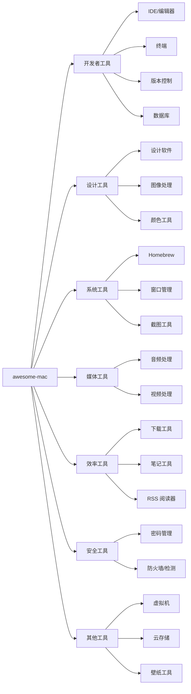

# awesome-mac：106K Stars·macOS 软件资源大全·开发者工具/设计/媒体/效率工具

## 目录

- [学习目标](#学习目标)
- [一、核心判断](#一核心判断)
- [二、项目概述](#二项目概述)
- [三、开发者工具](#三开发者工具)
- [四、设计工具](#四设计工具)
- [五、系统工具](#五系统工具)
- [六、媒体工具](#六媒体工具)
- [七、效率工具](#七效率工具)
- [八、安全工具](#八安全工具)
- [九、其他工具](#九其他工具)
- [十、Homebrew 高级用法](#十homebrew-高级用法)
- [十一、采用顺序与适用边界](#十一采用顺序与适用边界)
- [任务流案例：新 Mac 从零到能跑项目](#任务流案例新-mac-从零到能跑项目)
- [故障排查](#故障排查)
- [自测题](#自测题)
- [进阶路径](#进阶路径)
- [FAQ](#faq)
- [结语](#结语)

## 学习目标

完成本文阅读后，你将能够：

- 用 Homebrew 在新 Mac 上快速搭建开发环境
- 按场景选择合适的 macOS 工具，避免盲目安装
- 判断哪些分类的工具值得投入时间配置，哪些用系统自带就够
- 写出一个一键安装的开发环境脚本

---

## 一、核心判断

新 Mac 上第一个该装的工具是 Homebrew。它是 macOS 上所有其他工具的入口。没有它，你需要在十几个网站手动下载安装包；有了它，一行命令装完。

[awesome-mac](https://github.com/jaywcjlove/awesome-mac) 是 jaywcjlove 维护的 macOS 软件推荐清单，截至 2026 年 6 月已积累 106K Stars。清单覆盖开发者工具、设计工具、媒体工具、效率工具等分类。收录数量大不代表每款都适合你，下面按分类整理，每个分类给出取舍依据。

> 时效声明：Stars、Forks、最新更新日期来自 GitHub API，截至 2026-06-18 抓取。Homebrew formula 名称和软件许可证可能随版本变化，安装前建议运行 `brew info <package>` 核实。

---

## 二、项目概述

| 指标 | 数值 |
|------|------|
| Stars | 106K ⭐ |
| Forks | 7.9K |
| 许可证 | CC0-1.0（公共领域） |
| 最新更新 | 2026-06-18 |
| 数据来源 | [GitHub API](https://api.github.com/repos/jaywcjlove/awesome-mac) |

**定位**：macOS 软件推荐导航，覆盖开发、设计、媒体、效率、安全等领域。安装方式以 Homebrew 为主，Mac App Store 为辅。



清单本身只是导航，真正的安装和更新都走 Homebrew。下面七个分类按"是否需要付费""是否需要配置""使用频率"三个维度取舍。

---

## 三、开发者工具

开发者工具是 awesome-mac 收录最多的分类。配置原则：IDE 选一个主力加一个轻量编辑器；终端选一个顺手模拟器加一个 shell；版本控制必装 Git，GUI 客户端按需；数据库工具跟着技术栈走，避免装一堆用不上的。

### 3.1 IDE 与编辑器

IDE 和轻量编辑器分工不同：IDE 内置语言服务器、调试器、重构工具，适合主力项目；轻量编辑器启动快，适合改配置文件、看日志。同时装一个 JetBrains 全家桶成员加 VS Code，能覆盖 90% 场景。

| 软件 | 说明 | 安装命令 | 许可证 |
|------|------|---------|--------|
| Visual Studio Code | 轻量级代码编辑器 | `brew install --cask visual-studio-code` | 免费 |
| IntelliJ IDEA | JetBrains 全家桶主力 | `brew install --cask intellij-idea` | 商业 |
| PyCharm | Python IDE | `brew install --cask pycharm` | 商业 |
| WebStorm | 前端 IDE | `brew install --cask webstorm` | 商业 |
| Sublime Text | 速度优先的编辑器 | `brew install --cask sublime-text` | 商业 |
| BBEdit | macOS 原生文本编辑器 | `brew install --cask bbedit` | 商业 |
| Nova | Panic 出品的现代 IDE | `brew install --cask nova` | 商业 |

### 3.2 终端工具

挑终端模拟器时关注两件事：是否需要 GPU 加速（Alacritty、kitty），以及是否要内置 AI 补全（Warp）。GPU 加速在长日志滚动和 tmux 多窗格场景下肉眼可感，AI 补全对不熟 shell 命令的新手有帮助。

| 软件 | 说明 | 安装命令 | 许可证 |
|------|------|---------|--------|
| iTerm2 | macOS 终端模拟器标杆 | `brew install --cask iterm2` | 免费 |
| Warp | 内置 AI 的现代终端 | `brew install --cask warp` | 免费 |
| Hyper | 基于 Electron 的终端 | `brew install --cask hyper` | 免费 |
| Alacritty | GPU 加速终端 | `brew install --cask alacritty` | 免费 |
| kitty | 跨平台 GPU 终端 | `brew install --cask kitty` | 免费 |
| Fish Shell | 开箱即用的智能 shell | `brew install fish` | 免费 |

### 3.3 版本控制

Git 是必装项。GUI 客户端的选择取决于协作场景：单人开发用 Lazygit 足够，团队协作考虑 Tower 或 GitKraken。Lazygit 在终端里跑，启动快、不占 Dock 位置；Tower 和 GitKraken 的多仓库视图适合同时维护五六个项目的情况。

| 软件 | 说明 | 安装命令 | 许可证 |
|------|------|---------|--------|
| Git | 版本控制基础 | `brew install git` | 免费 |
| GitHub Desktop | GitHub 官方客户端 | `brew install --cask github` | 免费 |
| Sourcetree | Atlassian 出品的 Git 客户端 | `brew install --cask sourcetree` | 免费 |
| GitKraken | 跨平台 Git 客户端 | `brew install --cask gitkraken` | 商业 |
| Sublime Merge | Sublime Text 出品 | `brew install --cask sublime-merge` | 商业 |
| Tower | 专业 Git 客户端 | `brew install --cask tower` | 商业 |
| Lazygit | 终端 Git UI | `brew install lazygit` | 免费 |

### 3.4 数据库工具

数据库工具跟着技术栈走：PostgreSQL 用 Postico，MySQL 用 TablePlus，MongoDB 用 Compass。TablePlus 支持多数据库，适合技术栈不固定的场景。DataGrip 是 JetBrains 全家桶成员，如果已经订阅 IntelliJ Ultimate，DataGrip 通常已包含在订阅里。

| 软件 | 说明 | 安装命令 | 许可证 |
|------|------|---------|--------|
| TablePlus | 多数据库客户端 | `brew install --cask tableplus` | 商业 |
| DataGrip | JetBrains 出品 | `brew install --cask datagrip` | 商业 |
| Postico | PostgreSQL 客户端 | `brew install --cask postico` | 商业 |
| PSequel | PostgreSQL GUI | `brew install --cask psequel` | 免费 |
| MongoDB Compass | MongoDB GUI | `brew install --cask mongodb-compass` | 免费 |
| RedisInsight | Redis GUI | `brew install --cask redis-insight` | 免费 |
| Azure Data Studio | SQL Server / PostgreSQL | `brew install --cask azure-data-studio` | 免费 |

---

## 四、设计工具

设计工具的取舍主要看协作场景：团队协作选 Figma，独立设计选 Sketch 或 Affinity 全家桶。Adobe 全家桶适合已经在用且依赖特定功能的用户，新用户建议先试 Affinity，Affinity 一次性买断，Adobe 是订阅制，长期成本差异明显。

### 4.1 设计软件

| 软件 | 说明 | 安装命令 | 许可证 |
|------|------|---------|--------|
| Figma | 协作设计工具 | Web / macOS 通用 | 免费 |
| Sketch | macOS 原生设计工具 | `brew install --cask sketch` | 商业 |
| Adobe Photoshop | 图像处理 | `brew install --cask adobe-photoshop` | 商业 |
| Adobe Illustrator | 矢量图形 | `brew install --cask adobe-illustrator` | 商业 |
| Adobe XD | UX 设计 | `brew install --cask adobe-xd` | 商业 |
| Affinity Designer | 矢量图形设计 | `brew install --cask affinity-designer` | 商业 |
| Affinity Photo | 照片编辑 | `brew install --cask affinity-photo` | 商业 |
| Affinity Publisher | 出版设计 | `brew install --cask affinity-publisher` | 商业 |
| Canva | 在线设计工具 | Web 通用 | 免费 |

### 4.2 图像处理

图像处理工具按使用频率和复杂度区分：日常修图用 Pixelmator Pro，开源需求用 GIMP，批量压缩用 ImageOptim。ImageOptim 还能剥离 EXIF 信息，做隐私处理时也用得上。

| 软件 | 说明 | 安装命令 | 许可证 |
|------|------|---------|--------|
| Pixelmator Pro | macOS 原生图像编辑 | `brew install --cask pixelmator-pro` | 商业 |
| Acorn | 图像编辑器 | `brew install --cask acorn` | 商业 |
| GIMP | 开源图像编辑器 | `brew install --cask gimp` | 免费 |
| ImageOptim | 图像压缩优化 | `brew install --cask imageoptim` | 免费 |
| Squoosh | WebP/AVIF 压缩 | Web 工具 | 免费 |
| Lens Studio | Snapchat 滤镜 | `brew install --cask lens-studio` | 免费 |

### 4.3 颜色工具

颜色工具围绕工作流配置：取色用 ColorSnapper 或 Sip，配色方案管理用 Palette Master。Sip 还能把取到的颜色直接生成 Tailwind 或 CSS 变量，前端开发场景下省一步手动转换。

| 软件 | 说明 | 安装命令 | 许可证 |
|------|------|---------|--------|
| ColorSnapper | 取色器 | `brew install --cask colorsnapper` | 商业 |
| Sip | 颜色采样器 | `brew install --cask sip` | 商业 |
| Just Color Picker | 取色工具 | `brew install --cask just-color-picker` | 免费 |
| Palette Master | 配色工具 | Web | 免费 |
| Color Handoff | 设计交接 | Web | 免费 |

---

## 五、系统工具

系统工具决定 macOS 的日常使用效率。配置思路：Homebrew 是入口必装；窗口管理选一个顺手的（Rectangle 免费够用，BetterTouchTool 功能最全）；截图工具看是否需要录屏。

### 5.1 Homebrew

Homebrew 是 macOS 的包管理器，所有其他工具的安装基础。它解决的核心问题是"卸载干净"——手动拖 `.app` 到 Applications 的安装方式，配置文件、缓存、依赖会散落在系统各处，Homebrew 把这些都纳入管理。

```bash
# 安装 Homebrew
/bin/bash -c "$(curl -fsSL https://raw.githubusercontent.com/Homebrew/install/HEAD/install.sh)"

# 常用命令
brew update                  # 更新 Homebrew
brew upgrade                 # 升级所有包
brew install <package>       # 安装包
brew install --cask <app>    # 安装 GUI 应用
brew list                    # 列出已安装
brew uninstall <package>     # 卸载
brew search <keyword>        # 搜索
brew info <package>          # 查看信息
brew cleanup                 # 清理旧版本
```

常用开发工具一键安装：

```bash
brew install git node python go rust docker kubectl terraform ansible
```

常用 macOS 应用一键安装：

```bash
brew install --cask google-chrome firefox slack discord zoom 1password raycast
```

### 5.2 窗口管理

窗口管理工具的差异主要体现在交互方式上：鼠标拖拽边缘吸附用 Rectangle，触控板手势用 BetterTouchTool，平铺式用 Amethyst 或 yabai。平铺式窗口管理器来自 Linux 习惯，需要记忆快捷键，迁移成本高，没接触过 i3 或 sway 的用户慎选。

| 软件 | 说明 | 安装命令 | 许可证 |
|------|------|---------|--------|
| Rectangle | 开源窗口管理 | `brew install --cask rectangle` | 免费 |
| Magnet | 窗口管理器 | `brew install --cask magnet` | 商业 |
| BetterTouchTool | 触控板增强 | `brew install --cask bettertouchtool` | 商业 |
| Amethyst | 平铺窗口管理器 | `brew install --cask amethyst` | 免费 |
| yabai | 平铺窗口管理器 | `brew install yabai` | 免费 |
| Raycast | 快速启动器 | `brew install --cask raycast` | 免费 |

### 5.3 截图工具

截图工具的差异在于是否集成录屏和标注：CleanShot X 功能最全，Kap 适合录屏 GIF，OBS 适合长录屏。CleanShot X 的滚动截图和云分享功能对写文档和报 bug 场景特别有用。

| 软件 | 说明 | 安装命令 | 许可证 |
|------|------|---------|--------|
| CleanShot X | 增强截图 | `brew install --cask cleanshot` | 商业 |
| Skitch | 截图标注 | `brew install --cask skitch` | 免费 |
| Lightshot | 快速截图 | `brew install --cask lightshot` | 免费 |
| Kap | 录屏工具 | `brew install --cask kap` | 免费 |
| ScreenFlow | 录屏编辑 | `brew install --cask screenflow` | 商业 |
| OBS | 开源录屏 | `brew install --cask obs` | 免费 |

---

## 六、媒体工具

媒体工具按专业程度分层：日常用 IINA 播放、HandBrake 转码就够；专业音频用 Logic Pro，专业视频用 DaVinci Resolve 或 Final Cut Pro。DaVinci Resolve 免费版已包含专业调色和剪辑功能，对非好莱坞级别的项目足够用。

### 6.1 音频处理

| 软件 | 说明 | 安装命令 | 许可证 |
|------|------|---------|--------|
| Audacity | 开源音频编辑器 | `brew install --cask audacity` | 免费 |
| GarageBand | Apple 出品 | 预装应用 | 免费 |
| Logic Pro | Apple 专业音频 | App Store | 商业 |
| Adobe Audition | 音频编辑 | `brew install --cask adobe-audition` | 商业 |
| Soundflower | 音频路由 | `brew install --cask soundflower` | 免费 |
| Audio Hijack | 音频捕获 | `brew install --cask audio-hijack` | 商业 |

### 6.2 视频处理

| 软件 | 说明 | 安装命令 | 许可证 |
|------|------|---------|--------|
| DaVinci Resolve | 免费调色 | `brew install --cask davinci-resolve` | 免费 |
| Final Cut Pro | Apple 专业视频 | App Store | 商业 |
| Adobe Premiere Pro | 视频编辑 | `brew install --cask adobe-premiere-pro` | 商业 |
| HandBrake | 视频转码 | `brew install --cask handbrake` | 免费 |
| FFmpeg | 命令行视频工具 | `brew install ffmpeg` | 免费 |
| IINA | 视频播放器 | `brew install --cask iina` | 免费 |
| VLC | 媒体播放器 | `brew install --cask vlc` | 免费 |
| Permute | 媒体转换 | `brew install --cask permute` | 商业 |

---

## 七、效率工具

效率工具的配置围绕个人工作流展开：笔记工具选一个主力（Obsidian 或 Notion），避免同时维护多个；下载工具看场景，yt-dlp 几乎覆盖所有视频站点。

### 7.1 下载工具

| 软件 | 说明 | 安装命令 | 许可证 |
|------|------|---------|--------|
| Folx | 下载管理器 | `brew install --cask folx` | 商业 |
| JDownloader | 下载管理器 | `brew install --cask jdownloader` | 免费 |
| uGet | 下载管理器 | `brew install --cask uget` | 免费 |
| Downie | 视频下载 | `brew install --cask downie` | 商业 |
| yt-dlp | YouTube 下载 | `brew install yt-dlp` | 免费 |

### 7.2 笔记工具

笔记工具的核心差异在于数据归属：本地优先选 Obsidian 或 Bear，云端协作选 Notion，开源大纲选 Logseq。本地优先的好处是数据完全在自己手里，不依赖服务可用性；云端协作的好处是多端实时同步和评论。

| 软件 | 说明 | 安装命令 | 许可证 |
|------|------|---------|--------|
| Notion | 笔记和协作 | `brew install --cask notion` | 免费 |
| Obsidian | Markdown 笔记 | `brew install --cask obsidian` | 免费 |
| Bear | Markdown 笔记 | `brew install --cask bear` | 商业 |
| Apple Notes | 预装笔记 | 预装应用 | 免费 |
| Evernote | 笔记 | `brew install --cask evernote` | 商业 |
| Craft | 文档工具 | `brew install --cask craft` | 商业 |
| Logseq | 大纲笔记 | `brew install --cask logseq` | 免费 |

### 7.3 RSS 阅读器

RSS 阅读器的选择取决于同步范围：本地用 NetNewsWire，跨平台用 Reeder，自建用 FreshRSS 或 Miniflux。自建方案的好处是订阅源不暴露给第三方，缺点是要自己维护服务器和数据库。

| 软件 | 说明 | 安装命令 | 许可证 |
|------|------|---------|--------|
| Reeder | RSS 阅读器 | `brew install --cask reeder` | 商业 |
| NetNewsWire | 开源 RSS 阅读器 | `brew install --cask netnewswire` | 免费 |
| Vienna | 开源 RSS 阅读器 | `brew install --cask vienna` | 免费 |
| FreshRSS | 自建 RSS 服务 | Web 服务 | 免费 |
| Miniflux | 自建 RSS | Web 服务 | 免费 |

---

## 八、安全工具

安全工具的配置取决于威胁模型：普通用户装一个密码管理器加一个防火墙就够；高安全需求加恶意软件检测和勒索防护。macOS 自带的 Gatekeeper、XProtect 和 TCC 已经覆盖大部分日常威胁，第三方工具主要补"出站连接审计"和"密码管理"两块。

### 8.1 密码管理

密码管理器的差异在于生态绑定：跨平台选 1Password 或 Bitwarden，开源优先选 Bitwarden 或 KeePassXC。1Password 的 Travel Mode 和 Watchtower（泄露检测）是商业版独有功能；Bitwarden 免费版已包含跨设备同步，对个人用户够用。

| 软件 | 说明 | 安装命令 | 许可证 |
|------|------|---------|--------|
| 1Password | 密码管理器 | `brew install --cask 1password` | 商业 |
| Bitwarden | 开源密码管理 | `brew install --cask bitwarden` | 免费 |
| LastPass | 密码管理器 | `brew install --cask lastpass` | 商业 |
| Dashlane | 密码管理器 | `brew install --cask dashlane` | 商业 |
| KeePassXC | 开源密码管理 | `brew install --cask keepassxc` | 免费 |
| Enpass | 密码管理器 | `brew install --cask enpass` | 商业 |

### 8.2 安全工具

| 软件 | 说明 | 安装命令 | 许可证 |
|------|------|---------|--------|
| Little Flocker | 防火墙 | `brew install --cask little-flocker` | 商业 |
| Knock | 用 iPhone 解锁 Mac | `brew install --cask knock` | 商业 |
| LuLu | 开源防火墙 | `brew install --cask lulu` | 免费 |
| RansomWhere? | 勒索检测 | Web 下载 | 免费 |
| Malwarebytes | 恶意软件检测 | `brew install --cask malwarebytes` | 商业 |

macOS 系统自带防火墙在"系统设置 > 网络 > 防火墙"中开启。LuLu 是 Objective-See 出品的开源出站防火墙，能监控哪些应用在联网，适合排查"应用偷偷上报"的场景。

---

## 九、其他工具

### 9.1 虚拟机

虚拟化方案按用途区分：Docker 开发用 Docker Desktop 或 OrbStack，跑其他系统用 UTM 或 Parallels。OrbStack 在 M 系列 Mac 上启动更快、内存占用更低，因为它直接用 Apple Virtualization Framework，不套 Linux VM；Docker Desktop 在 Intel Mac 上仍是默认选择。

| 软件 | 说明 | 安装命令 | 许可证 |
|------|------|---------|--------|
| Docker Desktop | Docker 官方 | `brew install --cask docker` | 免费 |
| OrbStack | 轻量 Docker | `brew install --cask orbstack` | 商业 |
| Podman | 容器引擎 | `brew install --cask podman` | 免费 |
| UTM | 虚拟机 | `brew install --cask utm` | 免费 |
| VirtualBox | 虚拟机 | `brew install --cask virtualbox` | 免费 |
| VMware Fusion | 虚拟机 | `brew install --cask vmware-fusion` | 商业 |
| Parallels Desktop | 虚拟机 | `brew install --cask parallels` | 商业 |

### 9.2 云存储

云存储的取舍围绕协作和隐私展开：个人同步用 iCloud Drive，跨平台协作用 Dropbox 或 Google Drive，隐私优先用 pCloud 或 Syncthing。Syncthing 是 P2P 同步，数据不经过第三方服务器，适合在多台自己的设备间同步敏感文件。

| 软件 | 说明 | 安装命令 | 许可证 |
|------|------|---------|--------|
| Dropbox | 云存储 | `brew install --cask dropbox` | 商业 |
| Google Drive | 云存储 | `brew install --cask google-drive` | 免费 |
| iCloud Drive | Apple 云存储 | 预装应用 | 免费 |
| OneDrive | 微软云存储 | `brew install --cask microsoft-onedrive` | 免费 |
| pCloud | 隐私优先云存储 | `brew install --cask pcloud` | 商业 |
| Syncthing | 开源同步 | `brew install --cask syncthing` | 免费 |

### 9.3 壁纸工具

| 软件 | 说明 | 安装命令 | 许可证 |
|------|------|---------|--------|
| Wallpaper Wizard | 壁纸应用 | `brew install --cask wallpaper-wizard` | 商业 |
| Pap.er | 壁纸应用 | `brew install --cask pap.er` | 免费 |
| Unsplash Wallpapers | 壁纸 | Web | 免费 |

macOS 预装壁纸在"系统设置 > 墙纸"中设置。

---

## 十、Homebrew 高级用法

### 10.1 常用技巧

```bash
brew upgrade <package>                              # 升级特定应用
brew pin <package>                                  # 锁定版本防止升级
brew unpin <package>                                # 解锁版本
brew deps <package>                                 # 查看依赖
brew cleanup                                        # 清理所有旧版本
brew doctor                                         # 诊断问题
brew list --cask | grep <app-name>                  # 查找应用所属的包
brew tap user/repo                                  # 创建自己的 tap
brew install --cask --appdir=/Applications <app>    # 指定安装位置
```

`brew pin` 在依赖某个工具的特定版本时有用，比如 Terraform 升级会破坏 state 文件，pin 住 1.5.x 直到团队统一升级。`brew doctor` 是排查问题的第一步，它会列出权限、PATH、冲突等常见问题。

### 10.2 一键安装开发环境

把下面的脚本保存为 `setup.sh`，新 Mac 上一键跑完开发环境配置：

```bash
#!/bin/bash
set -euo pipefail

# 命令行工具
brew install git node python go rust docker

# 数据库
brew install postgresql redis mongodb-community

# 开发应用
brew install --cask visual-studio-code iterm2 docker tableplus gitkraken postman slack discord

# 效率工具
brew install --cask raycast obsidian 1password alfred rectangle cleanshot

echo "开发环境安装完成"
```

`set -euo pipefail` 让脚本在任何命令失败、任何变量未定义、管道中任何一段失败时立即退出，避免错误被静默吞掉。

---

## 十一、采用顺序与适用边界

### 新 Mac 的安装顺序

1. **先装 Homebrew**：所有其他工具的入口。Homebrew 把分散在十几个网站的安装包统一成一行命令，后续卸载和升级也走同一套流程，避免手动下载留下的残留文件。
2. **再装终端和编辑器**：iTerm2 加 VS Code 是最稳的起点。iTerm2 比系统自带 Terminal 多了分屏、热键窗口、profile 管理等功能；VS Code 的插件生态覆盖大多数语言，启动速度比 JetBrains 全家桶快。
3. **配置版本控制**：Git 加一个 GUI 客户端（Lazygit 或 Tower）。Git 命令行能完成所有操作，但 GUI 客户端在查看 diff、解决冲突、回顾历史时效率更高。
4. **按需装效率工具**：Raycast（启动器）加 Rectangle（窗口管理）加 1Password（密码）。这三个工具每天使用频率最高，是效率工具里投入产出比最稳的三项。
5. **按项目装专业工具**：数据库、设计、媒体工具按当前工作需要装。预装"以后可能用到"的工具会占用磁盘空间且需要定期更新，等真正需要时再装更省心。

### 谁不需要这份清单

- **只用 Mac 收发邮件和浏览网页的用户**：系统自带应用就够，不需要 Homebrew
- **已经在 Linux 上配好开发环境且通过 SSH 连接的用户**：本地不需要装开发工具
- **公司有严格软件审批流程的员工**：先走 IT 审批，不要自行安装

### 哪些工具值得付费

- **1Password**：密码管理是安全基础设施，值得付费
- **BetterTouchTool**：如果重度依赖触控板手势，值得付费
- **CleanShot X**：如果经常截图录屏做文档，值得付费
- **JetBrains 全家桶**：如果主力语言有对应 IDE，值得付费
- **TablePlus**：如果日常操作多种数据库，值得付费

其他工具先用免费版，遇到瓶颈再考虑付费替代。

---

## 任务流案例：新 Mac 从零到能跑项目

下面把前面分散的工具串成一个具体场景：一台全新的 M 系列 Mac，从拆箱到能跑一个 Python 后端 + React 前端的项目，需要哪些步骤、每步用哪个工具、为什么这么选。

**第一步：装 Homebrew**

打开系统自带 Terminal，粘贴 Homebrew 官方安装命令。安装完成后按提示把 `eval "$(/opt/homebrew/bin/brew shellenv)"` 写入 `~/.zprofile`，让后续终端会话能找到 `brew`。

**第二步：装终端和编辑器**

```bash
brew install --cask iterm2 visual-studio-code
```

装完关闭系统自带 Terminal，改用 iTerm2。iTerm2 的分屏和热键窗口在多任务场景下能省掉切窗口的时间。VS Code 启动后装 Python 和 ESLint 插件，覆盖前后端语言服务。

**第三步：装版本控制和容器**

```bash
brew install git lazygit docker
brew install --cask orbstack
```

OrbStack 替代 Docker Desktop，启动快、内存占用低。`docker` 命令行工具由 OrbStack 提供，不需要再单独装 Docker Desktop。

**第四步：装数据库客户端**

```bash
brew install --cask tableplus
brew install postgresql redis  # 本地开发用
```

PostgreSQL 和 Redis 装命令行版本是为了让项目能通过 `psql` 和 `redis-cli` 直连，TablePlus 用于可视化查询和数据浏览。

**第五步：装效率工具**

```bash
brew install --cask raycast rectangle 1password
```

Raycast 替代 Spotlight，Rectangle 管理窗口布局，1Password 管理项目相关的各种账号密码。

**第六步：克隆项目并验证**

```bash
git clone <repo-url>
cd <project>
# 假设项目用 docker-compose
docker compose up -d
# 后端
python -m venv .venv && source .venv/bin/activate
pip install -r requirements.txt
# 前端
cd frontend && npm install
```

整个流程从拆箱到能跑项目，正常网络环境下约 30-40 分钟，其中大部分时间花在下载和依赖安装。如果不用 Homebrew，手动下载每个应用的安装包、处理权限提示、配置 PATH，时间会翻倍且容易出错。

---

## 故障排查

### Homebrew 安装失败

**现象**：执行安装命令后卡住或报 `curl: (7) Failed to connect`。

**排查步骤**：

1. 检查网络是否能访问 GitHub：`curl -I https://github.com`
2. 如果网络受限，使用国内镜像源安装：

```bash
export HOMEBREW_INSTALL_FROM_API=1
export HOMEBREW_API_DOMAIN="https://mirrors.tuna.tsinghua.edu.cn/homebrew-bottles/api"
export HOMEBREW_BOTTLE_DOMAIN="https://mirrors.tuna.tsinghua.edu.cn/homebrew-bottles"
export HOMEBREW_BREW_GIT_REMOTE="https://mirrors.tuna.tsinghua.edu.cn/git/homebrew/brew.git"
export HOMEBREW_CORE_GIT_REMOTE="https://mirrors.tuna.tsinghua.edu.cn/git/homebrew/homebrew-core.git"
/bin/bash -c "$(curl -fsSL https://raw.githubusercontent.com/Homebrew/install/HEAD/install.sh)"
```

### brew install --cask 提示应用已存在

**现象**：报错 `Error: It seems there is already an App at '/Applications/XXX.app'`。

**处理**：先手动删除旧版本应用，再重新安装：

```bash
rm -rf "/Applications/XXX.app"
brew install --cask xxx
```

### Homebrew 升级后命令找不到

**现象**：执行 `brew` 命令报 `command not found`。

**排查步骤**：

1. 确认 Homebrew 路径：Apple Silicon 在 `/opt/homebrew/bin`，Intel 在 `/usr/local/bin`
2. 把路径加入 PATH：

```bash
# Apple Silicon
echo 'eval "$(/opt/homebrew/bin/brew shellenv)"' >> ~/.zprofile
eval "$(/opt/homebrew/bin/brew shellenv)"

# Intel
echo 'eval "$(/usr/local/bin/brew shellenv)"' >> ~/.zprofile
eval "$(/usr/local/bin/brew shellenv)"
```

3. 运行 `brew doctor` 诊断其他问题

### Cask 安装的应用无法打开

**现象**：双击应用提示"无法打开,因为无法验证开发者"或"已损坏"。

**处理**：移除隔离属性：

```bash
xattr -cr "/Applications/XXX.app"
```

这条命令清除扩展属性中的 `com.apple.quarantine` 标记。仅对信任来源的软件使用,不要对来源不明的应用执行此操作。

### Docker Desktop 启动后立即退出

**现象**：Docker Desktop 启动后进程消失,容器无法运行。

**排查步骤**：

1. 检查是否为 M 系列 Mac 上的 Intel 镜像问题:运行 `docker run hello-world` 看报错
2. 检查磁盘空间:`df -h /`,Docker 至少需要 10GB 可用空间
3. 重置 Docker Desktop:点击应用图标右键 → Troubleshoot → Reset to factory defaults

---

## 自测题

1. **新 Mac 上第一个该装什么？为什么？**
   答：Homebrew。它把分散在十几个网站的安装包统一成一行命令，后续卸载和升级也走同一套流程，避免手动下载留下的残留文件。

2. **Rectangle 和 BetterTouchTool 怎么选？**
   答：Rectangle 免费且专注窗口边缘吸附，BetterTouchTool 付费但覆盖触控板手势、窗口管理、快捷键触发等。轻度用户选 Rectangle，重度效率用户选 BetterTouchTool。

3. **1Password 和 Bitwarden 怎么选？**
   答：1Password 体验更好但付费，Bitwarden 开源且免费版功能够用。预算敏感选 Bitwarden，体验优先选 1Password。

4. **Docker Desktop 和 OrbStack 怎么选？为什么 M 系列 Mac 推荐 OrbStack？**
   答：M 系列 Mac 上 OrbStack 启动更快、内存占用更低，因为 OrbStack 用 Apple Virtualization Framework 原生跑容器，不套 Linux VM。Intel Mac 或需要官方支持选 Docker Desktop。

5. **Homebrew 的 brew install 和 brew install --cask 有什么区别？**
   答：`brew install` 装命令行工具，二进制放在 `/opt/homebrew/Cellar`；`brew install --cask` 装 GUI 应用，把 `.app` 拖到 `/Applications/`。

6. **Cask 安装的应用打开时提示"已损坏"怎么办？**
   答：运行 `xattr -cr "/Applications/XXX.app"` 清除 `com.apple.quarantine` 隔离标记。仅对信任来源的软件使用此命令。

---

## 实践案例

### 案例1：为新 Mac 配置开发环境（15 分钟搞定）

假设你刚买了一台 M3 MacBook Pro，需要配置 Python + Node.js 开发环境：

```bash
# 1. 安装 Homebrew（如果还没有）
/bin/bash -c "$(curl -fsSL https://raw.githubusercontent.com/Homebrew/install/HEAD/install.sh)"

# 2. 安装命令行工具
brew install git node python go

# 3. 安装 GUI 应用
brew install --cask iterm2 visual-studio-code docker tableplus

# 4. 安装效率工具
brew install --cask raycast rectangle 1password

# 5. 验证安装
git --version
node --version
python3 --version
```

**关键点**：一条命令装完所有工具，不需要去十几个网站下载安装包。

### 案例2：用 Raycast 提升日常效率

Raycast 是 macOS 上的快速启动器，可以替代 Spotlight 并做更多事：

1. **快速启动应用**：按 `Option + Space`，输入应用名
2. **剪贴板历史**：按 `Option + Shift + C` 查看剪贴板历史
3. **代码片段管理**：保存常用代码片段，随时调用
4. **窗口管理**：配合 Rectangle 实现快捷键窗口布局

**实际效果**：每天节省 20-30 次鼠标点击和菜单导航。

### 案例3：用 1Password 管理开发相关密码

开发工作中需要管理很多密码和 API Key：

1. **Git 仓库 Token**：存在 1Password，用 CLI 调取
2. **SSH 密钥密码**：让 1Password 管理，每次 push 自动填充
3. **数据库密码**：存在加密笔记里，不写在配置文件
4. **2FA 验证码**：1Password 内置验证器，不用手机扫

**关键点**：不要把密码写在 `.bashrc` 或 `.zshrc` 里，用 1Password CLI 在需要时动态获取。

---

## 进阶路径

- **想深入 Homebrew**：读 [Homebrew 官方文档](https://docs.brew.sh)，学习自定义 formula 和 cask
- **想深入终端效率**：配置 Zsh 加 Oh My Zsh 加 Powerlevel10k，或切换到 Fish Shell
- **想深入窗口管理**：研究 yabai 加 skhd 的平铺式窗口管理方案
- **想深入 macOS 自动化**：学 Shortcuts（快捷指令）和 BetterTouchTool 的自动化功能

---

## FAQ

**Q：awesome-mac 清单里的软件都免费吗？**
A：不是。清单包含免费、商业和开源软件。每个软件的许可证见对应表格。

**Q：必须用 Homebrew 安装吗？**
A：不是必须，但推荐。Homebrew 统一了安装、更新和卸载流程，比手动下载安装包更好维护。

**Q：Homebrew 安装的软件在哪里？**
A：命令行工具在 `/opt/homebrew/`（Apple Silicon）或 `/usr/local/`（Intel），GUI 应用在 `/Applications/`。

**Q：awesome-mac 清单会更新吗？**
A：会。仓库持续维护，截至 2026 年 6 月最新提交于 2026-06-18。

**Q：清单里的软件安全吗？**
A：awesome-mac 是社区维护的推荐清单，安装前建议自行核实软件来源。Homebrew Cask 的软件经过社区审核，相对可靠。

---

## 结语

[awesome-mac](https://github.com/jaywcjlove/awesome-mac) 收录了 106K Stars 的 macOS 软件资源，从开发者工具到日常效率工具。清单覆盖面广，但安装前先问自己是否真的需要——按需安装，避免堆砌。

相关资源：

| 资源 | 链接 |
|------|------|
| GitHub | https://github.com/jaywcjlove/awesome-mac |
| Homebrew | https://brew.sh |
| Homebrew Cask | https://formulae.brew.sh/cask/ |
| MacUpdate | https://www.macupdate.com |
