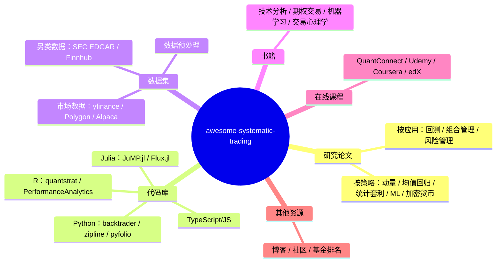
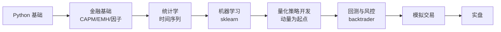

目录

- [这个仓库是什么](#这个仓库是什么)
- [资源分类总览](#资源分类总览)
- [量化工作的三个阶段：研究、回测、实盘](#量化工作的三个阶段研究回测实盘)
- [五大策略方向：核心论文与代码示例](#五大策略方向核心论文与代码示例)
- [数据集与数据源](#数据集与数据源)
- [代码库：Python / R / Julia](#代码库 python--r--julia)
- [书籍推荐](#书籍推荐)
- [学习路径：从零到量化策略开发](#学习路径从零到量化策略开发)
- [采用建议](#采用建议)
- [相关资源](#相关资源)

---

## 这个仓库是什么

[awesome-systematic-trading](https://github.com/paperswithbacktest/awesome-systematic-trading) 是一个按策略分类的论文导航 + 工具链清单。它解决一个具体问题：量化交易的论文和工具数量庞大，新手很难判断从哪里开始，老手容易漏掉某个方向的奠基工作。仓库本身不提供交易信号或回测平台，定位是知识地图——帮你找到每个策略方向的奠基论文、可用的回测库和能拿到行情的数据源。

从零学量化的人，可以用这个仓库缩短「不知道从哪篇论文开始」的时间。量化交易的论文数量巨大，但每个策略方向真正奠基的论文通常只有 3-5 篇，仓库帮你筛出了这些。

已经入门的量化研究者，可以把它当查漏补缺的工具：检查自己有没有漏掉某个方向的经典论文，或者某个 Python 库比自己手写的版本更成熟。

> Stars 数会随时间变化，文中提到的 8.4k Stars 为 2026 年 4 月观测值，使用时以仓库当前数据为准。

---

## 资源分类总览



仓库内容可以归为三类：研究材料（论文、书籍）、工具（代码库、回测框架）、原料（数据源）。三类资源对应量化工作的不同阶段，下一节展开。

---

## 量化工作的三个阶段：研究、回测、实盘

量化交易的工作流可以拆成三个边界清晰的阶段，每个阶段用到的资源类型不同。

**研究阶段**：读论文，理解策略的经济学直觉和统计假设。产出是策略的逻辑描述和参数范围。这个阶段用到的资源是论文和书籍。

**回测阶段**：用历史数据验证策略，检查收益、夏普比率、最大回撤、换手率。产出是回测报告和参数选择。这个阶段用到的资源是回测框架（backtrader、zipline）和历史数据（yfinance、Polygon）。

**实盘阶段**：接入实时行情和券商接口，处理滑点、延迟、资金成本。产出是实盘交易记录。这个阶段用到的资源是券商 API（Alpaca）和实时数据源。

三个阶段之间会反复迭代。回测发现问题会回到研究阶段调整逻辑，实盘表现偏离回测会回到回测阶段检查数据或参数。但每个阶段的核心工件不同：研究阶段产出论文笔记和策略假设，回测阶段产出回测报告，实盘阶段产出交易记录和监控面板。

下面以动量策略为例，走一遍从论文到回测的完整流程：

1. **读论文**：Jegadeesh & Titman (1993) 发现过去 3-12 个月表现好的股票在未来 3-12 个月继续跑赢。策略假设是「价格趋势有惯性」。
2. **写策略**：用过去 12 个月的收益率作为信号，正动量做多，负动量做空。
3. **回测**：用 yfinance 拉标普 500 成分股数据，按月调仓，计算夏普比率和最大回撤。
4. **检查**：对比不同 lookback 周期（3、6、12 个月），看收益是否稳定，检查换手率和交易成本的影响。

这个流程串起了三类资源：论文给出策略假设，回测框架验证假设，数据源提供原料。awesome-systematic-trading 的价值在于帮你快速定位每个环节该用什么。

---

## 五大策略方向：核心论文与代码示例

### 动量策略 (Momentum / Trend Following)

动量策略是量化交易中研究最多、证据最充分的方向之一。Jegadeesh & Titman (1993) 的经典论文发现：过去 3-12 个月表现好的股票，在未来 3-12 个月继续跑赢的概率显著高于随机游走。Asness et al. (2013) 进一步证明动量效应在全球多个资产类别中都存在。

动量效应为什么存在？学术上有几种解释：投资者对信息反应不足（新信息缓慢反映到价格里）、羊群效应（趋势形成后跟风资金强化趋势）、处置效应（赢家卖得太早、输家拿得太久）。这些行为偏差共同导致价格趋势在时间上有惯性。

核心论文：
- Jegadeesh & Titman (1993) — 动量效应的原始发现
- Asness et al. (2013) — 跨资产类别的价值与动量
- Moskowitz et al. (2012) — 时间序列动量（期货市场）
- Hurst et al. (2013) — 动态动量策略

```python
def momentum_strategy(prices, lookback=12, holding=1):
    """简单动量策略：过去 lookback 月涨幅 > 0 则做多，否则做空"""
    returns = prices.pct_change(periods=lookback)
    signal = returns.shift(holding)
    # 做多正动量，做空负动量
    return signal.apply(lambda x: 1 if x > 0 else -1)
```

### 均值回归 (Mean Reversion)

均值回归策略基于一个假设：资产价格在短期会偏离均值，但长期会回归。配对交易（Pairs Trading）是最经典的均值回归实现——找两只高度相关的股票，当价差扩大时做空强势股、做多弱势股，等价差回归后平仓。

均值回归成立的前提是协整关系：两只股票的价差是平稳序列，不会无限发散。如果只是相关而不协整，价差可能趋势性扩大，配对交易会持续亏损。所以实施前必须做协整检验（Engle-Granger 或 Johansen 检验）。

核心论文：
- Gatev et al. (2006) — 配对交易的基础框架
- Elliott et al. (2005) — 配对交易的随机过程建模
- Pole (2007) — 统计套利的系统化方法

```python
def pairs_trading(stock1, stock2, lookback=60, entry_threshold=2.0):
    """配对交易：价差 z-score 超越阈值时入场，回归时平仓"""
    spread = stock1 - stock2
    z_score = (spread - spread.rolling(lookback).mean()) / spread.rolling(lookback).std()
    if z_score > entry_threshold:
        return -1  # 做空价差
    elif z_score < -entry_threshold:
        return 1   # 做多价差
    elif abs(z_score) < 0.5:
        return 0   # 平仓
    return 0
```

### 统计套利 (Statistical Arbitrage)

统计套利在均值回归的基础上扩展：从两只股票扩展到多资产组合，用协方差矩阵做权重优化。Avellaneda & Lee (2010) 的论文是统计套利的标准框架，他们用 PCA 提取残差因子，对残差做均值回归。

统计套利和配对交易的区别在于维度。配对交易处理两只股票的价差，统计套利处理一个股票池相对于共同因子的残差。残差更接近白噪声，均值回归的统计性质更好，但对模型假设更敏感。

核心论文：
- Avellaneda & Lee (2010) — 统计套利的系统框架
- Bogousslavsky (2016) — 低频再平衡的套利策略
- Narang (2013) — Inside the Black Box，量化交易入门必读

```python
class StatisticalArbitrage:
    def __init__(self, securities, lookback=20):
        self.securities = securities
        self.lookback = lookback

    def compute_weights(self):
        returns = self.securities.pct_change()
        cov = returns.rolling(self.lookback).cov()
        inv_cov = np.linalg.pinv(cov.values)
        mu = returns.mean()
        self.weights = inv_cov @ mu
        return self.weights
```

### 机器学习交易 (Machine Learning Trading)

ML 在量化交易中的应用集中在两个方向：价格预测（LSTM/Transformer）和因子挖掘（树模型）。Fischer & Krauss (2018) 用 LSTM 预测 S&P 500 成分股，证明深度学习在选股上优于传统模型。

ML 在量化里的主要陷阱是过拟合。金融数据信噪比极低，深度模型容易学到噪声。López de Prado 在《Advances in Financial Machine Learning》里反复强调：金融 ML 的关键问题在于如何构造有效的交叉验证（Purged K-Fold）和控制特征数量，模型复杂度反而是次要因素。

核心论文：
- Dixon et al. (2016) — 机器学习在交易中的应用综述
- Fischer & Krauss (2018) — LSTM 股票预测
- Kolm & Ritter (2019) — 机器学习在金融中的现代视角

### 加密货币交易 (Crypto Trading)

加密货币市场的微观结构与传统市场不同——24/7 交易、无涨跌停、跨交易所价差大。Makarov & Schoar (2020) 系统研究了加密货币的跨交易所套利，发现价差主要来自资本流动摩擦，交易成本反而是次要因素。

加密货币适合作为独立方向研究，因为它的市场参与者结构、流动性分布、监管环境都和股票市场差异很大。同样的动量策略在加密货币上的表现可能和股票市场相反——加密货币的动量更短（周级别），反转更快。

核心论文：
- Makarov & Schoar (2020) — 加密货币跨交易所套利
- Liu (2019) — 加密货币动量效应

---

## 数据集与数据源

### 市场数据（免费 + 付费）

| 数据源 | 类型 | 免费额度 | 适合场景 |
| ------ | ------ | ------ | ------ |
| yfinance | 股票/ETF | 免费 | 学习、回测、A 股/美股 |
| Polygon.io | 实时/历史 | 有限免费 | 实时行情 |
| Alpaca | 免佣金 | 免费 | 美股实盘 |
| Binance | 加密货币 | 免费 | 加密货币回测 |
| CCXT | 加密货币 | 免费 | 跨交易所统一接口 |

```python
import yfinance as yf

def get_market_data(tickers, start='2010-01-01', end='2024-12-31'):
    data = yf.download(tickers, start=start, end=end)
    return data['Adj Close']
```

yfinance 是非官方接口，Yahoo Finance 可能随时更改 API 导致库失效。生产环境建议用 Polygon 或 Alpaca 的官方 API。

### 另类数据

| 数据源 | 类型 | 用途 |
| ------ | ------ | ------ |
| SEC EDGAR | 监管文件 | 基本面分析、事件驱动 |
| Finnhub | 新闻/情绪 | 舆情分析 |
| Twitter API | 社交媒体 | 情绪信号 |
| 卫星图像 | 物理数据 | 零售、能源趋势 |

另类数据的门槛在数据清洗，获取反而是次要问题。卫星图像原始数据需要大量预处理才能转成可用信号，个人研究者通常用聚合后的二手数据。

---

## 代码库：Python / R / Julia

### Python 量化生态

| 库 | 用途 | 替代方案 |
| ------ | ------ | ------ |
| backtrader | 回测框架 | zipline |
| zipline | 回测框架（Quantopian 开源） | backtrader |
| pyfolio | 组合分析 | 自定义 |
| quantlib | 衍生品定价 | — |
| ffn | 金融函数 | 自定义 |

```python
import backtrader as bt

class MovingAverageStrategy(bt.Strategy):
    def __init__(self):
        self.ma = bt.indicators.SMA(period=20)

    def next(self):
        if self.data.close > self.ma:
            self.buy()
        elif self.data.close < self.ma:
            self.sell()
```

backtrader 文档更完整、社区更活跃，适合新手；zipline 的 API 设计更接近 Quantopian 的生产环境，但 Quantopian 已于 2020 年关闭，zipline 的维护由社区接手（zipline-reloaded）。

### R 量化生态

R 在学术量化社区中仍然活跃，quantstrat 是 R 生态中最成熟的回测框架。

```r
library(quantstrat)

创建策略
strategy("ma_cross") <- function() {
    add.indicator(name = "SMA",
                  arguments = list(x = quote(mktdata), n = 20),
                  label = "fast")
}
```

上面的代码是简化示意，quantstrat 的实际用法涉及更多初始化步骤（`initStrat`、`initPortf`、`initAcct`），完整示例可参考 quantstrat 官方文档。

### Julia 量化生态

Julia 在金融工程中增长最快，JuMP.jl 是数学优化领域的事实标准，Flux.jl 是纯 Julia 实现的深度学习框架。

```julia
function backtest(prices, signals)
    returns = diff(prices) ./ prices[1:end-1]
    strategy_returns = returns .* signals[2:end]
    cumulative = cumprod(1 .+ strategy_returns)
    return cumulative
end
```

Julia 的优势在数值计算性能接近 C，且语法接近 Python。但生态规模远不及 Python，量化相关的库数量少，适合对性能敏感的特定场景（高频因子计算、大规模组合优化）。

---

## 书籍推荐

### 入门必读（按顺序）

1. **Quantitative Trading** — Ernest Chan：从零到实盘的最短路径，适合有编程基础但没做过量化的人
2. **Machine Learning for Algorithmic Trading** — Stefan Jansen：把 ML 和交易结合得最系统的一本书
3. **Advances in Financial Machine Learning** — Marcos López de Prado：金融 ML 的进阶读物，关注过拟合和样本偏差

### 专题深入

| 方向 | 推荐书籍 | 作者 |
| ------ | ------ | ------ |
| 技术分析 | Technical Analysis of the Financial Markets | John Murphy |
| 期权 | Options, Futures, and Other Derivatives | John Hull |
| 风险管理 | Dynamic Hedging | Nassim Taleb |

---

## 学习路径：从零到量化策略开发



1. **Python 基础**（1-2 周）：pandas、numpy、matplotlib 达到能独立处理时间序列的水平
2. **金融基础**（2-4 周）：理解 CAPM、有效市场假说、Fama-French 三因子模型
3. **统计学与时间序列**（2-4 周）：协整检验、平稳性、ARIMA/GARCH
4. **机器学习**（4-8 周）：scikit-learn 入门，重点理解特征工程和交叉验证
5. **量化策略开发**（持续）：从动量策略开始，逐步尝试均值回归和统计套利
6. **回测与风险管理**（持续）：用 backtrader 做回测，关注夏普比率、最大回撤和过拟合检测

时间估计按每天 2-3 小时投入计算。全职投入可以压缩一半，只能周末学习则需要延长 2-3 倍。

---

## 采用建议

**入门者**：先读 Ernest Chan 的《Quantitative Trading》，同时用 yfinance 拉数据、用 backtrader 跑通一个动量策略示例。不要一开始就上 ML，先把动量和均值回归的逻辑跑通，理解夏普比率和最大回撤的计算。

**已经入门的研究者**：按策略方向对照仓库的论文清单，检查自己是否漏掉了奠基论文。统计套利方向重点看 Avellaneda & Lee (2010)，ML 方向重点看 López de Prado 的过拟合处理。

**准备上实盘者**：从 Alpaca 的 paper trading 开始，先验证回测和模拟盘的差异。实盘的滑点、延迟、资金成本会侵蚀回测收益（行业经验是夏普比率打 30-50% 的折扣，具体取决于策略换手率），回测时要把这些因素算进去。

**通用建议**：awesome-systematic-trading 帮你定位资源，但论文得自己读、代码得自己跑、回测得自己验证。仓库缩短的是找资源的时间，剩下的工作仍要自己完成。

---

## 相关资源

| 资源 | 用途 |
| ------ | ------ |
| [GitHub 仓库](https://github.com/paperswithbacktest/awesome-systematic-trading) | 完整资源列表 |
| [Backtrader](https://www.backtrader.com) | Python 回测框架 |
| [QuantConnect](https://www.quantconnect.com) | 云端量化平台（含教程） |
| [Zipline](https://zipline.io) | Quantopian 开源回测引擎 |

---

*本文基于 awesome-systematic-trading 仓库内容整理，Stars 数据为 2026 年 4 月观测值。代码示例仅作教学用途，不构成投资建议。*
