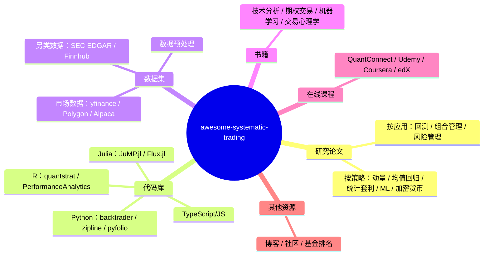
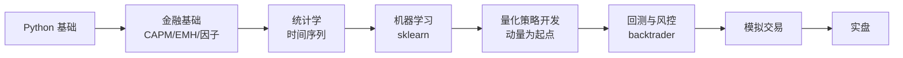

## 目录

- [这个仓库怎么用](#这个仓库怎么用)
- [资源分类总览](#资源分类总览)
- [五大策略方向：核心论文与代码示例](#五大策略方向核心论文与代码示例)
- [数据集与数据源](#数据集与数据源)
- [代码库：Python / R / Julia](#代码库python--r--julia)
- [书籍推荐](#书籍推荐)
- [学习路径：从零到量化策略开发](#学习路径从零到量化策略开发)
- [相关资源](#相关资源)

---

## 这个仓库怎么用

[awesome-systematic-trading](https://github.com/paperswithbacktest/awesome-systematic-trading)（8.4k Stars）本质上是一个按策略分类的论文导航 + 工具链清单。它不提供交易信号，也不提供回测平台——它提供的是**知识地图**：哪些论文定义了某个策略方向，哪些库可以跑回测，哪些数据源能拿到市场数据。

对正在从零学量化的人来说，这个仓库的价值在于**缩短了「不知道从哪篇论文开始」的时间**。量化交易的论文数量巨大，但真正值得读的经典论文不超过 50 篇——这个仓库帮你筛出了这些。

对已经入门的量化研究者来说，它更像一个**查漏补缺的工具**：看看自己有没有漏掉某个方向的经典论文，或者某个 Python 库比自己手写的版本更成熟。

---

## 资源分类总览



---

## 五大策略方向：核心论文与代码示例

### 动量策略 (Momentum / Trend Following)

动量策略是量化交易中研究最多、证据最充分的方向之一。Jegadeesh & Titman (1993) 的经典论文发现：过去 3-12 个月表现好的股票，在未来 3-12 个月继续跑赢的概率显著高于随机游走。Asness et al. (2013) 进一步证明动量效应在全球 8 个资产类别中都存在。

核心论文：
- Jegadeesh & Titman (1993) — 动量效应的原始发现
- Asness et al. (2013) — 跨资产类别的价值与动量
- Moskowitz et al. (2012) — 时间序列动量（期货市场）
- Hurst et al. (2013) — 动态动量策略

```python
def momentum_strategy(prices, lookback=12, holding=1):
    """简单动量策略：过去 lookback 月涨幅 > 0 则做多，否则做空"""
    returns = prices.pct_change(periods=lookback)
    signal = returns.shift(holding)
    # 做多正动量，做空负动量
    return signal.apply(lambda x: 1 if x > 0 else -1)
```

### 均值回归 (Mean Reversion)

均值回归策略基于一个假设：资产价格在短期会偏离均值，但长期会回归。配对交易（Pairs Trading）是最经典的均值回归实现——找两只高度相关的股票，当价差扩大时做空强势股、做多弱势股，等价差回归后平仓。

核心论文：
- Gatev et al. (2006) — 配对交易的基础框架
- Elliott et al. (2005) — 配对交易的随机过程建模
- Pole (2007) — 统计套利的系统化方法

```python
def pairs_trading(stock1, stock2, lookback=60, entry_threshold=2.0):
    """配对交易：价差 z-score 超越阈值时入场，回归时平仓"""
    spread = stock1 - stock2
    z_score = (spread - spread.rolling(lookback).mean()) / spread.rolling(lookback).std()
    if z_score > entry_threshold:
        return -1  # 做空价差
    elif z_score < -entry_threshold:
        return 1   # 做多价差
    elif abs(z_score) < 0.5:
        return 0   # 平仓
    return 0
```

### 统计套利 (Statistical Arbitrage)

统计套利比均值回归更进一步——它不只依赖两只股票的关系，而是构建一个多资产组合，利用协方差矩阵做优化。Avellaneda & Lee (2010) 的论文是统计套利的标准框架。

核心论文：
- Avellaneda & Lee (2010) — 统计套利的系统框架
- Bogousslavsky (2016) — 低频再平衡的套利策略
- Narang (2013) — Inside the Black Box，量化交易入门必读

```python
class StatisticalArbitrage:
    def __init__(self, securities, lookback=20):
        self.securities = securities
        self.lookback = lookback

    def compute_weights(self):
        returns = self.securities.pct_change()
        cov = returns.rolling(self.lookback).cov()
        inv_cov = np.linalg.pinv(cov.values)
        mu = returns.mean()
        self.weights = inv_cov @ mu
        return self.weights
```

### 机器学习交易 (Machine Learning Trading)

ML 在量化交易中的应用集中在两个方向：价格预测（LSTM/Transformer）和因子挖掘（树模型）。Fischer & Krauss (2018) 用 LSTM 预测 S&P 500 成分股，证明深度学习在选股上优于传统模型。

核心论文：
- Dixon et al. (2016) — 机器学习在交易中的应用综述
- Fischer & Krauss (2018) — LSTM 股票预测
- Kolm & Ritter (2019) — 机器学习在金融中的现代视角

### 加密货币交易 (Crypto Trading)

加密货币市场的微观结构与传统市场不同——24/7 交易、无涨跌停、跨交易所价差大。Makarov & Schoar (2020) 系统研究了加密货币的跨交易所套利。

核心论文：
- Makarov & Schoar (2020) — 加密货币跨交易所套利
- Liu (2019) — 加密货币动量效应

---

## 数据集与数据源

### 市场数据（免费 + 付费）

| 数据源 | 类型 | 免费额度 | 适合场景 |
| ------ | ------ | ------ | ------ |
| yfinance | 股票/ETF | 免费 | 学习、回测、A股/美股 |
| Polygon.io | 实时/历史 | 有限免费 | 实时行情 |
| Alpaca | 免佣金 | 免费 | 美股实盘 |
| Binance | 加密货币 | 免费 | 加密货币回测 |
| CCXT | 加密货币 | 免费 | 跨交易所统一接口 |

```python
import yfinance as yf

def get_market_data(tickers, start='2010-01-01', end='2024-12-31'):
    data = yf.download(tickers, start=start, end=end)
    return data['Adj Close']
```

### 另类数据

| 数据源 | 类型 | 用途 |
| ------ | ------ | ------ |
| SEC EDGAR | 监管文件 | 基本面分析、事件驱动 |
| Finnhub | 新闻/情绪 | 舆情分析 |
| Twitter API | 社交媒体 | 情绪信号 |
| 卫星图像 | 物理数据 | 零售、能源趋势 |

---

## 代码库：Python / R / Julia

### Python 量化生态

| 库 | 用途 | 替代方案 |
| ------ | ------ | ------ |
| backtrader | 回测框架 | zipline |
| zipline | 回测框架（Quantopian 开源） | backtrader |
| pyfolio | 组合分析 | 自定义 |
| quantlib | 衍生品定价 | — |
| ffn | 金融函数 | 自定义 |

```python
import backtrader as bt

class MovingAverageStrategy(bt.Strategy):
    def __init__(self):
        self.ma = bt.indicators.SMA(period=20)

    def next(self):
        if self.data.close > self.ma:
            self.buy()
        elif self.data.close < self.ma:
            self.sell()
```

### R 量化生态

R 在学术量化社区中仍然活跃，quantstrat 是 R 生态中最成熟的回测框架。

```r
library(quantstrat)

# 创建策略
strategy("ma_cross") <- function() {
    add.indicator(name = "SMA",
                  arguments = list(x = quote(mktdata), n = 20),
                  label = "fast")
}
```

### Julia 量化生态

Julia 在金融工程中增长最快，JuMP.jl 是数学优化领域的事实标准，Flux.jl 是纯 Julia 实现的深度学习框架。

```julia
function backtest(prices, signals)
    returns = diff(prices) ./ prices[1:end-1]
    strategy_returns = returns .* signals[2:end]
    cumulative = cumprod(1 .+ strategy_returns)
    return cumulative
end
```

---

## 书籍推荐

### 入门必读（按顺序）

1. **Quantitative Trading** — Ernest Chan：从零到实盘的最短路径，适合有编程基础但没做过量化的人
2. **Machine Learning for Algorithmic Trading** — Stefan Jansen：把 ML 和交易结合得最系统的一本书
3. **Advances in Financial Machine Learning** — Marcos López de Prado：金融 ML 的进阶读物，关注过拟合和样本偏差

### 专题深入

| 方向 | 推荐书籍 | 作者 |
| ------ | ------ | ------ |
| 技术分析 | Technical Analysis of the Financial Markets | John Murphy |
| 期权 | Options, Futures, and Other Derivatives | John Hull |
| 风险管理 | Dynamic Hedging | Nassim Taleb |

---

## 学习路径：从零到量化策略开发



1. **Python 基础**（1-2 周）：pandas、numpy、matplotlib 达到能独立处理时间序列的水平
2. **金融基础**（2-4 周）：理解 CAPM、有效市场假说、Fama-French 三因子模型
3. **统计学与时间序列**（2-4 周）：协整检验、平稳性、ARIMA/GARCH
4. **机器学习**（4-8 周）：scikit-learn 入门，重点理解特征工程和交叉验证
5. **量化策略开发**（持续）：从动量策略开始，逐步尝试均值回归和统计套利
6. **回测与风险管理**（持续）：用 backtrader 做回测，关注夏普比率、最大回撤和过拟合检测

---

## 相关资源

| 资源 | 用途 |
| ------ | ------ |
| [GitHub 仓库](https://github.com/paperswithbacktest/awesome-systematic-trading) | 完整资源列表 |
| [Backtrader](https://www.backtrader.com) | Python 回测框架 |
| [QuantConnect](https://www.quantconnect.com) | 云端量化平台（含教程） |
| [Zipline](https://zipline.io) | Quantopian 开源回测引擎 |

---

*本文基于 awesome-systematic-trading (8.4k Stars) 仓库内容整理，代码示例仅作教学用途，不构成投资建议。*