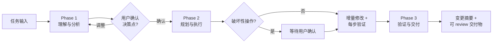

## 快速信息卡

| 项目 | 信息 |
|------|------|
| **仓库地址** | [awslabs/aidlc-workflows](https://github.com/awslabs/aidlc-workflows) |
| **Stars** | 1,703+ |
| **许可证** | MIT No Attribution |
| **首发** | 2026 年初 |
| **支持平台** | Kiro、Amazon Q Developer、Cursor、Cline、Claude Code、GitHub Copilot、OpenAI Codex |

## 学习目标

读完本文你能：

1. **画出 AI-DLC 三阶段流程图**，说出每个阶段的核心约束条件。
2. **判断一个开发任务是否值得加载 AI-DLC 规则**，还是跳过更划算。
3. **在自己的 IDE 中完成规则文件的安装和配置**。
4. **向团队成员解释 AI-DLC 与 CI/CD 的分工边界**。
5. **理解核心规则与条件规则的分工**，知道为什么两层要分开存放。

## 目录

- [三阶段工作流总览](#三阶段工作流总览)
- [三阶段自适应工作流](#三阶段自适应工作流)
- [一个具体任务如何流过三个阶段](#一个具体任务如何流过三个阶段)
- [规则结构](#规则结构)
- [在 IDE 中加载规则](#在-ide-中加载规则)
- [什么时候该用](#什么时候该用)
- [与其他工具的分工](#与其他工具的分工)
- [从哪里开始](#从哪里开始)
- [常见问题](#常见问题)
- [自测题](#自测题)
- [进阶路径](#进阶路径)
- [延伸阅读](#延伸阅读)


> **读完你会**：
>
> - 画出 AI-DLC 三阶段流程图，说出每个阶段的核心约束条件
> - 判断一个开发任务是否值得加载 AI-DLC 规则，还是跳过更划算
> - 在自己的 IDE（Kiro / Cursor / Claude Code）中完成规则文件的安装和配置
> - 向团队成员解释 AI-DLC 与 CI/CD 的分工边界

AWS Labs 的 AI-DLC（AI-Driven Development Life Cycle）把"AI 编码助手该怎么做事"写成了一组可加载的规则文件，托管在 [awslabs/aidlc-workflows](https://github.com/awslabs/aidlc-workflows)（截至 2026 年 5 月，GitHub 星标约 1,703，MIT No Attribution 协议）。它对准的是一个问题：Claude Code、Cursor 这类助手灵活度极高，你可以让它做任何事，但执行顺序和质量完全押在单次 prompt 上。同一个需求换个人、换个措辞，产出可能差出几条街。AI-DLC 把"先理解上下文、再规划步骤、最后验证结果"这套顺序固化进规则，让 AI 每次接任务都走同一套流程。

它在 IDE 里扮演"方向盘规则"的角色——约束 AI 做事的顺序，能力本身仍由底层编码工具提供。目前支持的平台包括 Kiro、Amazon Q Developer、Cursor、Cline、Claude Code、GitHub Copilot 和 OpenAI Codex。

## 三阶段工作流总览

AI-DLC 把每次任务执行都压进一个三阶段循环，绕不开这三步：

| 阶段 | 做什么 | 关键输出 |
|------|--------|----------|
| Phase 1：理解与分析 | 扫描代码库结构、识别依赖和风险、评估复杂度 | 任务分析报告 + 用户需确认的决策点 |
| Phase 2：规划与执行 | 分解为可验证的子任务、逐步实施、关键变更前请求确认 | 增量修改 + 每步验证记录 |
| Phase 3：验证与交付 | 运行测试、检查代码风格、回归验证 | 变更摘要 + 可 review 的交付物 |



三个阶段各自解决什么问题？用一个具体任务串起来看。

## 三阶段自适应工作流

### Phase 1：理解与分析（Understand & Analyze）

AI 接到任务后不会直接动手，而是先做一轮上下文采集：扫描代码库的目录结构和现有依赖，标记可能受影响的模块，判断任务是否需要引入外部库或环境变更。复杂度高的任务，Phase 1 还会给出分步建议，避免一口吃成胖子。

这一阶段产出的**任务分析报告**包含：

- 当前代码库中与任务相关的关键路径
- 可能产生冲突或副作用的区域
- 推荐的实现方案
- 需要用户拍板的关键决策点（比如：要不要升级某个依赖、是否采用破坏性 API 变更）

Phase 1 强制 AI 在动手前给出书面报告，让你有机会在编码开始前纠正方向。这一步看起来多余——现代 AI 工具大多能自动读取项目文件——但自动读取不等于有意识分析。实际使用中，不少返工恰恰出在 AI 自动读了文件但理解错了上下文：它读到了 `User` 模型，却没注意到 `User` 和 `Order` 之间有外键级联，改 `User` 字段时漏掉了 `Order` 的同步更新。Phase 1 的分析报告会把这类跨模块影响显式列出来。

### Phase 2：规划与执行（Plan & Execute）

Phase 1 的报告通过后，进入执行。这一阶段的约束只有一条：**每一步都要可验证**。

复杂任务会被拆成多个子任务，AI 在每一步开始前先说明意图，执行后立即检查结果。逐步验证是为了在偏差出现时立即纠正——等整个任务完成再回头检查，AI 可能已经基于错误前提连续执行了多步，回滚成本会指数级上升。

遇到破坏性操作（删文件、改数据库 schema、批量重命名等），规则要求 AI 在动手前等用户确认。这类操作要么不可逆，要么影响范围跨越多个模块，自动执行的风险高于等待确认的成本。代码修改优先走增量路线——能 patch 的不重写整个文件——完整重写会丢失原有细节，diff 也难以 review，回滚时更是要整文件撤销。

### Phase 3：验证与交付（Verify & Deliver）

所有改动完成后，AI 走一轮系统性验证：跑项目已有的测试、检查代码风格是否与项目规范一致、做一轮回归确认没有引入新问题。最后输出一份变更摘要，列出改了哪些文件、为什么改、有什么需要注意的地方，方便人类 review。

这层验证和 CI/CD 的差别在反馈时机。AI 在会话内跑测试，发现问题可以立即修复，上下文还在手上；完全依赖 CI/CD 的话，等流水线报错再回到 AI，会话上下文可能已经丢失，AI 需要重新理解之前的修改才能修复。变更摘要的作用是降低人类 review 的成本——reviewer 不必逐个 diff 阅读，先看摘要判断哪些改动需要重点关注。

## 一个具体任务如何流过三个阶段

假设你在一个 Python 项目中要求 AI "给用户模块加上邮箱验证功能"。在 AI-DLC 规则下，AI 的执行路径大致是：

1. **Phase 1**：AI 先扫描 `users/` 目录，发现已有 `User` 模型使用 SQLAlchemy，依赖 `flask-mail` 但未配置。分析报告会标注：需要新增 `email_verified` 字段和验证令牌表，建议生成迁移脚本，并询问你"是否沿用 flask-mail 还是换成其他邮件服务"。
2. **Phase 2**：你确认方案后，AI 先创建数据库迁移、再添加验证令牌模型、再写邮件发送逻辑、最后改注册流程——每一步都先说明意图再执行，在执行"修改 User 模型"这种会影响全表的操作前等待确认。
3. **Phase 3**：AI 运行 `pytest users/`，检查 `.flake8` 规范，确认所有已有测试仍然通过，然后输出变更摘要：改了哪些文件、新增了哪些端点、迁移脚本的 up/down 逻辑。

这个例子真正起作用的是流程本身：规则文件替你把关"先分析再动手、重要操作要确认、做完要验证"这三件事，整个过程的稳定性不再押在单次 prompt 的质量上。AI 能不能写出验证逻辑并不重要——没有 AI-DLC 也能写。

## 规则结构：核心层与条件层

AI-DLC 的规则分两层：

**核心规则（`aws-aidlc-rules/`）**：定义工作流的主要阶段和阶段间的转换条件。每次任务执行都会加载这一层。

**条件规则（`aws-aidlc-rule-details/`）**：当核心规则触发特定场景时按需加载。比如检测到"删除文件"操作，加载删除确认流程；检测到"修改依赖"，加载依赖变更检查清单。条件规则按开发阶段分目录存放（`common/`、`inception/`、`construction/`、`extensions/`、`operations/`），核心规则通过相对路径引用。

条件规则文件本身是一段 Markdown 文本，告诉 AI 遇到特定场景时该做什么。以"破坏性操作确认"为例，规则内容大致长这样：

```markdown
# Destructive Operation Confirmation

When the requested change involves any of the following:
- Deleting files or directories
- Modifying database schema (migrations, table drops, column renames)
- Batch renaming across more than 3 files
- Force push or history rewrite

Before executing:
1. List the exact files/objects that will be affected
2. State whether the operation is reversible
3. Explicitly ask the user for confirmation
4. Wait for approval before proceeding

Do not batch multiple destructive operations into a single confirmation.
Each operation requires its own approval.
```

核心规则在运行时检测到"删除文件"这类意图，就会把对应的条件规则读进上下文，AI 接下来执行该操作时就要遵守上述约束。没有触发场景时，这段文本不会占用上下文窗口。

两层分开的原因是上下文成本。核心规则本身很轻量、普遍适用；条件规则只在实际触发时才读入，避免每次任务加载全部规则导致上下文膨胀。长会话里这点尤其要紧——规则文件本身也占用 AI 的上下文窗口，全量加载会挤压实际代码的可见范围。

## 在 IDE 中加载规则

AI-DLC 通过 **Kiro Steering Files**（方向盘文件）机制与主流 IDE 集成。你需要：

1. 下载最新 releases 中的 `ai-dlc-rules-v<release-number>.zip`
2. 解压到项目目录外（如 `~/Downloads`）
3. 将 `aws-aidlc-rules/` 复制到 IDE 的规则目录（如 `.kiro/steering/`）
4. 将 `aws-aidlc-rule-details/` 复制到项目根目录的 `.kiro/` 下

以 Kiro 为例（macOS/Linux）：

```bash
mkdir -p .kiro/steering
cp -R ~/Downloads/aidlc-rules/aws-aidlc-rules .kiro/steering/
cp -R ~/Downloads/aidlc-rules/aws-aidlc-rule-details .kiro/
```

支持的平台及各自的规则目录：

- **Kiro**：原生支持 Steering Files，规则放 `.kiro/steering/`
- **Amazon Q Developer IDE Plugin**：规则放 `.amazonq/rules/`
- **Cursor IDE**：规则放 `.cursor/rules/`（`.mdc` 格式），条件规则放 `.aidlc-rule-details/`
- **Cline**：规则放 `.clinerules/`，条件规则放 `.aidlc-rule-details/`
- **Claude Code**：通过 `CLAUDE.md` 或环境变量加载
- **GitHub Copilot**：通过 `.github/copilot-instructions.md` 配置，早期版本对条件规则支持有限
- **OpenAI Codex**：通过 `AGENTS.md` 集成

不同平台的加载机制差异会影响条件规则的触发。Kiro 原生读取 `.kiro/` 目录，条件规则可自动触发；Cursor 和 Cline 需要把条件规则单独放到 `.aidlc-rule-details/`，由核心规则在运行时引用；Claude Code 依赖 `CLAUDE.md` 或环境变量，需要手动指定规则路径；GitHub Copilot 早期版本对规则文件的读取机制有限制，可能无法自动触发条件规则（详见下方 FAQ）。

## 什么时候该用，什么时候可以跳过

**值得加载 AI-DLC 的场景：**

**改动大、依赖多的代码库**。在模块相互纠缠的项目里做修改时，Phase 1 的分析能提前标出可能的副作用区域，减少"改完才发现漏了五个地方"的概率。

**多人各自用 AI 编码助手的项目**。不同的人用不同的工具，但分析报告和变更摘要都走同一套格式，人类 review 时不必重新理解"AI 是怎么想的"。

**高强度 AI 辅助开发**。每天大量使用 AI 编码工具的人，三阶段流程可以减少"做到一半发现方向错了"的返工。

**可以跳过 AI-DLC 的场景：**

- 快速验证想法——只是想看看某个 API 能不能用、某个方案能不能跑通，不需要走完整流程。
- 单行修改——改一个变量名、加一句日志，这类任务的成本在流程约束本身。
- 团队已有成熟的工作流规范和 CI/CD——AI-DLC 与现有 CI/CD 互补。CI/CD 已经覆盖测试和风格检查的话，Phase 3 的部分检查点会与之重叠，但 Phase 1 和 Phase 2 的约束仍然独立有效。

## 与其他工具的分工

AI-DLC 工作在编码工具之上，约束工具的行为，编码能力仍由底层工具提供。

| 层级 | 代表 | 做什么 |
|------|------|--------|
| 编码执行层 | Claude Code、Cursor、GitHub Copilot | 生成代码、修改文件、运行命令 |
| 流程规范层 | AI-DLC（aidlc-workflows） | 定义执行顺序、检查点、确认机制 |
| 质量保障层 | GitHub Actions、CI/CD 流水线 | 自动化测试、构建、部署 |

AI-DLC 的检查点发生在编码工具执行前后，CI/CD 的检查发生在代码提交后，两者覆盖的是开发流程的不同环节。AI-DLC 不会替代 CI/CD 的自动化检查，也不会替代编码工具的代码生成能力。

## 从哪里开始

AI-DLC 是否值得引入，要看你的日常开发模式与三阶段流程的重合度。按团队规模来看：

- **个人开发者**：已经在用 Claude Code 或 Cursor 做日常开发的人，建议先试一周——把规则文件加载进去，对比加载前后的任务执行质量。重点关注"AI 是否更少跳步"和"返工率是否下降"。
- **小团队（2-5 人）**：AI-DLC 的统一分析报告格式对 review 效率的提升最明显。建议从核心规则开始，条件规则按需逐步引入。
- **已有成熟 CI/CD 的团队**：Phase 1 和 Phase 2 的约束仍然适用，Phase 3 的部分检查点可能与现有 CI/CD 重复。可以先加载前两个阶段的规则，观察效果再决定是否启用完整三阶段。

想快速体验，从 Kiro 或 Cursor 入手最直接——这两个平台对 Steering Files 的支持最原生。Claude Code 用户需要通过 `CLAUDE.md` 或环境变量加载，GitHub Copilot 和 OpenAI Codex 需要额外配置，起步成本稍高。

## 常见问题

**Q：我的 AI 工具已经能自动读项目文件了，Phase 1 还有必要吗？**

有必要。自动读文件不等于有意识分析——AI 读到了 `User` 模型，未必会主动检查 `User` 和 `Order` 之间的外键级联。Phase 1 强迫 AI 在动手前给出书面分析，把"标记可能受影响的模块"和"评估复杂度"这两件容易跳过的事显式化，让你有机会在编码开始前纠正方向。

**Q：三阶段流程会不会让简单任务变得很慢？**

会的。改一行日志也走完整三阶段确实不划算。AI-DLC 允许按任务复杂度手动跳过某个阶段，并非所有任务都要走全流程。更现实的团队策略是：重大功能走全流程，Bug 修复只走 Phase 1 + Phase 3，单行修改直接跳过。核心规则本身很轻量，加载但不触发条件规则时上下文开销很小。

**Q：我用 Cursor，队友用 Claude Code，AI-DLC 能统一吗？**

能。AI-DLC 是一组纯文本规则文件，通过规则文本告诉 AI「按这个顺序做事」，不依赖任何特定工具的能力。Cursor 通过 `.cursor/rules/` 加载，Claude Code 通过 `CLAUDE.md` 加载，读到的是同一套规则，产出的分析报告格式也一致。多人多工具协作时，这种跨工具的一致性正是 AI-DLC 的价值所在。

**Q：AI-DLC 和直接在 prompt 里写「先分析再动手最后验证」有什么区别？**

一句 prompt 太模糊了。「分析」要到什么粒度？「验证」具体包括什么？遇到破坏性操作要不要确认？这些细化约束每次手写 prompt，不仅容易遗漏，不同人写出来的标准也不一样。AI-DLC 的规则文件把流程写到了具体步骤级别——比如「修改数据库 schema 前必须等待用户确认」——并用条件规则机制让特化场景按需加载，这是单次 prompt 做不到的。

**Q：条件规则放不进 IDE 怎么办？**

部分平台（如早期版本的 GitHub Copilot）对规则文件的读取机制有限制，可能无法自动触发条件规则。退一步的做法是：把最常用的 2-3 条条件规则（比如「数据库迁移确认」和「删除文件确认」）直接合并进核心规则。代价是核心规则变重一些，但比完全失去检查要好。

## 自测：你是否理解了 AI-DLC

**1.** 同事让你「给用户模块加上邮箱验证」，AI 一上来就开始创建数据库迁移文件。按照 AI-DLC 规范，AI 跳过了哪个阶段？正确的第一步应该产出什么？

**2.** AI-DLC 的「条件规则」和「核心规则」为什么要分开存放，而不是合并成一个规则文件？

**3.** 你所在团队已经有一套完整的 CI/CD 流水线（自动运行测试、检查代码风格）。这种情况下，AI-DLC 的 Phase 3 还有必要启用吗？说明理由。

**4.** 下面哪个场景**不适合**加载 AI-DLC 规则？

- A）在 10 万行老项目中新增支付模块
- B）给 `README.md` 修正一个拼写错误
- C）三人团队各自用不同的 AI 工具协作开发
- D）每天大量使用 Claude Code 做全栈开发

## 进阶路径

**阶段一：试用（1 周）**
- 在主力 IDE（Kiro 或 Cursor）里加载 AI-DLC 规则文件。
- 对比加载前后做一个中等复杂度任务（如"给 User 模块加邮箱验证"），观察 AI 是否先产出分析报告。
- 重点关注"AI 是否更少跳步"和"返工率是否下降"。

**阶段二：会配（1 个月）**
- 把核心规则加载进团队所有成员的 IDE，统一分析报告格式。
- 按需引入条件规则（如"数据库迁移确认"、"删除文件确认"）。
- 制定团队内部的"什么场景走全流程、什么场景跳阶段"约定。

**阶段三：会改（3-6 个月）**
- 按团队技术栈修改条件规则内容（如把"Flask-Mail"换成团队实际用的邮件服务）。
- 为团队特有的开发流程写自定义条件规则。
- 建立 AI-DLC 规则与 CI/CD 流水线的分工边界（Phase 1/2 由规则覆盖，Phase 3 的测试由 CI 覆盖）。

**阶段四：会推（6 个月+）**
- 在团队内统一规则文件版本，建立定期更新机制。
- 向 AWS Labs 的 aidlc-workflows 仓库提交 PR，贡献通用条件规则。
- 写一份"AI-DLC 使用规范"给团队新人，降低上手成本。

---

**延伸阅读**：

- AWS 官方博客：https://aws.amazon.com/blogs/devops/ai-driven-development-life-cycle/
- 方法论论文（AWS Amplify 托管，域名可能变动）：https://prod.d13rzhkk8cj2z0.amplifyapp.com/
- GitHub 仓库：https://github.com/awslabs/aidlc-workflows

> 注：文中提到的星标数、release 版本号等时效性信息以 2026 年 5 月为准，后续可能有变化。AI-DLC 2.0 已进入 Preview 阶段，规则结构和加载方式可能调整，以仓库 README 为准。
