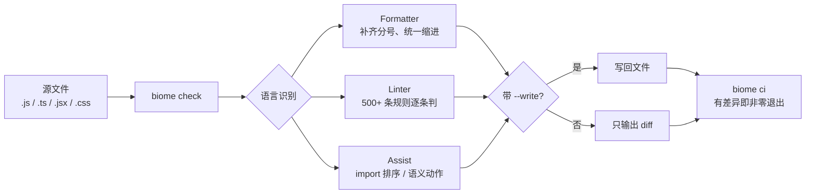

> **快速信息卡**
> - **GitHub**: [biomejs/biome](https://github.com/biomejs/biome)
> - **Stars**: 25,460+（GitHub API 2026-08-05 验证）
> - **Forks**: 1,166+
> - **License**: Apache-2.0
> - **语言**: Rust
> - **最后更新**: 2026-08-01

## 一句话判断

Biome 给前端工具链提供了一个"单二进制替代"的选项。新项目直接上，受够了 Prettier + ESLint 配置地狱的旧项目也可以考虑迁。但如果深度定制了 ESLint 插件，迁移成本需要仔细评估。

---

## 全文地图

```text
┌─────────────────────────────────────────────────────────┐
│  Biome 的三层能力                                        │
│  ├─ Formatter  ── 97% Prettier 兼容（JS/TS/JSX/JSON/CSS）│
│  ├─ Linter     ── 500+ 条规则（来自 ESLint 生态）        │
│  └─ Editor     ── VS Code / Open VSX 即时反馈            │
├─────────────────────────────────────────────────────────┤
│  2.x 新能力                                               │
│  ├─ Biotype ── 类型感知 Lint，无需 TypeScript 编译器     │
│  ├─ 插件    ── GritQL 自定义规则                         │
│  └─ Assist  ── import 与对象键排序等辅助动作             │
├─────────────────────────────────────────────────────────┤
│  工程取舍                                                 │
│  ├─ 收益：单二进制、零配置、CI 秒级                       │
│  └─ 代价：3% Prettier 差异、插件生态弱于 ESLint          │
├─────────────────────────────────────────────────────────┤
│  采用顺序                                                 │
│  新项目 → 直接上                                          │
│  存量项目 → Prettier 先迁 → ESLint 推荐集 → 清理配置     │
└─────────────────────────────────────────────────────────┘
```

## 一、来历：Rome 的遗产

Biome 的前身是 Rome——由 Babel 和 Yarn 的作者 Sebastian McKenzie 发起的一体化 JS 工具链项目。Rome 的目标很大：一个工具包办 Lint、格式化、打包、测试。2023 年 Rome Tools 公司没能撑下去，但代码没有死：原维护者把项目 fork 出来，改名 Biome 继续维护，同年 8 月发布 1.0。

这段历史解释了 Biome 的两个设计倾向：

- **单二进制**：Rome 想用一套解析与编译基础设施覆盖整个工具链，Biome 继承了这一点，只是把范围收敛到格式化与 Lint
- **少即是多**：Rome 因摊子铺得太大而难产，Biome 刻意保持精简，先把 formatter 和 linter 做扎实

到 2025 年 6 月，Biome 2.0（代号 Biotype）发布，把"类型感知 Lint"带进了不依赖 TypeScript 编译器的世界（详见第五节）。

## 二、为什么需要 Biome

一个典型前端项目的工具链现状：

```text
Prettier  ── 格式化 JS / TS / JSON / CSS
ESLint    ── 静态分析 JS / TS
typescript-eslint ── TS 专属规则
Stylelint ── CSS 专属
```

问题集中在四处：

- 工具数量多（4-5 个 npm 包），配置文件冗余
- 性能受 Node.js 单线程限制，大项目 CI 卡顿明显
- 规则冲突（Prettier 格式化 vs ESLint 风格规则要互相让位）
- 依赖膨胀（数百个传递依赖）

Biome 给的方案是**单二进制 + 单配置文件 + 一致行为**。

## 三、定位：三个核心能力

README 把 Biome 定位成三层能力：

### 1. 快速格式化

> **Biome is a fast formatter** for JavaScript, TypeScript, JSX, JSON, CSS and GraphQL that scores 97% compatibility with Prettier.

这是 Biome 最早的能力。97% 不是 100%——剩下 3% 落在 Prettier 历史设计里的一些边角，Biome 团队选择不强行兼容，以免拖累维护节奏。

### 2. 高性能 Linter

> **Biome is a performant linter** for JS / TS / JSX / JSON / CSS / GraphQL that features more than 500 rules from ESLint, typescript-eslint, and other sources. It outputs detailed and contextualized diagnostics.

规则从 ESLint、typescript-eslint 等生态移植加重写而来，官方 README 的口径是"超过 500 条"。规则名和大多数配置选项与原生态对齐，从 ESLint 迁过来时改动面可控。具体数量随版本涨落，不用记死一个整数。

### 3. 实时编辑器集成

> **Biome is designed from the start to be used interactively within an editor.** It can format and lint malformed code as you are writing it.

第一方支持 VS Code 和 Open VSX 上的扩展，编辑器内即时反馈。

## 四、性能：为什么用 Rust

Biome 全栈用 Rust 写，收益集中在冷启动和大仓库的 lint 速度上。

官方给出的是格式化方向的基准：在 2,104 个文件、171,127 行代码上，Biome 比 Prettier 快约 35 倍（来源：biomejs.dev）。lint 方向没有统一口径，加速幅度随文件规模、规则集大小差别很大，官网 benchmark 目录里有逐项数据可以核对；同为 Rust 写的 oxlint 还能再拉开一截。与其记住某个倍数，不如看它实际省在哪：

- 对开发机：保存即反馈，编辑器里 lint 基本无感知
- 对 CI：整仓 check 从"分钟级"压到"秒级"，PR 反馈更快
- 运维：不用再维护 Node 版本和 npm 依赖

代价是安装包变成二进制，需要操作系统匹配（GitHub Releases 提供全平台构建）。但单二进制比 npm 几百个传递依赖反而更好管理。

> 上面的 35x 测的是那个格式化场景，反映的是 Rust 解析 + 并行调度相对 Node.js 单线程的差距。它不能推出"你的 CI 一定快这么多"——真实收益取决于文件数量、规则集大小和 CI 机器规格。更细的基准口径见 biomejs/biome 仓库的 benchmark 目录。

## 五、Biome 2.x：Biotype 与类型感知

Biome 2.0（2025 年 6 月）代号 Biotype，核心是**类型感知 Lint 不再依赖 TypeScript 编译器**。typescript-eslint 要拉着 tsc 全程参与分析，慢；Biome 用自研的 Rust 类型推断引擎，先对项目做一次全量索引（类似 LSP），规则再按类型信息判断。官方口径：基于类型推断的 `noFloatingPromises` 能检出 typescript-eslint 约 75% 的问题，性能开销低一个量级。

v2 带来的几个实际能力：

| 能力 | 说明 |
|---|---|
| 多文件分析 | 内置 file scanner 索引全项目，规则可跨文件，如 `noImportCycles` |
| GritQL 插件 | 用 GritQL 模式语言写自定义 lint 规则（2025 年底 GritQL 归入 Biome 组织维护） |
| Domains | 规则按技术栈分组（next / react / solid / test），自动读 `package.json` 依赖决定启用哪组 |
| Assist | 不产生诊断的辅助动作，比如对象键排序、import 整理 |
| 抑制改进 | `// biome-ignore-all` 整文件忽略；`// biome-ignore-start` / `// biome-ignore-end` 忽略区间 |
| HTML 格式化 | 实验性，需在配置里显式开启 `html.formatter.enabled` |

版本还在快速演进：v2.4（2026 年 2 月）补上了嵌入式 CSS / GraphQL 片段格式化（styled-components、`gql` 标签），并推出一批 HTML 可访问性规则；v2.5（2026 年 6 月）规则数突破 500，GritQL 插件支持代码修复，跨文件 Lint 转正。从 v1 升级时，跑一遍 `biome migrate --write` 会自动处理配置里的破坏性变更（比如 `include` / `ignore` 改写成新的 `includes` 字段）。

## 六、安装与最小上手

### 安装

```bash
npm install --save-dev --save-exact @biomejs/biome
```

`--save-exact` 是 README 显式强调的——Biome 团队希望团队里所有人锁同一版本，避免 CI 和本地差异。

### 最小配置（`biome.json`）

```json
{
  "formatter": {
    "enabled": true,
    "indentStyle": "space",
    "indentWidth": 2
  },
  "linter": {
    "enabled": true,
    "rules": {
      "recommended": true
    }
  }
}
```

### CLI 常用命令

```bash
# 格式化整个项目
npx @biomejs/biome format --write .

# Lint + 自动修复
npx @biomejs/biome lint --write .

# 检查（CI 用）
npx @biomejs/biome ci .

# 交互式生成 biome.json
npx @biomejs/biome init

# 查单条规则的说明和示例
npx @biomejs/biome explain noUnusedVariables

# 只检查 git 暂存区（pre-commit 场景）
npx @biomejs/biome check --staged

# 只检查相对主干有变更的文件（CI 增量）
npx @biomejs/biome check --changed --since=main

# 收集环境与配置信息，提 issue 时附上
npx @biomejs/biome rage
```

`biome ci` 是为 CI 专门设计的入口——格式化、Lint、import 排序一次性跑完，遇到问题直接非零退出。`--staged` 和 `--changed --since=main` 能按 git 变更范围缩小检查面：前者适合本地 pre-commit，后者适合 CI 只查本次改动。`biome explain` 可以直接在终端看某条规则的用途和反例，不用开浏览器。

一次 `biome check` 在文件上走的路，大致是这样：



Formatter、Linter 与 Assist 三条线并行处理，最后统一决定写回还是只报 diff。`check` 通常在本地跑，可以加 `--write` 直接改写；`ci` 是 CI 入口，不写文件、遇到问题直接非零退出。两者共用同一套检查逻辑，区别只在运行场景和"能不能落盘"。

### 最小可运行示例

在一个空目录里走一遍，验证安装是否正常：

```bash
mkdir biome-demo && cd biome-demo
npm init -y
npm install --save-dev --save-exact @biomejs/biome
cat > biome.json <<'EOF'
{
  "formatter": { "enabled": true, "indentStyle": "space", "indentWidth": 2 },
  "linter": { "enabled": true, "rules": { "recommended": true } }
}
EOF
cat > index.js <<'EOF'
const x=1
var y = 2;
console.log( x,y )
EOF
npx @biomejs/biome check --write .
cat index.js
```

`biome check --write` 会同时跑格式化和 Lint 修复。`index.js` 里的多余空格会被抹平、分号补齐；如果 `noVar` 规则在 recommended 集里开启，`var` 还会被自动改成 `let`。如果没看到任何变化，先检查 `biome.json` 是否在项目根目录、`npx` 是否走的是本地安装。

## 七、迁移路径：从 Prettier + ESLint 迁过来

Biome 团队提供了官方迁移工具 `biome migrate eslint` / `biome migrate prettier`，能读 `eslintrc` 和 `.prettierrc`，按规则名映射成 `biome.json` 的等价配置。

迁移步骤建议：

1. **保留 ESLint 一段时间**：Biome 不是 100% ESLint 替代，业务里一些高度定制的 ESLint 规则可能没有覆盖
2. **先迁 Prettier**：97% 兼容性 + 自动化迁移工具，风险最低
3. **再迁 ESLint 推荐集**：开 `rules.recommended = true`，看哪些规则在工程里"误报"
4. **最后清理配置文件**：删掉 `.eslintrc`、`.prettierrc`，统一到 `biome.json`

> 不要一上来把 `.eslintrc` 全删——Biome 没覆盖的规则会沉默失效，比 ESLint 报错更危险。

### 常用规则映射

迁移时最常遇到的几条规则对应关系：

| ESLint | Biome |
|---|---|
| `no-unused-vars` | `lint/correctness/noUnusedVariables` |
| `no-console` | `lint/suspicious/noConsole` |
| `no-debugger` | `lint/suspicious/noDebugger` |
| `eqeqeq` | `lint/suspicious/noDoubleEquals` |
| `prefer-const` | `lint/style/useConst` |
| `no-var` | `lint/style/noVar` |

完整的可迁移规则清单见 `https://biomejs.dev/linter/rules/`。迁移后跑一遍 `biome lint .`，对照输出逐条确认严重级别和修复行为，别只看规则名对上就觉得完事。

## 八、Biome 不适合的场景

这几类场景不适合直接换 Biome：

- **需要 100% Prettier 兼容**：现存项目对比 PR 时，3% 差异会肉眼可见
- **需要 ESLint 高度自定义插件**：v2 起能用 GritQL 插件写自定义规则，但成熟度和可选数量都还比不上 ESLint 插件市场，用 JS 写的插件目前仍不支持
- **多语言 linter 需求（如 Python、Go）**：Biome 只覆盖 Web 栈
- **团队对 npm 生态高度绑定**：二进制发布 + npm 包装并存，可能和团队既有 release 流程冲突

## 九、与 oxlint / Prettier 的关系

近两年出现了几个竞争者，最常被对比的是：

| 工具 | 定位 |
|---|---|
| **Biome** | 一体化（formatter + linter），覆盖多语言，规则丰富 |
| **oxlint** | 纯 Linter（Rust 写），覆盖 ESLint 规则集，性能极致 |
| **Prettier** | 格式化事实标准（Node.js） |
| **ESLint** | Linter 事实标准（Node.js），插件生态最全 |

按场景挑：

- **新项目**：直接上 Biome，一个工具搞定
- **已有 ESLint + 想提速**：先上 oxlint 平替 Lint，保留 Prettier
- **存量 Prettier + ESLint + 不愿动**：保持现状，Biome 收益主要在新项目

oxlint 出自 oxc 项目——由 Vite 背后的 VoidZero 团队主导，想用同一套 AST 覆盖解析、转译、Lint、格式化、压缩。Biome 和它是两种思路：Biome 把 Lint 与格式化打通在一个二进制里，oxc 则按组件拆开、各自独立发布。选型时不用先比谁更快，先想清楚要"一个工具搞定"还是"只补速度短板"。

## 十、采用建议

### 适合

- 新建项目（特别是 monorepo）
- 大型项目 CI 慢、想压时间
- 团队受够"配置文件地狱"
- 跨 JS / TS / JSON / CSS 多种文件类型，需要统一格式化风格

### 不适合

- 高度依赖 ESLint 插件生态
- 必须 100% Prettier 兼容（CI diff 卡严格规则）
- 团队完全没 Rust 工具链运维经验（虽然安装简单，但 debug 二进制时要懂）

### 入门三步

1. **新项目直接装**：从第一天就用 Biome
2. **旧项目先并行跑**：保留 ESLint 一段时间，CI 同时跑两套，对比结果
3. **再切流量**：确认 Biome 误报率低于阈值后，把 ESLint 退到次要位置

## 十一、常见问题排查

### Q1：`biome ci` 在本地能过，CI 上报错

最常见原因是 CI 跑的 `biome.json` 和本地不一致。先在 CI 里加一步 `npx @biomejs/biome --version` 和 `git rev-parse HEAD`，确认版本和代码分支一致；再检查 `biome.json` 是否被 `.gitignore` 误伤。

### Q2：迁移后部分文件没被格式化

Biome 默认只处理它认识的语言。检查 `formatter.includes` 和 `files.includes` 是否覆盖到目标文件——注意 v2 起 `includes` 取代了旧版的 `include` / `ignore`，glob 语法也有变化，升级时跑 `biome migrate --write` 会自动改写；CSS、GraphQL 需要在对应语言配置里显式开启。

### Q3：Linter 规则和原 ESLint 行为不一致

`biome migrate eslint` 是按规则名映射，不是按行为映射。少数规则在 Biome 里的默认严重级别、修复策略和 ESLint 不同。迁移后跑一遍 `npx @biomejs/biome lint .`，把 diff 和原 ESLint 输出对比，逐条调整 `rules` 里的 `severity`。

### Q4：二进制下载失败 / 平台不匹配

`@biomejs/biome` 的 npm 包会按 `os` / `cpu` 拉对应平台二进制。CI 镜像如果是 Alpine（musl），需要确认 `@biomejs/biome-linux-x64-musl` 是否被装上；npm v7+ 的 `optionalDependencies` 偶尔会被 `--no-optional` 关掉。

### Q5：VS Code 扩展不生效

确认扩展用的是项目本地的 Biome 而不是全局版本。在 `.vscode/settings.json` 里指定：

```json
{
  "biome.lsp.bin.path": "node_modules/@biomejs/biome/bin/biome"
}
```

## 十二、再深入：schema、monorepo 与 Git Hook

跑通最小示例后，下面几点决定 Biome 能不能贴合你的工程约定：

1. **读 `biome.json` schema**：`https://biomejs.dev/reference/configuration/` 列出了所有字段。重点看 `assist`、`javascript.globals`、`overrides`，这三个直接决定工程约定能不能贴合。
2. **跑一遍规则索引**：`https://biomejs.dev/linter/javascript/rules/` 把 500+ 条规则按类别分了组。挑出和团队风格冲突的，在 `rules` 里关掉或调 `severity`。
3. **接 monorepo**：Biome 原生支持，根目录放一份 `biome.json`，子包可以 `extends`，配合 `files.includes` 限定每个子包的检查范围。
4. **接 Git Hook**：用 `husky` + `lint-staged` 把 `biome check --write` 挂到 `pre-commit`，只检查暂存区文件，避免全量扫描。
5. **看一次源码 issue**：`https://github.com/biomejs/biome/issues` 上有大量真实迁移问题，挑 `migrate` 标签看一遍能提前避开大部分坑。

## 十三、参考与延伸

- 仓库：`https://github.com/biomejs/biome`
- 官网：`https://biomejs.dev`
- 性能基准：`https://github.com/biomejs/benchmark`
- VS Code 扩展：`https://marketplace.visualstudio.com/items?itemName=biomejs.biome`
- 规则索引：`https://biomejs.dev/linter/javascript/rules/`
- 配置参考：`https://biomejs.dev/reference/configuration/`
- CLI 参考：`https://biomejs.dev/reference/cli/`
- v1 → v2 迁移指南：`https://biomejs.dev/guides/upgrade-to-biome-v2`
- 与 Prettier 的格式差异：`https://biomejs.dev/formatter/differences-with-prettier/`
- 官方博客（版本动态与路线图）：`https://biomejs.dev/blog/`

