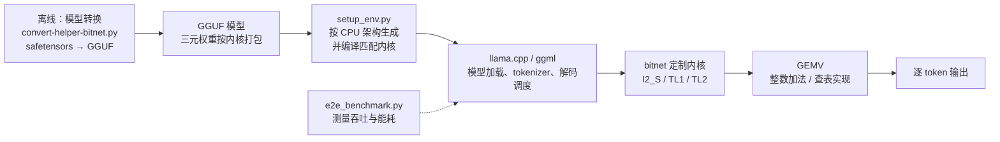

# BitNet：把 LLM 权重压进三个值，让推理在 CPU 上无损跑起来

大模型的推理成本大头在矩阵乘法：每个权重是浮点数，每次相乘都是一次浮点运算。bitnet.cpp 换了一条路——训练时就把权重钉死在 {-1, 0, +1} 三个值上，乘一个权重要么原样保留、要么取反、要么跳过，整个矩阵乘法退化成整数加法，浮点乘法从推理里消失。省下的不只是算力，还有搬权重所需的内存带宽——这块带宽才是 CPU 推理的瓶颈。

它是微软官方的 1-bit LLM 推理框架（仓库 [microsoft/BitNet](https://github.com/microsoft/BitNet)，40,234 Stars、MIT 协议，2026-09-13 验证，主分支最后提交 2026-07）。官方模型 BitNet-b1.58-2B-4T 用 2.4B 参数在 4 万亿 token 上训练，是第一个官方 BitNet b1.58 模型（模型技术报告 [arXiv:2504.12285](https://arxiv.org/abs/2504.12285)）。CPU 推理框架本身的数字出自系统论文 [arXiv:2410.16144](https://arxiv.org/abs/2410.16144)：x86 CPU 提速 2.37–6.17 倍、能耗降 71.9%–82.2%；ARM CPU 提速 1.37–5.07 倍、能耗降 55.4%–70.0%，对照组是 llama.cpp 的 FP16 推理。测能耗的机器，ARM 侧是 Mac Studio（Apple M2 Ultra，64GB 内存），x86 侧是 Surface Laptop Studio 2（Intel Core i7-13700H，14 核 20 线程）。论文还有个标志性结论：100B 参数的 BitNet b1.58 在单颗 CPU 上能跑到 5–7 tokens/s，接近人类阅读速度。怎么读这些区间，后面会单独讲。

这套框架 2026 年还在加东西：1 月并入并行内核实现，官方口径在原基础上再提速 1.15–2.1 倍；7 月连发两个 1-bit 嵌入模型，又用同一套 I2_S 量化做了实时语音识别引擎 [VibeASR.cpp](https://github.com/microsoft/VibeASR.cpp)。

本文按"1.58 bit 是什么 → 一条推理请求怎么穿过系统 → 三套内核 → 性能数字怎么看 → 支持矩阵 → 部署 → 选型建议"展开。

## 1.58 bit 到底指什么

"1.58 bit"常被误读成"每个权重占 1.58 bit 存储"。实际它来自信息论：一个权重取三个值 {-1, 0, +1}，三选一的信息量是 log₂(3) ≈ 1.58 bit。这是理论上限，不是存储格式。bitnet.cpp 落地时，I2_S 内核把每个权重用 2 bit 打包（每字节塞 4 个权重），1.58 只是表示"这套量化逼近了三态编码的信息极限"。

权重怎么变成三元值：BitNet b1.58 在训练时就用 absmean 量化，把每个权重除以全层权重绝对值的均值，再四舍五入截断到 [-1, 1] 区间，得到 {-1, 0, +1}。激活值动态量化为 8-bit 整数。这跟常见的"训练完再压缩"（PTQ）不同，是从头训练就量化（QAT），模型自己学会了在三值约束下工作，所以低比特下的精度损失远小于事后量化。

值域很小，但信息没白丢。加入 0 值让模型能显式"关掉"某些连接，相当于做特征筛选，这是它比纯二值 {-1, +1} 建模能力更强的原因。加上整数加法替代浮点乘法，能耗从算法层面就被压下来——芯片上整数加法器的面积和功耗都远小于浮点乘法器。

## 系统地图：一条推理请求穿过什么

bitnet.cpp 不是独立的推理引擎，而是搭在 llama.cpp 上的定制层。两条主线要分开看：**模型怎么被量化打包**（离线），**内核怎么解包计算**（在线）。



离线那条线决定权重在磁盘和内存里长什么样；在线那条线决定怎么算。两者由内核类型（I2_S / TL1 / TL2）绑定：模型按哪种内核打包，推理就必须用同一种内核解包。

## 一条命令怎么流过系统

用一个具体任务串起来：在 Mac 上把官方 2B 模型跑起来。

1. 下载预量化模型。`huggingface-cli download microsoft/BitNet-b1.58-2B-4T-gguf --local-dir models/BitNet-b1.58-2B-4T`，拿到按 I2_S 打包的 GGUF 文件。
2. 生成并编译匹配的内核。`python setup_env.py -md models/BitNet-b1.58-2B-4T -q i2_s` 检测本机 CPU 架构，生成对应指令集的内核代码，连同 llama.cpp 一起编译。这一步决定了后面走 NEON（ARM）还是 AVX2（x86）。
3. 加载模型。`python run_inference.py -m models/BitNet-b1.58-2B-4T/ggml-model-i2_s.gguf -p "You are a helpful assistant" -cnv` 启动对话，底层是 llama.cpp 的 `llama-cli`。
4. 逐 token 生成。每次前向计算，权重是 2 bit 解包出的三元值，激活是 8-bit 整数，矩阵乘在特化内核里以整数加法完成，没有浮点乘。

从敲命令到出 token，用户只感知到第 1、3 两步；第 2 步的架构检测和第 4 步的内核执行是 bitnet.cpp 替你做的。

## 三套内核：I2_S、TL1、TL2

| 内核 | 目标平台 | 权重打包 | 计算方式 | 适用场景 |
|------|---------|---------|---------|---------|
| I2_S | x86 / ARM | 每权重 2 bit，每字节 4 个 | 解包回原值后做常规 GEMV | 通用；线程充足时编译器能流水化指令，收益最大 |
| TL1 | ARM（NEON / DOTPROD） | 每 2 个权重合成一个 4 bit 索引 | 查表（LUT） | ARM 上的内存/带宽受限场景 |
| TL2 | x86（AVX2） | 每 3 个权重合成一个 5 bit 索引 | 查表（LUT），压缩率更高 | x86 上的内存/带宽受限场景 |

I2_S 是三套里最直观的：权重离线压成 2 bit，计算时解包回 {-1, 0, +1} 再做矩阵乘。它不做任何奇技淫巧，胜在可移植——x86 和 ARM 都能跑，也是 `setup_env.py` 在两种架构上的默认选项。

TL1 和 TL2 是同一种思路的两种实现，都来自微软 T-MAC 的查表方法：把激活值的可能组合预先算好存进查找表，权重打包成索引，计算时拿索引查表、把结果加起来，省去逐权重解包。索引宽度由组合数决定——两个三元权重有 3² = 9 种组合，4 bit（16 个值）装得下，这是 TL1，查表累加用 int16；三个权重 3³ = 27 种组合，TL2 用 1 bit 符号加 4 bit 索引共 5 bit 装下。粒度更粗，压缩率更高，论文口径下 TL2 的模型体积比 TL1 再小约 1/6；代价是指令集绑定，只适用于 AVX2。官方支持矩阵里，2B 模型 x86 走 I2_S + TL2、ARM 走 I2_S + TL1，正是按这个分工配置的。

## 性能数字怎么看

报告里的提速和降耗数据，测的是**同一硬件上 bitnet.cpp 相对 llama.cpp FP16 基线**的 CPU 推理吞吐和能耗，覆盖 125M 到 100B 共 12 个尺寸。有一点论文自己写明了：这些测试模型是研究用的 dummy 模型，不是真实开源权重；能耗另在 700M、7B、70B 三档上测了每 token 焦耳数。它反映的是"权重压到 2 bit 后，内存带宽瓶颈被大幅缓解"这件事——模型越大、权重占比越高，收益越明显，这也是 100B 模型能挤出 5–7 tokens/s 的原因。

"无损"也有具体所指：在 1000 条 WildChat 提示上逐 token 对比 FP32 基线输出，bitnet.cpp 三套内核 100% 完全一致；llama.cpp 自带的三值量化 TQ1_0/TQ2_0 只有 1.4% 的样本能逐 token 对上。标题里"无损跑起来"的底气来自这组对照，而不是一句笼统的"精度不掉"。

这些数字不能外推到几类结论：

- 不是"任何模型压缩成三值都更快"。推理速度取决于权重是否能以整数加法完成计算，常规 FP16/INT4 模型走 llama.cpp 主分支，不适用这套内核。
- 不代表 GPU 结论。报告测的是 CPU；GPU 有官方内核（`gpu/` 目录），但加速比和能耗是另一组数据。
- 实际值随硬件型号、线程数、模型规模浮动。报告给的是区间，不是保证值，落地前用 `e2e_benchmark.py` 在自己机器上量一遍。

跑基准：

```bash
python utils/e2e_benchmark.py -m /path/to/model -n 200 -p 256 -t 4
```

`-n` 是生成 token 数（默认 128），`-p` 是 prompt token 数（默认 512），`-t` 是线程数（默认 2）。

2026 年 1 月的 CPU 优化更新在这条基线上又加了一层：权重与激活并行的 W2A8 内核、I2_S GEMM/GEMV 原生并入 ggml、tiling 块大小可以通过 `include/gemm-config.h` 按机型微调，官方口径在原实现上再提速 1.15–2.1 倍。嵌入层也支持量化（`setup_env.py --quant-embd`），内存占用再降一截。

## 官方模型与支持矩阵

官方发布三款模型，均为从头训练的原生 1-bit 模型：

| 模型 | 参数量 | 发布 | 说明 |
|------|--------|------|------|
| BitNet-b1.58-2B-4T | 2.4B | 2025-04 | 首个官方 BitNet b1.58 模型，4 万亿 token 训练，对话与推理通用 |
| BitNet-embedding-0.6B | 0.6B | 2026-07 | 1-bit 嵌入模型，x86 prefill 相对 F16 提速 1.42–2.28 倍（8 线程） |
| BitNet-embedding-270M | 270M | 2026-07 | 轻量嵌入模型，x86 prefill 提速 1.32–1.74 倍，面向资源受限环境 |

内核支持矩阵（来自官方 README）：

| 模型 | 参数量 | x86 | ARM |
|------|--------|-----|-----|
| BitNet-b1.58-2B-4T | 2.4B | I2_S、TL2 | I2_S、TL1 |
| BitNet-embedding-0.6B | 0.6B | I2_S | — |
| BitNet-embedding-270M | 270M | I2_S | — |

社区模型（官方用于演示推理能力，非微软训练）：

| 模型 | 参数量 | x86 | ARM |
|------|--------|-----|-----|
| bitnet_b1_58-large | 0.7B | I2_S、TL2 | I2_S、TL1 |
| bitnet_b1_58-3B | 3.3B | TL2 | TL1 |
| Llama3-8B-1.58-100B-tokens | 8B | I2_S、TL2 | I2_S、TL1 |
| Falcon3 Family | 1B–10B | I2_S、TL2 | I2_S、TL1 |
| Falcon-E Family | 1B–3B | I2_S、TL2 | I2_S、TL1 |

注意嵌入模型目前只有 x86 的 I2_S 内核，ARM 侧整行是空的——别拿它在 Apple Silicon 上跑。`setup_env.py -q` 可选的量化类型按架构区分：ARM 上是 `i2_s`、`tl1`，x86 上是 `i2_s`、`tl2`，默认 `i2_s`。ARM 上加 `--use-pretuned` 可以启用预调优内核参数，但预设只覆盖 bitnet_b1_58-large、bitnet_b1_58-3B、Llama3-8B 三个社区模型，其他模型在构建时走代码生成。

## 部署：从安装到跑通

环境要求：Python ≥ 3.10、CMake ≥ 3.22、Clang ≥ 18，conda 推荐。克隆并装依赖：

```bash
git clone --recursive https://github.com/microsoft/BitNet.git
cd BitNet

conda create -n bitnet-cpp python=3.10
conda activate bitnet-cpp
pip install -r requirements.txt
```

Windows 上必须在 VS2022 的 Developer Command Prompt / PowerShell 里执行后续命令，并确保安装以下组件：Desktop development with C++、C++ CMake Tools for Windows、Git for Windows、C++ Clang Compiler for Windows、MS-Build Support for LLVM-Toolset (clang)。Debian/Ubuntu 装 Clang 18 可用官方脚本：

```bash
bash -c "$(wget -O - https://apt.llvm.org/llvm.sh)"
```

下载官方模型并按 I2_S 打包、构建：

```bash
huggingface-cli download microsoft/BitNet-b1.58-2B-4T-gguf \
    --local-dir models/BitNet-b1.58-2B-4T
python setup_env.py -md models/BitNet-b1.58-2B-4T -q i2_s
```

推理：

```bash
python run_inference.py \
    -m models/BitNet-b1.58-2B-4T/ggml-model-i2_s.gguf \
    -p "You are a helpful assistant" \
    -cnv
```

`run_inference.py` 的 `-cnv` 打开对话模式（此时 `-p` 作为 system prompt），`-t` 指定线程数，`-n` 控制生成 token 数，`-c` 设上下文长度，`-temp` 控制采样温度。

要起 API 服务，仓库自带 `run_inference_server.py`，封装 llama.cpp 的 `llama-server` 并默认开启 continuous batching，监听 `127.0.0.1:8080`（`--host`/`--port` 可改），上下文默认 2048，`-ngl 0` 写死纯 CPU：

```bash
python run_inference_server.py -m models/BitNet-b1.58-2B-4T/ggml-model-i2_s.gguf
```

GPU 与 CPU 是两条独立路径。官方 GPU 推理内核见仓库的 `gpu/README.md`，按 `setup_env.py` 之后的镜像或容器流程走；NPU 支持官方标注为"开发中"。嵌入模型的量化与转换有专门指南（`docs/bitnet-embeddings-i2s-guide.md`）。

预打包仓库只提供 I2_S 一种布局。需要 TL1/TL2 变体时，从 bf16 权重现场转——`setup_env.py -q tl2` 在目标目录找不到对应 GGUF 时，会自动调用 `utils/convert-hf-to-gguf-bitnet.py` 生成。从 safetensors 自己转换模型：

```bash
huggingface-cli download microsoft/bitnet-b1.58-2B-4T-bf16 \
    --local-dir ./models/bitnet-b1.58-2B-4T-bf16
python ./utils/convert-helper-bitnet.py ./models/bitnet-b1.58-2B-4T-bf16
```

## 与其他低比特方案对比

| 方案 | 权重精度 | 训练方式 | 计算方式 | 定位 |
|------|---------|---------|---------|------|
| llama.cpp + FP16 | 16 bit | 全精度训练 | 浮点矩阵乘 | 通用基线 |
| 常规 PTQ（INT4/INT8） | 4–8 bit | 事后量化 | 整型矩阵乘 | 通用低比特部署 |
| bitnet.cpp（I2_S/TL1/TL2） | 三元 {-1, 0, +1} | 从头 QAT | 整数加法 / 查表 | 1-bit 模型专用，CPU 优先 |
| T-MAC | 依赖输入模型 | — | 查表 | 通用低比特 LUT 推理库 |

关键差异在训练方式：PTQ 是"先训练好再压缩"，比特数降到 4 以下精度断崖；BitNet 是"带着三值约束从头训练"，模型结构和数值分布都为三值设计。bitnet.cpp 借用了 llama.cpp 的调度骨架和 T-MAC 的查表方法，但只服务于 1-bit 模型——这正是它比通用方案激进的原因，也是它的边界：非三值模型用不上这套内核。

## 采用顺序与适用边界

**适合先用上：**

- 想在普通 CPU（笔记本、服务器、边缘设备）上本地跑模型，且能接受用 1-bit 模型替代同规模全精度模型。
- 吃内存带宽的场景，比如多路并发、嵌入检索、批量推理，1-bit 权重的带宽优势直接变现。
- 看重能耗，想在一台机器上常驻推理服务。

**可以暂缓：**

- 追求 SOTA 精度，模型质量优先于部署成本——三值量化毕竟有信息损失，2B 规模对标同参数全精度可以，但不是越大越好用。
- 有成熟 GPU 集群，瓶颈不在带宽和能耗——GPU 上这套内核的收益与 CPU 不同，先跑基准再决定。
- 模型不在支持矩阵里，且不想自己走转换链路。

**建议顺序：**

1. 先用官方 2B-4T 模型在目标机器上跑通 `run_inference.py`，用 `e2e_benchmark.py` 量一次吞吐和内存，确认收益真实存在。
2. 有嵌入需求再评估 `BitNet-embedding-0.6B`，先确认你的场景在 x86 上（ARM 无内核）。
3. 内存或带宽紧张时，试 TL 变体：x86 用 `-q tl2`、ARM 用 `-q tl1` 现场转换打包（官方只预打包了 I2_S），对比体积与速度。
4. 需要 GPU 再走 `gpu/` 官方内核流程，别拿 CPU 结论直接套。

## 常见问题

**Windows 下编译报找不到 clang？** 大概率没用 VS2022 的 Developer Command Prompt / PowerShell。这个环境的 PATH 里才有正确的编译工具链，普通终端里 conda 找不到 clang 是正常现象。

**编译 llama.cpp 报 std::chrono 相关错误？** llama.cpp 上游近期改动引入的已知问题，官方 FAQ 指向了这个[讨论帖](https://github.com/abetlen/llama-cpp-python/issues/1942)，里面有修复方案。

**内存不够，选哪个内核？** 在支持的平台上选 TL2（x86）或 TL1（ARM）。两者都是查表实现，TL2 索引更密，论文口径下模型体积比 TL1 小约 1/6，带宽压力更低。官方 2B 模型只预打包了 I2_S，TL 变体按部署一节从 bf16 现场转。

**模型不在支持矩阵里能跑吗？** 可以用 `generate-dummy-bitnet-model.py` 生成指定布局的虚拟模型先量性能，再走 `convert-helper-bitnet.py` 转换链路自己转换，但需要模型本身是三值训练的：

```bash
python utils/generate-dummy-bitnet-model.py models/bitnet_b1_58-large \
    --outfile models/dummy-bitnet-125m.tl1.gguf --outtype tl1 --model-size 125M
python utils/e2e_benchmark.py -m models/dummy-bitnet-125m.tl1.gguf -p 512 -n 128
```

**这框架只支持 CPU？** 不是。官方有独立 GPU 内核（`gpu/README.md`），NPU 支持在开发中；CPU 是当前优化最成熟、文档最全的路径。

## 参考链接

- GitHub：https://github.com/microsoft/BitNet
- 系统论文（bitnet.cpp CPU 推理）：https://arxiv.org/abs/2410.16144
- 架构论文（Bitnet.cpp: Efficient Edge Inference for Ternary LLMs）：https://arxiv.org/abs/2502.11880
- 基础论文（BitNet b1.58）：https://arxiv.org/abs/2402.17764
- 模型技术报告（BitNet b1.58 2B4T）：https://arxiv.org/abs/2504.12285
- 官方模型：https://huggingface.co/microsoft/BitNet-b1.58-2B-4T
- 在线 Demo：https://demo-bitnet-h0h8hcfqeqhrf5gf.canadacentral-01.azurewebsites.net/
