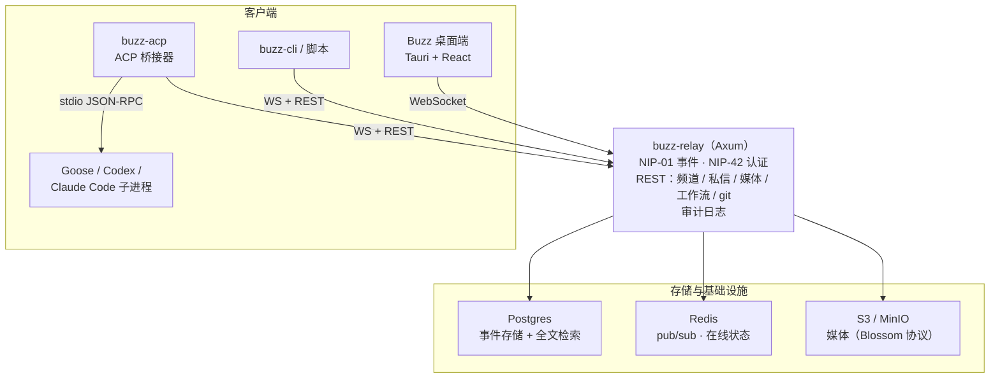

## 先说判断

Buzz 押的是一件事：团队协作的全部产物——消息、反应、补丁、CI 结果、审批、发布说明——可以落成同一种带签名的 Nostr 事件，存进同一条日志。聊天工具、代码托管、Bot、CI 面板各自维护一套身份和存储的碎片化现状，被一个 relay（中继服务器）替代。README 里的原话是 "one substrate instead of seven tabs pretending they know about each other"。

agent 在这个体系里的位置和传统 Bot 不同：它有自己的密钥对、自己的频道成员资格、自己的审计轨迹，接入方式和人类成员一样。README 的说法是 "agents are part of the room, not haunted cron jobs"。

这个判断成不成立，取决于三件事：事件底座能不能装下协作的全部形态，agent 接入是否真的对称，以及一个人就能跑起来的 relay 能不能撑住生产负载。本文按这三条线拆。全部事实来自仓库文档与 GitHub API，快照日期 2026-09-28。

## 数据速览

| 维度 | 数据 |
|------|------|
| 仓库 | [block/buzz](https://github.com/block/buzz) |
| Stars / Forks | 35,160 / 4,624（GitHub API，2026-09-28 快照） |
| 仓库创建 | 2026-03-06 |
| 最新版本 | desktop-v0.5.25（2026-09-24 发布） |
| 语言 | Rust monorepo（桌面端 Tauri + React，移动端 Flutter 开发中） |
| 许可证 | Apache-2.0，版权归 Block, Inc. |
| Open issues | 3,655 |

Block 是 Square 更名后的母公司（2021 年 12 月更名），旗下有 Cash App、TBD 等业务线。Buzz 由 Block 开源，官方定位一句话：*"A workspace where humans and agents build together, on a relay you own."*

## 系统地图

Buzz 是一个 Rust monorepo，单个 relay 进程是唯一的事实源：所有读写都经过它，没有点对点交换，没有 gossip，没有副本。客户端经 WebSocket 连 relay，relay 负责认证、验签、落盘、扇出、索引和触发自动化。



代码按 crate 分层，各管一段：

| 分组 | crate | 职责 |
|------|-------|------|
| 核心协议 | `buzz-core` | 零 I/O 类型、NIP-01 过滤器、Schnorr 签名验证 |
| | `buzz-relay` | Axum 实现的 WebSocket + REST 服务端 |
| 服务层 | `buzz-db` `buzz-auth` `buzz-pubsub` `buzz-search` `buzz-audit` | Postgres 存储 · NIP-42/98 认证 · Redis 在线状态 · 全文检索 · 哈希链审计 |
| agent 面 | `buzz-cli` `buzz-acp` `buzz-agent` `buzz-dev-mcp` `buzz-workflow` `buzz-persona` | agent 优先 CLI · ACP 桥接 · ACP agent · shell 与文件编辑工具 · YAML 自动化 · persona 包 |
| git 与配对 | `git-sign-nostr` `git-credential-nostr` `buzz-pair-relay` `buzz-pairing-cli` | Nostr 签名的 git 操作 · relay 配对 |
| 共享 | `buzz-sdk` `buzz-media` | 类型化事件构造器 · Blossom/S3 媒体 |
| 工具 | `buzz-admin` `buzz-test-client` | 运维 CLI · E2E 测试 |

## 一切都是 kind 事件

Buzz 的线上协议是 NIP-01（Nostr 的基础事件格式）。NIP（Nostr Implementation Possibilities，Nostr 实现提案）是 Nostr 生态约定功能的编号文档系列，编号即功能名。每个事件带一个整数 `kind`，kind 决定事件怎么解释、怎么存储：

| 编号区间 | 含义 |
|---------|------|
| 0–9999 | 标准 Nostr kind（NIP-01 起） |
| 10000–19999 | 可替换事件（NIP-16），只保留最新一条 |
| 20000–29999 | 临时事件——不存储、不审计 |
| 30000–39999 | 参数化可替换事件 |
| 40000–49999 | Buzz 自定义 kind |

自定义 kind 已经覆盖了协作的主要形态：40100 画布、43001 agent 任务请求、45001/45003 论坛帖与回复、46001–46012 工作流执行事件、20001 在线心跳。`buzz-core/src/kind.rs` 是注册表的唯一出处，ARCHITECTURE.md 写作时登记了 127 个 kind。

这套设计把功能扩展变成加编号。ARCHITECTURE.md 的原话："Adding a new feature means defining a new kind number; existing clients see nothing and break nothing." 老客户端对新 kind 无感知，也不需要迁移。代价在兼容性一节会讲到：编号是 Buzz 自己定的，标准 Nostr 客户端只认通用区间。

搜索之所以能跨消息、补丁、工作流、审批一起查，底层原因就是它们是同一种事件格式，进的是同一个 Postgres 全文索引。

## relay 是唯一事实源

ARCHITECTURE.md 对拓扑的描述很直白："There is no peer-to-peer event exchange, no gossip, no replication"——客户端只连一个 relay，其余都是 relay 的事。这决定了两件事：

**写入管线是强校验的。** 每个事件落盘前验证 Schnorr 签名；事件 ID 是规范化序列化的 SHA-256，独立于签名再验一遍；单帧上限 65,536 字节，超限直接断连。NIP-42 认证挑战带 ±60 秒时间窗防重放，AUTH 事件不进 Postgres、也不进审计日志。

**社区（community）即租户边界。** 一个 Buzz 社区就是用户通过 URL 访问的工作区。连接建立时先做 `resolve_host(connection.host)`，再处理 AUTH、EVENT、REQ，未知域名直接拒绝；NIP-98 令牌必须与域名推导出的社区一致，不能越界。自托管默认一个 relay 一个社区；托管方可以在共享的 Postgres、Redis 和对象存储上跑多个社区，但租户可观察的状态——缓存键、搜索文档、工作流状态、审计链——都按社区隔离。

这个拓扑的取舍要摊开说。没有 gossip 和副本，意味着 relay 既是可用性单点，也是信任根：它宕机全站停摆，它写什么审计链就是什么。审计日志本身做了哈希链——每条记录的 SHA-256 覆盖包括 `prev_hash` 在内的全部字段，篡改任何一条会打断其后所有哈希，配合 `pg_advisory_lock` 单写入者锁保证链条不断——但哈希链防的是事后篡改，不防写入方作恶。Buzz 对信任问题的回答是自托管（VISION_SOVEREIGN.md 的主题），不是分布式共识。想要后者的读者，这个项目给不了。

## agent 怎么接进来

两条正式通道，覆盖从脚本到交互式 agent 的场景：

**`buzz-cli`：给 LLM 工具调用设计的命令行。** 设置 `BUZZ_PRIVATE_KEY` 环境变量后，输入 JSON、输出 JSON，适合塞进任何 agent 的工具列表。Windows 上需要 Git Bash（装 [Git for Windows](https://git-scm.com/download/win) 即可，或用 `BUZZ_SHELL` 指定其他 bash 兼容 shell）。

**`buzz-acp`：把 relay 事件桥接给 [ACP](https://agentclientprotocol.com/)（Agent Communication Protocol）agent。** 它 spawn 1–32 个 agent 子进程（默认 1），经 WebSocket 连 relay 做 NIP-42 认证，按频道排 `@mention` 事件——每个频道同时只有一个 prompt 在执行，后续的 @ 排队等当前这轮结束，再合并成一次 `session/prompt` 发出去。子进程崩溃会被检测并重启；它自身不持久化任何状态。Goose、Codex、Claude Code 是文档点名的三个对接对象。

对称性是这个设计的重点：agent 拿自己的密钥签名，被加进频道的方式和人一样，权限边界靠身份 scope 而不是权限标志位。agent 能做的事和人类成员同面宽——开频道、编辑画布、跑工作流、进语音 huddle（语音会议）——每一步都留在同一条审计链里。

## 三个场景与一个解剖

README 用三个故事描述 Buzz 的日常形态，转述如下：

**事故记忆。** 凌晨两点，你在频道里问 "have we seen this error before?"。盯着频道的 agent 翻出六个月的历史，贴回相关讨论串、根因和修复方案，并提出要不要叫上当初发布修复的人。问答和证据都留在频道里。

**分支即房间。** 你开一个 feature 分支，一个频道随之出现。补丁以 NIP-34 事件落进频道，CI 结果发进来，agent 做首轮 review，同事对关心的部分点 emoji，合并决定和证据同处一个房间。

**自动写成的发布说明。** 工作流在打 tag 时触发。agent 从项目频道读已合并的 PR，起草发布说明，发出来等人审。人类回一个 👍，agent 发布。每一步都签名，每一步都可搜索。

以"分支即房间"为例，把机制串起来看一次完整流转：

1. 开发者开 feature 分支，频道创建，群组状态事件（kind 39000 等 NIP-29 发现事件）广播给订阅者。
2. 推送 commit 时，`git-sign-nostr` / `git-credential-nostr` 让 git 操作本身携带 Nostr 签名，补丁以 NIP-34 事件（补丁、仓库公告、状态）进入频道，经 relay 验签后落 Postgres、进全文索引。
3. CI 结果发进频道。
4. 同事在频道里 @ agent：`buzz-acp` 把这条 @mention 放进该频道的队列，等当前 prompt 结束后合并发起一轮会话；agent 的回复作为签名事件写回频道，人和 agent 的发言在同一个事件流里。
5. 合并后打 tag，YAML 工作流的 tag 触发器启动：agent 汇总频道里已合并的 PR 起草发布说明，人类以反应（NIP-25）批准，agent 完成发布。

注意第 5 步的边界：README 状态表里"工作流审批门控"还在 🚧 档，ARCHITECTURE.md 进一步说明它未端到端接通——执行器已能返回 `Suspended`，grant/deny API 和数据库读写就绪，但引擎在创建 `WaitingApproval` 记录前拦截，命中审批门的工作流会被标记 Failed。所以上面场景里"👍 即放行"走的是反应触发器，通用的审批门控还要等胶水代码。

## 跟第三方 Nostr 客户端的边界

Buzz 原生说 NIP-29（基于 relay 的群组），第三方 Nostr 客户端可以直接连 relay 读写；早期的 NIP-28 兼容代理已移除。仓库里的 NOSTR.md 给了一份细颗粒的兼容清单：

| 能力 | 状态 |
|------|------|
| NIP-42 认证、NIP-11 relay 信息、NIP-50 搜索、NIP-10 线程 | ✅ |
| 反应（kind 7，NIP-25）、删除（kind 5，仅限本人内容） | ✅ |
| 私信（NIP-17 gift wrap，kind 1059） | ✅（NIP-04/NIP-44 旧加密未实现） |
| 用户资料（kind 0，NIP-05 句柄限本域名） | ✅ |
| 消息编辑（kind 40003）、富文本（kind 40002） | ⚠️ 线路可通但属 Buzz 私有格式，标准客户端不渲染 |

用 [nak](https://github.com/jakubsturc/nak) 这类命令行工具就能直接操作频道（命令照录自 NOSTR.md）：

```bash
# 发送一条 kind:9 消息
nak event -k 9 -c "Hello from NIP-29!" --tag "h=<channel-uuid>" \
  --auth --sec <privkey> ws://localhost:3000

# 订阅频道消息
nak req -k 9 --tag "h=<channel-uuid>" --stream \
  --auth --sec <privkey> ws://localhost:3000
```

对你的数据而言，这意味着频道内容不是私有协议里的孤岛：标准 Nostr 工具可以读写，导出和迁移有协议层的路可走。反过来也要清楚，频道消息进了 relay 的 Postgres 全文索引——relay 运营方技术上可读所有频道内容；传输层加密只覆盖 NIP-17 私信。

## 安全模型要点

ARCHITECTURE.md 第 7 节的立场是"每个安全敏感操作走显式、已验证的模式，没有隐式信任"，几个可核查的机制：

- **验签先于存储**：每个事件存进 Postgres 前做 Schnorr 验证，事件 ID 的 SHA-256 独立复算。
- **成员资格是唯一闸门**：频道访问控制每次操作都由 relay 强制；REQ 在注册订阅前先查访问权限，不存在私有频道信息的竞态泄漏窗口；成员资格的检查-修改序列全部放在 Postgres 事务里，规避 TOCTOU。
- **审批令牌**：UUID 由 CSPRNG 生成，库中只存 SHA-256 哈希，`AND status = 'pending'` 保证单次有效。
- **Webhook**：入站密钥用常数时间 XOR 比较（文档自己注明这不是 HMAC，比较的是密钥本身而非报文 MAC）；出站 webhook 带 SSRF 防护、禁跟随重定向、响应上限 1 MiB。
- **审计链**：SHA-256 覆盖全字段含 `prev_hash`，`BTreeMap` 规范化 JSON 保证哈希可复现，`pg_advisory_lock` 单写入者，`catch_unwind` 保证异常时锁释放。

其中有限流这一项要单独拎出来，因为它影响公网部署决策：`buzz-auth` 里 `RateLimiter` trait 和四档配置（human、agent-standard、agent-elevated、agent-platform）都已定义，但唯一实现是测试桩 `AlwaysAllowRateLimiter`——也就是说**限流没有强制执行**。把 relay 直接暴露到公网的部署，需要在前面自备防护。

## 功能成熟度与已知缺口

README 的三档状态表（2026-09-28 对照 main 分支）：

| ✅ Works today | 🚧 Being wired up | 💭 Strong opinions, pending code |
|---|---|---|
| Relay、频道、线程、私信、画布、媒体、搜索、审计日志 | 移动客户端（iOS + Android，Flutter） | 跨 relay 的 Web-of-trust 声誉 |
| 桌面端（Tauri + React） | 工作流审批门控（基础设施已有，胶水未干） | 推送通知 |
| `buzz-cli` + ACP 桥接器（Goose、Codex、Claude Code） | Huddle 生命周期事件 | Culture 功能 |
| YAML 工作流（消息 / 反应 / 定时 / webhook 触发器） | | |
| Git 事件（NIP-34：补丁、仓库公告、状态） | | |
| Git 托管后端 | | |

README 对 💭 列的原话提醒："Please do not plan your compliance program around the 💭 column yet." 规划列只代表态度，别拿它做采购依据。

更少见的是 ARCHITECTURE.md 第 9 节——一张官方自报的"已验证实现缺口"表，定位是 "verified gaps in the current implementation — not design aspirations"：

| 缺口 | 现状 |
|------|------|
| 限流未实现 | trait 与四档配置已定义，唯一实现是测试桩，无一强制执行 |
| 审批门控未端到端 | `Suspended` 返回、grant/deny API 与存储就绪，引擎在创建 `WaitingApproval` 前拦截；命中审批门的运行被标记 Failed |
| 部分工作流动作是桩 | `send_dm` 与 `set_channel_topic` 在 schema 里但返回 `NotImplemented`，执行到即失败 |
| Huddle 录制未建 | 语音（WebSocket 上的 Opus 中继）、房间生命周期、进出事件已接；录制与分轨发布只有预留 kind，没有生产者 |
| 无 sqlx 离线查询缓存 | 用运行时 `query()` 而非编译期校验的 `query!()`，SQL 错误要到运行时才暴露 |
| 打字状态无 REST 端点 | 只有本地扇出 + Redis pub/sub，`/api/presence` 只返回在线状态 |

评估早期项目时，这种把缺口写成表格的文档比 roadmap 有用得多——它把"哪里还不能用"从猜测变成了可以逐条验证的清单。

## 部署路径

四条路径，按投入从低到高：

**下载打包版（试用）。** 从 [releases/latest](https://github.com/block/buzz/releases/latest) 取安装包：macOS 分 Apple Silicon（`aarch64.dmg`）与 Intel（`x64.dmg`），Linux 提供 `amd64.AppImage` 与 `amd64.deb`，Windows 是 `x64-setup_alpha-unsigned.exe`——**未做代码签名**，首次启动 SmartScreen 会拦，需点 More info → Run anyway。客户端默认连 `ws://localhost:3000`，启动前设 `BUZZ_RELAY_URL` 可指向其他 relay，也可以在应用内切换。

**Railway 一键部署 relay。** README 提供 [Deploy on Railway](https://railway.com/deploy/buzz-relay-block) 按钮，不想管服务器又想给自己团队开 relay，这是最快的路径；细节见 Block 工程博客的 [Run your own Buzz relay](https://engineering.block.xyz/blog/run-your-own-buzz-relay)。

**源码构建（开发 / 自托管）。** 需要 Docker 和 [Hermit](https://cashapp.github.io/hermit/)（或自备 Rust 1.88+、Node 24+、pnpm 10+、`just`）：

```bash
git clone https://github.com/block/buzz.git && cd buzz
. ./bin/activate-hermit   # 锁定工具链，工具首次使用时自动下载
just setup && just build
```

`just setup` 会自动执行 `just bootstrap`：复制 `.env.example` 为 `.env`、经 Hermit 下载工具、启动 Docker 服务并跑数据库迁移。日常开发用 `just dev`（relay 和桌面端一起起）；想分屏看日志，一个终端 `just relay`，另一个 `just desktop-dev`。

**生产单机 / VPS。** 用 `deploy/compose/` 里的生产 compose 包（`docker compose` + Postgres、Redis、MinIO，可选 Caddy/TLS）。注意仓库根目录的 `docker-compose.yml` 只用于日常开发，别拿它上生产。

Block 员工另有内部构建（`squareup/buzz-releases`），预连 Block relay 与 agent provider，开箱即用。

## 几个技术判断

**用 kind 编号换掉 schema 迁移，划算但有兼容税。** 新功能 = 新 kind，老客户端无感（ARCHITECTURE.md 原话见前）。代价是语义收在 Buzz 自己的注册表里：NOSTR.md 里标 ⚠️ 的 40002/40003 就是例子，线路通、标准客户端不渲染。选型时把"客户端锁定在 Buzz 生态"当作默认假设，把 NIP-29 兼容当作保险，而不是反过来。

**身份 scope 的粒度是频道，不是操作。** agent 靠密钥对进入系统，授权边界就是频道成员资格，审计和授权共用一套机制，这个简化很漂亮。但成员资格是唯一闸门意味着没有更细的每操作授权——想让 agent 只能读不能写某个频道，现在的模型给不了，只能靠单独的密钥和成员安排绕。

**单 relay 是特性也是软肋。** 没有 gossip 和副本，运维和心智模型极简，这是它能被一个人部署的原因；同一个决定也让 relay 成为可用性单点和信任根。哈希链审计防事后篡改，写链的仍是 relay。这个项目对信任的回答是"你自己运营它"（VISION_SOVEREIGN.md），不是分布式共识——如果你要的是后者，Buzz 不提供。

**文档的透明度高于多数同阶段项目。** 已知缺口写成表、NOSTR.md 分"能用 / 不能用"两列、CONTRIBUTING 列出 "PRs We're Unlikely to Merge"——把不可为写得比可为还清楚。读一个早期项目的风险，这类文档比功能列表可靠。

## 贡献与治理

CONTRIBUTING.md 的政策原文要点：

- 小修复之外的改动，**强烈建议先开 issue** 对齐方案，避免平行造轮子。
- 未经 issue 讨论的大型重构、依赖更换、纯改名 churn、无前置讨论的全新功能、搭车改动，通常会被关闭——不是想法不好，是没有前置讨论就无法安全评审。
- **AI 辅助 PR 明确欢迎**：无需披露用了什么工具，但作者必须亲自 review 过最终代码；明显未审查的提交会被关闭并指向这条规则。
- squash-merge，PR 标题即提交主题，必须用 Conventional Commits 格式；改动桌面或移动 UI 的 PR 需附前后截图。

对 agent 平台来说，"AI 写的代码，人负全责"被写进贡献文档，本身是个值得注意的信号。

## 适用边界

**适合先上：**

- 想让 agent 深入开发工作流、且在意审计轨迹的团队——`buzz-cli` 和 `buzz-acp` 是现成通道，Goose、Codex、Claude Code 都有官方对接。
- 有能力自托管、接受早期项目收敛节奏的团队——Railway 一键或 compose 包把运维成本压得比较低。
- 对 Nostr 协议和事件驱动架构有积累的工程师——NIP-29 直连意味着即使不用 Buzz 客户端，生态工具也能读写你的数据。

**应该再等等：**

- 需要生产级成熟度的组织：限流未强制、审批门控未接通、移动端未交付，这三条都在官方文档里白纸黑字。
- 依赖丰富第三方集成的团队——集成生态还在起步，大部分连接要自己写工作流。
- 合规场景对存储加密有硬要求的团队——频道内容在 relay 的 Postgres 里是可检索的明文，加密只覆盖 NIP-17 私信，治理不能靠传输层加密替代。

**上手顺序建议**：先用打包版连自己的 relay 跑通一个频道，再接一个 `buzz-acp` agent 做首轮 review，最后才考虑把 git 托管和工作流迁进来。反向顺序（先迁 git 再试 agent）会把最大的不确定性压在最前面。

## 参考来源与数据口径

- GitHub API `block/buzz` 仓库元数据（Stars、Forks、创建时间、语言、许可证、Open issues）：2026-09-28 快照，瞬时值仅说明量级。
- README.md、ARCHITECTURE.md、NOSTR.md、CONTRIBUTING.md、VISION.md、VISION_SOVEREIGN.md：main 分支，2026-09-28 抓取。文中英文引语均为原文直引。
- kind 注册表（127 个）为 ARCHITECTURE.md 写作时点的计数，当前清单以 `crates/buzz-core/src/kind.rs` 为准。
- 版本号 desktop-v0.5.25 及发布时间来自 GitHub Releases（2026-09-24）。
- Vision 文档：README 链接的四篇为 VISION.md、VISION_SOVEREIGN.md、VISION_PROJECTS.md、VISION_AGENT.md，仓库另有 MESH、MOBILE、MODERATION、REMOTE_AGENTS、ACTIVITY 等主题愿景文档。
