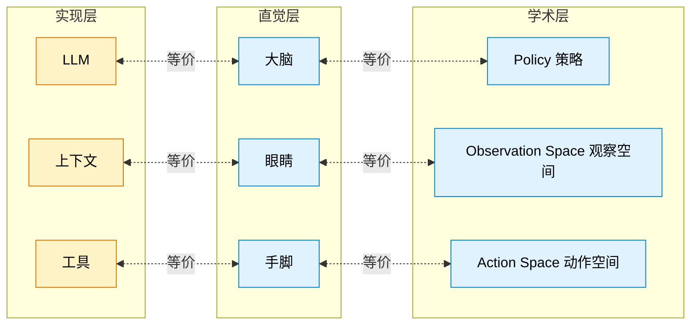
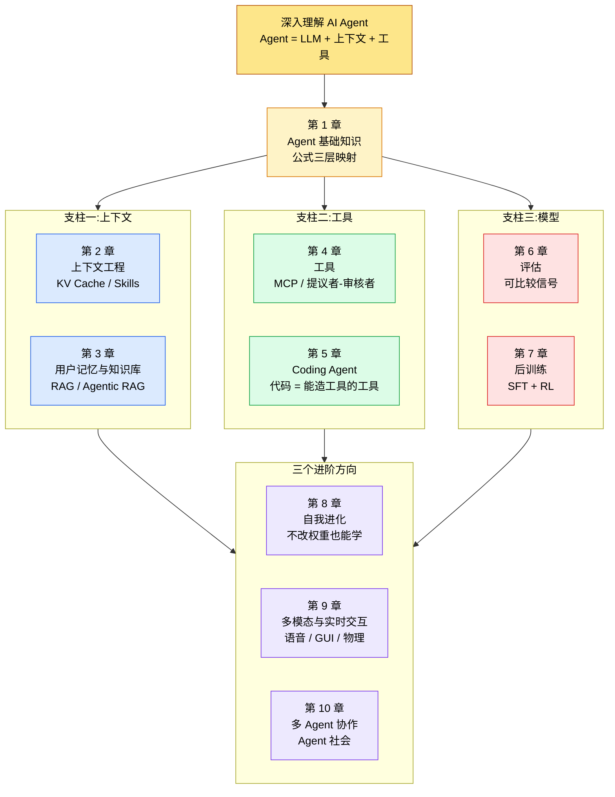

## 阅读指引

**目标读者**：在 AI Agent 工程一线工作、读过一些综述但苦于"听过名词没见过落地"的工程师。如果你想知道 Harness、Skill、Loop Engineering 这些词到底是谁先做出来的,以及一个通用 Agent 处理涉及金钱的敏感任务时,究竟要把架构做成什么样,本文适合你。

**学习目标**：

- 识别 Agent 工程里"实践在前、命名在后"的认知反向——这是李博杰这本书对业界最颠覆的一个判断
- 理解一个由 Pine AI 团队反复用工程实践倒逼出来的核心公式:`Agent = LLM + 上下文 + 工具`,以及它三层理解之间的对应关系
- 看见"whisper coding(口述式写作)"如何把语音带宽当作带宽放大器,以及这对一般 Agent 工作流的启发
- 看清后记里"两朵乌云"的真正坐标——流式实时交互与持续学习,它们决定 2026 年之后的 Agent 长什么样

**前置知识**：知道 LLM、Prompt、工具调用(tools/function calling)基本概念;用过 ChatGPT、Claude 或类似产品;最好亲手跑过一次 Claude Code、Codex、Cursor 这类 Coding Agent,因为书里的很多原则会先在这类工具里显现出来。

**范围说明**：本文不替代原书十章正文,也不复述它的目录。原书 1MB+ 体量没法在一篇文章里展开。本文专注一个特定视角:Pine AI 实战倒逼出的工程原则,与一般综述如何区分开来。读者读完本文应当明白,再去翻原书时,应该着重看哪些章节、跳过哪些已知的概览段。

**配套仓库**：[https://github.com/bojieli/ai-agent-book](https://github.com/bojieli/ai-agent-book)(撰写时含 4146 个文件、10 章正文、PDF、配套实验代码)

---

## 目录

- [一、为什么这本书不能被"再写一遍综述"](#一为什么这本书不能被再写一遍综述)
- [二、第一个稀缺点：实践在前、命名在后](#二第一个稀缺点实践在前命名在后)
- [三、第二个稀缺点:whisper coding——这本书本身就是 Agent 写的](#三第二个稀缺点whisper-coding这本书本身就是-agent-写的)
- [四、核心公式的三层映射：实现层、直觉层、学术层](#四核心公式的三层映射实现层直觉层学术层)
- [五、一个被工程实践反复倒逼出来的工作流——以通话场景为例](#五一个被工程实践反复倒逼出来的工作流以通话场景为例)
- [六、全书骨架：三根支柱与三个进阶方向](#六全书骨架三根支柱与三个进阶方向)
- [七、后记的两朵乌云:2026 年 Agent 的真正未解题](#七后记的两朵乌云2026-年-agent-的真正未解题)
- [八、阅读路径建议：三类读者三种读法](#八阅读路径建议三类读者三种读法)
- [九、与一般综述的边界：本文不该怎么用](#九与一般综述的边界本文不该怎么用)
- [十、自测与展望](#十自测与展望)
- [十一、收束](#十一收束)

---

## 一、为什么这本书不能被"再写一遍综述"

把《深入理解 AI Agent》当成一本可以由综述来替代的书,是阅读这本书最常见的失败模式。

综述擅长把已有概念摊平成表格:Harness 是什么、Skill 是什么、Function Calling 是什么、ReAct 是什么、Plan-and-Execute 是什么。这类文章在 LLM 工业化早期帮了大量读者建立词汇表,但到了 2026 年,只读综述会出现两个问题:

- **概念饱和度溢出**。概念越来越多,越来越像。Anthropic 一篇博文换一个词,综述跟着一遍,工程师的脑子里堆满了名词,但说不出哪一个名词是他自己工程里真正卡过脖子的。
- **动词缺位**。综述擅长罗列名词,几乎不写"为什么是这么做的"。一个 Harness 背后的工程问题是什么?如果不用 Harness,工程师实际踩了什么坑?这些动词性的判断,综述里很少展开。

李博杰这本书的写法,刻意和综述反向走。开篇引言里他没有先介绍 Agent 的历史,而是先讲他怎么用 Pine 的语音 Agent 跟自己"口述式协作",再讲这本书具体从哪几个工程痛点倒逼出书里的原则。每一个名词,都先给一段真实场景,再回到术语本身。

这不是文风偏好。这是认知顺序的不同:**先给真实工程判断,再给术语,是把读者从被名词牵着走,反过来用工程问题去检验名词**。

读这本书必须按这个认知顺序读。如果还是先翻目录找"我想看 Harness 那一段",你会错过全书最有价值的部分——作者从 Pine 团队的真实失败和真实修复里,一步步推导出原则的过程。

下面两个稀缺点,就是这本书最不能被综述替代的部分。

---

## 二、第一个稀缺点：实践在前、命名在后

这是全书第一次让读者停下思考的判断。原文很短,但分量不轻:

> 并不是 Anthropic 这些公司先发明了这些概念、众多 Agent 才跟着用起来;相反,是大量 Agent 早就在这么做了,Anthropic 才把它们提炼、总结成了架构设计原则。实践在前,命名在后。

这个判断的反面是当下非常流行的一类叙事:Anthropic 在某篇博文里提出 Harness,几个月后所有"严肃的 Agent 工程"都围绕 Harness 写文档;Anthropic 提出 Skills,所有产品都开始做 Skills 市场;Anthropic 提出 Loop Engineering(提议者-审核者循环),所有综述都开始科普"什么是 Loop Engineering"。

按这条时间线,业界知识是从命名开始,然后被工程实践跟上的。如果这是真的,一家没读 Anthropic 最新博文的工程团队,会被同行拉开一代以上的技术差距。

李博杰作为 Pine AI 的首席科学家,基于自家团队做了几年的工程实战,给出的判断正好相反:

> 早在 Skill 概念流行之前,我们就已经采用动态加载提示词的方法解决提示词无限膨胀的问题,采用命令行执行工具的方式解决工具列表无限膨胀的问题,采用系统状态栏技术解决 Agent 不感知执行环境和用户时间、工作状态等问题。

Skill、命令行执行工具、系统状态栏——这些做法早就存在于他们的 Agent 内部,只是为了 Skyscanner 式的市场传播,Anthropic 后来给类似的实践起了 Harness、Skills 这类更容易被产品市场部接受的名字。

这一段话对认真做 Agent 的工程师,实际上是一次**心理范式切换**:

- **之前**:我把 Anthropic 的命名当作行业风向标,等他们命名了再做。
- **之后**:我把工程痛点当作起点,命名只是给已经被实践过的做法一个更容易讲出去的名字。

"命名在前"会滋生两类工程师弱点:

1. **追名词疲劳**。每隔几周就要重新学习一个新名词,以至于没有连续投入任何一个工程问题。
2. **认知外包**。把名词当作"我已经懂了这个领域"的证据,不再深挖背后的工程问题。

切换到"实践在前"之后,工程师的注意力会重新聚焦到几个不会被命名轻易替代的工程问题:

- 模型上下文窗口满了怎么办
- 工具列表膨胀到几百项怎么不让模型挑错
- 危险操作(删库、扣款)怎么强制二次确认
- 模型幻觉出来的工具调用参数怎么拦下
- Agent 过早宣布任务完成怎么迫使它回看交付件

这些工程问题不会因为某天 Anthropic 给它们起了新名字而消失。先解决它们,再回过头看命名,反而会发现,每一个新名词背后,都是一个早就坑过无数团队的工程现实。

---

## 三、第二个稀缺点:whisper coding——这本书本身就是 Agent 写的

第二个稀缺点在引言里也出现过,叫 whisper coding(口述式协作)。原文描述有点反常:

> 这本书从最初的想法到最终成书,本身就是用一种可以称为 whisper coding(口述式协作)的方式做出来的——而我用来口述的,正是我们 Pine 自己的语音 Agent。每次准备讲稿,我都会先向它口述一个大致的提纲,让它去做调研(survey),再由它整理出一份初稿;讲完课后,我再结合 AI Agent 实战营里同学们的反馈,与它反复讨论、打磨,如此迭代,最终把这些讲稿扩写、编排成了今天这本书。整个过程里,我多数时候并不打字,而是把想法口述给它——语音的带宽远高于打字(正常说话的速度约为打字的四倍),"口述—调研—讨论—修改"的循环因此转得很快。

一般读者读这一段会笑一笑就翻过去。但这段话里有几个非常硬的工程信号,需要专门停下来看。

**第一,语音带宽大约是打字的四倍**。一个工程师一天的思考量,如果用打字来外化,经常会卡在"手太慢"上,大脑还没把想法固化下来,手指已经在追,而那个想法还没完全形成就被强制落了字段。用语音,这个延迟基本消失。这对任何需要持续产出的工程师,都是一个值得做实验的认知带宽放大器。

**第二,这个循环的"调研—讨论—修改"是用 Pine 自己的语音 Agent 跑的**。这意味着 whisper coding 不只是把 GPT 类通用模型当外脑,而是把一个工程团队自己的产品当外脑使用。换句话说,**作者写这本书时,是用"我能用自己团队的 Agent 完成一篇严肃长篇"的实证来检验它**。这不是销售演示,也不是 PPT,是用 200 多页的产品级写作,把 Agent 的稳定性、信息检索质量、上下文管理能力,以用户身份充分跑一遍。

**第三,口述 → 调研 → 初稿 → 讲课后反馈 → 反复讨论打磨 → 扩写编排**。这是一个六步循环,而不是"我口述一段,它就写一篇"。这个循环里有三处外部校正：调研结果、初稿反馈、学员质疑。任何一处 Agent 没做对,后面整段都会被识别出来。这意味着 whisper coding 不是"信任 Agent 自己能写一本书",而是"信任 Agent 能在我持续监督下,把一本书按时产出"——这正好对应李博杰自己在书里反复强调的"提议者-审核者"模式。

whisper coding 的工程启发其实不限于写作。任何有"反复迭代、长期持续、需要协作反馈"的业务,都可以用类似的循环:

- **客服**:客服人员口述一段经验语音,Agent 整理为知识库条目,被客户问到时检索调用,反复完善。
- **法务**:律师口述一条新出台规则的解读,Agent 去对照法规原文与判例,生成条款摘要,律师再修正措辞。
- **运维**:运维工程师口述一段异常处理的复盘,Agent 转成结构化复盘模板,沉淀进 Confluence 之类的系统。

这些场景的共性是:**人类负责判断与决策,Agent 负责带宽放大与材料整理**。whisper coding 验证了一件事:Agent 不需要"取代"专家,只需要给专家一台"更快的键盘",就能让专家的产出数量级变。

---

为了把这三个稀缺点在头脑里对齐成一张可携带的地图,先看一个全景视角,把后文要展开的所有工程动作投影到公式的三层映射上。



接下来三节会按这张图的顺序展开:第二节回到"实践在前、命名在后"的具体工程证据,第三节展开 whisper coding 的循环机制,第四节把这张图的三层映射讲透。

---

## 四、核心公式的三层映射：实现层、直觉层、学术层

Agent = LLM + 上下文 + 工具——这是全书反复回到的公式。但李博杰没有把这句话当成口号,而是给了它三层不同密度的理解,作者显然希望读者在这三层之间自如切换。

**实现层**(工程师看):

- **LLM**:大模型本身,负责把"对话历史 + 上下文 + 工具定义"映射为下一步动作。
- **上下文**:模型单次调用能看到的所有信息——历史消息、系统提示词、检索结果、工具定义、用户偏好状态,等等。
- **工具**:模型可以发起调用的外部能力——文件读写、Shell、浏览器、API,等等。

这层最贴近代码。任何一个生产级 Agent 都是这三块的物理布局,作者用这三件概念把整个生产架构的分工讲清楚了——任何抽象到这个三元组之下的设计选择都要重新拿出来检验。

**直觉层**(产品经理或新入门工程师看):

- LLM 是大脑,负责思考和决策。
- 上下文是眼睛,决定 Agent 能看到什么信息。
- 工具是手脚,决定 Agent 能做什么事情。

直觉层有一个好处:**让没有写过 Agent 代码的同事也能在大脑中勾勒出 Agent 的样子**。当你给别人解释"为什么我们的 Agent 这次搞砸了",你可以说"这次是眼睛坏了——上下文没把工具反馈带进来",或"这次是手脚不听话——工具调用的参数错了"。这种隐喻把分散的实现细节收束到三个明显的器官上。

**学术层**(对强化学习熟悉的读者看):

- LLM 对应 Policy(策略)。
- 上下文对应 Observation Space(观察空间)。
- 工具对应 Action Space(动作空间)。

学术层是给熟悉 RL 的读者开的接口。三层讲的是同一件事的不同表达密度,作者特别提醒读者不要把"Policy / Observation / Action"那一套照搬到工程里——它们的表达能力是不对等的,LLM 的 policy 比传统 RL 的 policy 灵活得多,这是 LLM-based Agent 跟 RL Agent 最深的区别。

三层之间的桥接关系:

| 维度 | 实现层 | 直觉层 | 学术层 |
| ---- | ------ | ------ | ------ |
| 角色 | LLM | 大脑 | Policy |
| 信息 | 上下文 | 眼睛 | Observation Space |
| 行动 | 工具 | 手脚 | Action Space |
| 强度 | 物理布局 | 隐喻 | 抽象 |

读这本书最常见的认知失误,是停留在"直觉层"或者只接受"实现层"。作者明显希望读者至少做到实现层 ↔ 学术层的双向映射,**因为第二至五章反复回到"上下文决定能力上限""工具决定能力边界"这两条原则,如果不用学术层去重新表述它们,你会发现原则之间没法精确比较**。

---

## 五、一个被工程实践反复倒逼出来的工作流——以通话场景为例

为了把"实践在前、命名在后"和"核心公式"结合到一起看,这里以 Pine AI 的通话场景为案例,演示一个 Pine 风格的 Agent 工作流是怎么"被逼"出来的。这是一个全链路场景,后文要展开的"上下文"和"工具"两条原则,都会回到这个例子上。

**场景**:用户说"请帮我跟运营商协商把这个月账单降低 $30"。Pine 的 Agent 需要:

1. 调出最近的账单 PDF,确认账单结构
2. 找到运营商客服电话
3. 拨打,实时听对方在说什么
4. 在听的同时,用语音接口实时回复
5. 整个通话可能要 20 分钟到 1 小时
6. 通话期间,Agent 要持续判断：对方要提供什么身份证明?有没有可能扯到促销?用户是否已经在另一台设备上临时改变主意?
7. 通话成功后,可能还要再发邮件给运营商服务邮箱确认

这个任务动辄几十轮交涉,任何一步出错都会是真金白银的损失。

按"实践在前"反推,这个工作流里会有几条不能妥协的工程要求:

**1. 上下文必须能跨轮保留很长**

任务时长可能以小时计。模型上下文窗口的"硬上限"会瞬间被这个场景戳穿。要么做 KV Cache 友好的提示词结构(让连续轮次的提示词前缀尽量稳定),要么做上下文压缩,把过期但仍要回看的信息编成摘要而不是删掉。**Pine 团队在 Skill 流行之前就已经在做这件事了**——这是李博杰在引言里反复强调的"实践在前"最具体的工程证据。

**2. 工具必须分级**

不是所有工具都让 Agent 直接调。扣款、退款、转账这类不可逆工具,必须走"提议者-审核者"循环:Agent 提议,人(或上一级 Agent)审核,审核通过才执行。这不是安全设计,这是工程必然——一旦让 Agent 直接扣款,几个回合后必然出现错扣,客户会因此永远离开这个产品。

**3. 任务必须能中断和回看**

通话可能在第 23 分钟因为一句话被打断,这时的模型要能很快回看"我在哪个阶段、已经和运营商确认过什么、还差什么没做"——这要求 Agent 自己维护一份中间状态,并在状态改变时主动更新。

**4. 工具调用必须被审查**

模型幻觉出来的工具调用参数,例如把电话号码写错一位、或者把"取消订阅"说成"取消订阅这个月并恢复下个月",必须在执行前被拦下。Pine 团队的做法,和李博杰第二章讲的"工具描述要把参数约束写到极致"高度一致。

**5. Agent 必须分清楚"完成的定义"**

模型最容易犯的错,是过早宣布"我已经处理完了"。Pine 团队的解法对应 Loop Engineering(提议者-审核者):让 Agent 写完一段交付件后,被强制以"审核者"身份回看自己的输出,找漏洞,迭代改进。

把这五条串在一起看,它就已经不是综述,是一个具体产品里被工程实践反复倒逼出来的栈:**长上下文 → 工具分级 → 任务可中断 → 工具调用审查 → 提议者-审核者循环**。这套栈早就在 Pine 内部跑着,后来被 Anthropic 等提炼为 Harness、Skills、Loop Engineering。

### 5.1 一个可执行的 Pine 风格提议者-审核者循环

下面这段伪代码描述了一个扣款场景里最朴素的提议者-审核者循环,跟李博杰第五章 Coding Agent 章节的提议者-审核者模式保持一致。它不是代码库里的真实实现,而是把"Pine 是怎么强制把不可逆操作拦在 Agent 之外"这件事压到一个 30 行的视图里。

```python
# 提议者-审核者 循环伪代码 —— 扣款场景
# 阶段 1:提议者(Proposer)生成初步动作
intent = parse_user_intent(call_transcript)             # 从通话里抽取用户意图
candidate_action = propose(intent, tool_registry)        # 提议一个候选工具调用

# 阶段 2:工具分级 —— 不可逆动作必走审核
if candidate_action.is_irreversible():                   # 是否扣款/退款/删除/取消订阅
    review_required = True
else:
    review_required = False

# 阶段 3:硬约束参数校验 (防止模型幻觉参数)
param_errors = validate_params(candidate_action.params, strict_schema=True)
if param_errors:
    candidate_action = repropose(intent, fix=param_errors)

# 阶段 4:审核者(Reviewer)对交付件做反向检查
deliverable = candidate_action.preview()                 # 渲染给用户/上级 Agent 看的人话描述
review_notes = reviewer_check(deliverable, check_list=[
    "用户是否真的要求这次扣款",
    "金额是否和通话里确认的一致",
    "是否触达不可逆危险操作的二次确认",
])
if review_notes:
    candidate_action = revise(candidate_action, address=review_notes)
else:
    return candidate_action.execute()                     # 通过审核才真执行

# 阶段 5:任务中断与回看
if user_says_wait_or_change_mind(transcript_chunk):
    return save_intermediate_state(intent, candidate_action)
```

关键不在伪代码本身,而在循环里**可逆性区分**与**审核者反向检查**两步。这两步组合起来,把"模型直接扣款"这类灾难性失败从工程上切断了。

### 5.2 KV Cache 友好的提示词前缀——长上下文章节的核心约束

李博杰第二章反复强调的 KV Cache,真正的工程动作是"提示词前缀稳定",下面是一段示意,展示什么样的系统提示词能让 Anthropic / OpenAI / Gemini 等支持 prompt caching 的服务稳定命中缓存。

```text
# 系统提示词 —— KV Cache 友好版
# 注意顺序:稳定段(高命中) → 工具定义(中等) → 短期记忆(不稳定)
[stable-meta]                              # 这一段几乎不变,应居最前
agent_role: "Pine AI 通用助理"
output_language: "中文"
tool_safety_policy: "..."

[tools-dynamic]                            # 工具定义变化中等
available_tools:
  - read_file
  - web_search
  - phone_dial_outbound
  - submit_refund_request                 # 不可逆工具

[short-term-memory]                        # 短期记忆变化最快,应居最后
conversation_summary: "..."
user_pending_decisions: [...]
last_action_status: "..."
```

把可变的短期记忆放在最后,工具定义放中间,稳定元信息放最前——这是利用 KV Cache 让长任务的成本可控的最朴素做法。Pine 团队在书中介绍的实际做法,和这个示意一致,只是更细——比如在 stable-meta 段连字符、空白、注释内容都不能改,因为 tokenizer 会把这些差异也算进 cache miss。

---

---

## 六、全书骨架：三根支柱与三个进阶方向

把书的目录当成一张地图看,可以看出它刻意安排的认知顺序。

第一根支柱——**上下文**(第二、三章):"Agent 看到什么"。

- 第二章从大模型 API 的消息结构讲起,然后深入 KV Cache 的底层原理,让读者明白**为什么稳定的提示词前缀能省成本**。接着是提示工程(流程化设计、工具描述、业务规则细化)、提示注入攻防、Agent Skills 按需加载、Agent 状态栏技术,以及上下文压缩策略。
- 第三章把上下文从单次会话延伸到跨会话,覆盖用户记忆的四种渐进式策略、RAG 完整技术栈、多模态信息提取、知识组织(结构化索引、知识图谱),以及让 Agent 自己决定何时检索的智能体化 RAG(Agentic RAG)。

第二根支柱——**工具**(第四、五章):"Agent 能做什么"。

- 第四章讲工具分类与通用设计原则,MCP 协议与工具选择的挑战,感知、执行、协作三类工具,以及事件驱动的异步 Agent。
- 第五章把 Coding Agent 单独展开,论证"代码是能创造新工具的工具"。这一章以 OpenClaw 架构为主线,展示一个生产级 Coding Agent 的完整实现。

第三根支柱——**模型**(第六、七章):"Agent 的大脑本身"。

- 第六章覆盖评估——把 Agent 表现变成可比较的信号。讲评估环境、数据集设计、LLM-as-a-Judge、评估驱动选型、生产级内部评估与仿真环境。
- 第七章覆盖后训练——预训练、SFT、RL 三阶段,何时选哪个,RLHF、算法比较、数据与环境、让模型学会工具调用、提升样本效率。

三个进阶方向:

- **第八章(自我进化)**:不改权重也能成长。三种学习范式——从经验中学习、主动工具发现、从工具使用者到工具创造者。
- **第九章(多模态与实时交互)**:把感知与行动从文本扩展到语音、GUI 与物理世界。语音三范式(级联、端到端全模态、全双工)、流式语音感知与合成、Computer Use 与机器人操作。
- **第十章(多 Agent 协作)**:多 Agent 分类框架,何时真正优于单 Agent,共享与不共享上下文的协作,失败模式,涌现的"Agent 社会"。

把"三根支柱 + 三个进阶方向"记成一个层级,再去翻原书,目录的"用力"就清楚了:

| 章 | 角色 | 一句话定位 |
| -- | ---- | --------- |
| 1 | 总纲 | 公式 `Agent = LLM + 上下文 + 工具` 的三层映射 |
| 2 | 支柱 1 | 上下文工程——决定了 Agent 看见的世界 |
| 3 | 支柱 1 延伸 | 用户记忆与知识库——把单次会话的上下文扩到跨会话 |
| 4 | 支柱 2 | 工具——决定了 Agent 能做什么 |
| 5 | 支柱 2 细化 | Coding Agent——代码是能造工具的工具 |
| 6 | 支柱 3 基础 | 评估——把表现变成可比较的信号 |
| 7 | 支柱 3 强化 | 后训练——让模型在底层就会调用工具 |
| 8 | 进阶方向 1 | 自我进化——Agent 不改权重也能学 |
| 9 | 进阶方向 2 | 多模态与实时交互——走出纯文本 |
| 10 | 进阶方向 3 | 多 Agent 协作——群体智能 |

需要特别注意的是第六章和第七章的并列关系。**没有评估就做后训练,等于闭着眼睛调琴**——这是李博杰反复强调的"评估驱动"准则。第六章是训练的前提,第七章是训练的执行。先读第六章,再去读第七章,R 数据集设计与奖励信号设计一脉相承。

### 6.1 全书骨架图:三根支柱与三个进阶方向



骨架图的关键信息:**三根支柱不能拆开看**,第一章给的总公式必须用第二至七章展开才能形成完整判断。三个进阶方向不是孤立的延伸,而是把三根支柱组合起来投向更复杂场景——所以读者在第八至十章里看到的所有机制,几乎都能回溯到第二至七章的某条原则。

---

## 七、后记的两朵乌云:2026 年 Agent 的真正未解题

后记是这本书最值得单独品读的部分。李博杰借用了开尔文 1900 年关于物理学的"两朵乌云"比喻,给出了今天 Agent 领域他看到的两朵乌云。

### 7.1 第一朵：流式实时交互

李博杰的描述是:

> 今天绝大多数 Agent 仍是按轮次(turn-by-turn)的"请求—应答"模式：你说完一句,它想一整段,再一次性吐出结果。但真实世界不会停下来等它想完——话会被打断,画面在持续变化,邮件在不断到达。

回到 Pine 的通话场景。一个 20 分钟到 1 小时的运营商通话,如果模型按"请求—应答"模式跑,会出现两类严重问题:

- **延迟感知**。对方说完一句话到模型回话,如果中间有 5 秒延迟,对方会以为是机器人,但更糟糕的是会被认为是"不太聪明的机器人"。通话体验断崖式下降。
- **打断处理**。对方说了两句,模型准备回一段长答案,用户插了一句话"等等,我先想想",这时 Agent 必须能实时停下来,接住打断,记下之前的内容,继续听。

这两类问题不是工程上的"小修小补"能解决的。李博杰给出的两条路径:

**架构上的快慢分离**:实时与智能几乎是两条正交的轴,单一模型难以兼顾,于是**让前台快模型维持对话节奏、后台慢模型负责深度思考**。这意味着一个 Agent 系统里会有多个不同响应速度的模型协作。

**把推理本身做快**:让 decode 速度足够高,按轮次的等待就短到近乎消失,turn-by-turn 与"实时"的界限也随之模糊。书里举的两个例子很有画面感——小米 MiMo 已让 1T 参数模型在单个 8 卡节点上把生成速度推过 1000 token/s,而 Taalas HC1 把 80 亿参数模型固化进芯片后响应约 17000 token/s、延迟低于 100 毫秒。

当模型每秒能吐出上千个字,**"想完再说"和"边想边说"的体验差距就被抹平了**。这条技术曲线会把硬件、推理引擎、模型结构三件事绑在一起推进,2026 年下半年会陆续看到更多进展。

### 7.2 第二朵：持续学习

> 今天的模型更像一个记性极好、却学不会新东西的天才：训练时把人类知识背得滚瓜烂熟,上岗后却几乎不再成长——每次任务结束,那些踩过的坑、试出来的窍门,大多随着上下文一起被丢掉。

围绕这朵乌云有两种针锋相对的假设:

**「小世界假设」**:一个足够大的模型(几万亿参数)本就装得下物理世界里几乎所有重要的通用知识,学一次就够。AI 今天唯独在编程上最强,并不是因为代码对模型有什么特殊,而是因为编程是人类最开放的领域——海量开源代码摆在那里;而绝大多数行业压根没有公开的信息与数据。前沿实验室真正在做的,是一家家去与各行各业合作,把各自的专业能力"蒸馏"进同一个大模型。

**「大世界假设」**:属于某个具体用户、某家具体公司的知识不在任何训练语料里,而且时时在变;要贴合这个由无数具体情境拼成的"大世界",模型只能在上岗之后持续学习,没法指望出厂时一次配齐。

李博杰的隐含立场是这两朵乌云**互相不否定**——小世界假设和大世界假设会长期共存,对应不同的工程做法。但具体的工程方法,**第三章(记忆与知识库)+ 第八章(自我进化)**给出了当前的实用答案:

- **结构化外化**——把经验写成代码、存进知识库,而不是蒸馏回模型权重。
- **自我进化**——让 Agent 自己走完实验循环,从成与败里学习。
- **蒸馏路径**——在外化能力成熟后,再考虑哪些部分要重新蒸馏回模型参数,提升样本效率。

### 7.3 两朵乌云背后的判断

把两朵乌云并列看,真正的工程信号不是"这两个问题会被解决",而是"这两个问题的工程进展会互相推动"。

- 流式实时交互的进展会改变持续学习的数据来源——当 Agent 能实时与环境交互,它能从"持续交互"里得到比"事后复盘"多得多的训练信号。
- 持续学习的进展会反过来改变流式实时交互的能力上限——一个能持续从环境学习的 Agent,会比一个"出厂设定"的 Agent 更能在陌生场景里保持稳定。

也就是说,**这两朵乌云的真正坐标,不是两个孤立的研究方向,而是同一个 Agent 系统在两条不同维度上的成熟度**。读后记时,把"两朵乌云"理解成"两个互相耦合的成熟度维度",比理解成"两个悬而未决的问题",更能看清这本书的整体方向。

---

## 八、阅读路径建议：三类读者三种读法

书的"如何阅读本书"段落给了三类读者的建议。这里补一份更具体的阅读路径,以减少读者在章节之间游荡的时间。

**路径 A(Agent 应用工程师)**:通读 1-6 章,重点 2、4、5 章;第 6 章通读一遍评估方法论;第 7-10 章挑感兴趣的章节读。

具体节奏:

1. 先读第 1 章公式三层映射,然后做一次"在自己的产品里试着说清楚 LLM、上下文、工具分别对应什么"的练习。
2. 第 2 章最关键——KV Cache 三条原则要背下来,提示词前缀稳定,prompt caching 才工作。提示工程和 Skills 按需加载的内容,直接对应你下个迭代要做的工程。
3. 第 3 章可挑着读——只读"用户记忆"和"RAG 基础管道"两段已足够应付 80% 的应用场景。
4. 第 4 章必须读——MCP 协议、五类工具的设计原则、提议者-审核者循环都是产品能否上线的关键。
5. 第 5 章推荐读——即使你不做 Coding Agent,这一章揭示了"为什么 Coding Agent 是最通用的 Agent"。
6. 第 6 章必须读——任何不评估就上线的 Agent,大概率走不远。

**路径 B(模型训练相关)**:第 1、2 章建立整体认知后,直奔第 6、7 章。

具体节奏:

1. 第 1-2 章通读,目的是明白 Agent 整体怎么用上下文和工具。
2. 第 6 章重点读——评估方法论是后训练的前提,RLHF、过程奖励、结果奖励的设计都需要评估数据集支撑。
3. 第 7 章重点读——SFT/RL 选型、奖励信号设计、样本效率优化这几段直接对应你训练目标的工程。
4. 第 8 章扩展读——理解"不改权重"路径上的工程做法,与改权重的路径配合使用。

**路径 C(Agent 产品经理 / 设计师)**:第 1 章 + 后记 + 第 4 章 + 第 10 章。

具体节奏:

1. 第 1 章——理解公式三层映射,把"大脑、眼睛、手脚"的隐喻用在和团队沟通上。
2. 第 4 章——理解工具分级与提议者-审核者循环,把"哪些是不可逆工具"的产品决策做正确。
3. 第 10 章——理解多 Agent 协作何时真正优于单 Agent,避免"用多 Agent 凑热闹"。
4. 后记——理解两朵乌云,对未来 12-24 个月的产品节奏建立合理预期。

---

## 九、与一般综述的边界：本文不该怎么用

本文**不是**对原书的逐章摘要。读者在以下场景不应本文替代原书。

| 场景 | 该读什么 |
| ---- | -------- |
| 想直接看 KV Cache 的具体做法 | 原书第 2 章 |
| 想用提示工程模板写实际提示词 | 原书第 2 章 |
| 想做用户记忆系统的端到端实现 | 原书第 3 章 |
| 想给自己的工具集设计分级 | 原书第 4 章 |
| 想训练自己的 Agent 模型 | 原书第 6 章 + 第 7 章 |
| 想做 Coding Agent 完整复现 | 原书第 5 章 |
| 想做多 Agent 系统的工程实现 | 原书第 10 章 |

本文**是**对"为什么这本书不能被综述替代"的展开。如果你读完本文,发现自己同意"实践在前、命名在后"和"两朵乌云"这两个稀缺点,再去翻原书时,你的认知顺序会和作者预设的顺序对齐。如果你不同意这两个判断,你大概率也会不同意这本书的写作方式——这本身是一个有效信号,告诉你这本书不一定适合你。

---

## 十、自测与展望

读完本文,试着用最少的词回答下面几个问题,看自己是否已经接住了这本书的两个稀缺点:

1. 为什么"实践在前、命名在后"对认真做 Agent 的工程师是一个**心理范式切换**,而不是一个时髦说法?
2. whisper coding 的核心循环里,**Agent 真正负责的是哪一步**?口述、调研、初稿、反馈、讨论、扩写,六步里哪一步最不可被替代?
3. `Agent = LLM + 上下文 + 工具`的三层映射——实现层、直觉层、学术层——**哪一层对评估讨论最关键**,为什么?
4. Pine 的通话场景里,**为什么扣款、退款、转账必须走提议者-审核者循环**?
5. 后记"两朵乌云"是互相独立的两个研究问题吗?**它们的真正工程关系是什么**?

如果你能对其中 3 个以上的问题给出有效回答,你会发现再去读原书第 1、2 章的体感会和直接读时很不一样——认知顺序对了。

展望：李博杰在引言里强调了**"好的架构原则本就应该穿越模型的迭代周期"**。把这句话放回 2026 年的节奏看,意味着接下来 12-24 个月,无论哪个模型公司发布新版本,决定 Agent 工程上限的,**仍然是同一个栈**:稳定上下文的工程能力、危险工具的分级治理、提议者-审核者的循环、长任务的可中断与可恢复、跨任务的知识外化。这五件事不依赖任何一家的下一次发布。这才是原书"实践在前"最具体的工程含义——命名会变,工程问题会一直存在。

---

## 十一、收束

李博杰的《深入理解 AI Agent》不是另一本综述。它用三个稀缺点把"AI Agent 究竟是怎么被工程实践倒逼出来的"这件事讲透了:

- **实践在前、命名在后**:不要被 Ananas、SKills、Harness、Loop Engineering 等命名牵着走,先把工程问题解了,回头看命名就会发现每一个名词背后都有早就在跑的工程现实。
- **whisper coding**:这本书是 Agent 写的——一本书的产品级长篇写作,本身就是对语音 Agent 稳定性、信息检索质量、上下文管理能力的一次真实检验。这个检验比任何 demo 都重。
- **两朵乌云**:流式实时交互 + 持续学习。2026 年之后的 Agent 真正的成熟度坐标,不是某个版本的模型发布,而是这两朵乌云对应的两个互相耦合的工程成熟度维度。

如果你正在做 Agent,这三个稀缺点应当在每天的工作里被用上——不是作为口号,而是作为判断你当下工程决策是否合理的三个检验尺。命名会变,工程问题不变。原则穿越周期,这正是原书在引言里给出的承诺,也是本文展开这三个稀缺点时希望交还给读者的东西。

下一步,如果你同意本文的判断,就去翻原书第 1、2 章;不同意也没关系,先去跑通第 5 章 Coding Agent 的复现,再回头看本文会有不一样的体感。哪一种顺序,都比"再读一篇综述"更值。
