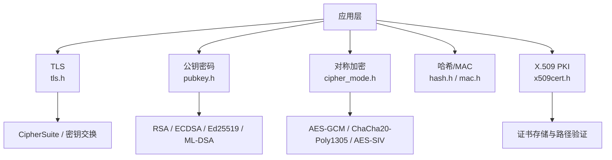

# Botan：C++ 密码学库完全指南

面向需要在 C++ 项目里自己处理加密、TLS 或证书的工程师。前置知识：计算机网络基础、RSA/AES 等常用密码学概念、C++17 基础。

读完本文能说清：Botan 在 TLS、PKI、对称加密、后量子密码学四块各自覆盖到什么程度；一次 HTTPS 连接从握手到数据加密在 Botan 里走通哪几条模块路径；怎么从包管理器或源码接入并在项目里调用 C++/Python/C 三种 API；配置安全策略时哪些参数该选、为什么；以及用 PKCS#11/TPM 把密钥落进硬件时要注意什么。

## 目录

- [项目概述](#项目概述)
  - [什么是 Botan](#什么是-botan)
  - [项目数据](#项目数据)
  - [版本体系](#版本体系)
  - [为什么选择 Botan](#为什么选择-botan)
- [原理分析](#原理分析)
  - [密码学基础概念](#密码学基础概念)
  - [TLS 协议原理](#tls-协议原理)
  - [X.509 与 PKI 原理](#x-509-与-pki-原理)
  - [后量子密码学](#后量子密码学)
- [架构分析](#架构分析)
  - [模块划分](#模块划分)
  - [一个请求如何穿过这些模块](#一个请求如何穿过这些模块)
  - [构建系统](#构建系统)
  - [跨平台支持](#跨平台支持)
- [功能详解](#功能详解)
  - [TLS 协议](#tls-协议)
  - [公钥密码学](#公钥密码学)
  - [对称加密](#对称加密)
  - [哈希函数](#哈希函数)
  - [密码哈希](#密码哈希)
  - [X.509 证书处理](#x-509-证书处理)
- [使用说明](#使用说明)
  - [环境要求](#环境要求)
  - [安装方式](#安装方式)
  - [Python API](#python-api)
  - [C API](#c-api)
  - [命令行工具](#命令行工具)
- [开发扩展](#开发扩展)
  - [集成 PKCS#11 硬件安全模块](#集成-pkcs11-硬件安全模块)
  - [集成 TPM 2.0](#集成-tpm-20)
  - [自定义算法](#自定义算法)
  - [与 Boost.Asio 集成](#与-boostasio-集成)
- [实践建议](#实践建议)
  - [密钥管理](#密钥管理)
  - [TLS 配置](#tls-配置)
  - [密码学参数选择](#密码学参数选择)
  - [错误处理](#错误处理)
- [常见问题](#常见问题)
- [自测题](#自测题)
- [练习](#练习)
- [进阶路径](#进阶路径)
- [总结](#总结)

## 项目概述

### 什么是 Botan

Botan（官方仓库：[randombit/botan](https://github.com/randombit/botan)）是一个功能完整的 C++ 密码学库，采用宽松的 BSD-2-Clause 许可证开源。它以"生产级密码学"为目标，为实用系统提供 TLS、X.509 PKI、现代 AEAD 加密、后量子密码学等全套工具，适合需要在产品里亲自处理加密的 C++ 项目。

它通过一套覆盖面很广的测试（含自动侧信道检测）来压低实现层面的错误风险，同时 API 设计得相对直白，便于集成。C++ 项目里常见的加密需求，基本都能在它内部找到对应实现，不必再引入多个库拼装。

### 项目数据

以下数据是本文撰写时的快照，数字会随时间变动：

```
Stars:      约 3,300
Forks:      约 650
许可证:     BSD-2-Clause
语言:       C++ 91.2%, Python 6.6%, C 1.9%
```

### 版本体系

| 版本 | 状态 | 本文对应版本 | 说明 |
|------|------|------------|------|
| **Botan 3.x** | 活跃开发 | 3.11.0 | Botan 3 主线，本文示例均依据它 |
| **Botan 2.x** | 已停止维护（EOL） | 2.19.5 | 已于 2024 年底停止维护 |

Botan 3 采用季度发布节奏，通常在 2 月、5 月、8 月、11 月的第一个周二发版。新项目应直接使用 Botan 3；Botan 2 只适合维护存量代码。

### 为什么选择 Botan

- **功能全面**：从 TLS 协议到 X.509 证书，从对称加密到后量子算法，单库覆盖大多数密码学需求。
- **质量保障**：持续接入 OSS-Fuzz 模糊测试、自动侧信道检测，并有成规模的测试套件支撑。
- **宽松许可证**：BSD-2-Clause 允许在商业和闭源产品中使用，不强制开放你的代码。
- **多语言 API**：开箱即用提供 C++、C、Python 三种接口，其余语言绑定可走社区方案。
- **模块化构建**：可按需裁剪功能，也支持 amalgamation 单文件构建，方便嵌入。

## 原理分析

### 密码学基础概念

先厘清几组会在后文反复出现的概念：

**对称加密 vs 非对称加密**

对称加密加密与解密使用同一把密钥，速度快，但密钥分发困难。代表算法：AES、ChaCha20。

非对称加密用公钥加密、私钥解密（或反过来）。公钥可以自由分发，解决了密钥分发问题。代表算法：RSA、ECDSA、Ed25519。

**哈希函数**

把任意长度的输入映射成固定长度的输出，用于完整性校验、密码存储、数字签名。代表算法：SHA-2、SHA-3、BLAKE2。

**消息认证码（MAC）**

验证消息完整性并确认消息确实来自持有密钥的一方，类似签名，但使用对称密钥。代表算法：HMAC、Poly1305。

**认证加密（AEAD）**

同时提供机密性与完整性保护，是现代加密通信的标准做法。两边分开做"加密 + MAC"容易在实现上出错，AEAD 把它合并成一个可靠操作。代表算法：AES-GCM、ChaCha20-Poly1305、AES-SIV。

### TLS 协议原理

TLS（Transport Layer Security）是保护互联网通信的核心协议。Botan 支持 TLSv1.2、TLSv1.3 与 DTLSv1.2。

**TLS 1.3 相对 TLS 1.2 的关键变化**

- **更快地握手**：正常 1-RTT，支持 0-RTT 恢复，省掉一程往返。
- **更强的安全性**：丢弃不安全密码套件，默认要求前向保密。
- **混合后量子密钥交换**：支持 ML-KEM（Kyber）或 FrodoKEM 与经典曲线混用。

**一次 TLS 1.3 握手的简化路径**

```text
客户端 ClientHello（携带支持的密码套件与密钥交换组）
        │
        ▼
服务端 ServerHello（选定套件）+ 服务器证书
        │
        ▼
密钥交换（ECDHE 或后量子混合 ML-KEM）
        │
        ▼
双方派生会话密钥，此后应用数据在记录层加密传输
```

这里要特别留意：TLS 层本身不碰网络。Botan 的 TLS 通过回调把需要发送的字节交给你，再由你把网络上读到的字节反馈回去（`received_data`）。网络用 blocking socket、asio、消息队列还是 RTOS 栈，都由你的代码决定。

### X.509 与 PKI 原理

公钥基础设施（PKI）通过证书把公钥绑定到身份，让接收方能确认"这把公钥确实属于对方"。

**证书链验证**

```text
根证书（Root CA）
    │ 签发
    ▼
中间证书（Intermediate CA）
    │ 签发
    ▼
终端实体证书（End Entity Certificate，含公钥与身份信息）
    │
    ▼
验证者核对证书签名、有效期与撤销状态，并按目标主机名校验身份
```

**Botan 在 X.509/PKI 上的覆盖**

- X.509v3 证书的创建与解析
- PKIX 证书路径验证（含名称约束）
- OCSP（在线证书状态协议）请求与响应处理
- PKCS#10 证书签发请求（CSR）的生成与处理
- 访问 Windows、macOS、Unix 系统证书存储
- 基于 SQL 数据库的证书存储

### 后量子密码学

量子计算机威胁目前 RSA/ECDSA 的安全性。NIST 已标准化一批后量子算法：

**签名算法**

| 算法 | 类型 | 用途 |
|------|------|------|
| **ML-DSA**（Dilithium） | 格密码 | 通用签名 |
| **SLH-DSA**（SPHINCS+） | 哈希签名 | 长期签名 |
| **XMSS** | 有状态哈希签名 | 哈希签名 |

**密钥封装机制（KEM）**

| 算法 | 类型 | 用途 |
|------|------|------|
| **ML-KEM**（Kyber） | 格密码 | 密钥协商 |
| **FrodoKEM** | 格密码 | 保守选择 |
| **Classic McEliece** | 纠错码 | 追求最高安全性 |

Botan TLS 1.3 已支持使用 ML-KEM 或 FrodoKEM 的混合后量子密钥交换。混合的意思是经典曲线与后量子 KEM 同时参与、最后把两者结果组合，即使某一侧将来失效，另一侧仍提供保护。

## 架构分析

### 模块划分

Botan 按功能把源码拆成若干模块，各自负责一类算法或协议。理解这张图，就能在遇到问题时快速定位该翻哪段代码、该查哪个头文件。



各模块的典型入口：

| 模块 | 功能 | 代表类/函数 |
|------|------|------------|
| **pubkey** | 公钥算法 | RSA、ECDSA、Ed25519、ML-DSA |
| **keywrap** | 密钥包装 | AES_keywrap |
| **mac** | 消息认证 | HMAC、Poly1305、GMAC |
| **stream** | 流密码 | ChaCha20、Salsa20 |
| **cipher** | 分组密码 | AES、ARIA、SM4、Threefish |
| **hash** | 哈希函数 | SHA-2、SHA-3、BLAKE2、BLAKE3 |
| **kdf** | 密钥派生 | HKDF、PBKDF2、Argon2、Scrypt |
| **tls** | TLS 协议 | TLS::Client、TLS::Server、TLS::Policy |
| **x509** | 证书处理 | X509_Certificate、PKCS10_Request |
| **pkcs11** | PKCS#11 接口 | PKCS11::Module、PKCS11::Session |
| **tpm2** | TPM 2.0 接口 | TPM2::Context |

### 一个请求如何穿过这些模块

用一个常见的 HTTPS 客户端请求来看这些模块是怎么串起来的：

1. 你创建 `TLS::Client`，传入 `Callbacks`（负责收发字节）、`Credentials_Manager`（提供受信任的根证书）、`Policy`（决定允许哪些套件与参数）以及 RNG。
2. 握手开始后，TLS 模块内部调用 `x509` 模块加载并校验服务器证书链，再通过 `pubkey` / KEM 完成密钥协商。
3. 握手成功后，应用数据交给你派生的 AEAD（如 AES-256-GCM）在记录层加密后写回网络。
4. 解密端用同一把会话密钥完成解密与完整性校验；一旦网络字节被篡改，认证标签校验失败，直接抛异常拒绝该消息。

这条链路里，TLS 只负责协议状态，真正的机密性、完整性、身份可信分别落在 cipher、mac、x509 三个模块上。改配置时记住这一点，就不会把"允许哪个套件"和"信任哪些 CA"混在一起调。

### 构建系统

Botan 用 Python 编写的 `configure.py` 作为配置系统（类似 autoconf），也提供实验性的 CMake 支持：

```bash
# 带压缩与更多功能
python3 configure.py --with-zlib --with-bzip2 --with-lzma

# 最小化构建
python3 configure.py --without-documentation

# 实验性 CMake
mkdir build && cd build
cmake .. -DBOTAN_WITH_TLS=ON -DBOTAN_WITH_X509=ON
```

**可选依赖**

| 依赖 | 功能 | 启用选项 |
|------|------|---------|
| zlib | 压缩支持 | `--with-zlib` |
| bzip2 | 压缩支持 | `--with-bzip2` |
| lzma | 压缩支持 | `--with-lzma` |
| openssl | OpenSSL 互操作 | `--with-openssl` |
| sqlite3 | 证书存储 | `--with-sqlite3` |
| tpm2 | TPM 支持 | `--with-tpm2` |

### 跨平台支持

Botan 3 的 Tier-1 平台（CI 持续测试、问题视为发布阻断）：

- Linux x86-64 / aarch64 / ppc64le，GCC 11.2+
- Linux x86-64，Clang 14+
- Windows x86-64，Visual C++ 2022+

Tier-2 平台（基本随构建走，但不保证）：

- macOS 与 iOS（最新版 Xcode Clang；至少 Xcode 15.0，因用到部分 C++20 特性）
- Windows（最新 MinGW GCC）
- Android（Android NDK 26+）
- FreeBSD（Clang 14+）

判断要点：Botan 3 目前以 C++20 特性为主，编译器过旧会编不过。别拿网上针对 Botan 2 或老版本写的"GCC 7 / Clang 6"的教程硬套 3.x。

## 功能详解

### TLS 协议

Botan 提供完整的 TLS 实现，支持 TLSv1.2、TLSv1.3 与 DTLSv1.2。

**TLS 客户端骨架（C++）**

TLS 层不认识 socket，收发都通过回调交给你的代码：

```cpp
#include <botan/tls_client.h>
#include <botan/tls_callbacks.h>
#include <botan/tls_session_manager.h>
#include <botan/tls_policy.h>
#include <botan/certstor.h>

// 应用侧回调：一切需要进出网络的数据都经过这里
class Callbacks : public Botan::TLS::Callbacks {
  public:
    void tls_emit_data(std::span<const uint8_t> data) override {
        socket_write(data);              // 把握手/记录层字节写入网络
    }
    void tls_record_received(uint64_t seq, std::span<const uint8_t> data) override {
        process_application_data(data);  // 收到的应用层明文
    }
};

// 凭据管理：告诉 TLS 信任哪些根证书
class Creds : public Botan::TLS::Credentials_Manager {
  public:
    std::vector<Botan::Certificate_Store*> trusted_certificate_authorities(
        const std::string&, const std::string&) override {
        return { &store_ };
    }
  private:
    Botan::Certificate_Store_In_Memory store_;  // 加入受信任的 CA 证书
};

int main() {
    Callbacks callbacks;
    Creds creds;
    Botan::TLS::Session_Manager_In_Memory session_mgr;
    Botan::TLS::Policy policy;
    auto& rng = Botan::system_rng();

    Botan::TLS::Client client(callbacks, session_mgr, creds, policy, rng,
                              Botan::TLS::Server_Information("example.com", 443));

    // 每次从 socket 读到字节都喂给 TLS
    client.received_data(buf.data(), buf.size());

    // 握手在数据喂入后自动推进；应用层稍后从 tls_record_received 取明文
    client.handshake();
}
```

要点：上面 `socket_write` / `process_application_data` 是示意，网络层要你自己实现。这正是 Botan 能做进 RTOS、asio 等任意传输的关键。

**TLS 1.3 后量子混合密钥交换**

```cpp
#include <botan/tls_policy.h>

class PostQuantumPolicy : public Botan::TLS::Policy {
  public:
    std::vector<std::string> allowed_key_exchange_methods() override {
        // 经典曲线与 ML-KEM 混合，保证后量子前向保密
        return { "ECDH_P256_MLKEM768", "ECDH_X25519_MLKEM768" };
    }
};
```

### 公钥密码学

**RSA 签名与验签**

```cpp
#include <botan/rsa.h>
#include <botan/pk_sign.h>
#include <botan/pubkey.h>

// 生成密钥
Botan::RSA_PrivateKey rsa_key(rng, 3072);

// 签名（EMSA3 即 RSA-PSS，这里用 SHA-256）
Botan::PK_Signer signer(rsa_key, rng, "EMSA3(SHA-256)");
signer.update(message);
std::vector<uint8_t> signature = signer.signature();

// 验签
Botan::PK_Verifier verifier(rsa_key, "EMSA3(SHA-256)");
verifier.update(message);
bool valid = verifier.check_signature(signature);
```

**Ed25519 签名（更新的曲线、速度更快）**

```cpp
#include <botan/ed25519.h>

Botan::Ed25519_PrivateKey ed_key(rng);
Botan::PK_Signer ed_signer(ed_key, rng, "Pure");   // EdDSA 纯签名
ed_signer.update(message);
std::vector<uint8_t> ed_sig = ed_signer.signature();
```

**后量子 ML-DSA 签名**

```cpp
#include <botan/ml_dsa.h>

// ML-DSA-65，目标安全性大致对应 AES-192
Botan::MLDSA_PrivateKey mldsa_key(rng, Botan::MLDSA::Mode::MLDSA_65);
Botan::PK_Signer mldsa_signer(mldsa_key, rng, "Raw");
mldsa_signer.update(message);
std::vector<uint8_t> mldsa_sig = mldsa_signer.signature();
```

注意：`PK_Signer` 的 EMSA 参数因算法而异（RSA 用 `EMSA3(...)`、Ed25519 用 `Pure`、ML-DSA 用 `Raw`）。拿不准时以官方 [pubkey 手册](https://botan.randombit.net/handbook/api_ref/pubkey.html) 为准。

### 对称加密

AEAD 加密在 Botan 里使用 `Cipher_Mode`，输入输出都走就地缓冲：

```cpp
#include <botan/rng.h>
#include <botan/cipher_mode.h>

auto& rng = Botan::system_rng();

// 生成 32 字节密钥与 12 字节 nonce（GCM 默认 96 位）
std::vector<uint8_t> key = rng.random_vec(32);
const auto nonce = rng.random_vec<std::vector<uint8_t>>(12);

auto enc = Botan::Cipher_Mode::create_or_throw("AES-256/GCM", Botan::Cipher_Dir::Encryption);
enc->set_key(key);
enc->start(nonce);

std::vector<uint8_t> buf(plaintext.begin(), plaintext.end());
enc->finish(buf);   // buf 就地变为「密文 + 16 字节认证标签」

// 网络传输时把 buf 整体发给对端；对端用同一 nonce 与密钥解密
```

解密端用 `Cipher_Dir::Decryption` 创建对象，同样 `set_key`/`start(nonce)` 后 `finish(buf)`。若认证标签校验失败，`finish` 会抛出 `Invalid_Authentication_Tag`，此时必须丢弃此前所有明文。

换成 ChaCha20-Poly1305 只需把套件名改为字符串 `"ChaCha20Poly1305"`，其余接口一样。非 AEAD 的裸 CBC 模式不是默认推荐项，务必搭配 HMAC 或直接改用 AEAD。

### 哈希函数

```cpp
#include <botan/hash.h>

// SHA-256
auto sha256 = Botan::HashFunction::create("SHA-256");
sha256->update(data);
std::vector<uint8_t> hash = sha256->final();

// BLAKE2b：在多数平台更快
auto blake2b = Botan::HashFunction::create("BLAKE2b-512");
blake2b->update(data);
std::vector<uint8_t> hash512 = blake2b->final();
```

### 密码哈希

普通哈希不适合直接存储密码，容易被离线字典攻击。用带盐、可调慢的密码哈希。Botan 3 提供的便捷函数在 `argon2fmt.h`：

```cpp
#include <botan/argon2fmt.h>
#include <botan/rng.h>
#include <botan/hex.h>

auto& rng = Botan::system_rng();

// Argon2id：family=2，M 是内存（KiB 为单位），t 是迭代次数，p 目前仅支持 1
std::string hash = Botan::argon2_generate_pwhash(
    password.data(), password.size(),
    rng,
    /*p*/ 1,
    /*M*/ 64 * 1024,   // 64 MiB 内存
    /*t*/ 3,           // 三次 pass
    /*y*/ 2,           // Argon2id
    /*salt_len*/ 16,
    /*output_len*/ 32);

// 校验
bool ok = Botan::argon2_check_pwhash(password.data(), password.size(), hash);
```

参数经验：Argon2id 通常调 `t=1`、`p=1`，把 `M` 调到运行环境能承受的最大内存。内存越大，特制破解硬件的可扩展成本越高。若走更底层的 `PasswordHashFamily`/`PasswordHash` API，参数顺序是 `M`、`t`、`p`。

### X.509 证书处理

```cpp
#include <botan/x509cert.h>
#include <botan/certstor.h>

Botan::X509_Certificate cert("server.pem");
Botan::X509_Certificate root("ca.pem");

// 把根证书放进内存证书存储
Botan::Certificate_Store_In_Memory store;
store.add_certificate(root);

// 校验证书链，并要求其匹配目标主机名
Botan::Path_Validation_Result result = Botan::x509_path_validate(
    cert, store,
    Botan::Path_Validation_Restrictions::standard(),
    "example.com");

if (result.successful_validation()) {
    // example.com 的证书可信
}
```

## 使用说明

### 环境要求

- **C++ 编译器**：GCC 11.2+、Clang 14+、MSVC 2022+（Tier-1）；macOS 需 Xcode 15+
- **Python 3.8+**：用于 `configure.py` 配置脚本
- **可选依赖**：zlib、bzip2、lzma、OpenSSL、SQLite、TPM 等

### 安装方式

**方式一：从包管理器安装**

```bash
# Ubuntu / Debian
sudo apt install botanist libbotan-3-dev

# Fedora
sudo dnf install botan3 botan3-devel

# macOS (Homebrew)
brew install botan

# Arch Linux
sudo pacman -S botan
```

若发行版自带的 Botan 较旧，需要后量子功能或最新修复时，选源码构建。

**方式二：从源码构建（推荐用于最新版本）**

```bash
git clone https://github.com/randombit/botan.git
cd botan

python3 configure.py --with-zlib --with-bzip2 --with-lzma
make -j$(nproc)
sudo make install
sudo ldconfig
```

**方式三：Amalgamation 单文件构建**

适合嵌入式或想简化构建流程的场景：

```bash
python3 configure.py --amalgamation
# 生成 botan_all.h 与 botan_all.cpp
g++ -o botan_app botan_all.cpp -lz -lbz2 -llzma -pthread
```

### Python API

Botan 3 的 Python 绑定模块名是 `botan3`（不是 `botan`），可通过 pip 安装：

```bash
python3 -m pip install botan3
```

```python
from botan3 import HashFunction, SymmetricCipher, RandomNumberGenerator

# SHA-256 哈希
sha256 = HashFunction("SHA-256")
sha256.update(b"hello world")
print(sha256.final().hex())

# AES-256-GCM 认证加密
key = RandomNumberGenerator().get(32)       # 256-bit 密钥
nonce = RandomNumberGenerator().get(12)     # 96-bit nonce（GCM 默认）
cipher = SymmetricCipher("AES-256/GCM")
cipher.set_key(key)
cipher.start(nonce)
ct = cipher.finish(b"secret message")        # 密文（含认证标签）
```

需要 HMAC/Poly1305 时用 `MsgAuthCode`，验证 API 版本用 `botan3.version_string()`。

### C API

Botan 提供基于 FFI 的 C 绑定（`botan/ffi.h`，即头文件 `botan.h`），适合 C 项目或需要跨语言 FFI 的场景：

```c
#include <botan/ffi.h>

botan_pubkey_t pubkey;
botan_load_pubkey(&pubkey, "key.pem");

botan_hash_t hash;
botan_hash_init(&hash, "SHA-256", 0);
botan_hash_update(hash, data, data_len);
uint8_t hash_out[32];
botan_hash_final(hash, hash_out);
botan_hash_destroy(hash);
```

### 命令行工具

Botan 自带 CLI（需要在构建时启用），覆盖哈希、加密、随机数、密钥生成、证书验证等常用操作：

```bash
botan hash --algo=SHA-256 data.txt
botan encrypt --algo=AES-256/GCM ... # 详见 botan encrypt --help
botan rng --bytes=32
botan keygen --algo=RSA --bits=3072
botan verify server.pem --ca-certs ca.pem --hostname example.com
```

各子命令的参数随版本可能微调，具体以 `botan --help` 和对应子命令的 `--help` 为准。

## 开发扩展

### 集成 PKCS#11 硬件安全模块

PKCS#11 是访问加密硬件（如 HSM、智能卡）的标准接口：

```cpp
#include <botan/pkcs11.h>

Botan::PKCS11::Module pkcs11("/usr/lib/softhsm/libsofthsm2.so");  // 或真实 HSM 驱动
Botan::PKCS11::Session session(pkcs11, 0, Botan::PKCS11::Session::RW);
session.login(user_pin, Botan::PKCS11::Session::Type::User);

auto private_key = session.get_private_key(key_id);
Botan::PK_Signer signer(*private_key, rng, "SHA-256");
signer.update(data);
auto signature = signer.signature();
```

用这套接口可以把私钥留在硬件内、只在硬件里做签名，私钥从不以明文离开设备。

### 集成 TPM 2.0

TPM（可信平台模块）是硬件级安全芯片：

```cpp
#include <botan/tpm2.h>

Botan::TPM2::Context tpm;
auto srk = tpm.create_srk(rng, "AES-256");
```

### 自定义算法

可以通过工厂注册机制接入自研算法：

```cpp
#include <botan/hash.h>

Botan::HashFunction::register_algorithm("MyHash", [](size_t out_len) {
    return std::make_unique<MyHashFunction>();
});

auto my_hash = Botan::HashFunction::create("MyHash");
```

把自己的实现接入库后，其余代码就能像用内置算法一样按名字创建它。

### 与 Boost.Asio 集成

Botan TLS 完全不做网络，天然适合与 Boost.Asio 的异步 I/O 配合。官方把这种整合打包成 `TLS::Stream` 层面的便捷封装，在你的 socket 读写回调里调用 TLS 的 `tls_emit_data` 与 `received_data` 即可：

```cpp
#include <botan/tls_server.h>
#include <boost/asio.hpp>

class TLSStream {
    Botan::TLS::Server server;
    boost::asio::ip::tcp::socket socket;
  public:
    TLSStream(boost::asio::io_context& io, Botan::TLS::Policy& policy)
        : server(callbacks, session_mgr, creds, policy, rng), socket(io) {}
    // 在异步读写回调中桥接 TLS 收发与 asio socket
};
```

## 实践建议

### 密钥管理

**生成强密钥**

```cpp
auto& rng = Botan::system_rng();          // Botan 3 推荐的系统 RNG

Botan::RSA_PrivateKey rsa_key(rng, 3072); // RSA 至少 3072 位
Botan::EC_Group secp256r1("secp256r1");
Botan::ECDSA_PrivateKey ecdsa_key(rng, secp256r1);
```

**安全存储密钥**

- 用密码加密的 PKCS#8 PEM 写盘（Botan 的 `write_pkcs8_encrypted_pem`），不要裸存私钥。
- 敏感密钥尽量放进 PKCS#11/TPM 等硬件。
- 建立密钥轮换流程，别让一把密钥用到底。

### TLS 配置

**推荐的安全策略（仅 TLS 1.3）**

```cpp
#include <botan/tls_policy.h>

class SecurePolicy : public Botan::TLS::Policy {
  public:
    std::vector<std::string> allowed_tls13_ciphersuites() const override {
        return { "AES-256-GCM", "ChaCha20Poly1305" };
    }
    std::vector<std::string> allowed_key_exchange_methods() const override {
        return { "ECDH_X25519", "ECDH_P256",
                 "ECDH_X25519_MLKEM768", "ECDH_P256_MLKEM768" }; // 后量子混合
    }
    bool allow_tls12() const override { return false; }
};
```

注意 TLS 1.3 的套件是按字符串（如 `AES-256-GCM`）在 `allowed_tls13_ciphersuites()` 里配置的；TLS 1.2 走 `allowed_ciphersuites()` 返回 RFC 密码套件编号，两套接口不要混用。

### 密码学参数选择

**对称加密**

| 算法 | 密钥长度 | 推荐场景 |
|------|---------|---------|
| AES-256-GCM | 256-bit | 通用推荐 |
| ChaCha20-Poly1305 | 256-bit | 移动端、性能敏感 |
| AES-SIV | 256-bit | nonce 容易重复、需要确定性 |

**哈希函数**

| 算法 | 输出长度 | 推荐场景 |
|------|---------|---------|
| BLAKE2b | 512-bit | 通用、性能敏感 |
| SHA-3 | 512-bit | 长期存储、监管要求 |
| SHA-256 | 256-bit | 兼容性优先 |

**密码哈希**

| 算法 | 推荐参数 | 内存需求 |
|------|---------|---------|
| **Argon2id** | `M` 尽量大，`t=1`，`p=1` | 高 |
| **Scrypt** | `N=2^16`，`r=8`，`p=1` | 中 |
| **bcrypt** | cost=12 | 低 |

### 错误处理

```cpp
try {
    auto enc = Botan::Cipher_Mode::create_or_throw("AES-256/GCM",
                                                    Botan::Cipher_Dir::Encryption);
} catch (const Botan::Algorithm_Not_Found& e) {
    // 构建时未启用该算法
} catch (const Botan::Invalid_Key_Length& e) {
    // 密钥长度不合法
}

// create 返回空表示不支持，create_or_throw 直接抛异常
auto hash = Botan::HashFunction::create("SHA-256");
if (!hash) {
    // 创建失败
}
```

解密时认证失败要单独对待：捕获 `Botan::Invalid_Authentication_Tag`，放弃此前所有明文，绝不能把部分解密结果回显或用于业务逻辑。

## 常见问题

**Q：Botan 与 OpenSSL 怎么选？**

| 维度 | Botan | OpenSSL |
|------|-------|---------|
| 许可证 | BSD-2（允许闭源） | Apache-2.0 |
| 主要语言 | C++（原生 API） | C |
| 后量子密码学 | 内置 ML-KEM、ML-DSA | 通过 OQS 等集成 |
| 生态 | 面向 C++ 项目 | 极其广泛，绑定繁多 |
| 维护 | 活跃，季度发布 | 非常活跃 |

两者都能用的场景里，C++ 项目往往更顺手用 Botan；需要最大生态兼容或治理性合规时 OpenSSL 更常见。

**Q：如何快速验证 Botan 已正确安装？**

```bash
botan version

python3 -c "import botan3; print(botan3.version_string())"
```

**Q：Botan 支持 Android / iOS 吗？**

支持。Android（NDK 26+）与 iOS（Xcode 15+）都是 Tier-2 平台。用 `configure.py` 交叉编译：

```bash
./configure.py --os=android --cpu=arm64
```

**Q：如何给 Botan 贡献代码？**

1. 阅读 [CONTRIBUTING.md](https://github.com/randombit/botan/blob/master/CONTRIBUTING.md)
2. Fork 仓库并创建功能分支
3. 跑通测试：`python3 validate.py`
4. 提交 Pull Request

**Q：遇到编译错误怎么办？**

1. 确认编译器版本达标（GCC 11.2+ / Clang 14+ / MSVC 2022+）。
2. 核对构建时启用的可选依赖是否都装好。
3. 用 `configure.py --with-debug-info` 打开更详细的诊断。
4. 在 [GitHub Issues](https://github.com/randombit/botan/issues) 里按关键词检索。

**Q：发现安全漏洞怎么报告？**

联系 security@randombit.net。处理流程见官方[安全页面](https://botan.randombit.net/security.html)。

## 自测题

**问题 1**：Botan 支持哪些 TLS 版本？TLS 1.3 相比 TLS 1.2 的关键改进是什么？

<details>
<summary>参考答案</summary>

支持 TLSv1.2、TLSv1.3 与 DTLSv1.2。关键改进：握手更快（1-RTT，可 0-RTT）、默认前向保密、移除不安全套件、支持 ML-KEM/FrodoKEM 的混合后量子密钥交换。

</details>

**问题 2**：解释对称加密与非对称加密的区别，各举一个 Botan 支持的算法。

<details>
<summary>参考答案</summary>

对称加密加解密用同一密钥，快但分发难（AES、ChaCha20）。非对称加密用公钥/私钥，公钥可分发，解决密钥分发（RSA、ECDSA、Ed25519）。

</details>

**问题 3**：什么是 AEAD？为什么它是现代加密通信的标准模式？

<details>
<summary>参考答案</summary>

AEAD（认证加密）同时提供机密性与完整性保护。分开做"加密 + MAC"容易在实现上出错，AEAD 把两者合并成一个可靠操作。Botan 支持 AES-GCM、ChaCha20-Poly1305、AES-SIV 等。

</details>

**问题 4**：写一个启用 zlib、禁用文档的配置命令。

<details>
<summary>参考答案</summary>

```bash
python3 configure.py --with-zlib --without-documentation
make -j$(nproc)
sudo make install
sudo ldconfig
```

</details>

**问题 5**：如何用 Botan 给 TLS 服务器配置 ML-KEM 混合密钥交换且仅允许 TLS 1.3？

<details>
<summary>参考答案</summary>

```cpp
#include <botan/tls_policy.h>

class PostQuantumPolicy : public Botan::TLS::Policy {
  public:
    std::vector<std::string> allowed_key_exchange_methods() override {
        return { "ECDH_P256_MLKEM768", "ECDH_X25519_MLKEM768" };
    }
    bool allow_tls12() const override { return false; }
};
```

</details>

## 练习

1. **从源码构建 Botan**：按"安装方式"从源码构建，并运行测试套件验证。
2. **写一个 TLS 客户端骨架**：实现 `Callbacks` 与 `Credentials_Manager`，连到 `https://example.com` 并完成证书链校验，说明网络字节为什么必须经回调回流。
3. **实现一个加密工具**：用 `Cipher_Mode` 的 AES-256-GCM 加密/解密文件，并处理 `Invalid_Authentication_Tag`。
4. **对比哈希性能**：分别用 SHA-256、BLAKE2b-512 对同一大数据块计时，验证 BLAKE2b 是否更快。

## 进阶路径

1. **读 TLS 实现**：看 `src/lib/tls/` 下手握协议、密钥交换与记录层加密怎么组织。
2. **实现自定义算法**：基于 `Cipher_Mode` / `AEAD_Mode` 接口接入一种新密码，并挂进构建系统。
3. **接硬件 HSM**：用 `pkcs11` 模块连 SoftHSMv2，把私钥留在硬件里做签名。
4. **后量子实践**：基于 ML-KEM / ML-DSA 写测试程序，对比现代 x86 与 ARM 上的性能，理解混合密钥交换的价值。
5. **回馈项目**：修 bug 或补测试，向 randombit/botan 提交 PR。

## 总结

Botan 是覆盖面很全的 C++ 密码学库，BSD-2 许可证让商业闭源使用没有负担。

**核心优势**：

- 完整功能：TLS、PKI、对称加密、哈希、后量子密码学。
- 生产级质量：OSS-Fuzz、侧信道检测、成规模测试。
- 多语言 API：C++、C、Python 开箱即用。
- 宽松许可证：BSD-2 允许闭源使用。
- 活跃维护：季度发版。

**上手机径**：

1. 从 TLS 客户端骨架或对称加密示例入手，建立 Botan 的"回调驱动、就地缓冲"使用直觉。
2. 学证书路径验证，掌握 X.509/PKI 实践。
3. 熟悉后量子（ML-KEM、ML-DSA），为量子化威胁做准备。
4. 按需接 PKCS#11/TPM，把密钥落进硬件。

**链接资源**：

- GitHub 仓库：https://github.com/randombit/botan
- 官方文档：https://botan.randombit.net/handbook
- 安全页面：https://botan.randombit.net/security.html
- 发行说明：https://botan.randombit.net/news.html

*本文撰写于 2026-03-31，示例均基于 Botan 3.11.0。*