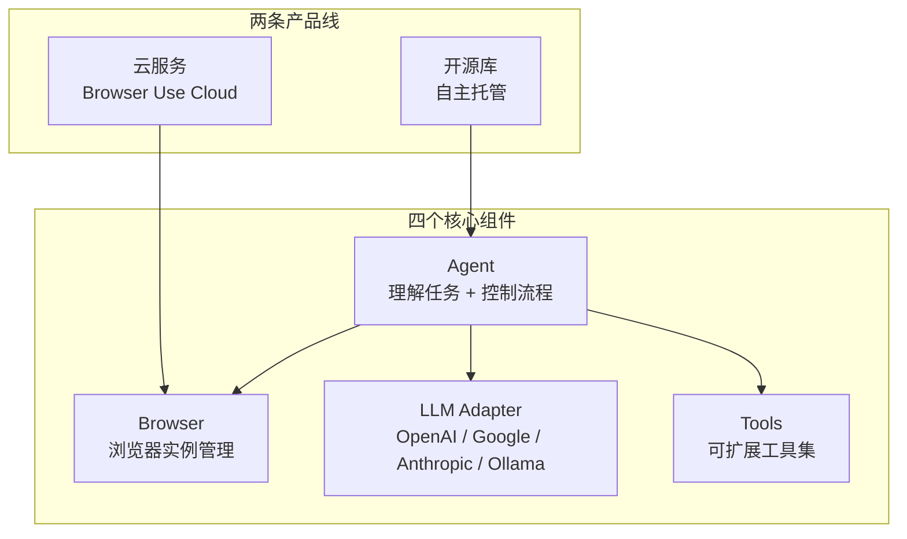
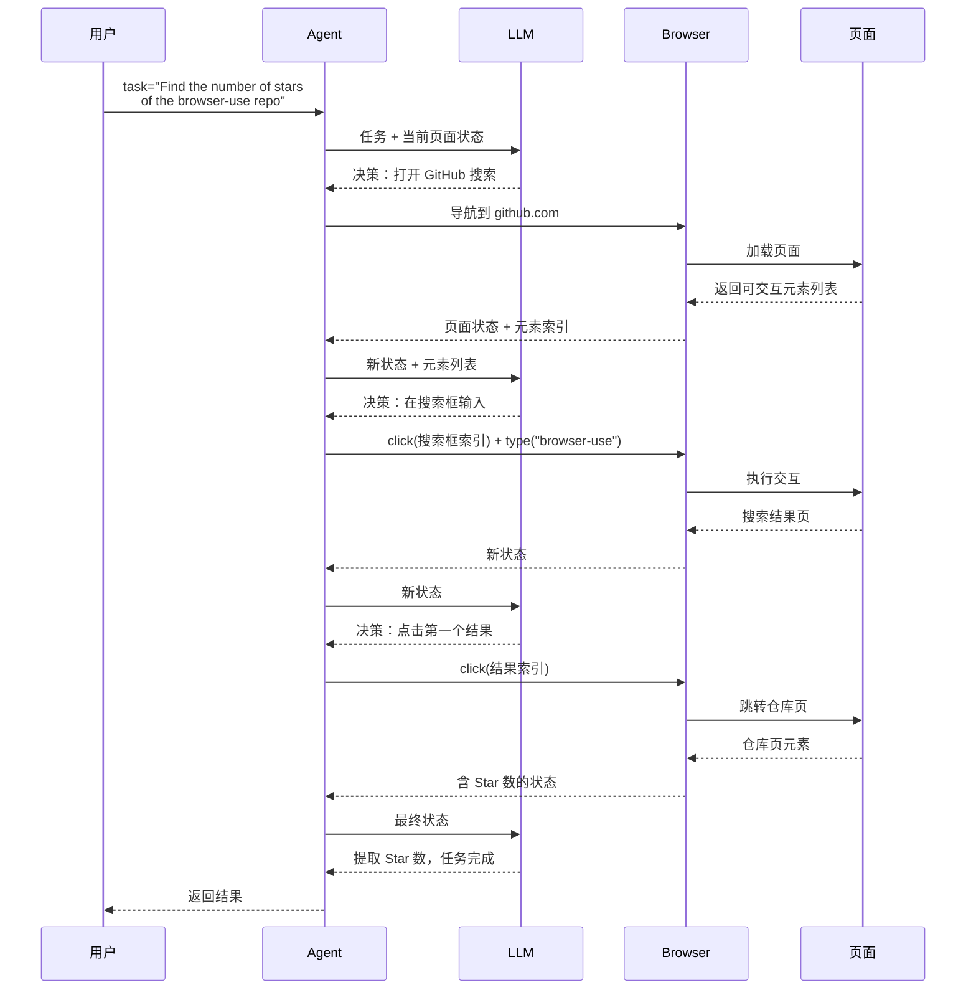

# Browser-Use：让 AI Agent 控制浏览器完成任何任务

Browser-Use 把"用自然语言指挥浏览器干活"这件事做成了可用的开源库。它把 LLM 的任务理解、Playwright 的页面控制和可扩展工具集组合起来：过去要写专属脚本才能做的填表单、比价、抓数据，现在用自然语言描述任务就能跑。

Browser-Use 有开源库和云服务两条产品线，能力边界不一样。开源库给你完全控制和自定义空间，云服务替你扛内存、反爬、CAPTCHA 这些工程难题。下面的内容面向已经写过 Python、用过 Playwright 或 Selenium、想用 LLM 替代固定脚本的工程师；只想快速跑通一次性任务的读者，可以直接跳到 Claude Code Skill 集成一节。

读完后你能：

- 区分开源库与云服务的能力边界，判断自己的场景该走哪条线
- 用 uv 跑通最简示例，定位环境问题
- 画出 Agent / Browser / LLM Adapter / Tools 四个组件的数据流向图
- 给 Agent 注册自定义工具，扩展查天气、调内部 API 这类能力
- 在生产环境识别内存、反爬、CAPTCHA 三类常见坑并选对应方案
- 用 CLI 快速探索页面结构，再决定是否写完整脚本

---

## 目录

- [全景地图：两条产品线与四个组件](#全景地图两条产品线与四个组件)
- [核心机制：任务如何流过系统](#核心机制任务如何流过系统)
- [安装与快速上手](#安装与快速上手)
- [多 LLM 提供商支持](#多-llm-提供商支持)
- [实战用例：三类任务的 task 模板](#实战用例三类任务的-task-模板)
- [CLI 工具详解](#cli-工具详解)
- [Claude Code Skill 集成](#claude-code-skill-集成)
- [自定义工具扩展](#自定义工具扩展)
- [高级配置](#高级配置)
- [生产环境部署](#生产环境部署)
- [故障排除](#故障排除)
- [何时选开源库，何时选云服务](#何时选开源库何时选云服务)
- [从哪里开始落地](#从哪里开始落地)
- [自测题](#自测题)
- [进阶方向](#进阶方向)
- [相关资源](#相关资源)

---

## 全景地图：两条产品线与四个组件

Browser-Use 用四个组件让 LLM 看懂页面、做出决策、执行操作，再通过两条产品线部署到不同环境。



| 组件 | 职责 | 关键接口 |
|------|------|----------|
| **Agent** | 解析自然语言任务为可执行步骤，控制浏览器完成操作 | `Agent(task=..., llm=..., browser=...)` |
| **Browser** | 管理浏览器实例，支持本地 Chromium 和云端托管 | `Browser()` / `Browser(use_cloud=True)` |
| **LLM Adapter** | 适配多家模型提供商，统一调用接口 | `ChatOpenAI` / `ChatAnthropic` / `ChatBrowserUse` |
| **Tools** | 注册自定义工具，扩展 Agent 能力范围 | `@tools.action(description=...)` |

两条产品线的主要差别在 Browser 组件的部署位置：开源库把浏览器跑在你自己的机器上，云服务把浏览器跑在 Browser Use Cloud 上。Agent 和 LLM Adapter 在两条线里都一样，Tools 只在开源库里需要手动注册。

### 开源库：自主托管，完全控制

开源库适合三类场景：需要自定义工具扩展功能、要在现有应用里深度嵌入浏览器自动化、数据安全要求不允许把页面内容传给第三方。代价是你得自己处理 Chrome 的内存占用、反爬检测、CAPTCHA 这些工程问题。

### 云服务：托管基础设施，抗检测

云服务把浏览器基础设施整个托管出去，重点解决开源库在生产环境最难扛的几件事：并行扩缩容、stealth 浏览器指纹、CAPTCHA 自动解决、代理轮换。适合快速启动、规模化运行、对抗性网站抓取。但按用量付费，且页面内容要经过云服务。

### 混合使用：开源库 + 云浏览器

两条线不是二选一。最常见的生产部署是混合模式：用开源库的 Agent 和 Tools 控制逻辑，把 Browser 指向云端的托管浏览器。自定义工具的灵活性留在自己手里，本地浏览器的运维交给云服务。

---

## 核心机制：任务如何流过系统

以"查找 browser-use 仓库的 Star 数"为例：



**任务理解**。Agent 把自然语言任务拆成可执行步骤，依赖 LLM 的推理能力。任务描述越具体，拆解越准确——"Find the number of stars of the browser-use repo"比"查一下那个仓库的星"效果好，因为前者明确指出了目标字段。

**元素识别**。Browser 把当前页面的可交互元素提取成带索引的列表返回给 Agent，Agent 通过索引引用元素而非 CSS 选择器。这是 Browser-Use 区别于传统 Playwright 脚本的关键设计——LLM 不需要写选择器，只需要说"点击第 5 个元素"。

**状态追踪与错误恢复**。每一步执行后 Agent 都会拿到新的页面状态，如果某步失败（元素不存在、页面没加载完），Agent 会重新评估状态并调整策略。它持续感知页面状态，每一步都重新评估，所以能处理动态页面和意外弹窗。

### 基准测试表现

Browser-Use 官方基准测试 BU Bench V1（用于评估 LLM 在真实浏览器任务上的完成能力）在 100 个真实浏览器任务上比较了不同 LLM 的表现。先说清楚这个数字测的是什么：任务集覆盖搜索信息、表单填写、多页面导航、数据提取等常见浏览器操作，每个任务有明确的完成判定（比如"返回正确的 Star 数""表单提交成功跳转"），成功率指任务完整完成的百分比，部分完成不算。

| 模型 | 成功率 | 特点 |
|------|--------|------|
| **ChatBrowserUse** | 最高 | 专门优化，单步耗时约为通用模型的 1/3 到 1/5 |
| **GPT-4o** | 高 | 通用能力强 |
| **Claude Sonnet** | 高 | 推理能力强 |
| **Gemini** | 中高 | 性价比好 |

表中只给相对排名用于选型参考，具体成功率数字以 BU Bench V1 仓库公布的数据为准。

也不能从这里推出"ChatBrowserUse 在所有 Agent 场景都更强"：它只针对浏览器操作做了优化，离开这个框架的纯推理或代码任务不适用。开源库搭配 GPT-4o 或 Claude Sonnet 能拿到接近的成绩，但单步推理耗时更长，整体任务时间会拉长 3-5 倍。

---

## 安装与快速上手

### 环境要求

- Python >= 3.11
- uv 包管理器（推荐）
- Chromium 浏览器（自动安装或手动安装）

### 使用 uv 安装

```bash
# 创建项目
uv init

# 添加 browser-use
uv add browser-use

# 同步环境
uv sync

# 安装 Chromium（如果没有）
uvx browser-use install
```

### 获取 API Key

**方式一：Browser Use Cloud（推荐）**

1. 访问 https://cloud.browser-use.com/new-api-key
2. 获取 API Key
3. 配置环境变量：

```bash
# .env
BROWSER_USE_API_KEY=your-key
GOOGLE_API_KEY=your-key
ANTHROPIC_API_KEY=your-key
```

**方式二：使用本地模型**

```bash
# 安装 Ollama
curl -fsSL https://ollama.com/install.sh | sh

# 拉取模型
ollama pull llama3
```

本地模型适合离线场景和成本敏感任务，但浏览器操作的成功率明显低于 GPT-4o 或 Claude。建议先用云端模型验证流程，再切本地模型调优。

### 最简示例

```python
from browser_use import Agent, Browser, ChatBrowserUse
import asyncio

async def main():
    # 创建浏览器实例
    browser = Browser()

    # 创建 Agent
    agent = Agent(
        task="Find the number of stars of the browser-use repo",
        llm=ChatBrowserUse(),
        browser=browser,
    )

    # 运行任务
    await agent.run()

if __name__ == "__main__":
    asyncio.run(main())
```

跑通这个示例需要确认两件事：`BROWSER_USE_API_KEY` 已经配置，Chromium 已经安装。如果报 `Browser not found`，运行 `uvx browser-use install`；如果报认证失败，检查 `.env` 是否被正确加载。

---

## 多 LLM 提供商支持

Browser-Use 通过 LLM Adapter 适配多家模型提供商，接口统一。`ChatBrowserUse` 是框架自带的云服务配套模型适配器，其他模型走 LangChain 的标准适配器：

```python
# Browser-Use 自带的云服务优化模型
from browser_use import ChatBrowserUse

# OpenAI（需要 pip install langchain-openai）
from langchain_openai import ChatOpenAI
llm = ChatOpenAI(model='gpt-4o')

# Google（需要 pip install langchain-google-genai）
from langchain_google_genai import ChatGoogleGenerativeAI
llm = ChatGoogleGenerativeAI(model='gemini-2.5-flash')

# Anthropic（需要 pip install langchain-anthropic）
from langchain_anthropic import ChatAnthropic
llm = ChatAnthropic(model='claude-sonnet-4-20250514')

# 本地模型（需要 pip install langchain-ollama）
from langchain_ollama import ChatOllama
llm = ChatOllama(model='llama3')
```

选型上没有标准答案，看任务复杂度和成本预算。简单任务用 Gemini 性价比好，复杂推理任务用 Claude Sonnet，需要稳定生产表现用 ChatBrowserUse。本地模型适合开发调试和数据敏感场景，但不要指望它处理多步表单或动态页面。

### 浏览器管理

```python
from browser_use import Browser, BrowserConfig

# 本地浏览器
browser = Browser()

# 配置选项
browser = Browser(
    # headless=False,  # 显示浏览器窗口
    # timeout=30,      # 超时时间（秒）
)

# 云浏览器（推荐生产环境）
browser = Browser(
    use_cloud=True,  # 使用 Browser Use Cloud 托管浏览器
)
```

`headless=False` 在调试时很有用——能直接看到 Agent 在页面上点了什么、输入了什么。生产环境用 `use_cloud=True` 把浏览器托管出去，本地不用扛 Chrome 的内存。

---

## 实战用例：三类任务的 task 模板

表单填写、在线购物、个人助手这三类任务的代码骨架完全一致，差别只在 `task` 字符串和各自的难点。下面以表单填写为例展示完整骨架，其余两类任务只需替换 `task` 内容：

```python
from browser_use import Agent, Browser, ChatBrowserUse
import asyncio

async def main():
    browser = Browser()
    agent = Agent(
        task="""Fill in this job application:
 - Name: John Doe
 - Email: john@example.com
 - Position: Software Engineer
 - Resume: upload resume.pdf""",
        llm=ChatBrowserUse(),
        browser=browser,
    )
    await agent.run()

if __name__ == "__main__":
    asyncio.run(main())
```

三类任务的 task 模板与难点：

| 任务类型 | task 模板 | 难点 |
|---------|----------|------|
| 表单填写 | `Fill in this job application: - Name: John Doe - Email: john@example.com - Position: Software Engineer - Resume: upload resume.pdf` | 字段本身不难，难点在文件上传——`upload resume.pdf` 这种指令需要 Agent 能定位到文件路径并触发文件选择对话框。如果文件路径是相对路径，确保脚本运行时的工作目录正确。 |
| 在线购物 | `Shop for these groceries: - Milk - Bread - Eggs - Butter - Add to my cart on instacart.com` | 购物任务通常需要登录态。如果 Instacart 要求登录，Agent 会卡在登录页——这种场景用 `profile_dir` 复用已登录的 Chrome 配置文件，或者用云浏览器的同步配置功能。 |
| 个人助手 | `Find these PC parts on pcpartpicker.com: - NVIDIA RTX 4090 - AMD Ryzen 9 7950X - 64GB DDR5 RAM - Compare prices and show me the best deals` | 比价任务涉及多页面跳转和信息聚合，对 Agent 的状态追踪能力要求较高。如果结果不稳定，把任务拆成多个小任务分别执行往往比一个长任务更可靠。 |

---

## CLI 工具详解

CLI 适合快速调试和探索页面结构，不用每次写完整脚本。

### 安装 CLI

CLI 随 browser-use 包一起安装：

```bash
# 验证安装
browser-use --version
```

### 常用命令

```bash
# 打开网页
browser-use open https://example.com

# 查看可点击元素
browser-use state

# 点击元素（通过索引）
browser-use click 5

# 输入文本
browser-use type "Hello World"

# 截图
browser-use screenshot page.png

# 关闭浏览器
browser-use close
```

### 快速迭代工作流

```bash
# 打开目标页面
browser-use open https://example.com

# 查看页面元素
browser-use state

# 点击第 5 个元素
browser-use click 5

# 输入搜索词
browser-use type "search term"

# 截图确认
browser-use screenshot result.png
```

CLI 保持浏览器实例运行，可以快速迭代调试。写脚本前先用 CLI 验证页面结构和元素索引，能省掉大量试错时间。

---

## Claude Code Skill 集成

为 Claude Code 安装 Browser-Use Skill 后，可以直接用自然语言让 AI 控制浏览器完成各种任务，无需编写代码。适合一次性任务和探索性操作——重复性任务还是写成脚本更可控。

### 安装步骤

```bash
# 创建 skill 目录
mkdir -p ~/.claude/skills/browser-use

# 下载 SKILL.md
curl -o ~/.claude/skills/browser-use/SKILL.md \
  https://raw.githubusercontent.com/browser-use/browser-use/main/skills/browser-use/SKILL.md
```

### 使用方式

安装后，直接在 Claude Code 中告诉它要做什么：

```
Use browser-use to search for the cheapest RTX 4090 on Amazon and tell me the price.
```

Claude Code 会自动调用 Browser-Use Skill，执行浏览器操作并返回结果。整个过程不需要写代码，但需要 Browser-Use 的环境已经配好——Skill 本身不包含运行时。

---

## 自定义工具扩展

Agent 自带的浏览器操作能力有限，遇到"查天气""调内部 API""读数据库"这类需求时，需要注册自定义工具。

### 创建自定义工具

```python
from browser_use import Agent, Browser
from browser_use.tools import Tools

# 创建工具实例
tools = Tools()

# 定义自定义工具
@tools.action(description='Get the current weather for a city')
def get_weather(city: str) -> str:
    """获取城市天气"""
    import requests
    # 使用 Open-Meteo 的免费 API（无需 API Key）
    # 先通过 geocoding 接口把城市名转成经纬度
    geo_resp = requests.get(
        "https://geocoding-api.open-meteo.com/v1/search",
        params={"name": city, "count": 1},
        timeout=10,
    )
    geo_data = geo_resp.json()
    if not geo_data.get("results"):
        return f"未找到城市：{city}"
    location = geo_data["results"][0]
    # 再查当前天气
    weather_resp = requests.get(
        "https://api.open-meteo.com/v1/forecast",
        params={
            "latitude": location["latitude"],
            "longitude": location["longitude"],
            "current": "temperature_2m,wind_speed_10m",
        },
        timeout=10,
    )
    return weather_resp.json()

# 使用自定义工具
agent = Agent(
    task="Find the weather in Tokyo and then book a flight there",
    llm=llm,
    browser=browser,
    tools=tools,
)
```

`description` 是 LLM 决定是否调用这个工具的依据，写清楚工具做什么、参数含义、返回格式。类型注解不仅给开发者看，也会被框架解析后传给 LLM。

### 工具设计要点

- **description 要具体**：写"获取指定城市的当前温度和天气状况"，不写"获取天气"
- **参数类型明确**：用 `str` / `int` / `bool` 等基础类型，避免 `Any` 或复杂嵌套
- **返回值可读**：返回字符串或 JSON 字符串，LLM 能直接理解
- **幂等性**：同一参数多次调用应返回相同结果，避免 Agent 重试时产生副作用
- **错误信息有意义**：返回错误描述而非抛异常，让 Agent 能判断下一步

---

## 高级配置

### 认证处理

**复用 Chrome 配置**：

```python
from browser_use import Browser

# 使用已登录的 Chrome 配置文件
browser = Browser(
    profile_dir="~/.config/google-chrome/Default"
)
```

`profile_dir` 指向已登录目标网站的 Chrome 用户目录，Agent 启动时直接复用登录态。注意 Chrome 必须先关闭——同一个 profile 不能被两个 Chrome 实例同时占用。

**云浏览器同步配置**：

```bash
# 示意命令，实际脚本地址以官方文档为准
curl -fsSL https://browser-use.com/profile.sh | \
  BROWSER_USE_API_KEY=XXXX sh
```

这类脚本的作用是把本地 Chrome 的登录态同步到云端，之后云浏览器实例能直接使用已登录状态。具体脚本地址和参数请以 [Browser Use 官方文档](https://docs.browser-use.com) 为准，避免使用来源不明的脚本泄露本地 Cookie。

### 代理配置

```python
from browser_use import Browser

browser = Browser(
    use_cloud=True,
    proxy="http://my-proxy:8080"  # 代理地址
)
```

代理配置在抓取地域限制内容时必需。云服务自带代理轮换，本地浏览器需要自己维护代理池。

### 超时与步数限制

```python
browser = Browser(
    timeout=60,  # 单个操作超时（秒）
)

agent = Agent(
    task="...",
    browser=browser,
    max_steps=50,  # 最大步数限制
)
```

`max_steps` 是成本控制的关键参数。Agent 每一步都要调 LLM，步数越多成本越高。复杂任务设 50-100 步，简单任务设 20 步以内，避免 Agent 陷入死循环烧钱。

---

## 生产环境部署

### 常见挑战与应对

| 挑战 | 开源库方案 | 云服务方案 |
|------|-----------|-----------|
| **内存占用** | 单实例限制并发数，定期重启 | 云端托管，无需管理 |
| **并行管理** | 自己维护浏览器池 | 云服务自动扩缩容 |
| **反爬检测** | 配置代理 + 修改指纹 | 内置 stealth 浏览器 |
| **CAPTCHA** | 接第三方解决服务 | 内置解决方案 |
| **状态管理** | 自己实现持久化 | 提供持久化文件系统和记忆 |

开源库上生产最大的坑是内存——Chrome 实例长时间运行会泄漏内存，必须配合进程监控和定期重启。云服务把这些都封装好了，但按用量计费，跑量大任务前先估算成本。

### 云服务能力清单

Browser Use Cloud 在开源库能力之上补充了：

- 可扩展的浏览器基础设施
- 内存管理
- 代理轮换
- Stealth 浏览器指纹
- 高性能并行执行
- 官方宣称的 1000+ 集成（Gmail、Slack、Notion 等，具体列表见 Browser Use 官方文档）

1000+ 集成指的是云服务预置了常见 SaaS 的操作模板，不需要从零写浏览器操作脚本。如果目标网站在这些集成里，直接调模板比让 Agent 自由探索更稳定。

---

## 故障排除

### 常见问题

**Q: 报 `Chromium not found` 怎么办？**

运行 `uvx browser-use install` 安装 Chromium。如果已经安装但仍报错，检查 `CHROME_PATH` 环境变量是否指向正确路径。

**Q: 页面加载超时怎么处理？**

增加 `Browser(timeout=60)` 参数，单位是秒。如果是特定页面超时，可能是页面资源太大或网络问题，用 `browser-use open <url>` 在 CLI 里手动测试加载时间。

**Q: 元素点击失败怎么办？**

用 `browser-use state` 查看当前页面的实际元素列表和索引。Agent 通过索引引用元素，如果页面在 Agent 决策后发生了变化（动态加载、弹窗），索引可能失效。解决方法是降低任务粒度，让 Agent 更频繁地感知页面状态。

**Q: 登录态丢失怎么办？**

用 `profile_dir` 复用 Chrome 配置文件，或用云浏览器的同步配置功能。注意 `profile_dir` 指向的 Chrome 实例必须先关闭。

**Q: 遇到 CAPTCHA 怎么办？**

开源库没有内置 CAPTCHA 解决能力，需要接第三方服务（如 2Captcha、Anti-Captcha）。云服务内置 CAPTCHA 解决，但成功率不是 100%——复杂验证码仍可能失败。

### 调试技巧

```python
# 启用详细日志
import logging
logging.basicConfig(level=logging.DEBUG)

# 截图查看状态
browser.screenshot("debug.png")

# 打印页面 HTML
html = browser.get_page_content()
print(html)
```

`logging.DEBUG` 会打印 Agent 每一步的决策过程，包括 LLM 的完整 prompt 和响应。这是定位"Agent 为什么这么决策"的最直接方式——日志里能看到 LLM 看到的页面状态和它给出的下一步动作。

---

## 何时选开源库，何时选云服务

### 选开源库的场景

- 需要自定义工具扩展 Agent 能力
- 在现有应用里深度嵌入浏览器自动化
- 数据安全要求不允许页面内容经过第三方
- 任务量小，不值得为云服务付费
- 需要完全控制浏览器配置和运行环境

### 选云服务的场景

- 需要并行运行大量浏览器实例
- 目标网站有反爬检测或 CAPTCHA
- 不想维护 Chrome 运维
- 需要快速启动，不想搭基础设施
- 任务涉及 1000+ 预置集成中的 SaaS

### 混合使用

```python
# 使用开源库 + 云浏览器
agent = Agent(
    task="...",
    llm=ChatOpenAI(model='gpt-4o'),
    browser=Browser(use_cloud=True),  # 云浏览器
    tools=custom_tools,               # 自定义工具
)
```

混合模式是生产环境最常见的部署方式：Agent 和 Tools 跑在本地，Browser 托管在云端，自定义工具的灵活性留在自己手里，本地浏览器的运维甩给云服务。LLM 也可以混用——用 ChatOpenAI 做任务理解，用 ChatBrowserUse 做浏览器操作优化。

---

## 从哪里开始落地

**第一步：用最简示例验证环境**。跑通"查找仓库 Star 数"这个示例，确认 API Key、Chromium、Python 环境都正常。这一步解决的是环境问题——环境不通，后面所有调试都是白费。

**第二步：用 CLI 探索目标页面**。在 CLI 里手动 `open` 目标网站，用 `state` 查看元素结构，确认 Agent 能识别的关键元素。提前发现页面结构问题，能避免写脚本时反复试错。

**第三步：写最简任务脚本**。把任务拆成最小可验证单元，先跑通单步操作（如"打开页面""点击某个按钮"），再组合成完整任务。不要一上来就写复杂任务——Agent 在长任务里的失败率明显高于短任务。

**第四步：加自定义工具**。当 Agent 自带能力不够时，注册自定义工具扩展。工具的 `description` 要写清楚，参数类型要明确，返回值要可读。

**第五步：评估是否上云**。本地跑通后，如果遇到内存、反爬、CAPTCHA 问题，考虑切到云浏览器或混合模式。不要过早优化——本地能跑通就先本地跑，遇到具体问题再迁移。

团队刚开始评估 Browser-Use 时，先把第一步和第二步走通。这两步的成本最低，但能帮你判断 Browser-Use 是否适合你的目标网站——有些网站的反爬机制连云服务都扛不住，这种场景要尽早放弃，换其他方案。

---

## 自测题

1. Agent 通过什么方式引用页面元素？为什么不用 CSS 选择器？
2. `max_steps` 参数设太大和设太小分别会有什么问题？
3. 开源库和云服务在 Browser 组件上的核心差异是什么？
4. 自定义工具的 `description` 写得模糊会导致什么后果？
5. 任务执行中 Agent 卡在登录页，有哪两种解决方式？

### 参考答案

**第 1 题**。Agent 通过整数索引引用页面元素（如"点击第 5 个元素"），不用 CSS 选择器。判断依据是 LLM 生成稳定 CSS 选择器的能力很弱——页面结构稍变，选择器就失效；而索引引用由 Browser 层在每一步重新提取并维护，LLM 只需要做"点哪个"的决策，不需要关心 DOM 结构。代价是索引依赖当前页面快照，页面动态变化时索引可能错位，所以 Agent 每步都要重新拿状态。

**第 2 题**。`max_steps` 设太大：每一步都要调一次 LLM，步数多直接烧钱；更糟的是 Agent 可能陷入死循环反复尝试同一操作，把预算耗光。设太小：复杂任务在到达目标前就被截断，返回不完整结果，调试时还容易误判为"Agent 能力不够"。经验值是简单任务 20 步以内，复杂任务 50-100 步，先观察再调。

**第 3 题**。核心差异是 Browser 组件的部署位置：开源库把 Chromium 跑在你自己的机器上，要自己扛内存、反爬、CAPTCHA；云服务把浏览器跑在 Browser Use Cloud 上，内置 stealth 指纹和 CAPTCHA 解决。Agent 和 LLM Adapter 在两条线里接口一致，Tools 只在开源库需要手动注册。混合模式就是把本地 Agent 接云端 Browser。

**第 4 题**。`description` 是 LLM 决定是否调用工具的唯一依据。写得模糊会有两种后果：一是 LLM 该调用时没识别出来，Agent 转而用浏览器硬爬，效率低且容易失败；二是 LLM 在不该调用时误调用，或参数填错，返回无用结果污染上下文。判断标准是：把 description 单独给一个不了解你项目的人看，他能否准确说出工具做什么、参数含义、返回什么。

**第 5 题**。两种方式：一是用 `profile_dir` 指向已登录目标网站的 Chrome 用户目录，Agent 启动时复用本地登录态，前提是 Chrome 必须先关闭（同一 profile 不能被两个实例占用）；二是用云浏览器的同步配置功能，把本地登录态同步到云端，之后云浏览器实例直接带登录态启动。前者适合本地开发调试，后者适合生产环境。

---

## 进阶方向

- **多 Agent 协作**。复杂任务拆成多个 Agent，比如一个负责信息收集、一个负责决策、一个负责执行，通过共享状态协调。Browser-Use 的 Tools 机制可以作为 Agent 间通信的入口。
- **持久化记忆**。长任务跨会话续跑需要把中间状态（已访问页面、已提取数据、已执行操作）写进文件或数据库，下次启动时加载。Agent 自带的 `max_steps` 截断后，记忆是恢复进度的关键。
- **成本治理**。生产环境最大的变量是 LLM 调用成本。监控每步的 token 消耗、用更便宜的模型做简单判断步、对重复页面做状态缓存，都能显著降本。
- **反爬对抗**。目标网站升级反爬机制时，需要持续调整指纹、代理、节奏。云服务的 stealth 能力是基线，遇到 Akamai、Cloudflare 这类强反爬仍可能需要人工介入或换方案。
- **集成到现有工程**。把 Browser-Use 作为子模块嵌入到数据管线、RAG 系统、客服后台里，关键设计是任务队列、超时熔断和结果校验——Agent 返回的结果不能直接信任，要有独立校验层。

---

## 相关资源

- GitHub：https://github.com/browser-use/browser-use
- 官方文档：https://docs.browser-use.com
- 云服务：https://cloud.browser-use.com
- 博客：https://browser-use.com/posts
- 基准测试：https://github.com/browser-use/benchmark
