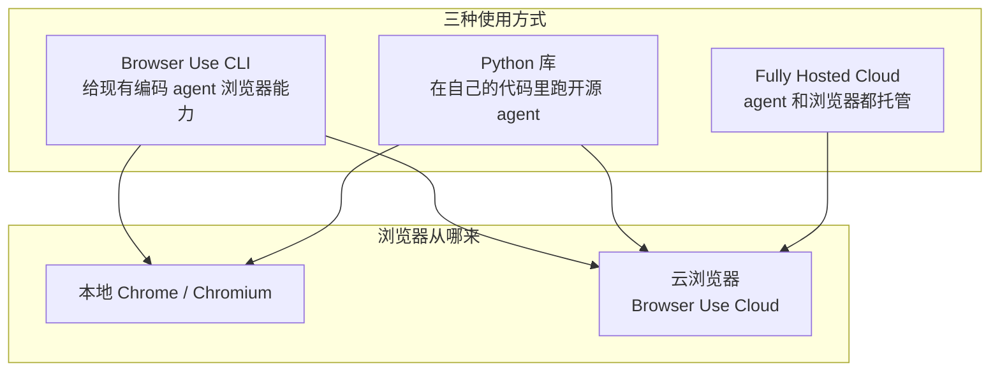
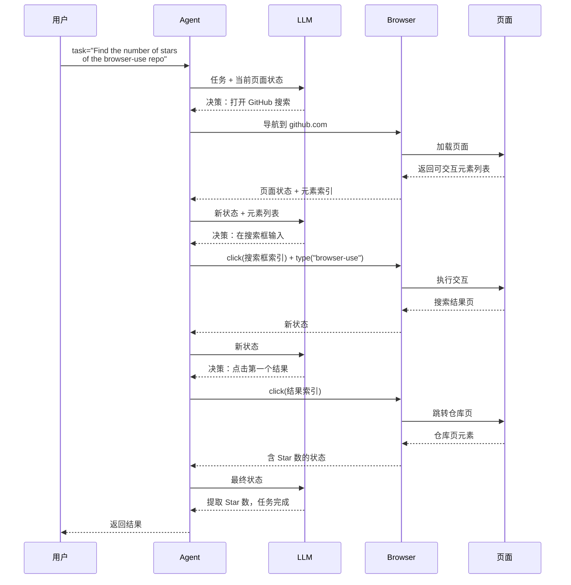

## 快速信息卡

| 项目 | 信息 |
|------|------|
| **Stars** | 116.5K |
| **Forks** | 12.8K |
| **许可证** | MIT |
| **语言** | Python |
| **仓库** | [browser-use/browser-use](https://github.com/browser-use/browser-use) |

> Star 数会随时间变化，上面的 116.5K Stars 为 2026 年 9 月 28 日 GitHub API 观测值，使用时以仓库当前数据为准。

填表单、比价、抓数据这类过去要写专属脚本才能做的事，现在用自然语言描述任务就能跑。Browser-Use 把 LLM 的任务理解、浏览器页面控制和可扩展工具塞进了同一个开源库里。

## 目录

- [全景地图：三种使用方式与四个组件](#全景地图三种使用方式与四个组件)
- [核心机制：任务如何流过系统](#核心机制任务如何流过系统)
- [安装与快速上手](#安装与快速上手)
- [选择模型](#选择模型)
- [浏览器管理](#浏览器管理)
- [实战用例：三类任务的 task 模板](#实战用例三类任务的-task-模板)
- [CLI 工具](#cli-工具)
- [Claude Code Skill 集成](#claude-code-skill-集成)
- [自定义工具扩展](#自定义工具扩展)
- [高级配置](#高级配置)
- [生产环境部署](#生产环境部署)
- [故障排除](#故障排除)
- [何时选托管云、CLI，何时选 Python 库](#何时选托管云cli何时选-python-库)
- [上手路径](#上手路径)
- [扩展与边界](#扩展与边界)
- [相关资源](#相关资源)

---

## 全景地图：三种使用方式与四个组件

Browser-Use 官方把产品画成三条路径：Fully Hosted Cloud、CLI、Python 库。三条路径底下是同一组组件——Agent 理解任务并控制流程，Browser 管理浏览器实例，LLM 适配器对接模型，Tools 扩展能力。


```mermaid
graph TB
    subgraph "三种使用方式"
        Cloud["Fully Hosted Cloud<br/>agent 和浏览器都托管"]
        CLI["Browser Use CLI<br/>给现有编码 agent 浏览器能力"]
        Lib["Python 库<br/>在自己的代码里跑开源 agent"]
    end

    subgraph "浏览器从哪来"
        Local["本地 Chrome / Chromium"]
        CloudBrowser["云浏览器<br/>Browser Use Cloud"]
    end

    CLI --> Local
    CLI --> CloudBrowser
    Lib --> Local
    Lib --> CloudBrowser
    Cloud --> CloudBrowser
```

| 组件 | 职责 | 关键接口 |
|------|------|----------|
| **Agent** | 把自然语言任务拆成步骤，循环执行感知、决策、操作 | `Agent(task=..., llm=..., browser=...)` |
| **Browser** | 管理浏览器实例：本地 Chromium、系统 Chrome 或云浏览器 | `Browser()` / `Browser(use_cloud=True)` / `Browser.from_system_chrome()` |
| **LLM 适配器** | 内置 16+ 家模型适配器，接口统一 | `ChatBrowserUse` / `ChatOpenAI` / `ChatAnthropic` / `ChatOllama` |
| **Tools** | 注册自定义工具，扩展 Agent 能力范围 | `Tools()` + `@tools.action(description=...)` |

三种方式的差别在"agent 跑在哪、浏览器跑在哪"：

- **Fully Hosted Cloud**：agent 和浏览器都跑在 Browser Use Cloud 上，提交自然语言任务、取回结果。适合不想维护任何运行时的场景。
- **CLI**：把浏览器交给已有的编码 agent（Claude Code、Codex、Cursor 等），你自己的 agent 负责思考和编排，Browser Use 只提供浏览器控制面。
- **Python 库**：开源 MIT 协议，agent 的全部逻辑留在你的代码里，模型随便换，工具随便加。

CLI 和 Python 库都能连本地浏览器或云浏览器。云浏览器提供反检测（stealth）浏览器指纹、CAPTCHA 处理、住宅代理和持久化 profile；本地浏览器完全免费，代价是你自己扛内存、指纹和验证码。

### 混合使用：本地 agent + 云浏览器

最常见的生产组合是用 Python 库的 Agent 和 Tools 写控制逻辑，把 Browser 指向云端的托管浏览器：

```python
agent = Agent(
    task="...",
    llm=ChatOpenAI(model='gpt-4.1-mini'),
    browser=Browser(use_cloud=True),  # 云浏览器，需 BROWSER_USE_API_KEY
    tools=tools,                      # 自定义工具留在本地
)
```

自定义工具的灵活性留在自己手里，浏览器运维交给云服务。

---

## 核心机制：任务如何流过系统

以"查找 browser-use 仓库的 Star 数"为例：


```mermaid
sequenceDiagram
    participant U as 用户
    participant A as Agent
    participant L as LLM
    participant B as Browser
    participant P as 页面

    U->>A: task="Find the number of stars<br/>of the browser-use repo"
    A->>L: 任务 + 当前页面状态
    L-->>A: 决策：打开 GitHub 搜索
    A->>B: 导航到 github.com
    B->>P: 加载页面
    P-->>B: 返回可交互元素列表
    B-->>A: 页面状态 + 元素索引
    A->>L: 新状态 + 元素列表
    L-->>A: 决策：在搜索框输入
    A->>B: click(搜索框索引) + type("browser-use")
    B->>P: 执行交互
    P-->>B: 搜索结果页
    B-->>A: 新状态
    A->>L: 新状态
    L-->>A: 决策：点击第一个结果
    A->>B: click(结果索引)
    B->>P: 跳转仓库页
    P-->>B: 仓库页元素
    B-->>A: 含 Star 数的状态
    A->>L: 最终状态
    L-->>A: 提取 Star 数，任务完成
    A-->>U: 返回结果
```

这个流程能拆出三个关键机制。

Agent 把自然语言任务拆成可执行步骤，依赖 LLM 的推理能力。任务描述越具体，拆解越准确——"Find the number of stars of the browser-use repo"直接指明了目标字段，比"查一下那个仓库的星"更少歧义。

Browser 把当前页面的可交互元素提取成带索引的列表返回给 Agent，Agent 通过索引引用元素，不写 CSS 选择器。LLM 生成稳定选择器的能力很差——页面结构稍变选择器就失效，而索引引用由 Browser 层在每一步重新提取，LLM 只需要决定"点哪个"。

每一步执行后 Agent 都会拿到新的页面状态，某一步失败（元素不存在、页面没加载完）时，它据此调整下一步策略。动态页面和意外弹窗也能处理——Agent 持续感知页面状态，始终基于最新状态做决策。

### 基准测试表现

先说 BU Bench V1 测的是什么：100 个高难度真实浏览器任务，题目来自 WebBench、Mind2Web、GAIA 和 BrowseComp 四个公开数据集，每个任务有明确的完成判定，成功率只计完整完成的任务。官方公布的对比是 Browser Use Cloud 78%，Claude Opus 4.6 为 62%，GPT-5 为 52%（数据来自 [browser-use/benchmark](https://github.com/browser-use/benchmark) 仓库）。

这组数字说明的是"托管 agent + 优化模型 + 云浏览器"这个组合在困难任务上的完整率优势。从里面不能直接推出"任何场景下都该用 Browser Use Cloud"：对比对象是通用大模型直接驱动 agent 的成绩，如果你用 GPT-5 级别的模型配本地浏览器，差距会缩小；反过来，离开这个任务集（纯推理、代码任务）也不适用。另一个参考是 Online-Mind2Web：300 个在线任务、136 个网站全部保留，Browser Use Cloud V4 拿到 98% 的完成率（方法学见 [官方博客](https://browser-use.com/posts/online-mind2web-benchmark)）。

选模型时还要算时延和成本。开源库搭配 GPT-4o 或 Claude Sonnet 也能跑通大多数任务，但每步决策都要往返调用所选模型，单步时延和 token 成本自己承担；`ChatBrowserUse` 官方宣称任务完成速度快 3-5 倍，且新注册账号送 15 美元一次性额度，先拿免费额度跑自己的任务集，是最省事的验证方式。

---

## 安装与快速上手

### 环境要求

- Python >= 3.11（官方示例用 3.12）
- uv 包管理器
- Chromium 浏览器（可用命令安装）

### 使用 uv 安装

```bash
# 安装 uv（已装可跳过）
pip install uv

# 创建虚拟环境
uv venv --python 3.12
source .venv/bin/activate
# Windows 用 .venv\Scripts\activate

# 安装 browser-use 和 Chromium
uv pip install browser-use
uvx browser-use install
```

如果用项目化工作流，等价做法是 `uv init --python 3.12`、`uv add browser-use`，然后用 `uv run agent.py` 运行脚本。

### 获取 API Key

推荐从 Browser Use Cloud 拿一个 Key（`ChatBrowserUse` 模型和云浏览器都要用它）：

1. 访问 https://cloud.browser-use.com/new-api-key
2. 获取 API Key，符合条件的账号会拿到 15 美元一次性额度
3. 写入环境变量：

```bash
# .env
BROWSER_USE_API_KEY=your-key
# 用其他厂商模型时才需要下面的 Key
OPENAI_API_KEY=your-key
GOOGLE_API_KEY=your-key
ANTHROPIC_API_KEY=your-key
```

也可以完全不走云服务：用 Ollama 跑本地模型（见[选择模型](#选择模型)），浏览器用本地 Chromium，全程零 API 成本，代价是任务成功率明显低于云端模型。

### 最简示例

```python
from browser_use import Agent, ChatBrowserUse
from dotenv import load_dotenv
import asyncio

load_dotenv()

async def main():
    agent = Agent(
        task="Find the number of stars of the browser-use repo",
        llm=ChatBrowserUse(),  # 默认使用 bu-2-0 模型
    )
    history = await agent.run()
    print(history.final_result())

if __name__ == "__main__":
    asyncio.run(main())
```

Agent 不传 `browser` 时会启动本地 Chromium。跑通这个示例要确认两件事：`.env` 里的 `BROWSER_USE_API_KEY` 已配置（代码里的 `load_dotenv()` 负责加载），Chromium 已安装——报浏览器缺失就运行 `uvx browser-use install`。

---

## 选择模型

Browser-Use 内置了各家模型的适配器，全部直接从 `browser_use` 包导入，不再依赖 langchain 的适配器包：

```python
from browser_use import (
    ChatBrowserUse,   # Browser Use 自家模型，需 BROWSER_USE_API_KEY
    ChatOpenAI,       # gpt-4.1-mini 等
    ChatGoogle,       # gemini-flash-latest 等
    ChatAnthropic,    # claude-sonnet-4-0 等
    ChatOllama,       # 本地模型
)

llm = ChatBrowserUse()                      # 默认 bu-2-0，为浏览器操作优化
llm = ChatOpenAI(model='gpt-4.1-mini')
llm = ChatGoogle(model='gemini-flash-latest')
llm = ChatAnthropic(model='claude-sonnet-4-0', temperature=0.0)
```

适配器阵容还包括 ChatDeepSeek、ChatGroq、ChatAzureOpenAI、ChatOpenRouter、ChatLiteLLM 等十几种，命名统一为 `Chat<厂商名>`。

`ChatBrowserUse` 背后是 Browser Use 为浏览器操作专门训练的 BU2 模型（`model='bu-2-0'`，`ChatBrowserUse()` 当前默认选它）。它还能当网关用——传厂商前缀的模型 ID，走 Browser Use 的网关调用其他模型，只配 `BROWSER_USE_API_KEY`：

```python
llm = ChatBrowserUse(model='anthropic/claude-sonnet-4-6')
llm = ChatBrowserUse(model='google/gemini-3-pro')
```

选型经验：浏览器任务优先试 `ChatBrowserUse`，它在官方基准上完成率和速度都最好；简单任务用 Gemini Flash 系列，性价比高；复杂推理上 Claude Sonnet。本地模型适合开发调试和数据不能出网的场景，处理多步表单或动态页面的成功率会明显下降，先拿云模型验证流程再考虑迁移。

---

## 浏览器管理

```python
from browser_use import Browser

# 本地 Chromium（默认）
browser = Browser()

# 显示浏览器窗口，调试时用
browser = Browser(headless=False, window_size={'width': 1000, 'height': 700})

# 云浏览器（需 BROWSER_USE_API_KEY）
browser = Browser(use_cloud=True)
```

`headless=False` 在调试时很有用——能直接看到 Agent 在页面上点了什么、输入了什么。生产环境用 `use_cloud=True` 把浏览器托管出去，本地不用扛 Chrome 的内存，还能拿到 stealth 指纹和代理。

---

## 实战用例：三类任务的 task 模板

表单填写、在线购物、个人助手这三类任务的代码骨架完全一致，差别只在 `task` 字符串和各自的难点。下面以表单填写为例展示完整骨架，其余两类任务只需替换 `task` 内容：

```python
from browser_use import Agent, ChatBrowserUse
from dotenv import load_dotenv
import asyncio

load_dotenv()

async def main():
    agent = Agent(
        task="""Fill in this job application:
 - Name: John Doe
 - Email: john@example.com
 - Position: Software Engineer
 - Resume: upload resume.pdf""",
        llm=ChatBrowserUse(),
    )
    await agent.run()

if __name__ == "__main__":
    asyncio.run(main())
```

三类任务的难点各不相同：

| 任务类型 | task 示例 | 难点 |
|---------|----------|------|
| 表单填写 | `Fill in this job application: ... - Resume: upload resume.pdf` | 字段本身不难，难点在文件上传——`upload resume.pdf` 这种指令需要 Agent 能定位到文件路径并触发文件选择对话框。把可访问的路径列进 Agent 的 `available_file_paths` 参数，并在 task 里写绝对路径。 |
| 在线购物 | `Shop for these groceries: ... Add to my cart on instacart.com` | 购物任务通常需要登录态。Agent 卡在登录页时，用 `Browser.from_system_chrome()` 复用已登录的 Chrome，或用云浏览器的 profile 同步（见[高级配置](#高级配置)）。 |
| 个人助手 | `Find these PC parts on pcpartpicker.com: ... Compare prices and show me the best deals` | 比价任务涉及多页面跳转和信息聚合，对 Agent 的状态追踪能力要求较高。结果不稳定时，把任务拆成多个小任务分别执行，往往比一个长任务更可靠。 |

---

## CLI 工具

CLI 是独立于 Python 库的产品形态：它给编码 agent 一个直接的浏览器控制面，agent 写 Python 片段来操作浏览器，而不是靠自然语言一步步指挥。

### 安装 CLI

```bash
# 安装为常驻工具
uv tool install browser-use

# 或一次性运行，不落安装
uvx browser-use --help
```

### 操作浏览器：直接传 Python

CLI 从标准输入读 Python 代码并执行：

```bash
uvx browser-use <<'PY'
new_tab("https://example.com")
print(page_info())
PY
```

默认行为是附着到你正在运行的 Chrome 或 Chromium——通过 CDP（Chrome DevTools Protocol，Chrome 调试协议）连接，保留已打开的标签页、Cookie、扩展和登录态。Chrome 弹出远程调试确认时批准即可。如果连不上，运行 `browser-use --doctor` 排查；也可以用 `BU_CDP_URL` 或 `BU_CDP_WS` 环境变量指向任何已暴露 DevTools 端口的浏览器。

### 云浏览器会话

agent 跑在无头服务器、或需要并行隔离会话时，用云浏览器。认证一次，然后按名字起停：

```bash
# 登录（用 BROWSER_USE_API_KEY 对应账号）
browser-use auth login

# 起一个名叫 work 的云浏览器
browser-use <<'PY'
start_remote_daemon("work")
PY

# 复用这个实例跑任务
BU_NAME=work browser-use <<'PY'
new_tab("https://example.com")
print(page_info())
PY

# 用完关掉——云浏览器按时间计费，不停就一直计费
BU_NAME=work browser-use <<'PY'
stop_remote_daemon("work")
PY
```

并行跑多个 agent 时给每个起独立的名字，名字各自映射一个远程浏览器实例。

---

## Claude Code Skill 集成

为 Claude Code 安装 Browser-Use Skill 后，可以直接用自然语言让 AI 控制浏览器完成各种任务，无需编写代码。适合一次性任务和探索性操作——重复性任务还是写成脚本更可控。

### 安装步骤

推荐用 CLI 一条命令注册（会装进 Claude Code、Codex 等支持的 agent）：

```bash
browser-use skill install
```

或者手动下载 SKILL.md：

```bash
# 创建 skill 目录
mkdir -p ~/.claude/skills/browser-use

# 下载 SKILL.md
curl -o ~/.claude/skills/browser-use/SKILL.md \
  https://raw.githubusercontent.com/browser-use/browser-use/main/skills/browser-use/SKILL.md
```

### 使用方式

安装后，直接在 Claude Code 中告诉它要做什么：

```
Use browser-use to search for the cheapest RTX 4090 on Amazon and tell me the price.
```

Claude Code 会自动调用 Browser-Use Skill，执行浏览器操作并返回结果。整个过程不需要写代码，但需要 Browser-Use 的环境已经配好——Skill 本身不包含运行时。

---

## 自定义工具扩展

Agent 自带的浏览器操作能力有限，遇到"查天气""调内部 API""读数据库"这类需求时，需要注册自定义工具。

### 创建自定义工具

```python
import json
import requests

from browser_use import Agent, Browser, ActionResult, ChatBrowserUse, Tools
from dotenv import load_dotenv

load_dotenv()

# 创建工具实例
tools = Tools()

# 定义自定义工具
@tools.action(description='Get the current weather for a city')
def get_weather(city: str) -> ActionResult:
    """获取城市天气"""
    # 使用 Open-Meteo 的免费 API（无需 API Key）
    # 先通过 geocoding 接口把城市名转成经纬度
    geo_resp = requests.get(
        "https://geocoding-api.open-meteo.com/v1/search",
        params={"name": city, "count": 1},
        timeout=10,
    )
    geo_data = geo_resp.json()
    if not geo_data.get("results"):
        return ActionResult(extracted_content=f"未找到城市：{city}")
    location = geo_data["results"][0]
    # 再查当前天气
    weather_resp = requests.get(
        "https://api.open-meteo.com/v1/forecast",
        params={
            "latitude": location["latitude"],
            "longitude": location["longitude"],
            "current": "temperature_2m,wind_speed_10m",
        },
        timeout=10,
    )
    return ActionResult(
        extracted_content=json.dumps(weather_resp.json(), ensure_ascii=False)
    )

# 使用自定义工具
agent = Agent(
    task="Find the weather in Tokyo and then book a flight there",
    llm=ChatBrowserUse(),
    tools=tools,
)
```

`description` 是 LLM 决定是否调用这个工具的依据，写清楚工具做什么、参数含义、返回格式。类型注解同样会被框架解析后传给 LLM，不只是给开发者看。工具返回 `ActionResult(extracted_content=...)`，内容会进入 Agent 的记忆，供后续步骤引用。

### 工具设计要点

- **description 要具体**：写"获取指定城市的当前温度和天气状况"，不写"获取天气"
- **参数类型明确**：用 `str` / `int` / `bool` 等基础类型，避免 `Any` 或复杂嵌套
- **返回值可读**：把结果放进 `extracted_content`，LLM 能直接理解
- **幂等性**：同一参数多次调用应返回相同结果，避免 Agent 重试时产生副作用
- **错误信息有意义**：返回错误描述而非抛异常，让 Agent 能判断下一步

---

## 高级配置

### 认证处理

**复用系统 Chrome 的登录态**：

```python
from browser_use import Browser

# 使用系统 Chrome 和已登录的 profile
browser = Browser.from_system_chrome(profile_directory='Default')
```

`from_system_chrome` 直接用系统安装的 Chrome 和指定 profile 启动会话，Cookie、扩展、登录态都在。注意 Chromium 的 profile 目录有实例锁——如果这个 profile 正被另一个 Chrome 窗口占用，先关闭 Chrome 再跑 Agent。

**云浏览器 profile 同步**：

```bash
export BROWSER_USE_API_KEY=your_key
curl -fsSL https://browser-use.com/profile.sh | sh
```

这个官方脚本（`profile-use` 工具）把本地 Chrome 的登录态同步到云端，选中要同步的账号后会返回一个 profile ID，之后在代码里引用：

```python
browser = Browser(use_cloud=True, cloud_profile_id='your-profile-id')
```

同步传的是 Cookie 和 local storage，不含密码管理器，也不含扩展；站点如果过期 Cookie、绑定设备或要求二次验证，可能需要重新登录。profile ID 属于创建它的项目，换 API Key 时要用同一项目的 Key。

### 代理配置

```python
from browser_use import Browser, BrowserProfile, ProxySettings

profile = BrowserProfile(
    proxy=ProxySettings(
        server='http://my-proxy:8080',      # 支持 http / https / socks5
        bypass='localhost,127.0.0.1',       # 不走代理的地址
        # username='...', password='...',   # 带认证的代理
    ),
)
browser = Browser(browser_profile=profile)
```

代理配置在抓取地域限制内容时必需。云浏览器另配住宅代理（按流量计费，官方价格 5 美元/GB），自带代理轮换；本地浏览器需要自己维护代理池。

### 步数与超时

步数限制在 `run()` 上传，默认 500 步：

```python
# 复杂任务设 50-100 步，简单任务设 20 步以内
history = await agent.run(max_steps=50)
```

Agent 每一步都要调 LLM，步数直接决定成本上限——到步数上限时 Agent 只能执行 `done` 动作收尾，所以上限要留余量。两个超时参数在 Agent 构造时设置：`step_timeout=180`（单步超时秒数）和 `llm_timeout`（LLM 调用超时，不设则按模型自动选 30/75/90 秒）。步骤连续失败还有一个保险：`max_failures=5`，超过后强制结束并返回中间结果。

---

## 生产环境部署

### 常见挑战与应对

| 挑战 | 自托管方案 | 云服务方案 |
|------|-----------|-----------|
| **内存占用** | 单实例限制并发数，定期重启 | 云端托管，无需管理 |
| **并行管理** | 自己维护浏览器池 | 自动扩缩容，高用量账号并发可达 1000+ 会话 |
| **反爬检测** | 配置代理 + 自定义指纹 | 内置 stealth 浏览器，[官方 stealth 基准](https://browser-use.com/posts/stealth-benchmark)排名第一（71 个高防护站点 81% 通过率） |
| **CAPTCHA** | 接第三方解决服务 | 内置解决方案，不能保证 100% 通过 |
| **状态管理** | 自己实现持久化 | 持久化云 profile、录制、live view |

自托管上生产最大的坑是内存——Chrome 实例长时间运行会泄漏内存，必须配合进程监控和定期重启。云服务把这些都封装好了，但按用量计费：云浏览器 0.02 美元/浏览器小时，住宅代理 5 美元/GB，充值制无订阅，充值金额不过期。跑量大任务前先估算成本。

### 规模化的另一条路：Fully Hosted Cloud

如果连 agent 都不想跑，Browser Use 的托管 API（当前为 V4 版本）直接接收自然语言任务、返回结果，agent、浏览器、基础设施全在云上。Python 和 TypeScript SDK 都有，适合把浏览器自动化当成一个远程服务来调用的团队。注意托管 API 与开源 Python 库是两套 API，不能混用示例。

---

## 故障排除

### 常见问题

**Q: 报 `Chromium not found` 怎么办？**

运行 `uvx browser-use install` 安装 Chromium。如果已经安装但仍报错，检查可执行文件路径，或在 `BrowserProfile` 里显式指定 `executable_path`。

**Q: 页面加载或步骤超时怎么处理？**

调大 Agent 的 `step_timeout`（默认 180 秒）。如果是特定页面慢，可能是页面资源太大或网络问题——用 CLI 的 `new_tab("...")` 手动打开测试加载时间，排查是站点问题还是代理问题。

**Q: 元素点击失败怎么办？**

Agent 通过索引引用元素，如果页面在 Agent 决策后发生了变化（动态加载、弹窗），索引可能失效。解决方法是降低任务粒度，让 Agent 更频繁地感知页面状态；表单类任务可以让 Agent 一步输出多个动作（`max_actions_per_step` 默认 5），减少状态错位的窗口。

**Q: 登录态丢失怎么办？**

本地用 `Browser.from_system_chrome()` 复用 Chrome 配置文件（注意先关闭占用该 profile 的 Chrome）；云端用 profile 同步后传 `cloud_profile_id`。同步只搬 Cookie，站点要求二次验证时仍需人工登录一次。

**Q: 遇到 CAPTCHA 怎么办？**

开源库没有内置 CAPTCHA 解决能力，需要接第三方服务（如 2Captcha、Anti-Captcha）。云浏览器内置解决能力，官方明确说明不能保证所有验证码都能通过——遇到高防护站点要有心理预期。

**Q: 怎么确认 Agent 的结果可信？**

开源库的 `is_done` 只表示 Agent 执行了终止动作，`is_successful` 是 Agent 自己汇报的结果——涉及下单、发消息这类外部动作时，要有独立校验层，不要直接信任。

### 调试技巧

```python
# 启用详细日志
import logging
logging.basicConfig(level=logging.DEBUG)
```

`logging.DEBUG` 会打印 Agent 每一步的决策过程，包括 LLM 看到的页面状态和它给出的下一步动作。这是定位"Agent 为什么这么决策"的最直接方式。另一个常用手段是 `save_conversation_path='log.json'`，把完整对话历史落盘复盘。

---

## 何时选托管云、CLI，何时选 Python 库

三条路径的决策点其实只有两个：agent 的逻辑放哪，浏览器放哪。

**Python 库**适合需要自定义工具扩展、在现有应用里深度嵌入浏览器自动化，或数据安全要求不允许页面内容经过第三方的场景。任务量小、不值得为云浏览器付费，或者需要完全控制浏览器配置和运行环境时，也走 Python 库配本地 Chromium。

**CLI**适合你已经有一个编码 agent（Claude Code、Codex、Cursor 等），只是想给它接上真实浏览器——尤其是复用你本地 Chrome 里的登录态和扩展时，CLI 附着本地浏览器的默认行为正好对口。

**Fully Hosted Cloud**适合需要并行运行大量浏览器实例、目标网站有反爬检测或 CAPTCHA、不想维护 Chrome 运维的场景。不想搭任何基础设施、把浏览器自动化当远程服务调用时，托管 API 最省事。

**混合模式**在生产环境很常见：Agent 和 Tools 跑在本地，浏览器托管在云端，自定义工具的灵活性留在自己手里，Chrome 运维甩给云服务。LLM 也可以混用——简单步骤交给便宜的模型，关键决策用强模型。

---

## 上手路径

先跑通"查找仓库 Star 数"那个示例，确认 API Key、Chromium、Python 环境都正常。环境不通，后面所有调试都是白费。

然后在 CLI 里用 `new_tab` 打开目标网站，确认本地浏览器附着正常、登录态还在。提前发现页面结构问题，能避免写脚本时反复试错。

第三步，把任务拆成最小可验证单元，先跑通单步操作（如"打开页面""点击某个按钮"），再组合成完整任务。不要一上来就写复杂任务——Agent 在长任务里的失败率明显高于短任务。

当 Agent 自带能力不够时，注册自定义工具扩展。工具的 `description` 要写清楚，参数类型要明确，返回值要可读。

本地跑通后，如果遇到内存、反爬、CAPTCHA 问题，考虑切到云浏览器或混合模式。不要过早优化——本地能跑通就先本地跑，遇到具体问题再迁移。

团队刚开始评估 Browser-Use 时，先走前面两步就够了。这两步的成本最低，但能帮你判断 Browser-Use 是否适合你的目标网站——有些网站的反爬机制连云服务都扛不住，这种场景要尽早放弃，换其他方案。

---

## 扩展与边界

复杂任务可以拆成多个 Agent，比如一个负责信息收集、一个负责决策、一个负责执行，通过共享状态协调。Browser-Use 的 Tools 机制可以作为 Agent 间通信的入口。

长任务跨会话续跑需要把中间状态（已访问页面、已提取数据、已执行操作）写进文件或数据库，下次启动时加载。`run(max_steps=...)` 截断后，持久化的记忆是恢复进度的关键。

生产环境最大的变量是 LLM 调用成本。监控每步的 token 消耗（构造 Agent 时传 `calculate_cost=True` 可以开启费用统计）、用更便宜的模型做简单判断步、对重复页面做状态缓存，都能显著降本。

目标网站升级反爬机制时，需要持续调整指纹、代理、节奏。云服务的 stealth 能力是基线，遇到强反爬站点仍可能失败，要有降级方案。

把 Browser-Use 作为子模块嵌入到数据管线、RAG 系统、客服后台里，关键设计是任务队列、超时熔断和结果校验——Agent 汇报的成功不等于业务成功，要有独立校验层。

---

## 相关资源

- GitHub：https://github.com/browser-use/browser-use
- 官方文档：https://docs.browser-use.com
- 云服务：https://cloud.browser-use.com
- CLI 文档：https://docs.browser-use.com/open-source/browser-use-cli
- 基准测试：https://github.com/browser-use/benchmark
- Browser Harness（编码 agent 浏览器扩展）：https://github.com/browser-use/browser-harness
