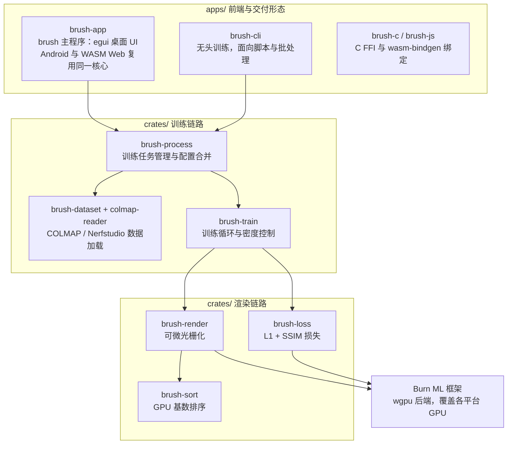

> **判断**：Brush 解决的不是「把 Gaussian Splatting 训练得更快更准」，而是「让 3DGS 摆脱 CUDA + Python 组合，变成一个拷贝就能跑的普通软件」。Rust、Burn、WebGPU 三个选型都指向同一个目标：编译产物零外部依赖，桌面、Android、浏览器共用一套代码。代价同样明确——训练吞吐比不过成熟的 CUDA 栈，浏览器支持范围还窄，项目发版节奏慢。
>
> **目标读者**：想动手跑 3D 重建的图形 / ML 工程师、评估把 splat 查看器嵌进自家应用的开发者、对跨平台 ML 框架选型感兴趣的 Rust 使用者
> **预计阅读时间**：25-35 分钟
> **前置知识**：了解 NeRF（神经辐射场）的基本概念有帮助；命令行与 Rust 工具链基础
> **数据来源**：[ArthurBrussee/brush](https://github.com/ArthurBrussee/brush) 仓库，2026-09-15 核验（最新 release v0.3.0，5,062 Stars、319 Forks、Apache-2.0）+ README + `CHANGELOG.md` Unreleased 段 + `apps/brush-cli/src/lib.rs`、`crates/brush-process/src/config.rs`、`crates/brush-train/src/config.rs`、`crates/brush-dataset/src/config.rs` 中以 `#[arg]` 宏定义的 CLI 参数。命令与参数名逐一对照源码核验，但训练流程未在真机完整跑通，性能结论均标注出处与适用范围。

## 目录

- [§1 系统地图：一套 Rust 工作区，四种交付形态](#1-系统地图一套-rust-工作区四种交付形态)
- [§2 核心原理：Gaussian Splatting 如何重建场景](#2-核心原理gaussian-splatting-如何重建场景)
- [§3 核心特性：训练、查看与嵌入](#3-核心特性训练查看与嵌入)
- [§4 技术栈分析：为什么是 Rust + Burn + WebGPU](#4-技术栈分析为什么是-rust--burn--webgpu)
- [§5 构建方式速览](#5-构建方式速览)
- [§6 任务流案例：一次「手机拍照 → 浏览器里转着看」](#6-任务流案例一次手机拍照--浏览器里转着看)
- [§7 性能表现：能推出什么，不能推出什么](#7-性能表现能推出什么不能推出什么)
- [§8 项目维护状态](#8-项目维护状态)
- [§9 采用建议与适用边界](#9-采用建议与适用边界)
- [§10 自测题](#10-自测题)
- [§11 常见问题](#11-常见问题)
- [§12 练习](#12-练习)
- [§13 进阶路径](#13-进阶路径)
- [§14 结尾判断](#14-结尾判断)
- [§15 事实核验与引用](#15-事实核验与引用)

## 读完能做什么

1. 说清 Brush 与 gsplat 等 Python/CUDA 实现的根本差异：交付物是一个零外部依赖的二进制，而不是一组 Python 脚本加 CUDA 扩展。
2. 画出 Brush 工作区的分层结构（4 个 app、18 个 crate），说清 `brush-app` 与 `brush-cli` 两个二进制的分工。
3. 解释 3DGS 的场景表示、可微光栅化与自适应密度控制，并把每个概念对应到 Brush 的具体 CLI 参数和默认值。
4. 在桌面平台构建并跑通第一次训练，知道导出物落在哪个目录、如何再次加载。
5. 判断当前阶段的 Brush 是否适合自己的场景，包括浏览器支持范围、性能数据可信度和 release 节奏。

## §1 系统地图：一套 Rust 工作区，四种交付形态

Brush 是一个基于 [Gaussian Splatting](https://repo-sam.inria.fr/fungraph/3d-gaussian-splatting/) 的实时 3D 重建引擎，fork 自 Google Research 公开的 [brush_splat](https://github.com/google-research/google-research/tree/master/brush_splat) 项目，仓库自我定位是一句话：**"3D Reconstruction for all"**。它不是单个小工具，而是一个 Cargo 工作区：4 个 app 负责交付形态，18 个 crate 负责训练与渲染的实现。

先看整体分层，后面各节再逐层展开：



两个二进制的分工值得先说清，这是使用 Brush 时最容易混淆的一点：

- `brush-app` 编译出的 `brush` 是主程序，带 egui 图形界面，桌面、Android、WASM Web 三种形态共用它。工作区 `Cargo.toml` 里 `default-members = ["apps/brush-app"]`，所以在仓库根目录 `cargo run --release` 启动的就是这个。
- `brush-cli` 是单独的无头训练器，只保留训练路径。给它传 `--with-viewer` 会直接报错退出，提示它不能打开界面。

## §2 核心原理：Gaussian Splatting 如何重建场景

动手之前，先弄懂驱动它的那颗引擎。[Gaussian Splatting](https://repo-sam.inria.fr/fungraph/3d-gaussian-splatting/) 出自论文 *3D Gaussian Splatting for Real-Time Radiance Field Rendering*（Kerbl 等，SIGGRAPH 2023），用一套显式的 3D 高斯原语来刻画场景，和 NeRF 的隐式神经场走的是两条路。

### 场景表示：无数个「微小的椭圆云」

场景被表达成一组高斯，数量级往往是数十万元。每个高斯由几个参数决定：

- **中心位置** μ：它落在空间中的哪个点；
- **尺度与旋转**：旋转用四元数 R、缩放用向量 S 描述，协方差矩阵构造为 Σ = R·S·Sᵀ·Rᵀ，从而保证它是合法的半正定矩阵；
- **不透明度** α：决定遮挡强度；
- **颜色**：用球谐系数（Spherical Harmonics，SH）编码，让颜色随视角变化，否则金属、反光这类各向异性表面会显得一片死板。

所谓训练，就是把这一堆参数调到能复现输入照片的样子。

### 渲染：把高斯「印」到图像上

NeRF 的做法是沿每根视线逐点采样隐式场再积分，慢就慢在这里。3DGS 相反——它把每个高斯投影到图像平面，得到一块带透明度渐变的椭圆光斑（splat），再把所有光斑按深度从近到远做 alpha 混合。整套流程是可微光栅化（differentiable rasterization），一次前向就得到整幅画面。

深度排序是这个管线的热点：混合前要按深度给几十万个高斯排序，Brush 为此专门写了 GPU 基数排序（`brush-sort` crate，并致谢 Raph Levien 提供初始版本）。显式光栅化替代逐像素积分，让渲染快了几个数量级，普通显卡就能跑出实时帧率。

### 优化：自适应密度控制

初始位置来自 COLMAP 这类结构恢复工具解出的稀疏点云，但光有初始点不够——有的地方高斯太少，有的地方堆得太密。训练中靠**自适应密度控制**动态调节：

- **克隆（clone）**：某个位置梯度很大、还没铺够时，复制出一个；
- **分裂（split）**：某个高斯过于扁平肥大、「糊成一团」时，拆成几个小的；
- **不透明度衰减**：防止透明的「残影」堆积。

损失由 L1 项和结构相似度（SSIM）项组合而成，默认迭代 3 万轮——这个数字就是 Brush 的默认配置 `--total-train-iters 30000`。

这些概念在 Brush 里都有对应的旋钮（默认值取自源码 `#[arg]` 定义）：

| 3DGS 概念 | Brush 的 CLI 参数 | 默认值 |
|------|------|------|
| 训练总轮数 | `--total-train-iters` | 30000 |
| 球谐阶数 | `--sh-degree` | 3（允许 0-4） |
| 密度控制节奏 | `--refine-every` | 每 200 轮一次 |
| 生长灵敏度 | `--growth-grad-threshold` | 0.0025（越低长得越快） |
| 生长截止轮数 | `--growth-stop-iter` | 15000 |
| SSIM 损失权重 | `--ssim-weight` | 0.2 |
| 高斯数量上限 | `--max-splats` | 10,000,000 |

> 以上是 3DGS 的通用算法与 Brush 侧的对应参数。Brush 的价值，在于用 Rust 从头重写这套可微光栅化和训练循环，再借 Burn 与 WebGPU 把它搬到每个平台上。

## §3 核心特性：训练、查看与嵌入

### 训练与数据

Brush 接受 [COLMAP](https://colmap.github.io/) 格式或 [Nerfstudio](https://docs.nerfstudio.org/) 格式的数据集。训练过程可以：

- 实时预览场景，把当前渲染与输入照片并排对比；
- 用带透明通道的图片做 masking，强迫最终 splat 匹配输入的透明度；
- 用单独的 `masks` 文件夹排除图像中的特定区域——黑像素忽略、白像素保留，方向反了加 `--invert-masks` 翻转。

数据加载本身也有一组实用参数：`--max-resolution`（默认 1920，控制加载分辨率上限）、`--eval-split-every`（每 n 张抽一张做评估集）、`--subsample-frames`（隔帧抽样，大场景先粗跑）、`--units-per-meter`（把任意尺度的重建结果归一到米，2026 年 9 月刚合入）。

### 查看器

Brush 同时是一个独立的 splat 查看器，Web 端也能用。它可以加载 `.ply` 与 `.compressed.ply` 文件，Web 应用里在 URL 后附 `?url=` 即可远程流式加载；把多个 splat 文件打成 `.zip` 则能当动画顺序播放。它还支持包含 delta frames 的特殊 ply 格式——这是 [cat-4D](https://cat-4d.github.io/) 和 [Cap4D](https://felixtaubner.github.io/cap4d/) 项目使用的格式，用于展示动态场景。注意这是**播放**而非训练：Brush 的训练输入仍限于静态场景的 COLMAP / Nerfstudio 数据。

### 嵌入入口

2026 年的持续开发给 Brush 加了两个正式的库化入口：`brush-c` 提供 C FFI，可以把训练和渲染嵌进原生应用；`brush-js` 是 wasm-bindgen 封装，让任意 JS 页面直接驱动 Brush，宿主能零拷贝拿到 WebGPU 缓冲区里的变换、SH 系数和不透明度，直接接进自己的渲染管线。

### 可视化集成

训练过程中可以通过 [Rerun](https://rerun.io/) 可视化额外数据（深度图、训练动态等）。`cargo install rerun-cli` 装好查看器后，打开仓库根目录的 `brush_blueprint.rbl` 文件即可获得最佳可视化布局。

## §4 技术栈分析：为什么是 Rust + Burn + WebGPU

| 层次 | 技术选型 |
|------|----------|
| 核心语言 | Rust（edition 2024，要求 1.88+） |
| ML 框架 | Burn（纯 Rust，跨平台） |
| GPU 接口 | wgpu / WebGPU |
| 桌面 UI | egui |
| Web 前端 | Vite + React + Three.js |
| Android | cargo-ndk + Gradle |
| 数据格式 | COLMAP、Nerfstudio、.ply |

Burn 框架的选择是整条技术路线的关键。主流 ML 训练栈绕不开 Python 运行时和 CUDA 依赖，产出的工具天然被锁在装好了驱动和 conda 的开发机上。Burn 用 Rust 原生实现，编译产物**零外部依赖**——拷贝到任何一台目标机器就能跑，这是「任意设备上运行」这个目标成立的前提，也是 Brush 区别于 gsplat、splatfacto 这些 Python 栈的分界线。

wgpu（WebGPU 兼容层）则把「跑在哪」的问题一并解决：同一份渲染与训练代码，桌面走 Vulkan / Metal / DirectX，浏览器走 WebGPU，Android 走对应后端。代价是 WebGPU 作为标准仍在推进中——当前浏览器侧仅支持 Windows 与 macOS 上的 Chrome 134+，官方在线 demo 标注只保证 Chrome 和 Edge，Firefox 与 Safari 仍在等待。

## §5 构建方式速览

### 桌面端

安装 Rust 1.88+ 后，在工作区根目录：

```bash
cargo run --release  # 优化构建并启动 brush 主程序（带 UI）
cargo run            # 调试构建
cargo test --all     # 运行测试
```

不带参数启动 `brush` 会直接打开查看器；带数据源启动则默认进入无头训练，想边训边看要显式加 `--with-viewer`：

```bash
cargo run --release -- <数据路径或URL>                # 无头训练
cargo run --release -- <数据路径或URL> --with-viewer  # 训练 + 实时查看
```

### Web 端

```bash
cd apps/brush-app/web
npm run dev           # 先用 wasm-pack 构建 dev 版 WASM，再启动 Vite
```

WASM bundle 由 [wasm-pack](https://drager.github.io/wasm-pack/) 以 `--target bundler` 模式构建。本地 Web 构建需要 Chrome 134+（Windows / macOS）才能跑 WebGPU。官方在线 demo 在 [arthurbrussee.github.io/brush-demo](https://arthurbrussee.github.io/brush-demo)，用 Chrome 或 Edge 打开。

### Android 端

一次性配置三件事：安装 Android SDK 与 NDK 并确认 `ANDROID_HOME`、`ANDROID_NDK_HOME` 已设置；`rustup target add aarch64-linux-android`；`cargo install cargo-ndk`。

之后每次修改 Rust 代码，都需要重新构建 SO 库再走 Gradle：

```bash
cargo ndk -t arm64-v8a -o apps/brush-app/app/src/main/jniLibs/ build --release
./gradlew build
./gradlew installDebug
adb shell am start -n com.splats.app/.MainActivity
```

两点提醒：性能要靠 `build --release`，它和 Android Studio 里选的构建变体是两回事；Android Studio **不会**自动构建 Rust 代码，只负责 Java/Kotlin 层。另外 README 里 `-o` 参数仍写着 `crates/brush-app/...` 旧前缀，仓库实际结构已是 `apps/brush-app/...`，以上命令按实际结构修正过。

## §6 任务流案例：一次「手机拍照 → 浏览器里转着看」

把前面的分层串起来。假设你要重建一张桌子：

1. **拍照与位姿解算**。绕桌子拍 30-50 张照片，重叠充分。用 COLMAP 做稀疏重建，得到 `images/` 与 `sparse/` 目录——相机位姿和稀疏点云都在这里，这决定了高斯的初始位置。
2. **数据加载**。`cargo run --release -- ./desk --with-viewer` 启动训练。`colmap-reader` 解析 COLMAP 目录，`brush-dataset` 按 `--max-resolution 1920` 的默认上限读入图片，按需构建评估集。
3. **配置合并**。`brush-process` 把命令行参数和数据集自带的配置合并成一份训练配置——所以数据集可以自带参数文件，命令行只覆盖你想改的项。
4. **训练循环**。`brush-train` 从稀疏点云初始化高斯，然后迭代 3 万轮：每轮前向走 `brush-render` 的可微光栅化（含 GPU 基数排序），损失由 `brush-loss` 计算（L1 + 0.2 倍 SSIM），反向传播经 Burn 落到 GPU；每 200 轮做一次克隆 / 分裂决策，15000 轮后停止生长。
5. **实时查看**。egui 界面同步显示当前渲染和输入照片的对比，训练中途就能看到桌子逐渐成形。
6. **导出**。默认每 5000 轮导出一次（`--export-every`），落到 `./desk_exports/`，最终文件是 `export_30000.ply`。
7. **再次查看**。这个 `.ply` 可以直接拖回 `brush` 查看器、在 Web 端用 `?url=` 流式加载，或放进任何支持 splat 的查看器里分享。

每一步都对应一个具名的 crate 或参数——这也是 Brush 工作区分层的意义：训练路径上的每个环节都能单独定位、单独测试（`cargo test --all`）。

## §7 性能表现：能推出什么，不能推出什么

把三个问题放在前面，再对照 Brush 自己的说法：

**README 的性能声称测的是什么？** 原话是 "Rendering and training are generally faster than gsplat"，对照对象是 [nerfstudio-project/gsplat](https://github.com/nerfstudio-project/gsplat)——Python/CUDA 阵营里的参考实现。仓库提供了 `cargo bench`，但只覆盖部分 kernel 的微基准，不是端到端对比。

**近期的数字变化反映哪部分系统？** `CHANGELOG.md` 的 Unreleased 段记录得很具体：radix sort 重写后快约 50%，带动渲染提升 10-15%；SSIM 与 L1 融合成单次前向核、中间梯度稀疏化，主要省的是显存和反向开销。也就是说，收益集中在排序和损失核这些渲染热点，属于 kernel 级优化的合理量级。

**从这些说法里不能推出什么？** 推不出「在你的硬件和数据上端到端快多少」；推不出重建质量（PSNR / SSIM）与 gsplat 相当或更好——质量对比没有公开数据；整个项目也没有统一硬件下的第三方评测。评估结论请以 `cargo bench` 和你自己的数据实测为准。

## §8 项目维护状态

项目**持续活跃**。2026-09-15 核验时，最近一次推送发生在 2026-09-14，最近几条 commit：

- `ee797e9e`（2026-09-13）- Train in metres with a units_per_meter dataset option (#545)
- `6da6f62d`（2026-09-13）- Split the settings popup into collapsible sections (#544)
- `e306cdc5`（2026-09-13）- Scale viewer fly speed with the scene size (#543)
- `dd5ea36d`（2026-09-13）- Guard degenerate train lengths and add growth_start_iter and min_scale_factor

发版节奏是另一回事：最新 release 仍是 **v0.3.0**（2025-09-14 发布），距今已整整一年，上一版 0.2.0 是 2025-01-30。开发以「main 分支持续滚动 + CHANGELOG 的 Unreleased 段详尽记录」的方式运作——Unreleased 段已经积累了大量实质变更：Mip-Splatting 抗锯齿滤波（`--render-mode` 与 UI 开关）、LOD 烘焙（训练后自动生成多级细节的 `_lodN.ply`）、C FFI 与 JS 绑定、UI 大改版、超过 2048 像素的 Web 分辨率修复、约 7800 万键以上的排序崩溃修复等。

对使用者的实际含义：**不要按 release 判断项目进度，按 commit 判断**。想在生产环境用，建议锁定某个 commit 自行构建，而不是期待一个「稳定版」标签。

## §9 采用建议与适用边界

**可以现在就用：**

- 想要「拍一圈 → 手机或浏览器里看」最小闭环的独立开发者与教学场景；
- 需要把 splat 查看或训练嵌进自家产品的团队——C FFI、JS 绑定和 Rust crate 三种嵌入方式都已就位；
- 显卡不在 CUDA 舒适区（AMD、Intel）或不想维护 Python/CUDA 环境的用户。

**建议再等等：**

- 生产级重建管线：吞吐与质量的第三方基准仍缺失，Web 端大分辨率和排序稳定性都是近期才修复；
- 4D 动态场景训练：Brush 只能播放 cat-4D / Cap4D 格式，训练输入仍是静态场景；
- 依赖 Nerfstudio 完整工具链（splatfacto 等）的工作流。

**最省力的起步路径**：先用 Chrome 打开[在线 demo](https://arthurbrussee.github.io/brush-demo) 感受渲染质量，再在桌面 `cargo run --release` 跑通第一个训练。

## §10 自测题

### 基础概念

**问题 1**：Brush 基于什么技术实现 3D 重建？相比 NeRF 家族优势在哪？

<details>
<summary>参考答案</summary>

基于 Gaussian Splatting：用数十万显式 3D 高斯表达场景，投影成光斑后做 alpha 混合，可微光栅化一次前向即得整幅图像。相比 NeRF 沿视线逐点积分的隐式表示，渲染快几个数量级，普通显卡可实时预览，且训练过程可交互观察。

</details>

**问题 2**：`brush`（brush-app）和 `brush-cli` 两个二进制有什么区别？

<details>
<summary>参考答案</summary>

`brush` 是主程序，带 egui 图形界面，桌面 / Android / Web 三种形态共用，工作区默认构建目标就是它；`brush-cli` 是无头训练器，只保留训练路径，传 `--with-viewer` 会直接报错。日常交互训练用前者，脚本与批处理用后者。

</details>

### 实践操作

**问题 3**：在本地跑通一次训练，需要哪些依赖和命令？

<details>
<summary>参考答案</summary>

依赖：Rust 1.88+；数据为 COLMAP 格式（`images/` + `sparse/`）或 Nerfstudio 格式数据集。

```bash
git clone https://github.com/ArthurBrussee/brush.git
cd brush
cargo run --release -- <数据路径> --with-viewer   # 训练并实时查看
```

不带 `--with-viewer` 时默认无头训练；`brush` 不带参数启动则进入纯查看器模式。

</details>

**问题 4**：Brush 支持哪些平台？WebGPU 渲染需要什么环境？

<details>
<summary>参考答案</summary>

桌面端 macOS、Windows、Linux（AMD / Nvidia / Intel 显卡），移动端 Android，浏览器经 WebGPU。浏览器侧当前仅支持 Windows 与 macOS 上的 Chrome 134+，官方在线 demo 标注只保证 Chrome 和 Edge，Firefox 与 Safari 待支持。

</details>

**问题 5**：评估把 Brush 用于生产环境，应该考虑哪些因素？

<details>
<summary>参考答案</summary>

1. **性能依据**：现有性能说法是项目自述与 kernel 级微基准，无统一硬件下的第三方对比，需用自己的数据实测；
2. **版本策略**：v0.3.0 后一年无新 release，生产使用应锁定 commit 自行构建；
3. **浏览器范围**：WebGPU 仅 Chrome 134+（Windows / macOS），demo 保证 Chrome / Edge；
4. **移动端构建**：Rust（cargo-ndk）与 Gradle 两套工具链要分别管理；
5. **许可证**：Apache-2.0，商业友好；项目明确声明不是 Google 官方产品。

</details>

## §11 常见问题

### Brush 与 gsplat 等 Python/CUDA 实现的本质区别是什么？

交付物形态不同。gsplat 是 Python 库加 CUDA 扩展，运行依赖 Python 环境和 NVIDIA 驱动栈；Brush 编译为零依赖二进制，同一套代码跑桌面、Android 和浏览器。性能上 README 自述 "generally faster than gsplat"，但无第三方统一硬件对比，选型前建议用 `cargo bench` 和自有数据验证。

### Web 版本的性能与能力边界如何？

Web 版经 WASM 编译，性能低于原生；分辨率上限曾受 WebGPU 分发限制（超过 2048 像素不可用），已在近期开发中修复。生产环境优先用桌面或移动原生版本。

### 如何在 Android 设备上部署？

配置 SDK/NDK 与 cargo-ndk 后，用 `cargo ndk` 构建 Rust SO 库（release 模式），再用 Gradle 构建安装，见[构建方式速览](#5-构建方式速览)。Android Studio 不构建 Rust 代码。

### Brush 能训练动态场景吗？

不能。训练输入限于静态场景的 COLMAP / Nerfstudio 数据；cat-4D、Cap4D 等 delta frames 格式只在查看器中播放。

### 可以把 Brush 集成到自己的应用里吗？

可以，且不止一种方式：作为 Rust crate 引用；通过 `brush-c` 的 C FFI 嵌入原生应用；通过 `brush-js` 在网页中直接驱动并零拷贝读取 WebGPU 缓冲区。查看器形态下还能直接加载 `.ply`、`.compressed.ply` 或经 `?url=` 流式加载。

### 训练需要什么硬件？

README 未给最低配置。训练在 wgpu 支持的各家 GPU 上运行（AMD / Nvidia / Intel），但大场景的显存需求没有官方数字；动手前用自己的数据跑一次完整训练，记录时间、显存与质量即可得到真实答案。

## §12 练习

1. **跑通第一个训练**：从 [INRIA 3DGS 项目页](https://repo-sam.inria.fr/fungraph/3d-gaussian-splatting/datasets/input/tandt_db.zip)下载 `tandt_db.zip`（内含 truck、train 两个 COLMAP 格式场景），运行 `cargo run --release -- <解压路径>/tandt/truck --with-viewer`，观察 viewer 里当前渲染与输入照片的对比随训练的变化。
2. **重建自己的场景**：用手机围绕一个物体拍 50-100 张照片，用 COLMAP 完成稀疏重建得到 `images/` 与 `sparse/`，再喂给 Brush 训练，对比与现成数据集的质量差异。
3. **调参实验**：围绕 `--total-train-iters`（默认 30000）、`--sh-degree`（默认 3）、`--refine-every`（默认 200）做对照实验，用 `--eval-split-every 10` 划出评估集，记录不同配置下的最终渲染质量与训练时长。
4. **导出并分享**：确认 `--export-path` 与 `--export-name` 的产物落在预期目录，把导出的 `.ply` 拖回 `brush` 查看器二次加载，或上传后在 [Poly.cam](https://poly.cam/) 等在线查看器中打开。

## §13 进阶路径

### 1. 深入理解 Gaussian Splatting 原理

- 阅读原始论文：[3D Gaussian Splatting for Real-Time Radiance Field Rendering](https://repo-sam.inria.fr/fungraph/3d-gaussian-splatting/)
- 对照理解：协方差矩阵的参数化、球谐颜色编码、可微光栅化为何能支撑端到端训练
- 思考 Brush 与原版实现的差异：不透明度衰减对应原版的周期性重置，生长参数全部开放为 CLI 旋钮

### 2. 读源码，而不只是读 README

- CLI 入口与配置合并：`apps/brush-cli/src/lib.rs`、`crates/brush-process/src/args_file.rs`
- 全部训练默认值：`crates/brush-train/src/config.rs`、`crates/brush-dataset/src/config.rs`
- 渲染热点：`crates/brush-sort`（GPU 基数排序）、`crates/brush-loss`（L1 + SSIM 融合核）
- 从 `CHANGELOG.md` 的 Unreleased 段了解演进方向，每条都附 PR 链接

### 3. 嵌入自己的产品

- 原生应用：`apps/brush-c` 的 C FFI 接口
- Web 集成：`apps/brush-js` 的 wasm-bindgen 封装，零拷贝读取 GPU 缓冲区
- 纯 Rust：直接依赖 `brush-render`、`brush-dataset` 等 crate 组装自己的流水线

### 4. 参与贡献

- 从 [GitHub 仓库](https://github.com/ArthurBrussee/brush)的 issue 列表入手，文档修正与小 bug 适合起步
- 改动训练或渲染代码后记得 `cargo test --all`，性能相关改动跑 `cargo bench` 留下数据

## §14 结尾判断

Brush 用 Rust + Burn + WebGPU 把 3DGS 从「装好 CUDA 环境才能跑的实验室代码」推进到了「拷贝就能运行的普通软件」，5,062 个 Stars 说明这条路线确实戳中了需求。它现在的短板也很清楚：性能声称缺第三方背书，浏览器支持面窄，release 节奏跟不上 commit 速度。

所以顺序是：想把 splat 嵌进产品、或需要无 CUDA 环境重建的团队，现在就值得上手，锁定 commit 构建；追求极致训练吞吐和生产级保障的管线，继续用 gsplat 生态并观察 Brush 的下一个 release。无论哪类读者，先花十分钟在[在线 demo](https://arthurbrussee.github.io/brush-demo) 里转一圈自己的数据，判断成本最低。

**仓库链接**：https://github.com/ArthurBrussee/brush

## §15 事实核验与引用

- **仓库元数据**：GitHub API，2026-09-15 核验——v0.3.0（2025-09-14 发布）为最新 release，5,062 Stars、319 Forks、Apache-2.0、Rust 主语言、51 个 open issue、最近推送 2026-09-14。
- **commit 记录**：`ee797e9e` / `6da6f62d` / `e306cdc5` / `dd5ea36d`（2026-09-13），取自 GitHub Commits API；`units_per_meter` 由 #545 引入，与 `crates/brush-dataset/src/config.rs` 中的 `--units-per-meter` 参数（默认 1.0）对应。
- **CLI 参数与默认值**：逐一对照源码 `#[arg]` 定义——`crates/brush-process/src/config.rs`（`--seed` 42、`--eval-every` 1000、`--export-every` 5000、`--export-path` `./{dataset}_exports/`、`--export-name` `export_{iter}.ply`）；`crates/brush-train/src/config.rs`（`--total-train-iters` 30000、`--ssim-weight` 0.2、`--refine-every` 200、`--growth-grad-threshold` 0.0025、`--growth-stop-iter` 15000、`--max-splats` 10000000、`--sh-degree` 3、`--max-resolution` 1920、`--invert-masks`、`--min-scale-factor` 0.1 即 Mip-Splatting 3D 滤波）；`apps/brush-cli/src/lib.rs`（`--with-viewer` 在无数据源时默认开启、有数据源时默认关闭）。
- **双二进制与工作区结构**：`apps/brush-cli/src/main.rs` 头部注释与 `--with-viewer` 报错路径；工作区 `Cargo.toml` 的 `default-members = ["apps/brush-app"]`；4 个 app（brush-app、brush-c、brush-cli、brush-js）与 18 个 crate 的划分来自 members 列表。
- **Web 技术栈**：`apps/brush-app/web/package.json`——Vite 7、React 19、Three.js 0.175、`wasm-pack build .. --target bundler`；README 构建段（Rust 1.88+、Chrome 134+ 限 Windows/macOS、在线 demo 仅保证 Chrome/Edge）。线上 demo 站点在核验时仍返回旧版 Next.js 构建产物，主分支源码已迁 Vite。
- **Android 路径**：仓库树中 Gradle 工程位于 `apps/brush-app/app/`（`build.gradle`、`src/main/java/com/splats/app/MainActivity.java`）；README 中 `cargo ndk -o` 的 `crates/brush-app/...` 为重构前旧路径，本文按实际结构写为 `apps/`，其余命令与 README 一致。
- **CHANGELOG Unreleased 段**：radix sort 快约 50% 带动渲染提升 10-15%、SSIM+L1 融合核与稀疏梯度、Mip-Splatting 2D 滤波（#337）、LOD 烘焙（#365）、C FFI（#308）、brush-js（#402）、mask 文件夹布局扩展与 `--alpha-mode`（#298-301）、Web 超 2048 像素修复（#363）、约 7800 万键排序崩溃修复（#385）。这些改动在 v0.3.0 之后、尚未随任何 release 发布。
- **数据集与外部链接**：`tandt_db.zip`（HTTP 200 核验）来自 INRIA 3DGS 项目页，内含 COLMAP 格式的 truck、train 场景；[Poly.cam](https://poly.cam/) 可达（HTTP 200）。本文引用的全部 CLI 子命令、参数名与示例数据在 2026-09-15 的仓库源码中均有出处。
- **本文不覆盖**：gsplat / splatfacto 的定量对比评测、Brush 在公开基准上的重建质量数据、Burn 框架内部机制、各 GPU 后端（Vulkan / Metal / DirectX）的行为差异。这些主题需要实测数据支撑，值得单开一篇。
