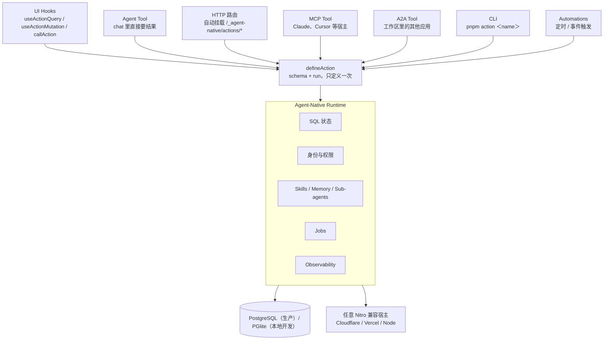

## 本文导读

读完本文你将能够：

- 说清 `defineAction` 为什么能让一个动作同时被 UI、Agent、HTTP、MCP（Model Context Protocol，模型上下文协议）、A2A（Agent-to-Agent）、CLI 六类入口调用，以及它在运行时怎么路由
- 区分 Rich chat / 内嵌 UI / 完整应用 / Automation-first 四档产品形态，并理解 6 月"三形态"说法到 9 月"表面谱系"的演变
- 判断自己的产品该不该引入 agent-native，从哪一步开始，代价是什么

适合读者：正在给现有 SaaS 加 Agent 入口的全栈工程师，评估"Agent + GUI 双形态"产品的技术选型者。文中 stars、命令、模板清单均核对至 2026-09-29 的仓库与文档。

## 一、先给判断

Agent 应用做到产品级，瓶颈通常不在模型，而在 **Agent 与 UI 各写一套调用层、状态互不相通**。传统做法里，浏览器走一层 API；Agent 想要同样的能力，就得再接一遍，两套代码各自维护，状态还容易打架。

agent-native 的回答是把两件事压成一份：

1. **一个动作层**：能力用 `defineAction` 定义一次，UI、Agent、HTTP、MCP、A2A、CLI 全部从这里调用。当前 README 里这句话值得原文引用："The agent does not click through the UI. It works through the same action layer as the UI."（Agent 不去点 UI，它和 UI 走同一个动作层。）
2. **一份状态**：前后端落在同一个 SQL 数据库上，Agent 改了数据 UI 立刻可见，反过来也一样。

关注度可以给一个可核实的信号：仓库 2026 年 3 月 12 日创建，到 2026 年 9 月 29 日拿到 6,890 stars、621 forks（GitHub API）。半年从一个新仓库涨到这个量级，在框架类项目里不算慢。更值得注意的是它的口径在半年里快速收敛：README 重写多轮，产品形态的说法从三档变成一条谱系，存储支持从"任意 SQL"收窄到 PostgreSQL——这个项目还在快速长，下文会标明关键口径是几月定下的。

## 二、系统地图



看懂这张图，就抓住了框架的主张：七个入口进、一个动作出。所有调用方走同一条路径，协议适配、权限、状态同步都收在框架自己身上。

## 三、核心机制

### 1. `defineAction`：契约写一次，入口框架搭

当前 README 的完整示例，原样照录：

```ts
import { defineAction } from "@agent-native/core/action";
import { z } from "zod";

// One action powers every app surface: UI, agent, HTTP, MCP, A2A, and CLI.
export default defineAction({
  description: "Return a friendly greeting.",
  schema: z.object({
    name: z.string().default("world").describe("Name to greet"),
  }),
  http: { method: "GET" },
  run: async ({ name }) => {
    return { message: `Hello, ${name}!` };
  },
});
```

开发者只写 schema 和 `run`。框架对这十几行代码做的事，文档《Actions Overview》逐条列了六种挂载：

| 调用面 | 谁在调 | 框架做的事 |
| --- | --- | --- |
| Agent Tool | chat 里的 agent | 读 description 和 schema，注册成可调用工具 |
| UI Hooks | React 组件 | `useActionQuery()` / `useActionMutation()` / `callAction()` |
| HTTP | 任意外部客户端 | 启动时自动挂到 `/_agent-native/actions/<name>` |
| MCP Tool | Claude、Cursor 等 MCP 宿主 | 注册为 MCP 工具 |
| A2A Tool | 工作区里的其他应用 | 跨应用发现与调用 |
| CLI | 终端脚本 | `pnpm action <name>` |

React 侧调用同一个动作，README 给的写法是 `useActionQuery("hello", { name: "Alex" })`。点击按钮和发一句 chat，跑的是同一段 `run`，权限校验和实现也只有一份。这是它和传统 server action 的本质差异：server action 绑定单一调用方，`defineAction` 绑定的是契约本身。

六个入口之外，Automations 还能让同一个动作按定时或事件触发（README 的 Included 清单单列一项），构成第七类非交互入口。

### 2. 产品形态：从三档到一条谱系

6 月的 README 把"Agent 的 UI 包装程度"切成三档——Headless、Rich chat、Whole app。到 9 月，文档站把它重画成一条**表面谱系**（surface spectrum），按交互浓度从高到低排，底下的动作和 SQL 状态完全共享：

| 形态 | 什么时候用 | 起步方式 |
| --- | --- | --- |
| Rich chat | 用户和 agent 对话、看工具调用、留线程历史 | Chat 模板、`<AgentChatSurface>` |
| 内嵌 UI | 动作结果要渲染成表格、图表、审批卡 | Native Chat UI、`chatUI.renderer` |
| 完整应用 | 需要持久对象、导航、多人协作 | 模板 + actions + SQL state + context awareness |
| Automation-first | 任务、脚本、外部 agent 直接调用，无浏览器 | `create --headless`、HTTP / CLI / MCP / A2A |

谱系上还有两个混合位：给已有产品外挂一个 agent（Embedded sidecar，`createAgentNativeEmbeddedPlugin()`），以及用自己的 agent 配 agent-native 的聊天壳（`AgentChatRuntime` 加 `<AssistantChat runtime={runtime}>`）。

这段演进对选型的含义值得单独说：**形态不是三个或四个产品，是同一个动作层外面套多少 UI**。从 headless 起步验证业务流，随后加聊天壳、加内嵌卡片，动作定义一行不用改。

### 3. 协议随框架走

6 月 README 有一个明确的定位句："Protocols come with the framework instead of becoming separate integrations per feature."（协议跟框架一起到货，而不是每个 feature 各接一遍。）当时列出的清单：A2A、MCP、MCP Apps、标准远程 MCP OAuth、MCP 客户端、HTTP/CLI 动作调用、原生 chat widget、`AgentChatRuntime` 适配器、标准 OpenAI、AG-UI、Claude Agent SDK、Vercel AI SDK 聊天运行时连接器、deep link——全部挂在同一个动作面上。

对照 9 月的文档站，这份清单没有缩水，还在加：集成目录里新增了 Dispatch Portal、WebMCP（浏览器工具）、外部 Agent 目录、跨应用 SSO 等条目；AG-UI、`AgentChatRuntime`、deep link 在最新的 Agent Surfaces 文档里都还在。

收益是实打实的：MCP 规范更新或 A2A 加能力时，升级一个依赖，所有动作同步拿到新协议版本，不用把"先做 chat、再补 MCP、再补 A2A"的老路走一遍。代价也要说清：协议实现的深度由框架替你判断，底层 client 不留给团队随意替换。

### 4. 协作与状态层

三件事撑起"人和 agent 同屏工作"：

- **CRDT（无冲突复制数据类型）合并 + live presence**：人和 Agent 同时编辑同一份文档，光标、选区、"谁在看哪一页"实时同步。agent 在这里是一等编辑者，不是隔着 API 的旁观者。
- **Per-user workspace**：每个用户一份 SQL 后端的 Skills、Memory、Instructions、Sub-agents、MCP Servers 配置。README 的原话是"Claude-Code-level flexibility, SaaS-grade economics"。
- **Dispatch 共享集成**：在 Dispatch 里接入一次 provider，密钥进 vault，再把凭证引用授权给 Mail、Analytics 等应用共用，避免每个 agent 重复走一遍 OAuth。

## 四、模板与起步

模板是这个项目最"重"的资产。CLI 模板注册表（`templates-meta.ts`）现在有 16 个官方模板——Calendar、Mail、Forms、Analytics、Slides、Clips、Design、CRM、Tasks 等，README 首页挑了 9 个作为开源应用展示。每个都是完整可 clone 的 SaaS，不是半成品 demo。

当前 README 的快速开始：

```bash
npx --yes @agent-native/core@latest create my-agent --standalone --template chat
```

三种起手式对应三种意图：

- **工作区（默认）**：CLI 一次让你多选几个模板，装进同一个 monorepo，共享登录态；后续加应用走 `add-app` 子命令。一条 `deploy` 能把所有应用挂到同一域名下——同源部署换来共享登录会话和零配置的跨应用 A2A，在日历的 agent chat 里 @mail 就能直接派活。
- **单应用**：加 `--standalone`，跳过 monorepo。
- **无界面**：`agent-native create my-app --headless`，纯动作加 agent，不带 UI 壳（headless 只支持 standalone，这是 CLI 源码里写死的约束）。

还不想 scaffold 整个应用，可以先把技能装进 Claude Code、Codex、Cursor 里试试水：

```bash
npx @agent-native/core@latest skills add visual-plan
```

装完得到 `/visual-plan` 和 `/visual-recap` 两个 slash command（同一技能包里还附带 visualize-repo）：`/visual-plan` 在写代码前生成可批注的可视化规划——架构图、UI 线框、文件级实现地图；`/visual-recap` 在改动合入后把 PR 或 diff 变成高层复盘——schema、API、文件 before/after，带分享链接。计划、实现、复盘三段都挪到了可视化层，coding agent 动手前的盲区肉眼可见地变少。

## 五、一个任务流过系统

用日历应用的"创建会议"把框架走一遍。沿用第三节的 import，`db` 和 `events` 取自模板生成的 Drizzle schema：

```ts
export default defineAction({
  description: "Create a calendar event with attendees.",
  schema: z.object({
    title: z.string(),
    startTime: z.string(),
    attendees: z.array(z.string()),
  }),
  run: async ({ title, startTime, attendees }) => {
    return db.insert(events).values({ title, startTime, attendees });
  },
});
```

同一个动作，三种走法：

1. **用户点 UI**：组件里 `useActionMutation("create-event")`，点击和聊天跑同一个 `run`，新事件经 CRDT 同步到所有在线用户的日历。
2. **用户对 agent 说**："帮我约明天下午三点的团队会。"agent 读 schema 认出工具，填参调用，`run` 写库，UI 实时刷新——没有第二套"agent 专用 API"。
3. **外部系统调 MCP**：一封会议邀请到了支持 MCP 的邮件客户端，它直接调用这个应用暴露的 MCP 工具，写库，日历页同步更新。

三次调用，一份契约、一份实现、一份状态。"agent-native"这个词说的就是这件事。

## 六、选型边界

**适合**：

- 产品天然是"人和 agent 同时操作同一份数据"的形态：CRM、日历、邮件、文档、分析台
- 已有 SaaS 想加 Agent 入口，又不想为 agent 另写一套接口和状态同步
- 需要一次暴露多协议（MCP + A2A + HTTP）的中后台

**别急着上**：

- 单页 LLM chatbot——Dify 或 Vercel AI SDK 更轻
- 离线单机工具，没有实时协作诉求
- 团队要对前端和存储层有完全控制权：agent-native 绑 React、Zod、Nitro（Unjs 生态的服务器引擎）宿主，存储层 9 月起进一步收窄为 PostgreSQL（生产）/ PGlite（本地开发）——6 月时还是"任意 Drizzle（TypeScript ORM）支持的 SQL 数据库"，这个收紧对想用 MySQL 或 SQLite 的团队是硬约束

**两个需要盯住的点**：

- **让 agent 改应用，必须配审计与审批**。6 月 README 把"Apps that improve themselves"（应用自我改进）当卖点，9 月改版后口径转向 agent-first，但"agent 修改自家应用"的能力方向没变。上生产前，审计日志（文档有专门章节）和审批流要先行。
- **协议深度以文档为准**。适配清单覆盖面广，但每种协议实现到什么程度，用前对照 agent-native.com/docs 的对应页面验证，别只看 README。

## 七、几个常见的坑

1. **把 PGlite 带进生产**。PGlite（WASM 化的嵌入式 Postgres）定位是本地开发，生产请换 PostgreSQL。文档给了 Neon、Supabase、RDS、Cloud SQL、Azure 一串 provider 清单，迁移本身不难，难的是中途换。
2. **以为仓库页没许可证标识就是没许可证**。根目录确实还没有 LICENSE 文件，GitHub 因此不显示许可证标识，但 README 的 License 一节明确写着 MIT。合规上无碍，介意文件缺失的话向 Builder.io 确认一声即可。
3. **动作堆多了不监控**。动作层是所有入口的必经之路，它慢了处处慢。执行耗时、并发、错误率至少要有基线——Observability 随框架自带，别闲置。
4. **把形态当四个项目重写**。形态只是同一动作层外的 UI 壳，从 Rich chat 换成完整应用不需要推翻动作定义；真正推翻成本高的，是存储层和前端框架绑定。

## 八、采用顺序

确定要试，按这个顺序推进，每步验证后再走下一步：

1. **先装 skills 试水**：`skills add visual-plan` 成本最低，一天内足以判断这个团队的工程品味值不值得跟。
2. **headless 起步验证业务流**：`create --headless` 起一个纯动作应用，把最核心的三五个能力写成 action，从 CLI 和 HTTP 调通。
3. **加聊天壳**：套 Chat 模板或 `<AgentChatSurface>`，验证 agent 真实使用动作的体验，把 description 和 schema 打磨到"agent 一读就懂"。
4. **再谈完整应用**：从 16 个模板里挑最接近业务的 clone 下来改，重点评估存储层落到 PostgreSQL 的成本。
5. **生产前补治理**：审计日志、审批流、Observability 基线，外加许可证与协议深度的最终确认。

一句话收尾：agent-native 赌的不是"模型更强了"，而是"Agent 应用需要自己的操作系统层"——动作、状态、身份、协议都在这一层解决。如果你的产品里人和 agent 本来就该操作同一份数据，它把工程量压到了模板级别；如果只是给内部工具加个聊天框，它比你要的重得多。
