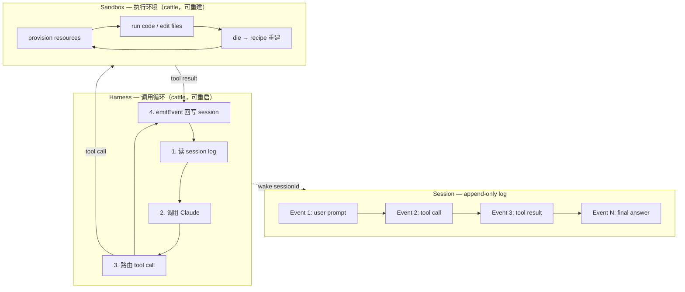

## 一句话判断

**Anthropic 正在把 agent 当作新型操作系统来设计。** 7-11 上线的 30 分钟 keynote "Building the future of agentic infrastructure" 不只是产品宣传，它配套发了 [Scaling Managed Agents](https://www.anthropic.com/engineering/managed-agents)（2026-04-08）这篇工程博客，里面把 session / harness / sandbox 拆成了三个独立可替换的抽象层——这套路和 60 年前操作系统用 `process` / `file` 抽象来虚拟化硬件是一样的。

视频里 9 段章节标题读完一遍，最大的信号不是"我们要做 agent"，而是"我们要重新定义 agent 跟人、跟企业系统、跟其他 agent 之间的契约"。

## 系统地图：session / harness / sandbox 三层抽象

**这张图的几个关键约束**：

- **Session 在 harness 之外**：harness 挂了不需要抢救 session，重启新 harness 调 `wake(sessionId)` 即可
- **Sandbox 在 harness 之外**：sandbox 死了 harness 不需要抢救，harness 把 failure 当 tool-call error 传回 Claude，Claude 决定重试
- **Token + 凭证不在 sandbox 里**：credential 跟 sandbox 物理隔离，prompt injection 即使拿到 sandbox token 也接触不到 customer data

下面把视频 9 段章节一张总览表先列出来，再拆三个核心论点。

## 视频 9 段章节 + 配套工程文档

| # | 时间 | 章节标题 | 对应已有/未发的工程内容 |
|---|---|---|---|
| 1 | 0:00 | Intro | — |
| 2 | 1:00 | Building Claude Managed Agents in production | [Scaling Managed Agents](https://www.anthropic.com/engineering/managed-agents)（2026-04-08）"Decoupling the brain from the hands" |
| 3 | 2:15 | How agents talk to each other | [How we built our multi-agent research system](https://www.anthropic.com/engineering/multi-agent-research-system)（2025-06-13）orchestrator-worker pattern |
| 4 | 3:00 | The future of agentic infrastructure: **thinner harnesses and adversarial agent pairs** | [Effective harnesses for long-running agents](https://www.anthropic.com/engineering/effective-harnesses-for-long-running-agents)（2025-11-26）+ 视频核心新论点 |
| 5 | 8:20 | Barriers to agentic adoption: **security, compliance, evals** | [Beyond permission prompts](https://www.anthropic.com/engineering/claude-code-sandboxing)（2025-10-20）+ [Demystifying evals for AI agents](https://www.anthropic.com/engineering/demystifying-evals-for-ai-agents)（2026-01-09） |
| 6 | 9:15 | How to measure agent ROI | 视频新论点（参考 managed-agents 文中 ROI 段落） |
| 7 | 12:45 | Failure modes: **hyper independence and sprawl** | multi-agent-research-system 文中"spawn 50 subagents for simple queries"即 sprawl 案例 |
| 8 | 13:30 | The future: agents as an **invisible substrate** | managed-agents 文中"abstractions that outlast the implementations" |
| 9 | 15:15 | What's next for the Claude Platform | — |

**章节标题不是讲什么功能，是讲一个具体的工程主张**。比如第 4 段同时出现 "thinner harnesses" 和 "adversarial agent pairs"——这是两个完全不同的方向，下面拆开讲。

## 三件事，Anthropic 在 30 分钟里反复推

### 1. Agent 已经从工具变成基础设施

视频开场第一句（来自 description）：

> Agents are moving from tools you prompt to infrastructure that runs your business.

这句话是 Anthropic 一年前就开始铺的论点。2024-12 那篇 [Building effective agents](https://www.anthropic.com/engineering/building-effective-agents) 已经区分了 workflows（LLM + tools + predefined code paths）vs agents（LLM 自主决策 + 自主调用工具）。这次视频往前再走一步：不是问"要不要用 agent"，而是问"agent 该怎么部署、怎么管、怎么让它合规、怎么让它活下去"。

**这背后是一个市场判断**：当 Claude Opus 4 / Sonnet 4 能稳定完成企业里中等到复杂的任务时，瓶颈不再是模型能力，而是把模型接进企业 IT 系统的那层基础设施。

### 2. 把 agent 拆成三个抽象层

[Managed Agents 工程博客](https://www.anthropic.com/engineering/managed-agents) 把整套 agent 系统拆成：

- **Session**——append-only log，记录 agent 经历过的每一个事件
- **Harness**——一个循环，调用 Claude + 路由 tool calls
- **Sandbox**——执行环境，Claude 在里面跑代码、改文件

为什么要拆？

直接原因是他们 2025 年踩了一个坑：把 session / harness / sandbox 全部塞进**同一个 container**——session 是 append-only log + harness 是调用循环 + sandbox 是执行环境，三者共享一个 Linux 容器。看起来简洁，但踩了两个工程老坑：

**坑 1：容器成了 pet，不能死**。
容器宕了 = session 丢失，工程师要 ssh 进容器调试，而容器里又常常带着用户数据——这意味着他们实际上**没有 debug 能力**。WebSocket 事件流是唯一窗口，但流不分层，harness bug、网络丢包、容器离线三个故障看起来一样。

**坑 2：客户想把 Claude 接进自己的 VPC**。
因为 harness 假设 Claude 工作内容也在同一个容器里，所以要么客户把他们的网络和 Anthropic 对等，要么把 harness 跑在客户自己的环境里——这两种方案都不友好。

**他们做的修复是 OS 学派**：

> "Managed Agents follow the same pattern. We virtualized the components of an agent: a session (the append-only log of everything that happened), a harness (the loop that calls Claude and routes Claude's tool calls to the relevant infrastructure), and a sandbox (an execution environment where Claude can run code and edit files). This allows the implementation of each to be swapped without disturbing the others."

Session 写到 harness 外面 → harness 挂了，重启新 harness，调 `wake(sessionId)` 拿回 event log，从上一个 event 继续。Sandbox 死了 → harness 把 failure 当 tool-call error 传回 Claude → Claude 自己决定重试 → 启新 sandbox + `provision({resources})` 标准配方。

容器从 pet 变成 cattle。

### 3. 用 harness 抽象保护"模型在变聪明"这件事实

Managed Agents 博客里有一段很值得摘：

> A common thread across this work is that harnesses encode assumptions about what Claude can't do on its own. However, those assumptions need to be frequently questioned because they can go stale as models improve.

具体例子：他们发现 Claude Sonnet 4.5 在接近 context 上限时**会主动收尾**——业内叫"context anxiety"。他们在 harness 里加了 context reset 来缓解。结果当模型换成 Claude Opus 4.5 时，这个行为消失了——context reset 成了 dead weight。

**这就是视频第 4 段 "thinner harnesses" 的来由**。

Anthropic 的判断是：未来 12-24 个月，模型能力会继续快速提升，但每个团队都在 harness 里写满了"模型做不到这个"的兜底逻辑。当模型突然能做到时，这些代码不仅没用，反而成了负担。

**结论是 harness 要往薄了做，把假设尽量推到 session/sandbox 这两个更稳定的抽象层**。

至于"adversarial agent pairs"——视频没展开讲细节，但配套博客 [Demystifying evals for AI agents](https://www.anthropic.com/engineering/demystifying-evals-for-ai-agents) 提了一个相关模式：让一个 agent 写代码，另一个 agent 攻击它，看哪个先写出不能被攻击的代码。这与传统的"static test suite"完全不同。

## 三个被反复强调的失败模式

视频第 7 段讲了两个 failure modes，把它们拆开看：

### Hyper independence（过度独立）

Multi-agent 系统里的 subagent 越独立越好——这是 multi-agent research system 那篇博客反复强调的。独立 = 独立 context window + 独立 prompt + 独立探索路径。

但独立过头就是 hyper independence：subagent 不再回报主 agent，自己跑去完成整个任务。

### Sprawl（蔓延）

multi-agent-research-system 博客里的真实案例：

> "Early agents made errors like spawning 50 subagents for simple queries, scouring the web endlessly for nonexistent sources, and distracting each other with excessive updates."

[Anthropic 内部数据](https://www.anthropic.com/engineering/multi-agent-research-system)：multi-agent 系统 token 用量是单 agent chat 的 15 倍。如果一个"查今天天气"的简单任务起了 50 个 subagent，token 直接爆炸。

**Anthropic 给的校准 prompt** 是：

> "Simple fact-finding requires just 1 agent with 3-10 tool calls, direct comparisons might need 2-4 subagents with 10-15 calls each, and complex research might use more than 10 subagents with clearly divided responsibilities."

把 effort 预算**显式**写进 prompt，而不是让 agent 自己猜。

## 任务流案例：一次 multi-agent research 如何流过 Managed Agents

用一个具体例子把上面的抽象串起来。假设用户问："找出 S&P 500 IT 板块所有公司的董事会成员"。

**单 agent 路径**（[Anthropic 内部评测](https://www.anthropic.com/engineering/multi-agent-research-system) 报告失败）：
1. Lead agent 在一个 context window 里顺序搜索每个公司
2. 每查一个公司就要更新同一个 context
3. 100 个公司查下来 context 早已超限，结果被截断

**Multi-agent 路径**（同一评测，性能提升 90.2%）：
1. Lead agent（Claude Opus 4）把查询拆成 100 个子任务
2. 每个 subagent（Claude Sonnet 4）分配到一个公司 + 一个明确的 output format
3. Subagents 并行搜索——BrowseComp 评测里 3-5 subagent 并行 + 各自 3+ tool 并行，速度提升 90%
4. 每个 subagent 把结果写到 session log，独立 context
5. Lead agent 汇总，写到 CitationAgent 处理引用位置
6. 整个 session 是 append-only log → harness 挂了可以从最后 event 继续

**这里 session / harness / sandbox 三层抽象的价值就出来了**：

- 100 个 subagent 同时跑 = 100 个 sandbox（cattle，死了就重建）
- 每个 subagent 都有独立 context = 它们的"记忆"在 session log 里
- Lead agent 偶尔重启 = harness 切换不影响 session

**这套架构经济上的不便宜**：multi-agent 是 chat 的 15 倍 token。Anthropic 自己承认"for economic viability, multi-agent systems require tasks where the value of the task is high enough to pay for the increased performance"。

## 三个不能从这些信号里直接推出的结论

看完视频 + 5 篇工程博客后，有三件事容易被误读，提前澄清：

**1. 不要直接推出"agent 是新的应用程序框架"。**
Managed Agents 是 hosted service（Anthropic 帮你跑），不是 SDK。如果你想自己搭一套，先看 [Claude Agent SDK](https://www.anthropic.com/engineering/building-effective-agents) 那篇——结论是：自己搭可以用 SDK，但想用 Managed Agents 这层抽象，必须用 hosted service。

**2. 不要直接推出"harness 越薄越好"。**
薄 harness 是目标，但当下的现实是：模型还有很多做不到的事，每个团队都需要一个厚厚的 harness 来兜底。"thinner harnesses" 是 [未来方向](https://www.anthropic.com/engineering/effective-harnesses-for-long-running-agents) 不是当下建议。

**3. 不要直接推出"Anthropic 在抢 OpenAI 的客户"。**
视频和博客针对的是 enterprise IT——他们要让 CTO 觉得"agent 是基础设施而不是 toy"。OpenAI 的策略重心在 consumer（ChatGPT）和 developer API，跟 Anthropic 在 enterprise 这一层并不直接重叠。

## benchmark 段：BrowseComp 是怎么算出来的

[Anthropic multi-agent research 博客](https://www.anthropic.com/engineering/multi-agent-research-system) 报告了一个值得拆开看的数字：

> "A multi-agent system with Claude Opus 4 as the lead agent and Claude Sonnet 4 subagents outperformed single-agent Claude Opus 4 by 90.2% on our internal research eval."

下面三个问题不解释清楚，90.2% 这个数字容易被滥用。

**1. 这个 benchmark 主要在测什么。**
BrowseComp 全名 [BrowseComp](https://openai.com/index/browsecomp/)——OpenAI 2025 年发布，专门测 browsing agent 找难找信息的能力。Anthropic 的 internal research eval 在这个基础上做了扩展，包括 S&P 500 IT 板块董事查找这类 breadth-first 任务。**关键特征**：测试的不是模型"会不会"，而是"会不会自己去找"——agent 必须自主规划搜索路径、自主选择工具、自主纠正错误。

**2. 数字变化更可能反映系统的哪一部分。**
Anthropic 自述性能方差的 95% 由三个因素解释：

- **Token 用量本身**：解释 80% 的方差
- **工具调用次数**：另外几个百分点
- **模型选择**：剩下一部分

这意味着 90.2% 这个数字的真正来源不是"multi-agent 系统本身更聪明"，而是"multi-agent 系统用更多 token 思考了"。换句话说：**当任务复杂度超过单 agent context window，multi-agent 通过并行 context windows 把 token 预算分摊**。

[博客原话](https://www.anthropic.com/engineering/multi-agent-research-system)："The latest Claude models act as large efficiency multipliers on token use, as upgrading to Claude Sonnet 4 is a larger performance gain than doubling the token budget on Claude Sonnet 3.7."

**3. 从这些数字里不能直接推出什么。**

- 不能推出 "multi-agent 总是更好"——multi-agent 是 chat 的 15 倍 token，简单任务不划算
- 不能推出 "90.2% 提升能迁移到你的任务"——你的任务可能不是 breadth-first
- 不能推出 "Claude Opus 4 是必须的"——Anthropic 同时承认 Sonnet 4 作为 subagent 性能足够，Opus 4 作为 lead agent 是为了规划质量

**对比基线**：single-agent Claude Opus 4 = 100%，multi-agent Opus 4 lead + Sonnet 4 subagents = 190.2%。但**经济基线**：multi-agent = chat × 15 token。

所以一个 CFO 会问的问题不是"multi-agent 能不能打 90% 更好"，而是"这 90% 性能提升值不值 15 倍 token"。Anthropic 自己的建议是"for tasks where the value of the task is high enough to pay for the increased performance"——他们没说具体阈值是多少。

## 谁该用 Managed Agents，谁可以等等

**该用**：

- 团队已经在用 Claude API 做长时任务（multi-hour 或 multi-day agent）
- 有合规需求（医疗、金融、法律），需要"agent 做了什么"的完整审计
- VPC / on-prem 部署要求（Managed Agents 支持 hybrid sandbox）

**等等**：

- 只是写一个 30 分钟的 demo 或 hackathon——SDK 足够
- agent 还是 single-task、short-lived——[Claude Code](https://www.anthropic.com/engineering/claude-code-best-practices) 直接用
- 模型在你的任务上还在疯狂 hallucination——加 harness 没用，先等模型稳定

**今天就要做决策的话，按这个顺序问 5 个问题**：

1. **任务时长**：超过 4 小时 → 考虑 Managed Agents；30 分钟以内 → 跳过
2. **任务复杂度**：需要 50+ tool calls → 考虑 multi-agent；20 以内 → single-agent
3. **审计要求**：医疗/金融/法律需要每一步留痕 → 必须 Managed Agents（session log）
4. **VPC 部署**：客户数据不出本地 → Managed Agents  hybrid sandbox
5. **当前成本**：单 agent token × 1.5x 预算 → 评估 multi-agent 15x 是否可接受

5 题里命中 ≥3 题，该上 Managed Agents。命中 1-2 题，先用 Claude Agent SDK 试水。

## 系统层判断

Anthropic 在做的不是"卖 agent API"，是**卖 agent 时代的 OS 抽象**。

60 年前操作系统把硬件抽象成 `process` / `file`——`read()` 函数不关心是 1970 年的磁盘包还是 2024 年的 SSD。Anthropic 想做的是：把"agent"也变成 OS 抽象，**接口稳定，实现可换**。

当 Claude Opus 5 出来时，harness 可以改、sandbox 可以换、subagent 的 prompt 可以更新——但 session 的接口不动，企业已经积累的 agent 工作流不被破坏。

这是 OpenAI、Anthropic、Google 三家在 agent 领域里真正的差异：
- OpenAI 押 consumer / dev tooling
- Google 押现有 Workspace / Cloud 生态
- **Anthropic 押 enterprise agent OS**

视频和 Managed Agents 工程博客是这盘棋的第二步——第一步是 [MCP（Model Context Protocol）](https://modelcontextprotocol.io/introduction)，把"agent 怎么调外部工具"标准化。Managed Agents 是第二步，把"agent 自己怎么跑、挂了怎么办、怎么审计"标准化。

如果 Managed Agents 跑通，下一步很可能是"agent marketplace"或"agent observability platform"——Anthropic 会变成企业里 agent 的运行平台，类似 AWS 在云时代的角色。

而对企业 IT 决策者来说，最值得提前想清楚的不是"用不用 Claude"，而是"agent 跑在 Anthropic 上还是 OpenAI 上"——这个选择比模型本身影响更大，因为它的迁移成本会像数据库迁移一样高。

---

**信息源**：
- 视频：[Building the future of agentic infrastructure](https://www.youtube.com/watch?v=ksfm6jeTg3Q)（Anthropic 官方频道，2026-07-11 发布，Jess Yann / Katelyn Lesse / Angela Jiang 共同讲解）
- 配套工程文档：
  - [Scaling Managed Agents: Decoupling the brain from the hands](https://www.anthropic.com/engineering/managed-agents)（2026-04-08）
  - [How we built our multi-agent research system](https://www.anthropic.com/engineering/multi-agent-research-system)（2025-06-13）
  - [Building effective agents](https://www.anthropic.com/engineering/building-effective-agents)（2024-12-19）
  - [Effective harnesses for long-running agents](https://www.anthropic.com/engineering/effective-harnesses-for-long-running-agents)（2025-11-26）
  - [Demystifying evals for AI agents](https://www.anthropic.com/engineering/demystifying-evals-for-ai-agents)（2026-01-09）
  - [Beyond permission prompts: making Claude Code more secure and autonomous](https://www.anthropic.com/engineering/claude-code-sandboxing)（2025-10-20）