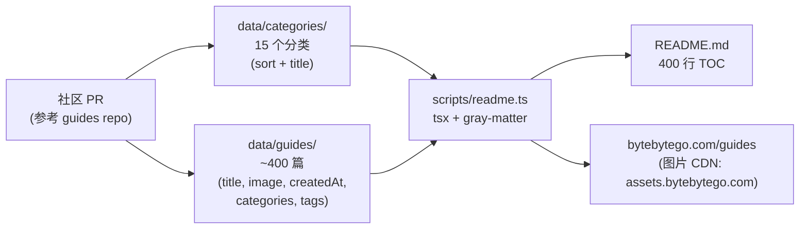
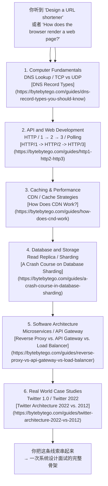

# ByteByteGo system-design-101 资源地图

`ByteByteGoHq/system-design-101` 不是一份代码仓库,而是一份自动生成的「系统设计图解清单」——截至 2026-06-28,84.1k stars、9.3k forks,自 2023-09-18 创建以来只经历了 100 多次提交,README 主体就是 15 个分类下的约 400 个图解链接,每一篇都跳到 [bytebytego.com/guides](https://bytebytego.com/guides) 的付费内容。仓库本身只承担索引和元数据维护,**真正的内容在仓库外**,理解这一点就理解了这个项目的边界。

本文围绕这条主线展开:**这个 repo 是一张「系统设计知识图谱」,价值在于「知道这一类问题在哪些主题下、该按什么顺序读」,而不是「看一份代码学到一种实现」**。

## 一句话定位

- **仓库**：[ByteByteGoHq/system-design-101](https://github.com/ByteByteGoHq/system-design-101)
- **官方描述**：Explain complex systems using visuals and simple terms. Help you prepare for system design interviews.
- **Stars / Forks**：84,118 / 9,326(截至 2026-06-28)
- **License**：CC BY-NC-ND 4.0（允许转载、不得修改、不得商用）
- **主要语言**：`null`（GitHub 语言统计为空——仓库 99% 是 Markdown 与图片链接）
- **首页**：[bytebytego.com/guides](https://bytebytego.com/guides)
- **最近更新**：`pushed_at = 2025-04-04`(最后一次 commit `b28380a` 加了 contributors workflow),元数据维度 `updated_at = 2026-06-28`(外部数据刷新)
- **Topics**：aws、cloud-computing、coding-interviews、computer-science、interview-questions、software-architecture、software-development、software-engineering、system-design、system-design-interview

## 仓库结构:数据驱动的清单生成器

整个仓库只有几样东西：`data/categories/*.md`（15 个分类元数据）+ `data/guides/*.md`（约 400 篇 guide 的 frontmatter）+ `scripts/readme.ts`（把上面两份数据拼成 README 的 TOC）+ `.github/`（贡献指南和工作流）。源码不到 100 行，README 是脚本生成的，不是手维护的。

读这张图的三条主线：

- **数据与生成分离**——`data/` 目录是「单一数据源」，`scripts/readme.ts` 用 `gray-matter` 解析每个 `.md` 的 frontmatter，再按 `sort` 字段排序生成最终 TOC。要新增一篇 guide，只需要在 `data/guides/` 加一个 markdown 文件，README 自动更新。
- **图片托管在 CDN**——`data/guides/*.md` 的 `image` 字段指向 `https://assets.bytebytego.com/diagrams/0xxx-name.jpg`，仓库本身不存图片，仓库体积始终在 50 MB 以内（GitHub API 显示 `size: 46759` KB）。
- **贡献走 PR，不走仓库主分支直接提交**——`.github/` 下的工作流和 `CONTRIBUTING.md` 引导贡献者把新图解发到上游的 bytebytego 私有仓库，再回流到这里的 `data/`。

## 15 个主题分类

README TOC 的顶层 `*` 一级项就是 15 个分类，按 `sort` 字段排序。挑出 8 个跨方向读者最常用的：

| # | 分类 | 典型问题 | 候选阅读起点 |
|---|---|---|---|
| 1 | API and Web Development | REST vs GraphQL、gRPC、API Gateway | [The Ultimate API Learning Roadmap](https://bytebytego.com/guides/the-ultimate-api-learning-roadmap) |
| 2 | Real World Case Studies | Netflix / Uber / Twitter / Airbnb 架构 | [Netflix's Overall Architecture](https://bytebytego.com/guides/netflixs-overall-architecture) |
| 3 | Database and Storage | Sharding、CAP、B-Tree vs LSM-Tree | [A Crash Course on Database Sharding](https://bytebytego.com/guides/a-crash-course-in-database-sharding) |
| 4 | Caching & Performance | Redis、CDN、缓存策略 | [The Ultimate Redis 101](https://bytebytego.com/guides/the-ultimate-redis-101) |
| 5 | Cloud & Distributed Systems | AWS、可扩展性、12-Factor | [System Design Cheat Sheet](https://bytebytego.com/guides/system-design-cheat-sheet) |
| 6 | Software Architecture | 微服务、DDD、设计模式 | [The Ultimate Software Architect Knowledge Map](https://bytebytego.com/guides/the-ultimate-software-architect-knowledge-map) |
| 7 | Security | HTTPS、JWT、OAuth、密码存储 | [Cybersecurity 101](https://bytebytego.com/guides/cybersecurity-101-in-one-picture) |
| 8 | DevOps and CI/CD | Docker、K8s、CI/CD | [What is Kubernetes (k8s)?](https://bytebytego.com/guides/what-is-k8s-kubernetes) |

完整 15 个分类（按 README 排序）：API and Web Development、Real World Case Studies、AI and Machine Learning、Database and Storage、Technical Interviews、Caching & Performance、Payment and Fintech、Software Architecture、DevTools & Productivity、Software Development、Cloud & Distributed Systems、How it Works?、DevOps and CI/CD、Security、Computer Fundamentals。

## 一次「任务流」:从 `URL → 渲染完成`

把仓库的价值放进一个具体场景看更清楚——这是面试常考的「输入 URL 后浏览器发生了什么」：

这条 6 跳路径里，每一跳都对应仓库里的一个分类、对应 5–10 篇图解。**仓库本身没有给出这条路径**——它只是把所有可能的路径铺开，让读者自己挑。这就是「资源地图」和「教程」的边界：仓库告诉你有哪些路口，不替你选路。

## 与同类资源的对比

| 资源 | 内容深度 | 更新频率 | 与 ByteByteGo 的关系 |
|---|---|---|---|
| [donnemartin/system-design-primer](https://github.com/donnemartin/system-design-primer) | 中文翻译版广为流传，原版含较多文字总结和示例代码 | 偶发 PR，节奏慢 | 同属「系统设计面试」主题，但偏向文字 + 代码示例，ByteByteGo 偏向图解 |
| ByteByteGo Books（[System Design Interview](https://bytebytego.com/books) 等 4 卷本） | 出版级深度，每章 15–30 页 | 1–2 年一次新版 | 仓库中的 Real World Case Studies、System Design Cheat Sheet 与书章节几乎一一对应 |
| ByteByteGo YouTube 频道 | 视频版图解，每周 1–2 期 | 持续更新 | README 中很多「Top N」「Comparison」类图解来自视频截图 |
| [awesome-system-design](https://github.com/awesome-system-design/awesome-system-design) 等 awesome 列表 | 链接合集，无结构化分类 | 半停滞 | 仓库本身就是一个 awesome list，但有 ByteByteGo 一家的内容血统 |

## 适用边界

- **适合**：准备系统设计面试、需要一份「主题地图」快速定位某个领域该读哪些图解、想把 ByteByteGo 系列的图解按主题组织成学习路径。
- **不适合**：想通过「读一个仓库学到分布式系统实现」——这不是它的定位。也没有代码示例、没有配置教程、没有命令行工具，所有内容都在 bytebytego.com 的付费区。
- **要警惕的边界**：仓库最后 push 是 2025-04-04，之后主要靠外部数据刷新（`updated_at` 仍会变）。把它当作「历史快照式资源地图」比「持续更新的教程」更准确。

## 怎么用这份资源地图

1. **先看 `Technical Interviews`** 这一类（只有 5 篇），里头有 [How to Ace System Design Interviews](https://bytebytego.com/guides/how-to-ace-system-design-interviews-like-a-boss) 和 [Recommended Materials for Technical Interviews](https://bytebytego.com/guides/my-recommended-materials-for-cracking-your-next-technical-interview)——这两篇相当于「总入口」。
2. **再按你薄弱的分类深入**——比如数据库弱就进 [Database and Storage](https://bytebytego.com/guides/database-and-storage) 一次刷完，从 [Types of Databases](https://bytebytego.com/guides/types-of-databases) 到 [8 Data Structures That Power Your Databases](https://bytebytego.com/guides/8-data-structures-that-power-your-databases) 串起来。
3. **最后用 [Real World Case Studies](https://bytebytego.com/guides/real-world-case-studies) 做交叉验证**——同一类问题在 Netflix / Uber / Pinterest / Figma 的真实架构里怎么落地，能补足纯图解容易缺的真实工程权衡。

仓库本身不强制这条顺序。但对一个想系统化补系统设计知识的人来说，先总入口、再单点深入、最后用真实案例串——是这张地图最自然的读法。