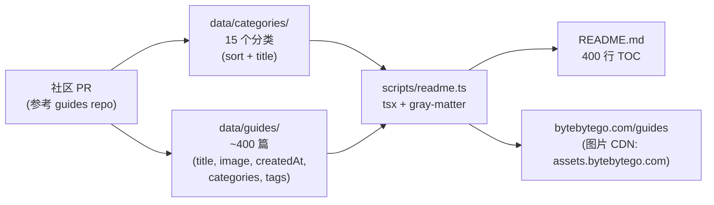
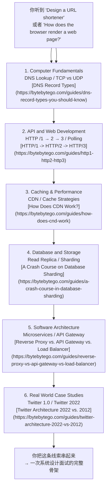

# ByteByteGo system-design-101 资源地图

[ByteByteGoHq/system-design-101](https://github.com/ByteByteGoHq/system-design-101) 不是一份教程，而是一张目录。它把 ByteByteGo 分布在官网上的数百篇系统设计图解，按主题整理成一份可检索的清单。截至 2026-06-28，仓库拥有 84.1k stars、9.3k forks，自 2023-09-18 创建以来经历了 100 多次提交。README 的主体是 15 个分类下约 400 个图解链接，每篇都跳到 [bytebytego.com/guides](https://bytebytego.com/guides)。真正的讲解内容在仓库之外，仓库只负责组织和索引。

读这份资源地图，价值不在仓库本身，而在于它回答了三个问题：系统设计有哪些主题、每个主题下有哪些图解、按什么顺序读。它是面试准备的主题地图，不是实现参考。

## 目录

1. [仓库结构：数据驱动的清单生成器](#仓库结构数据驱动的清单生成器)
2. [15 个主题分类](#15-个主题分类)
3. [一个具体场景：从 URL 到渲染完成](#一个具体场景从-url-到渲染完成)
4. [与同类资源的对比](#与同类资源的对比)
5. [怎么用这份资源地图](#怎么用这份资源地图)
6. [适用边界](#适用边界)
7. [常见问题](#常见问题)
8. [读完自测](#读完自测)

## 仓库结构：数据驱动的清单生成器

整个仓库只有几样东西：`data/categories/*.md`（15 个分类元数据）+ `data/guides/*.md`（约 400 篇 guide 的 frontmatter）+ `scripts/readme.ts`（拼装 README 的脚本）+ `.github/`（贡献指南和工作流）。源码不到 100 行，README 由脚本生成，不靠手动维护。

```mermaid
flowchart LR
    Cat["data/categories/<br/>15 个分类<br/>(sort + title)"] --> Gen[scripts/readme.ts<br/>tsx + gray-matter]
    Guides["data/guides/<br/>~400 篇<br/>(title, image, createdAt,<br/>categories, tags)"] --> Gen
    Gen --> README["README.md<br/>400 行 TOC"]
    Gen --> Site["bytebytego.com/guides<br/>(图片 CDN: assets.bytebytego.com)"]
    PR["社区 PR<br/>(参考 guides repo)"] --> Cat
    PR --> Guides
```

这张图对应三条设计主线，每条都回答一个"为什么"：

- **数据与生成分离**——`data/` 目录是单一数据源，`scripts/readme.ts` 用 `gray-matter` 解析每个 `.md` 的 frontmatter，按 `sort` 字段排序生成 TOC。新增一篇 guide 只需在 `data/guides/` 加一个 markdown 文件，README 自动更新。仓库维护者不需要手动编辑那 400 行的 README，改数据就行，目录不会和内容脱节。
- **图片托管在 CDN**——`data/guides/*.md` 的 `image` 字段指向 `https://assets.bytebytego.com/diagrams/0xxx-name.jpg`，仓库本身不存图片，体积保持在 50 MB 以内（GitHub API 显示 `size: 46759` KB）。图片跟着官网走，仓库更新内容时不需要改仓库里的二进制。
- **贡献走 PR**——`.github/` 下的工作流和 `CONTRIBUTING.md` 引导贡献者把新图解发到上游的 bytebytego 私有仓库，再回流到 `data/` 目录。索引的增补有流程约束，避免出现"内容在别处、这里各写各的"的漂移。

## 15 个主题分类

README TOC 的顶层 `*` 一级项就是 15 个分类，按 `sort` 字段排序。完整的 15 个分类是：API and Web Development、Real World Case Studies、AI and Machine Learning、Database and Storage、Technical Interviews、Caching & Performance、Payment and Fintech、Software Architecture、DevTools & Productivity、Software Development、Cloud & Distributed Systems、How it Works?、DevOps and CI/CD、Security、Computer Fundamentals。

其中 8 个跨方向最常用的分类，各自的典型问题与阅读起点如下：

| # | 分类 | 典型问题 | 候选阅读起点 |
|---|---|---|---|
| 1 | API and Web Development | REST vs GraphQL、gRPC、API Gateway | [The Ultimate API Learning Roadmap](https://bytebytego.com/guides/the-ultimate-api-learning-roadmap) |
| 2 | Real World Case Studies | Netflix / Uber / Twitter / Airbnb 架构 | [Netflix's Overall Architecture](https://bytebytego.com/guides/netflixs-overall-architecture) |
| 3 | Database and Storage | Sharding、CAP、B-Tree vs LSM-Tree | [A Crash Course on Database Sharding](https://bytebytego.com/guides/a-crash-course-in-database-sharding) |
| 4 | Caching & Performance | Redis、CDN、缓存策略 | [The Ultimate Redis 101](https://bytebytego.com/guides/the-ultimate-redis-101) |
| 5 | Cloud & Distributed Systems | AWS、可扩展性、12-Factor | [System Design Cheat Sheet](https://bytebytego.com/guides/system-design-cheat-sheet) |
| 6 | Software Architecture | 微服务、DDD、设计模式 | [The Ultimate Software Architect Knowledge Map](https://bytebytego.com/guides/the-ultimate-software-architect-knowledge-map) |
| 7 | Security | HTTPS、JWT、OAuth、密码存储 | [Cybersecurity 101](https://bytebytego.com/guides/cybersecurity-101-in-one-picture) |
| 8 | DevOps and CI/CD | Docker、K8s、CI/CD | [What is Kubernetes (k8s)?](https://bytebytego.com/guides/what-is-k8s-kubernetes) |

分类之间的颗粒度并不均匀：`Real World Case Studies` 和 `How it Works?` 偏"看懂真实系统"，`Database and Storage` 与 `Caching & Performance` 偏"面试必考基础"，`Technical Interviews` 只有 5 篇，更像入口而不是分类。读的时候按自己短板选分类，不必平均分配时间。

## 一个具体场景：从 URL 到渲染完成

用面试常考的「输入 URL 后浏览器发生了什么」来串仓库的各个分类：

```mermaid
flowchart TB
    Start["你听到 'Design a URL shortener'<br/>或者 'How does the browser render a web page?'"] --> Step1
    Step1["1. Computer Fundamentals<br/>DNS Lookup / TCP vs UDP<br/>[DNS Record Types](https://bytebytego.com/guides/dns-record-types-you-should-know)"]
    Step2["2. API and Web Development<br/>HTTP /1 → 2 → 3 / Polling<br/>[HTTP/1 -> HTTP/2 -> HTTP/3](https://bytebytego.com/guides/http1-http2-http3)"]
    Step3["3. Caching & Performance<br/>CDN / Cache Strategies<br/>[How Does CDN Work?](https://bytebytego.com/guides/how-does-cnd-work)"]
    Step4["4. Database and Storage<br/>Read Replica / Sharding<br/>[A Crash Course on Database Sharding](https://bytebytego.com/guides/a-crash-course-in-database-sharding)"]
    Step5["5. Software Architecture<br/>Microservices / API Gateway<br/>[Reverse Proxy vs. API Gateway vs. Load Balancer](https://bytebytego.com/guides/reverse-proxy-vs-api-gateway-vs-load-balancer)"]
    Step6["6. Real World Case Studies<br/>Twitter 1.0 / Twitter 2022<br/>[Twitter Architecture 2022 vs. 2012](https://bytebytego.com/guides/twitter-architecture-2022-vs-2012)"]
    Done["你把这条线索串起来<br/>→ 一次系统设计面试的完整骨架"]
    Start --> Step1 --> Step2 --> Step3 --> Step4 --> Step5 --> Step6 --> Done
```

这条路径里每一跳对应仓库的一个分类，每个分类下有 5–10 篇图解。仓库把所有可能的路径铺开，读者自己选。资源地图不替人选路，只告诉路口在哪。

## 与同类资源的对比

| 资源 | 内容深度 | 更新频率 | 与 ByteByteGo 的关系 |
|---|---|---|---|
| [donnemartin/system-design-primer](https://github.com/donnemartin/system-design-primer) | 中文翻译版广为流传，原版含较多文字总结和示例代码 | 偶发 PR，节奏慢 | 同属「系统设计面试」主题，但偏向文字 + 代码示例，ByteByteGo 偏向图解 |
| ByteByteGo Books（[System Design Interview](https://bytebytego.com/books) 等 4 卷本） | 出版级深度，每章 15–30 页 | 1–2 年一次新版 | 仓库中的 Real World Case Studies、System Design Cheat Sheet 与书章节几乎一一对应 |
| ByteByteGo YouTube 频道 | 视频版图解，每周 1–2 期 | 持续更新 | README 中很多「Top N」「Comparison」类图解来自视频截图 |
| [awesome-system-design](https://github.com/awesome-system-design/awesome-system-design) 等 awesome 列表 | 链接合集，无结构化分类 | 半停滞 | 仓库本身就是一个 awesome list，但只收录 ByteByteGo 的内容 |

如果时间只够看一份，建议 system-design-101：它是列表里唯一按主题分好类、能当目录用的。system-design-primer 文字多，适合想读完整解释的人；ByteByteGo 书和视频深度更高，但要么收费要么零散，不适合当索引。awesome 列表的问题是分类粗、没人维护，检索效率低。

## 怎么用这份资源地图

1. **先看 `Technical Interviews`** ——只有 5 篇，里头有 [How to Ace System Design Interviews](https://bytebytego.com/guides/how-to-ace-system-design-interviews-like-a-boss) 和 [Recommended Materials for Technical Interviews](https://bytebytego.com/guides/my-recommended-materials-for-cracking-your-next-technical-interviews)，相当于总入口。
2. **再按薄弱分类深入**——比如数据库弱就进 [Database and Storage](https://bytebytego.com/guides/database-and-storage) 一次刷完，从 [Types of Databases](https://bytebytego.com/guides/types-of-databases) 到 [8 Data Structures That Power Your Databases](https://bytebytego.com/guides/8-data-structures-that-power-your-databases) 串起来。
3. **最后用 [Real World Case Studies](https://bytebytego.com/guides/real-world-case-studies) 做交叉验证**——同一类问题在 Netflix / Uber / Pinterest / Figma 的真实架构里怎么落地，能补足纯图解容易缺的真实工程权衡。

先总入口、再单点深入、最后用真实案例串，是这张地图最自然的读法。具体到一次面试准备，可以按"主题 → 图解 → 复述"三步走：确定这周补哪个分类，把该分类下的图解按顺序看完，然后合上图解用自己的话把原理讲一遍。图解适合建立"长什么样"的直觉，但要防止只记住图、说不清取舍。

## 适用边界

- **适合**：准备系统设计面试、需要一份「主题地图」快速定位某个领域该读哪些图解、想把 ByteByteGo 系列的图解按主题组织成学习路径。
- **不适合**：想通过读一个仓库学到分布式系统实现——这不是它的定位。没有代码示例、没有配置教程、没有命令行工具，所有内容都在 bytebytego.com 的付费区。
- **时效性**：仓库最后 push 是 2025-04-04，之后主要靠外部数据刷新（`updated_at` 仍会变）。把它当作历史快照式资源地图，比持续更新的教程更准确。面试题分类是稳定的，图解链接可能失效，用到时以官网为准。

## 常见问题

**Q：为什么 README 不直接在仓库里写内容，要跳转到官网？**

因为仓库定位是索引。ByteByteGo 的图解内容同时服务官网、书籍和视频，放一份在仓库里会造成三处不同步。仓库只维护 `data/` 元数据，内容统一在官网，链接不会因为内容更新而失效。

**Q：想给仓库加一篇图解，流程是什么？**

按 `CONTRIBUTING.md` 走：先在上游 bytebytego 私有仓库提供新图解，再通过 PR 在 `data/guides/` 加一个带 frontmatter 的 markdown 文件。加完后 `scripts/readme.ts` 自动把新条目排进 TOC，不需要手动改 README。

**Q：图片在仓库里搜不到，正常吗？**

正常。`image` 字段指向 `assets.bytebytego.com` 的 CDN，仓库只存 URL 不存二进制，所以仓库体积才能保持在 50 MB 以内。这也意味着离线时看不到图，图解依赖官网可达性。

**Q：仓库很久没更新，是不是没人维护了？**

不是没人维护，是结构决定它不需要频繁 push。内容更新在上游仓库和官网，`data/` 只在有新增 guide 时变化，所以 commit 频率低不代表内容陈旧。判断内容新旧看官网 `updated_at` 比看 commit 更准。

**Q：只看这个仓库能过系统设计面试吗？**

不能。它只提供"该看什么"的目录，不提供"为什么这么设计"的深度。真正的准备需要配合 [System Design Interview 书籍](https://bytebytego.com/books) 或 system-design-primer 的完整文字解释，再用图解做速查。地图替代不了走路，但它能告诉你路在哪。

## 读完自测

不看正文，试着回答下面几个问题：

1. **这个仓库的三条设计主线分别解决什么问题？** 数据与生成分离、图片 CDN 托管、贡献走 PR，各自避免哪种维护上的坑？
2. **15 个分类里，哪几个是面试高频、哪几个偏科普？** 你能说出 `Technical Interviews` 和 `Real World Case Studies` 定位的差别吗？
3. **"从 URL 到渲染完成"这条路径串了哪些分类？** 换一个问题（比如"设计一个 URL shortener"），你会走哪几个分类？
4. **为什么不推荐用这个仓库学系统设计实现？** 它的内容形态（链接到付费区、无代码示例）决定了它适合什么、不适合什么？

答得上来，说明你把它当目录用对了；答不上来，回去看对应的章节。
