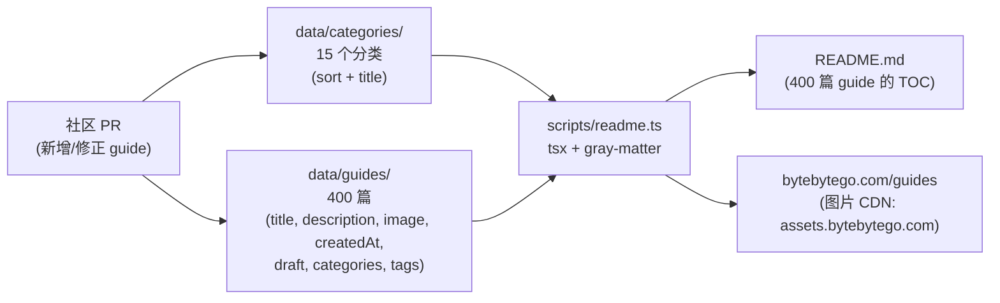
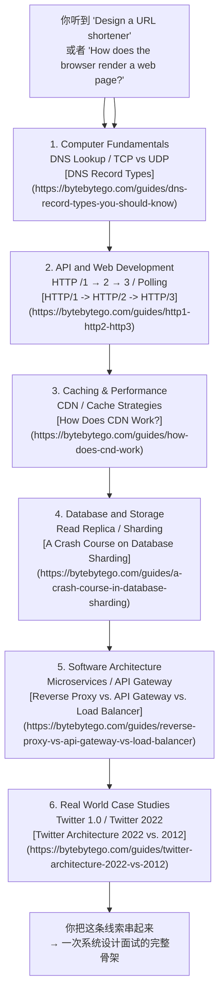

# ByteByteGo system-design-101 资源地图

[ByteByteGoHq/system-design-101](https://github.com/ByteByteGoHq/system-design-101) 是一份可以读的系统设计图解合集。`data/guides/` 里存放 400 篇图文说明：正文文字在仓库内直接可读，配图托管在官网 CDN；README 由脚本生成，把 400 篇按 15 个分类整理成目录，每篇都同时指向 [bytebytego.com/guides](https://bytebytego.com/guides) 的在线版本。截至 2026-09-28，仓库拥有 90.0k stars、10.0k forks，自 2023-09-18 创建以来一共只有 25 次提交，最后一次停在 2025-04-04。每篇 guide 篇幅不长，单篇几分钟就能读完——它的价值在于分类与索引，把散装的图解串成一张主题地图。

把它当地图读，价值在于回答三个问题：系统设计有哪些主题、每个主题下有哪些图解、按什么顺序读。它是面试准备的主题地图，不是实现参考。

## 目录

1. [仓库结构：数据驱动的清单生成器](#仓库结构数据驱动的清单生成器)
2. [15 个主题分类](#15-个主题分类)
3. [一个具体场景：从 URL 到渲染完成](#一个具体场景从-url-到渲染完成)
4. [与同类资源的对比](#与同类资源的对比)
5. [怎么用这份资源地图](#怎么用这份资源地图)
6. [适用边界](#适用边界)
7. [常见问题](#常见问题)
8. [读完自测](#读完自测)

## 仓库结构：数据驱动的清单生成器

仓库的构成很精简：`data/categories/*.md`（15 个分类元数据）+ `data/guides/*.md`（400 篇图文 guide，每篇含 frontmatter 和正文）+ `scripts/readme.ts`（拼装 README 的脚本，82 行）+ `.github/`（横幅图和一个欢迎新贡献者的 workflow）。README 由脚本生成，不靠手动维护。

```mermaid
flowchart LR
    Cat["data/categories/<br/>15 个分类<br/>(sort + title)"] --> Gen[scripts/readme.ts<br/>tsx + gray-matter]
    Guides["data/guides/<br/>400 篇<br/>(title, description, image, createdAt,<br/>draft, categories, tags)"] --> Gen
    Gen --> README["README.md<br/>(400 篇 guide 的 TOC)"]
    Gen --> Site["bytebytego.com/guides<br/>(图片 CDN: assets.bytebytego.com)"]
    PR["社区 PR<br/>(新增/修正 guide)"] --> Cat
    PR --> Guides
```

这张图对应三条设计主线，每条都回答一个"为什么"：

- **数据与生成分离**——`data/` 目录是单一数据源，`scripts/readme.ts` 用 `gray-matter` 解析每个 `.md` 的 frontmatter，分类按 `sort`、guide 按 `createdAt` 排序，拼出 TOC。新增一篇 guide 只需在 `data/guides/` 加一个 markdown 文件，README 自动更新。维护者不需要手动编辑那 400 个条目，改数据就行，目录不会和内容脱节。
- **图片托管在 CDN**——`data/guides/*.md` 的 `image` 字段指向 `https://assets.bytebytego.com/diagrams/0xxx-name.png`，配图不存仓库，仓库体积保持在 46 MB 左右（GitHub API 显示 `size: 46759` KB）。图片跟着官网走，更新图解时不需要在仓库里改二进制。
- **贡献走 PR**——`CONTRIBUTING.md` 约定：每个 PR 聚焦单一主题，起一个能概括主题的标题，不要跨多个主题改动；发现图解有错别字或问题时开 issue 而不是直接改图，源图在上游，由维护者修复后统一发布；并明确禁止用 AI 工具生成内容。`.github/workflows/welcome.yml` 会在首次贡献时自动留言，提醒阅读贡献指南，结尾写得很直白："不符合指南的 PR 会被关闭"（Any PRs that don't follow the guidelines will be closed）。

25 次提交的分布本身就是一条演进时间线：2023-10-16 首次提交时，它还是一份单 README 的图解合集；2023-10-17 补 LICENSE.md，10-26 加 CONTRIBUTING.md；2023-11-07 加过 TRANSLATIONS.md，同一天有一条提交专门澄清"图解不做翻译"；之后一年多只剩零星修复。真正的大动作在 2025-04-01 的 #106——把内容重构成现在的 `data/` 数据驱动结构，400 篇 guide 入库、README 换成脚本生成的目录，三天后补上贡献者 workflow，仓库就此停更。今天看到的形态是那次重构定下的。

## 15 个主题分类

README TOC 的顶层 `*` 一级项就是 15 个分类，按 `sort` 字段排序。完整的 15 个分类是：API and Web Development、Real World Case Studies、AI and Machine Learning、Database and Storage、Technical Interviews、Caching & Performance、Payment and Fintech、Software Architecture、DevTools & Productivity、Software Development、Cloud & Distributed Systems、How it Works?、DevOps and CI/CD、Security、Computer Fundamentals。

各分类的容量差别很大（按 README 目录逐条数）：API and Web Development 50 篇、Cloud & Distributed Systems 49 篇、Database and Storage 47 篇是三个大块；Security 35 篇、Real World Case Studies 32 篇、Caching & Performance 29 篇居中；AI and Machine Learning 只有 8 篇，是全仓最小的分类，比 Computer Fundamentals（12 篇）还少——重心仍在传统后端议题，AI 系统设计刚起了个头。少数 guide 挂在两个分类下，所以目录条目比 400 略多。其中 8 个跨方向最常用的分类，各自的典型问题与阅读起点如下：

| # | 分类 | 典型问题 | 候选阅读起点 |
|---|---|---|---|
| 1 | API and Web Development | REST vs GraphQL、gRPC、API Gateway | [The Ultimate API Learning Roadmap](https://bytebytego.com/guides/the-ultimate-api-learning-roadmap) |
| 2 | Real World Case Studies | Netflix / Uber / Twitter / Airbnb 架构 | [Netflix's Overall Architecture](https://bytebytego.com/guides/netflixs-overall-architecture) |
| 3 | Database and Storage | Sharding、CAP、B-Tree vs LSM-Tree | [A Crash Course on Database Sharding](https://bytebytego.com/guides/a-crash-course-in-database-sharding) |
| 4 | Caching & Performance | Redis、CDN、缓存策略 | [The Ultimate Redis 101](https://bytebytego.com/guides/the-ultimate-redis-101) |
| 5 | Cloud & Distributed Systems | AWS、可扩展性、12-Factor | [System Design Cheat Sheet](https://bytebytego.com/guides/system-design-cheat-sheet) |
| 6 | Software Architecture | 微服务、DDD、设计模式 | [The Ultimate Software Architect Knowledge Map](https://bytebytego.com/guides/the-ultimate-software-architect-knowledge-map) |
| 7 | Security | HTTPS、JWT、OAuth、密码存储 | [Cybersecurity 101](https://bytebytego.com/guides/cybersecurity-101-in-one-picture) |
| 8 | DevOps and CI/CD | Docker、K8s、CI/CD | [What is Kubernetes (k8s)?](https://bytebytego.com/guides/what-is-k8s-kubernetes) |

分类之间的颗粒度并不均匀：`Real World Case Studies` 和 `How it Works?` 偏"看懂真实系统"，`Database and Storage` 与 `Caching & Performance` 偏"面试必考基础"，`Technical Interviews` 只有 5 篇，更像入口而不是分类。读的时候按自己短板选分类，不必平均分配时间。

## 一个具体场景：从 URL 到渲染完成

用面试常考的「输入 URL 后浏览器发生了什么」来串仓库的各个分类：

```mermaid
flowchart TB
    Start["你听到 'Design a URL shortener'<br/>或者 'How does the browser render a web page?'"] --> Step1
    Step1["1. Computer Fundamentals<br/>DNS Lookup / TCP vs UDP<br/>[DNS Record Types](https://bytebytego.com/guides/dns-record-types-you-should-know)"]
    Step2["2. API and Web Development<br/>HTTP /1 → 2 → 3 / Polling<br/>[HTTP/1 -> HTTP/2 -> HTTP/3](https://bytebytego.com/guides/http1-http2-http3)"]
    Step3["3. Caching & Performance<br/>CDN / Cache Strategies<br/>[How Does CDN Work?](https://bytebytego.com/guides/how-does-cnd-work)"]
    Step4["4. Database and Storage<br/>Read Replica / Sharding<br/>[A Crash Course on Database Sharding](https://bytebytego.com/guides/a-crash-course-in-database-sharding)"]
    Step5["5. Software Architecture<br/>Microservices / API Gateway<br/>[Reverse Proxy vs. API Gateway vs. Load Balancer](https://bytebytego.com/guides/reverse-proxy-vs-api-gateway-vs-load-balancer)"]
    Step6["6. Real World Case Studies<br/>Twitter 1.0 / Twitter 2022<br/>[Twitter Architecture 2022 vs. 2012](https://bytebytego.com/guides/twitter-architecture-2022-vs-2012)"]
    Done["你把这条线索串起来<br/>→ 一次系统设计面试的完整骨架"]
    Start --> Step1 --> Step2 --> Step3 --> Step4 --> Step5 --> Step6 --> Done
```

这条路径里每一跳对应仓库的一个分类，但分类规模并不均匀：API and Web Development 50 篇，Database and Storage 47 篇、Cloud & Distributed Systems 49 篇，Technical Interviews 只有 5 篇。仓库把所有可能的路径铺开，读者自己选。

顺带一提，图中 CDN 那篇的 slug 是 `how-does-cnd-work`——官方把 CDN 拼成了 CND，README 里标题写对了、链接拼错了，是上游的笔误，链接本身有效，点开就能读。

## 与同类资源的对比

| 资源 | 内容深度 | 更新状态 | 与 ByteByteGo 的关系 |
|---|---|---|---|
| [donnemartin/system-design-primer](https://github.com/donnemartin/system-design-primer)（372k stars） | 文字为主，配代码示例与 Anki 闪卡，官方维护简繁中文版 | 活跃，2026-09 仍有合并 | 同主题的"文字教材"路线，star 数约是本仓库的 4 倍 |
| System Design Interview 系列书（Alex Xu 著，已出两卷） | 出版级深度，章节成体系 | 随新版更新 | 仓库中的 Real World Case Studies、System Design Cheat Sheet 与书章节互为对照 |
| ByteByteGo YouTube 频道 | 图解的动态视频版 | 持续更新 | README 头部给出的官方入口，与仓库同一套内容 |
| [ashishps1/awesome-system-design-resources](https://github.com/ashishps1/awesome-system-design-resources)（41.8k stars） | 要点与链接合集，无逐篇讲解 | 2026-02 有更新 | 同主题资源索引，检索粒度比本仓库粗 |

如果时间只够看一份，建议 system-design-101：条目全部指向自家成品的图解加文字，点开就能读，不用在多个来源之间跳。primer 更全更深，适合当主教材从头读；书和视频深度更高，但要么收费要么零散，不适合当索引。awesome 类列表胜在覆盖面，代价是只有链接没有讲解。

## 怎么用这份资源地图

1. **先看 `Technical Interviews`** ——只有 5 篇，里头有 [How to Ace System Design Interviews](https://bytebytego.com/guides/how-to-ace-system-design-interviews-like-a-boss) 和 [Recommended Materials for Technical Interviews](https://bytebytego.com/guides/my-recommended-materials-for-cracking-your-next-technical-interview)，相当于总入口。
2. **再按薄弱分类深入**——比如数据库弱就进 [Database and Storage](https://bytebytego.com/guides/database-and-storage) 一次刷完，从 [Types of Databases](https://bytebytego.com/guides/types-of-databases) 到 [8 Data Structures That Power Your Databases](https://bytebytego.com/guides/8-data-structures-that-power-your-databases) 串起来。
3. **最后用 [Real World Case Studies](https://bytebytego.com/guides/real-world-case-studies) 做交叉验证**——同一类问题在 Netflix / Uber / Pinterest / Figma 的真实架构里怎么落地，能补足纯图解容易缺的真实工程权衡。

先总入口、再单点深入、最后用真实案例串，是这张地图最自然的读法。具体到一次面试准备，可以按"主题 → 图解 → 复述"三步走：确定这周补哪个分类，把该分类下的图解按顺序看完，然后合上图解用自己的话把原理讲一遍。图解适合建立"长什么样"的直觉，但要防止只记住图、说不清取舍。

## 适用边界

- **适合**：准备系统设计面试、需要一份「主题地图」快速定位某个领域该读哪些图解、想把 ByteByteGo 系列的图解按主题组织成学习路径。
- **不适合**：想通过读一个仓库学到分布式系统实现——这不是它的定位。没有代码示例、没有配置教程、没有命令行工具，每篇 guide 是一张主图加几百个英文词的说明（抽读 4 篇实测在 175–469 词之间），图文在仓库和官网都免费可读，但深度有限。要成体系的内容，得另买书籍或课程。
- **许可限制**：内容按 CC BY-NC-ND 4.0 授权——署名、非商业可以使用，ND（禁止演绎）条款不允许修改后再分发。想翻译或改图再传播，许可上就过不去；官方也在 CONTRIBUTING.md 写明"暂无翻译成其他语言的计划"。中文读者只能读英文原版，好在这些图解的门槛主要在图不在文字。
- **时效性**：仓库最后 push 是 2025-04-04，之后没有新提交。把它当作一份历史快照：分类稳定、内容变动少，图解链接或细节需要确认时，以官网为准。

## 常见问题

**Q：为什么 README 里只放链接，不直接贴内容？**

因为 README 是脚本生成的目录，不是内容载体。内容在 `data/guides/` 里每篇一个 markdown 文件，正文可读、配图走 CDN；README 只负责把 400 篇按分类排成清单，方便扫读。每篇同时给出官网链接，是因为官网的在线版本排版更好、更新更快。

**Q：想给仓库加一篇图解，流程是什么？**

按 `CONTRIBUTING.md` 走：PR 聚焦单一主题，起一个能概括主题的标题，不要跨多个主题改动；发现图解错误时开 issue，不要直接改图——源图在上游，由维护者修复后统一发布；明确禁止用 AI 生成内容。合入后 `scripts/readme.ts` 自动把新条目排进 TOC，不需要手动改 README。另外官方明确暂无翻译计划，提交翻译类 PR 前先想清楚这一点。

**Q：图片在仓库里搜不到，正常吗？**

正常。`image` 字段指向 `assets.bytebytego.com` 的 CDN，仓库只存 URL 不存二进制，所以仓库体积才能保持在 46 MB 左右。这也意味着离线时看不到图，图解依赖官网可达性。

**Q：仓库很久没更新，是不是没人维护了？**

不是没人维护，是结构决定它不需要频繁 push。2025-04 重构之后，`data/` 只在有新增 guide 时变化，现有内容也很少改动，commit 频率低不代表内容陈旧。判断内容新旧，看官网每篇标注的更新时间比看 commit 更直接。

**Q：只看这个仓库能过系统设计面试吗？**

不能。它提供的是入门级图文速览，不是"为什么这么设计"的深度。真正的准备需要配合 System Design Interview 系列书籍（Alex Xu 著）或 system-design-primer 的完整文字解释，再用图解做速查。地图替代不了走路，但它能告诉你路在哪。

## 读完自测

不看正文，试着回答下面几个问题：

1. **这个仓库的三条设计主线分别解决什么问题？** 数据与生成分离、图片 CDN 托管、贡献走 PR，各自避免哪种维护上的坑？
2. **15 个分类里，哪几个容量最大、哪个最小？** AI and Machine Learning 只有 8 篇这个数字，说明了这份资源怎样的取向？
3. **"从 URL 到渲染完成"这条路径串了哪些分类？** 换一个问题（比如"设计一个 URL shortener"），你会走哪几个分类？
4. **为什么不推荐用这个仓库学系统设计实现？** 它的内容形态（图解加几百词说明、无代码示例）决定了它适合什么、不适合什么？
5. **想把这个仓库的图解翻译成中文再传播，许可上有什么障碍？** CC BY-NC-ND 4.0 的哪一条管住了这件事，官方在 CONTRIBUTING.md 里又是怎么表态的？

答得上来，说明你把它当目录用对了；答不上来，回去看对应的章节。
