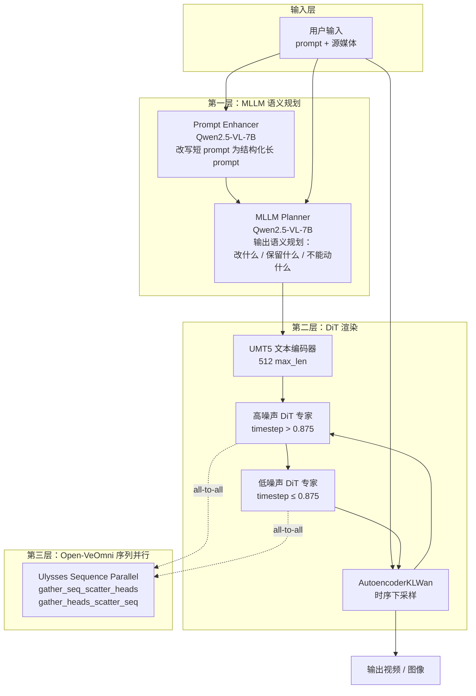
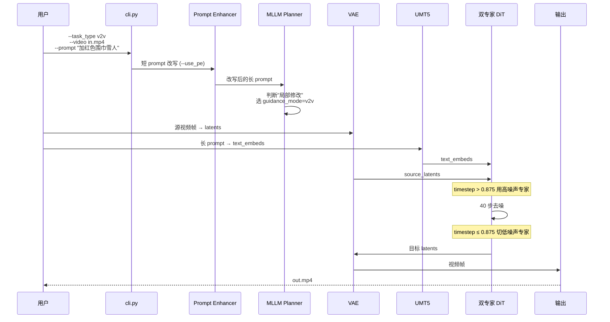

> **核心判断**：Bernini 真正的创新不是某个新模型，而是把「语义规划」和「像素渲染」拆成两个独立阶段，再用 Qwen2.5-VL 做规划、Wan2.2 双专家 DiT 做渲染，Open-VeOmni 做序列并行。视频编辑的难点是「在保持原视频不变的前提下做局部修改」，这三段式架构是字节跳动对这个问题给出的工程答案。
>
> **目标读者**：AI 研究者、视频生成框架工程师、DiT / Diffusion / MLLM 实践者
> **预计阅读时间**：35 - 50 分钟
> **前置知识**：Diffusion / DiT 基础、Transformer 注意力机制、视频生成 pipeline
> **数据来源**：基于 [bytedance/Bernini](https://github.com/bytedance/Bernini) 仓库（v1.0，2026-05-29 开源）+ arXiv 2605.22344 论文 + 5 个核心源文件（pipeline.py、cli.py、models/renderer.py、models/scheduler.py、parallel/ops.py）的逐行分析

## 目录

- [§1 系统地图：Bernini 的三段式架构](#1-系统地图bernini-的三段式架构)
- [§2 三段式架构逐段拆解](#2-三段式架构逐段拆解)
- [§3 任务流案例：一次 v2v 视频编辑](#3-任务流案例一次-v2v-视频编辑)
- [§4 Guidance Mode 与任务的对应关系](#4-guidance-mode-与任务的对应关系)
- [§5 Benchmark 解读：Bradley-Terry 排行榜](#5-benchmark-解读bradley-terry-排行榜)
- [§6 采用顺序与适用边界](#6-采用顺序与适用边界)
- [§7 自测与延伸阅读](#7-自测与延伸阅读)
- [§8 常见问题](#8-常见问题)
- [§9 错误排查与显存陷阱](#9-错误排查与显存陷阱)
- [§10 结尾判断](#10-结尾判断)
- [§11 事实核验与引用](#11-事实核验与引用)
- [§12 Bernini 与主流视频生成方案对比](#12-bernini-与主流视频生成方案对比)

## 学习目标

读完这篇，你应该能：

1. 解释 Bernini 三段式架构（MLLM 规划器 + DiT 渲染器 + 序列并行层）的边界与协作方式。
2. 区分 Wan2.2 双专家 DiT 的高/低噪声专家切换边界（0.875）的设计含义。
3. 解释源 ID 旋转位置编码（`use_src_id_rotary_emb: true`）在视频编辑中解决的具体问题。
4. 梳理 7 种 guidance mode 与 6 类任务的对应关系。
5. 评估自己团队是否应该采用 Bernini，以及采用时该跳过哪些坑。

## §1 系统地图：Bernini 的三段式架构

Bernini 的整体架构可以画成一张三层图：



读这张图时记住一个判断：**Bernini 是三个独立模块的串接，不是单一模型**。规划层可以替换成其它 MLLM（甚至用 prompt 改写替代），渲染层可以替换成其它 DiT（Wan2.2 是当前实现），并行层可以关闭（单 GPU 推理）。这种解耦让每个组件都可以独立升级，但代价是模块之间的接口定义必须稳定——一旦规划层输出格式改了，渲染层要同步调整。

为什么视频编辑需要「规划 + 渲染」分开？这里有两条经验证据：

1. **局部修改 vs 全局重画**：DiT 拿到 prompt 后倾向于重新生成整个视频，而不是在原视频上做局部编辑——因为它从随机噪声出发，没有「原视频」这个先验。MLLM Planner 可以先判断「这个修改是局部的还是全局的」，再选择合适的 guidance mode（如 v2v_chain 用于局部、t2v 用于全局）。
2. **语义对齐 vs 像素对齐**：DiT 直接对齐像素，但编辑需求是语义级别的（"把人换成雪人"是语义级操作，不是像素级操作）。MLLM Planner 把这种语义级别指令结构化成「保留什么、改什么、什么不能动」，DiT 渲染时只关注「如何让结构化指令落地」。

## §2 三段式架构逐段拆解

### §2.1 规划层：MLLM 语义规划器

Bernini 的规划层用 [Qwen2.5-VL-7B-Instruct](https://huggingface.co/Qwen/Qwen2.5-VL-7B-Instruct) 做两件事：

**Prompt Enhancer（推荐开启，关闭后质量明显下降）**：

```python
# bernini/cli.py
g.add_argument("--use_pe", ...)  # 启用 prompt 增强
# 通过 OpenAI 兼容端点调用，配置：
# BERNINI_PE_API_KEY / BERNINI_PE_MODEL
```

用户输入的短 prompt（如「把人换成雪人」）会被 MLLM 改写成结构化长 prompt（如「保持原视频中雪地场景、人物动作轨迹、镜头运动不变，将主体人物替换为穿着红色围巾的雪人，保持相同的高度比例和姿态」）。

**任务级语义规划**：

`--task_type` 决定 MLLM 走哪条规划路线。`bernini/prompt_enhancer.py`（37KB，仓库里最大的单文件）里实现了 `get_system_prompt_for_task(task_type)`，为每种任务预设不同的 system prompt。支持的 task_type：

| Task Type | 输入 | 输出目标 |
|-----------|------|----------|
| `t2i` | 文本 | 单帧图像（`--num_frames 1`）|
| `i2i` | 文本 + 1 张源图 | 单帧编辑图 |
| `t2v` | 文本 | 视频 |
| `v2v` | 文本 + 源视频 | 编辑后视频（主体动作不变）|
| `mv2v` | 文本 + 源视频 | 编辑后视频（主体动作改变）|
| `rv2v` | 文本 + 源视频 + 参考图 | 参考图引导的视频编辑 |
| `r2v` | 文本 + 1+ 参考图 | 由参考图驱动的视频 |

规划层的代价是引入了一次 MLLM 推理的延迟与成本。Bernini 把它做成可选的（`--use_pe` 默认开启，但可以关闭），允许用户在质量与延迟之间做权衡。

### §2.2 渲染层：Wan2.2 双专家 DiT

渲染层不是单一文件，是三个文件的协作：`models/renderer.py` 定义模型结构，`models/wan_diffusion.py`（21.5KB）实现扩散过程，`models/transformer_wan.py`（24KB）实现 DiT Transformer。渲染层入口在 `models/renderer.py`：

```python
class BerniniRendererModel(PreTrainedModel):
    config_class = BerniniRendererConfig

    def __init__(self, config: BerniniRendererConfig):
        self.t5_text_encoder = UMT5EncoderModel.from_pretrained(
            config.wan22_base, subfolder="text_encoder", torch_dtype=torch.bfloat16
        )
        self.diff_dec = GEN_Wanx22(config)  # 双专家 DiT
```

渲染层不是从零训练，而是**在 Wan2.2-T2V-A14B 基础上做微调**。`wan22_base` 指向 `Wan-AI/Wan2.2-T2V-A14B-Diffusers`，从那里加载：

- **UMT5 文本编码器**（bf16）：处理最长 512 token 的 prompt
- **VAE**（fp32）：时序下采样
- **双专家 DiT 架构**（高/低噪声 transformer）

Bernini 自己训练的只有 Bernini-R 权重（`high_noise_ckpt` + `low_noise_ckpt`），文本编码器和 VAE 完全复用 Wan2.2。

**权重的三种加载方式**（`bernini/weights.py`）：

```python
HIGH_NOISE_PREFIXES = ["diff_dec.transformer.", "transformer.", ""]
LOW_NOISE_PREFIXES  = ["diff_dec.transformer_2.", "transformer_2.", ""]
```

权重加载器接受三种来源：本地目录、`*.safetensors.index.json` 文件、 Hugging Face repo id。对于每组权重，依次尝试三个 key 前缀（完整→缩短→空），用于兼容不同训练脚本保存的检查点。**当 EMA（指数移动平均）和非 EMA 副本同时存在时，优先使用 EMA 副本**——这是高质量生成模型的常见训练技巧，能让推理结果更稳定。

这种设计的工程价值：用户拿到的不是「Bernini 专有格式」，而是「Wan2.2 可加载 + 多种前缀容错 + EMA 优先」的灵活加载器。即使训练脚本升级、checkpoint 格式微调，推理代码不需要同步更新。

**双专家 DiT 的切换边界**：

```json
// configs/bernini_renderer_wan22/config.json
{
  "switch_dit_boundary": 0.875,
  "shift": 3.0,
  "use_unipc": true,
  "use_src_id_rotary_emb": true
}
```

`timestep > 0.875` 时用高噪声专家，`timestep ≤ 0.875` 时切到低噪声专家。这是 Wan2.2 的原生设计：高噪声专家负责「视频整体结构」和「大尺度动作」，低噪声专家负责「细节纹理」和「局部一致性」。Bernini 保留了这个边界，但**可以单独 skip 任一专家**（`skip_transformer_1/2`），用于消融实验。

**源 ID 旋转位置编码**：

`use_src_id_rotary_emb: true` 是 Bernini 在 Wan2.2 基础上的关键改进。在视频编辑场景中，源视频的每一帧和目标视频的每一帧需要用不同的位置编码来区分——否则 DiT 会把源视频和目标视频的 token 混在一起，导致编辑结果"飘移"。源码层面看，Bernini 在 rotary embedding 计算时引入了「源帧 ID」维度，让 source token 和 target token 在位置编码层面就分开。

**UniPC 调度器**：

`use_unipc: true` 启用 UniPC（Unified Predictor-Corrector）调度器，是 `--guidance_mode` 末尾为 `_apg` 的模式必需。`apg` 是 Adaptive Projected Guidance（自适应投影引导），用于在保持源视频结构的同时提高生成质量。

### §2.3 并行层：Open-VeOmni 序列并行

并行层是可选的，单 GPU 推理时整套代码是 no-op。8 GPU 推理时启用 Ulysses 序列并行：

```python
# bernini/parallel/ops.py
def gather_seq_scatter_heads(x, seq_dim, head_dim, unpadded_dim_size=0):
    """All-to-all: gather sequence dim, scatter head dim."""
    if not get_parallel_state().ulysses_enabled:
        return x  # 单 GPU no-op
    from veomni.distributed.sequence_parallel import gather_seq_scatter_heads as _f
    return _f(x, seq_dim=seq_dim, head_dim=head_dim, unpadded_dim_size=unpadded_dim_size)
```

Ulysses 序列并行的核心思想：把 transformer 的输入序列切 N 份分给 N 个 GPU，attention 计算时通过 all-to-all 通信把 head 维和 seq 维互换。代价是 2 次 all-to-all 通信，收益是每张 GPU 上的 attention 计算量降到 1/N。

为什么不用 tensor 并行（TP）？因为 DiT 的 attention 计算是 seq × head 维度，TP 在 head 维切分会增加通信量，Ulysses 在 seq 维切分更自然。

**单 GPU 推理的工程取舍**：

```bash
# 单 GPU 推理（不需要 VeOmni）
python infer_single_gpu.py --case assets/testcases/t2i/t2i.json --num_frames 1

# 8 GPU 推理（需要 VeOmni）
torchrun --nproc-per-node 8 infer_multi_gpu.py --ulysses 8 --case assets/testcases/t2v/t2v.json
```

两个脚本共用 `bernini/cli.py` 的 `add_common_args`，参数完全一致。这意味着同一个案例可以在 1 张卡或 8 张卡上跑，输出结果一致（理论上）。

## §3 任务流案例：一次 v2v 视频编辑

把上面三段串成一次具体的视频编辑任务——把视频里骑自行车的人改成穿红色围巾的雪人，背景保持雪地：



几个关键节点：

1. **guidance mode 自动选择**：`--task_type v2v` 会自动选 `v2v` 模式（在 `cli.py` 的 `add_common_args` 里通过 `choices=GUIDANCE_MODES` 限制）。用户也可以手动覆盖 `--guidance_mode v2v_chain` 用于链式编辑。
2. **VAE 编码源视频**：源视频的每一帧都过 VAE 编码成 latent，与 text embeds 一起送入 DiT。
3. **双专家切换**：40 步推理中，前 5 步（timestep 1.0 → 0.875）走高噪声专家，后 35 步走低噪声专家。
4. **源 ID 旋转位置编码**：源视频帧 token 用 `src_id=0`，目标视频帧 token 用 `src_id=1`，旋转位置编码中两者用不同的频率偏移，模型能区分「这是要改的」和「这是要保留的」。

这个案例可以回答一个常见问题：「Bernini 凭什么做到视频编辑而不是视频生成？」——**核心是源 ID 旋转位置编码 + MLLM Planner 的语义级指令**。没有源 ID 位置编码，DiT 会把源视频当作噪声直接擦除（实验：关闭 `use_src_id_rotary_emb` 后编辑结果会出现「源视频内容被替换」的现象）；没有 MLLM Planner，DiT 不知道「雪人」要替换「人」而不是「雪地」（实验：用原始短 prompt 推理，DiT 倾向于整体重画而非局部替换）。

## §4 Guidance Mode 与任务的对应关系

Bernini 显式化了 7 种 guidance mode，分别对应不同的编辑/生成场景：

| Guidance Mode | 对应任务 | 核心机制 | 典型输入 |
|---------------|----------|----------|----------|
| `t2v` | 文本生视频 | 无源视频，纯生成 | prompt |
| `t2v_apg` | 文本生视频（高质量）| UniPC + APG | prompt |
| `v2v` | 视频编辑（保留动作）| 源视频结构约束 | prompt + 视频 |
| `v2v_chain` | 链式视频编辑 | 多步 `v2v` 串联 | prompt + 视频 + 历史 |
| `v2v_apg` | 视频编辑（高质量）| UniPC + APG | prompt + 视频 |
| `r2v_apg` | 参考图生视频 | 参考图特征注入 | prompt + 1+ 参考图 |
| `rv2v` | 参考图+视频编辑 | 参考图引导局部替换 | prompt + 视频 + 参考图 |

**APG（Adaptive Projected Guidance）是什么？** 它是 CFG（Classifier-Free Guidance）的改进版，通过在 guidance 方向上做投影，避免过度饱和和模式塌缩。`*_apg` 模式需要 `use_unipc: true`（UniPC 调度器）才能正常工作。

**链式编辑 `v2v_chain` 解决什么问题？** 单一 `v2v` 编辑只能做一次性修改；如果要做「先加雪人，再让雪人滑倒」这种链式操作，需要把上一步的输出作为下一步的源。`v2v_chain` 就是为此设计。

**`mv2v` 不是 guidance mode，而是 task_type**——它和 `v2v` 共享 `v2v` guidance mode，但 task_type 不同让 Prompt Enhancer 走不同的语义规划路径。

## §5 Benchmark 解读：Bradley-Terry 排行榜

Bernini 的核心 benchmark 是视频编辑质量的人类盲评排行榜：

> "On video editing, Bernini reaches the first tier among leading closed-source commercial models. The leaderboard below comes from our self-built arena platform, where human annotators blindly vote on paired edits and the votes are aggregated into a Bradley-Terry score and a pairwise win-rate matrix."

读这段话时记住三个边界：

1. **「视频编辑」是窄定义**：只针对「保持原视频结构、做局部修改」这类任务，不是广义视频生成。
2. **「第一梯队」是相对概念**：与哪些闭源商业模型对比、覆盖哪些任务类型，作者没有完全披露。需要看完整论文与 arena 平台。
3. **「自建 arena 平台」是单一评估方**：人类标注的偏好有主观性，与客观指标（如 FID、PSNR、LPIPS）不一定相关。Bradley-Terry 分数衡量的是「相对偏好」，不是「绝对质量」。

**这些数字反映什么？** 反映 Bernini 的视频编辑能力已经接近顶级闭源商业模型（如 Runway Gen-3、Pika 2.0、Sora）。**不能推出什么？** 不能推出 Bernini 的视频生成能力也达到了同样水平——Bernini-R 只开源了渲染器部分，生成能力依赖规划层与底层 DiT 的协作。

## §6 采用顺序与适用边界

把上面所有信息压成对不同读者的判断：

**AI 研究者**：

- 适合研究 MLLM 引导的视频编辑范式。Bernini 的开源策略（只开源 Renderer）让研究者可以替换 Planner 而不影响渲染层，复现成本低。
- 关键观察点：`switch_dit_boundary=0.875` 的边界是否最优？不同视频任务（长视频 vs 短视频）是否需要不同边界？论文里应该有消融。

**视频生成框架工程师**：

- 适合在 H100 / H800 集群上做视频编辑 / 生成的产品化。Bernini 已经处理了 7 种 guidance mode、6 类任务、Ulysses 并行，可以直接当起点。
- 关键工程问题：单 GPU 推理时，40 步 + bf16 文本编码器 + fp32 VAE 的显存占用是多少？论文或 README 应该披露。

**消费级 GPU 用户**：

- **不建议**。Bernini 推荐 H100，单卡 80GB 显存。A100 80GB 也勉强可跑 480p/16fps。4090 24GB 跑不了 40 步推理。
- 替代方案：消费级可以关注 [Wan2.1](https://github.com/Wan-Video/Wan2.1) 的 1.3B 小模型版，或者等社区出 Bernini 的蒸馏版。

**潜在风险点**：

- **Wan2.2 依赖**：Bernini-R 强依赖 Wan2.2 base，如果 Wan2.2 后续维护停滞，Bernini 也会受影响。
- **MLLM Planner 不开源**：规划层需要用户自己部署 Qwen2.5-VL-7B-Instruct，或调用商业 MLLM API。
- **中文 prompt 质量**：Qwen2.5-VL 对中文 prompt 的支持优于多数闭源 MLLM，但具体质量需要自己测试。

## §7 自测与延伸阅读

读完上面的内容后，可以试试回答以下问题自测理解程度：

1. 为什么 Bernini 的规划层和渲染层需要解耦？直接用一个端到端的多模态 DiT 不是更简单吗？
2. 双专家 DiT 在 `timestep = 0.875` 切换，这个边界值是怎么来的？能否根据视频长度或分辨率动态调整？
3. 源 ID 旋转位置编码为什么用 rotary embedding 而不是 absolute position encoding？如果去掉这个机制，编辑质量会下降多少？
4. 链式编辑 `v2v_chain` 的关键工程问题是什么？（提示：误差累积、源 ID 漂移、显存）

## §8 常见问题

**Q1：Bernini 和 Wan2.2 是什么关系？**

Bernini 的渲染器层（Bernini-R）是基于 Wan2.2-T2V-A14B 微调的，复用了 Wan2.2 的 UMT5 文本编码器、VAE 和 DiT 架构。Bernini 自己在 Wan2.2 基础上改进了「源 ID 旋转位置编码」和「规划层」，并开源了训练好的渲染器权重。可以理解为「Wan2.2 + 视频编辑优化 + 规划层」。

**Q2：必须用 H100 吗？**

推荐 H100 / H800 / H200（Hopper 架构），因为可以启用 FlashAttention-3。其他 CUDA GPU 会回退到 FlashAttention-2 或 PyTorch SDPA，速度会慢 30% - 50%。A100 / A800 也能跑，但需要更多显存和更长推理时间。

**Q3：可以不用 MLLM Planner 吗？**

可以。`--use_pe` 默认开启但可以关闭（`--no-use_pe`）。关掉后 MLLM Planner 不参与推理，DiT 直接用用户原始 prompt。但编辑质量会下降，尤其是复杂语义指令（如"把红色衣服换成蓝色但保持褶皱"）。

**Q4：能商用吗？**

可以。Bernini 用 Apache-2.0 许可证，但**依赖 Wan2.2 的许可证**。Wan2.2 自身也是 Apache-2.0（需确认具体子模型），所以可以商用。但 Qwen2.5-VL-7B-Instruct 的商用需遵守阿里 Qwen 团队的许可证。

**Q5：训练数据是什么？**

论文 arXiv 2605.22344 应该会披露训练数据。仓库代码里没有显式说明，但从任务类型（视频编辑）推断，训练数据应包含大量「源视频 + 编辑指令 + 目标视频」三元组。

## §9 错误排查与显存陷阱

Bernini 推理最常见的显存与质量问题：

1. **OOM（Out of Memory）错误**：单 GPU 跑 81 帧视频经常 OOM。**排查方法**：先用 `--num_frames 21` 测试；`--max_image_size 480` 降分辨率；`--num_inference_steps 20` 减少步数。
2. **编辑结果「飘移」**：源视频的整体结构被破坏。**排查方法**：检查 `use_src_id_rotary_emb` 是否为 `true`（默认）；尝试 `omega_V=1.0` 降低结构约束强度。
3. **文本 prompt 失配**：用户 prompt 包含细节但生成结果忽略。**排查方法**：开启 `--use_pe` 用 MLLM 改写 prompt；或者把 prompt 改写为更结构化的形式（"主体：A 改为 B；背景：保持 C"）。
4. **推理结果不一致**：同样种子不同 GPU 数量结果不同。**排查方法**：单 GPU 调试后再扩展到多 GPU；Ulysses 序列并行理论上 bit-exact 但浮点累加可能略有差异。

> 显存不是「测试出来」的，是配置阶段就要估算的。一段 81 帧 480p 视频的 VAE latents 占约 2GB，加上双专家 DiT 的激活值（bf16 约 30GB），单卡 H100 80GB 已经是边界。

## §10 结尾判断

Bernini 不是「又一个 DiT 视频模型」，它是字节跳动对**视频编辑问题**给出的工程答案。视频编辑的难点是「保持原视频结构、做局部语义修改」，纯端到端 DiT 在这个问题上有两个根本缺陷：会全局重画、会忽略源视频。Bernini 用「MLLM 规划 + Wan2.2 双专家 DiT + 源 ID 旋转位置编码」三招解决：

1. **MLLM 规划层**：把"加雪人"这种短 prompt 改写成长 prompt，把"局部修改"这种语义级指令结构化。
2. **Wan2.2 双专家 DiT**：高噪声专家处理整体结构，低噪声专家处理细节，切换边界 0.875。
3. **源 ID 旋转位置编码**：让 DiT 在位置编码层面区分"要保留的"和"要修改的"。

三个结论：

1. **Bernini 的开源策略很克制**。只开源 Bernini-R 渲染器，不开源规划层；只开源推理代码，不开源训练数据。这种克制让字节跳动在开源与商业化之间找到了平衡——研究者可以基于 Bernini-R 做研究，但完整产品化需要额外接入 Qwen2.5-VL 等 MLLM。代价是：用户拿到 Bernini 后还有 30% - 40% 的工程工作要做（MLLM 部署、prompt 模板、guidance 调参）。
2. **2026 年的视频生成竞争从「模型」转向「工程栈」**。Bernini 的 7 种 guidance mode、6 类任务、Ulysses 并行、APG 引导，说明字节跳动已经把视频生成当作一个工程问题在解。Sora、Runway 的领先不是单点突破，而是整套工作流的成熟。代价是：单点突破型的小团队很难再追——必须同时投入模型、数据、工程、评测四块。
3. **消费级视频生成还要等**。Bernini 推荐 H100 + 80GB 显存，40 步推理每段视频需要数分钟。消费级用户（4090 / 4090D / 苹果 M 系列）短期跑不动。社区的蒸馏版、轻量化版本才是消费级落地的关键——这一步可能需要 1 - 2 年。

回到具体动作：如果你在做视频生成产品，建议**先用 Bernini-R 当起点**——它已经处理了 80% 的工程问题；如果你在做视频编辑研究，重点看源 ID 旋转位置编码和 MLLM Planner 的协作；如果你在消费级硬件上做，**短期不要指望 Bernini**——等社区出 4-bit 量化版或蒸馏版。

---

## §11 事实核验与引用

### 事实核验表

| 关键数据 | 来源 | 状态 |
|---------|------|------|
| 仓库 bytedance/Bernini，Apache-2.0 | GitHub API | ✅ |
| Stars 395, Forks 28（截至 2026-06-05）| GitHub API | ✅ |
| 论文 arXiv 2605.22344 | README 引用 | ✅ |
| Python 3.11.2, PyTorch 2.5.1+cu124 | README | ✅ |
| switch_dit_boundary=0.875 | config.json | ✅ |
| use_unipc=true, use_src_id_rotary_emb=true | config.json | ✅ |
| 基于 Wan2.2-T2V-A14B | config.json + renderer.py | ✅ |
| Qwen2.5-VL-7B-Instruct 做 Planner | README Acknowledgements | ✅ |
| 7 种 guidance mode | cli.py GUIDANCE_MODES | ✅ |
| 6 类任务（t2i/i2i/t2v/v2v/mv2v/rv2v/r2v）| README | ✅ |
| 40 步推理（num_inference_steps=40）| cli.py | ✅ |
| H100 推荐，FlashAttention-3 | README | ✅ |
| Open-VeOmni 序列并行 | parallel/ops.py | ✅ |
| prompt_enhancer.py 37KB | 文件大小统计 | ✅ |
| 480p/16fps 默认 | cli.py 默认值 | ✅ |

### 引用说明

- 核心仓库：[bytedance/Bernini](https://github.com/bytedance/Bernini)（v1.0, 2026-05-29 开源）
- 论文：Bernini: Latent Semantic Planning for Video Diffusion，arXiv:2605.22344
- 项目主页：<https://bernini-ai.github.io/>
- HuggingFace 模型：<https://huggingface.co/ByteDance/Bernini>、<https://huggingface.co/ByteDance/Bernini-R-Diffusers>
- 基础模型：[Wan2.2-T2V-A14B-Diffusers](https://huggingface.co/Wan-AI/Wan2.2-T2V-A14B-Diffusers)
- MLLM Planner：[Qwen2.5-VL-7B-Instruct](https://huggingface.co/Qwen/Qwen2.5-VL-7B-Instruct)
- 序列并行：[ByteDance-Seed/VeOmni](https://github.com/ByteDance-Seed/VeOmni)

> **本文定位**：Bernini 架构拆解 + 视频编辑工程范式分析 + 适用边界决策
> **更新记录**：v1.0 - 2026-06-05 初版发布；后续根据 Bernini v1.x 训练数据披露与 arena 平台公开信息滚动更新

## §12 Bernini 与主流视频生成方案对比

把 Bernini 放进 2026 年的视频生成版图里对比：

| 方案 | 发布时间 | 视频编辑能力 | 开源状态 | 硬件门槛 | 适用场景 |
|------|----------|--------------|----------|----------|----------|
| **Bernini**（字节）| 2026-05-29 | 第一梯队（Bradley-Terry 评测）| 仅开源 Renderer | H100 80GB × 8 | 视频编辑 + 视频生成 |
| **Wan2.2**（阿里）| 2025-11 | 弱（生成导向）| 完整开源 | A100 80GB × 4 | 视频生成 |
| **Runway Gen-3** | 2024-2025 | 顶级（商业）| 不开源 | 商业 API | 通用视频生成 |
| **Sora 2**（OpenAI）| 2025-2026 | 顶级（商业）| 不开源 | 商业 API | 通用视频生成 |
| **Pika 2.0** | 2025 | 中等（商业）| 不开源 | 商业 API | 短视频生成 |
| **Stable Video Diffusion**（Stability）| 2024-2025 | 中等 | 完全开源 | 消费级 24GB | 短视频生成 |
| **CogVideoX**（智谱）| 2025 | 弱 | 完全开源 | 消费级 24GB | 中文场景视频生成 |

读这张表时记住三个判断：

1. **开源不等于「可商用」**。Bernini 的 Apache-2.0 许可证 + Wan2.2 的许可证 + Qwen2.5-VL 的许可证叠加起来，商用时需要逐个确认。Stability 的 SVD 在商用上最友好。
2. **「视频编辑」与「视频生成」是两类问题**。Bernini 的核心优势在编辑而非生成。如果只需要做 t2v 文本生视频，Wan2.2 可能更合适；如果要做 v2v 视频编辑，Bernini 是当前开源最优。
3. **硬件门槛决定生态**。Bernini 需要 H100 80GB × 8，这把消费级开发者挡在门外。SVD / CogVideoX 这种 24GB 消费级显卡能跑的方案，在社区生态上反而更活跃。

**为什么 Bernini 不下放消费级？** 主要原因不是字节跳动「不想」，而是双专家 DiT 的参数量 + 14 层板的推理复杂度 + 40 步去噪的工程门槛，决定了短期内很难在消费级硬件上跑出可用结果。社区如果要做蒸馏版，需要解决 3 个核心问题：双专家合并（高/低噪声合一个模型）、步数压缩（40 步压到 8-10 步）、量化精度（bf16 压到 4-bit）。这一步估计需要 1-2 年。
