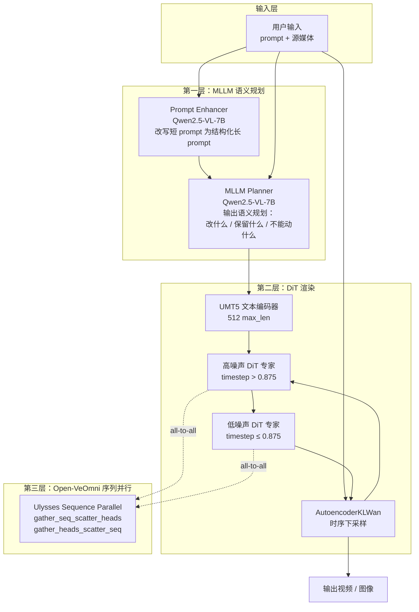
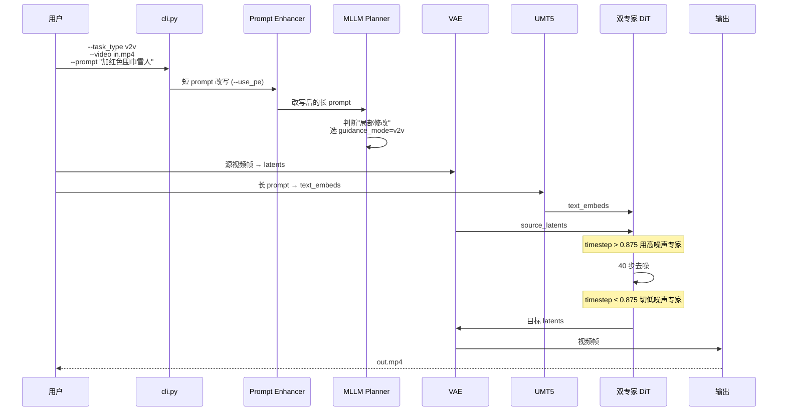

> **核心判断**：Bernini 真正的创新不是某个新模型，而是把「语义规划」和「像素渲染」拆成两个独立阶段，再用 Qwen2.5-VL 做规划、Wan2.2 双专家 DiT 做渲染，Open-VeOmni 做序列并行。视频编辑的难点是「在保持原视频不变的前提下做局部修改」，这三段式架构是字节跳动对这个问题给出的工程答案。
>
> **目标读者**：AI 研究者、视频生成框架工程师、DiT / Diffusion / MLLM 实践者
> **预计阅读时间**：35 - 50 分钟
> **前置知识**：Diffusion / DiT 基础、Transformer 注意力机制、视频生成 pipeline
> **数据来源**：依据 [bytedance/Bernini](https://github.com/bytedance/Bernini) 仓库（主分支，2026-09-09 核验）的 README、`configs/` 配置、`cli.py`、官方 `docs/bernini*.md` 与 arXiv 2605.22344 论文整理校正；涉及源码内部实现的细节均标注「以文档/论文为准」

## 目录

- [§1 系统地图：Bernini 的三段式架构](#1-系统地图bernini-的三段式架构)
- [§2 三段式架构逐段拆解](#2-三段式架构逐段拆解)
- [§3 任务流案例：一次 v2v 视频编辑](#3-任务流案例一次-v2v-视频编辑)
- [§4 Guidance Mode 与任务的对应关系](#4-guidance-mode-与任务的对应关系)
- [§5 Benchmark 解读：Bradley-Terry 排行榜](#5-benchmark-解读bradley-terry-排行榜)
- [§6 采用顺序与适用边界](#6-采用顺序与适用边界)
- [§7 自测与延伸阅读](#7-自测与延伸阅读)
- [§8 常见问题](#8-常见问题)
- [§9 错误排查与显存陷阱](#9-错误排查与显存陷阱)
- [§10 结尾判断](#10-结尾判断)
- [§11 事实核验与引用](#11-事实核验与引用)
- [§12 Bernini 与主流视频生成方案对比](#12-bernini-与主流视频生成方案对比)

## 学习目标

读完这篇，你应该能：

1. 解释 Bernini 三段式架构（MLLM 规划器 + DiT 渲染器 + 序列并行层）的边界与协作方式。
2. 区分 Wan2.2 双专家 DiT 的高/低噪声专家切换边界（0.875）的设计含义。
3. 解释源 ID 旋转位置编码（`use_src_id_rotary_emb: true`）在视频编辑中解决的具体问题。
4. 梳理 9 种 guidance mode 与 6 类任务的对应关系，区分 task 接口与 guidance mode。
5. 评估自己团队是否应该采用 Bernini，以及采用时该跳过哪些坑。

## §1 系统地图：Bernini 的三段式架构

Bernini 的整体架构可以画成一张三层图：


```mermaid
graph TB
  subgraph 输入层
    User[用户输入<br/>prompt + 源媒体]
  end

  subgraph 规划层 [第一层：MLLM 语义规划]
    PE[Prompt Enhancer<br/>Qwen2.5-VL-7B<br/>改写短 prompt 为结构化长 prompt]
    Planner[MLLM Planner<br/>Qwen2.5-VL-7B<br/>输出语义规划：<br/>改什么 / 保留什么 / 不能动什么]
  end

  subgraph 渲染层 [第二层：DiT 渲染]
    T5[UMT5 文本编码器<br/>512 max_len]
    VAE[AutoencoderKLWan<br/>时序下采样]
    High[高噪声 DiT 专家<br/>timestep > 0.875]
    Low[低噪声 DiT 专家<br/>timestep ≤ 0.875]
  end

  subgraph 并行层 [第三层：Open-VeOmni 序列并行]
    Ul[Ulysses Sequence Parallel<br/>gather_seq_scatter_heads<br/>gather_heads_scatter_seq]
  end

  Output[输出视频 / 图像]

  User --> PE
  PE --> Planner
  User --> Planner
  Planner --> T5
  User --> VAE
  VAE --> High
  T5 --> High
  High --> Low
  Low --> VAE
  VAE --> Output
  High -.->|all-to-all| Ul
  Low -.->|all-to-all| Ul
```

读这张图时注意一个关键区别：**Bernini 是三个独立模块的串接，不是单一模型**。规划层可以替换成其它 MLLM（甚至用 prompt 改写替代），渲染层可以替换成其它 DiT（Wan2.2 是当前实现），并行层可以关闭（单 GPU 推理）。这种解耦让每个组件都可以独立升级，但代价是模块之间的接口定义必须稳定——一旦规划层输出格式改了，渲染层要同步调整。

为什么视频编辑需要把「规划」和「渲染」分开？两个实际原因：

1. **局部修改 vs 全局重画**：DiT 拿到 prompt 后倾向于重新生成整个视频，而不是在原视频上做局部编辑——因为它从随机噪声出发，没有「原视频」这个先验。MLLM Planner 可以先判断「这个修改是局部的还是全局的」，再选择合适的 guidance mode（如 v2v_chain 用于局部、t2v 用于全局）。
2. **语义对齐 vs 像素对齐**：DiT 直接对齐像素，但编辑需求是语义级别的（"把人换成雪人"是语义级操作，不是像素级操作）。MLLM Planner 把这种语义级别指令结构化成「保留什么、改什么、什么不能动」，DiT 渲染时只关注「如何让结构化指令落地」。

## §2 三段式架构逐段拆解

### §2.1 规划层：MLLM 语义规划器

Bernini 的规划层用 [Qwen2.5-VL-7B-Instruct](https://huggingface.co/Qwen/Qwen2.5-VL-7B-Instruct) 做两件事：

**Prompt Enhancer（官方强烈推荐，但默认关闭）**：

```python
# bernini/cli.py（实际实现）
g.add_argument("--use_pe", action="store_true", help="enhance the prompt via an OpenAI-compatible endpoint")
```

`--use_pe` 是 `store_true` 开关，**默认关闭**，需要显式加上才启用。它通过 OpenAI 兼容端点调用一个多模态模型改写 prompt，端点和模型用环境变量配置（README 给出 `BERNINI_PE_API_KEY`、`BERNINI_PE_BASE_URL`、`BERNINI_PE_MODEL`）。README 把它列为「强烈推荐」，因为关掉后复杂指令的服从度明显下降，但代价是引入一次外部 LLM 的延迟与成本。

开启后，用户输入的短 prompt（如「把人换成雪人」）会被 MLLM 改写成结构化长 prompt（如「保持原视频中雪地场景、人物动作轨迹、镜头运动不变，将主体人物替换为穿着红色围巾的雪人，保持相同的高度比例和姿态」）。

**任务级语义规划**：

`--task_type` 决定 MLLM 走哪条规划路线。`bernini/prompt_enhancer.py` 里实现了 `get_system_prompt_for_task(task_type)`，为每种任务预设不同的 system prompt。官方定义的任务接口共 6 类（README「Both families share the same task interface」）：

| Task Type | 输入 | 输出目标 |
|-----------|------|----------|
| `t2i` | 文本 | 单帧图像（`--num_frames 1`）|
| `i2i` | 文本 + 1 张源图 | 单帧编辑图 |
| `t2v` | 文本 | 视频 |
| `v2v` | 文本 + 源视频 | 编辑后视频（主体动作不变）|
| `rv2v` | 文本 + 源视频 + 参考图 | 参考图引导的视频编辑 |
| `r2v` | 文本 + 1+ 参考图 | 由参考图驱动的视频 |

需要说明：网上流传的 `mv2v（主体动作改变）`并不在这份官方接口里；README、各任务 launch 脚本（`run_t2i/i2i/t2v/v2v/rv2v/r2v.sh`）与 `assets/testcases/` 都只覆盖上面 6 类。`v2v_chain`、`*_apg`、`*_wapg` 这些后缀属于 guidance mode，不属于 task 接口。

规划层的代价是引入了一次 MLLM 推理的延迟与成本。`--use_pe` 是显式开关（默认关闭），允许用户在质量与延迟之间做权衡。

### §2.2 渲染层：Wan2.2 双专家 DiT

渲染层的核心是一个基于 HuggingFace `PreTrainedModel` 的封装（`config.json` 里 `architectures: ["BerniniRendererModel"]`），它把文本编码、VAE 和扩散解码器组装成一个可加载的模型对象。渲染层不是从零训练，而是**在 Wan2.2-T2V-A14B 基础上做微调**。`wan22_base` 指向 `Wan-AI/Wan2.2-T2V-A14B-Diffusers`，从那里加载：

- **UMT5 文本编码器**（bf16）：处理最长 512 token 的 prompt（`max_sequence_length: 512`）
- **VAE**（fp32）：时序下采样，把视频帧压成 latent
- **双专家 DiT 架构**（高/低噪声 transformer）

需要先给出一个关键区分：仓库里有两条可运行线——**完整 Bernini**（`model_type: "bernini"`，规划器 + 渲染器打包在 `Bernini-Diffusers` 目录里）和 **Bernini-R**（`bernini_renderer`，渲染器单独的权重）。用 `--config` 指到完整模型目录时走 `BerniniPipeline`；传 `--high_noise_ckpt + --low_noise_ckpt`（或指到 diffusers-format 目录）时走 `BerniniRendererPipeline`。两条线共享同一个任务接口与 CLI。

**双专家 DiT 的切换边界**：

```json
// configs/bernini_renderer_wan22/config.json（已核实）
{
  "model_type": "bernini_renderer",
  "wan22_base": "Wan-AI/Wan2.2-T2V-A14B-Diffusers",
  "skip_transformer_1": false,
  "skip_transformer_2": false,
  "switch_dit_boundary": 0.875,
  "max_sequence_length": 512,
  "shift": 3.0,
  "use_unipc": true,
  "use_src_id_rotary_emb": true
}
```

`timestep > 0.875` 时用高噪声专家，`timestep ≤ 0.875` 时切到低噪声专家。这是 Wan2.2 的原生设计：高噪声专家负责「视频整体结构」和「大尺度动作」，低噪声专家负责「细节纹理」和「局部一致性」。Bernini 保留了这个边界，但**可以单独 skip 任一专家**（`skip_transformer_1/2` 或 `--skip_transformer_1/2` 语义），用于消融实验与省显存。

**源 ID 旋转位置编码**：

`use_src_id_rotary_emb: true`（CLI 对应 `--use_src_tgt_id`，默认开启）是 Bernini 在 Wan2.2 基础上的关键改进。在视频编辑场景中，源视频的每一帧和目标视频的每一帧需要用不同的位置编码来区分——否则 DiT 会把源视频和目标视频的 token 混在一起，导致编辑结果「飘移」。实现上 Bernini 在 rotary embedding 里引入「源帧 ID」维度（`src_id`），让 source token 和 target token 在位置编码层面就分开。当参考源数量超过训练见过的 `max_trained_src_id`（默认 5）时，`interpolate_src_id`（默认开启）会把超出部分均匀映射回训练区间，而不是外推到没训练过的范围。

**UniPC 调度器**：

`use_unipc: true`（CLI 对应 `--use_unipc`，默认开启，可 `--no-use_unipc` 关闭）启用 UniPC（Unified Predictor-Corrector）调度器。CLI 的帮助文本写明它是 `*_apg` 类 guidance mode 的必需项：`apg` 是 Adaptive Projected Guidance（自适应投影引导），用于在保持源视频结构的同时提高生成质量。

### §2.3 并行层：Open-VeOmni 序列并行

并行层（Open-VeOmni 的 Ulysses 序列并行）是引擎**要不要用多卡**的可选项。需要注意：VeOmni 按 README 是**必装依赖**（所有推理路径都会 import 它，连单 GPU 也要装），但单 GPU 时并行逻辑不激活；只有用 `torchrun` 起多进程并把 `--ulysses N` 设成 N>1 时才真正切到序列并行：

```python
# bernini/parallel/ops.py（单 GPU 时直接返回）
def gather_seq_scatter_heads(x, seq_dim, head_dim, unpadded_dim_size=0):
    """All-to-all: gather sequence dim, scatter head dim."""
    if not get_parallel_state().ulysses_enabled:
        return x  # Ulysses 未开启时 no-op
    from veomni.distributed.sequence_parallel import gather_seq_scatter_heads as _f
    return _f(x, seq_dim=seq_dim, head_dim=head_dim, unpadded_dim_size=unpadded_dim_size)
```

Ulysses 序列并行的核心思想：把 transformer 的输入序列切 N 份分给 N 个 GPU，attention 计算时通过 all-to-all 通信把 head 维和 seq 维互换。代价是 2 次 all-to-all 通信，收益是每张 GPU 上的 attention 计算量降到 1/N。

为什么不用 tensor 并行（TP）？DiT 的 attention 计算在 seq × head 维度上展开，TP 在 head 维切分会增加跨卡通信量，Ulysses 在 seq 维切分更自然。官方 launch 脚本默认 `NPROC_PER_NODE=8, ULYSSES=8`，即 8 卡、8 路序列并行。

**单 GPU / 多 GPU 的工程取舍**：

```bash
# 单 GPU（仍需安装 VeOmni，但不需要配置 Ulysses 多进程）
python infer_single_gpu.py --case assets/testcases/t2i/t2i.json --num_frames 1

# 8 GPU（以 Ulysses 序列并行跑）
torchrun --nproc-per-node 8 infer_multi_gpu.py --ulysses 8 --case assets/testcases/t2v/t2v.json
```

两个脚本共用 `bernini/cli.py` 的 `add_common_args`，参数完全一致。同一个案例可以在 1 张卡或 8 张卡上跑；Ulysses 序列并行在浮点累加顺序上可能略有差异，官方声称理论上是 bit-exact，实际调试时建议先在单卡对齐结果。

## §3 任务流案例：一次 v2v 视频编辑

把上面三段串成一次具体的视频编辑任务——把视频里骑自行车的人改成穿红色围巾的雪人，背景保持雪地：


```mermaid
sequenceDiagram
    participant U as 用户
    participant CLI as cli.py
    participant PE as Prompt Enhancer
    participant PL as MLLM Planner
    participant VAE as VAE
    participant T5 as UMT5
    participant DiT as 双专家 DiT
    participant OUT as 输出

    U->>CLI: --task_type v2v<br/>--video in.mp4<br/>--prompt "加红色围巾雪人"
    CLI->>PE: 短 prompt 改写 (--use_pe)
    PE->>PL: 改写后的长 prompt
    PL->>PL: 判断"局部修改"<br/>选 guidance_mode=v2v
    U->>VAE: 源视频帧 → latents
    U->>T5: 长 prompt → text_embeds
    T5->>DiT: text_embeds
    VAE->>DiT: source_latents
    Note over DiT: timestep > 0.875 用高噪声专家
    DiT->>DiT: 40 步去噪
    Note over DiT: timestep ≤ 0.875 切低噪声专家
    DiT->>VAE: 目标 latents
    VAE->>OUT: 视频帧
    OUT-->>U: out.mp4
```

这个流程里的几个关键点：

1. **guidance mode 自动选择**：`--task_type v2v` 会沿用 `--guidance_mode` 默认值（`cli.py` 里默认 `rv2v`，通过 `choices=GUIDANCE_MODES` 约束合法取值；case 文件也可显式指定）。用户可手动覆盖，如 `--guidance_mode v2v_chain` 用于链式编辑。
2. **VAE 编码源视频**：源视频的每一帧都过 VAE 编码成 latent，与 text embeds 一起送入 DiT。
3. **双专家切换**：`num_inference_steps` 默认 40 步，切换点在 `timestep=0.875`。需要说明的是「前 5 步高噪声 / 后 35 步低噪声」只是按线性归一化 timestep 的大致估算（0.125 × 40 ≈ 5），具体落在哪几步取决于 UniPC 调度器实际产生的 timestep 序列，不要把 5/35 当成恒定值。
4. **源 ID 旋转位置编码**：源视频帧 token 用 `src_id=0`，目标视频帧 token 用 `src_id=1`，旋转位置编码里两者用不同的频率偏移，模型据此区分「这是要改的」和「这是要保留的」。多个参考源（`rv2v`/`r2v`）再往上分配 `src_id`，超出 `max_trained_src_id`（默认 5）的部分会被 `interpolate_src_id` 映射回训练区间。

这个案例回答了很多人会问的一个问题：「Bernini 凭什么能做到视频编辑，而不只是视频生成？」——机制上靠两条线：**源 ID 旋转位置编码**让 DiT 在 token 层面保留源视频内容；**MLLM 规划层**把语义级指令（"把 X 换成 Y"）解析成「哪些保留、哪些修改」。对应的直觉是：剥离源 ID 位置编码后 DiT 更可能把源视频当作无关噪声重画；去掉规划层直接喂原始短 prompt 时，DiT 倾向于整体重画而非局部替换。这两条推论来自架构机制，官方消融的具体量化结论以论文为准。

## §4 Guidance Mode 与任务的对应关系

Bernini 的 guidance mode 由 `cli.py` 里的 `GUIDANCE_MODES` 固定，共 9 种：

| Guidance Mode | 对应场景 | 机制要点 | 典型输入 |
|---------------|----------|----------|----------|
| `t2v` | 文本生视频 | 无源视频，纯生成 | prompt |
| `t2v_apg` | 文本生视频（高质量）| UniPC + APG 引导 | prompt |
| `v2v` | 视频编辑（保留动作）| 源视频结构约束 | prompt + 视频 |
| `v2v_chain` | 链式视频编辑 | 多步 `v2v` 串联 | prompt + 视频 + 前序结果 |
| `v2v_apg` | 视频编辑（高质量）| UniPC + APG | prompt + 视频 |
| `r2v_apg` | 参考图生视频 | 参考图特征注入 + APG | prompt + 1+ 参考图 |
| `rv2v` | 参考图 + 视频编辑 | 参考图引导局部替换 | prompt + 视频 + 参考图 |
| `rv2v_wapg` | 参考图 + 视频编辑（增强）| `rv2v` + WAPG | prompt + 视频 + 参考图 |
| `vae_txt_vit_wapg` | 综合生成 / 编辑（出厂默认）| 融合 VAE、文本与 VIT 引导的 WAPG | prompt + 视频/图像 |

说明几点：

1. **APG（Adaptive Projected Guidance）**：CFG（Classifier-Free Guidance）的改进版，通过在 guidance 方向上加投影，缓解过度饱和与模式塌缩。`*_apg` 模式按 CLI 帮助文本需要 `use_unipc: true`（UniPC 调度器）才能正常工作。
2. **WAPG 与 `vae_txt_vit_wapg`**：`wapg` 是 Bernini 在 APG 基础上的工程扩展，把不同引导源（VAE latent、文本条件、VIT 视觉 token）按各自系数叠加投影。`vae_txt_vit_wapg` 是官方各 `run_*.sh` 脚本采用的默认 guidance mode，也是 README Highlights benchmark 里 `Bernini-v2v (OS)` 那列对应的设置。CLI 配套暴露了 `omega_vid/omega_img/omega_txt/omega_tgt/omega_scale`、`vit_txt_cfg/vit_img_cfg`、`vit_denoising_step`、`planning_step` 等参数控制各引导源的强度。
3. **`v2v_chain`（链式编辑）**：单一 `v2v` 只能做一次性修改；要做「先加雪人，再让雪人滑倒」这类多步操作，需要把上一步输出作为下一步的源，`v2v_chain` 为此设计。

## §5 Benchmark 解读：Bradley-Terry 排行榜

README 的核心声明是视频编辑成绩进入顶级闭源商业模型第一梯队，用的是自建 arena 平台的人类盲评：

> "On video editing, Bernini reaches the first tier among leading closed-source commercial models. The leaderboard below comes from our self-built arena platform, where human annotators blindly vote on paired edits and the votes are aggregated into a Bradley-Terry score and a pairwise win-rate matrix."

同一份 README Highlights 里，还放了一组各发布模型在公开指标上的数字（这是可核实的硬数据）：

| Model | EditVerse | OpenVE | OpenS2V | VBench | Bernini-v2v (OS) | Bernini-rv2v (OS) |
|---|---|---|---|---|---|---|
| Bernini-R 1.3B | 7.74 | 3.65 | 62.18 | 84.69 | 3.15 | 3.21 |
| Bernini-R 14B | 7.99 | 3.78 | 62.94 | 84.64 | 3.25 | 3.34 |
| Bernini 7+14B | 8.02 | 4.03 | 62.30 | 84.37 | 3.49 | 3.48 |
| Bernini-v2 7+14B | 8.02 | 3.96 | 63.83 | 84.46 | 3.49 | 3.55 |

按文体包要求，这段数字要回答三件事才能读：

1. **主要测什么**：VBench 是视频生成质量的主流评测集，`*_v2v/*_rv2v (OS)` 是官方自建 arena 的编辑分；EditVerse、OpenVE、OpenS2V 这类名称出现在官方榜单里，但 README 没有逐列给出完整说明与度量口径，其准确定义需以论文为准——因此这张表只能整体佐证「完整的模型分更高」，不宜对每个指标的含义做过度解读。
2. **数字反映系统的哪部分**：模型越完整分越高——单看 `Bernini-v2v (OS)` 从 3.15（1.3B 渲染器）爬到 3.49（完整 Bernini），说明规划层 + 14B 渲染器带来的收益主要在编辑服从度，而 VBench 的生成分四行几乎持平，说明渲染器主导生成基线。这也呼应官方对 1.3B 的描述：风格迁移、去字幕/水印、局部编辑这类简单任务接近 14B，但人像生成等复杂任务明显落后。
3. **不能推出什么**：这是单一厂商自报的榜单，对比对象与任务覆盖没有完全披露，不能当作与 Runway Gen-3 / Sora / Pika 的横向官方横评；Bradley-Terry 反映的是「相对偏好」而非「绝对质量」，也不能推出 Bernini 的通用视频生成能力等于其编辑能力。所有分数一律以 README 原文为唯一出处，未做独立复现。

## §6 采用顺序与适用边界

针对不同背景的读者，这里给出具体的采用建议：

**AI 研究者**：

- 适合研究 MLLM 引导的视频编辑范式。截至 2026-09，完整 Bernini（含规划器）与 Bernini-R 渲染器都已开源（`ByteDance/Bernini-Diffusers`、`Bernini-Diffusers-v2`、`Bernini-R-Diffusers` 14B / 1.3B），且 2026-07-13 官方补发了 Bernini-R 的训练代码。研究者既可以复现完整管线，也可以只拿渲染器替换自己的规划器，复现成本可控。
- 关键观察点：`switch_dit_boundary=0.875` 是否最优？不同视频任务（长视频 vs 短视频）是否需要不同边界？`max_trained_src_id / interpolate_src_id` 在多参考源下的表现？这些以论文的消融为准。

**视频生成框架工程师**：

- 适合在 H100 / H800 集群上做视频编辑 / 生成的产品化。Bernini 已处理 9 种 guidance mode、6 类任务、Ulysses 并行、case 文件批处理（`--inputs` json/jsonl），可以直接当起点。`gradio_demo.py` 也暴露了同一套管线的 UI，便于快速试验参数。
- 关键工程问题：完整 7+14B 需要大显存；若目标是快速上线，1.3B 的 Bernini-R 在简单编辑任务上接近 14B（官方说法：风格迁移、去字幕/水印、局部编辑与 14B 接近，人像生成等复杂任务落后），可作为低资源起点。

**消费级 GPU 用户**：

- **先量显存再决定**。完整（7+14B）按官方默认 8 卡 Ulysses 配置，单卡门槛高；1.3B 变体的出现把门槛降了一档，但仍要看具体分辨率与帧数。4090 这类 24GB 卡跑完整版不现实，跑 1.3B 的短片段可以做试验，生产级编辑还是建议上专用卡。
- 替代方案：官方 1.3B 权重、以及社区可能的蒸馏版，是消费级落地的两条路，前者已发布，后者待社区跟进。

**潜在风险点**：

- **Wan2.2 依赖**：Bernini-R 与完整 Bernini 的渲染器都建立在 Wan2.2 base 上，若 Wan2.2 后续维护停滞或接口变更，会传导到 Bernini。
- **Pe 端点是外部依赖**：`--use_pe` 需要自备 OpenAI 兼容端点；不提供时规划层只能走离线 task_type 系统 prompt，复杂指令服从度下降。
- **中文 prompt 质量**：Qwen2.5-VL 对中文 prompt 的支持通常优于多数闭源 MLLM，但具体质量需要自己测试。

## §7 自测与延伸阅读

读完上面的内容后，可以试试回答以下问题自测理解程度：

1. 为什么 Bernini 的规划层和渲染层需要解耦？直接用一个端到端的多模态 DiT 不是更简单吗？
2. 双专家 DiT 在 `timestep = 0.875` 切换，这个边界值是怎么来的？能否根据视频长度或分辨率动态调整？
3. 源 ID 旋转位置编码为什么用 rotary embedding 而不是 absolute position encoding？如果去掉这个机制，编辑质量会下降多少？
4. 链式编辑 `v2v_chain` 的关键工程问题是什么？（提示：误差累积、源 ID 漂移、显存）

## §8 常见问题

**Q1：Bernini 和 Wan2.2 是什么关系？**

Bernini 的渲染器层（Bernini-R）是基于 Wan2.2-T2V-A14B 微调的，复用了 Wan2.2 的 UMT5 文本编码器、VAE 和 DiT 架构。Bernini 自己在 Wan2.2 基础上改进了「源 ID 旋转位置编码」和「规划层」，并开源了训练好的渲染器权重。可以理解为「Wan2.2 + 视频编辑优化 + 规划层」。

**Q2：必须用 H100 吗？**

README 推荐 Hopper 架构（H100 / H800 / H200），因为可以启用 FlashAttention-3；其他 CUDA GPU 会回退到 FlashAttention-2 或 PyTorch SDPA，慢多少没有官方定量口径，不能拍脑袋写比例。A100 / A800 也能跑，但显存和推理时间都要放宽。

**Q3：可以不用 MLLM 规划层吗？**

可以，但默认就是没有。`--use_pe` 默认关闭，加了才启用 prompt 改写（README 强烈推荐开）。关掉或不开时，DiT 直接用用户原始 prompt + task_type 对应的离线 system prompt。复杂语义指令（如"把红色衣服换成蓝色但保持褶皱"）的服从度会明显下降——这正是规划层的价值所在。

**Q4：能商用吗？**

Bernini 本体是 Apache-2.0。但跑完整管线会叠加 Wan2.2、Qwen2.5-VL、VeOmni 等多个上游组件的许可证，**商用前要逐个确认各自许可与署名要求**，不能只凭 Bernini 的 LICENSE 结论。

**Q5：训练数据、训练代码开放吗？**

2026-07-13 官方发布了 Bernini-R 的训练代码（`docs/bernini_r_train.md`，推荐用 `uv` 管理环境），推理与训练都做成了可复现工程。训练数据集的明细以论文 arXiv 2605.22344 为准，仓库里不附数据本身；从任务形态推断训练围绕「源视频 / 图 + 编辑指令 + 目标输出」组织，但这是合理推断，不是官方披露。

## §9 错误排查与显存陷阱

Bernini 推理最常见的显存与质量问题：

1. **OOM（Out of Memory）错误**：长片段 / 高帧数在显存不足的卡上容易 OOM。**排查方法**：先降 `--num_frames`（如默认 81 降到 21）验证链路；`--max_image_size` 调小（默认 848，可降到 480）降分辨率；`--num_inference_steps` 从默认 40 减步数。
2. **编辑结果「飘移」**：源视频的整体结构被破坏。**排查方法**：确认未误关 `--use_src_tgt_id`（对应 `use_src_id_rotary_emb`，默认开启）；结构保持不足时提高 `omega_vid`（默认 1.25，控制视频结构引导强度），结构约束过强、改不动目标时适当调低。
3. **文本 prompt 失配**：用户 prompt 包含细节但生成结果忽略。**排查方法**：开启 `--use_pe` 用 MLLM 改写 prompt；或者把 prompt 改写为更结构化的形式（"主体：A 改为 B；背景：保持 C"）。
4. **推理结果不一致**：同样种子不同 GPU 数量结果不同。**排查方法**：先在单 GPU 对齐结果，再扩展到多 GPU；Ulysses 序列并行理论上 bit-exact，但浮点累加顺序不同仍可能带来微小差异。

> 显存不该靠撞上 OOM 再回头试，而应在配置阶段就估算。同样的 video 任务，帧数（`--num_frames`）、分辨率（`--max_image_size` / `--height` / `--width`）、步数（`--num_inference_steps`）三者的乘积大致决定激活值规模；完整 7+14B 双专家模型在默认 81 帧 / 848 分辨率下就需要大容量显存，`--skip_transformer_1/2`（跳过任一噪声专家）和 1.3B 变体是两条降门槛的路径。

## §10 结尾判断

Bernini 不是又一个 DiT 视频模型，而是字节跳动针对**视频编辑问题**给出的工程方案。视频编辑的难点是「保持原视频结构、做局部语义修改」，纯端到端 DiT 在这个问题上有两个根本缺陷：会全局重画、会忽略源视频。Bernini 用三招解决：

1. **MLLM 规划层**：把"加雪人"这种短 prompt 改写成长 prompt，把"局部修改"这种语义级指令结构化。
2. **Wan2.2 双专家 DiT**：高噪声专家处理整体结构，低噪声专家处理细节，切换边界 0.875。
3. **源 ID 旋转位置编码**：让 DiT 在位置编码层面区分"要保留的"和"要修改的"。

三个值得注意的点：

1. **Bernini 的开源是分阶段放开的**。先开渲染器推理与权重（2026-06-01 的 Bernini-R 14B），随后铺开 1.3B（06-09）、完整 Bernini（含规划器，06-11）与训练代码（07-13 的 Bernini-R 训练）。真正没给的仍是完整训练数据与规划器独立训练细节，这一点保持了克制。研究者现在能完整复现而不是只能看渲染器。
2. **2026 年的视频生成竞争从「模型」转向「工程栈」**。Bernini 的 9 种 guidance mode、6 类任务、Ulysses 并行、APG/WAPG 引导、case 文件批量运行，说明字节跳动把视频生成当成一个工程系统在打磨。单点去拼一个更强 DiT 的边际收益在收窄，模型 + 数据 + 工程 + 评测的整套工作流才是分水岭。
3. **消费级落地仍取决于轻量变体**。完整 7+14B 需要大显存；官方 1.3B 变体把门槛降了一档，是当前消费级最现实的入口，社区蒸馏版则是后续可能。是否够用，取决于你的目标任务落在简单的风格迁移/去字水印，还是复杂的人像生成。

具体建议：做视频生成产品，**先用官方 1.3B 或 14B 的最简推理链路跑通，再按目标任务决定要不要上完整规划层与 8 卡 Ulysses**；做视频编辑研究，重点看源 ID 旋转位置编码与 MLLM 规划层的协作、以及 `switch_dit_boundary` 与多源 `src_id` 的边界；消费级硬件上做原型，先从 1.3B 短片段试起，别一上来对着完整 7+14B 的显存需求做规划。

---

## §11 事实核验与引用

### 事实核验表

| 关键数据 | 来源 | 状态 |
|---------|------|------|
| 仓库 bytedance/Bernini，Apache-2.0 | GitHub | ✅ |
| 论文 arXiv 2605.22344 | README 引用 | ✅ |
| Python 3.11.2，PyTorch 2.7.1+cu126，CUDA 12.6 | README requirements | ✅ |
| switch_dit_boundary=0.875，shift=3.0，max_sequence_length=512 | config.json | ✅ |
| use_unipc=true，use_src_id_rotary_emb=true | config.json | ✅ |
| 渲染器基于 Wan2.2-T2V-A14B | config.json wan22_base | ✅ |
| Qwen2.5-VL-7B-Instruct 做 Planner | README Acknowledgements / docs | ✅ |
| 9 种 guidance mode | cli.py GUIDANCE_MODES | ✅ |
| 6 类任务接口（t2i/i2i/t2v/v2v/rv2v/r2v，无 mv2v）| README | ✅ |
| num_inference_steps=40，num_frames=81，fps=16，height=480，width=848 | cli.py 默认值 | ✅ |
| Hopper 推荐，FlashAttention-3 | README | ✅ |
| `--use_pe` 默认关闭（store_true）| cli.py | ✅ |
| Open-VeOmni 必装依赖 | README | ✅ |
| 2026-06-11 开源完整 Bernini，07-13 开源 Bernini-R 训练代码 | README News | ✅ |

### 引用说明

- 核心仓库：[bytedance/Bernini](https://github.com/bytedance/Bernini)（2026-05-22 论文发布，随后分阶段开源）
- 论文：Bernini: Latent Semantic Planning for Video Diffusion，[arXiv:2605.22344](https://arxiv.org/abs/2605.22344)
- 完整模型：[ByteDance/Bernini-Diffusers](https://huggingface.co/ByteDance/Bernini-Diffusers) · [Bernini-Diffusers-v2](https://huggingface.co/ByteDance/Bernini-Diffusers-v2)
- 渲染器模型：[ByteDance/Bernini-R-Diffusers](https://huggingface.co/ByteDance/Bernini-R-Diffusers)（14B）· [Bernini-R-1.3B-Diffusers](https://huggingface.co/ByteDance/Bernini-R-1.3B-Diffusers)
- 基础模型：[Wan2.2-T2V-A14B-Diffusers](https://huggingface.co/Wan-AI/Wan2.2-T2V-A14B-Diffusers)
- MLLM Planner：[Qwen2.5-VL-7B-Instruct](https://huggingface.co/Qwen/Qwen2.5-VL-7B-Instruct)
- 序列并行：[ByteDance-Seed/VeOmni](https://github.com/ByteDance-Seed/VeOmni)

> **本文定位**：Bernini 架构拆解 + 视频编辑工程范式分析 + 适用边界决策
> **更新记录**：v1.1 - 2026-09-09 依据 README / config.json / cli.py / docs 复核并校正事实（PyTorch 版本、guidance mode 数量、任务接口、开源现状），后续随官方发布滚动更新

## §12 Bernini 与主流视频生成方案对比

把 Bernini 放进 2026 年的视频生成版图里对比：

| 方案 | 定位 | 视频编辑能力 | 开源状态 | 硬件门槛 | 适用场景 |
|------|------|--------------|----------|----------|----------|
| **Bernini**（字节）| 语义规划 + 视频编辑统一框架 | 第一梯队（官方自报 Bradley-Terry）| 完整 Bernini 与 Renderer 均已开源（含 1.3B / 14B）| 完整 7+14B 默认 8×H100；1.3B 降档 | 视频编辑 + 视频生成 |
| **Wan2.2**（阿里）| 通用视频生成模型 | 弱（生成导向）| 完整开源 | 大显存 | 文本生视频 |
| **Runway Gen-3** | 商业视频生成 | 顶级（商业）| 不开源 | 商业 API | 通用视频生成 |
| **Sora 2**（OpenAI）| 商业视频生成 | 顶级（商业）| 不开源 | 商业 API | 通用视频生成 |
| **Pika 2.0** | 商业短视频生成 | 中等（商业）| 不开源 | 商业 API | 短视频生成 |
| **Stable Video Diffusion**（Stability）| 开源视频生成 | 中等 | 完全开源 | 消费级 24GB | 短视频生成 |
| **CogVideoX**（智谱）| 开源中文视频生成 | 弱 | 完全开源 | 消费级 24GB | 中文场景视频生成 |

先声明：除 Bernini 一行来自官方 README/doc 可核实外，其余各行的编辑能力、发布时间、硬件门槛是 2026 年上半年公开图景下的**定位性描述，不是统一口径的横评**，引用前请自行核对各家官方发布。

读这张对比表时要注意：

1. **开源不等于「可商用」**。Bernini 的 Apache-2.0 会叠加 Wan2.2、Qwen2.5-VL、VeOmni 的上游许可，商用前需逐个确认。
2. **「视频编辑」与「视频生成」是两类问题**。Bernini 的核心优势在编辑而非生成；若只做 t2v 文本生视频，Wan2.2 这类生成导向方案可能更省事，若做 v2v 视频编辑，Bernini 是目前开源里最对口的。
3. **硬件门槛决定生态**。完整 Bernini 默认 8 卡配置把普通开发者挡在门外；1.3B 变体与消费级能跑的 SVD / CogVideoX，在社区生态上会更活跃。

**为什么完整版不下放消费级？** 双专家 DiT 的参数量、14B 渲染器的激活值、40 步去噪，都指向大显存需求；这更多是工程代价，不是「不想」。官方已用 1.3B 变体回应了一部分诉求。社区若要继续往消费级压，方向通常集中在三处：双专家合并、步数压缩（走蒸馏/graph）与量化精度，但进展和时点无法可靠预测，不做硬性时间承诺。

---

## 练习

以下问题用于检验你的实际操作能力和对 Bernini 架构的理解：

**练习 1：绘制 Bernini 三段式架构图**

基于本文的架构分析，手绘或用工具（如 Mermaid、Excalidraw）绘制 Bernini 的三段式架构图，标注：
- 规划层（MLLM Planner）的输入输出
- 渲染层（Wan2.2 双专家 DiT）的高/低噪声专家切换边界
- 并行层（Open-VeOmni）的 all-to-all 通信

**练习 2：配置一次 v2v 视频编辑**

如果有 H100 或其他高端 GPU 访问权限，尝试：
1. 按 README 安装依赖（`pip install -r requirements.txt` + `--no-deps` 装 VeOmni，训练侧用 `uv sync`）
2. 准备一个源视频（如一个人走路的视频）
3. 用 `--use_src_tgt_id`（默认开）和 `--no-use_src_tgt_id`（关）各跑一次，对比编辑质量

**练习 3：分析双专家 DiT 的切换边界**

研究 `switch_dit_boundary=0.875` 这个参数：
1. 为什么是 0.875 而不是其他值？
2. 如果把这个值改大（如 0.95）或改小（如 0.75），会对生成质量产生什么影响？
3. 设计一个实验来验证你的假设

**练习 4：对比 Bernini 与 Wan2.2**

选择一个视频编辑任务，分别用：
- Bernini（带 MLLM Planner）
- Wan2.2（不带 Planner，直接生视频）

比较两者的：
- 编辑质量（是否保持源视频结构）
- 语义对齐（是否理解复杂指令）
- 推理时间

**练习 5：设计消费级蒸馏方案**

基于本文提到的 3 个核心问题（双专家合并、步数压缩、量化精度），设计一个 Bernini 消费级蒸馏方案：
1. 列出每个问题的具体技术挑战
2. 调研现有的视频生成模型蒸馏方案（如 SDXL Turbo、LCM）
3. 提出你的蒸馏方案设计
4. 估算需要的计算资源和训练数据

---

