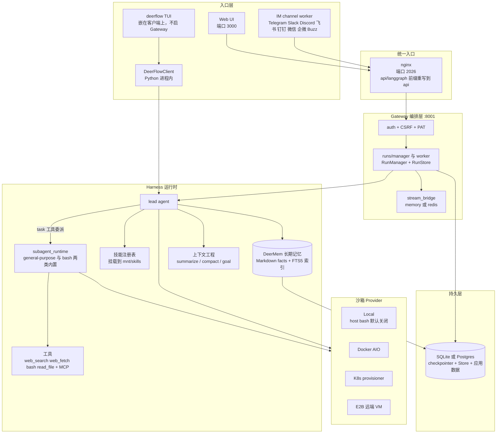
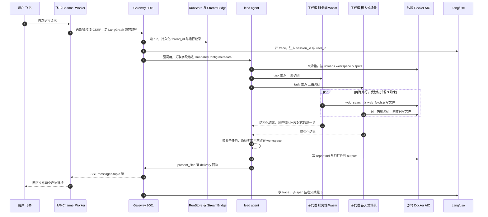

## 先给判断：难点不在推理，在预算与恢复

DeerFlow 2.0 真正解决的问题，不是"让单个智能体（agent）推理得更聪明"，而是把一件要跑几十分钟甚至几小时的事情，改造成一个可观察、可中断、可恢复、可计费的执行过程。模型负责思考，这套代码负责给思考配上文件系统、隔离环境、委派预算和跨会话记忆。

这也是为什么 2.0 是重写而不是加功能。v1 是一台深度研究（Deep Research）流水线：进去一个问题，出来一份报告。v2 是一台通用运行时，报告只是它顺手产出的一种文件。用这一条标准去看 v2 的任一特性都够用：它是在让单次推理更强，还是在让"跑很久"这件事变得可控。前者大部分取决于你接的模型，后者才是这个仓库真正在积累的代码。

本文把两条线分开写：v2.0.0（截至 2026-09-19 唯一的 GitHub Release，发布于 2026-06-25）与同一天的 `main` 分支（源码版本 2.1.0-rc0）。分开写不是为了拉长篇幅，差异本身就是结论。v2.0.0 的 README 用"一次研究任务可能散成十几个子代理"来描述并行能力；不到三个月后，同一份文档改成了"用最少数量的子代理，而不是因为任务大或者步骤多就散开"，并且给委派加上了硬性预算。一个长时智能体框架最诚实的成长，不是把并行做得更猛，而是把"能并行"收敛成"知道什么时候不该并行"。

## 目录

- [先给判断：难点不在推理，在预算与恢复](#先给判断难点不在推理在预算与恢复)
- [版本与仓库快照](#版本与仓库快照)
- [系统地图](#系统地图)
- [从 v1 到 v2：分叉点在抽象](#从-v1-到-v2分叉点在抽象)
- [子代理：从"一把散开"到"有预算的委派"](#子代理从一把散开到有预算的委派)
  - [默认预算就是这几个数](#默认预算就是这几个数)
  - [口径变了，而且是往回收](#口径变了而且是往回收)
  - [词元归因为什么是可运营的前提](#词元归因为什么是可运营的前提)
- [LangGraph 底座与 Gateway 运行态](#langgraph-底座与-gateway-运行态)
  - [三个模块各管一段](#三个模块各管一段)
  - [重启之后运行还在](#重启之后运行还在)
  - [单 worker 是默认值，不是天花板](#单-worker-是默认值不是天花板)
  - [追踪关联字段](#追踪关联字段)
- [沙箱：四类 Provider 与一份路径契约](#沙箱四类-provider-与一份路径契约)
- [技能：一个目录、一份 SKILL.md、一层工具白名单](#技能一个目录一份-skillmd一层工具白名单)
- [上下文工程：四条机制](#上下文工程四条机制)
- [长期记忆 DeerMem：跨会话那一层](#长期记忆-deermem跨会话那一层)
- [一次任务怎么流过系统](#一次任务怎么流过系统)
- [v2.0.0 改进清单：只挑与"能不能生产用"相关的](#v200-改进清单只挑与能不能生产用相关的)
- [2.0.0 之后 main 上新增的能力面](#200-之后-main-上新增的能力面)
- [怎么读它的性能数字](#怎么读它的性能数字)
- [部署上手](#部署上手)
- [按现象排查](#按现象排查)
- [采用顺序与决策建议](#采用顺序与决策建议)
- [结尾判断](#结尾判断)
- [下一步读哪份代码](#下一步读哪份代码)
- [自测题](#自测题)
- [资料口径与复核方法](#资料口径与复核方法)
- [参考资料](#参考资料)

## 版本与仓库快照

| 项 | 值 |
| --- | --- |
| 仓库 | [bytedance/deer-flow](https://github.com/bytedance/deer-flow)，创建于 2025-05-07 |
| 许可与语言 | MIT；后端 Python，前端 TypeScript |
| 星数 / 复刻数 | 82,676 / 11,418，2026-09-19 由 GitHub 仓库元数据 API（应用程序接口）读到 |
| 发布物 | 只有一个 GitHub Release：v2.0.0，2026-06-25 发布 |
| 标签 | `v2.0-m0`、`v2.0-m1-rc0..rc3`、`v2.0.0-rc0/rc1`、`v2.0.0`、`v2.1.0-rc0` |
| 源码版本 | `backend/pyproject.toml` 与 `frontend/package.json` 均为 2.1.0-rc0 |
| 运行门槛 | Python 3.12+、Node 22+、pnpm 10.26.2、Docker Compose v2.24+ |
| 活跃度 | 2026-06-26 至 2026-09-19 合并 968 个 PR；开放 issue 509 个，开放 PR 381 个 |
| 热度 | README 自述 2026-02-28 因 v2 发布登上 GitHub Trending 第一 |

968 这个数同时是这份文档的保质期警告：下文凡是带文件路径、配置默认值的断言，都只对 2026-09-19 的提交树负责。复核命令写在[资料口径与复核方法](#资料口径与复核方法)一节，重跑一遍大约十分钟。

## 系统地图


```mermaid
flowchart TB
    subgraph Entry["入口层"]
        WEB[Web UI<br/>端口 3000]
        EMB[DeerFlowClient<br/>Python 进程内]
        TUI[deerflow TUI<br/>嵌在客户端上，不启 Gateway]
        IMC[IM channel worker<br/>Telegram Slack Discord 飞书 钉钉 微信 企微 Buzz]
    end

    subgraph Edge["统一入口"]
        NG[nginx<br/>端口 2026<br/>api/langgraph 前缀重写到 api]
    end

    subgraph Gwy["Gateway 编排层 :8001"]
        RUN[runs/manager 与 worker<br/>RunManager + RunStore]
        BR[stream_bridge<br/>memory 或 redis]
        AU[auth + CSRF + PAT]
    end

    subgraph Har["Harness 运行时"]
        LEAD[lead agent]
        SUB[subagent_runtime<br/>general-purpose 与 bash 两类内置]
        SKL[技能注册表<br/>挂载到 mnt/skills]
        TLS[工具<br/>web_search web_fetch bash read_file + MCP]
        MEM[(DeerMem 长期记忆<br/>Markdown facts + FTS5 索引)]
        CTX[上下文工程<br/>summarize / compact / goal]
    end

    subgraph Sbx["沙箱 Provider"]
        LOC[Local<br/>host bash 默认关闭]
        AIO[Docker AIO]
        PRV[K8s provisioner]
        E2B[E2B 远端 VM]
    end

    subgraph Per["持久层"]
        DB[(SQLite 或 Postgres<br/>checkpointer + Store + 应用数据)]
    end

    WEB --> NG
    IMC --> NG
    NG --> AU
    AU --> RUN
    TUI --> EMB
    EMB --> LEAD
    RUN --> LEAD
    RUN --> BR
    RUN --> DB
    LEAD -->|task 工具委派| SUB
    LEAD --> SKL
    LEAD --> CTX
    LEAD --> MEM
    SUB --> TLS
    SUB --> Sbx
    LEAD --> Sbx
    MEM --> DB
```

读这张图要先分清三条不等高的主线，把它们讲成一条故事线是这类文章最常见的失真：

- **入口层**不止浏览器。Web UI、终端工作台（TUI）、IM channel worker、进程内 `DeerFlowClient` 四条入口共用同一套 Gateway 路由与同一份 `config.yaml`；其中 TUI 和嵌入式客户端根本不经过 Gateway，直接跑在 `DeerFlowClient` 上。
- **Harness 层**是产品本体。主代理、子代理运行时、技能注册表、工具集、记忆和上下文压缩打包成一个可长期复用的执行体，而不是一条提示词（prompt）链。
- **沙箱与持久层**决定它能不能给别人用。四类 Provider 决定隔离强度，`database.backend` 一个选项同时决定 checkpointer（检查点存储）、Store 和应用数据落在 SQLite 还是 Postgres 上。

## 从 v1 到 v2：分叉点在抽象

README 把这次转向讲得很直白：v1 是一个深度研究框架，社区把它用去了研究之外的地方——数据管道、幻灯片、仪表盘、内容自动化。作者从中读出的结论不是"再加几个模板"，而是"这东西本来就是个运行时"。

于是 2.0 从零重写，与 1.x 不共享任何代码；v1 留在 `main-1.x` 分支上继续接受维护，这条写在 Release notes 与 README 顶部的提示块里。落到工程取舍上：

| 维度 | v1 形态 | v2 形态 |
| --- | --- | --- |
| 核心抽象 | Deep Research workflow | SuperAgent harness（智能体运行时） |
| 代理模型 | 单条研究流水线 | lead agent + 可委派子代理 |
| 任务尺度 | 一轮研究到一个报告 | 分钟级到小时级 |
| 能力扩展 | 内置工具 + LangChain Tool | `SKILL.md` 渐进加载 + MCP 服务器 |
| 记忆 | 会话上下文 | 跨会话 DeerMem |
| 执行环境 | 可选 | 沙箱是一等公民，Provider 化 |
| 使用入口 | Python 包 | Web UI + TUI + IM + HTTP API + 嵌入式客户端 |
| 运行态 | 无持久运行记录 | RunStore 持久化 + SSE 可重连 |

v2 的设计原则可以从这张表里读出来：**子代理、沙箱、记忆、技能、通道这几条主线都和 lead agent 同级，而不是嵌在某一个具体任务里**。这也是"harness"和"framework"的分别——框架等你把它接起来，运行时已经接好了，你可以拆。

## 子代理：从"一把散开"到"有预算的委派"

子代理（sub-agent）是 v2 与多数"编排框架"类项目最明显的分界。一个跑几十分钟的任务通常同时意味着三件麻烦：上下文已经装不下、有些事可以并行、彼此的想法不该互相污染。v2 的答案是主代理在运行时按需委派，每个子代理独立持有：

- **上下文**。README 说得很硬：子代理看不到主代理和其他子代理的上下文，隔离是为了让它专注，不是为了省词元（token）的副产品。
- **工具与技能白名单**。内置类型只有 `general-purpose` 和 `bash` 两种，自定义类型在 `subagents.custom_agents` 下声明各自的 prompt、工具、技能和模型；默认继承主代理选的模型。
- **终止条件**。见下面的默认值。
- **不共享父运行的 checkpointer**。这是 v2.0.0 修的（#3559），在此之前子代理的写入会挂到父运行的检查点链上。

### 默认预算就是这几个数

`config.example.yaml` 给的默认值比任何宣传语都更能说明作者预期一个任务跑多远：

| 配置 | 默认值 | 含义 |
| --- | --- | --- |
| `subagent_runtime.max_running` | 3 | 进程内同时运行的子代理数，排队不占槽 |
| `subagent_runtime.max_queued` | 64 | 队列上限，`admission_policy` 可为 `queue` 或 `reject` |
| `subagent_runtime.queue_timeout_seconds` | 300 | 排队等待上限 |
| `subagents.timeout_seconds` | 1800 | 内置子代理的超时，即 30 分钟；自定义代理默认 900 |
| `subagents.max_turns` | general-purpose 150 / bash 60 | 一轮 = 一次模型调用加它跑的工具 |
| `subagents.max_total_per_run` | 6 | 一次主代理运行允许的委派总次数，取值 1–50 |
| `subagents.token_budget.max_tokens` | 2,000,000 | 到硬阈值时剥掉工具调用、强制 `finish_reason=stop`，结果标记 `subagent_stop_reason=token_capped` |

`max_total_per_run` 的注释解释了它为什么存在：防止反复的规划检查点无休止地投放合法大小的批次。默认 6 恰好等于默认并发 3 的两个满批。并发 3、委派总量 6、词元上限 200 万，这三个数放在一起读，就是这套系统对"并行"的真实态度——先给额度，再谈规模。

进程级那一组在 `config.example.yaml` 里的原文示例（去掉注释）：

```yaml
subagent_runtime:
  max_running: 3
  max_queued: 64
  admission_policy: queue       # queue or reject when all slots are occupied
  queue_timeout_seconds: 300
```

四行分别是"同时跑几个""最多排多少个""排不下是等还是拒""等多久算超时"。改并发不改额度，只会让队列变长；要放量，两个都得动。

### 口径变了，而且是往回收

v2.0.0 的 README 第 645 行：

> a research task might fan out into a dozen sub-agents, each exploring a different angle, then converge into a single report — or a website — or a slide deck with generated visuals. One harness, many hands.

到了 2026-09 的 `main`，这句被删掉了，同一节换成：

> Sub-agents are an optimization, not the default response to a complex request. … The lead uses the fewest useful sub-agents and re-evaluates later batches instead of fanning out solely because a task is large or multi-step.

同一时期还加上了 durable `batch_task`（把大批独立条目放在 SQL 里跑，带总量/活跃/运行三个限额和重启恢复）、`SubagentRuntime` 显式生命周期，以及把子代理用量归因回"发起它的那一步"而不是进程级的 provider ID 缓存。

如果你的部署是照着 v2.0.0 的宣传语评估 DeerFlow 的，这段漂移值得单独注意：它不是文案修改，是把"散得开"当成卖点的那版设计，改成了"散得受控"。

### 词元归因为什么是可运营的前提

v2.0.0 的两个改动值得单独展开：**子代理的词元用量实时回流到主线程头部**（#2882），**子代理的 span 归因到父线程的 Langfuse trace**（#3611）。没有这两条时，长时任务在 IM 里就是一个黑盒"跑了几分钟"；有了它们：

- 前端能看到累计消耗，以及每个子代理卡片的模型与合计数（Provider 返回 usage 元数据时）。
- 成本可以落到具体子任务，而不是"这次一共烧了多少"。
- Langfuse 上点开父 trace 能下钻到各子 span 的耗时与用量。

这就是把"可观测"和"可计费"分开的界线：能看见日志不等于能算账。

## LangGraph 底座与 Gateway 运行态

选 LangGraph 不是随大流，两个理由各自对应一类事故：

1. **状态可恢复**。长任务必须能在进程重启后接着讲道理，`thread_id` 级别的检查点持久化是现成的抽象。
2. **流式协议统一**。`messages-tuple` 这类 SSE（Server-Sent Events，服务器推送事件）流模式可以直接驱动 Web UI、TUI 和 IM 的渲染，不必为每个入口造一套增量协议。

### 三个模块各管一段

| 模块 | 位置 | 管什么 |
| --- | --- | --- |
| 运行管理 | `backend/packages/harness/deerflow/runtime/runs/manager.py` | 运行记录、按 `thread_id` 索引 |
| 运行执行 | `backend/packages/harness/deerflow/runtime/runs/worker.py` | `run_agent()`，图调用的入口 |
| 运行持久化 | `backend/packages/harness/deerflow/runtime/runs/store/` | `RunStore`，`memory` / JSONL / DB 三种后端 |
| 流桥 | `backend/packages/harness/deerflow/runtime/stream_bridge/` | SSE 分发与重连，`memory` / `redis` 两种 |
| 嵌入式客户端 | `backend/packages/harness/deerflow/client.py` | `DeerFlowClient`，与 Gateway 对齐的返回结构 |

Gateway 本身在 `backend/app/gateway/`，是 FastAPI 应用，监听 8001；前端 3000；nginx 在 2026 上给浏览器一个同源入口。LangGraph 兼容路径的翻译就一行（`docker/nginx/nginx.conf:80`）：

```nginx
location /api/langgraph/ {
    rewrite ^/api/langgraph/(.*) /api/$1 break;
    proxy_pass http://$gateway_upstream;
}
```

### 重启之后运行还在

v2.0.0 有一条 breaking change 很容易被略过：运行改为从 `RunStore` 水合（hydrate）并持久化 `interrupted` 状态，取消操作必须由持有该运行的 worker 执行，跨 worker 的取消返回 409 而不是静默成功（#2932）；重启后从持久化存储恢复历史运行（#2989）。这条组合把"Gateway 进程"和"任务生命周期"解耦了——在此之前，重启等于把内存里的运行状态一起丢掉。

### 单 worker 是默认值，不是天花板

关于 `GATEWAY_WORKERS` 的说法在 2026 年 6 月到 9 月之间变了一次，值得分段写清楚。

v2.0.0 之所以把 Docker Gateway 默认设成 `GATEWAY_WORKERS=1`（#3475），是因为多 worker 会破坏运行取消、SSE 重连、请求去重和 IM 通道——那时 nginx 没有会话粘滞，进程内也没有共享的流桥。

`main` 上多 worker 已经是受支持的路径，但条件写得很明确：**Postgres + `stream_bridge.type: redis` + `run_ownership.heartbeat_enabled: true` + `run_events.backend: db`**，四件一起配。进程内的 memory 与 JSONL 事件存储无法跨 worker 强制单例投递回执；租约心跳让死掉 worker 的运行被判为错误；非属主 worker 也能落地取消请求，由属主 worker 在续约时执行正常取消流程，取消延迟因此以心跳间隔为上界。

三个仍然要单进程的角落：

- **Agentic Browser 工具组**。浏览器会话是进程内的，开了它就保持 `GATEWAY_WORKERS=1`。
- **IM channel 状态**，README 明确说这部分仍需自己做多 worker 协调。
- **多 worker 共享 Docker/AIO 或 E2B 沙箱**时还要配 `sandbox.ownership.type: redis`，否则孤儿回收可能杀掉活着的对端的沙箱。

### 追踪关联字段

`session_id` = LangGraph 的 `thread_id`，`user_id` = `get_effective_user_id()`（无鉴权模式下回落到 `default`），`trace_name` = assistant id（默认 `lead-agent`），`tags` = `[env:<DEER_FLOW_ENV>, model:<模型名>]`。这些字段注入 `RunnableConfig.metadata` 的位置是图调用根部，Gateway 路径与嵌入式路径共用同一处代码，因此任何 LangChain 兼容回调都读得到。Langfuse 的 Sessions / Users 页据此自动点亮；除 LangSmith、Langfuse 之外，`main` 还支持 Monocle（基于 OpenTelemetry 的智能体追踪器）。

IM channel worker 调的是 Gateway 的 LangGraph 兼容 API，进程内自动附带内部鉴权，以及创建线程与运行所需的跨站请求伪造防护（CSRF）cookie 与 header 配对。这一条解释了为什么它不需要公网回调地址。

## 沙箱：四类 Provider 与一份路径契约

沙箱被定义成 Provider 接口而不是某个容器实现，配置里换类即可：

| Provider | 隔离强度 | 适用 |
| --- | --- | --- |
| `LocalSandboxProvider` | 弱。文件工具映射到宿主机上的每线程目录，host bash 默认关闭 | 本地调试、完全受信环境 |
| `AioSandboxProvider`（Docker） | 中，独立容器 | 团队开发（README 推荐形态） |
| `AioSandboxProvider` + `provisioner_url`（Kubernetes） | 高，独立 Pod | 生产、多租户 |
| `E2BSandboxProvider` | 高，远端 VM | 需要弹性容量与更强故障隔离 |

E2B 是 v2.0.0 之后接进来的，`main` 上带容量策略（`wait` / `burst` / `reject`）与 Redis 容量 Hash，让 `replicas` 从"单进程上限"变成"部署级硬上限"。README 的"Sandbox Mode"小节仍然只列三种模式，这一处文档落后于代码。

路径契约固定在沙箱容器内：

```text
/mnt/user-data/
├── uploads/      # 用户上传的素材
├── workspace/    # agent 的工作目录
└── outputs/      # 最终交付物

/mnt/skills/
├── public/       # 内置技能
├── custom/       # 每用户自定义技能
└── integrations/ # 托管集成的共享技能包（如 lark-*）
```

`outputs` 不只是个约定目录：Gateway 运行的交付是强制的——本轮创建或修改的产物必须至少调用一次 `present_files`，终端的 `run.delivery` 回执要持久化成功。没产物的运行退回普通对话行为。

`LocalSandboxProvider` 的边界要读准。README 的原话是：它是"受管的工具路径边界，而不是宿主机文件系统隔离"。正因为宿主机子进程可以绕开虚拟路径映射直接寻址规范路径，**每代理的技能白名单只在 host bash 关闭（默认）时才被接受**。要让文件边界在 shell 可用时仍然成立，就得换 Docker/AIO、K8s provisioner 或 E2B。

Docker/AIO 沙箱默认为兼容性放开出站。运维可以把 `sandbox.network.mode` 设为 `isolated` 或 `allowlist`；白名单模式下支持一次性或整个沙箱生命周期的 HTTP(S) 人工批准，而私有、回环、链路本地、组播和云元数据地址永远不可批准，被拒的域名在 DNS 解析之前就被拦下。定时任务等非交互运行不会弹批准卡片，直接自动拒绝。

## 技能：一个目录、一份 SKILL.md、一层工具白名单

技能是让 DeerFlow "几乎什么都能做"的那一层。结构轻到只有一个目录和一份 `SKILL.md`——Markdown 里写工作流、最佳实践和引用资源。

**内置技能的实际名字与数量**（`skills/public/` 目录计数）：v2.0.0 有 22 个，`main` 有 23 个（新增 `skill-reviewer`）。名字是 `academic-paper-review`、`bootstrap`、`chart-visualization`、`claude-to-deerflow`、`code-documentation`、`consulting-analysis`、`data-analysis`、`deep-research`、`find-skills`、`frontend-design`、`github-deep-research`、`image-generation`、`music-generation`、`newsletter-generation`、`podcast-generation`、`ppt-generation`、`skill-creator`、`skill-reviewer`、`surprise-me`、`systematic-literature-review`、`vercel-deploy-claimable`、`video-generation`、`web-design-guidelines`。

这里要留神 README 的一处措辞。它写"内置技能覆盖 research、report generation、slide creation、web pages、image and video generation"，那是散文描述，不是目录名。想核对技能，只能数 `skills/public/` 下真正含 `SKILL.md` 的目录。

**渐进加载**是这套设计里最值得抄的一点：技能只在任务需要时载入，base prompt 里只放元数据。对上下文预算紧张的中小模型，这决定了它是"能用的框架"还是"看得见框架"。延迟发现开启时，`describe_skill` 会按意图词覆盖率给已安装技能排序，最多 256 字符、返回 5 条。

**单轮显式激活**用斜杠前缀：

```text
/data-analysis analyze uploads/foo.csv
```

激活后 `SKILL.md` 作为本轮隐藏上下文加载，base prompt 不变；已禁用的技能、自定义代理的技能白名单、以及 `/new` `/help` 这些既有通道命令的优先级都被尊重。

**`allowed-tools` 是行为约束，不是安全边界**。它只在斜杠激活、或 `read_file` 载入后被捕获进活动上下文时生效；仅仅启用或列出技能不会削减代理的工具集。生效后它同时过滤模型可见的工具结构定义（schema）和实际执行，而框架发现类工具（`tool_search`、`describe_skill`）保留——发现不等于授权。`task` 不享有豁免：受限技能要显式写它才能委派。注册表失败或活动集合里没有一个技能有效时，回落到框架安全工具（fail closed）。

`SKILL.md` 的 frontmatter 由 `backend/packages/harness/deerflow/skills/frontmatter.py` 的 `ALLOWED_FRONTMATTER_PROPERTIES` 定白名单，共 11 个键：`name`、`description`、`license`、`allowed-tools`、`argument-hint`、`required-secrets`、`secrets-autonomous`、`metadata`、`compatibility`、`version`、`author`。经 Gateway 安装 `.skill` 归档时，空格分隔的 `allowed-tools`、Claude 风格的 `argument-hint` 都能接受，`WebFetch` / `WebSearch` / `Glob` / `Grep` / `Read` 这类精确拼写会映射到 `web_fetch` / `web_search` / `glob` / `grep` / `read_file`；带括号的形式如 `Bash(tvly *)` 被当成一个字面量条目并保持不生效，因为 DeerFlow 不检查工具参数。

禁用一个技能会同时把它从沙箱的 `/mnt/skills` 视图里移除，shell 和结构化文件工具看到的是同一份启用状态。

`claude-to-deerflow` 是这套机制朝外的一端。装完之后（`npx skills add https://github.com/bytedance/deer-flow --skill claude-to-deerflow`），在 Claude Code 里用 `/claude-to-deerflow` 调度一个跑着的 DeerFlow 实例，四种执行模式：`flash`（快）、`standard`、`pro`（带规划）、`ultra`（带子代理）。

## 上下文工程：四条机制

把上下文当成有限资源来管理，是长时智能体和短对话机器人的分水岭。v2 的四条：

1. **子代理上下文隔离**：见上一节，这是最省事的一层压缩。
2. **会话内摘要与卸载**：完成的子任务被摘要，中间结果写进沙箱文件系统，只留当前决策需要的内容。`main` 上多了手动入口 `/compact`——保留可见聊天记录，但后续模型调用改用摘要加最近消息；线程有运行在飞时（包括别的 worker 持有的）该命令被忽略。聊天头部在模型配了正的 `context_window` 时会显示上下文水位。
3. **严格的工具调用恢复**：Provider 或中间件强行打断 tool-call 循环时，DeerFlow 会剥掉被强停的助手消息上的 provider 级原始工具调用元数据，并为悬空调用注入占位的 tool result 再发起下一轮。这条专门服务 OpenAI 兼容的推理模型，它们严格校验 `tool_call_id` 序列。
4. **词元用量归因**：v2.0.0 起默认开启（#2841），显示模式可调（#2329），并且按实际模型归因（#3658）。

`main` 上还多了一条与上下文有关的可选能力：`pii_redaction.enabled`（默认关闭）会对用户消息、远端工具结果、压缩输入、重注入的摘要和标题生成输入里检测到的标识符做脱敏，且不落盘 PII 映射表，因此重复值无法被回溯关联到已被压缩的来源。

## 长期记忆 DeerMem：跨会话那一层

DeerFlow 的长期记忆解决的不是"这轮别忘了"，而是"跨会话记住你的行业、偏好、技术栈和常用工作流"。它落在哪、怎么去重、怎么淘汰，`main` 上的实现比宣传语具体得多。

**存储结构**。每个用户一个 `memory.json`，只装与项目无关的 `user` 与 `history` 两份摘要；每一条事实（fact）是 `agents/{agent_name}/facts/` 下一份规范化的 Markdown 文件，路径按 `SHA-256(fact_id)` 的前两位十六进制分片。省略 `agent_name` 的调用落到保留桶 `__default__`，这个桶名不在合法自定义代理名字法里，所以真叫 `lead-agent` 的代理有自己独立的事实仓库，删自定义代理不会连带删掉记忆目录。检索默认走 SQLite 的 FTS5/BM25 适配器，派生索引放在 `.retrieval/` 下，损坏会自动重建；中文分词是可选的，装 `memory-zh` 这个 extra 才启用 jieba。

**去重有历史**，而且 Release notes 把三个记忆类 PR 挤在同一条 bullet 里，逐条对应时容易引错编号。"在 apply 时跳过重复事实条目"这句话来自 README，对应的实现是 #1193（2026-03-18 合并）；7 月的 #4599 把重复判定挪进创建的临界区内；9 月 13 日的 #5254 才加上可选的近重复门控（`memory.backend_config.fact_dedup_enabled`，相似度阈值默认 0.7、区间 0.5–1.0），它只在同一 user/agent/category 内做确定性的词与 CJK 双元组比较，作者自己声明"这不是语义等价检测"。

**写入有门**。默认 `middleware` 模式下，每条候选事实先按 scope、durability、authority 分类，只有通过确定性写入门的"用户级、描述性、可长期"事实才落盘；当前线程或项目级约束、一次性操作许可留在会话状态里。用 `memory.backend_config.prompts_dir` 覆盖内置 prompt 的部署必须给自定义模板补上新分类字段，否则门失败关闭，所有抽取驱动写入停摆，只体现在 `rejected_by_scope_gate` 指标里。

**淘汰有两种口径**。默认到 `max_facts` 后按历史遗留的"只看置信度"顺序驱逐；opt-in 的 `fact_eviction_policy: hybrid-v1` 把有界置信度（65%）、显式确认的新鲜度（25%）、查询驱动的热度（10%）合成一个分数，另有 10%（上限 10）保留给纠正槽位，并可先用 `fact_eviction_shadow_enabled` 影子评估。这一层不加模型调用，换回原策略即可回滚。

**后端可换**。DeerMem 是默认本地后端；`main` 上还给了可选的 mem0（托管平台或兼容自托管）、honcho（v3 API，服务端建用户模型，本后端不发起大语言模型（LLM）调用，也不支持事实的增删改查（CRUD））、openviking 三个。

至于它和技能的分工：技能是"知道怎么干活"，记忆是"知道你是谁、习惯怎么干"。

## 一次任务怎么流过系统

场景：用户在飞书里发一句"调研 2026 年 WebAssembly 在浏览器之外的应用现状，要一份 Markdown 报告和一份 PPT"。下图的每一步都能对应到仓库里的一个模块或一条配置。


```mermaid
sequenceDiagram
    autonumber
    participant U as 用户 飞书
    participant CW as 飞书 Channel Worker
    participant GW as Gateway 8001
    participant RS as RunStore 与 StreamBridge
    participant LA as lead agent
    participant S1 as 子代理 服务端 Wasm
    participant S2 as 子代理 嵌入式场景
    participant SB as 沙箱 Docker AIO
    participant LF as Langfuse

    U->>CW: 自然语言请求
    CW->>GW: 内部鉴权加 CSRF，走 LangGraph 兼容路径
    GW->>RS: 建 run，持久化 thread_id 与运行记录
    GW->>LF: 开 trace，注入 session_id 与 user_id
    GW->>LA: 图调用，关联字段落进 RunnableConfig.metadata
    LA->>SB: 取沙箱，挂 uploads workspace outputs
    LA->>S1: task 委派 一路调研
    LA->>S2: task 委派 二路调研
    par 两路并行，受默认并发 3 约束
        S1->>SB: web_search 与 web_fetch 后写文件
        S2->>SB: 另一角度调研，同样只写文件
    end
    S1-->>LA: 结构化结果，词元归因回发起它的那一步
    S2-->>LA: 结构化结果
    LA->>LA: 摘要子任务，原始抓取内容留在 workspace
    LA->>SB: 写 report.md 与幻灯片到 outputs
    LA->>GW: present_files 落 delivery 回执
    GW-->>CW: SSE messages-tuple 流
    CW-->>U: 回正文与两个产物链接
    GW->>LF: 收 trace，子 span 挂在父线程下
```

四个关键点：

- **委派走工具，不走硬编码**。进沙箱之前，主代理用 `task` 工具派活，而不是靠某段写死的调度提示词；技能只提供方法论（`deep-research` 的 `SKILL.md` 开头就写着"任何需要联网调研的问题先加载我"）。
- **并行受额度约束**。默认并发 3、一次运行最多 6 次委派，所以"两路调研 + 一路产出"是默认额度内的形状，再多就要显式调 `subagents.max_total_per_run` 或改用 durable `batch_task`。
- **回流靠摘要 + 文件**。子代理只把结构化结果交回，原始抓取内容留在 `/mnt/user-data/workspace/`，主代理的上下文里保留的是摘要与决策所需部分。
- **交付要落回执**。报告与 PPT 写进 `outputs` 后由 `present_files` 呈现，Gateway 校验产物路径落在同一认证用户、同一线程作用域内，再校验输出目录边界。

图上每一步都有出处。并行与汇聚的形状来自 v2.0.0 README 那句"fan out … then converge into a single report — or a website — or a slide deck"；回流与归因来自同一版本 Release notes 的"子代理词元用量实时回流到头部、span 归因到父线程的 Langfuse trace"；实现位置在 `backend/packages/harness/deerflow/subagents/` 下的 `turn_budget.py`、`token_collector.py`、`status_contract.py` 三个文件里。

## v2.0.0 改进清单：只挑与"能不能生产用"相关的

这一节不复述 Release notes，而是按"运营一个长时智能体平台会先撞上哪堵墙"来分。下面每个编号都经 GitHub API 逐个核对过标题与合并时间，一条对应一个改动。

**运行可恢复**

- `RunStore` 水合 + `interrupted` 持久化 + 跨 worker 取消返回 409（#2932，breaking）
- 重启后从持久存储恢复历史运行（#2989）、threads 端点改返回 ISO 8601 时间戳（#2599）、对已中断运行的取消改为幂等（#3058）
- 子代理与父运行 checkpointer 隔离（#3559）、超时终态写入原子化（#2583）、工具与中间件尊重模型覆盖（#2641）

**性能**

- 线程元数据过滤下推到 SQL（#2865）
- `RunManager` 按 `thread_id` 建索引、`MemoryRunEventStore` 按消息建索引，各自消掉一次 O(n) 扫描（#3499、#3531）
- 按类缓存 `Base.to_dict` 的列反射（#3654）、沙箱 glob/grep 里的 `should_ignore_name` 加速（#3657）

**安全**

- 拒绝符号链接的上传目标，Linux 与 Windows 两条路径（#2623、#2794）
- MCP 配置响应遮蔽敏感值并加固端点（#2667、#3425）
- 拒绝跨站 auth POST（#2740）
- 技能归档预览限制解压量（zip 炸弹防御，#2963）
- 宿主 Docker 的守护进程套接字（socket）只在 aio（DooD，Docker-out-of-Docker）模式下挂载（#3517）
- 默认不 bind-mount 宿主机命令行工具（CLI）的鉴权目录（#3521）
- `/mnt/user-data` 契约在 Sandbox API 边界强制、provisioner 的 PVC 数据按用户隔离（#2881、#2973）

**部署与运维**

- Docker Gateway 默认单 worker（#3475）、nginx 在请求时才解析上游名（#2717）
- 为 store/checkpointer 增加 `postgres` extra（#2584）
- `make dev` 重启后保留 `uv` extras（#2767）、停服时清理本地 nginx（#3005）、Gateway 重载时排除运行时状态（#3426）

这些条目对多用户部署是纵深防御，对单机本地开发者大多可以跳过——但"跳过"应当是你读过之后做的决定，而不是默认状态。

## 2.0.0 之后 main 上新增的能力面

968 个 PR 里，会改变采用判断的是这几组，它们都不在 v2.0.0 里：

- **Projects**：把相关会话归到一个共享名字、说明和文档架（document shelf）下。
- **Scheduled Tasks**：`/workspace/scheduled-tasks` 管理，支持 `once` / `cron` / `interval`，可钉到 `lead_agent` 或某个自定义代理，可复用线程或每次新线程；到点但线程/全局额度忙时先落成 `queued` 并跨重启存活。MVP 限制也写清楚了：还没有会话内创建的 `schedule_task` 工具、没有纯文本通知任务、没有通道或 GitHub 投递目标。
- **Session Goals**：`/goal <完成条件>` 给线程挂一个活动完成条件，每轮结束后由一个非思考的评估模型判断，必须返回带类型的阻塞原因（`missing_evidence`、`needs_user_input`、`run_failed`、`external_wait`、`goal_not_met_yet`）；只有阻塞原因是"还没达成"、线程未变动、且无进展熔断器没跳时，才注入隐藏的继续。上限默认 8 次，连续同样的无进展评估 2 次后停。
- **Agentic Browser Control**：与只读的 `web_fetch` / `web_capture` 并列的一组浏览器操作工具（`browser_navigate`、`browser_snapshot`、`browser_click` 等 8 个），每个动作返回带稳定 `[ref]` 编号的新页面快照，由 Playwright 驱动，以 optional extra 分发。
- **Capability Center 与托管集成**：插件（MCP 服务器与 Lark/飞书 集成）和技能两套目录在同一入口管理，社区页可导入 `.skill` 归档；Lark 的官方 `lark-*` 技能包由管理员装一次到 `{DEER_FLOW_HOME}/integrations/skills/lark-cli`，每个用户各自决定启用状态，配置与 OAuth 数据按用户隔离。
- **自定义代理自更新**：代理可以在普通对话里持久化修改自己的 `SOUL.md` / `config.yaml`，按用户隔离（#2713）。
- **用户自有 IM 连接**：用户在侧栏或设置里绑定自己的 Telegram、Slack、Discord、飞书/Lark、钉钉、微信、企微、Buzz 账号（#3487）。

## 怎么读它的性能数字

README 与 Release notes 里都没有跨框架 benchmark。全文带"benchmark"字样的只有两处，一处是姊妹工具 LLM Space 的功能描述，一处是 `backend/scripts/benchmark/context_snapshot/` 这个上下文快照评测脚本目录。所以任何"DeerFlow 比 CrewAI 或裸 LangGraph 快多少"的说法，在这个仓库里都找不到出处。

能拿到手的量化信息只有三类：

1. **默认额度**：并发 3、每运行 6 次委派、子代理 30 分钟超时、词元上限 200 万。它们透露作者对"一次正常任务"的预期，也说明默认配置根本不是为了"一次散开 20 个代理"设计的。
2. **索引类改动**：#3499、#3531、#2865 消掉的是 `thread_id`、消息、元数据过滤上的线性扫描。这类优化的收益随线程和运行数增长，所以判断它是否影响你，取决于你有多少历史线程，而不是它属于"性能优化"这个标题。
3. **可自查的量**：上下文水位（需要给模型配 `context_window`）、每个子代理卡片的累计词元、`make support-bundle` 产出的脱敏诊断。

不能从这些数字里推出来的结论同样重要：推不出任务完成质量、推不出对某类模型的工具调用成功率、也推不出多实例部署的横向扩展能力——最后一项取决于是否配齐了那四件套。

## 部署上手

先按 Docker 走。macOS 与 Windows 被官方定位为开发/评估环境，长期运行的服务器建议 Linux + Docker；CPU 或内存持续打满时，官方给的顺序是先降并发运行数，再考虑升配。

```bash
git clone https://github.com/bytedance/deer-flow.git
cd deer-flow

make setup         # 交互式向导：LLM provider、可选联网搜索、沙箱与执行安全偏好，约 2 分钟
make doctor        # 验证配置并给出可执行修复提示
make config        # 可选：直接拷完整模板 config.example.yaml 而非走向导
make docker-init   # 拉沙箱镜像（一次或镜像更新时）
make docker-start  # 启服务，沙箱模式从 config.yaml 自动检测

# 打开 http://localhost:2026
```

生产形态用 `make up` / `make down`：本地构建镜像、挂载运行时配置与数据，`make up` 会等 Gateway 的 `/health`，超时则非零退出并打印容器状态与最近的 Gateway 日志。持久部署要把 `database.backend` 设为 `sqlite` 或 `postgres`，它同时决定 checkpointer、Store 和应用数据落在哪。

不用 Docker 的本地开发路径：

```bash
make check          # 校验 Node 22+、pnpm、uv、nginx
make install        # 装后端 + 前端依赖和 pre-commit hooks
make setup-sandbox  # 可选：预拉沙箱镜像
make dev            # 启服务，端口 8001 / 3000 / 2026
```

只想待在终端里：

```bash
uv pip install 'deerflow-harness[tui]'   # README 原文；见下方警告

deerflow                    # 启动 TUI（需要 TTY）
deerflow --continue         # 恢复最近的线程
deerflow --resume THREAD    # 按 id 恢复
deerflow --print "summarize this repo"   # 一次性输出到 stdout
deerflow --json "hello"                  # 一次性 NDJSON StreamEvents
```

TUI 是嵌在 `DeerFlowClient` 上跑的，不需要 Gateway、前端、nginx 或 Docker，但吃同一份 `config.yaml`、checkpointer、技能、记忆、MCP 和沙箱配置；在 TUI 里开的会话会出现在 Web UI 侧栏，因为两者写同一个线程存储。

> **一处需要修正的官方命令**：截至 2026-09-19，`uv pip install 'deerflow-harness[tui]'` 装不上。`pypi.org/pypi/deerflow-harness/json` 与 `pypi.org/simple/deerflow-harness/` 都返回 404（同期 `requests`、`langgraph` 返回 200，可排除网络因素），`.github/workflows/` 里 16 个工作流没有一个负责发布到 PyPI。包名与版本在仓库里是齐的（`backend/packages/harness/pyproject.toml` 声明 `name = "deerflow-harness"`、`version = "2.1.0"`），缺的是发布这一步。走源码安装可以绕开：在克隆下来的仓库里装 `backend/packages/harness`，再装可选依赖 `textual`。

当作 Python 库嵌进来：

```python
from deerflow.client import DeerFlowClient

client = DeerFlowClient()

# 同步一轮
resp = client.chat("分析这篇论文", thread_id="my-thread")

# 流式（LangGraph SSE 协议：values / messages-tuple / end）
for event in client.stream("hello"):
    if event.type == "messages-tuple" and event.data.get("type") == "ai":
        print(event.data["content"])

# 配置与管理，返回与 Gateway 对齐的 dict
client.list_models()                        # {"models": [...]}
client.list_skills()                        # {"skills": [...]}
client.update_skill("web-search", enabled=True)
client.upload_files("thread-1", ["./report.pdf"])
client.set_goal("thread-1", "make all tests pass")
```

这些方法的返回结构在 CI 里逐个与 Gateway 的 Pydantic 响应模型比对（`TestGatewayConformance`），所以嵌入式客户端和 HTTP API 的响应结构不会各自漂移。对打算把它接进自己系统的人，这条自动化约束比任何兼容性承诺都实在。线程 id 允许自定义，但必须匹配 `^[A-Za-z0-9_-]{1,64}$`；不传或传 `None` 时 DeerFlow 才生成 UUID。

## 按现象排查

下面每条都指回仓库里的一处说明或一段实现，遇到再查比凭印象试快。

- **2026 端口连不上，或 Docker 命令报 `permission denied … /var/run/docker.sock`**：Linux 上把用户加进 `docker` 组并重新登录。另一侧的常见原因是 Compose 版本，`docker/docker-compose-dev.yaml` 用了可选的 `env_file` 语法，Compose v2.24 以下的客户端解析不了。
- **`make dev` 起不来**：项目根必须有有效 `config.yaml`（可用 `DEER_FLOW_PROJECT_ROOT` 或 `DEER_FLOW_CONFIG_PATH` 显式指定），先跑 `make doctor`。Windows 上必须从 Git Bash 跑，`cmd.exe` 与 PowerShell 不支持这些 bash 服务脚本。
- **登录成功但刷新掉线**：浏览器登录用 `HttpOnly` cookie，"保持登录"只在 HTTPS（含可信的 `X-Forwarded-Proto: https`）或 localhost 下延长会话；公网 HTTP 部署默认回落成会话 cookie。跨源或端口转发的客户端要设 `GATEWAY_CORS_ORIGINS`，否则同源默认不发 CORS 头。
- **上传的文件在沙箱里看不到**：`AioSandboxProvider` 自己探测线程数据挂载，本地容器用挂载目录、远端 provisioner 走显式同步。`sandbox.thread_data_mounts` 只在两侧确实共享目录时才设 true，设错就会让上传文件在沙箱里不可用。
- **子代理像没在并行**：先看 `subagent_runtime.max_running`（默认 3）和一次运行的词元是否已接近 `token_budget.max_tokens`，被预算封顶的完成会带 `subagent_stop_reason=token_capped`。再看 Langfuse 父 trace 下有没有子 span（依赖 #3611 起的功能）。
- **技能启用了却没起作用**：`allowed-tools` 只在斜杠激活或被 `read_file` 载入后生效；如果指望它限制代理工具集，还要确认该技能确实在活动上下文里。委派没发生往往是因为受限技能没显式列出 `task`。
- **记忆一条都不写**：先分清两处。一是覆盖过 `memory.backend_config.prompts_dir`——写入门失败关闭，自定义模板缺新分类字段会让抽取驱动的全部写入停摆，只体现在 `rejected_by_scope_gate` 指标里；二是这个代理的 `users/{user_id}/agents/{name}/config.yaml` 里写了 `memory_enabled: false`，那属于按设计不排队更新，也不报错。
- **注入了记忆但内容不对**：`middleware` 模式注入用户级摘要加所选代理的事实，`tool` 模式的自动块只含 `user` 与 `history` 两份摘要、事实要靠 `memory_search` 显式取。两种模式混不清时先看 `memory.mode`。
- **多 worker 下 SSE 断流、取消返回 409**：检查是否只加了 worker 而没配那四件套（Postgres、Redis 流桥、租约心跳、`run_events.backend: db`）。内存或 JSONL 事件存储不能跨 worker 强制单例投递。
- **想访问被拦**：出站策略拒绝私有、回环、链路本地、组播和云元数据地址，且这些地址不可人工批准；被拒域名在解析前就拒。要放行业务域名走 `sandbox.network.mode: allowlist`。
- **担心越权**：把 Gateway 管理员当成"等于在宿主上执行代码"来对待。管理员可以注册 stdio MCP 服务器，它们在 Gateway 容器里跑命令，虽然有 `npx`、`uvx` 白名单（经 `DEER_FLOW_MCP_STDIO_COMMAND_ALLOWLIST` 扩展）并拒掉会求值任意代码的参数和环境变量，官方仍明确写"这是纵深防御，不是边界"。

## 采用顺序与决策建议

**第 0 步：先在本地跑 30 分钟。** `make setup` 里挑一个模型（官方推荐 Doubao-Seed-2.0-Code、DeepSeek v3.2、Kimi 2.5，来自 README 的 Coding Plan 一节），沙箱选 Docker aio，跑一条"调研 X → 出报告 → 出 PPT"。看两件事：Langfuse 的 Sessions / Users 有没有点亮，`outputs` 里的产物有没有落 `present_files` 回执。

**第 1 步：接一个 IM 通道。** 中文团队走飞书或钉钉成本最低，因为 worker 是从进程内调 Gateway，不需要公网回调。跑通 `/new` `/status` `/models` `/memory` `/agent list` `/help`，然后确认子代理的卡片能显示模型与累计词元。

**第 2 步：接一件真业务。** 准备一个业务 `SKILL.md`（写工作流和边界）加一个内部 API 的 MCP 服务器，先在 `LocalSandboxProvider` 跑通语义，再切 Docker/AIO。这一步就把 host bash 保持关闭，别顺手打开它。

**第 3 步：再谈多人自托管。** 依次是：`/setup` 建管理员（非纯回环部署必须第一时间做）、`BIND_HOST` 与 IP 白名单或反代预认证、`channel_connections` 让用户自绑 IM、`database.backend: postgres`、需要多实例时配齐四件套并加 `sandbox.ownership.type: redis`。若启用了浏览器工具组，worker 数回到 1。

**不急着上的团队**：没有明确的多步长任务需求（用 Chat Completions 更直接）；对 LangGraph 的检查点与 SSE 语义完全陌生（学习曲线会吃掉收益）；把"多个 agent 一起跑"当成 KPI 本身（默认预算就是为拦这种用法设的）。

**可以先等的场景**：只要一个对话入口 + 几个只读工具；延迟敏感；或者合规上要求每个动作都有人审批——这套运行时的自主性反而是要削减的东西。

## 结尾判断

DeerFlow 2.0 的工程价值不在"推理最强"——那由模型决定——而在于它把长时任务的三个无聊问题做成了配置项和可恢复状态：委派要有额度、重启不能丢运行、花掉的词元要能算到具体子任务。它也不是"框架"，README 那句话讲得比多数宣传语准确：不再是拿来接线的那个框架，而是一个已经接好、可以拆开的运行时。

从 2.0.0 到今天的 968 个 PR 里，最值得读的不是新增的功能面，而是那段收敛：从"十几个子代理散开"到"用最少的子代理"，从"默认必须单 worker"到"配齐四件套可以多实例"。一个开源智能体项目走到第二版就开始给自己设上限，说明它的作者已经在被真实用户的使用方式教育了——这对正在选型的人来说是好消息。

反过来说：如果你只需要一个带工具的问答入口，DeerFlow 明显过度设计。沙箱、RunStore、租约心跳这三样，没有长任务时全是净负担。

官方站 [deerflow.tech](https://deerflow.tech) 有可点的演示；仓库在 [github.com/bytedance/deer-flow](https://github.com/bytedance/deer-flow)。

## 下一步读哪份代码

按问题去读，比按目录浏览快：

- `backend/AGENTS.md` 与它的下级树：整仓 30 份 `AGENTS.md`，`backend/` 下 26 份。v2.0.0 时 `backend/CLAUDE.md` 是一份 720 行的架构文档，今天它只剩 5 行，内容搬进了 `AGENTS.md` 树，`CLAUDE.md` 保留为 Claude Code 的引用入口。README 的文档链接仍写作 `backend/CLAUDE.md`，点进去看到的是那句迁移说明。
- `backend/packages/harness/deerflow/runtime/runs/manager.py`、`worker.py`：运行生命周期与取消归属。想验证"重启后运行还在"，读 `runs/store/` 的抽象与实现，再看 `run_events.backend` 的 `memory` / `jsonl` / `db` 三个取值。
- `backend/packages/harness/deerflow/subagents/`：`turn_budget.py`（轮次预算）、`token_collector.py`（用量归集）、`status_contract.py`（状态契约）三个文件的名字就是这条主线的接口。
- `backend/packages/harness/deerflow/skills/frontmatter.py`、`catalog.py`、`permissions.py`：技能白名单键、目录发现与 `allowed-tools` 的实际语义。
- `backend/packages/harness/deerflow/community/`：25 个提供方包都在这里，`aio_sandbox` 与 `e2b_sandbox` 两个沙箱 Provider 同 `infoquest`、`brave`、`searxng`、`tavily`、`exa`、`jina_ai`、`firecrawl` 等搜索/抓取实现并列。换 Provider 时抄的是一份现成接口。
- `backend/packages/harness/deerflow/agents/memory/backends/`：DeerMem 与 mem0 / honcho 各在一层，`config.example.yaml` 里 `memory.*` 的注释比文档更细。
- `config.example.yaml`：3,068 行，但它是唯一同时讲清默认值和失败行为的文件。查任何默认值从这里开始。
- `docker/nginx/nginx.conf`：路由与流式代理的全部真相，`/api/langgraph/` 的重写规则只有一行。
- `CHANGELOG.md` / `CHANGELOG_zh.md`：Release notes 的完整版，v2.0.0 页面上的条目是它的一部分。
- `SECURITY.md` 与 README 的安全声明节：把"管理员等于代码执行"这条读一遍再决定给谁开账号。

## 自测题

回答不上来的，按下一节的命令去仓库里复核，不必相信本文的转述。

1. v2.0.0 与 v1 的分叉发生在哪一层抽象上？为什么"加了子代理"不足以描述这次改动？
2. `max_running: 3`、`max_total_per_run: 6`、`timeout_seconds: 1800` 这三个默认值合起来在说什么？要把一次任务放到 20 路调研上，该动哪几个配置、又为什么可能不如改用 durable `batch_task`？
3. 为什么 `LocalSandboxProvider` 下 host bash 与每代理技能白名单不能同时成立？换成哪个 Provider 就没这个约束？
4. 一个部署把 `GATEWAY_WORKERS` 从 1 改到 4，最少还要动哪四项配置才能不破坏取消与 SSE 重连？哪两处即使配齐了也仍要求单 worker？
5. 记忆一条都不写、且没有任何报错，最可能的两处原因是什么？分别用什么指标或哪个文件确认？

## 资料口径与复核方法

本文全部断言在 2026-09-19 依据下列一手来源核对，未采用二手转述：

- **仓库结构、默认值与文件位置**：`git clone --depth 1 --filter=blob:none --no-checkout` 只取提交树（`main` 3,019 个文件），再用 `git ls-tree` 数目录、`git show HEAD:<path>` 按需取文件。技能数取自 `skills/public/` 下含 `SKILL.md` 的目录计数（`main` 23、`v2.0.0` 22）。
- **历史版本口径**：单独取 `v2.0.0` 标签的 `README.md`（780 行）与 `skills/public`，避免把分支头当发布物。第 645 行那句"fan out into a dozen sub-agents"只存在于 v2.0.0，`main` 已删。
- **发布物与 PR 编号**：GitHub Releases API 显示只有 1 个 Release（v2.0.0，2026-06-25T16:23:22Z）；文中 40 余个 PR 逐个经 `GET /repos/bytedance/deer-flow/pulls/<n>` 核对标题与 `merged_at`。Release notes 把 #2627、#2941、#3252 并列在同一条记忆类修复里，其中 #2941 的标题是 `fix(memory): isolate queued memory updates by agent`，与"跳过重复事实"无关，后者的实现是 #1193。
- **仓库级数字**：GitHub Repos API 于 2026-09-19 读到 82,676 星、11,418 复刻、346 watchers、441 贡献者；issue 与 PR 分列用 Search API 的 `type:issue` / `type:pr`，开放数分别为 509 与 381（`open_issues_count` 是两者之和，不加区分地引用会出错）。
- **包分发**：PyPI 的 JSON API 与 simple 索引分别对 `deerflow-harness` 返回 404，同期 `requests`、`langgraph` 返回 200；`.github/workflows/` 下 16 个工作流无发布用工作流。

三处未能定案，显式保留：

- **`deerflow-harness` 的发布渠道**：不能排除它发布在 PyPI 之外的私有索引，仓库里能找到的是包定义而非发布配置。文中把源码安装写成可执行路径，但不声称它是官方唯一路径。
- **968 这个 PR 数**：按 `is:pr is:merged merged:>=2026-06-26` 检索得到。v2.0.0 的发布时间是 06-25 16:23 UTC，所以这个数少算了发布时刻到当日 UTC 零点之间合入的那部分。
- **TUI 与 Scheduled Tasks 的实际行为**：本文只描述 README 与 `config.example.yaml` 声明的语义和默认值，未在本机跑通这两条路径，因此不提供运行级验证。

失效条件：仅 2026-09-17 之后的两天多里就合入了 56 个 PR，9 月截至 19 日累计 288 个。以下断言最先过期——内置技能数与名字、子代理默认额度、多 worker 所需配置组合、`deerflow-harness` 是否已上 PyPI、`backend/CLAUDE.md` 的形态。重核顺序就是上面那五条命令，先数目录再读 `config.example.yaml`。

## 参考资料

- 仓库与 README、README_zh、SECURITY.md：<https://github.com/bytedance/deer-flow>
- v2.0.0 Release notes（含 PR 编号与 breaking change）：<https://github.com/bytedance/deer-flow/releases/tag/v2.0.0>
- 1.x 维护分支：<https://github.com/bytedance/deer-flow/tree/main-1.x>
- 完整变更日志：`CHANGELOG.md` / `CHANGELOG_zh.md`
- 配置参考（默认值主要来源）：`config.example.yaml`、`backend/docs/CONFIGURATION.md`
- 后端架构指南：`backend/AGENTS.md` 及其子目录同名文件
- API 与嵌入客户端：`backend/docs/API.md`、`backend/packages/harness/deerflow/client.py`
- IM 通道连接与 TUI 指南：`backend/docs/IM_CHANNEL_CONNECTIONS.md`、`backend/docs/TUI.md`
- 官方站点与演示：<https://deerflow.tech>
- InfoQuest（BytePlus 自研的搜索与爬取工具集）：<https://docs.byteplus.com/en/docs/InfoQuest/What_is_Info_Quest>
- 姊妹项目 LLM Space：<https://github.com/deer-flow/llm-space>
