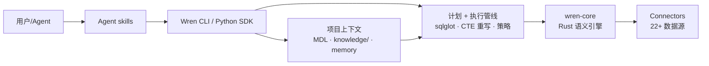

# WrenAI：让 AI Agent 真正可信任的 GenBI Context Layer

## 一句话判断

Agent 写 SQL 的瓶颈早就不是语法，而是它不知道 `net_revenue` 和 `gross_revenue` 差在哪、`status = 4` 是什么意思、哪两张表可以 join。WrenAI 把这些业务含义做成一层**可审查、可版本化的 context layer**——语义模型（MDL）、业务规则（`knowledge/rules/`）、已验证的 NL→SQL 样例（`knowledge/sql/`）全部是 Git 里的 YAML 和 Markdown 文件，SQL 生成前后各有一道校验关卡。README 对它的定位一句话：open-source GenBI for AI agents——不是再造一个聊天 BI，而是给 Claude Code、Cursor、MCP client 这些已有的 Agent 当底座。

## 项目速览

- **仓库**：[Canner/WrenAI](https://github.com/Canner/WrenAI)，17,794 stars / 2,035 forks（GitHub API，2026-10-02 读数），主代码 Python，语义引擎 wren-core 为 Rust
- **最新版本**：wren-v0.15.0（2026-09-21 发布），PyPI `wrenai` 0.15.0，要求 Python ≥ 3.11
- **协议**：多协议。`core/`、`sdk/`、`skills/`、`examples/` 和根目录文件为 Apache-2.0，`docs/` 为 CC BY 4.0；LICENSE 文件同时预告未来可能引入 AGPL-3.0 模块——所以 GitHub API 的 license 字段显示 NOASSERTION。商用前按路径确认
- **数据源**：官方口径 22+，PostgreSQL、MySQL、BigQuery、Snowflake、ClickHouse、Databricks、Redshift、Oracle、Trino、DuckDB（内置）等，另可用 dlt 接 SaaS 源
- **形态变化**：2026-05-07 Wren Engine 合并进主仓库（`core/`），旧的 Docker chat-first BI 迁到 `legacy/v1` 分支，改名 Wren GenBI Classic（tag `v1-final`），不再有新功能和安全修复

## 系统地图

WrenAI 官方架构文档把它分成四层：

| 层 | 责任 | 对应实现 |
|----|------|----------|
| Agent workflow | 用 skill 指导 Agent 按顺序做 onboarding、生成 MDL、查询、验证、更新 memory | `wren skills` 系列命令 + `npx skills add Canner/WrenAI` 装的 discovery stub |
| Project context | 描述数据是什么意思：MDL、规则、profile、memory | 项目目录里的 `models/`、`knowledge/`、`~/.wren/profiles.yml` |
| Planning engine | 把 modeled SQL 展开成可执行 SQL | sqlglot planner + wren-core（Rust，基于 Apache DataFusion） |
| Execution layer | 连接器把计划好的 SQL 跑在目标数据源上 | 22+ connectors |



看懂这张图的关键：**context layer 是独立的一层，不和 SQL 生成混在一起**。裸 LLM Agent 把业务定义写在 prompt 里，改一次要重发一次、没法 diff 也没法审计；WrenAI 把这些定义变成文件，谁改的、改了什么、哪个 PR 批的，Git 里全有。

## 关键机制拆解

### 1. MDL：业务语义从 prompt 搬进 Git

MDL（Modeling Definition Language）是 WrenAI 的语义建模格式，YAML 编写，编译后产出 `target/mdl.json` 给引擎用。核心对象五类：

- **model**：数据来源可以是物理表（`table_reference`）或一段 SQL（`ref_sql`），二选一
- **column**：名字、类型，还可以带 `description`、计算列（`is_calculated` + `expression`）、关系句柄列（`relationship` 指向关联模型）
- **relationship**：两个模型之间的 join 条件，支持四种基数，只接受等值条件
- **view**：完整 SELECT 语句，schema 在查询时推断，可以引用其他 view 递归展开
- **cube**：预聚合对象，声明 measures / dimensions / time dimensions / hierarchies，配 `wren cube query --time-dimension name:granularity` 做下钻

一个精简例子：

```yaml
name: orders
table_reference:
  schema: main
  table: orders
primary_key: order_id
columns:
  - name: order_id
    type: INTEGER
    is_primary_key: true
  - name: usr_id
    type: INTEGER
    expression: user_id        # 物理列叫 user_id，对外暴露成 usr_id
  - name: customer
    type: customers
    relationship: orders_customers   # join 句柄，供计算列穿越
  - name: total_with_tax
    type: DOUBLE
    is_calculated: true
    expression: "amount * 1.1"
```

MDL 有个对 Agent 场景很关键的特性：**模型没暴露的列，客户端物理不可见**。底层表里有 30 列，model 里只声明 12 列，Agent 无论怎么问都引用不到那 18 列——schema 内省里它们根本不出现。这就是 MDL 能当列级访问控制用的原因（行级安全目前是商业版能力，见后文开源边界）。

### 2. knowledge/：schema 之外的业务知识

schema 说不清的东西——枚举实际取值、单位换算、`status = 4` 的含义——放在项目的 `knowledge/` 目录。schema_version 5 之后的标准布局：

```text
knowledge/
├── rules/       # 业务规则，自由格式 Markdown，一个主题一个文件
├── glossary/    # 术语表
├── metrics/     # 指标定义
├── caveats/     # 注意事项
├── sql/         # 已确认的 NL→SQL 对，memory 的 source of truth
└── knowledge.yml
```

`rules/` 里的文件长这样：

```markdown
## Business rules
- Revenue queries must use `net_revenue`, not `gross_revenue`.
- All active-customer queries exclude rows where `is_internal = true`.

## Canonical tables
- Use `customers` for analytics, not `customers_v3` or `loyalty_v3`.
```

规则由 Agent 消费、不由引擎消费——不会编译进 `target/mdl.json`。Agent 通过 `wren context instructions` 在会话开始读全文，或按查询用 `wren memory fetch -q "..."` 取相关片段。每个文件（乃至文件内每个 `##` 标题）都会成为 memory 里可检索的块。

`sql/` 目录里一个 NL→SQL 对一个 Markdown 文件，带 frontmatter：

```markdown
---
nl: monthly revenue by product category
sql: |
  SELECT category, DATE_TRUNC('month', order_date) AS month, SUM(amount)
  FROM orders
  GROUP BY 1, 2
source: user
datasource: postgres-prod
---
```

Agent 答对一次，`wren memory store` 把这对问答写进文件；`wren memory index` 从这些文件重建 LanceDB 索引。**文件是 source of truth，索引是派生物**——索引可以随时重建，所以 commit 的是 Markdown 对，不是二进制索引。

一个迁移注意点：老版本的顶层 `instructions.md` 和 `queries.yml` 仍在读取（兼容），但官方已标记 deprecated，新项目直接用 `knowledge/rules/` 和 `knowledge/sql/`，旧项目用 `wren context upgrade` 迁移。

### 3. 正确性是一组原语，不是一个功能

架构文档里说得直白：text-to-SQL 不会因为一个 metadata 字段或一段聪明的 prompt 就变可靠。WrenAI 把正确性拆成六个支柱，每个对应一个 Agent 可调用的原语：

| 支柱 | 解决什么 | 对应原语 |
|------|----------|----------|
| Schema linking | 该用哪些模型、列、关系 | MDL + `wren memory fetch` |
| Value profiling | 数据里实际有什么值，`status = 4` 意味着什么 | 连接器行为 + profiling 工作流 + 规则索引进 memory |
| Ambiguity detection | 问题信息不足时该反问而不是硬答 | Agent 侧的 skill 编排 |
| Generation trace | 展示答案怎么来的：模型、join、CTE、展开后的 SQL | `wren dry-plan` |
| Retry and repair | SQL 跑挂了怎么恢复 | 结构化错误（带 hint）、`wren dry-run`、Agent 重试 |
| Eval | schema/定义/prompt 变了怎么发现回归 | Golden NL-SQL 评测（文档标注 development，尚未正式发布） |

其中最容易混淆的是两个 dry 命令，官方语义：

- `wren dry-plan`——把 MDL SQL 翻译成目标数据源的原生方言 SQL 并展示，**不执行、也不需要数据库连接**。它给你的是"这条 modeled SQL 最终会变成什么"的 trace
- `wren dry-run`——连上真实数据库验证 SQL，**不返回行**，成功打印 `OK`，失败打印 `Error: <原因>`

结构化错误是给 Agent 重试用的：失败返回的不是一段 string，而是带 hint 的结构化信息，Agent 据此修 SQL 再试。查询执行另有 row limits 兜底。

### 4. CLI、skills 与 MCP：Agent 怎么接进来

`pip install wrenai` 装的 CLI 是主接口。日常命令：

```bash
wren skills get onboarding         # workflow guide：建项目 + 首次查询
wren skills get enrich-context     # workflow guide：补业务上下文
wren skills get genbi              # workflow guide：做 dashboard 并部署

wren query --sql '...'             # 经 MDL 语义层执行查询
wren ask "<question>" --guided     # 给弱模型的严格任务流包装
wren ask "<question>" --direct     # 给强模型的最小包装
```

两点设计值得注意。其一，`wren ask` 没有默认模式——必须显式选 `--guided` 或 `--direct`，官方理由是"默认值悄悄变化会在升级时改变 Agent 行为"。`--guided` 会把 `wren context show → wren memory recall → 写 SQL → dry-plan → query` 的完整 SOP 预置进 prompt；`--direct` 只做最小包装，把决策权留给强模型。其二，skill 内容随 wheel 分发而不是塞进 agent 缓存，`wren skills get <name>` 直接从本地 CLI 输出，保证指南和已装版本一致。`npx skills add Canner/WrenAI` 装的只是一个约 50 行的 discovery stub，教 Agent 按需调 `wren skills list/get` 和 `wren ask`。

对 MCP client（Claude Code、Cursor、各类 IDE），`wren serve mcp` 把项目挂成本地 MCP server，引擎**进程内嵌**——没有独立的 ibis-server 或后端，`wren context build` 之后一个裸 checkout 就能跑。工具分四组：

| 分组 | 工具 |
|------|------|
| Query | `run_sql`、`dry_run`、`dry_plan`、`query_cube` |
| Schema | `get_mdl`、`list_models`、`describe_model`、`get_data_source`、`list_cubes`、`describe_cube`、`list_functions` |
| Knowledge | `get_instructions`、`recall_queries`、`get_context`、`describe_schema`、`list_stored_queries`、`list_knowledge` |
| Write（默认关闭，需 `--allow-write`） | `store_query` |

安全边界也交代得清楚：连接密钥只在 server 启动时从 profile 解析一次，**永远不跨 MCP 边界**——client 拿到的只有 SQL 文本、查询结果和元数据。这一版没有 bearer-token 认证，HTTP 传输只建议本机使用。

### 5. GenBI dashboard：wren genbi 和浏览器端引擎

SQL 答对了还能再走一步：`wren genbi` 把项目的 context layer 变成一个可分享的浏览器端 GenBI web app，部署到 Vercel 或 Cloudflare Pages。渲染靠 `wren-core-wasm`——语义引擎的 WebAssembly 构建，model 查询完全在浏览器里跑，不经过服务器。

CLI 和 Agent 在这里有个分工：CLI 拥有权威构建指令和全部确定性状态（app index、verify、deploy），Agent 负责照指令写 app 代码；`.wren/apps.yml` 只由 CLI 写入，不手改。部署产物是一个真实存在的 URL，可以直接发进 IM 或邮件——这和传统 BI"一切都在工具里"的封闭模型是两条路线。

### 6. Git Sync：从个人项目到团队部署

开源 CLI 写出来的所有东西都是你仓库里的 YAML 和 Markdown。要把同一个仓库变成团队级部署，绑一次目录（`wren cloud create` 或 `wren cloud link`），之后 `git push` / `git pull` 就是全部接口——指标改动在 GitHub/GitLab/Bitbucket 的 PR 里以可读 diff 呈现，可以跑 CI，可以像应用代码一样从 staging 推到生产。凭据处理：每次 push 用一个 600 秒过期的全新 token，持久密钥存在 `~/.wren/cloud.yml`（权限 0600），不交给 git。

`git push` 这条路通向的是 Wren AI Cloud 或自托管企业版。这里就是 open core 的边界：本仓库的引擎（MDL 语义层、governed text-to-SQL、MCP server、CLI、22+ connectors）是 Apache-2.0、免费、可自托管的；行级/列级安全与访问控制、GenBI UI 与嵌入式 API、GenBI Apps / Agentic Mode、高级安全审计与 SLA 属于商业版。同一个引擎，MDL 无论哪种形态都留在你自己的 Git 里。

## 一次真实问答的流转

把上面的机制串起来。业务同学在 Claude Code 里问："本季度销售额前十的客户是谁？"

1. **召回**——Agent 先 `wren memory recall -q "top customers by revenue"`，从 `knowledge/sql/` 的已确认对里找相似问题；命中一条历史问答，直接作为参照
2. **取 schema**——`wren memory fetch` 取回相关模型片段，而不是整个 MDL
3. **写 SQL**——Agent 按 MDL 写 modeled SQL；"销售额"用哪个字段，`knowledge/rules/` 里写得明白（`net_revenue`，不是 `gross_revenue`），memory 检索把这条规则带进上下文
4. **dry-plan**——`wren dry-plan` 展开成 Postgres 方言 SQL，Agent 检查 trace：join 走对了没有、CTE 展开是否符合预期
5. **dry-run**——`wren dry-run` 连库验证，返回 `OK`
6. **执行**——`wren query` 真正跑，row limits 兜底；如果失败，结构化错误带 hint，Agent 修 SQL 重试
7. **沉淀**——确认结果正确，`wren memory store` 把这对 NL→SQL 写进 `knowledge/sql/`，下次同类问题召回即可命中
8. **部署**（可选）——"做成能筛选的 dashboard 部署到 Vercel"，`wren skills get genbi` 指导 Agent 生成浏览器端应用，返回一个 live URL

整条链路里，Agent 的每一步都有确定性原语可调，而不是把希望寄托在一次生成上。这也是 README 里 Know → Generate → Deploy 三拍的实际含义。

## 它和传统方案怎么比

README 的 How Wren compares 表：

| 能力 | 裸 LLM Agent | 传统 BI | 裸语义层 | **WrenAI** |
|------|--------------|---------|---------|------------|
| 帮你写 SQL | ✅（常错） | ❌ | ❌ | ✅ governed |
| 知道业务定义 | ❌ | 部分（仅工具内） | ✅（仅 schema） | ✅ + 非 schema 知识 |
| 生成 + 部署 dashboard | ❌ | ✅（手动，工具内） | ❌ | ✅ Agent-driven |
| 走你自己的 Agent（Claude Code / Cursor / MCP） | ✅ | ❌ | ❌ | ✅ |
| 开放、可审查、Git-friendly | ❌ | ❌ | 部分 | ✅ |
| 22+ 数据源统一治理 | ❌ | per-connector | ✅（仅定义） | ✅ |

读这张表的正确姿势：WrenAI 的差异化在"业务定义进 Git + 走你已有的 Agent + 一路到可分享 dashboard"这条完整链路。如果需求只是出几张固定报表，传统 BI 仍然更便宜；裸语义层（只给定义不给执行和生成）则卡在最后一公里。

## 适用人群

- **数据团队要给业务方开"自然语言问数"**：context layer 可审查，指标定义有唯一出处，业务方问错的概率被规则文件和 dry-run 两道关卡压住
- **要把 BI 嵌进自己的 Agent**：MCP server 进程内嵌、免部署后端；LangChain/LangGraph 走 `wren-langchain`，Pydantic AI 走 `wren-pydantic`，浏览器场景直接用 `wren-core-wasm`
- **治理要求高的行业（金融 / 医疗 / 政企）**：MDL + `knowledge/` + dry-run 构成可审计链，列的 selective exposure 天然做数据脱敏；合规要求再往上，商业版补行级安全和审计
- **要 self-host 的团队**：引擎全开源可自托管，Git Sync 支持气隙环境部署

## 不适合谁

- **只需要几张固定报表**：Metabase / Superset 这类传统 BI 投入产出比更高，GenBI 的每轮问答都要过 LLM
- **单一 CSV、一次性图表**：README 原话——"you only need a one-off chart from a single CSV" 就别用 Wren 了
- **数据源少且无治理需求**：自己写 text-to-SQL + RAG 也能跑，但要想清楚：业务定义散在 prompt 里，下一个接手的人怎么办
- **token 成本极敏感**：每轮问答至少一次 LLM 调用加一次 dry-run；好在 MDL 和 memory 是一次性投入，越用越省

## 采用顺序建议

1. 用 `pip install wrenai` + `npx skills add Canner/WrenAI` 起步，拿内置的 `jaffle_shop` 样例库走通 onboarding（国内网络可用清华 PyPI 镜像，HuggingFace 下载设 `HF_ENDPOINT=https://hf-mirror.com`）
2. 接一个真实数据库，跑 `wren skills get generate-mdl` 从 schema 生成 MDL，人工过一遍每个 column 的 description——这一步的质量决定后面所有答案的质量
3. 用 `wren skills get enrich-context` 补规则、术语、caveat，把最容易答错的五类问题写成 `knowledge/rules/`
4. 让 Agent 跑真实业务问题，确认答对后 `wren memory store` 沉淀 NL→SQL 对，攒够二三十条再看答案质量的提升
5. 评估 `wren genbi` 的 dashboard 分享场景；团队级需求再看 Git Sync 和商业版边界

## 仓库地址

https://github.com/Canner/WrenAI

## 延伸阅读

- [Vision 文章：The missing context layer for AI agents over business data](https://www.getwren.ai/post/the-missing-context-layer-for-ai-agents-over-business-data)——context layer 的设计动机
- [Architecture reference](https://docs.getwren.ai/oss/reference/architecture)——四层架构与正确性原语
- [MDL schema reference](https://docs.getwren.ai/oss/reference/mdl)——每个 YAML 工件的完整字段
- [CLI reference](https://docs.getwren.ai/oss/reference/cli)——全部命令、MCP 工具与安全边界

> 本文数据（stars/forks、版本号、README 措辞、docs 字段）核验于 2026-10-02，基于 main 分支与 wren-v0.15.0 release。WrenAI 迭代较快，以仓库实时状态为准。
