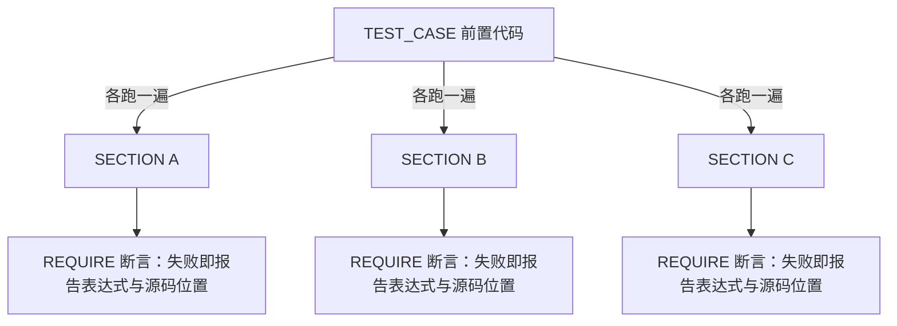

# Catch2 v3 深度拆解：C++ 单元测试框架的自然选择

## 目录

- 核心判断
- 项目坐标
- 一个最小测试
- TEST_CASE + SECTION：嵌套场景
- Matchers：声明式断言
- BDD（行为驱动开发）风格宏
- Approx：浮点比较
- 数据驱动测试：GENERATE
- 微基准测试
- CMake 与 CTest 集成
- 与 GoogleTest 的取舍
- 常见坑与排查
- 动手练习
- 进阶方向
- 参考资源

## 核心判断

Catch2 v3 让测试代码读起来像测试意图。它通过 TEST_CASE + SECTION 嵌套的命名约定，把"测试场景的层级"映射成"测试代码的物理缩进"，不读代码也能看出每个 SECTION 在测什么。这和 GoogleTest 扁平的 TEST_F + 多个 EXPECT 风格差别很大。

阅读目标：读完能解释 SECTION 为什么每次重跑前置代码、能写出 Matchers 断言与 BDD 场景、能说出 v2 迁移到 v3 的完整步骤，并能在 CMake 里正确链接 Catch2WithMain。不需要先懂测试理论，但需要 C++ 基础。

如果你正在新项目里选测试框架，或者被 GoogleTest 的 fixture（测试夹具）样板代码烦到，这篇值得读完整。

## 项目坐标

| 维度 | 数据 |
|------|------|
| 仓库 | catchorg/Catch2 |
| Stars | 21.4k（2026-08-19 GitHub API（应用程序接口）） |
| Forks | 3.5k（3,501） |
| 主语言 | 现代 C++（最低 C++14） |
| License | BSL-1.0（业务源码使用免费，分发限制很少） |
| 当前版本 | v3，最新 tag v3.15.3；默认分支 devel |
| 文档 | https://catch2-docs.readthedocs.io |

Catch2 的核心机制是 SECTION 的"逐层重跑"模型，下面这张图展示一次测试的执行路径：



每个 SECTION 都把前置代码重新执行一遍，因此天然避免了 fixture（测试夹具）之间的状态泄漏；代价是嵌套越深，重跑的重复代码越多。下面按这个执行模型逐项展开。

## 一个最小测试

```cpp
#define CATCH_CONFIG_MAIN
#include <catch2/catch_test_macros.hpp>

uint32_t factorial(uint32_t n) {
    return n <= 1 ? 1 : n * factorial(n - 1);
}

TEST_CASE("Factorials are computed", "[factorial]") {
    REQUIRE(factorial(0) == 1);
    REQUIRE(factorial(1) == 1);
    REQUIRE(factorial(10) == 3628800);
}
```

这个示例的要点：`CATCH_CONFIG_MAIN` 让 Catch2 生成 `main` 函数；`REQUIRE` 是断言（assertion）宏，失败时立即终止当前测试。运行：

```bash
./my_test               # 跑全部
./my_test Factorials    # 按名字过滤
./my_test [factorial]   # 按 tag 过滤
./my_test --list-tests  # 列出全部测试
```

输出是**人类可读**的——失败的断言会显示期望值、实际值与源码位置，不需要额外配置。

## TEST_CASE + SECTION：嵌套场景

这是 Catch2 最具辨识度的设计。SECTION 在 TEST_CASE 内部嵌套，每个 SECTION 是一个独立的测试上下文：

```cpp
TEST_CASE("Vector can be sized and resized", "[vector]") {
    std::vector<int> v(5);
    REQUIRE(v.size() == 5);

    SECTION("resizing bigger changes size and capacity") {
        v.resize(10);
        REQUIRE(v.size() == 10);
        REQUIRE(v.capacity() >= 10);
    }

    SECTION("resizing smaller changes size but not capacity") {
        v.resize(0);
        REQUIRE(v.size() == 0);
        REQUIRE(v.capacity() >= 5);
    }

    SECTION("reserving bigger does not change size or capacity") {
        v.reserve(10);
        REQUIRE(v.size() == 5);
        REQUIRE(v.capacity() >= 10);
    }
}
```

为什么每个 SECTION 都要重跑一遍前置代码？因为 Catch2 把"共享前置 + 独立场景"当成了默认模型：测试名就是场景名，SECTION 体就是场景体，前置代码只在 SECTION 之前。这样写出来的测试没有隐式状态——`v` 每次都是从 `std::vector<int> v(5)` 开始的，你不需要像 GoogleTest 那样记住 fixture 的生命周期。

Catch2 风格的取舍：

- **优点**：每个场景独立，前置代码自动复用，物理缩进和逻辑层级一致。
- **代价**：SECTION 嵌套深度多时执行时间线性增长（每层都重跑前置）；SECTION 之间不能共享局部变量。
- **陷阱**：别指望某个 SECTION 里对前置对象的修改能带到下一个 SECTION——每次进入 SECTION 都会从头执行前置代码，改动不会跨 SECTION 保留。

## Matchers：声明式断言

Catch2 v3 把断言写成"声明性匹配"，失败信息比裸 `==` 友好得多：

```cpp
#include <catch2/matchers/catch_matchers.hpp>
#include <catch2/matchers/catch_matchers_string.hpp>
#include <catch2/matchers/catch_matchers_vector.hpp>

TEST_CASE("Matchers example") {
    std::vector<int> v = {1, 2, 3, 4, 5};
    REQUIRE_THAT(v, Catch::Matchers::Contains(3));
    REQUIRE_THAT(v, Catch::Matchers::AllOf(
        Catch::Matchers::SizeIs(5),
        Catch::Matchers::Contains(2),
        Catch::Matchers::Contains(4)));
}
```

v3 把 Matchers 头文件从 `catch2/catch.hpp` 拆到了 `catch2/matchers/` 下，用哪个包含哪个——这也是 v3 编译开销比 v2 大幅下降的原因之一。Matcher 断言失败时会展开匹配表达式，告诉你"哪些部分不匹配"，而不是"expected 3, got 4"。

## BDD 风格宏

Catch2 提供 SCENARIO / GIVEN / WHEN / THEN 宏，本质上就是 TEST_CASE + SECTION 的别名：

```cpp
SCENARIO("Customer withdrawals", "[bank]") {
    GIVEN("A customer with $100") {
        Account acc(100);

        WHEN("they withdraw $30") {
            acc.withdraw(30);
            THEN("the balance is $70") {
                REQUIRE(acc.balance() == 70);
            }
        }

        WHEN("they withdraw $200") {
            bool ok = acc.withdraw(200);
            THEN("the withdrawal fails") {
                REQUIRE_FALSE(ok);
            }
        }
    }
}
```

对业务 / QA 团队协作友好——可以拿 GIVEN / WHEN / THEN 当模板填测试场景。BDD（行为驱动开发）在这里没有引入任何新机制，只是把 SECTION 换了个更会说话的别名。

## Approx：浮点比较

浮点比较的经典痛点（`0.1 + 0.2 != 0.3`）Catch2 直接给出 `Approx` 解决方案：

```cpp
TEST_CASE("Floating point") {
    REQUIRE(0.1 + 0.2 == Approx(0.3));
    REQUIRE(0.1 + 0.2 == Approx(0.3).margin(0.001));
    REQUIRE(0.1 + 0.2 == Approx(0.3).epsilon(0.01));
}
```

`Approx` 默认的相对误差是 `std::numeric_limits<float>::epsilon() * 100`，约 1.19e-5；`.margin(x)` 切换为绝对误差，`.epsilon(x)` 覆盖相对误差。注意默认 epsilon 基于 float 精度，比较 double 计算结果时通常要显式调小。

还要留意一个容易忽略的点：`Approx` 的相对误差判断会同时参照目标值和被比较的值，两边数值量级差太远时结果可能与其直觉不符。用 `margin`（绝对误差）做"固定容差"更直观；用默认 epsilon 时确保两个值量级接近即可。

## 数据驱动测试：GENERATE

数据驱动测试（data-driven testing）把"同一逻辑、多组输入"拆成多轮执行。Catch2 的 `GENERATE` 宏用起来直接：

```cpp
#include <catch2/generators/catch_generators_all.hpp>

TEST_CASE("range generators") {
    // 对 2、3、5、7 各跑一遍测试体
    auto n = GENERATE(2, 3, 5, 7);
    REQUIRE(n % 2 == 0 || n % 3 == 0 || n % 5 == 0);
}
```

`GENERATE` 像并列的 SECTION 那样展开多轮执行，每轮独立运行、独立报告结果。配合内置生成器还能自动组合：

```cpp
TEST_CASE("cartesian product") {
    auto a = GENERATE(1, 2);
    auto b = GENERATE(values({"x", "y"}));   // 用 values 从容器取值
    // 组合出 (1,"x") (1,"y") (2,"x") (2,"y") 四轮
}
```

内置生成器还有 `range`、`filter`、`take`、`repeat` 等，大多是惰性求值的。GENERATE 本身不算断言，它的价值在于把数据从测试逻辑里抽出来，改数据不用动断言。

## 微基准测试

Catch2 提供 `BENCHMARK` 宏，可以做简单基准（不替代专用库如 Google Benchmark）：

```cpp
TEST_CASE("Benchmark vector vs list") {
    std::vector<int> v(1000);
    std::list<int> l(1000);

    BENCHMARK("vector push_back") {
        for (int i = 0; i < 1000; ++i) v.push_back(i);
        return v.size();
    };

    BENCHMARK("list push_back") {
        for (int i = 0; i < 1000; ++i) l.push_back(i);
        return l.size();
    };
}
```

跑基准需要指定样本数：

```bash
./my_test --benchmark-samples=100
```

Catch2 对样本做 bootstrap 统计，默认输出平均耗时与 95% 置信区间。够日常性能对比用——真要严格基准用 Google Benchmark。

## CMake 与 CTest 集成

Catch2 v3 通过 CMake config 文件导出 target：

```cmake
# 方式一：find_package（已安装）
find_package(Catch2 REQUIRED)
target_link_libraries(my_tests PRIVATE Catch2::Catch2WithMain)

# 方式二：FetchContent
include(FetchContent)
FetchContent_Declare(
    Catch2
    GIT_REPOSITORY https://github.com/catchorg/Catch2.git
    GIT_TAG v3.15.3
)
FetchContent_MakeAvailable(Catch2)
```

> Catch2 有两个 target：`Catch2::Catch2`（不生成 main，自己写 `main` 或注册自定义入口）和 `Catch2::Catch2WithMain`（自带 main，不需要在测试里定义 `CATCH_CONFIG_MAIN`）。

日常推荐 `Catch2WithMain`：省掉每个测试文件顶部的 `CATCH_CONFIG_MAIN` 宏，也避免多人协作时"多个文件都想生成 main"的链接错误。

### 用 CTest 自动注册

每个 `TEST_CASE` 在运行时是独立的测试节点，可以交给 CTest 统一检索。官方提供 `catch_discover_tests`：

```cmake
find_package(Catch2 REQUIRED)

enable_testing()
add_executable(my_tests test_main.cpp test_foo.cpp)
target_link_libraries(my_tests PRIVATE Catch2::Catch2WithMain)

include(CTest)
include(Catch)               # 来自 Catch2 安装包或 extras/ 目录
catch_discover_tests(my_tests)
```

`catch_discover_tests` 通过运行测试二进制并解析 `--list-test` 输出来枚举用例，加一个 `TEST_CASE` 不用改 CMake；代价是结果依赖测试二进制能正常启动。用 FetchContent 时要把 `extras/` 追加到 `CMAKE_MODULE_PATH`，否则 `include(Catch)` 找不到模块。CTest 顺带解决了"按用例细跑"的需求：`ctest -R <正则>` 过滤某个测试，`ctest --output-on-failure` 只看失败详情。

## 与 GoogleTest 的取舍

| 维度 | Catch2 v3 | GoogleTest |
|------|-----------|------------|
| 学习曲线 | 低 | 中 |
| 分发形态 | 多 header + 静态库（另提供 amalgamated 单文件） | 库 |
| 嵌套场景 | SECTION（自动重跑前置） | TEST_F + 子测试需手动 fixture |
| Matchers | 内置 | 部分支持，gMock 强在 mock（模拟） |
| Mock | 弱（官方不提供，需自写或接第三方） | 强（gMock 完整体系） |
| 异常断言 | REQUIRE_THROWS 等 | ASSERT_THROW 等 |
| 进程死亡测试 | 核心不提供，需外部方案 | ASSERT_DEATH 等 |
| 集成到 IDE（集成开发环境） | 中（CLI（命令行工具）友好） | 强（VS / xcode 原生） |
| 编译开销 | v3 比 v2 降约 80%（官方数据） | 中 |
| 文档质量 | 高（官网 + 教程） | 高 |

**决策建议**：

- **纯单元测试为主，团队偏好可读性** → Catch2 v3
- **需要复杂 mock（接口模拟）** → GoogleTest + gMock
- **项目要嵌入到现有 gtest 工程** → 继续用 GoogleTest
- **新项目、测试场景多是"行为驱动"** → Catch2 BDD

## 常见坑与排查

### 1. SECTION 里改共享对象

```cpp
TEST_CASE("shared counter") {
    int counter = 0;

    SECTION("increment once") {
        counter++;
        REQUIRE(counter == 1);
    }

    SECTION("increment twice") {
        counter += 2;
        REQUIRE(counter == 2);
    }
}
```

每个 SECTION 各自执行一次 TEST_CASE 的前置——`counter` 永远从 0 开始，不会"加一后变 1 再加二变 3"。如果你需要跨场景共享状态，把状态放到 TEST_CASE 外的全局或类成员，并显式重置。

### 2. v2 → v3 迁移

v3 把 single-header 拆成了多 header + 静态库，`include` 开销降低约 80%（官方数据）。迁移步骤：

1. CMake 里链接 `Catch2::Catch2WithMain`（用默认 main 时）；
2. 删除定义了 `CATCH_CONFIG_MAIN` 或 `CATCH_CONFIG_RUNNER` 的编译单元，不再需要；
3. `#include <catch2/catch.hpp>` 改为 `#include <catch2/catch_all.hpp>`；
4. Matchers 等头文件按新路径调整。

仍然想要单文件？`extras/` 下官方保留了 `catch_amalgamated.hpp` + `catch_amalgamated.cpp`，但编译时间会比库方式差，官方不把它作为主要支持路径。

### 3. 链接报错：main 重复定义或找不到符号

最常见的两个报错都出在 main 上：

- `multiple definition of main`：某个测试文件还留着 `CATCH_CONFIG_MAIN`，同时又链接了 `Catch2WithMain`——删掉宏定义。
- `undefined reference to main`：链接了 `Catch2::Catch2`（无 main target）但没自己提供 `main`——改链接 `Catch2WithMain`。

### 4. Approx 对 double 太宽松

`Approx` 默认 epsilon 基于 float 精度（约 1.19e-5），用来比较 double 计算的结果可能放过明显错误的数值。需要更严格的比较时显式传 epsilon：

```cpp
REQUIRE(result == Approx(3.14).epsilon(1e-9));
```

## 动手练习

**练习 1：把断言改写成 SECTION 结构。** 拿 `factorial` 测试，把 `REQUIRE` 拆成三个 SECTION（0、1、10），运行 `--list-tests` 观察报告里出现了几个测试用例，体会"一个 TEST_CASE = 一组场景"的展开。

**练习 2：给 Approx 写边界测试。** 分别用默认、`.epsilon(1e-9)`、`.margin(1e-6)` 比较 `0.1 + 0.2` 与 `0.3`，再故意制造一个略超误差的失败用例，看失败信息如何展示期望值、实际值与容差。

**练习 3：迁移一个 v2 工程。** 建一个用 `catch.hpp` + `CATCH_CONFIG_MAIN` 的最小工程，按"常见坑 2"的四步迁到 v3，跑通后删掉宏定义，观察编译时间变化。

**练习 4：用 GENERATE 重写数据。** 把"练习 1"的 `factorial` 测试改成 `GENERATE(0, 1, 10)` + 一个 `CAPTURE(n)` 断言，运行后看报告里出现了几个测试用例，体会"一个参数化表达式展开成多轮"的行为。

**自测题**：

- 一个 TEST_CASE 里有 3 个并列 SECTION，测试会执行几次前置代码？
- `REQUIRE` 失败后当前测试继续还是终止？`CHECK` 呢？
- `Catch2::Catch2` 和 `Catch2::Catch2WithMain` 的区别是什么？
- Approx 默认 epsilon 是多少？为什么它不适合高精度 double 比较？
- 一个 TEST_CASE 里 `GENERATE(1, 2)` 和另一个 `GENERATE(1, 2)` 并列，会展开成几轮执行？

## 进阶方向

- **Generators 组合**：`GENERATE` 可与 `range`、`filter`、`take` 组合出更复杂的输入集（文档：`docs/generators.md`）。多个 `GENERATE` 并列时按笛卡尔积展开。
- **Test fixtures**：`docs/test-fixtures.md` 的 `TEST_CASE_METHOD`，需要构造复杂前置对象时比 SECTION 更省事。
- **Reporters 与 Event listeners**：定制输出格式、接入 CI 系统（`docs/reporters.md`）。
- **Mock 方案**：Catch2 官方不提供 mock，社区常用 trompeloeil、FakeIt 与 Catch2 配合（`docs/opensource-users.md` 有使用案例）。
- **零成本接入**：Catch2 与 vcpkg / Conan / CMake FetchContent 都是官方支持路径，`docs/cmake-integration.md` 有完整说明。

## 参考资源

- 仓库：[https://github.com/catchorg/Catch2](https://github.com/catchorg/Catch2)
- 官方文档：[https://catch2-docs.readthedocs.io](https://catch2-docs.readthedocs.io)
- CMake 集成：[docs/cmake-integration.md](https://github.com/catchorg/Catch2/blob/devel/docs/cmake-integration.md)
- v2 迁移指南：[docs/migrate-v2-to-v3.md](https://github.com/catchorg/Catch2/blob/devel/docs/migrate-v2-to-v3.md)
- 替代方案 doctest：[https://github.com/doctest/doctest](https://github.com/doctest/doctest)
