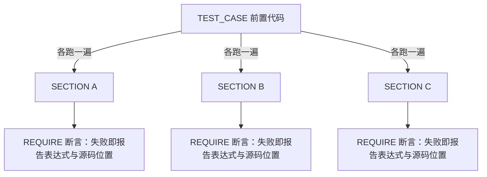

# Catch2 v3 深度拆解：C++ 单元测试框架的自然选择

## 目录

- 核心判断
- 项目坐标
- 一个最小测试
- TEST_CASE + SECTION：嵌套场景
- Matchers：声明式断言
- BDD（行为驱动开发）风格宏
- 浮点比较：Approx 与官方推荐
- 数据驱动测试：GENERATE
- 微基准测试
- CMake 与 CTest 集成
- 与 GoogleTest 的取舍
- 常见坑与排查
- 动手练习
- 进阶方向
- 参考资源

## 核心判断

Catch2 v3 让测试代码读起来像测试意图。它通过 TEST_CASE + SECTION 嵌套的命名约定，把"测试场景的层级"映射成"测试代码的物理缩进"，不读代码也能看出每个 SECTION 在测什么。这和 GoogleTest 扁平的 TEST_F + 多个 EXPECT 风格差别很大。

阅读目标：读完能解释 SECTION 为什么每次重跑前置代码、能写出 Matchers 断言与 BDD 场景、知道官方为什么弃用 Approx 以及现在该怎么比浮点数、能说出 v2 迁移到 v3 的完整步骤，并能在 CMake 里正确链接 Catch2WithMain。不需要先懂测试理论，但需要 C++ 基础。

如果你正在新项目里选测试框架，或者被 GoogleTest 的 fixture（测试夹具）样板代码烦到，这篇值得读完整。

## 项目坐标

| 维度 | 数据 |
|------|------|
| 仓库 | catchorg/Catch2 |
| Stars | 21.5k（2026-09-18 GitHub API（应用程序接口）） |
| Forks | 3.5k（3,501） |
| 主语言 | 现代 C++（最低 C++14） |
| License | BSL-1.0（业务源码使用免费，分发限制很少） |
| 当前版本 | v3，最新 release v3.16.0；默认分支 devel |
| 文档 | 仓库 docs/ 目录（无独立文档站） |

Catch2 的核心机制是 SECTION 的"逐层重跑"模型，下面这张图展示一次测试的执行路径：



每个 SECTION 都把前置代码重新执行一遍，每个场景拿到的都是全新的前置状态，天然不存在场景间的状态泄漏；代价是嵌套越深，重跑的重复代码越多。

## 一个最小测试

```cpp
#include <catch2/catch_test_macros.hpp>

uint32_t factorial(uint32_t n) {
    return n <= 1 ? 1 : n * factorial(n - 1);
}

TEST_CASE("Factorials are computed", "[factorial]") {
    REQUIRE(factorial(0) == 1);
    REQUIRE(factorial(1) == 1);
    REQUIRE(factorial(10) == 3628800);
}
```

v2 时代，你得在某个文件顶部定义 `CATCH_CONFIG_MAIN` 让框架生成 `main` 函数。v3 移除了这个宏，`main` 改由库直接提供——CMake 里链接 `Catch2::Catch2WithMain` 就够了：

```cmake
cmake_minimum_required(VERSION 3.16)
project(factorial_tests)

find_package(Catch2 REQUIRED)

add_executable(factorial_tests factorial.cpp)
target_link_libraries(factorial_tests PRIVATE Catch2::Catch2WithMain)
```

`REQUIRE` 是断言（assertion）宏，失败时立即终止当前测试；`CHECK` 同样记失败，但会继续执行后面的断言。一组互相独立、想一次看全结果的检查用 `CHECK` 更合适。运行：

```bash
./factorial_tests                # 跑全部
./factorial_tests Factorials     # 按名字过滤
./factorial_tests "[factorial]"  # 按 tag 过滤，方括号记得加引号
./factorial_tests --list-tests   # 列出全部测试
```

tag 体系还有几个约定：tag 不区分大小写；以 `.` 开头的 tag 会把用例从默认运行中隐藏，常用来隔离慢速或外部依赖测试，比如 `[.slow]`，显式传 `[.slow]` 时才跑。

故意把 `factorial(0)` 写错，失败输出长这样：

```text
factorial.cpp:8: FAILED:
  REQUIRE( factorial(0) == 1 )
with expansion:
  0 == 1
```

Catch2 不提供一排 `_EQUALS`、`_GREATER_THAN` 宏，它靠表达式分解（expression decomposition）把 `REQUIRE` 后面的 C++ 表达式拆开记录，所以失败时能同时打印原始表达式和两侧的求值结果。边界也要知道：含 `&&` 或 `||` 的表达式分解不了，会直接编译失败——要么加括号把两边变成一个整体求值，要么拆成多条断言。

## TEST_CASE + SECTION：嵌套场景

这是 Catch2 最具辨识度的设计。SECTION 在 TEST_CASE 内部嵌套，每个 SECTION 是一个独立的测试上下文：

```cpp
TEST_CASE("Vector can be sized and resized", "[vector]") {
    std::vector<int> v(5);
    REQUIRE(v.size() == 5);

    SECTION("resizing bigger changes size and capacity") {
        v.resize(10);
        REQUIRE(v.size() == 10);
        REQUIRE(v.capacity() >= 10);
    }

    SECTION("resizing smaller changes size but not capacity") {
        v.resize(0);
        REQUIRE(v.size() == 0);
        REQUIRE(v.capacity() >= 5);
    }

    SECTION("reserving bigger does not change size or capacity") {
        v.reserve(10);
        REQUIRE(v.size() == 5);
        REQUIRE(v.capacity() >= 10);
    }
}
```

为什么每个 SECTION 都要重跑一遍前置代码？Catch2 把"共享前置 + 独立场景"当成默认模型：测试名就是场景名，SECTION 体就是场景体，前置代码只在 SECTION 之前。`v` 每次都从 `std::vector<int> v(5)` 开始，你不需要像 GoogleTest 那样记住 fixture 的生命周期。

嵌套 SECTION 的语义是"路径"：从最外层到某个最内层 SECTION 的每一层依次执行，构成一条路径；Catch2 把所有叶子路径各执行一遍，每条路径都从 TEST_CASE 第一行重跑。外层 SECTION 的代码因此天然成为内层的前置。

Catch2 风格的取舍：

- **优点**：每个场景独立，前置代码自动复用，物理缩进和逻辑层级一致。
- **代价**：SECTION 嵌套深度多时执行时间线性增长（每条叶子路径都重跑前置）。
- **陷阱**：别指望某个 SECTION 里对前置对象的修改能带到下一个 SECTION——每次进入 SECTION 都会从头执行前置代码，改动不会跨 SECTION 保留。

## Matchers：声明式断言

Catch2 v3 把断言写成"声明性匹配"，失败信息比裸 `==` 友好得多：

```cpp
#include <catch2/matchers/catch_matchers.hpp>
#include <catch2/matchers/catch_matchers_vector.hpp>

TEST_CASE("Matchers example") {
    std::vector<int> v = {1, 2, 3, 4, 5};
    REQUIRE_THAT(v, Catch::Matchers::Contains(3));
    REQUIRE_THAT(v, Catch::Matchers::AllOf(
        Catch::Matchers::SizeIs(5),
        Catch::Matchers::Contains(2),
        Catch::Matchers::Contains(4)));
}
```

v3 把 Matchers（匹配器）从 `catch2/catch.hpp` 拆到了 `catch2/matchers/` 下，命名空间全部收进 `Catch::Matchers`，用哪个包含哪个——这也是 v3 编译开销大幅下降的原因之一。从 v2 迁移时有个重名坑：原来的字符串匹配器 `Contains` 改名成了 `ContainsSubstring`，如今叫 `Contains` 的是容器成员匹配。Matcher 断言失败时会展开匹配表达式，告诉你"哪些部分不匹配"，而不是"expected 3, got 4"。

## BDD 风格宏

Catch2 提供 SCENARIO / GIVEN / WHEN / THEN 宏，本质上就是 TEST_CASE + SECTION 的别名：

```cpp
SCENARIO("Customer withdrawals", "[bank]") {
    GIVEN("A customer with $100") {
        Account acc(100);

        WHEN("they withdraw $30") {
            acc.withdraw(30);
            THEN("the balance is $70") {
                REQUIRE(acc.balance() == 70);
            }
        }

        WHEN("they withdraw $200") {
            bool ok = acc.withdraw(200);
            THEN("the withdrawal fails") {
                REQUIRE_FALSE(ok);
            }
        }
    }
}
```

报告里测试名会带上 "Scenario: "、"given: "、"when: " 这类前缀，业务或 QA 团队可以直接拿 GIVEN / WHEN / THEN 当模板填场景。同一层并列的 WHEN 是互相独立的场景；有先后依赖的步骤用 AND_WHEN / AND_THEN 链接，放在它依赖的子句内部。BDD（行为驱动开发）在这里没有引入任何新机制，只是把 SECTION 换了个更会说话的别名。

## 浮点比较：Approx 与官方推荐

浮点比较的经典痛点（`0.1 + 0.2 != 0.3`）在 Catch2 里有两条路。先把结论放在前面：**官方文档已明确把 `Approx` 标记为弃用，不建议新代码使用**；替代品是三个浮点 Matchers——`WithinAbs`、`WithinRel`、`WithinULP`：

```cpp
#include <catch2/matchers/catch_matchers.hpp>
#include <catch2/matchers/catch_matchers_floating_point.hpp>

TEST_CASE("Floating point with matchers") {
    REQUIRE_THAT(0.1 + 0.2, WithinAbs(0.3, 1e-9));   // 绝对误差
    REQUIRE_THAT(0.1 + 0.2, WithinRel(0.3, 0.01));   // 相对误差
    REQUIRE_THAT(0.1 + 0.2, WithinULP(0.3, 2));       // 相距不超过 2 个 ULP（最后一位的单位）
}
```

`WithinAbs(target, margin)` 判定差值不超过固定绝对容差；`WithinRel(target, eps)` 判定 `|arg - target| <= eps * max(|arg|, |target|)`，不指定 eps 时默认 `std::numeric_limits<float>::epsilon() * 100`。三者可以像普通 Matcher 一样用 AllOf 组合。

`Approx` 为什么还值得讲？存量代码库里它无处不在，读旧测试绕不开。它的用法是直接参与比较表达式：

```cpp
TEST_CASE("Floating point with Approx") {
    REQUIRE(0.1 + 0.2 == Approx(0.3));
    REQUIRE(performComputation() == 2.1_a);   // 字面量后缀，来自 Catch::literals
}
```

`_a` 后缀需要 `using namespace Catch::literals`。`Approx` 有三个调节点，语义要读仔细：

- `epsilon(x)` 设相对容差，默认 `std::numeric_limits<float>::epsilon() * 100`，约 1.19e-5——基于 float 精度，比较 double 计算结果时通常要显式调小。
- `margin(x)` 设绝对容差，默认 0。
- 两者是"或"的关系：相对判定或绝对判定只要一个通过，整个比较就通过，不存在"设置 margin 就切换到绝对模式"。

三个官方点名的坑，比默认值本身更容易咬人：

1. **相对容差只按 `Approx` 的值计算**，所以比较是非对称的。官方原例：`Approx(10).epsilon(0.1) != 11.1`，但 `Approx(11.1).epsilon(0.1) == 10`。把量级相差悬殊的两个值放比较表达式两端时，先想清楚哪边写在 `Approx` 里。
2. **默认只有相对判定，和 0 比较会失效**：`Approx(0) == X` 仅当 `X == 0` 时才通过，此时必须用 `margin`。
3. 内部计算全用 `double`，输入是 `float` 时结果会有细微差别。

选型判断：新代码用 `WithinAbs` / `WithinRel`，需要位级精度对齐时用 `WithinULP`；`Approx` 留给读旧代码的场景。

## 数据驱动测试：GENERATE

数据驱动测试（data-driven testing）把"同一逻辑、多组输入"拆成多轮执行。Catch2 的 `GENERATE` 宏用起来直接：

```cpp
#include <catch2/generators/catch_generators_all.hpp>

TEST_CASE("range generators") {
    // 对 2、3、5、7 各跑一遍测试体
    auto n = GENERATE(2, 3, 5, 7);
    REQUIRE(n % 2 == 0 || n % 3 == 0 || n % 5 == 0);
}
```

`GENERATE` 像并列的 SECTION 那样展开多轮执行，每轮独立运行、独立报告结果。配合内置生成器还能自动组合：

```cpp
TEST_CASE("cartesian product") {
    auto a = GENERATE(1, 2);
    auto b = GENERATE(values({"x", "y"}));   // 用 values 从容器取值
    // 组合出 (1,"x") (1,"y") (2,"x") (2,"y") 四轮
}
```

内置助手不止 `values` 和 `range`：`filter`、`take`、`repeat`、`table`（表格数据）、`random`（随机数）、`cat`（拼接生成器）、`from_range`（从容器区间取值）都可以嵌套组合，比如官方文档里的 `take(100, filter([](int i) { return i % 2 == 1; }, random(-100, 100)))` 一次产出一百个奇数随机数。随机生成器配 `--rng-seed` 可以复现某一轮的具体序列。GENERATE 本身不算断言，它的价值在于把数据从测试逻辑里抽出来，改数据不用动断言。

## 微基准测试

Catch2 提供 `BENCHMARK` 宏，可以做简单基准（不替代专用库如 Google Benchmark）：

```cpp
#include <catch2/benchmark/catch_benchmark_all.hpp>
#include <string>

TEST_CASE("string append patterns", "[!benchmark]") {
    BENCHMARK("reserve then append") {
        std::string s;
        s.reserve(1000);
        for (int i = 0; i < 1000; ++i) s.append("x");
        return s.size();
    };

    BENCHMARK("append and grow") {
        std::string s;
        for (int i = 0; i < 1000; ++i) s.append("x");
        return s.size();
    };
}
```

每个基准的待测代码会被反复执行，所以两条写法纪律：待测逻辑必须可重复执行，且每轮都从干净状态开始——把状态构造写进 lambda 内部，别让上一轮的残留污染下一轮的测量。tag `[!benchmark]` 让这个用例默认隐藏，日常 `./my_bench` 不会误跑基准，要跑时显式指定：

```bash
./my_bench "[!benchmark]" --benchmark-samples 200
```

默认采样 100 个样本，Catch2 自动估算每样本的迭代次数，报告 mean、std dev 及对应的 low/high 区间。够日常性能对比用——真要严格基准用 Google Benchmark。

## CMake 与 CTest 集成

Catch2 v3 通过 CMake config 文件导出 target：

```cmake
# 方式一：find_package（已安装）
find_package(Catch2 REQUIRED)
target_link_libraries(my_tests PRIVATE Catch2::Catch2WithMain)

# 方式二：FetchContent
include(FetchContent)
FetchContent_Declare(
    Catch2
    GIT_REPOSITORY https://github.com/catchorg/Catch2.git
    GIT_TAG v3.16.0
)
FetchContent_MakeAvailable(Catch2)
```

> Catch2 有两个 target：`Catch2::Catch2`（不生成 main，自己写 `main` 或注册自定义入口）和 `Catch2::Catch2WithMain`（自带 main）。用 pkg-config 的话，对应的是 `pkg-config catch2` 与 `pkg-config catch2-with-main`。

日常推荐 `Catch2WithMain`：省掉每个测试文件顶部生成 main 的负担，也避免多人协作时"多个文件都想生成 main"的链接错误。

### 用 CTest 自动注册

每个 `TEST_CASE` 在运行时是独立的测试节点，可以交给 CTest 统一检索。官方提供 `catch_discover_tests`：

```cmake
find_package(Catch2 REQUIRED)

enable_testing()
add_executable(my_tests test_main.cpp test_foo.cpp)
target_link_libraries(my_tests PRIVATE Catch2::Catch2WithMain)

include(CTest)
include(Catch)               # 来自 Catch2 安装包或 extras/ 目录
catch_discover_tests(my_tests)
```

`catch_discover_tests` 通过运行测试二进制并解析 `--list-test` 输出来枚举用例，加一个 `TEST_CASE` 不用改 CMake；代价是结果依赖测试二进制能正常启动。这个脚本在 v3.15.3 重写过，注册速度提升数倍，测试按字母序注册；v3.16.0 又修了测试名转义等几个问题。用 FetchContent 时要把 `extras/` 追加到 `CMAKE_MODULE_PATH`，否则 `include(Catch)` 找不到模块。CTest 顺带解决了"按用例细跑"的需求：`ctest -R <正则>` 过滤某个测试，`ctest --output-on-failure` 只看失败详情。

## 与 GoogleTest 的取舍

| 维度 | Catch2 v3 | GoogleTest |
|------|-----------|------------|
| 学习曲线 | 低 | 中 |
| 分发形态 | 多 header + 静态库（另提供 extras/ 下的 amalgamated 两文件版） | 库 |
| 嵌套场景 | SECTION（自动重跑前置） | TEST_F + 子测试需手动 fixture |
| Matchers | 内置 | 部分支持，gMock 强在 mock（模拟） |
| Mock | 弱（官方不提供，需自写或接第三方） | 强（gMock 完整体系） |
| 异常断言 | REQUIRE_THROWS 等 | ASSERT_THROW 等 |
| 进程死亡测试 | 核心不提供，需外部方案 | ASSERT_DEATH 等 |
| 集成到 IDE（集成开发环境） | 中（CLI（命令行工具）友好） | 强（VS / Xcode 原生） |
| 编译开销 | 包含开销比 v2 降约 80%（官方迁移文档） | 中 |
| 文档质量 | 高（教程 + docs/ 参考文档） | 高 |

**决策建议**：

- **纯单元测试为主，团队偏好可读性** → Catch2 v3
- **需要复杂 mock（接口模拟）** → GoogleTest + gMock
- **项目要嵌入到现有 gtest 工程** → 继续用 GoogleTest
- **新项目、测试场景多是"行为驱动"** → Catch2 BDD

## 常见坑与排查

### 1. SECTION 里改共享对象

```cpp
TEST_CASE("shared counter") {
    int counter = 0;

    SECTION("increment once") {
        counter++;
        REQUIRE(counter == 1);
    }

    SECTION("increment twice") {
        counter += 2;
        REQUIRE(counter == 2);
    }
}
```

每个 SECTION 各自执行一次 TEST_CASE 的前置——`counter` 永远从 0 开始，不会"加一后变 1 再加二变 3"。如果你需要跨场景共享状态，把状态放到 TEST_CASE 外的全局或类成员，并显式重置。

### 2. v2 → v3 迁移

v3 把 single-header 拆成了多 header + 静态库，单个编译单元包含 Catch2 的开销降低约 80%（官方迁移文档）。迁移步骤：

1. CMake 里链接 `Catch2::Catch2WithMain`（用默认 main 时）；pkg-config 用户把 `catch2` 换成 `catch2-with-main`；
2. 删除定义了 `CATCH_CONFIG_MAIN` 或 `CATCH_CONFIG_RUNNER` 的编译单元，v3 已不认这两个宏；
3. `#include <catch2/catch.hpp>` 改为 `#include <catch2/catch_all.hpp>`，之后逐步换成更细的分段头文件；
4. Matchers 的命名空间和 `Contains` 改名（见前文）按新路径调整。

仍然想要单文件？`extras/` 下官方保留了 `catch_amalgamated.hpp` + `catch_amalgamated.cpp`，但编译时间会比库方式差，官方不把它作为主要支持路径。

### 3. 链接报错：main 重复定义或找不到符号

最常见的两个报错都出在 main 上：

- `multiple definition of main`：某个测试文件还留着 `CATCH_CONFIG_MAIN`，同时又链接了 `Catch2WithMain`——删掉宏定义。
- `undefined reference to main`：链接了 `Catch2::Catch2`（无 main target）但没自己提供 `main`——改链接 `Catch2WithMain`。

### 4. 断言里写 && / || 编译失败

`REQUIRE(a == 1 && b == 2)` 编译不过，不是 bug：`&&`、`||` 无法在不破坏短路语义的前提下重载，表达式分解因此拒绝它们。加括号强制整体求值（此时不再拆开打印），或拆成多条断言，或者对复杂条件改用 Matcher。

## 动手练习

**练习 1：把断言改写成 SECTION 结构。** 拿 `factorial` 测试，把 `REQUIRE` 拆成三个 SECTION（0、1、10），运行 `--list-tests` 观察报告里出现了几个测试用例，体会"一个 TEST_CASE = 一组场景"的展开。

**练习 2：用三种方式比浮点数。** 对 `0.1 + 0.2` 与 `0.3`，分别用 `Approx` 默认参数、`WithinAbs(0.3, 1e-9)`、`WithinRel(0.3, 0.01)` 写断言，再故意制造一个略超容差的失败用例，对比三种失败信息各暴露了什么。最后验证一下 `Approx(11.1).epsilon(0.1) == 10` 是否真的成立。

**练习 3：迁移一个 v2 工程。** 建一个用 `catch.hpp` + `CATCH_CONFIG_MAIN` 的最小工程，按"常见坑 2"的四步迁到 v3，跑通后删掉宏定义，观察编译时间变化。

**练习 4：用 GENERATE 重写数据。** 把"练习 1"的 `factorial` 测试改成 `GENERATE(0, 1, 10)` + 一个 `CAPTURE(n)` 断言，运行后看报告里出现了几个测试用例，体会"一个参数化表达式展开成多轮"的行为。

**自测题**：

- 一个 TEST_CASE 里有 3 个并列 SECTION，测试会执行几次前置代码？
- `REQUIRE` 失败后当前测试继续还是终止？`CHECK` 呢？
- `Catch2::Catch2` 和 `Catch2::Catch2WithMain` 的区别是什么？
- Approx 默认 epsilon 是多少？为什么它不适合高精度 double 比较？
- 新代码里官方推荐用什么替代 Approx？和 0 比较时必须改用什么？
- 一个 TEST_CASE 里 `GENERATE(1, 2)` 和另一个 `GENERATE(1, 2)` 并列，会展开成几轮执行？

## 进阶方向

- **Generators 组合**：`GENERATE` 可与 `range`、`filter`、`take`、`table`、`random` 组合出更复杂的输入集（文档：`docs/generators.md`）。多个 `GENERATE` 并列时按笛卡尔积展开。
- **Test fixtures**：`docs/test-fixtures.md` 的 `TEST_CASE_METHOD`，需要构造复杂前置对象时比 SECTION 更省事。
- **Reporters 与 Event listeners**：定制输出格式、接入 CI 系统（`docs/reporters.md`）。注意 v3 的 reporter 接口相对 v2 是破坏性变更，自定义 reporter 要按新接口改。
- **Mock 方案**：Catch2 官方不提供 mock，社区常用 trompeloeil、FakeIt 与 Catch2 配合（`docs/opensource-users.md` 有使用案例）。
- **零成本接入**：Catch2 与 vcpkg / Conan / CMake FetchContent 都是官方支持路径，`docs/cmake-integration.md` 有完整说明。

## 参考资源

- 仓库：[https://github.com/catchorg/Catch2](https://github.com/catchorg/Catch2)
- 官方文档（仓库 docs/ 目录）：[https://github.com/catchorg/Catch2/tree/devel/docs](https://github.com/catchorg/Catch2/tree/devel/docs)
- CMake 集成：[docs/cmake-integration.md](https://github.com/catchorg/Catch2/blob/devel/docs/cmake-integration.md)
- v2 迁移指南：[docs/migrate-v2-to-v3.md](https://github.com/catchorg/Catch2/blob/devel/docs/migrate-v2-to-v3.md)
- 浮点比较专页：[docs/comparing-floating-point-numbers.md](https://github.com/catchorg/Catch2/blob/devel/docs/comparing-floating-point-numbers.md)
- 替代方案 doctest：[https://github.com/doctest/doctest](https://github.com/doctest/doctest)
