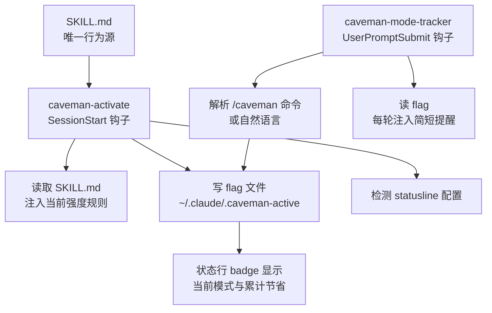

+++
github_repo = "JuliusBrussee/caveman"
date = '2026-04-30T11:30:00+08:00'
draft = false
title = 'Caveman：只压 AI 的嘴，不压它的脑子'
slug = 'caveman-claude-code-token-optimization-guide'
description = 'caveman 是 Claude Code 系的一个技能/插件：把 LLM 回复里的填充词、客套话、犹豫词剥掉。65% 是 chat 式"讲述"场景的输出 Token 节省；整轮 agentic 编码任务只有 8.5%，且技能本身每轮还会加约 1–1.5k 输入 Token。支持 lite/full/ultra/wenyan 多档强度。'
categories = ['技术笔记']
tags = ['LLM', 'Token 优化', '开发工具']
+++

caveman 做的不是"让 AI 少说点话"这么模糊的事，而是把 LLM 输出里的结构化冗余拆出来：冠词、填充词、客套话、犹豫词，逐类可识别，逐类删掉，代码、命令、错误信息原样保留。真正值得记住的是它的数字边界——**65% 只发生在"讲述"场景**，一整轮 agentic 编码任务只有 8.5%。

仓库信息（GitHub API 2026-08-06 验证）：Stars 95,243 / Forks 5,461 / MIT / JavaScript / 默认分支 main / 创建于 2026-04-04 / 最近推送 2026-07-26 / 首页 [caveman.so](https://caveman.so) / 支持 30+ 种 AI 编程工具。

## 一、它到底省的是什么

caveman 复述官方的定位是「Same answers. Brain still big. Mouth small.」——它不改变 AI 知道什么，只改变 AI 说出来多少。这句话拆开看，含着一组必须分开的数字：

| 场景 | 输出 Token 节省 | 测量方 |
|------|------------:|------|
| chat 式"讲述"（prose） | **65%** | 官方 benchmark，10 个 prompt |
| 一整轮 agentic 编码任务 | **8.5%** | JetBrains，SkillsBench 86 个任务 |

差距是机制性的：caveman 压缩的是叙述，而叙述就是把代码、diff、工具调用和错误字符串串起来的那层皮。聊天回答里这层皮就是全部；agentic 编码里它只是工具调用之间很薄的一层，能压的本来就少。所以"整场会话能省多少"取决于你的工作负载是不是以 prose 为主。

还有两个容易被忽略的账：

- caveman **只压输出 Token**，输入和 reasoning Token 不动。而 agentic 账单大头恰恰是输入 Token，这是输出侧技能按构造碰不到的。
- 技能本身每轮会加约 **1–1.5k 输入 Token**。对已经很短的工作负载，整场净节省可能转负。官方 README 自己写了这句：**"The real win is readability and speed. Cost savings are the bonus."**——省钱是赠品，不是主菜。

所以把它当成"省钱工具"是错的，把它当成"让 AI 输出更可读、更快"的工具才对。

## 二、压缩规则：哪些删，哪些绝不能碰

规则不是乱删，每一类都对应 LLM 训练时学会的那层「礼貌流利」。caveman 的 SKILL.md（`skills/caveman/SKILL.md`）是唯一行为源，背后是这些规则：

**删掉：**

- 冠词 a / an / the
- 填充词 just / really / basically / actually / simply
- 客套话 sure / certainly / of course / happy to
- 犹豫词和 hedging（"it might be worth..."这类）
- 工具调用叙述、装饰性表格和 emoji、大段原始错误日志（除非被要求，否则只引最要害的一行）

**替换：** 用短词换长词——`fix` 不写 `implement a solution for`；允许碎片句，`[thing] [action] [reason]. [next step].` 的句式。

**明确禁止：**

- **自造缩写**。`cfg/impl/req/res/fn/auth` 这类"看起来省"的缩写实际上划不进 tokenizer 的节省，反而要读者解码。技能只允许 `DB/API/HTTP` 这类公认缩写。
- **因果箭头 `→`**。它自己就是一个 token，不省任何东西，还降低解码清晰度。

**保持原样：** 技术术语、代码块、API 名、CLI 命令、commit 类型关键词（feat/fix 等）、错误字符串，逐字保留。技能还约定**保留用户的语言**——你写葡萄牙语，它就输出葡萄牙语 caveman——它压缩的是风格，不是语言。

再看一遍那段被广泛引用的对比：

```text
正常：Sure! I'd be happy to help you with that. The issue you're experiencing
      is most likely caused by your authentication middleware not properly
      validating the token expiry. Let me take a look and suggest a fix.
caveman：Bug in auth middleware. Token expiry check use `<` not `<=`. Fix:
```

信息量一致，Token 从约 50 落到约 15。压缩生效，是因为大部分"帮助性"输出本来就是填充词。

## 三、机制：一条消息怎么变简洁

caveman 在 Claude Code 里不是靠提示词硬顶，而是靠两层钩子 + 一个皮肤文件在驱动。



一次会话大致这样流过：

1. 会话启动，`caveman-activate.js` 读取 `skills/caveman/SKILL.md`，把**当前强度级别**对应的完整规则作为隐藏上下文注入，并把当前模式写进 `~/.claude/.caveman-active` 这个 flag 文件。它运行时就读 SKILL.md，所以改 SKILL.md 会自动生效，钩子不硬编码规则。
2. 状态行脚本读同一个 flag，显示 `[CAVEMAN]` 或 `[CAVEMAN:ULTRA]` 之类的 badge，以及累计节省的 Token 数。
3. 每轮用户输入，`caveman-mode-tracker.js` 解析有没有 `/caveman` 命令或 "talk like caveman" 这类自然语言，更新 flag；如果模式活跃，就往本轮注入一句简短提醒。这是"每轮强化"——即使别的插件往 system prompt 塞了相反的风格指令，caveman 也能在每轮重新露脸。

独立模式（commit / review / compress）有各自的技能文件，不走强度级别，由 `/caveman-commit`、`/caveman-review`、`/caveman-compress` 单独触发。

## 四、强度级别

级别可以在会话中随时用 `/caveman <level>` 切换，默认 `full`，一直保持到切换或会话结束。同一句话「为什么组件重渲染」在各强度下的输出（来自 SKILL.md）：

| 级别 | 输出 |
|------|------|
| `lite` | Your component re-renders because you create a new object reference each render. Wrap it in `useMemo`. |
| `full`（默认） | New object ref each render. Inline object prop = new ref = re-render. Wrap in `useMemo`. |
| `ultra` | Inline obj prop, new ref, re-render. `useMemo`. |
| `wenyan-lite` | 組件頻重繪，以每繪新生對象參照故。以 useMemo 包之。 |
| `wenyan-full` | 每繪新生對象參照，故重繪；以 useMemo 包之則免。 |
| `wenyan-ultra` | 新參照則重繪。useMemo 包之。 |

`lite` 去填充词但保留冠词和完整句子，`full` 再删冠词、允许碎片句，`ultra` 去掉不影响因果的连词、一句话说清一件事。文言文三档是刻意为之——古汉语每个字的信息密度更高，`wenyan-full` 官方口径是约 80–90% 的字数削减。

技能还带一层 **auto-clarity**：遇到安全警告、不可逆操作确认、碎片句顺序可能引起误读的多步操作、或者压缩本身造成歧义时，自动降回正常语气，讲清楚再切回 caveman。代码、commit、PR 本来就按正常语气写。

## 五、安全设计：flag 文件不让人劫持

`~/.claude/.caveman-active` 是一个可预测的路径，本地攻击者如果把它的位置换成一个指向 `~/.ssh/id_rsa` 的 symlink，状态行脚本或钩子读取时就会把私钥内容读出来。caveman 用 `safeWriteFlag` / `readFlag` 封住这个口子（源码在 `src/hooks/caveman-config.js`）：

- 写入端：flag 目录是 symlink 时解析到真实路径并校验属主；flag 文件本身禁止是 symlink；用 `O_NOFOLLOW` + 临时文件 + rename 原子写入；权限 0600。
- 读取端：拒绝对 symlink 的读取；`MAX_FLAG_BYTES = 64` 硬上限（最长的合法值 `wenyan-ultra` 是 12 字节）；只接受 `VALID_MODES` 白名单里的模式名。
- 任何异常都返回 `null`，绝不把不可信字节注入模型上下文。

## 六、caveman-compress：把输入端的账也压一压

caveman 压输出，`caveman-compress` 压**输入**——像 `CLAUDE.md` 这种每次会话启动都会加载的文件，体积直接乘进每次会话的上下文。命令是 `/caveman-compress <文件>`，流程（`skills/caveman-compress/SKILL.md`）：

1. 先用纯 Python 脚本检测文件类型（这一步不耗 Token）；
2. 调一次 Claude 把自然语言段落压成 caveman 风格；
3. 校验输出，确认代码块、行内代码、URL、路径、标题、术语都保留；
4. 校验失败就只做针对性修复（不重新整体压缩），最多重试 2 次；
5. 压缩版本覆盖原文件，人类可读的备份存成 `FILE.original.md`——但放在**树外**的数据目录（`$XDG_DATA_HOME/caveman-compress/backups/...`），避免被技能自动加载器当成活文件再吃一遍。

它只处理自然语言文件（`.md/.txt/.typ/.typst/.tex` 和无扩展名），`.py/.js/.ts/.json/.yaml/.env/.sql` 等代码与配置文件一律不动。官方实测平均省约 46% 输入 Token（706→285 到 888→560 的区间）。

## 七、benchmark 怎么读

先看它在测什么：官方那组 65% 是 **10 个 chat 式 prompt 的输出 Token**，一比一对"默认啰嗦回复"算的，来自 `benchmarks/`，可复现。JetBrains 那个 8.5% 是 **86 个真实编码任务**，每条用任务自带测试自动判分，Claude Code + `claude-sonnet-5`，强制每轮开启。

这两个数字都真，但反映的是不同负载：65% 反映叙述层能挤出的水分，8.5% 反映以工具调用为主的编码流里那层薄叙述。**不能从 65% 推出"我的会话也省 65%"**——尤其当你的主要 Token 都花在输入、而非屏幕上的输出时。官方自己也说：65% 和 8.5% 都对，但都不是你的数。你的数得在自己的流量上量出来——这正是它正在做的 "Caveman 2" 想变成可证明的东西。

顺带一提，那个经常被用来佐证方向的论文 [Brevity Constraints Reverse Performance Hierarchies in Language Models](https://arxiv.org/abs/2604.00025)（2026 年 3 月，测了 31 个模型）发现：约束大模型简短回答，在某些基准上准确率提升约 26 个百分点。方向一致，但它和 caveman 是两回事——一个改测试约束，一个改输出风格。

## 八、生态：不只一张嘴

caveman 是 JuliusBrussee "agent do more with less" 系列里的一环，整个家族五件套各管一段：

| 仓库 | 管什么 |
|------|--------|
| [caveman](https://github.com/JuliusBrussee/caveman) | 压缩 AI **说**出来的 |
| [caveman-code](https://github.com/JuliusBrussee/caveman-code) | 压缩**整条** agent，端到端 |
| [cavemem](https://github.com/JuliusBrussee/cavemem) | 压缩 AI 跨会话**记**住的 |
| [cavekit](https://github.com/JuliusBrussee/cavekit) | 构建循环，规格驱动 |
| [cavegemma](https://github.com/JuliusBrussee/finetune-caveman) | 把压缩**烧进权重**（Gemma 微调） |

## 九、安装与常用命令

官方首推一条命令检测机器上所有 agent 并逐个安装（macOS / Linux / WSL / Git Bash），需要 Node ≥ 18，可重复执行：

```bash
curl -fsSL https://raw.githubusercontent.com/JuliusBrussee/caveman/main/install.sh | bash
```

Windows 用 `irm .../main/install.ps1 | iex`。也可以只装某一个 agent，比如 Claude Code 插件：

```bash
claude plugin marketplace add JuliusBrussee/caveman && claude plugin install caveman@caveman
```

安装后默认就是开的（Claude Code / Codex / Gemini 从第一条消息起生效），不需要手动 `/caveman`。常用命令：

| 命令 | 作用 |
|------|------|
| `/caveman [lite\|full\|ultra\|wenyan]` | 压缩每轮回复，级别保持到切换或会话结束 |
| `/caveman-commit` | 生成 ≤50 字符主题的 Conventional Commit |
| `/caveman-review` | 单行 PR 评论，如 `L42: 🔴 bug: user null. Add guard.` |
| `/caveman-stats [--share]` | 统计本次会话真实 Token 用量、累计节省、折合 USD |
| `/caveman-compress <文件>` | 把记忆文件（如 CLAUDE.md）压成 caveman 风格 |
| `caveman-shrink` | MCP 中间件，压缩任意 MCP server 的工具描述 |
| `cavecrew-*` | 子 agent（investigator / builder / reviewer） |

自然语言也能触发和关闭："talk like caveman" 开启，"stop caveman" 或 "normal mode" 关闭。默认模式的优先级是：`CAVEMAN_DEFAULT_MODE` 环境变量 → 仓库内配置（`.caveman/config.json` 或 `.caveman.json`，会向上层目录找）→ 用户配置 `~/.config/caveman/config.json` → 兜底 `full`。

## 十、什么时候用，什么时候不用

用它正合适：

- 日常编码问答、bug 定位、代码审查——你只要结论和步骤，不需要推理过程；
- 高频交互、prose 为主的输出（解释、文档、review、调试走查）——65% 那档；
- 想省屏幕空间和阅读时间，而不是真指着省账单。

别指望它：

- 无人值守的 agentic 编码流——输出侧技能对这类工作的天花板就是单数字百分比；
- 教学、新人 onboarding、需要完整推理链的场景——解释过程本身就是价值，压缩是损失；
- 主要开销在输入 Token 的会话——`caveman-compress` 和 `caveman-shrink` 才碰得到那半边。

建议从 `lite` 试起：去填充词但保留完整句子，学习成本最低；不影响理解再切 `full`（默认）；追求极致效率用 `ultra`。文言文适合中文开发者或需要文言输出的场景。如果团队里有人反感碎片句，就停在 `lite`。

---

> **相关资源**
> - GitHub：[JuliusBrussee/caveman](https://github.com/JuliusBrussee/caveman)（95,243 ⭐，2026-08-06）
> - 官网：[caveman.so](https://caveman.so)
> - 不公平数字对照笔记：README 的 [HONEST-NUMBERS](https://github.com/JuliusBrussee/caveman/blob/main/docs/HONEST-NUMBERS.md)
> - 论文：[Brevity Constraints Reverse Performance Hierarchies (arXiv:2604.00025)](https://arxiv.org/abs/2604.00025)