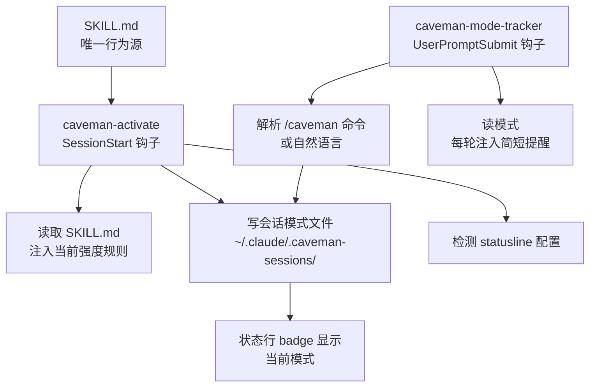

+++
github_repo = "JuliusBrussee/caveman"
source_key = "gh:JuliusBrussee/caveman"
date = '2026-04-30T11:30:00+08:00'
draft = false
title = 'Caveman：嘴上省的是零头，读进来省的才是正账'
slug = 'caveman-claude-code-token-optimization-guide'
description = 'caveman 从「让 AI 说短话」的技能长成了三层：skill 压输出（JetBrains 实测 agentic 任务 8.5%，质量无损），proxy 压输入（官方 54 轮基准 -33.2%），middleware 供自建应用调用。官方撤回了自测的 65%，把红色数字留在表里。本文按仓库 2026-09-28 读数核实。'
categories = ['技术笔记']
tags = ['LLM', 'Token 优化', '开发工具']
+++

caveman 把 LLM 输出里的冗余拆成可识别的类：冠词、填充词、客套话、犹豫词，逐类删掉；代码、命令、错误信息原样保留。它对「能省多少」的口径也跟着仓库一起长进了——早期挂在首页的 65% 已被官方自己撤回，现在的账分三层记：

| 组件 | 压什么 | 代表数字 | 测量方 |
|------|--------|------|--------|
| skill（技能） | AI **说出**的话 | agentic 任务输出 -8.5%，质量无可测差异 | JetBrains，86 个真实编码任务 |
| proxy（代理） | AI **读进**的话：日志、测试输出、JSON、diff | 输入 Token -33.2%，18/18 答对 | 官方 54 轮 pinned 基准 |
| middleware（中间件） | 你自己应用**发出**的请求 | alpha，同 proxy 能力 | 官方文档 |

判断先行：输出侧压缩的天花板就是高个位数——AI 说的本就不多，大头是它读的。JetBrains 测出 8.5% 的那次实验，恰好是 proxy 诞生的理由。

它在 GitHub 上的热度已经过十万：Stars 108,157 / Forks 6,270（GitHub API 2026-09-28 验证），2026 年 4 月作为玩笑发布，一周拿下 4,000 stars，7 月登顶 GitHub Trending 与 Hacker News 首位（904 分，366 条评论）。许可证是 MIT + BSL-1.1 双轨，仓库主语言 Go（proxy 与引擎），技能本体是一份规则文本。官网 [caveman.so](https://caveman.so)，文档站 [docs.caveman.so](https://docs.caveman.so)，支持 30+ 种 AI 编程工具。

## 一、嘴：skill 到底省的是什么

caveman 复述官方的定位是「Caveman no make brain smaller. Caveman make *mouth* smaller.」——它不改变 AI 知道什么，只改变 AI 说出来多少。这句话拆开看，含着一组必须分开的数字：

| 场景 | 结果 | 测量方 |
|------|------|--------|
| chat 式「讲述」（prose） | 输出 Token 中位数 **-50%**（只比长度，不比正确性） | 官方 evals 快照：10 个开发问题，对照 `Answer concisely.`，claude-opus-4-6 |
| 一整轮 agentic 编码任务 | 输出 Token **-8.5%**，成本约 -10%，质量无可测差异（sign test p = 0.82） | JetBrains：SkillsBench 86 个任务，Claude Code 2.1.200 + claude-sonnet-5，强制每轮开启 |
| 宣传口径 | **65%** | 仓库简介与 JetBrains 博客标题，JetBrains 自己注明它属于 chat 式问答 |

差距是机制性的：caveman 压缩的是叙述，而叙述就是把代码、diff、工具调用和错误字符串串起来的那层皮。聊天回答里这层皮就是全部；agentic 编码里它只是工具调用之间很薄的一层，能压的本来就少。JetBrains 把 8.5% 称作天花板（"This is the ceiling, not the usual-case result"），结论是「用不用随你喜欢，它有趣，而且在质量上没有可测量的损失」。

还有两笔容易被忽略的账：

- caveman skill **只压输出 Token**，输入和 reasoning Token 不动。而 agentic 账单大头恰恰是输入 Token，输出侧技能在设计上就碰不到这半边。
- 规则本身每轮会加约 **1,000 个估算输入 Token**（官方口径，实际取决于加载哪些规则、何时注入与缓存行为）。对输出本来就很短的会话，整场净节省可能转负——HONEST-NUMBERS 页引的 issue #145 里，有用户在简短问答场景实测净亏。

所以账要按负载算。它真正稳赚的部分是可读性和速度；省钱要靠你自己的 A/B 说了算，这正是 proxy 后来补上的那半边。

## 二、压缩规则：哪些删，哪些绝不能碰

规则不是乱删，每一类都对应 LLM 训练时学会的那层「礼貌流利」。caveman 的 SKILL.md（`skills/caveman/SKILL.md`）是唯一行为源，背后是这些规则：

**删掉：**

- 冠词 a / an / the
- 填充词 just / really / basically / actually / simply
- 客套话 sure / certainly / of course / happy to
- 犹豫词和 hedging（"it might be worth..."这类）
- 工具调用叙述、装饰性表格和 emoji、大段原始错误日志（除非被要求，否则只引最要害的一行）

**替换：** 用短词换长词——`fix` 不写 `implement a solution for`；允许碎片句，`[thing] [action] [reason]. [next step].` 的句式。

**明确禁止：**

- **自造缩写**。`cfg/impl/req/res/fn/auth` 这类「看起来省」的缩写实际上划不进 tokenizer 的节省，反而要读者解码。技能只允许 `DB/API/HTTP` 这类公认缩写。
- **因果箭头 `→`**。它自己就是一个 token，不省任何东西，还降低解码清晰度。
- **为装 caveman 而加词**。删掉冠词的破碎句如果不比通顺句子更短，就用通顺句子——压缩只许变短，不许变怪。

**保持原样：** 技术术语、代码块、API 名、CLI 命令、commit 类型关键词（feat/fix 等）、错误字符串，逐字保留。技能还约定**保留用户的语言**——你写葡萄牙语，它就输出葡萄牙语 caveman——它压缩的是风格，不是语言。

再看 README 首屏放的那组对比：

```text
正常：The reason your React component is re-rendering is likely because you're
      creating a new object reference on each render cycle. When you pass an
      inline object as a prop, React's shallow comparison sees it as a
      different object every time, which triggers a re-render. I'd recommend
      using useMemo to memoize the object.
caveman：New object ref each render. Inline object prop = new ref = re-render.
      Wrap in `useMemo`.
```

诊断相同，修法相同，`useMemo` 相同，Token 从 69 落到 19。压缩生效，是因为大部分「帮助性」输出本来就是填充词。

## 三、机制：一条消息怎么变简洁

caveman 在 Claude Code 里不是靠提示词硬顶，而是靠两层钩子 + 一个皮肤文件在驱动。


```mermaid
flowchart TD
    A[SKILL.md<br/>唯一行为源] --> B[caveman-activate<br/>SessionStart 钩子]
    B --> C[读取 SKILL.md<br/>注入当前强度规则]
    B --> D[写会话模式文件<br/>~/.claude/.caveman-sessions/]
    B --> E[检测 statusline 配置]
    F[caveman-mode-tracker<br/>UserPromptSubmit 钩子] --> G[解析 /caveman 命令<br/>或自然语言]
    G --> D
    F --> H[读模式<br/>每轮注入简短提醒]
    D --> I[状态行 badge 显示<br/>当前模式]
```

一次会话大致这样流过：

1. 会话启动，`caveman-activate.js` 读取 `skills/caveman/SKILL.md`，把**当前强度级别**对应的完整规则作为隐藏上下文注入，并把当前模式写进 `~/.claude/.caveman-sessions/` 下的会话状态文件；同时在旧位置 `~/.claude/.caveman-active` 留一份机器级镜像，兼容第三方状态行片段和 `INSTALL.md` 的 `cat` 用法。它运行时就读 SKILL.md，所以改 SKILL.md 会自动生效，钩子不硬编码规则。
2. 状态行脚本读同一个状态，显示 `[CAVEMAN]` 或 `[CAVEMAN:ULTRA]` 之类的 badge。早期版本会附加「累计节省 Token 数」的字段，官方后来在 HONEST-NUMBERS 里承认那些数字没有经过审查的对照，已把节省后缀从状态行拿掉——现在 badge 只报模式，不报省了多少。
3. 每轮用户输入，`caveman-mode-tracker.js` 解析有没有 `/caveman` 命令或 "talk like caveman" 这类自然语言，更新状态；如果模式活跃，就往本轮注入一句简短提醒。这是「每轮强化」——即使别的插件往 system prompt 塞了相反的风格指令，caveman 也能在每轮重新露脸。

独立模式（commit / review / compress）有各自的技能文件，不走强度级别，由 `/caveman-commit`、`/caveman-review`、`/caveman-compress` 单独触发。

## 四、强度级别

级别可以在会话中随时用 `/caveman <level>` 切换，默认 `full`，一直保持到切换、关闭（`/caveman off`）或会话结束。同一句话「为什么组件重渲染」在各强度下的输出（来自 SKILL.md）：

| 级别 | 输出 |
|------|------|
| `lite` | Your component re-renders because you create a new object reference each render. Wrap it in `useMemo`. |
| `full`（默认） | New object ref each render. Inline object prop = new ref = re-render. Wrap in `useMemo`. |
| `ultra` | Inline obj prop, new ref, re-render. `useMemo`. |
| `wenyan-lite` | 組件頻重繪，以每繪新生對象參照故。以 useMemo 包之。 |
| `wenyan-full` | 每繪新生對象參照，故重繪；以 useMemo 包之則免。 |
| `wenyan-ultra` | 新參照則重繪。useMemo 包之。 |

`lite` 去填充词但保留冠词和完整句子，`full` 再删冠词、允许碎片句，`ultra` 去掉不影响因果的连词、一句话说清一件事。文言文三档是刻意为之——古汉语每个字的信息密度更高，`wenyan-full` 官方口径是约 80–90% 的字数削减（按字符计，不按 Token 计）。

技能还带一层 **auto-clarity**：遇到安全警告、不可逆操作确认、碎片句顺序可能引起误读的多步操作、或者压缩本身造成歧义时，自动降回正常语气，讲清楚再切回 caveman。代码、commit、PR 本来就按正常语气写。

## 五、安全设计：flag 文件不让人劫持

`~/.claude/.caveman-active` 是一个可预测的路径，本地攻击者如果把它的位置换成一个指向 `~/.ssh/id_rsa` 的 symlink，状态行脚本或钩子读取时就会把私钥内容读出来。caveman 用 `safeWriteFlag` / `readFlag` 封住这个口子（源码在 `src/hooks/caveman-config.js`）：

- 写入端：flag 目录是 symlink 时解析到真实路径并校验属主；flag 文件本身禁止是 symlink；用 `O_NOFOLLOW` + 临时文件 + rename 原子写入；权限 0600。
- 读取端：拒绝对 symlink 的读取；`MAX_FLAG_BYTES = 64` 硬上限（最长的合法值 `wenyan-ultra` 是 12 字节）；只接受 `VALID_MODES` 白名单里的模式名。
- 状态行脚本同此逻辑，还多一层字符过滤：读出的内容先剥到 `a-z0-9-`，白名单之外的值宁可什么都不渲染，防止终端转义序列注入。
- 任何异常都返回 `null`，绝不把不可信字节注入模型上下文。

## 六、耳朵：proxy 压的是输入端

「The JetBrains number is why the proxy exists.」——README 把这句话写在了数字表中间。技能压不住输入，proxy 就装在输入的路上：一个本地进程，agent 交给它，它压缩后再交给 provider；没有 Caveman 服务器在链路里，Claude Pro/Max 的登录凭据原样透传。它压掉的每一段原始内容都存进本机的 SQLite，并给 agent 发一个恢复句柄，随时能把原文取回来。

入口是 `detect()`，按载荷类型分流到各自的压缩器：

| 识别类型 | 保留什么 | 目标节省 |
|----------|----------|------:|
| `json` | 键、结构、错误/消息子树；折叠重复数组 | 70–90% |
| `log` | 错误、堆栈、首尾行；丢 INFO 与进度噪声 | 85–95% |
| `code` | import、签名、类型；省略函数体，语法保持有效 | 40–70% |
| `diff` | 文件/hunk 头与改动行；省略重复上下文 | 60–80% |
| `search-result` | 头尾命中项加诊断/安全相关命中 | 80–95% |
| `text` / HTML | 标题、首尾上下文、重要段落 | 50–80% |

任何 MCP 宿主也能通过五个工具拿到同样能力：`caveman_compress`、`caveman_retrieve`、`caveman_stats`、`caveman_toon_encode`、`caveman_toon_decode`。

proxy 怎么接进日常工作：

1. `caveman learn` 先读你磁盘上已有的 agent 历史（Claude Code / Codex / Gemini CLI / opencode），本地只读，把 token 去向按浪费程度排序，每条附一行修法。README 称它是「这份 README 里最有用的五分钟」。
2. `caveman learn implement` 把修法逐条交给 Claude Code 或 Codex，一次一个 diff，经你确认才落地；每改一处就重新测量，没降每轮 token 的改动自动回滚。
3. `caveman claude`（或 codex / gemini / aider / kilo / qwen / opencode / hermes / openclaw / pi，共 10 个原生封装）把 proxy 顶到 agent 前面，从此读取流先压缩再出门。只想试一次用 `caveman wrap <agent>`，跑完不留痕迹。
4. `caveman trial -- claude` 跑一场带/不带 caveman 的真实对照，`caveman trial report` 出报告（对照需要独占 proxy：若已用 `caveman claude` 常驻，它会提示先 `caveman disable claude`，跑完再 enable）。官方的原话是：这个 A/B 比它页面上任何一个数字都值钱。
5. 周边还有三件：`caveman browse <url>` 用本地 Chrome 出压缩版无障碍树（对一个 200 行表格，15,704 Token 的快照压到 121，129.8 倍）；`caveman convert` 把已安装技能渲染成 PNG 页让模型「看图」，技能本体 1,069 → 415 估算 Token（-61%），无利可图就不转，`--revert` 字节级还原；`caveman shrink -- pnpm test` 压缩任意命令输出。

middleware 是第三块：给「自己写 agent」的人用。TypeScript（`@caveman-ai/middleware` + `@caveman-ai/sdk`）和 Python（`caveman-middleware` + `caveman-sdk`，3.13+）两套客户端，在已有的 provider 调用外套一层 wrapper，大工具结果换成短副本、给模型挂上 `caveman_retrieve`，历史里保留全部原文；runtime 不在线时原始请求直通。Vercel AI SDK、OpenAI、Anthropic、LangChain、CrewAI 等主流框架都有适配，目前是 alpha。

隐私这一段 README 写得很直白：skill 和钩子完全本地运行，永不上报；`caveman` CLI 默认发送匿名用量统计（跑过哪些命令、token 进出计数，不含 prompt、代码、路径），一行 `caveman telemetry off` 或环境变量 `DO_NOT_TRACK=1` 永久关闭。团队场景可以把 proxy 放进自己 VPC 的一个容器，密钥留在服务器。

## 七、caveman-compress：把记忆文件的账也压一压

caveman 压输出，proxy 压工具返回，`caveman-compress` 压**输入里的静态部分**——像 `CLAUDE.md` 这种每次会话启动都会加载的文件，体积直接乘进每次会话的上下文。命令是 `/caveman-compress <文件>`，流程（`skills/caveman-compress/SKILL.md`）：

1. 先用本地 Python 脚本检测文件类型（这一步不耗 Token）；
2. 调一次 Claude 把自然语言段落压成 caveman 风格；
3. 校验输出，确认代码块、行内代码、URL、路径、标题、术语都保留；
4. 校验失败就只做针对性修复（不重新整体压缩），最多重试 2 次；
5. 压缩版本覆盖原文件，人类可读的备份存成 `FILE.original.md`——但放在**树外**的数据目录（`$XDG_DATA_HOME/caveman-compress/backups/...`），避免被技能自动加载器当成活文件再吃一遍。

它只处理自然语言文件（`.md/.mdc/.txt/.rst/.typ/.typst/.tex` 和无扩展名），`.py/.js/.ts/.json/.yaml/.env/.sql` 等代码与配置文件一律不动。官方在 5 个真实 `CLAUDE.md` 风格样本上实测平均省约 46% 输入 Token（706→285 到 888→560 的区间），标题、代码、路径、URL 逐项校验完好。

## 八、benchmark 怎么读

先分清三个数字各测什么：-50% 测的是**聊天式问答的输出长度**（对「简短作答」提示词对照组的相对值，只比长度不比对错）；-8.5% 测的是**强制开启技能时 agentic 任务的输出**（JetBrains，86 个任务按自带测试自动判分）；-33.2% 测的是**过 proxy 后 agent 读进的输入**（6 个 case、54 轮、18 次答案全对，95% 置信区间 14.6%–48.5%）。

65% 的下落值得单独讲。早期版本把它固定写进 stats 和状态行，HONEST-NUMBERS 现在明说：那是一个「没有 committed 审查结果」的固定比例，现行报告已忽略历史估算字段，状态行不再显示节省数字。仓库简介和 JetBrains 标题里的 65% 还在，但 JetBrains 把它标注为「宣传数字」，实测口径是 8.5%。这个项目最可信的部分，恰恰是它愿意把自己最早的那个数字收回去。

proxy 的 -33.2% 也要按它自己声明的边界读：6 个 case 里 5 个显著为绿，Dashboard HTML 一行是 **+9.9%** 的红色——那个 case 没有匹配的压缩器，proxy 白付了自己的开销。README 的原话是：「我藏起红色行的那天，就是你们该不再相信绿色行的那天。」同套件对照下 Headroom 省 6.7% 且 3/18 答错；RTK 压的是 shell 输出，属于不同层，JetBrains 同实验室测出它在低推理努力下成本反而 +7.6%。

方向上还有两份外部佐证。Adobe Research 的 CAVEWOMAN 论文（[arXiv:2606.24083](https://arxiv.org/abs/2606.24083)，2026 年 6 月）在 8 个模型、5 个数据集、5 档压缩强度下测出：输出侧 caveman 风格把实际成本降 1.4–2.4 倍，最好情况 3 倍；同一篇论文还发现把**人类的 prompt** 压成电报体会让模型答得更长更差——caveman 因此从不改写你的输入。更早的 [Brevity Constraints Reverse Performance Hierarchies](https://arxiv.org/abs/2604.00025)（2026 年 3 月，31 个模型）发现约束大模型简短回答，准确率可提升约 26 个百分点。方向一致，但它们研究的是评测约束与语言风格本身，和 caveman 这个产品是两回事。

## 九、生态：一个洞窟，三层分工

caveman 是 JuliusBrussee「agent do more with less」系列的主仓，家族现在的分工是：

| 仓库 | 管什么 | 状态 |
|------|--------|------|
| [caveman](https://github.com/JuliusBrussee/caveman)（本文主角） | 说的（skill）、读的（proxy）、自家应用发的（middleware） | live |
| [caveman-browse](https://github.com/JuliusBrussee/caveman-browse) | agent 在浏览器里**看到**的 | live |
| [cavegemma](https://github.com/JuliusBrussee/cavegemma) | 把压缩**烧进权重**（Gemma 4 31B 的 LoRA 微调） | labs |
| [caveman-code](https://github.com/JuliusBrussee/caveman-code) | **整条** agent，端到端（实测对 Codex CLI 省 1.93 倍） | frozen（仍可用） |
| [cavemem](https://github.com/JuliusBrussee/cavemem) | agent 跨会话**记住**的 | frozen（仍可用） |
| [cavekit](https://github.com/JuliusBrussee/cavekit) | 构建循环，规格驱动 | frozen（仍可用） |

正在酝酿的是 Caveman Cloud：本地数字被官方归为 `inferred`，pinned 基准是 `benchmark_counterfactual`，只有过 eval 门禁、带签名收据的真实流量才配叫 `verified`——把「省了多少」从估算变成可证明的账，目前开放 waitlist。

## 十、安装与常用命令

技能本体的安装已经收成一条命令（免账号、免 API key，支持 macOS / Linux / WSL）：

```bash
npx skills add JuliusBrussee/caveman -g
```

装完即生效；如果 agent 没有自动进入 caveman 风格，输入 `/caveman` 唤醒。也可以只装某一个 agent，比如 Claude Code 插件：

```bash
claude plugin marketplace add JuliusBrussee/caveman && claude plugin install caveman@caveman
```

完整安装器（接线 Claude Code 钩子和状态行 badge，自动探测机器上所有 agent，可重复执行）固定在 v2.7.0 标签，需要 Node.js 22.13+：

```bash
curl -fsSL https://raw.githubusercontent.com/JuliusBrussee/caveman/v2.7.0/install.sh | bash
```

Windows 用 `irm .../v2.7.0/install.ps1 | iex`（PowerShell 5.1+）。要压输入端再装 proxy，要嵌自己的应用再装 middleware：

```bash
npm install -g @caveman-ai/cli && caveman setup --install && caveman claude   # proxy
npm install @caveman-ai/middleware @caveman-ai/sdk                            # middleware，TypeScript
```

常用命令：

| 命令 | 作用 |
|------|------|
| `/caveman [lite\|full\|ultra\|wenyan-*\|off]` | 压缩每轮回复，级别保持到切换或会话结束 |
| `/caveman-commit` | 生成单行 Conventional Commit |
| `/caveman-review` | 单行 PR 评论，如 `L42: 🔴 null deref. Guard it.` |
| `/caveman-stats` | 读会话日志输出 token 用量；没有对照就如实报 savings unknown |
| `/caveman-compress <文件>` | 把记忆文件（如 CLAUDE.md）压成 caveman 风格 |
| `/caveman-help` | 单屏列出全部模式与命令 |
| `cavecrew-*` | 子 agent（investigator / builder / reviewer） |
| `investigate-first` 等 6 个工作模式 | 少写代码的任务套路，agent 按任务自行套用 |
| `caveman learn` / `learn implement` | 分析本地 token 去向；逐 diff 落地修复并复测 |
| `caveman shrink -- <命令>` | 压缩命令输出，字节级可恢复 |
| `caveman browse <url>` | 压缩版网页视图替代万 Token 的无障碍树 |
| `caveman trial -- <agent>` | 真实会话 A/B 对照，`trial report` 出报告 |
| `caveman convert` | 把技能渲染成 PNG 页（pixel mode），`--revert` 还原 |
| `caveman stats` | token 历史、API 估算、订阅等价折算 |
| `caveman telemetry off` | 关闭 CLI 匿名遥测 |

自然语言也能触发和关闭："talk like caveman" 开启，"stop caveman" 或 "normal mode" 关闭。默认模式的优先级是：`CAVEMAN_DEFAULT_MODE` 环境变量 → 仓库内配置（`.caveman/config.json` 或 `.caveman.json`，会向上层目录找）→ 用户配置 `~/.config/caveman/config.json` → 兜底 `full`。

## 十一、什么时候用，什么时候不用

用它正合适：

- 日常编码问答、bug 定位、代码审查——你只要结论和步骤，不需要推理过程；
- 高频交互、prose 为主的输出（解释、文档、review、调试走查）——输出侧那 50% 中位数属于这里；
- 长会话满是日志、测试输出和 diff，按 token 付费，想压读取端——proxy 和 `caveman learn` 的主场。

别指望它：

- 按请求或按 credit 计费的订阅——GitHub Copilot 的 premium request 里，短答案也是同一次请求，技能一个字也省不下；
- 无人值守的 agentic 编码流——输出侧技能对这类工作的天花板就是 8.5%；
- 简短干脆的 coding 问答——固定注入的规则开销可能倒贴（issue #145 有实测）；
- 教学、新人 onboarding、需要完整推理链的场景——解释过程本身就是价值，压缩是损失。

如果哪个工作负载上 A/B 是净亏，官方的建议就一句：关掉它。别和账单较劲。

建议的落地顺序：先用一条 `npx skills add` 把技能挂上，从 `lite` 试起（去填充词但保留完整句子，学习成本最低），不影响理解再切 `full`（默认），追求极致效率用 `ultra`，中文场景可以玩玩文言文三档。跑一周后 `caveman learn` 看看自己的 token 到底花在哪——若大头在读取端，再上 proxy，并用 `caveman trial` 在自己的真实任务上量出那个只属于你的数字。

---

> **相关资源**
> - GitHub：[JuliusBrussee/caveman](https://github.com/JuliusBrussee/caveman)（108,157 ⭐，2026-09-28）
> - 官网：[caveman.so](https://caveman.so) · 文档：[docs.caveman.so](https://docs.caveman.so)
> - 不公平数字对照笔记：README 的 [HONEST-NUMBERS](https://github.com/JuliusBrussee/caveman/blob/main/docs/HONEST-NUMBERS.md)
> - JetBrains 独立测试：[Speaking to AI Agents like Cavemen Saves 65% of Tokens. We Test.](https://blog.jetbrains.com/ai/2026/07/speak-to-ai-agents-like-cavemen-tosave-tokens/)
> - 论文：[CAVEWOMAN (arXiv:2606.24083)](https://arxiv.org/abs/2606.24083) · [Brevity Constraints Reverse Performance Hierarchies (arXiv:2604.00025)](https://arxiv.org/abs/2604.00025)
