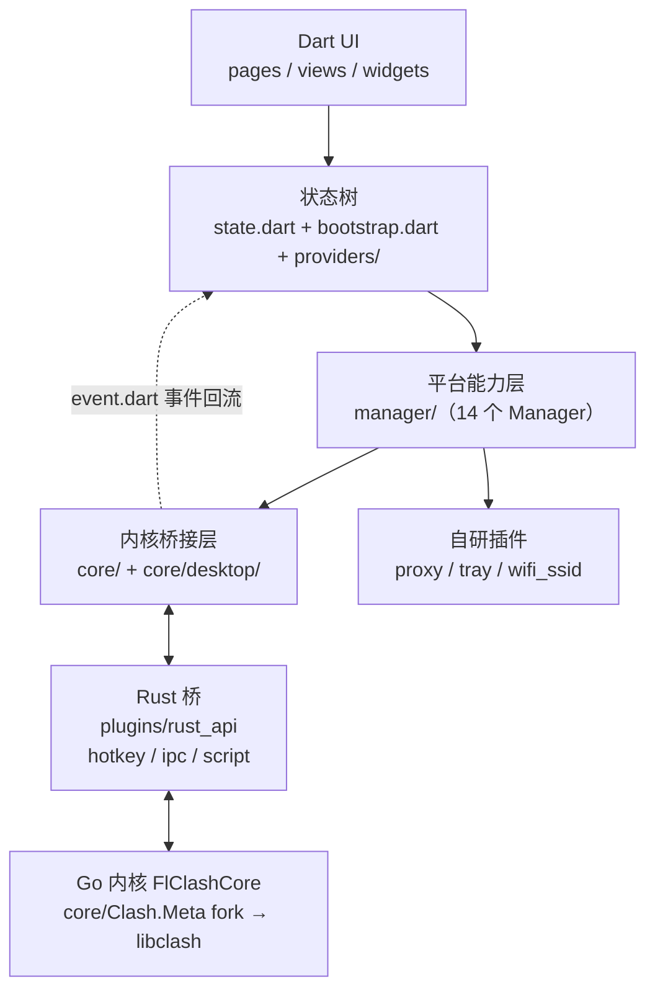

# FlClash：54K Stars 的多平台代理客户端，如何用 Flutter + Rust + Go 三语言拼出 ClashMeta 桌面/手机体验

## §1 先给判断

FlClash 把「Clash 内核 + Flutter UI + 跨平台系统能力」三件事缝进了一个仓库：54K Stars、GPL-3.0、最新发布 v0.8.98（2026-09-14，数据取自 GitHub API 2026-10-02）。它值得专门拆开看的工程原因有三条：

1. **三语言各钉一层**：UI 层 Flutter（Dart），系统能力桥 Rust（`plugins/rust_api`，承担热键、IPC、脚本三类能力），内核层 Go（Clash.Meta 编译为 `libclash`）。每种语言都待在它最擅长的地方。
2. **四端共用一份 Dart UI**：Android / Windows / macOS / Linux 跑同一套 Material You 动态色与平台自适应布局，README 还特别说明这是一款「开源且无广告」的客户端。代理类工具里，这个跨端完成度很少见。
3. **2026 年 9 月刚落地一轮架构级重构**：v0.8.97 一口气重做了 UI 与本地化、应用层与窗口管理（新增代理认证）、桌面 runner 与原生构建、Android VPN 服务生命周期、桌面插件（新增 Helper 服务与 Rust 桥）、内核 IPC 与进程生命周期。重构后的 `lib/core/desktop/` 把「养一个 Go 内核进程」拆成启动策略、生命周期、进程探活、RPC 客户端等九个文件——这是一份难得的「代理客户端进程管理」参考实现。

发布节奏近一年明显提速：v0.8.87 到 v0.8.94 是平均六到十周一版的打磨期；2026 年 8 月到 9 月则连发 v0.8.95 到 v0.8.98 四个版本。

文章主轴：拆开重构后的三层架构（`lib/core` 桥接层、`lib/manager` 平台能力层、`plugins/` 五个自研插件）+ `setup.dart` 构建脚本对四平台工具链的统一调度，给一份「Flutter 想碰系统能力时，桥层到底要堆多少」的真实样本。

## §2 仓库坐标：放在代理客户端谱系里看

代理客户端项目大致分四类：

| 类型 | 代表 | 核心能力 | FlClash 位置 |
|------|------|---------|--------------|
| 原生单平台 | Clash for Windows（已停更）、ClashX | 单平台极致体验 | 不选 |
| 跨平台桌面 GUI | Clash Verge Rev（Tauri + WebView） | 桌面三端，不覆盖 Android | 部分重叠 |
| Flutter 跨平台 | FlClash、Hiddify、Karing | UI 体验优先，含移动端 | **选这条** |
| 命令行内核 | ClashMeta 内核 | 只负责代理流量 | 不选 |

在「Flutter 跨平台代理客户端」这条赛道里，FlClash 的 Stars 最高：FlClash 54K，Hiddify 33K，Karing 15K。（同领域的 Clash Verge Rev 已到 148K，但它走 Tauri + 系统 WebView，属于桌面 GUI 阵营。）FlClash 把「代理客户端」从命令行工具拉到了「和 Telegram、Spotify 一类的日用软件」的设计语言上。这个定位决定它必须解决三件事：

1. **跨端 UI 一致**（Flutter 自带）
2. **系统能力集成**（VPN 接口、托盘、Quick Tile、开机启动、热键）
3. **内核与 UI 的双向通信**（Dart 不能直接调 Go）

三件事各自的落点，先给一张总览图（按 §13 任务流的调用走向画，内核状态沿 `event.dart` 回流）：



下面逐层拆。

## §3 顶层目录：三层 + 五个插件 + 一个 Helper 服务

主目录（main 分支，GitHub API 2026-10-02）：

```text
FlClash/
├── android/                     # Android 工程
├── linux/                       # Linux 打包与依赖自检
├── macos/                       # macOS 工程
├── windows/                     # Windows 工程（Inno Setup 脚本）
├── lib/                         # Flutter Dart 代码
│   ├── application.dart
│   ├── main.dart
│   ├── bootstrap.dart           # 启动流程（v0.8.97 重构引入）
│   ├── state.dart               # 全局状态根
│   ├── common/                  # 63 个工具文件
│   ├── core/                    # 内核桥接层（含 desktop/ 子目录）
│   ├── database/                # drift（SQLite）本地存储
│   ├── enum/
│   ├── features/                # 业务模块（overwrite、connection）
│   ├── l10n/                    # 国际化
│   ├── manager/                 # 平台能力封装（14 个 Manager）
│   ├── models/                  # 数据模型（含 clash_config.dart）
│   ├── pages/                   # 页面
│   ├── plugins/                 # Android 侧插件的 Dart 入口
│   ├── providers/               # Riverpod 状态树
│   ├── views/                   # 视图组件
│   └── widgets/                 # 复用控件
├── plugins/                     # 五个自研 Flutter 插件
│   ├── proxy/                   # 平台代理 / Android VPN 接入
│   ├── tray/                    # 系统托盘（Linux/macOS/Windows 平台实现）
│   ├── wifi_ssid/               # Wi-Fi SSID 读取
│   ├── rust_api/                # Rust 桥（flutter_rust_bridge + Native Assets）
│   └── setup/                   # 构建辅助包
├── core/                        # Clash.Meta 子模块（作者的 fork，分支 FlClash）
├── services/
│   └── helper/                  # 桌面 Helper 服务（FlClashHelperService）
├── tool/                        # 构建辅助工具
├── arb/                         # 翻译文件
├── assets/                      # 图标、字体、动画
├── assets_source/               # 源资源（设计稿）
├── test/
├── snapshots/                   # README 演示图
├── pubspec.yaml                 # Flutter 依赖
├── pubspec.lock
├── setup.dart                   # 统一构建脚本
├── Makefile                     # 包装 setup.dart
├── build_config.yaml            # Go 内核与 Helper 服务的构建参数
├── build.yaml                   # Dart 构建配置
├── AGENTS.md / CLAUDE.md        # AI 协作约定
├── CHANGELOG.md
├── analysis_options.yaml
├── distribute_options.yaml
└── README.md / README_zh_CN.md
```

两处引用关系值得单独说：

- `.gitmodules` 显示 `core/Clash.Meta` 指向 `chen08209/Clash.Meta` 的 **fork 仓库**（分支 `FlClash`），不是 MetaCubeX 上游——客户端要带本地内核改动时，fork 是常规做法。
- `pubspec.yaml` 里 `window_manager`、`launch_at_startup`、`yaml_writer` 三个依赖来自作者的 GitHub fork（钉了具体 ref），托盘则直接换成了自研的 `tray` 插件。桌面工具对平台包「差一口气」的地方，这个项目的做法是自己养一个 fork 或插件。

## §4 lib/core：与 Go 内核通信的桥接层

`lib/core/` 当前结构：

```text
core/
├── controller.dart
├── core.dart
├── desktop/              # 桌面端进程管理（v0.8.97 重构新增）
│   ├── core_manifest.dart
│   ├── helper_client.dart
│   ├── launch_policy.dart
│   ├── launcher.dart
│   ├── lifecycle.dart
│   ├── model.dart
│   ├── process_probe.dart
│   ├── rpc_client.dart
│   └── transport.dart
├── event.dart
├── interface.dart
├── lib.dart
├── method.dart
└── service.dart
```

结构本身就把职责说清楚了：顶层七个文件管「跟内核说什么」——生命周期、控制、事件、方法、接口、服务形态；`desktop/` 九个文件管「怎么养一个进程」——启动策略（`launch_policy`）、启动器（`launcher`）、生命周期（`lifecycle`）、进程探活（`process_probe`）、RPC 客户端（`rpc_client`）、Helper 服务客户端（`helper_client`）。这对应 v0.8.97 的两条重构记录：「Rework the core IPC and process lifecycle」「Rework the desktop plugins and add the Helper service and Rust bridge」。各文件精确边界按命名推断，以源码为准。

`main.dart` 是理解启动时序的最短路径，全文如下（节选自仓库）：

```dart
void main(List<String> args) {
  runZonedGuarded(
    () async {
      WidgetsFlutterBinding.ensureInitialized();
      if (Platform.isLinux) {
        linkManager.seedInitialLink(args);
      }
      FlutterError.onError = (details) {
        Future.microtask(() {
          commonPrint.log(
            'exception: ${details.exception} stack: ${details.stack}',
            logLevel: LogLevel.warning,
          );
        });
      };
      try {
        await RustLib.init();
        final version = await system.init();
        final container = await bootstrap.init(version);
        HttpOverrides.global = FlClashHttpOverrides(container);
        request.attach(container.read);
        runApp(
          UncontrolledProviderScope(
            container: container,
            child: const Application(),
          ),
        );
      } catch (e, s) {
        runApp(
          MaterialApp(
            home: InitErrorScreen(error: e, stack: s),
          ),
        );
        unawaited(window?.showInitFailure());
      }
    },
    (error, stack) {
      FlutterError.reportError(
        FlutterErrorDetails(exception: error, stack: stack),
      );
    },
  );
}
```

值得专门提的四点：

1. **`RustLib.init()` 无条件调用**——Rust 桥现在四端都在。`rust_api` 的 README 写明：Rust crate 由 Dart 构建钩子（`hook/build.dart`）经 Native Assets 编译并打包为 `librust_api`，插件因此没有平台目录；Android 构建依赖 NDK，Rust 工具链版本钉在 `rust-toolchain.toml`，首次构建自动安装。
2. **Rust 桥的职责面很克制**——`rust/src` 下只有三块业务模块：`hotkey`（全局热键）、`ipc`（进程间通信）、`script`（脚本），加上生成代码 `frb_generated.rs`。Rust 没有越界去抢 UI 或代理逻辑，就是 Dart 不方便做的那几件系统活。
3. **`HttpOverrides.global = FlClashHttpOverrides(container)`**——Dart 的 HTTP 客户端被代理覆盖，这是 Clash 类工具让应用内流量也走代理的标准做法；相比旧版，现在还带上了 Riverpod 容器。
4. **错误兜底是双层的**——`runZonedGuarded` 接住 zone 外异常并上报；初始化失败则渲染 `InitErrorScreen`，桌面端再调 `window?.showInitFailure()`。对面向普通用户的客户端，白屏是最差的失败方式。Linux 下还会先把命令行参数种进 `linkManager`，配合 `app_links` 处理深链启动。

## §5 lib/manager：14 个 Manager 拼出平台能力全景

`lib/manager/` 目录下：

```text
manager/
├── android_manager.dart
├── app_manager.dart
├── connectivity_manager.dart
├── core_manager.dart            # ← Clash 内核状态、订阅、流量统计
├── hotkey_manager.dart
├── locale_manager.dart          # ← 语言区域（v0.8.97 本地化重做）
├── manager.dart                 # ← 总入口
├── proxy_manager.dart
├── status_manager.dart
├── theme_manager.dart
├── tile_manager.dart            # ← Android Quick Tile
├── tray_manager.dart            # ← 系统托盘
├── vpn_manager.dart             # ← VPN 接口封装
└── window_manager.dart          # ← 桌面窗口管理
```

每一类 Manager 都是把平台能力收编为可被 Riverpod 订阅的状态源。举三个例子说明这种分层的设计意图：

### §5.1 `vpn_manager.dart`

代理客户端在 Android 上必须实现 `VpnService`——这是 Android 系统级 VPN 接口。`vpn_manager.dart` 负责：

- 创建 `VpnService.Builder`
- 写入 TUN 设备配置（地址、DNS、路由）
- 与 Go 内核建立通信
- 启动/停止生命周期管理

（具体调用点按职责推断，实现在 `plugins/proxy` 的平台侧代码里。）

### §5.2 `tile_manager.dart`（Android Quick Tile）

CHANGELOG 里「optimize android tile service」「fix android tile service」反复出现——这是 Android 7.0+ 的通知栏 Quick Settings Tile。FlClash 让用户下拉通知栏点一下瓷砖就能开关代理，不必打开 App。这是个看似小、实则要应付不少 ROM 差异的能力：各家厂商对 Tile API 的行为有微出入。README 还对外暴露了三个广播 action（`com.follow.clash.action.START` / `STOP` / `TOGGLE`），自动化工具不打开界面也能控制开关。

### §5.3 `tray_manager.dart`（系统托盘）

桌面端托盘现在由自研插件 `plugins/tray` 承担（`pubspec.yaml` 里 `tray: { path: plugins/tray }`），插件里自带 linux/、macos/、windows/ 三套平台实现。README 对 Linux 用户专门要求先装 `libayatana-appindicator3-dev`，`setup.dart` 的依赖自检也会查这个包。CHANGELOG 里「optimize windows tray auto hide」「fix windows tray」这类条目持续出现——托盘是桌面代理工具里最容易被发行版差异反复打磨的地方。

## §6 plugins/：五个自研插件

仓库根的 `plugins/` 下现在是五个自研包：

```text
plugins/
├── proxy/       # 平台代理 / Android VPN 接入
├── tray/        # 系统托盘（Linux/macOS/Windows 平台实现）
├── wifi_ssid/   # Wi-Fi SSID 读取
├── rust_api/    # Rust 桥（flutter_rust_bridge + Native Assets）
└── setup/       # 构建辅助
```

`lib/plugins/` 下对应的 Dart 入口只有三个文件：`app.dart`、`service.dart`、`tile.dart`——`service.dart` 监听 Android Service，`tile.dart` 对接 Quick Tile API；平台侧代码在 `plugins/proxy` 里，经 `pubspec.yaml` 的 `proxy: { path: plugins/proxy }` 引入。

第三个值得说的是 `wifi_ssid`——读取当前 Wi-Fi SSID，用于「在家/在外」自动切换配置这类场景。这是代理工具里常见但实现细节琐碎的能力：Android 8+ 对 Wi-Fi 信息读取加了定位权限等多重限制。

## §7 lib/common：63 个工具文件积累

`lib/common/` 已积累 63 个文件。挑几类有代表性的：

- 并发调度：`compute.dart`（Dart isolate 包装）、`task_pool.dart`、`lock.dart`
- 云同步：`dav_client.dart`、`webdav.dart`（README 把 WebDAV 同步列为官方特性）
- 脚本：`javascript.dart`（flutter_js 封装）
- 数据迁移：`migration.dart`；启动链路：`boot_guard.dart`、`boot_record.dart`
- 网络：`system_dns.dart`、`app_ports.dart`、`network.dart`
- 交互细节：`indexing.dart`（fractional indexing，拖拽排序）、`measure.dart`、`snowflake.dart`

63 个文件是个值得停一秒的信号：FlClash 已经不是「一个写 UI 的项目」，而是「一个有完整工具链 + 跨平台抽象的项目」。每个文件背后都是一段要处理的真实复杂度——`migration.dart` 对应老版本数据搬迁，`system_dns.dart` 对应「追加系统 DNS」（v0.8.90），`boot_record.dart` 对应开机启动链路。

## §8 lib/features：业务模块边界

`lib/features/` 目录下：

```text
features/
├── features.dart               # 总入口
├── overwrite/                  # 「覆写」功能
│   ├── overwrite.dart          # 导出编辑器页面与组件
│   ├── overwrite_editor_page.dart
│   ├── overwrite_form_row.dart
│   ├── overwrite_nested_sheet.dart
│   ├── overwrite_selection_sheet.dart
│   ├── overwrite_stage_flow.dart
│   └── rule.dart
└── connection/                 # 连接跟踪
    ├── connection.dart
    ├── tracker_info_item.dart
    └── tracker_info_list.dart
```

覆写（overwrite）是 Clash 生态的高级玩法：在订阅配置交给内核之前改写它——追加规则、调整策略组、换 DNS 都属此类。FlClash v0.8.93 引入「Support custom overwrite」，如今已经长出一个完整的可视化编辑器：编辑页、表单行、嵌套面板、选择器、stage flow 各占一个文件。`rule.dart` 里的 `RuleItem` 直接操作 `models/clash_config.dart` 的 `Rule` 模型，还会对 DIRECT、REJECT 两类目标给出不同的颜色标记。

`connection/` 是连接跟踪模块，三个文件构成连接信息列表 UI，与 v0.8.96「优化连接轮询」的打磨方向一致。

## §9 setup.dart：跨端构建的统一入口

FlClash 不直接用 `flutter build` 打全部平台，而是写了 `setup.dart` 做平台特定的准备工作，再交给 Flutter 与 flutter_distributor（作者的 fork，从 git 激活）编译分发。

目标矩阵：

```dart
const _allTargets = <String, String>{
  'android': 'apk',
  'linux': 'deb,appimage,rpm',
  'macos': 'dmg',
  'windows': 'exe,zip',
};
```

主流程有四条硬约束：

1. **主机平台限制**：非本机平台只允许构建 android。交叉编译 Flutter + Go 是雷区，脚本直接把你挡在门外：

   ```dart
   if (platform != host && platform != 'android') {
     stderr.writeln(
       'Cannot build "$platform" on $hostOs. Allowed: $host, android',
     );
     exit(1);
   }
   ```

2. **环境三档**：`--env` 接受 `dev` / `pre` / `stable`（默认 `pre`），写进仓库根的 `env.json`，测试与发布分离。
3. **构建资产保护**：脚本会检查 `pubspec.yaml` 里 `hooks.user_defines.<package>.build_assets` 有没有被关掉，关掉就拒绝构建——错误信息说得很直白：这样打出来的包会带上残留的 `libclash/` 却没有 Rust 库。这条检查的存在本身就说明：Go 内核和 Rust 库都是在构建钩子里编出来的，包配置错不是报错在别处，就是带病打包。
4. **Linux 依赖自检**：打包前检查 `libayatana-appindicator3-dev`、`libsecret-1-dev`、`rpm`、`patchelf`、`libfuse2` 等系统包，缺了先给清单；appimagetool 不在就按主机架构（x86_64 / aarch64）下载。

Go 内核的编译参数单独放在 `build_config.yaml`：

```yaml
tags: with_gvisor
go_ldflags: "-w -s"
core_dir: core
core_name: FlClashCore
lib_name: libclash
output_dir: libclash
helper_dir: services/helper
helper_name: FlClashHelperService
```

内核带 `with_gvisor` 构建标签（启用 gVisor 网络栈）、ldflags `-w -s` 去符号瘦身，产物是 `libclash`；同一份配置还声明了桌面 Helper 服务 `FlClashHelperService` 的源码位置——v0.8.97 新增的那个 Helper。

## §10 Android 构建链路：Flutter + NDK + Rust

Android 端的构建步骤（README）：

1. 装 Android SDK、NDK
2. 设 `ANDROID_NDK` 环境变量
3. 跑 `dart setup.dart android`

完整工具链比 README 多一层：

- **Flutter**（UI 层）
- **Android SDK**（应用打包）
- **Android NDK**（同时服务两端交叉编译：Go 内核编成 `.so`，Rust crate 也靠它出 Android 目标）
- **rustup**（rust_api 的 Native Assets 钩子需要，工具链版本由 `rust-toolchain.toml` 钉住，首次构建自动安装）
- **`dart setup.dart android`**（统一入口，`--arch` 可选 arm / arm64 / amd64）

## §11 Windows 构建链路：Flutter + GCC + Inno Setup

Windows 端的构建步骤（README）：

1. Windows 客户端（必须）
2. 装 GCC、Inno Setup
3. 跑 `dart setup.dart windows`

完整工具链：

- **Flutter**（UI 层）
- **GCC**（编译 Go 内核为 Windows 产物）
- **Inno Setup**（打包安装器为 `.exe`）
- **`dart setup.dart windows`**（统一入口）

注意 GCC——这和大多数 Go-on-Windows 项目用 MSVC 不同。推测是 ClashMeta 内核本身依赖 CGO，且作者偏好 GCC 工具链的跨平台一致性。Windows 的休眠场景也有专门处理：v0.8.98 修了「系统休眠应用挂起时保持内核运行」。

## §12 CHANGELOG 解读：从打磨期进入重构期

近 12 个版本的 CHANGELOG（节选）：

| 版本 | 日期 | 关键改动 |
|------|------|---------|
| v0.8.98 | 2026-09-14 | geo 文件更新后刷新大小与时间；Windows 休眠挂起时保持内核运行 |
| v0.8.97 | 2026-09-10 | 架构级重构：UI 与本地化、应用层与窗口管理（新增代理认证）、桌面 runner/打包/原生构建、Android VPN 服务生命周期、桌面插件（新增 Helper 服务与 Rust 桥）、内核 IPC 与进程生命周期 |
| v0.8.96 | 2026-08-17 | 优化注释策略、修 Windows 整组延迟测试、优化图标加载与连接轮询 |
| v0.8.95 | 2026-08-14 | 优化内核服务、Android TV 启动图标、返回导航、布局与焦点控制、调整 Android 进程 |
| v0.8.94 | 2026-07-11 | 修 macOS 性能问题、支持自定义 global-ua、更新内核、修 Linux 静默启动 |
| v0.8.93 | 2026-05-29 | 支持自定义覆写、支持 run on demand、优化 Windows IPC、优化 Windows arm64 |
| v0.8.92 | 2026-02-02 | 引入 SQLite 存储、优化 Android 快捷操作（quick action）、优化备份/恢复 |
| v0.8.91 | 2025-12-12 | 修 Windows 多个问题、优化覆写处理、优化访问控制页 |
| v0.8.90 | 2025-10-08 | 修 Android tile service、支持追加系统 DNS |
| v0.8.89 | 2025-09-27 | 优化 Windows 服务模式 |
| v0.8.88 | 2025-09-23 | Android 拆分内核进程、支持内核状态检查与强制重启 |
| v0.8.87 | 2025-07-29 | 优化桌面视图、优化日志/请求/连接页、优化 Windows 托盘自动隐藏 |

可读出的三条主线：

- **两个阶段**：v0.8.87–94 历时一年、平均六到十周一版，以修修补补为主；v0.8.95–98 一个月连发四版，v0.8.97 是其中的架构级重构。
- **功能面持续加宽**：SQLite 存储（v0.8.92，对应 `lib/database` 的 drift 表）、自定义覆写（v0.8.93）、代理认证与 Helper 服务（v0.8.97）。
- **进程隔离是长期主线**：v0.8.88 拆 Android 内核进程 → v0.8.95 调整 Android 进程 → v0.8.97 重做内核 IPC 与进程生命周期。稳定性这条线被反复投入，`lib/core/desktop/` 的九个文件就是这条线的最新形态。

## §13 任务流案例：一次「订阅切换」的代码路径

把上面的模块串起来，看一次「用户切换订阅」要经过哪些层（层序按代码组织推断，精确调用点以源码为准）：

1. **UI 层**（`lib/pages` / `lib/views`）：用户点击订阅源 A
2. **状态层**（`lib/providers` + `state.dart`）：Riverpod 状态更新
3. **Manager 层**（`lib/manager/core_manager.dart`）：发起内核配置重载
4. **桥接层**（`lib/core/service.dart` / `method.dart`）：把指令交给内核通道
5. **桌面进程管理**（`lib/core/desktop/`）：`rpc_client` 与 Go 内核走 RPC，`launcher` 与 `lifecycle` 保证进程处于正确状态
6. **Rust 桥**（`plugins/rust_api` 的 `ipc` 模块）：跨语言 IPC 通道（flutter_rust_bridge 绑定）
7. **Go 内核**（`core/Clash.Meta` fork）：重新解析配置，更新路由
8. **事件回流**（`lib/core/event.dart`）：内核状态推送回 Dart 侧
9. **系统反馈**（`vpn_manager` / `tray_manager` / `tile_manager`）：VPN 状态、托盘图标、通知栏瓷砖同步更新

Android 端没有 `desktop/` 这一层：内核以 `.so` 形态随应用分发（v0.8.88 起拆为独立进程），经 `plugins/proxy` 通信。

这条链路跨了 UI、状态、桥接、进程四个世界——GitHub API 的 size 字段读到 63,934 KB（2026-10-02），对一个纯 Flutter 应用来说相当重，里面装着四端工程和两门语言的构建产物链。

## §14 决策表：你是哪类用户、该不该选 FlClash

| 你是谁 | 你的诉求 | 建议 |
|--------|---------|------|
| 普通 Windows/macOS 用户，想找稳定的代理 GUI | 不想折腾订阅格式 | ✅ FlClash 桌面端体验与 ClashX 同级，开源无广告 |
| Android 用户，对 Quick Tile 有强需求 | 通知栏瓷砖开关代理 | ✅ 自研 tile 服务，CHANGELOG 反复打磨 |
| macOS Apple Silicon 用户 | 原生 arm64 支持 | ✅ Flutter 对 Apple Silicon 是一等公民，v0.8.94 修复了 macOS 性能问题 |
| Linux 桌面用户 | 想要现代 GUI 替代命令行 clash | ✅ v0.8.94 修复静默启动，托盘集成可用（记得装 `libayatana-appindicator3-dev`） |
| 想用脚本或界面改配置的高级用户 | 自定义覆写 | ✅ v0.8.93 起支持，已有可视化编辑器 |
| 自托管/订阅格式研究者 | 想看 ClashMeta YAML 兼容性 | ✅ FlClash 内核就是 Clash.Meta（作者 fork），无格式阉割 |
| 想要最简 CFW 风格 | 不需要花哨 UI | ⚠️ FlClash 功能多，初次接触需要适应 |
| iOS 用户 | — | ❌ FlClash 不发布 iOS（苹果政策限制 VPN 类工具） |
| 想要开箱即用的免费节点 | — | ❌ FlClash 是客户端，需要自己准备订阅 |

## §15 与同赛道项目的边界

- **vs Clash Verge Rev**：同为跨平台 GUI。Verge Rev 走 Tauri（Rust）+ 系统 WebView，安装包更小，Stars 也更高（148K 对 54K）；FlClash 用 Flutter 自绘，四端 UI 一致性更好，而且覆盖 Android——Verge Rev 不做移动端。
- **vs ClashX（macOS）**：ClashX 只做 macOS，体验极致但不跨端。FlClash 在 macOS 上功能更全，代价是 Flutter 自绘的启动开销。
- **vs Hiddify**：同为 Flutter 跨端。FlClash Stars 更多（54K 对 33K）、更新更近（2026-10 对 2026-08），Hiddify 的多协议栈是它的差异化方向。
- **vs 内核项目 Clash.Meta（MetaCubeX）**：这是上游。FlClash 的 `core/` 子模块指向作者的 fork（分支 `FlClash`），客户端对内核做本地改动时，fork 是常规做法。

## §16 资料口径与边界

**已确认**（GitHub API + 仓库文件，2026-10-02）：

- 54,063 Stars / 3,416 Forks / 409 open issues；仓库 size 字段 63,934 KB
- GPL-3.0 许可；Dart 为 `language` 字段主语言；默认分支 `main`
- 最新 release v0.8.98（2026-09-14）；v0.8.95–98 发布于 2026-08-14 至 09-14
- `lib/` 顶层四文件：application.dart / bootstrap.dart / main.dart / state.dart
- `lib/core/` 七文件 + `desktop/` 九文件（已逐项列出）
- 14 个 manager 文件名（已逐项核对）
- `lib/common/` 63 个文件；`lib/features/` 含 overwrite/ 与 connection/
- 五个自研插件：proxy / tray / wifi_ssid / rust_api / setup
- `main.dart`、`setup.dart`、`build_config.yaml`、`.gitmodules`、`pubspec.yaml` 依赖表、`rust_api` README 均已对照源文
- README 构建步骤（Android SDK+NDK / Windows GCC+Inno Setup）与四平台支持声明
- 同赛道数据：Hiddify 32,995、Clash Verge Rev 148,708、Karing 15,237

**已显式标注**：

- `lib/core/` 与 `lib/core/desktop/` 各文件的精确职责按文件名与 CHANGELOG 推断，需读源码确认
- Helper 服务（`FlClashHelperService`）的具体职责边界：仓库只给出位置与名字，本文不展开
- Rust 桥的 IPC 协议细节（消息格式、序列化方式）需读 `rust_api` 源码
- §13 的任务流层序是按代码组织的推断

**不在本文覆盖**：

- iOS 版本（FlClash 无 iOS 端）
- F-Droid 仓库签名链（README 给了 fingerprint，本文不展开）
- WebDAV 同步的具体加密方案
- Android 拆分内核进程的进程间通信细节（v0.8.88）

## §17 参考链接

- 仓库主链接：<https://github.com/chen08209/FlClash>
- 中文 README：<https://github.com/chen08209/FlClash/blob/main/README_zh_CN.md>
- 下载页：<https://github.com/chen08209/FlClash/releases>
- Rust 桥说明：<https://github.com/chen08209/FlClash/blob/main/plugins/rust_api/README.md>
- Telegram 频道：<https://t.me/FlClash>
- F-Droid 仓库：<https://chen08209.github.io/FlClash-fdroid-repo/repo>
- Homebrew Tap：`brew tap chen08209/tap && brew install --cask flclash`
- ClashMeta 内核（上游）：<https://github.com/MetaCubeX/Clash.Meta>

## §18 自测题

1. FlClash 的三语言分工是什么？分别承担哪一层？
2. `lib/manager/` 下 14 个 Manager 中，哪三个对应移动端最关键的系统能力？
3. `setup.dart` 的「构建资产保护」检查在防什么错误？为什么这类错误不能等到运行时才发现？
4. v0.8.97 把桌面进程管理拆进 `lib/core/desktop/`，九个文件各管一件事（启动策略、探活、生命周期……）。为什么「管好一个子进程」值得拆这么细？
5. 一次「订阅切换」至少要走哪几层模块？列出至少五层，并指出 Android 端与桌面端在哪一层分道。
