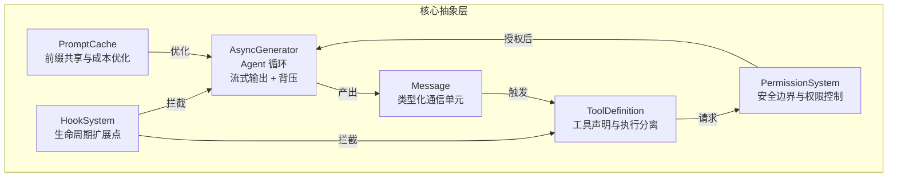
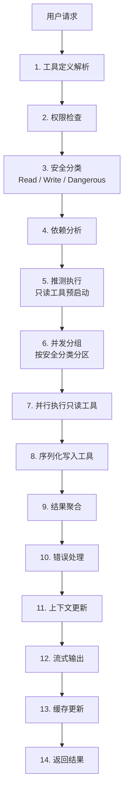
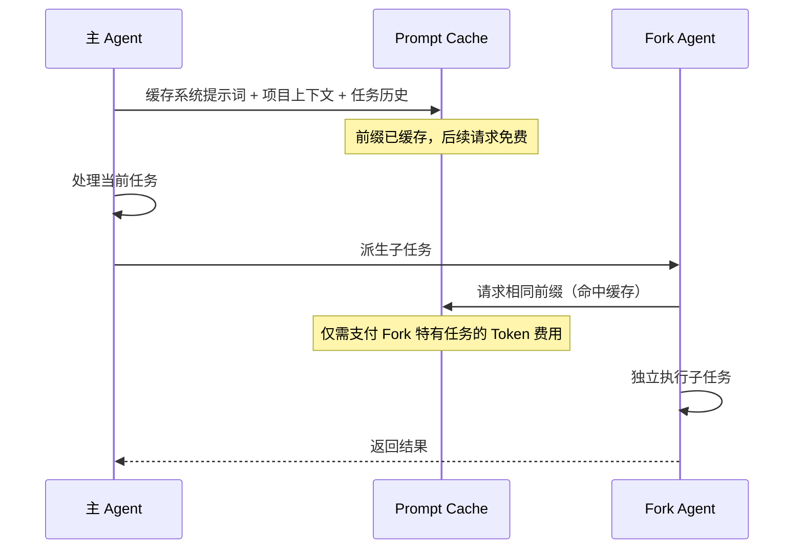
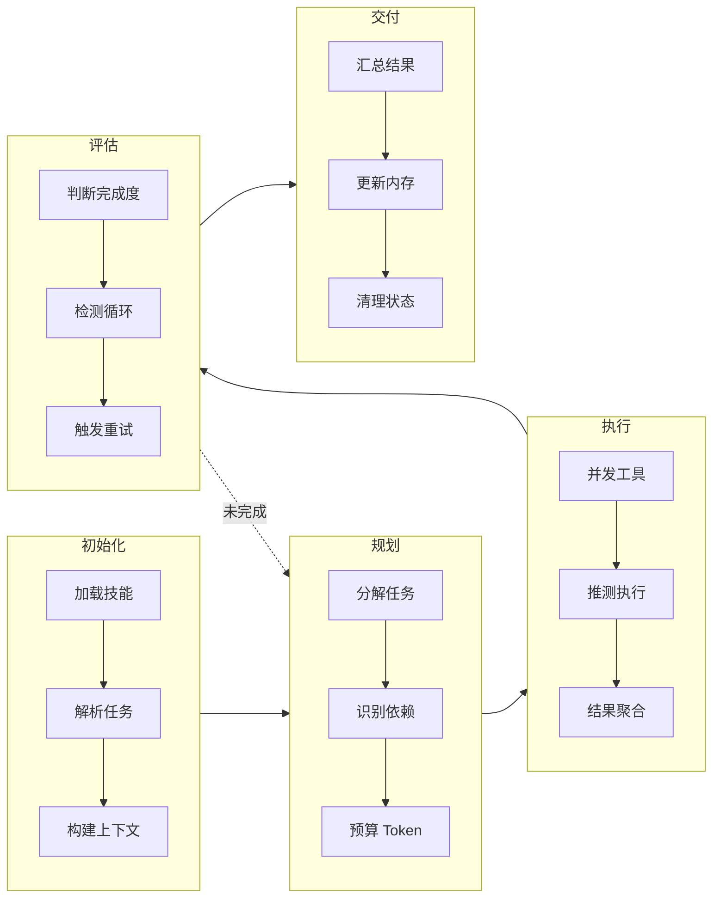

# Claude Code from Source：18 章深度拆解 Anthropic 最畅销 AI 编程工具的架构精髓

Claude Code 的架构价值不在于它实现了哪些功能，而在于它如何在流式生成、工具调度、成本控制这三个互相冲突的约束之间找到平衡点。一个 Agent 系统同时要快、要安全、要便宜，这三件事在工程上几乎不可能同时满足——而 Claude Code 给出了一套可复用的解法。

这篇文章的素材来自一本叫 *Claude Code from Source* 的技术书籍。它不来自 Anthropic 官方，而是一个叫 Alejandro Balderas 的开发者带着 36 个 AI Agent，花了 6 个小时写出来的。书本身的故事值得简短交代：Claude Code 发布到 npm 时，源码地图（source maps）一起打包了进去。Balderas 读了每一个 `.js.map` 文件中的 `sourcesContent` 字段，拿到了接近 2000 个原始 TypeScript 文件，然后用 36 个 Agent 协作，把这堆代码变成了一本 494KB 的叙事化技术书籍。所有代码块都改写为伪代码，使用不同的变量名，仅用于说明架构模式。

| 指标 | 数值 |
|------|------|
| 源仓库 | alejandrobalderas/claude-code-from-source |
| 章数 | 18 章，分为 7 个部分 |
| 参与 Agent | 36 个（6 探索 + 12 分析 + 15 写作 + 3 审核） |
| 创作耗时 | 6 小时，从源码提取到最终修订 |
| 产出 | 494KB 原始技术文档 → 叙事化书籍 |

本文不复述原书全部 18 章内容，而是提取其中迁移价值最高的架构设计——那些你在构建自己的 Agent 系统时可以直接借鉴的模式。

## 你会从这篇文章里拿到什么

读完本文，你应该能够：

- 说清 Claude Code 六大核心抽象各自的职责，以及它们之间的数据流向
- 解释 AsyncGenerator 驱动的 Agent 循环相比 `while True` 的三个本质优势
- 复述 14 步工具执行管道中推测执行和并发安全分组的位置与顺序依据
- 判断 Fork 模式 95% 成本节省的前提条件，以及何时该用 LLM 召回而非向量搜索
- 在自己的 Agent 项目中挑选合适的模式组合，并知道每个模式的适用边界

## 目录

1. [六大核心抽象：理解 Claude Code 的骨架](#六大核心抽象理解-claude-code-的骨架)
2. [Agent 循环：一个 AsyncGenerator 驱动的状态机](#agent-循环一个-asyncgenerator-驱动的状态机)
3. [工具执行管道：14 步中暗藏的并发智慧](#工具执行管道14-步中暗藏的并发智慧)
4. [多 Agent 编排：Fork 模式与 95% 的成本魔法](#多-agent-编排fork-模式与-95-的成本魔法)
5. [内存系统：为什么选择 LLM 召回而不是向量搜索](#内存系统为什么选择-llm-召回而不是向量搜索)
6. [性能工程：240ms 冷启动的背后](#性能工程240ms-冷启动的背后)
7. [可扩展性：两阶段加载与 27 个钩子](#可扩展性两阶段加载与-27-个钩子)
8. [安全设计：默认拒绝 + 配置不可变](#安全设计默认拒绝--配置不可变)
9. [MCP：8 种传输协议的统一抽象](#mcp8-种传输协议的统一抽象)
10. [一个任务如何流过系统](#一个任务如何流过系统)
11. [10 个可迁移的架构模式与采用顺序](#10-个可迁移的架构模式与采用顺序)
12. [常见问题](#常见问题)
13. [错误处理与排查指引](#错误处理与排查指引)
14. [自检测试](#自检测试)

## 六大核心抽象：理解 Claude Code 的骨架

Claude Code 的架构建立在六个核心抽象之上。理解它们之间的关系，就读懂了整个系统的数据流向。



**AsyncGenerator** 是整个系统的心脏。它是一个生成器函数，不是传统的请求-响应循环——模型每产出一个 token，就 `yield` 一条 Message。下游消费慢了就自动暂停生成（背压），外部可以随时终止生成器（取消）。

**Message** 是系统中流通的唯一数据类型。文本 token、工具调用结果、错误信息、系统事件，全部封装为统一的消息结构。这种归一化消除了类型转换的开销，也让 Hook 系统可以在任意节点插入处理逻辑。

**ToolDefinition** 将工具的声明和执行彻底解耦。声明阶段只描述工具的 JSON Schema（名称、参数、描述），执行阶段才真正调用底层函数。这个分离是推测执行和并发安全分组的基础——系统可以在不了解工具具体实现的情况下，先对工具进行分类和调度。

**PermissionSystem** 按 Read / Write / Dangerous 三级分类所有工具操作。默认拒绝，明确允许。它在启动时冻结所有配置，运行时无法修改，杜绝了 prompt injection 通过配置文件提权的可能性。

**PromptCache** 利用 Anthropic 的 Prompt Caching API，将系统提示词、项目上下文等不变前缀缓存起来，后续请求只需为差异部分付费。在 Fork Agent 场景中，这一机制的效果被放大了将近 20 倍。

**HookSystem** 提供了 27 个生命周期钩子，分布在工具执行前后、上下文压缩、会话恢复等关键节点。第三方开发者可以通过钩子注入自定义逻辑，而无需修改核心循环。

六个抽象的边界要先划清楚：AsyncGenerator 管"产出什么"，Message 管"流通什么"，ToolDefinition 管"能做什么"，PermissionSystem 管"允许做什么"，PromptCache 管"省多少钱"，HookSystem 管"在哪里扩展"。它们之间没有继承关系，全部通过 Message 解耦。后面所有章节都是在讲这六个抽象如何协作。

## Agent 循环：一个 AsyncGenerator 驱动的状态机

很多人把 Agent 循环想象成一个 `while True` 的死循环。Claude Code 的实现更优雅——它是一个 AsyncGenerator，向外 `yield` Message，向内通过 `next()` 接收外部信号。

```typescript
async function* agentLoop(query: Query): AsyncGenerator<Message> {
 for await (const token of model.stream(query)) {
 yield { type: 'token', value: token }
 }

 const speculativeReads = await executeReadToolsSpeculatively(query)

 if (error) {
 await recoverAndCompact()
 }

 await compressContextIfNeeded()
}
```

调用方拿到的是一个迭代器，可以逐条消费消息，也可以在任意时刻 `break` 终止循环。对于需要与用户界面交互的场景，UI 层可以随时中断 Agent 的执行，不会留下僵尸进程。

### 四层上下文压缩：渐进式遗忘

长对话是所有 Agent 系统的共同难题。Claude Code 的解法是渐进式压缩——根据 Token 使用率触发不同强度的压缩策略，不是一次性压缩。

| 层级 | 触发条件 | 压缩方式 | 保留策略 |
|------|----------|----------|----------|
| Snip | 输出超长 | 截断中间轮次 | 保留首尾消息 |
| Microcompact | Token 超 50% | 合并相邻同角色消息 | 语义完整性 |
| Collapse | Token 超 70% | LLM 摘要合并 | 关键决策点 |
| Autocompact | Token 超 90% | 深度摘要 + 重放 | 核心上下文 |

为什么是四层而不是一个统一压缩函数？在 50% 用量时做深度摘要不划算——既浪费计算资源，又增加了等待延迟。Snip 几乎是零成本的字符串操作，Microcompact 也不过是合并相邻消息。只有当用量逼近极限时，才值得调用一次 LLM 做 Collapse 或 Autocompact。

绝大多数短对话完全不会触发压缩，中等长度的对话只需 O(n) 的字符串合并，只有真正的超长对话才激活 LLM 级别的摘要压缩。

## 工具执行管道：14 步中暗藏的并发智慧

工具调用看起来简单——模型输出一个工具名和参数，系统执行并返回结果。但 Claude Code 的实现暴露了生产级系统才需要考虑的复杂度。



### 推测执行：在模型开口之前行动

14 步管道中最具创新性的是第 5 步——推测执行（Speculative Execution）。

传统流程是线性的：模型思考完 → 输出工具调用 → 系统执行 → 返回结果。Claude Code 的做法是：模型产出第一个 token 时，系统就开始预判可能需要的只读工具，并提前启动执行。

```typescript
async function speculativeExecute(query: Query) {
 const plan = await model.plan(query)

 const readResults = await Promise.all(
 plan.readTools.map(tool => tool.execute())
 )

 if (plan.writeTools.length > 0) {
 await model.confirm()
 await executeWrites(plan.writeTools)
 }

 return { readResults, writeResults }
}
```

为什么只预启动只读工具？只读操作不产生副作用——读文件、搜索代码、查看 git log，这些操作即使预判错了也只是浪费一点计算，不会破坏任何状态。写操作则必须等待模型完整确认，因为错误的写入可能造成不可逆的破坏。

### 并发安全分组：读并行，写串行

第 6 步的并发分组是另一个精妙的设计。所有工具被分为三个安全分区：

```typescript
const partitions = {
 read: tools.filter(t => t.safety === 'read'),
 write: tools.filter(t => t.safety === 'write'),
 dangerous: tools.filter(t => t.safety === 'dangerous')
}

const readResults = await Promise.all(
 partitions.read.map(t => t.execute())
)

for (const tool of partitions.write) {
 await tool.execute()
}
```

只读工具完全并行执行——读 10 个文件和读 1 个文件的耗时几乎一样。写入工具串行执行，避免竞争条件。危险工具则需要用户逐项确认。

这种分区策略的效果很直接：假设一次工具调用涉及 5 个读文件和 2 个写文件，并行化的只读部分让总耗时从 Σ(所有工具) 缩短为 Σ(写工具) + max(读工具)。在一个典型的代码库搜索场景中，这可以轻松节省 60% 以上的工具执行时间。

注意第 5 步和第 6 步的顺序不能互换。推测执行需要对工具有一个基本的分类（至少区分读和写），而安全分组恰好提供了这个分类。如果先做推测执行再分组，你无法判断哪些工具可以安全地预启动。

## 多 Agent 编排：Fork 模式与 95% 的成本魔法

Claude Code 的多 Agent 系统不是简单的"启动多个实例"。它的 Fork 模式利用了一个巧妙的事实：父子 Agent 共享字节完全相同的前缀时，Prompt Cache 可以复用。



```typescript
const mainPrompt = [
 systemPrompt,
 projectContext,
 taskHistory,
 currentTask
]

const forkedPrompt = [
 systemPrompt,
 projectContext,
 taskHistory,
 forkedTask
]
```

主 Agent 和 Fork Agent 的前三部分是逐字节相同的。在 Anthropic 的 Prompt Caching 机制下，缓存命中部分完全免费——Fork Agent 只需为其独有的 `forkedTask` 部分付费。如果系统提示词和项目上下文占了总 prompt 的 90% 以上，Fork 的成本就只有主 Agent 的 5% 到 10%。

这不只是一个成本优化的技巧。它改变了多 Agent 系统的经济模型——在成本几乎为零的情况下派生子 Agent，意味着你可以为一个复杂任务的每个子问题都分配一个专门的 Agent，而不必担心预算爆炸。

### Agent 生命周期的 15 个步骤

每个 Agent 从创建到销毁经历 15 个步骤，分为五个阶段：



评估阶段的循环检测尤为关键。当 Agent 陷入"读文件 → 不理解 → 再读更多文件"的死循环时，系统会在检测到重复工具调用模式后强制触发重试或上下文压缩，打断这个无意义的循环。

## 内存系统：为什么选择 LLM 召回而不是向量搜索

Claude Code 使用文件系统作为长期记忆的载体——不是数据库，不是向量存储，就是普通的文件。四类内存各有不同的存储形式和召回方式：

**System Prompt** 是角色定义，静态文件，启动时加载一次，整个会话期间不变。

**Project Context** 是项目级的代码结构信息（目录树、关键文件索引、依赖关系）。它存储为项目文件，由 LLM 在需要时选择加载哪些部分。

**Conversation History** 是对话的完整记录，以消息文件形式存储，召回时同时考虑时间衰减和相关度评分。

**Learned Principles** 最特别——它是 Agent 在多次会话中积累的经验教训，以增量文件形式追加，由 LLM 做 side-query 来召回相关内容。

### LLM 召回 vs 嵌入搜索：不是技术偏好，是工程取舍

很多人看到"LLM 召回"的第一反应是：为什么不用向量数据库 + 嵌入搜索？成本更低，速度更快。在写了多个 Agent 系统之后，我对这两种方案的理解如下。

**延迟对比**。嵌入搜索的延迟通常在 10-50ms 之间（取决于索引规模），而 LLM side-query 的延迟在 200-800ms。表面上看嵌入搜索快得多，但这里有一个容易被忽略的细节：嵌入搜索需要提前将所有记忆编码为向量并构建索引。如果你有 1000 条记忆，每次新增一条都需要重新编码——这个一次性成本往往被忽略不计，但在频繁更新的场景下会累积。LLM 召回不需要索引维护，每条新记忆直接追加到文件末尾即可。

**语义理解深度**。这是 LLM 召回真正拉开差距的维度。嵌入搜索本质上是余弦相似度匹配——它擅长找"表面相近"的内容。但 Agent 的记忆往往需要跨领域的关联推理。举例：一条记忆是"用户不喜欢自动格式化代码"，另一条是"用户在 Python 项目中用了 Black"。嵌入搜索很可能匹配不到这两条记忆之间的关联，因为它们的关键词和语义向量分布差异很大。但 LLM 可以理解"既然用了 Black，那自动格式化这一条可能已经过时了"——这是嵌入搜索做不到的跨记忆推理。

**冷启动成本**。嵌入搜索需要嵌入模型和向量数据库，这引入了两个外部依赖和对应的运维成本。如果你已经在用 Claude API，LLM 召回是零额外依赖的方案——同样一个模型，既做核心推理，也做记忆召回。对于独立开发者或小团队来说，减少一个需要维护的外部服务，比节省几十毫秒的延迟更有价值。

**多语言和模糊查询**。嵌入模型对多语言的支持参差不齐。假设你的记忆中有中英文混杂的内容，嵌入搜索可能因为语言差异而误排。LLM 天然理解多语言，甚至能处理"帮我找上次那个关于 Rust borrow checker 的讨论"这样包含领域术语和自然语言混合的查询。

**一个混合策略**。在实际项目中，最优解往往不是二选一。我在自己的 Agent 系统中采用了分层策略：对于数量庞大但内容简单的记忆（如文件修改历史、git 操作记录），用嵌入搜索做初筛；对于数量少但需要深度推理的记忆（如用户偏好、经验教训），用 LLM 召回做精确匹配。Claude Code 选择纯 LLM 召回，是因为它的记忆体量还没大到需要嵌入索引来加速的程度——目前大多数用户的记忆文件不会超过几千条，LLM 召回完全够用。

```typescript
async function recallMemories(query: Query, context: Context) {
 const relevantMemories = await sonnet.query(
 `Given the current task: ${query}
 And context: ${context}
 Which memories from past sessions are relevant?
 List them verbatim.`
 )

 return relevantMemories
}
```

## 性能工程：240ms 冷启动的背后

Claude Code 的冷启动时间控制在 240ms 左右，这对于一个需要加载配置、技能、模型、内存和 UI 的系统来说是相当激进的数字。

```typescript
async function bootstrap() {
 const [
 config,
 skills,
 model,
 memory,
 ui
 ] = await Promise.all([
 loadConfig(),
 loadSkills(),
 initModel(),
 restoreMemory(),
 initUI()
 ])

 return { config, skills, model, memory, ui }
}
```

核心思路是消除一切不必要的串行依赖。五个初始化模块彼此独立，全部并行启动。总耗时等于最慢模块的耗时，而不是五个模块的耗时代数和。

但 240ms 不只是一个并行 I/O 的成果。slot reservation（槽位预留）和 bitmap 预过滤是另外两个关键优化。

**Slot Reservation** 处理的是输出溢出的成本问题。Claude Code 默认分配 8K token 的输出槽位，覆盖 99% 的常规请求。当输出触及上限时，自动扩容到 64K。这个 8K 默认值不是随便选的——在 Anthropic 的计费模型中，预留更大的输出槽意味着更高的成本，即使你实际没用到那么多。8K 是统计上的甜点。

**Bitmap 预过滤** 用于加速文件搜索。传统的模糊搜索需要遍历所有候选文件并用字符串匹配算法逐一比对。Claude Code 预计算了每个文件的三种 bitmap 索引（内容、路径、符号），搜索时先用 bitmap 做快速的 AND 运算，过滤掉不相关的文件，再对缩小后的候选集做精确匹配。这个 trick 在大型 monorepo 中的效果尤其明显。

## 可扩展性：两阶段加载与 27 个钩子

Claude Code 的技能系统采用两阶段加载：

```typescript
const skillMeta = {
 name: 'git操作',
 triggers: ['git commit', 'git push'],
 permissions: ['read:repo', 'write:repo'],
}

async function invokeSkill(skill: SkillMeta) {
 if (!skill.isLoaded) {
 skill.content = await loadSkillContent(skill.path)
 skill.isLoaded = true
 }
 return execute(skill.content)
}
```

启动时只加载技能的元数据（YAML frontmatter），包括名称、触发条件和权限声明。技能的实际内容直到被触发时才加载。对于像 Claude Code 这样可能有数十个技能的系统，这个策略避免了启动时加载所有技能内容导致的内存膨胀。

钩子系统则提供了 27 个生命周期钩子，覆盖了工具执行前后、上下文压缩、会话恢复等关键节点。所有钩子配置在启动时被 `deepFreeze` 冻结，运行时任何修改配置的尝试都会被拒绝——这是防止 prompt injection 通过配置注入的关键防线。

## 安全设计：默认拒绝 + 配置不可变

Claude Code 的安全模型建立在两个原则上：默认拒绝，配置不可变。

```typescript
const permissionMatrix = {
 default: 'deny',

 allow: [
 'Read:repo',
 'Write:repo',
 'Execute:shell',
 ],

 deny: [
 'Execute:sudo',
 'Read:/etc/*',
 'Write:~/.ssh',
 ]
}
```

所有未明确允许的操作默认被拒绝。允许列表中的每一项都需要用户显式授权。拒绝列表则用于覆盖——即使某个操作在技术上是"写入仓库"的一部分，如果它涉及 `~/.ssh`，仍然被拦截。

配置不可变则更进一步：所有敏感配置在启动时通过 `deepFreeze` 冻结，即使恶意代码尝试在运行时修改配置，也会直接抛出 SecurityError。

## MCP：8 种传输协议的统一抽象

Claude Code 的 MCP 支持覆盖了从本地进程到浏览器的各种通信场景：

| 传输类型 | 适用场景 |
|----------|----------|
| stdio | 本地 CLI 工具集成 |
| HTTP + SSE | Web 应用的长连接 + 服务端推送 |
| WebSocket | 需要双向通信的实时应用 |
| Streamable HTTP | 大文件流式传输 |
| Server-Sent Events | 简单的单向事件推送 |
| WebRTC | 浏览器端 P2P 通信 |
| Docker | 容器化隔离环境 |
| stdio (local) | 本地进程间通信 |

8 种传输协议被抽象为统一的接口，上层的工具包装逻辑不感知底层传输的差异。同一个 MCP 工具可以在本地 stdio 和远程 WebSocket 之间无缝切换，工具的使用者无需修改任何代码。

## 一个任务如何流过系统

抽象讲完了，来看一个具体任务从输入到完成的完整路径。假设用户输入："帮我看看 src/ 目录下哪些文件没有单元测试"。

1. **入口**：`agentLoop` 接收 query，进入 AsyncGenerator。模型开始流式产出 token，UI 层逐条消费 Message 渲染。
2. **推测执行**：模型产出第一个 token 时，系统预判这是一个只读任务，提前启动 `list_files(src/)` 和 `glob('**/*.test.*')`。
3. **权限检查**：两个工具都是 Read 级别，命中允许列表，无需用户确认。
4. **并发分组**：两个只读工具被分到 read 分区，并行执行。
5. **结果聚合**：拿到 src/ 下所有文件列表和所有测试文件列表。
6. **模型推理**：系统把两组结果作为 Message 喂回模型，模型做差集运算，输出"哪些文件没有对应测试"。
7. **上下文更新**：本轮对话追加到 Conversation History，如果 Token 用量超过 50%，触发 Microcompact。
8. **缓存更新**：系统提示词 + 项目上下文 + 任务历史这部分前缀被写入 Prompt Cache。
9. **流式输出**：模型产出的回答 token 逐条 yield 给 UI，用户看到逐字渲染的结果。

这个流程里，推测执行节省了等待模型完整输出的时间，并发分组让两个只读工具同时跑，Prompt Cache 让后续的 Fork Agent 几乎免费。三个机制各管一件事，但合在一起把首字节延迟和总成本同时压了下来。

## 10 个可迁移的架构模式与采用顺序

从 18 章的源码分析中，可以提炼出 10 个不依赖 Claude 或 Anthropic 的具体架构模式。按采用难度从低到高排列，前 5 个是任何 Agent 系统都应该考虑的基础设施，后 5 个是规模上来之后才需要的优化。

**第一梯队：基础设施（先做）**

**AsyncGenerator 驱动**。核心循环是一个生成器函数而非死循环。天然支持背压和外部取消。适用于所有需要流式输出和可中断性的 Agent 系统。迁移成本最低——把现有 `while True` 改写成 `async function*` 即可。

**并发安全分组**。按 Read / Write / Dangerous 分类工具，读并行写串行。这个分组逻辑与具体的 LLM 或框架无关，可以直接应用于任何多工具系统。前提是你的工具元数据里有副作用声明。

**钩子配置快照**。启动时冻结所有可配置项，运行时任何修改尝试都被拒绝。这是防御 prompt injection 通过配置注入的基本策略。任何接受第三方扩展的 Agent 系统都应该做。

**两阶段技能加载**。启动时只加载元数据，触发时才加载完整内容。适用于任何需要动态加载模块的插件系统。前提是技能内容可以按需读取（文件系统或远端存储）。

**默认拒绝权限矩阵**。所有未明确允许的操作默认被拒绝。这是安全底线，不是优化项。

**第二梯队：规模优化（按需做）**

**四层上下文压缩**。Snip → Microcompact → Collapse → Autocompact，从零成本到高成本的渐进式压缩。不需要四层，两层也能显著降低压缩开销。当你的用户开始抱怨长对话变慢或变贵时再做。

**推测执行**。在模型流式输出时预启动只读工具。关键约束是只允许无副作用的操作参与推测。适用于任何需要降低首字节延迟的工具调用场景。前提是你的工具调用有明确的读/写分类。

**LLM 召回内存**。用 LLM side-query 选择相关记忆，而非向量搜索。如果你的系统不需要处理海量记忆（万条以上），这个方案比嵌入搜索更简单且效果更好。

**粘性门闩**。Beta 头一旦发送就永不撤销。如果你的缓存系统按字节匹配，这个模式可以最大化缓存命中率。只在你的 LLM 提供商支持前缀缓存时才有意义。

**Fork 缓存共享**。父子 Agent 共享字节相同的前缀以利用 Prompt Cache。如果你的 LLM 提供商支持前缀缓存（OpenAI 的 Prompt Caching、Google 的 Context Caching），同样适用。这是成本最高的模式——需要你重新设计 prompt 结构以确保前缀字节一致。

**适用边界提醒**：10 个模式中，只有 Fork 缓存共享强依赖 Anthropic 特有的 Prompt Cache 机制（OpenAI 和 Google 也有类似的前缀缓存，但行为和计费方式略有不同），其余 9 个都是模型无关的纯架构模式。AsyncGenerator、并发安全分组、四层压缩、两阶段加载——这些模式在任何语言、任何 LLM 提供商下都可以直接应用。

## 18 章内容速览

原书分为 7 个部分，以下是各章的核心内容，方便你判断哪些章节值得精读。

**Part 1: Foundations（第 1-4 章）**

第 1 章从头梳理六大核心抽象、数据流和权限系统的设计原则。第 2 章分析启动管线——五个模块的并行 I/O 策略和信任边界的划分。第 3 章讨论状态管理，引入了粘性门闩（sticky latch）模式：Beta 头一旦在会话中发送，就永远不撤销，以此保证缓存稳定性。第 4 章是多模型提供商的 API 抽象层，包括 Prompt Cache 的集成方式和流式输出中的错误恢复策略。

**Part 2: The Core Loop（第 5-7 章）**

第 5 章是全书最重的一章——对 `query.ts` 的深度分析，覆盖四层压缩的触发逻辑、错误恢复的状态机和 Token 预算的动态管理。第 6 章拆解工具接口的设计，从 ToolDefinition 的声明到 14 步执行管道的每一步。第 7 章专注于并发——分区算法如何按安全分类对工具分组，推测执行如何在流式过程中预启动只读工具。

**Part 3: Multi-Agent Orchestration（第 8-10 章）**

第 8 章介绍 AgentTool——将子 Agent 封装为工具的机制，以及 15 步 runAgent 生命周期。第 9 章深入 Fork Agent 与 Prompt Cache 的协作原理。第 10 章讨论任务状态机、Coordinator 模式和 Swarm 架构中的消息传递协议。

**Part 4: Persistence and Intelligence（第 11-12 章）**

第 11 章讲文件式内存系统——四类内存分类、LLM 召回的具体实现和陈旧记忆的自动警告机制。第 12 章讲技能和钩子系统的可扩展性设计。

**Part 5: The Interface（第 13-14 章）**

第 13 章分析终端 UI——基于 Ink 框架的自定义分支、渲染管线和双缓冲机制。第 14 章讲输入处理——键解析、键绑定、和弦支持和 Vim 模式。

**Part 6: Connectivity（第 15-16 章）**

第 15 章介绍 MCP 协议的 8 种传输实现和 OAuth 集成。第 16 章讲远程控制和云端执行——Bridge v1/v2、CCR 协议和上游代理。

**Part 7: Performance Engineering（第 17-18 章）**

第 17 章是性能优化的专题——从 240ms 冷启动到上下文窗口管理再到渲染管线。第 18 章是全书总结，讨论了 5 个关键的架构赌注和可迁移性。

## 常见问题

**问：源码地图到底是什么？为什么通过 npm 就能拿到 Claude Code 的源码？**

源码地图（source map）是 JavaScript/TypeScript 生态中的标准机制，用于将压缩、转译后的代码映射回原始源码。`.js.map` 文件中的 `sourcesContent` 字段直接包含了原始源码的完整内容。Claude Code 发布到 npm 时包含了这些 map 文件，因此任何人都可以通过 `npm install` 后读取它们。这是 npm 生态中源映射的常规做法，不是安全漏洞——大多数 TypeScript 项目发布时都会附带 source map。

**问：AsyncGenerator 相比普通的 `while True` 循环有什么本质优势？**

主要优势有三个。第一是背压——如果下游消费者处理不过来，生成器自动暂停，不会产生积压。第二是可取消性——外部可以通过 `break` 或 `return` 终止生成器，而 `while True` 需要额外的标志位和检查逻辑。第三是组合性——多个 AsyncGenerator 可以通过 `yield*` 组合，形成更复杂的处理管道，而循环式实现需要手动管理状态传递。

**问：Fork 模式下 95% 的成本节省是理论值还是实测值？有什么前提条件？**

这是基于 Prompt Cache 机制的理想值，实际效果取决于前缀在总 prompt 中的占比。前提条件是：系统提示词、项目上下文和任务历史这三部分在父子 Agent 中必须字节完全相同。如果子 Agent 需要不同的系统提示词（比如一个做代码审查、另一个做测试生成），缓存命中率就会下降。因此 Fork 模式最适合"同样的角色，不同的具体任务"这种场景。

**问：什么时候应该用嵌入搜索而不是 LLM 召回？**

如果你的记忆体量超过 1 万条，或者需要毫秒级的召回延迟，嵌入搜索是更好的选择。另外，如果你的记忆内容高度结构化（比如都是 JSON 格式的日志条目），嵌入模型可以更好地利用这种结构。经验法则是：记忆少于 5000 条 → 纯 LLM 召回；5000-20000 条 → LLM 召回 + 简单的关键词预过滤；超过 20000 条 → 嵌入搜索做初筛，LLM 做精排。

**问：四层压缩中，Collapse 和 Autocompact 的区别是什么？**

Collapse 是让 LLM 对历史消息做一次摘要，将多轮对话压缩为一段描述。Autocompact 则更进一步——它不仅做摘要，还会在摘要后"重放"关键信息，确保压缩后的上下文仍然包含足够准确的细节。Autocompact 的代价更高（需要额外的 LLM 调用），但它产出的压缩上下文质量也更高。在 Token 用量达到 90% 时，上下文窗口已经非常紧张，值得为 Autocompact 付出这个代价。

**问：MCP 协议和 OpenAI 的 Function Calling 有什么本质区别？**

Function Calling 是 OpenAI 专有的 API 约定，工具定义和调用结果都在 HTTP 请求体中传递，绑定在特定的 API 格式上。MCP 是一个独立于模型提供商的开放协议，定义了工具发现、调用和结果返回的标准化流程，支持多种传输层。Function Calling 是 API 层面的约定，MCP 是架构层面的协议——它允许你在完全不修改 Agent 代码的情况下切换工具的实现位置（从本地进程到远程服务器再到 Docker 容器）。

**问：这些架构模式能否迁移到基于 OpenAI 或其他模型的 Agent 系统？**

10 个可迁移模式中，除了 Fork 缓存共享依赖 Anthropic 特有的 Prompt Cache 机制（OpenAI 和 Google 也有类似的前缀缓存，但行为和计费方式略有不同），其余 9 个都是模型无关的纯架构模式。AsyncGenerator、并发安全分组、四层压缩、两阶段加载——这些模式在任何语言、任何 LLM 提供商下都可以直接应用。

**问：推测执行会不会带来安全风险？预启动的工具如果选错了怎么办？**

这正是为什么推测执行严格限制在只读工具上。只读工具不会产生副作用——读文件、搜索代码、查看 git log，即使预判错误也只是浪费了一点计算资源。写操作和危险操作永远不会参与推测执行，必须等待模型完整确认后才开始。此外，权限系统会在推测执行前再做一次校验：即使被标记为"只读"的工具，如果它的权限声明中有写入相关的权限，也会被排除在推测执行之外。

## 错误处理与排查指引

Claude Code 的架构里，错误处理不是事后补丁，而是嵌在 14 步管道的第 10 步。以下是几个常见问题的排查思路。

**Agent 陷入死循环，反复读同一个文件**

这是评估阶段的循环检测要解决的问题。排查步骤：先检查 Conversation History 里是否有重复的工具调用模式（连续 3 次以上调用同一工具且参数相近）。如果有，说明循环检测没有触发——可能是因为每次调用的参数有微小差异（比如文件路径加了不同的前缀），导致模式匹配失败。临时方案是手动中断 Agent 并重启会话；长期方案是在循环检测逻辑里加入参数归一化（去掉路径前缀差异后再比较）。

**Fork Agent 成本没有下降，反而比主 Agent 还贵**

这几乎总是前缀不一致导致的。排查步骤：打印主 Agent 和 Fork Agent 的完整 prompt，逐字节比较前三部分（systemPrompt、projectContext、taskHistory）。常见原因有三个：一是 systemPrompt 里包含了时间戳或会话 ID 等动态内容；二是 projectContext 在 Fork 之前被更新过；三是 taskHistory 的消息顺序在 Fork 时被重排。修复方法是把这些动态内容移到 prompt 的最后部分（currentTask 或 forkedTask），确保前三部分完全静态。

**长对话压缩后丢失了关键决策上下文**

这是 Collapse 或 Autocompact 摘要质量的问题。排查步骤：先确认触发的是哪一层压缩——如果 Token 用量在 70%-90% 之间，触发的是 Collapse；超过 90% 才是 Autocompact。如果是 Collapse 丢了上下文，可以考虑手动把关键决策消息标记为"不可压缩"（如果系统支持）；如果是 Autocompact 还丢，说明重放逻辑没有识别出哪些是关键信息。临时方案是在长对话中主动用一句话总结当前决策（"目前我们决定用方案 A，因为 X"），让摘要更容易捕获。

**冷启动时间突然从 240ms 飙到 2s+**

排查步骤：先用 `--profile` 启动（如果支持），看五个并行模块各自的耗时。最常见的原因是 restoreMemory 变慢——记忆文件积累太多，文件读取和解析成了瓶颈。如果记忆文件超过 1000 条，考虑做一次归档（把旧记忆移到归档目录，只在 side-query 时按需加载）。另一个常见原因是 loadSkills 串行化了——检查是否有技能在元数据加载阶段就触发了内容加载（比如某个技能的 triggers 字段写错了，导致启动时被误判为需要立即加载）。

**推测执行的工具结果没有被使用，浪费了计算**

这是推测执行的预期行为之一——预判本来就有可能错。但如果浪费比例超过 50%，说明推测策略需要调整。排查步骤：统计一段时间内推测执行的工具列表和最终实际使用的工具列表，计算交集。如果交集很小，说明 model.plan 的预测准确率太低，可能需要调整 plan 的 prompt 或减少参与推测的工具范围（比如只对历史命中率高的工具做推测）。

## 自检测试

阅读完这篇文章后，用以下问题检验自己的理解程度。如果你能流畅回答所有问题，说明你已经掌握了 Claude Code 的核心架构思想。

**1. AsyncGenerator 在 Agent 循环中解决了哪三个传统 `while True` 循环无法优雅解决的问题？**

提示：从背压、可取消性和可组合性三个角度思考。如果你只能说出"流式输出"，说明理解还不够深入——`while True + yield` 也能实现流式输出，AsyncGenerator 的独特价值在于与外部的交互方式。

**2. 14 步工具执行管道中，第 5 步"推测执行"和第 6 步"并发安全分组"的顺序能否互换？为什么？**

提示：推测执行需要对工具有一个基本的分类（至少区分读和写），而安全分组恰好提供了这个分类。如果你认为可以互换，请说明如何在不分组的情况下安全地做推测执行。

**3. Fork Agent 节省 95% 成本的原理是什么？如果主 Agent 的 system prompt 发生变化，对已缓存的 Fork Agent 有什么影响？**

提示：Prompt Cache 按字节匹配。任何一个字节的变化都会导致整个前缀缓存失效，需要重新缓存。system prompt 的稳定性直接决定了缓存策略的有效性。

**4. 有两个 Agent 系统设计：A 系统在 Token 用量达到 80% 时一次性调用 LLM 做深度压缩；B 系统采用类似 Claude Code 的四层渐进式压缩。在以下场景中，哪个系统体验更好？**
- 场景 1：用户平均对话 5 轮就结束（极少触发压缩）
- 场景 2：用户经常进行 50+ 轮的超长对话
- 场景 3：用户使用的是按 token 计费的 API

提示：A 系统在场景 1 中有优势（更少的条件判断），B 系统在场景 2 中有优势（渐进式压缩避免一次性等待），场景 3 则取决于压缩本身的 token 消耗。

**5. 你现在需要为一个代码审查 Agent 设计内存系统。你选择的方案是 LLM 召回还是嵌入搜索？请说明在以下条件下的选择理由：**
- 记忆体量：约 3,000 条代码审查记录
- 查询模式：用户经常问"上次那个关于 SQL 注入的问题是怎么修的？"
- 团队规模：个人开发者，没有运维支持
- 预算：每月 $50 API 费用

提示：3,000 条远低于嵌入搜索的规模门槛，自然语言查询模式适合 LLM 召回，个人开发者无法承受向量数据库的运维成本，$50 预算下 LLM side-query 的成本完全可接受。

**6. 如果你要将 Claude Code 的 Fork 模式迁移到 OpenAI 的 GPT-4 上，最大的挑战是什么？你会如何应对？**

提示：OpenAI 在 2024 年也推出了 Prompt Caching，但行为和计费方式与 Anthropic 不同。OpenAI 的缓存是自动的（无法手动控制缓存哪些部分），且缓存的过期时间更短。Fork Agent 的设计需要在 prompt 结构上做出调整——比如将可缓存前缀固定为前 N 个 token，并确保它在缓存过期时间内被复用。
