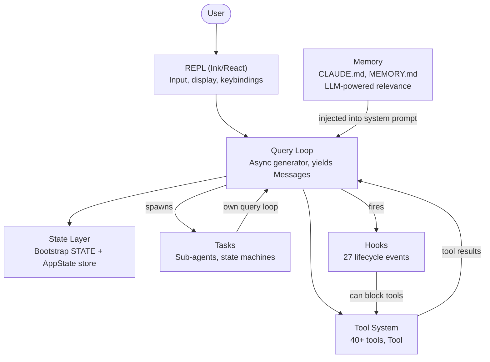
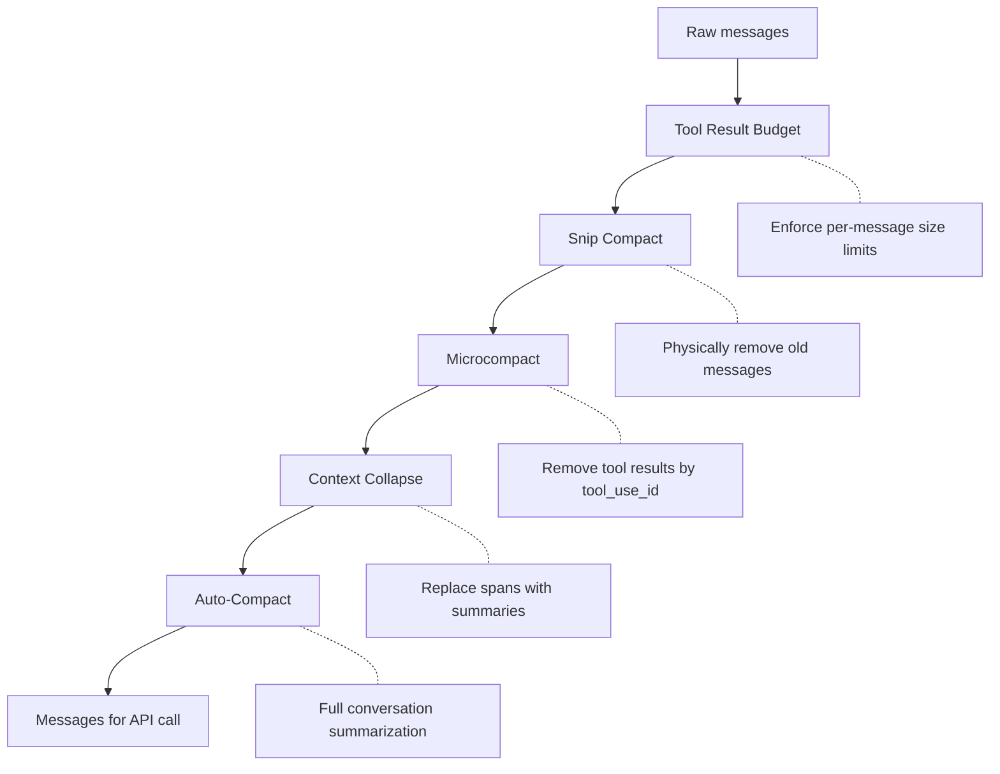
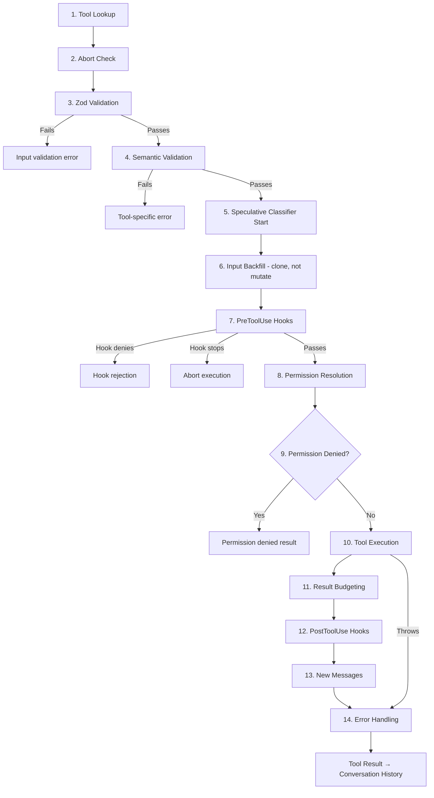

# Claude Code from Source：18 章深度拆解 Anthropic 最畅销 AI 编程工具的架构精髓

Claude Code 要同时满足流式生成、工具调度、成本控制三个互相冲突的约束——这三者工程上几乎不可能同时满足，它的解法值得拆开看。

本文的素材来自 *Claude Code from Source*，一本从 npm source maps 逆向分析 Claude Code 完整源码架构的技术书籍，由 Alejandro Balderas 带着 36 个 AI Agent 用时 6 小时写成。下面从 18 章里挑出能直接搬进自己 Agent 项目的架构模式。

| 指标 | 数值 |
|------|------|
| 源仓库 | alejandrobalderas/claude-code-from-source |
| Stars / Forks | 2,742 / 747（GitHub API 2026-08-05 验证） |
| 章数 | 18 章，分为 7 个部分 |
| 参与 Agent | 36 个（6 探索 + 12 分析 + 15 写作 + 3 审核） |
| 创作耗时 | 6 小时，从源码提取到最终修订 |
| 产出 | 494KB 原始技术文档 → 叙事化书籍 |

## 目录

1. [六大核心抽象：理解 Claude Code 的骨架](#六大核心抽象理解-claude-code-的骨架)
2. [Agent 循环：一个 AsyncGenerator 驱动的状态机](#agent-循环一个-asyncgenerator-驱动的状态机)
3. [工具执行管道：14 步中暗藏的并发智慧](#工具执行管道14-步中暗藏的并发智慧)
4. [多 Agent 编排：Fork 模式与 90% 的成本魔法](#多-agent-编排fork-模式与-90-的成本魔法)
5. [内存系统：为什么选择 LLM 召回而不是向量搜索](#内存系统为什么选择-llm-召回而不是向量搜索)
6. [性能工程：冷启动与上下文预算](#性能工程冷启动与上下文预算)
7. [可扩展性：两阶段加载与生命周期钩子](#可扩展性两阶段加载与生命周期钩子)
8. [安全设计：默认拒绝 + 七种权限模式](#安全设计默认拒绝--七种权限模式)
9. [MCP：8 种传输协议的统一抽象](#mcp8-种传输协议的统一抽象)
10. [一个任务如何流过系统](#一个任务如何流过系统)
11. [10 个可迁移的架构模式与采用顺序](#10-个可迁移的架构模式与采用顺序)
12. [常见问题](#常见问题)
13. [错误处理与排查指引](#错误处理与排查指引)
14. [自检测试](#自检测试)

## 六大核心抽象：理解 Claude Code 的骨架

Claude Code 的架构建立在六个核心抽象之上。理解它们之间的关系，就读懂了整个系统的数据流向。


```mermaid
graph TD
    User([User]) --> REPL["REPL (Ink/React)
Input, display, keybindings"]
    REPL --> QL["Query Loop
Async generator, yields Messages"]
    QL --> TS["Tool System
40+ tools, Tool<I,O,P>"]
    QL --> SL["State Layer
Bootstrap STATE + AppState store"]
    TS -->|tool results| QL
    QL -->|spawns| Tasks["Tasks
Sub-agents, state machines"]
    Tasks -->|own query loop| QL
    QL -->|fires| Hooks["Hooks
27 lifecycle events"]
    Hooks -->|can block tools| TS
    Memory["Memory
CLAUDE.md, MEMORY.md
LLM-powered relevance"] -->|injected into system prompt| QL
```

这里每个抽象对应一个或一组核心文件，承担独特的职责：

**1. Query Loop**（`query.ts`，~1,700 行）。整个系统的心跳，一个 async generator。它流式输出模型响应，收集工具调用，执行工具，把结果追加到消息历史，然后循环。每一次交互——REPL、SDK、子代理、无头 `--print`——都流经这个单一函数。它产出 `Message` 对象供 UI 消费，返回值是编码了停止原因的 discriminated union。generator 模式（而非回调或事件发射器）天然提供背压、干净取消和类型化终止状态。

**2. Tool System**（`Tool.ts`、`tools.ts`）。工具就是 Agent 能在世界上做的任何事情：读文件、运行 shell、编辑代码、搜索网页。每个工具实现了丰富接口：身份、schema、执行、权限、渲染。系统会把工具调用分区为并发和串行批，流式执行器会在模型还没完成响应前就启动并发安全工具。

**3. Tasks**（`Task.ts`、`tasks/`）。任务是后台工作单元——主要是子代理。它们遵循状态机：`pending -> running -> completed | failed | killed`。`AgentTool` 会 spawn 一个新的 `query()` generator，自带消息历史、工具集和权限模式。任务给 Claude Code 带来递归能力：一个 Agent 可以委托给子代理，子代理还能进一步委托。

**4. State**（两层）。系统在两个层级维护状态：一个可变单例（`STATE`）保存约 80 个会话级基础设施字段：工作目录、模型配置、成本追踪、遥测计数、会话 ID。启动时设置一次，直接修改——不需要响应式。最小响应式 store（34 行，Zustand 形态）驱动 UI：消息、输入模式、工具审批、进度指示器。分离是有意设计的：基础设施状态很少变化，不需要触发重渲染；UI 状态变化频繁，必须。

**5. Memory**（`memdir/`）。跨会话的持久化上下文，基于文件系统。分三级：项目级（仓库中的 `CLAUDE.md` 文件）、用户级（`~/.claude/MEMORY.md`）、团队级（通过符号链接共享）。会话启动时，系统扫描所有内存文件，解析 frontmatter，由 LLM 选择哪些记忆与当前对话相关。这就是 Claude Code"记住"你的代码库约定、架构决策和调试历史的方式。

**6. Hooks**（`hooks/`、`utils/hooks/`）。用户定义的生命周期拦截器，在 27 个不同事件点触发，覆盖四种执行类型：shell 命令、单次 LLM 提示、多轮 Agent 对话、HTTP webhook。钩子可以拦截工具执行、修改输入、注入额外上下文，甚至短路整个查询循环。权限系统本身部分通过钩子实现——`PreToolUse` 钩子可以在交互式权限提示出现前就拒绝工具调用。

## Agent 循环：一个 AsyncGenerator 驱动的状态机

把 Agent 循环写成 `while True` 的死循环是最直觉的做法。Claude Code 走了另一条路——它是一个 AsyncGenerator，向外 `yield` Message，向内通过 `next()` 接收外部信号。

```typescript
async function* agentLoop(query: Query): AsyncGenerator<Message> {
 for await (const token of model.stream(query)) {
 yield { type: 'token', value: token }
 }

 const speculativeReads = await executeReadToolsSpeculatively(query)

 if (error) {
 await recoverAndCompact()
 }

 await compressContextIfNeeded()
}
```

调用方拿到的是一个迭代器，可以逐条消费消息，也可以在任意时刻 `break` 终止循环。对于需要与用户界面交互的场景，UI 层可以随时中断 Agent 的执行，不会留下僵尸进程。

### 四层上下文压缩：按成本排序的顺序管线

长对话是所有 Agent 系统的共同难题。Claude Code 的解法不是按 Token 使用率触发不同策略，而是一条在每次 API 调用前按固定顺序执行的压缩管线，每一层都比上一层更重、更贵。


```mermaid
graph TD
    A[Raw messages] --> B[Tool Result Budget]
    B --> C[Snip Compact]
    C --> D[Microcompact]
    D --> E[Context Collapse]
    E --> F[Auto-Compact]
    F --> G[Messages for API call]
    B -.- B1[Enforce per-message size limits]
    C -.- C1[Physically remove old messages]
    D -.- D1[Remove tool results by tool_use_id]
    E -.- E1[Replace spans with summaries]
    F -.- F1[Full conversation summarization]
```

**Tool Result Budget（第 0 层）** 在压缩之前执行，`applyToolResultBudget()` 对工具结果实施逐条消息的大小限制；没有声明 `maxResultSizeChars` 的工具被豁免。

**Snip Compact（第 1 层）** 最轻的操作。从数组中物理移除旧消息，产出边界消息通知 UI。它报告释放了多少 token，这个数字会被带入 auto-compact 的阈值检查。

**Microcompact（第 2 层）** 按 `tool_use_id` 移除不再需要的工具结果。带缓存的 microcompact 会等到 API 响应之后再发出边界消息——因为客户端 token 估算不可靠，真实释放量以 API 返回的 `cache_deleted_input_tokens` 为准。

**Context Collapse（第 3 层）** 用摘要替换一段段对话。它刻意排在 auto-compact 之前：如果 collapse 已经把上下文压到 auto-compact 阈值以下，auto-compact 就变成空操作，从而保留更细粒度的上下文，而不是把一切塞进一个整体摘要。

**Auto-Compact（第 4 层）** 最重的操作：fork 一个完整的 Claude 对话来总结历史。它带有熔断器——连续 3 次失败后停止尝试，防止生产环境里出现的"会话卡在上下文上限上方、每天烧掉 25 万次 API 调用"的无限 compact 失败重试循环。

触发阈值不是百分比，而是从模型上下文窗口推导出的 token 缓冲：

```
effectiveContextWindow = contextWindow - min(modelMaxOutput, 20000)
Auto-compact 触发点：  effectiveWindow - 13,000
硬性阻塞上限：        effectiveWindow - 3,000
```

| 常量 | 值 | 用途 |
|------|-----|------|
| `AUTOCOMPACT_BUFFER_TOKENS` | 13,000 | auto-compact 触发点与有效窗口之间的余量 |
| `MANUAL_COMPACT_BUFFER_TOKENS` | 3,000 | 为 `/compact` 保留空间 |
| `MAX_CONSECUTIVE_AUTOCOMPACT_FAILURES` | 3 | 熔断阈值 |

13,000 token 的缓冲意味着 auto-compact 在硬性上限之前很久就触发。auto-compact 阈值与阻塞上限之间的地带由 reactive compact 负责——如果主动的 auto-compact 失败或被禁用，reactive compact 捕获 413 错误并按需压缩。token 计数用 `tokenCountWithEstimation`：组合 API 权威报告值与粗估算，且估算偏向更高，让 auto-compact 略早触发而非略晚。

## 工具系统：从定义到执行的 14 步管道

工具调用的表面流程很简单——模型输出一个工具名和参数，系统执行并返回结果。Claude Code 的实现把这个流程拆成了 14 步，每一步都对应生产级系统才需要考虑的复杂度。每次工具调用——文件读取、shell 命令、grep、子代理派发——都流经同一条管道，无论它是内置的 Bash 执行器还是第三方 MCP 服务器，都获得同样的校验、权限检查、结果预算和错误分类。

入口是 `checkPermissionsAndCallTool()`，意图在这一点变成行动。


```mermaid
graph TD
    S1[1. Tool Lookup] --> S2[2. Abort Check]
    S2 --> S3[3. Zod Validation]
    S3 -->|Fails| ERR1[Input validation error]
    S3 -->|Passes| S4[4. Semantic Validation]
    S4 -->|Fails| ERR2[Tool-specific error]
    S4 -->|Passes| S5[5. Speculative Classifier Start]
    S5 --> S6[6. Input Backfill - clone, not mutate]
    S6 --> S7[7. PreToolUse Hooks]
    S7 -->|Hook denies| ERR3[Hook rejection]
    S7 -->|Hook stops| STOP[Abort execution]
    S7 -->|Passes| S8[8. Permission Resolution]
    S8 --> S9{9. Permission Denied?}
    S9 -->|Yes| ERR4[Permission denied result]
    S9 -->|No| S10[10. Tool Execution]
    S10 --> S11[11. Result Budgeting]
    S11 --> S12[12. PostToolUse Hooks]
    S12 --> S13[13. New Messages]
    S13 --> S14[14. Error Handling]
    S14 --> DONE[Tool Result → Conversation History]
    S10 -->|Throws| S14
```

**第 1-4 步：校验。** `Tool Lookup` 会回退到 `getAllBaseTools()` 处理别名匹配，以兼容旧会话里被重命名的工具。`Abort Check` 防止在 Ctrl+C 传播前就排队、已无意义的工具调用浪费计算。`Zod Validation` 捕获类型不匹配；对延迟加载的工具，错误会追加一条先调用 `ToolSearch` 的提示。`Semantic Validation` 超越 schema 一致性——`FileEditTool` 拒绝空操作编辑，`BashTool` 在存在 `MonitorTool` 时拦截裸 `sleep`。

**第 5-6 步：准备。** `Speculative Classifier Start` 对 Bash 命令并行启动 auto 模式的安全分类器，为常见路径省掉数百毫秒。`Input Backfill` 克隆已解析的输入并补充派生字段（把 `~/foo.txt` 展开为绝对路径）供钩子和权限使用，同时保留原始输入以保证转录稳定。

**第 7-9 步：权限。** `PreToolUse Hooks` 是扩展机制——它们可以做出权限决定、修改输入、注入上下文，或直接停止执行。`Permission Resolution` 桥接钩子和通用权限系统：若钩子已决定则以其为准，否则由 `canUseTool()` 触发规则匹配、工具特检、基于模式（mode）的默认以及交互式提示。`Permission Denied Handling` 构造错误消息并执行 `PermissionDenied` 钩子。

**第 10-14 步：执行与清理。** `Tool Execution` 用原始输入运行真正的 `call()`。`Result Budgeting` 把过大的输出持久化到 `~/.claude/tool-results/{hash}.txt` 并用预览替换。`PostToolUse Hooks` 可以修改 MCP 输出或阻止继续。`New Messages` 追加新消息（子代理转录、系统提醒）。`Error Handling` 为遥测对错误分类，从可能损坏的名字中提取安全字符串，并发出 OTel 事件。

### 工具接口与默认值

每个工具都参数化于三个类型：`Tool<Input extends AnyObject, Output, P extends ToolProgressData>`。`Input` 是 Zod 对象 schema，一物两用：既生成发送给 API 的 JSON Schema，又通过 `safeParse` 在运行时校验模型响应。`Output` 是工具结果的 TypeScript 类型。`P` 是工具运行时发出的进度事件类型——`BashTool` 发 stdout 块，`GrepTool` 发匹配计数，`AgentTool` 发子代理转录。

没有工具定义直接构造 `Tool` 对象，全部经过 `buildTool()` 工厂，在具体定义下展开一套故障封闭（fail-closed）的默认值：

```typescript
const SAFE_DEFAULTS = {
  isEnabled:         () => true,
  isParallelSafe:    () => false,   // 忘记实现就串行执行
  isReadOnly:        () => false,   // 忘记实现就当写操作
  isDestructive:     () => false,
  checkPermissions:  (input) => ({ behavior: 'allow', updatedInput: input }),
}
```

一个省略 `isConcurrencySafe` 的新工具默认 `false`——串行执行，绝不并行。省略 `isReadOnly` 默认 `false`——系统把它当写操作。唯一没有故障封闭的默认是 `checkPermissions` 返回 `allow`，因为它是通用权限系统之后才执行的工具特有逻辑，"我没有反对意见"不等于"放行全部"。

并发是输入相关的：`isConcurrencySafe(input)` 接收解析后的输入，因为同一个工具对某些输入安全、对另一些不安全。`BashTool` 是典型例子——`ls -la` 只读且并发安全，`rm -rf /tmp/build` 则不是。

## 并发执行：分区与推测执行

单一工具调用有一条 14 步管道，但模型很少一次只请求一个工具。一次典型交互涉及 3 到 5 个工具调用。如果每个工具耗时 200ms，串行跑要一整秒；而独立的 Read 和 Grep 并行就能压到 200ms。关键在于：**并发安全是按调用、而非按工具类型决定的**。`Bash("ls -la")` 可以并行，`Bash("rm -rf build/")` 不行。系统必须在看到输入后才能判断。

Claude Code 用两层机制消掉等待时间。

### 分区算法：读并行，写串行

`partitionToolCalls()` 接收有序的 `ToolUseBlock` 数组，产出数组的数组，其中每个批次要么"全部并发安全"，要么"单个串行工具"。算法从左到右贪心扫描：

1. 按名字查工具定义。
2. 用工具的 Zod schema `safeParse()` 解析输入；解析失败则保守地判为不可并发。
3. 调用 `isConcurrencySafe(parsedInput)`。实例：`[Read, Read, Grep, Edit, Read]` 变成 3 个批次——`[Read, Read, Grep]` 并发、`[Edit]` 单独串行、`[Read]` 并发。
4. 合并或新建批次：当前工具并发安全且上一批也是 → 追加；否则新建批次。

分区是贪心且保序的。连续的安全工具汇入一个批次，任何不安全工具打断并开启新批次。并发批次的并发上限默认 10，可用 `CLAUDE_CODE_MAX_TOOL_USE_CONCURRENCY` 调整——10 已足够宽裕，因为单次模型响应很少超过五六次工具调用。

并发批次的上下文修饰器（context modifier）不会立即应用——同批其他工具正在读同一个上下文。它们被收集到按工具 ID 键控的 map，等整批结束后按工具顺序（而非完成顺序）应用，保证上下文演化确定。

### 推测执行：在模型流式结束前开工

批处理在模型响应到达后消除不必要的串行化。但响应本身要花 2-3 秒流式到达，第一个工具调用在 500ms 后就可解析——为什么要等剩下的 2 秒？

`StreamingToolExecutor` 实现推测执行：模型流式输出时，每个完整解析的 `tool_use` 块立刻交给执行器跑起来，不等模型生成下一个工具调用。到响应流结束，几个工具可能已经完成。模型一次请求五个只读工具、响应流需要 3 秒时，这五个工具都能在这 3 秒内启动并完成，事后 drain 阶段无事可做。

工具进入执行器的准入门槛是一个互斥谓词：

```
canRun = noToolsRunning || (newToolIsSafe && allRunningAreSafe)
```

要么没有工具在跑，要么新工具和所有在跑工具都并发安全。不可并发的工具要求独占——其他一切都不能在跑；并发工具可以共享跑道，但执行集中的任何一个非并发工具都会卡住所有人。

错误级联是有选择的：**只有 Bash 错误会级联取消兄弟工具**。Bash 命令常形成隐式依赖链（`mkdir build && cp src/* build/`），`mkdir` 失败后继续跑 `cp` 和 `tar` 没有意义。Read 和 Grep 错误则相互独立——一个文件读取失败与另一个目录的并发 grep 无关，取消它反而浪费工作。结果总是按原始工具顺序产出，保证模型推理确定。

## 多 Agent 编排：Fork 模式与 90% 的成本魔法

Claude Code 的多 Agent 系统走的是 Fork 模式，而非简单地启动多个实例。当一个父 Agent 并行 spawn 五个子 Agent，每个子请求的绝大部分是相同的：系统提示词、工具定义、对话历史、触发 spawn 的 assistant 消息都一样，只有最后的指令不同——"你处理数据库迁移""你写测试""你更新文档"。

在一条已热起来的会话里，共享前缀可能有 80,000 token，每个子 Agent 的专属指令只有 200 token——99.75% 的重叠。Anthropic 的 prompt cache 对命中的输入 token 打 9 折。如果你能让这 80,000 token 对第 2 到第 5 个子 Agent 都命中缓存，这四个请求的输入成本就砍掉 90%。对父 Agent 而言，同样的并行派发从花 $4 变成花 $0.50。

代价是 prompt cache 是**逐字节精确**匹配。不是"差不多"，不是"语义等价"，而是从系统提示词第一个字节到专属内容分叉前最后一个字节，字符必须完全一致。多一个空格、重排一个工具定义、一个过期 feature flag 改变系统提示词片段——缓存就 miss，整个前缀全价重算。

Fork 是不伪装成编排功能的 prompt cache 利用机制。它的每一个设计决定都回溯到同一个问题：如何保证并行子 Agent 之间前缀字节完全一致？

### Fork 子 Agent 继承什么

Fork 子 Agent 从父 Agent 继承四样东西，且都是以引用或逐字节精确拷贝的方式，而非重新计算：

1. **系统提示词**。不重新生成，而是线程传递——父 Agent 最近一次 API 调用实际发送的渲染后字节，通过 `override.systemPrompt` 传入。如果重新调用 `getSystemPrompt()`，GrowthBook feature flag 从冷到热的状态转移可能让条件块多一个字符，缓存就炸了。线程化渲染字节消除了这类分歧。
2. **工具定义**。普通子代理走 `resolveAgentTools()`，会按工具子集、顺序和权限注解重排。Fork 跳过这一步：`useExactTools` 为 true 时，子 Agent 直接拿到父 Agent 组装好的工具数组，包括把 `Agent` 工具本身留在池里——移除它会改变工具数组、弄坏缓存。
3. **对话历史**。父 Agent 与 API 交换的每一条消息——用户轮、assistant 轮、工具调用、工具结果——都通过 `forkContextMessages` 克隆进子 Agent 上下文。
4. **推理配置与模型**。Fork 定义 `model: 'inherit'`，解析为父 Agent 的精确模型。相同模型意味着相同 tokenizer、相同上下文窗口、相同缓存命名空间。

### 字节一致前缀的构造

`buildForkedMessages()` 构造共享历史与专属指令之间最后两条消息：

```typescript
function buildChildMessages(directive, parentAssistant) {
  const cloned = cloneMessage(parentAssistant)
  const placeholders = parentAssistant.toolUseBlocks.map(b =>
    toolResult(b.id, CONSTANT_PLACEHOLDER)  // 跨子 Agent 字节一致
  )
  const userMsg = createUserMessage([...placeholders, wrapDirective(directive)])
  return [cloned, userMsg]
}
```

克隆父 Agent 的 assistant 消息（保留所有 `tool_use` 块的原始 ID），为每个 `tool_use` 块构造一个恒定占位符字符串的 `tool_result`（跨所有子 Agent 一致），然后构造一条包含全部占位符结果和 per-child 指令的 user 消息。`FORK_PLACEHOLDER_RESULT` 是常量字符串 `'Fork started -- processing in background'`，保证工具结果块也字节一致。缓存边界正好落在最后这条文本块之前——它之上可能数万 token 的系统提示词、工具定义、对话历史、占位符结果，对第一个之后的每个子 Agent 都以 9 折命中。

递归 fork 用双重守卫防止：主守卫是 `querySource === 'agent:builtin:fork'`（子 Agent 的 options 里设置，单字符串比较，极快）；回退守卫扫描消息历史里的 `<fork-boilerplate>` 标签。因为 autocompact 会重写消息数组但保留 options 里的 `querySource`，主守卫理论上足够，回退只在 `querySource` 没被正确线程化时兜底。

### runAgent：15 步的完整生命周期

`runAgent()` 在 `runAgent.ts` 中，是一个约 400 行的 async generator，驱动子 Agent 的整个生命周期，逐条 `yield` `Message`。每一种子 Agent——fork、内置、自定义、协调者 worker——都流经这一个函数。函数签名有 17 个参数，每个都代表生命周期必须处理的一个变体维度：fork 代理、内置代理、自定义代理、同步、异步、worktree 隔离、协调者 worker。另一种方案是写七个带重复逻辑的生命周期函数，那更糟。

15 步从模型解析开始。**第 1 步：模型解析**——解析链是**调用方覆盖 > Agent 定义 > 父模型 > 默认**。`getAgentModel()` 处理 `'inherit'` 这类特殊值（用父 Agent 的模型）和 GrowthBook 门控的覆盖。Explore 代理对外部用户默认用 Haiku——最便宜最快的模型，适合每秒大量运行、只读的搜索专家。调用方覆盖排在第一位，意味着父模型可以给一个通常便宜的代理传入更强大的模型，用于特别复杂的搜索。

## 内存系统：文件 + LLM 召回，而不是向量数据库

Claude Code 的内存是一场不同的赌注：磁盘上的文件、Markdown 格式、LLM 驱动的召回、零基础设施。赌注是存储上的简单加上检索上的智能，会比两者都复杂更好。行业标准解 RAG 会把文档嵌入成向量、存进向量数据库、查询时检索——这对知识库（文档、FAQ）很好，但对 Agent 需要跨会话记住的东西是架构错配。Agent 的记忆不是知识库，而是一组观察：用户是谁、被纠正过什么、项目当前约束是什么、东西在哪里找。这些观察很小、变化频繁、且必须人能编辑。

这套设计哲学带来一系列后果：**人类可读**——打开 `~/.claude/projects/<slug>/memory/MEMORY.md` 就能看到全部记忆，无需导出工具；**人类可编辑**——过时记忆用 vim 改、错误记忆用 `rm` 删；**可版本控制**——团队记忆能提交进 git，Markdown 让 diff 干净；**零基础设施**——离线可用、无服务端、无迁移路径因为无 schema；**可调试**——出问题时用 `ls` 和 `cat` 排查，不用查日志和数据库。

记忆通过 `FileWriteTool` 和 `FileEditTool` 读写——和编辑源码用的是同一套工具，没有专门的记忆 API。这是工具复用作为架构原则：记忆系统不是挂在 Agent 上的一坨子系统，而是 Agent 用现有能力在指令下涌现出的行为。

### 四类记忆：当过滤器用的分类

记忆被约束为恰好四类，判定标准只有一个：**这条知识能否从当前项目状态重新推导？** 代码模式、架构、目录结构、git 历史——都能通过读代码重新得到，被排除。四类捕捉的是无法重新推导的东西：

- **User**：关于人的信息——角色、目标、职责、专业水平。资深 Go 工程师且是 React 新手的人，和第一次写程序的人，需要不同的解释。
- **Feedback**：关于如何做事的指导——纠正和确认都要记。系统明确要求两者都记："如果只存纠正，你会偏离用户已经验证过的方法。"每条带 `Why:`（通常是过去的事故）和 `How to apply:`（触发条件）。
- **Project**：进行中的工作上下文——谁在做什么、为什么、deadline 何时。提示词强调把相对日期转成绝对日期（"周四"写成 "2026-08-06"），几周后仍可解读。
- **Reference**：书签——外部系统里信息在哪的指针。Linear 项目 URL、Grafana 面板、Slack 频道。告诉模型去哪看，而不是看什么。

分类本身就是过滤器。没有它，急切的模型会什么都存：代码模式、架构图、错误消息——全部可从代码库推导。另存一份会创造平行的、可能过期的副本。分类还防止一个更隐蔽的失败：记忆当拐杖。如果模型把架构决策存成记忆，它就不再读代码理解架构。排除可推导信息，逼模型扎根于当前代码状态。

每个记忆文件用 YAML frontmatter，三个必填字段：

```yaml
---
name: Testing Policy
description: Integration tests must hit real DB, not mocks
type: feedback
---
```

`description` 是最承重的字段——召回时的相关性选择器（Sonnet 侧询）就靠它决定是否浮现这条记忆。"testing stuff" 这样的模糊描述要么过宽匹配要么完全不匹配。特定的描述如"集成测试必须打真实 DB，不能 mock ——上季度被 mock 分歧坑过"恰好匹配它最重要的对话。`description` 是记忆的搜索索引——消费它的不是搜索引擎，而是能理解微妙差别的语言模型。

写入是两步：第一步用标准文件工具写 `.md` 文件；第二步在 `MEMORY.md` 里加一行指针（每条约 150 字符以内）。`MEMORY.md` 是目录，不是知识库。

### 召回：MEMORY.md 常载 + Sonnet 侧询

检索比写入更难。几百万个记忆文件，哪些该载入上下文？全载会耗尽 token 预算，全不载则毫无用处，载错则浪费token还没用上。召回分两层：`MEMORY.md` 索引在会话启动时总是载入，提供方向；单个记忆文件按需浮现——通过 LLM 相关性查询，每轮最多选 5 条。

完整管线：用户提交查询 → `startRelevantMemoryPrefetch` 异步启动（与主模型并行）→ `scanMemoryFiles` 读所有 `.md` 文件、解析 frontmatter（每个文件最多读 30 行）→ 过滤已浮现路径 → `formatMemoryManifest` 每行一条（类型、名称、日期、描述）→ Sonnet 侧询收到 manifest + 用户查询 + 最近用到的工具 → Sonnet 通过结构化 JSON 返回最多 5 个文件名 → 校验文件名在已知集合内（捕捉幻觉名字）→ 完整读取选中文件，作为 `relevant_memories` 附加，带上陈旧警告。

异步预取是关键的性能决定。到主模型需要召回内容时，侧询通常已完成——用户感觉不到额外延迟。

### 为什么 LLM 召回而不是嵌入搜索

召回用 LLM 而不用嵌入，取舍分析很有启发性。**关键词匹配**快但没有上下文理解——它无法表达"不要为已在活跃使用的工具选记忆"。**嵌入相似度**能做语义匹配，但引入基础设施（嵌入模型、向量库、更新管线），且挣扎于否定——"不要用数据库 mock"的嵌入和"用数据库 mock"非常接近。**Sonnet 侧询**理解语义相关、能推理上下文、处理否定、且零基础设施。延迟成本有界（几百毫秒），且藏在主模型的初始处理之后。

### 陈旧：加年龄警告，而不是删除

记忆会过期。用户报告过旧记忆里对已改动代码的 file:line 引用被模型当事实断言——引用反而让过期主张听起来更权威。解法不是过期删除——旧记忆可能包含多年有效的机构知识。系统按年龄附加警告：今天或昨天的记忆无警告；更早的注入一段说明，标明年龄天数，提醒代码行为或 file:line 引用可能过时，建议对照当前代码验证。

## 性能工程：冷启动与上下文预算

Claude Code 的启动优化集中在一个判断上：把 I/O（keychain 读取、网络握手、磁盘索引）和 CPU 密集的模块加载重叠起来，而不是串行排队。书中给出的具体手法和数字如下。

**模块级 I/O 并行**。入口 `main.tsx` 故意违反"模块作用域不做副作用"的约定，直接在模块顶层触发 macOS keychain 预读和 MDM 读取，让这两个子进程和约 135ms 的模块加载并行跑，省掉两段原本串行的 keychain 查询（约 65ms）。**API 预连接**在初始化期间对 Anthropic API 发一个 `HEAD` 请求，把 TCP+TLS 握手（100-200ms）和后面的设置工作重叠起来。

思路是消除一切不必要的串行依赖：彼此独立的初始化模块并行启动，总耗时趋近最慢的模块，而不是各模块耗时之和。

比启动更值钱的是上下文预算——它直接决定每次调用付多少钱。两个关键优化：

**Slot Reservation（输出槽位预留）** 处理的是输出溢出的成本问题。Anthropic 会按 `max_output_tokens` 预留响应容量，SDK 默认给 32K-64K，但生产数据里 p99 输出长度只有 4,911 token，默认值多预留了 8-16 倍，每轮白白浪费 24,000-59,000 token。Claude Code 把默认压到 8K，只在罕见解码截断（<1% 的请求）时扩容到 64K 重试。对 200K 窗口来说，这是白捡 12-28% 的可用上下文。

**Bitmap 预过滤** 用于加速文件搜索。模糊搜索在每次按键时跑，面对的是 27 万+ 路径的代码库。Claude Code 给每个路径预计算一个 26-bit 位图，记录它包含哪些小写字母，搜索时先做一次整数位运算 `(charBits[i] & needleBitmap) !== needleBitmap`——缺失任一查询字母的路径立刻被跳过，一次整数比较就能挡掉约 10%（宽泛查询如 "test"）到 90%+（罕见字母）的候选。每个路径只占 4 字节，27 万路径约 1MB。剩下的候选才进入昂贵的边界/camelCase 打分。

## 可扩展性：两阶段加载与生命周期钩子

Claude Code 的技能系统采用两阶段加载：

```typescript
const skillMeta = {
 name: 'git操作',
 triggers: ['git commit', 'git push'],
 permissions: ['read:repo', 'write:repo'],
}

async function invokeSkill(skill: SkillMeta) {
 if (!skill.isLoaded) {
 skill.content = await loadSkillContent(skill.path)
 skill.isLoaded = true
 }
 return execute(skill.content)
}
```

启动时只加载技能的元数据（YAML frontmatter），包括名称、触发条件和权限声明。技能的实际内容直到被触发时才加载。对于像 Claude Code 这样可能有数十个技能的系统，这个策略避免了启动时加载所有技能内容导致的内存膨胀。

钩子系统则提供了分布在 27 个生命周期点上的钩子，覆盖了工具执行前后、上下文压缩、会话恢复等关键节点。所有钩子配置在启动时被 `deepFreeze` 冻结，运行时任何修改配置的尝试都会被拒绝——这是防止 prompt injection 通过配置注入的关键防线。

## 安全设计：默认拒绝 + 七种权限模式

Claude Code 的安全模型建立在两个原则上：默认拒绝，配置不可变。

权限不是一张白名单/黑名单矩阵，而是一条解析链。`canUseTool()` 依次询问：钩子是否已拍板 → 权限规则是否匹配 → 工具特有检查 → 当前权限模式（mode）的默认 → 交互式提示。链路里任一步放行或拒绝，就决定这次工具调用的结果。

用户通过 `--permission-mode`（或 `--permission-prompt-mode`）选择权限模式，控制交互提示出现在哪一级。七种模式覆盖从"完全信任"到"只读计划"的谱系：

| 模式 | 作用 |
|------|------|
| `bypassPermissions` | 跳过所有权限检查，任何工具直接执行 |
| `dontAsk` | 不弹交互提示，按规则默认放行或拒绝 |
| `auto` | 按规则自动放行，只对敏感工具提示 |
| `acceptEdits` | 自动接受文件编辑 |
| `default` | 规则 + 交互提示的默认档 |
| `plan` | 只进入计划模式，不执行工具 |
| `bubble` | 权限相关消息以"气泡"形式反馈给模型，而非中止执行 |

默认落在 `default`——先问，而不是先做。自由度越高的模式越适合一次性、可信的自动化场景，越不适合需要长期审计的协作环境。

配置不可变则更进一步：敏感配置在启动时通过 `deepFreeze` 冻结，运行时任何修改尝试都会直接抛出 SecurityError。

## MCP：8 种传输协议的统一抽象

Claude Code 的 MCP 实现拆在四个核心文件里（`types.ts`、`client.ts`、`auth.ts`、`InProcessTransport.ts`），书中把传输方式归为 8 种，按服务器跑在哪里分组：

| 分组 | 传输类型 | 说明 |
|------|----------|------|
| 本地进程 | stdio | 默认，stdin/stdout 上跑 JSON-RPC，无鉴权 |
| 远程服务 | http（Streamable HTTP） | 当前规范，POST + 可选 SSE |
|  | sse | 旧版传输，2025 年前的主流 |
|  | ws（WebSocket） | 双向通信，用得少 |
|  | claudeai-proxy | 经 Claude.ai 基础设施中转 |
| 进程内 | sdk | 通过 stdin/stdout 传控制消息 |
|  | InProcessTransport | 同进程直接函数调用，整文件仅 63 行 |
| IDE 扩展 | sse-ide / ws-ide | 编辑器内嵌场景 |

这些传输被抽象到统一的 `Tool` 接口后面，上层的工具包装逻辑不感知底层传输的差异。同一个 MCP 工具可以在本地 stdio 和远程 WebSocket 之间切换，工具的使用者无需修改任何代码。几个值得注意的细节：stdio 是默认值，`type` 省略时默认走本地子进程；描述被截断到 2,048 字符，因为 OpenAPI 生成的服务器常把 15-60KB 塞进 `tool.description`；MCP 连接存在五种状态（connected、failed、needs-auth、pending、disabled），本地服务器每批连 3 个、远程每批连 20 个。

## 一个任务如何流过系统

假设用户输入："帮我看看 src/ 目录下哪些文件没有单元测试"。

1. **入口**：`agentLoop` 接收 query，进入 AsyncGenerator。模型开始流式产出 token，UI 层逐条消费 Message 渲染。
2. **推测执行**：模型流式输出 `tool_use` 块时，只读工具被推测执行器提前跑起来，不等整个响应结束。
3. **权限检查**：两个工具都是只读，命中权限规则，无需用户确认。
4. **并发分组**：两个只读工具被分进同一并发批次，并行执行。
5. **结果聚合**：拿到 src/ 下所有文件列表和所有测试文件列表。
6. **模型推理**：系统把两组结果作为 Message 喂回模型，模型做差集运算，输出"哪些文件没有对应测试"。
7. **上下文更新**：本轮对话追加到消息历史，如果接近 auto-compact 触发点，压缩管线按顺序执行。
8. **缓存更新**：系统提示词 + 项目上下文 + 任务历史这部分前缀被写入 Prompt Cache。
9. **流式输出**：模型产出的回答 token 逐条 yield 给 UI，用户看到逐字渲染的结果。

推测执行缩短等待时间，并发分组让只读工具并行，Prompt Cache 让后续 Fork Agent 几乎免费。它们合在一起把首字节延迟和总成本同时压了下来。

## 10 个可迁移的架构模式与采用顺序

从 18 章的源码分析中，可以提炼出 10 个不依赖 Claude 或 Anthropic 的具体架构模式。按采用难度从低到高排列，前 5 个是任何 Agent 系统都应该考虑的基础设施，后 5 个是规模上来之后才需要的优化。

**第一梯队：基础设施（先做）**

**AsyncGenerator 驱动**。核心循环是一个生成器函数而非死循环。天然支持背压和外部取消。适用于所有需要流式输出和可中断性的 Agent 系统。迁移成本相对最低，但不是"改个关键字"那么轻松——需要把原本依赖共享可变状态的循环体拆成无副作用的 yield 单元。最小可运行对照如下：

```typescript
// before: 传统 while True，靠外部 flag 退出
let running = true
while (running) {
  const msg = await model.next()
  if (msg.done) running = false
  await ui.render(msg)  // 下游慢了会阻塞整个循环
}

// after: AsyncGenerator，背压和取消由迭代协议托管
async function* agentLoop(): AsyncGenerator<Message> {
  for await (const msg of model.stream()) {
    yield msg  // 下游消费慢，生成器自动暂停
  }
}
// 调用方：for await (const m of agentLoop()) ui.render(m)
// 取消：break 或 return() 即可，无需 flag
```

**并发安全分组**。按工具的副作用声明分类并发安全与否，读并行、写串行。这个分组逻辑与具体的 LLM 或框架无关，可以直接应用于任何多工具系统。前提是你的工具元数据里有副作用声明。

**钩子配置快照**。启动时冻结所有可配置项，运行时任何修改尝试都被拒绝。这是防御 prompt injection 通过配置注入的基本策略。任何接受第三方扩展的 Agent 系统都应该做。

**两阶段技能加载**。启动时只加载元数据，触发时才加载完整内容。适用于任何需要动态加载模块的插件系统。前提是技能内容可以按需读取（文件系统或远端存储）。

**默认拒绝权限矩阵**。所有未明确允许的操作默认被拒绝。这是安全底线，应在系统初期就建立。

**第二梯队：规模优化（按需做）**

**四层上下文压缩**。Snip → Microcompact → Collapse → Autocompact，从零成本到高成本的渐进式压缩。不需要四层，两层也能显著降低压缩开销。当你的用户开始抱怨长对话变慢或变贵时再做。

**推测执行**。在模型流式输出时预启动只读工具。关键约束是只允许无副作用的操作参与推测。适用于任何需要降低首字节延迟的工具调用场景。前提是你的工具调用有明确的读/写分类。

**LLM 召回内存**。用 LLM side-query 选择相关记忆，而非向量搜索。系统不需要处理海量记忆（万条以上）时，这个方案比嵌入搜索更简单且效果更好。

**粘性门闩**。Beta 头一旦发送就永不撤销。如果你的缓存系统按字节匹配，这个模式可以最大化缓存命中率。只在你的 LLM 提供商支持前缀缓存时才有意义。

**Fork 缓存共享**。父子 Agent 共享字节相同的前缀以利用 Prompt Cache。如果你的 LLM 提供商支持前缀缓存（OpenAI 的 Prompt Caching、Google 的 Context Caching），同样适用。这是成本最高的模式——需要你重新设计 prompt 结构以确保前缀字节一致。

**适用边界提醒**：10 个模式中，只有 Fork 缓存共享强依赖 Anthropic 特有的 Prompt Cache 机制（OpenAI 和 Google 也有类似的前缀缓存，但行为和计费方式略有不同），其余 9 个都是模型无关的纯架构模式。AsyncGenerator、并发安全分组、四层压缩、两阶段加载——这些模式与具体语言和 LLM 提供商无关，Python、Go、Rust 项目都能套用。

## 18 章内容速览

原书分为 7 个部分，各章核心内容如下。

**Part 1: Foundations（第 1-4 章）**

第 1 章从头梳理六大核心抽象、数据流和权限系统的设计原则。第 2 章分析启动管线——五个模块的并行 I/O 策略和信任边界的划分。第 3 章讨论状态管理，引入了粘性门闩（sticky latch）模式：Beta 头一旦在会话中发送，就永远不撤销，以此保证缓存稳定性。第 4 章是多模型提供商的 API 抽象层，包括 Prompt Cache 的集成方式和流式输出中的错误恢复策略。

**Part 2: The Core Loop（第 5-7 章）**

第 5 章是全书最重的一章——对 `query.ts` 的深度分析，覆盖四层压缩的触发逻辑、错误恢复的状态机和 Token 预算的动态管理。第 6 章拆解工具接口的设计，从 ToolDefinition 的声明到 14 步执行管道的每一步。第 7 章专注于并发——分区算法如何按安全分类对工具分组，推测执行如何在流式过程中预启动只读工具。

**Part 3: Multi-Agent Orchestration（第 8-10 章）**

第 8 章介绍 AgentTool——将子 Agent 封装为工具的机制，以及 15 步 runAgent 生命周期。第 9 章深入 Fork Agent 与 Prompt Cache 的协作原理。第 10 章讨论任务状态机、Coordinator 模式和 Swarm 架构中的消息传递协议。

**Part 4: Persistence and Intelligence（第 11-12 章）**

第 11-12 章讲文件式内存系统（四类分类、LLM 召回、陈旧记忆警告）和技能钩子的可扩展性设计。

**Part 5: The Interface（第 13-14 章）**

第 13-14 章分析终端 UI（Ink 框架、渲染管线、双缓冲）和输入处理（键绑定、Vim 模式）。

**Part 6: Connectivity（第 15-16 章）**

第 15-16 章介绍 MCP 协议的传输实现与 OAuth 集成，以及远程控制和云端执行机制。

**Part 7: Performance Engineering（第 17-18 章）**

第 17 章是性能优化的专题——从启动管线到上下文窗口管理再到渲染管线。第 18 章是全书总结，讨论了 5 个关键的架构赌注和可迁移性。

## 常见问题

**问：源码地图到底是什么？为什么通过 npm 就能拿到 Claude Code 的源码？**

源码地图（source map）是 JavaScript/TypeScript 生态中的标准机制，用于将压缩、转译后的代码映射回原始源码。`.js.map` 文件中的 `sourcesContent` 字段直接包含了原始源码的完整内容。Claude Code 发布到 npm 时包含了这些 map 文件，因此任何人都可以通过 `npm install` 后读取它们。这是 npm 生态中源映射的常规做法，不是安全漏洞——大多数 TypeScript 项目发布时都会附带 source map。

**问：AsyncGenerator 相比普通的 `while True` 循环有什么本质优势？**

主要优势有三个。背压是第一个——下游消费者处理不过来时，生成器自动暂停，不会产生积压。可取消性是第二个——外部可以通过 `break` 或 `return` 终止生成器，`while True` 则需要额外的标志位和检查逻辑。组合性往往被忽略：多个 AsyncGenerator 可以通过 `yield*` 组合成更复杂的处理管道，循环式实现则需要手动管理状态传递。

**问：Fork 模式下 90% 的成本节省是理论值还是实测值？有什么前提条件？**

这是基于 Prompt Cache 机制的理想值，实际效果取决于前缀在总 prompt 中的占比。前提条件是：系统提示词、项目上下文和任务历史这三部分在父子 Agent 中必须字节完全相同。如果子 Agent 需要不同的系统提示词（比如一个做代码审查、另一个做测试生成），缓存命中率就会下降。因此 Fork 模式最适合"同样的角色，不同的具体任务"这种场景。

**问：什么时候应该用嵌入搜索而不是 LLM 召回？**

如果你的记忆体量很大，或者需要毫秒级的召回延迟，嵌入搜索是更好的选择。另外，如果你的记忆内容高度结构化（比如都是 JSON 格式的日志条目），嵌入模型可以更好地利用这种结构。经验上，当记忆规模大到让"每一轮都让 LLM 全量扫描描述"变得不划算时，才值得引入嵌入索引发初筛。

**问：四层压缩中，Collapse 和 Autocompact 的区别是什么？**

Collapse 是让 LLM 对历史消息做一次摘要，将多轮对话压缩为一段描述。Autocompact 则更进一步——它 fork 一个完整的对话来做整体压缩，产出的上下文质量更高，但代价也更高。当上下文窗口接近硬性上限、轻量压缩已经不够用时，才值得为 Autocompact 付出这个代价。

**问：MCP 协议和 OpenAI 的 Function Calling 有什么本质区别？**

Function Calling 是 OpenAI 专有的 API 约定，工具定义和调用结果都在 HTTP 请求体中传递，绑定在特定的 API 格式上。MCP 是一个独立于模型提供商的开放协议，定义了工具发现、调用和结果返回的标准化流程，支持多种传输层。Function Calling 是 API 层面的约定，MCP 是架构层面的协议——它允许你在完全不修改 Agent 代码的情况下切换工具的实现位置（从本地进程到远程服务器）。

**问：这些架构模式能否迁移到基于 OpenAI 或其他模型的 Agent 系统？**

10 个可迁移模式中，除了 Fork 缓存共享依赖 Anthropic 特有的 Prompt Cache 机制（OpenAI 和 Google 也有类似的前缀缓存，但行为和计费方式略有不同），其余 9 个都是模型无关的纯架构模式。AsyncGenerator、并发安全分组、四层压缩、两阶段加载——这些模式在任何语言、任何 LLM 提供商下都可以直接应用。

**问：推测执行会不会带来安全风险？预启动的工具如果选错了怎么办？**

推测执行严格限制在只读工具上，原因就在这里。只读工具不会产生副作用——读文件、搜索代码、查看 git log，即使预判错误也只是浪费了一点计算资源。写操作和危险操作永远不会参与推测执行，必须等待模型完整确认后才开始。此外，权限系统会在推测执行前再做一次校验：即使被标记为"只读"的工具，如果它的权限声明中有写入相关的权限，也会被排除在推测执行之外。

## 错误处理与排查指引

Claude Code 的架构里，错误处理嵌在 14 步管道的第 14 步，而非事后补丁。以下是几个常见问题的排查思路。

**Agent 陷入死循环，反复读同一个文件**

这是评估阶段的循环检测要解决的问题。排查步骤：先检查 Conversation History 里是否有重复的工具调用模式——连续调用同一工具且参数相近。如果有但循环检测没有触发，很可能是因为每次调用的参数存在微小差异（比如文件路径加了不同的前缀），导致模式匹配失败。临时方案是手动中断 Agent 并重启会话；长期方案是在循环检测逻辑里加入参数归一化（去掉路径前缀差异后再比较）。

**Fork Agent 成本没有下降，反而比主 Agent 还贵**

这几乎总是前缀不一致导致的。排查步骤：打印主 Agent 和 Fork Agent 的完整 prompt，逐字节比较前三部分（systemPrompt、projectContext、taskHistory）。常见原因有三个：一是 systemPrompt 里包含了时间戳或会话 ID 等动态内容；二是 projectContext 在 Fork 之前被更新过；三是 taskHistory 的消息顺序在 Fork 时被重排。修复方法是把这些动态内容移到 prompt 的最后部分（currentTask 或 forkedTask），确保前三部分完全静态。

**长对话压缩后丢失了关键决策上下文**

这是 Collapse 或 Autocompact 摘要质量的问题。排查步骤：先确认触发的是哪一层的压缩——是轻量的 Snip/Microcompact，还是更重的 Collapse，还是 fork 对话的 Auto-Compact。如果是 Collapse 丢了上下文，可以考虑手动把关键决策消息标记为"不可压缩"；如果是 Auto-Compact 还丢，说明摘要没有捕获到关键信息。临时方案是在长对话中主动用一句话总结当前决策（"目前我们决定用方案 A，因为 X"），让摘要更容易捕获。

**冷启动耗时明显变慢**

排查步骤：先用 `--profile` 启动（如果支持），看各个并行模块各自的耗时。最常见的原因是 memory 恢复变慢——记忆文件积累太多，文件读取和解析成了瓶颈。如果记忆文件过多，考虑做一次归档（把旧记忆移到归档目录，只在侧询时按需加载）。另一个常见原因是技能加载串行化了——检查是否有技能在元数据加载阶段就触发了内容加载（比如某个技能的 triggers 字段写错了，导致启动时被误判为需要立即加载）。

**推测执行的工具结果没有被使用，浪费了计算**

这是推测执行的预期行为之一——预判本来就有可能错。但如果浪费的比例偏高，说明推测策略需要调整。排查步骤：统计一段时间内推测执行的工具列表和最终实际使用的工具列表，计算交集。如果交集很小，说明推测策略的预测准确率太低，可能需要调整推测的触发条件或收窄参与推测的工具范围（比如只对历史命中率高的工具做推测）。

---


