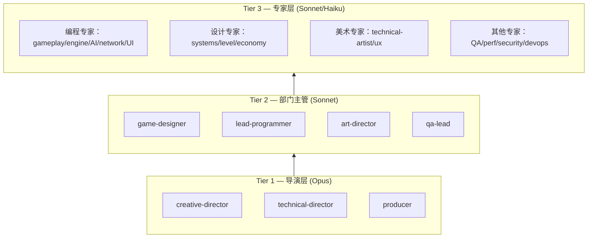

# Claude Code Game Studios：11.5K Stars 的多 Agent 游戏开发工作室——49 个 AI 角色、72 个技能、12 个钩子的完整游戏开发工作流

一个人用 Claude Code 写游戏，开头很快——但做到第三个功能、第六次重构时，问题不是 AI 不够聪明，而是没人帮你把设计、代码、测试、发布串成一条不会散架的流水线。Claude Code Game Studios 做的事很直接：把 Claude Code 改造成一个模拟真实工作室的多角色协作系统——49 个 AI 角色各管一摊，72 个命令覆盖从头脑风暴到上线的全流程，12 个钩子在提交、推送、会话切换时自动跑检查。

面向独立开发者、AI 应用研究者以及对多 Agent 系统感兴趣的人。需要对 Claude Code 有基本了解。

> **快速信息卡**
> - **GitHub**: [Donchitos/Claude-Code-Game-Studios](https://github.com/Donchitos/Claude-Code-Game-Studios)
> - **Stars**: 22,332+
> - **Forks**: 3,230+
> - **License**: MIT
> - **语言**: Shell
> - **最后更新**: 2026-06-26

---

## §1 学习目标

1. **理解多 Agent 游戏开发工作室的架构**：为什么需要专业化分工，而不是让单个通用助手包揽一切
2. **掌握 49 个 AI 角色的职责和层级**：从导演到专家的完整体系
3. **熟悉 72 个 Slash Command**：各自在游戏开发全生命周期中的职责与编排方式
4. **理解 12 个自动化钩子的工作机制**：提交验证、推送检查、会话管理如何自动运行
5. **根据项目需求裁剪这套工作流**：调整 agents、skills、rules，增减 Hook
6. **把模板落地到自己的游戏项目**：从思路到发布的全流程指引

---

**目录**
- [§1 学习目标](#§1-学习目标)
- [§2 背景与动机](#§2-背景与动机)
- [§3 项目概览](#§3-项目概览)
- [§4 工作室层级架构](#§4-工作室层级架构)
- [§5 72 个 Skills](#§5-72-个-skills)
- [§6 12 个 Hooks](#§6-12-个-hooks)
- [§7 11 个路径规则](#§7-11-个路径规则)
- [§8 项目结构](#§8-项目结构)
- [§9 开始使用](#§9-开始使用)
- [§10 Agent 协作机制](#§10-agent-协作机制)
- [§11 设计哲学](#§11-设计哲学)
- [§12 自定义指南](#§12-自定义指南)
- [§13 常见问题 FAQ](#§13-常见问题-faq)
- [§14 相关资源](#§14-相关资源)
- [§15 适用建议](#§15-适用建议)
- [自测题](#自测题)
- [进阶路径](#进阶路径)

---

## §2 背景与动机

### 2.1 独自开发游戏的挑战

用 AI 辅助独自开发游戏，确实比纯手写快得多，但做到中后期会撞上几堵墙：

| 问题 | 具体表现 |
|------|------|
| **没有组织架构** | 单个聊天会话里，设计和代码堆在一起，越往后越难回溯 |
| **没有强制规范** | 随时可以硬编码、跳过设计文档，没有人拦住你 |
| **没有审查环节** | 没有 QA、没有设计评审，错误一路漏到运行期才暴露 |
| **没有人追问愿景** | 没人问"这个改动跟游戏的主要体验一致吗"

### 2.2 Claude Code Game Studios 的解决方案

给 AI 会话装上真实工作室的结构——把"一个通用助手"替换成 49 个按层级组织的专业化 Agent，各自负责设计、编程、美术、测试中的一摊。

效果是：决定权还在你手里，但现在有一组角色会在你往前冲的时候追问对的问题、在早期拦截错误、把项目从头脑风暴到发布的每个环节串起来。

---

## §3 项目概览

### 3.1 基本信息

| 属性 | 值 |
|------|------|
| **Stars** | 22,332+ ⭐ |
| **Forks** | 3,230+ |
| **类型** | Claude Code 模板/工具包 |
| **语言** | Shell（项目本身）+ Markdown（agents 配置） |
| **许可证** | MIT |
| **平台** | Windows/macOS/Linux |

### 3.2 核心组件

| 组件 | 数量 | 说明 |
|------|------|------|
| **Agents** | 49 | 专业化的 AI 子代理 |
| **Skills** | 72 | Slash commands 工作流 |
| **Hooks** | 12 | 自动化验证脚本 |
| **Rules** | 11 | 路径作用域编码标准 |
| **Templates** | 39 | 文档模板 |

---

## §4 工作室层级架构

### 4.1 三层架构

Agents 按三个层级组织，匹配真实工作室的运作方式：



```
Tier 1 — 导演 (Opus)
  creative-director    technical-director    producer

Tier 2 — 部门主管 (Sonnet)
  game-designer        lead-programmer       art-director
  audio-director       narrative-director    qa-lead
  release-manager      localization-lead

Tier 3 — 专家 (Sonnet/Haiku)
  gameplay-programmer  engine-programmer     ai-programmer
  network-programmer   tools-programmer      ui-programmer
  systems-designer     level-designer        economy-designer
  technical-artist     sound-designer        writer
  ...
```

### 4.2 Tier 1：导演层

| Agent | 职责 | 使用模型 |
|-------|------|----------|
| **creative-director** | 守护游戏愿景 | Opus |
| **technical-director** | 技术决策和架构 | Opus |
| **producer** | 跨部门协调和变更传播 | Opus |

### 4.3 Tier 2：部门主管

| Agent | 职责 | 使用模型 |
|-------|------|----------|
| **game-designer** | 游戏设计和平衡 | Sonnet |
| **lead-programmer** | 编程规范和代码审查 | Sonnet |
| **art-director** | 美术方向和资源管理 | Sonnet |
| **audio-director** | 音效和音乐方向 | Sonnet |
| **narrative-director** | 叙事和对话 | Sonnet |
| **qa-lead** | 测试和质量保证 | Sonnet |
| **release-manager** | 发布和版本管理 | Sonnet |
| **localization-lead** | 本地化和国际化 | Sonnet |

### 4.4 Tier 3：专家层

**编程专家**：

| Agent | 职责 |
|-------|------|
| **gameplay-programmer** | 游戏玩法逻辑 |
| **engine-programmer** | 引擎底层代码 |
| **ai-programmer** | AI 和导航系统 |
| **network-programmer** | 多人游戏网络 |
| **tools-programmer** | 开发工具 |
| **ui-programmer** | UI 和 HUD |

**设计专家**：

| Agent | 职责 |
|-------|------|
| **systems-designer** | 系统设计 |
| **level-designer** | 关卡设计 |
| **economy-designer** | 经济系统设计 |

**美术专家**：

| Agent | 职责 |
|-------|------|
| **technical-artist** | 技术美术（Shader 等） |
| **ux-designer** | 用户体验设计 |

**其他专家**：

| Agent | 职责 |
|-------|------|
| **performance-analyst** | 性能分析 |
| **devops-engineer** | CI/CD 和构建 |
| **security-engineer** | 安全审计 |
| **qa-tester** | 测试执行 |
| **accessibility-specialist** | 无障碍设计 |
| **live-ops-designer** | 运营活动设计 |

### 4.5 引擎专家

模板包含三个主流引擎的专属 agents：

| 引擎 | 主管 Agent | 专家 |
|------|-----------|------|
| **Godot 4** | godot-specialist | GDScript, Shaders, GDExtension |
| **Unity** | unity-specialist | DOTS/ECS, Shaders/VFX, Addressables |
| **Unreal Engine 5** | unreal-specialist | GAS, Blueprints, Replication, UMG |

---

## §5 72 个 Skills

### 5.1 技能分类

| 类别 | 数量 | 示例 |
|------|------|------|
| **入职与导航** | 5 | /start, /help, /setup-engine |
| **游戏设计** | 6 | /brainstorm, /design-system, /review-all-gdds |
| **美术与资源** | 3 | /art-bible, /asset-spec |
| **架构** | 4 | /create-architecture, /architecture-decision |
| **故事与冲刺** | 7 | /create-epics, /create-stories, /dev-story |
| **评审与分析** | 10 | /design-review, /code-review, /balance-check |
| **QA 与测试** | 10 | /qa-plan, /smoke-check, /regression-suite |
| **生产** | 8 | /milestone-review, /bug-report |
| **发布** | 5 | /release-checklist, /launch-checklist |
| **团队协作** | 10+ | /team-combat, /team-narrative, /team-ui |

### 5.2 核心技能

**/start — 项目启动**：

```bash
# 在 Claude Code 中输入
/start

# 系统会问：
# - 你在哪里？（没想法/模糊概念/清晰设计/已有项目）
# - 然后引导你到正确的工作流
```

**/brainstorm — 头脑风暴**：

探索游戏想法，从零开始：

```bash
/brainstorm

# 触发：
# - 玩法机制讨论
# - 目标用户分析
# - 竞争产品对比
# - 风险识别
```

**/setup-engine — 引擎配置**：

```bash
# 设置游戏引擎
/setup-engine godot 4.6
/setup-engine unity 2023.2
/setup-engine unreal 5.4
```

**/create-epics — 创建史诗**：

将游戏分解为大型功能模块：

```bash
/create-epics

# 输出：
# - Epic 1: 核心战斗系统
# - Epic 2: 多人系统
# - Epic 3: 存档系统
```

**/create-stories — 创建故事卡**：

将 Epic 分解为可执行的任务：

```bash
/create-stories epic-1

# 输出：
# - Story 1.1: 角色移动
# - Story 1.2: 攻击动画
# - Story 1.3: 敌人AI
```

**/dev-story — 开发故事**：

执行具体的故事卡开发：

```bash
/dev-story 1.1

# 触发：
# - 编写代码
# - 编写测试
# - 设计文档更新
```

### 5.3 团队协作技能

**/team-combat — 战斗系统团队**：

协调多个 agents 开发战斗系统：

```bash
/team-combat

# 启动：
# - gameplay-programmer
# - ai-programmer
# - ui-programmer
# - qa-tester
# 协同工作
```

---

## §6 12 个 Hooks

### 6.1 Hooks 概览

Hooks 在关键事件自动触发验证：

| Hook | 触发 | 功能 |
|------|------|------|
| `validate-commit.sh` | PreToolUse (Bash) | 提交验证 |
| `validate-push.sh` | PreToolUse (Bash) | 推送验证 |
| `validate-assets.sh` | PostToolUse | 资源验证 |
| `session-start.sh` | Session open | 显示分支和提交 |
| `detect-gaps.sh` | Session open | 检测缺失 |
| `pre-compact.sh` | Before compaction | 保存进度 |
| `post-compact.sh` | After compaction | 恢复状态 |
| `notify.sh` | Notification | Windows 通知 |
| `session-stop.sh` | Session close | 归档活动 |
| `log-agent.sh` | Agent spawn | Agent 调用记录 |
| `log-agent-stop.sh` | Agent stop | Agent 完成记录 |
| `validate-skill-change.sh` | Skill change | 建议运行测试 |

### 6.2 提交验证

`validate-commit.sh` 在 git commit 时自动检查：

```bash
# 检查项：
# - 硬编码值
# - TODO 格式
# - JSON 有效性
# - 设计文档章节
```

### 6.3 推送验证

`validate-push.sh` 在 git push 时警告：

```bash
# 检查：
# - 是否推送到受保护分支
# - 是否有未提交的更改
```

### 6.4 Session 管理

```bash
# Session 启动时
session-start.sh → 显示分支和近期提交

# Session 关闭时
session-stop.sh → 归档 active.md 到 session log

# Session 压缩前
pre-compact.sh → 保存进度到 active.md

# Session 压缩后
post-compact.sh → 从 active.md 恢复状态
```

---

## §7 11 个路径规则

### 7.1 规则总览

编码标准按文件位置自动执行：

| 路径 | 强制规则 |
|------|----------|
| `src/gameplay/**` | 数据驱动、Delta Time、无 UI 引用 |
| `src/core/**` | 热路径零分配、线程安全 |
| `src/ai/**` | 性能预算、可调试性 |
| `src/networking/**` | 服务器权威、版本化消息 |
| `src/ui/**` | 无游戏状态拥有权、本地化就绪 |
| `design/gdd/**` | 必须 8 章节、公式格式 |
| `tests/**` | 测试命名、覆盖率要求 |
| `prototypes/**` | 宽松标准、需 README |

### 7.2 规则示例

**src/gameplay/** 规则：

```
- 必须使用数据驱动值（不能硬编码）
- 必须使用 delta time
- 不能直接引用 UI 模块
```

**src/core/** 规则：

```
- 热路径禁止内存分配
- 必须线程安全
- API 必须稳定
```

---

## §8 项目结构

### 8.1 目录树

```
Claude-Code-Game-Studios/
├── CLAUDE.md                      # 主配置
├── .claude/
│   ├── settings.json              # Hooks、权限、安全规则
│   ├── agents/                   # 49个 agent 定义
│   │   ├── directors/
│   │   │   ├── creative-director.md
│   │   │   └── technical-director.md
│   │   ├── leads/
│   │   │   ├── game-designer.md
│   │   │   └── lead-programmer.md
│   │   └── specialists/
│   │       ├── gameplay-programmer.md
│   │       └── ...
│   ├── skills/                   # 72个 slash commands
│   │   ├── brainstorm/
│   │   ├── design-system/
│   │   └── ...
│   ├── hooks/                   # 12个 hook 脚本
│   │   ├── validate-commit.sh
│   │   └── ...
│   ├── rules/                   # 11个路径规则
│   │   └── gameplay-coding-standards.md
│   └── docs/
│       ├── workflow-catalog.yaml  # 7阶段管道定义
│       └── templates/            # 39个文档模板
├── src/                         # 游戏源码
├── assets/                      # 美术、音频资源
├── design/                      # GDD、叙事文档
├── docs/                        # 技术文档
├── tests/                       # 测试套件
├── tools/                       # 构建工具
├── prototypes/                  # 原型
└── production/                  # 冲刺计划、发布跟踪
```

### 8.2 CLAUDE.md

主配置文件，定义整个工作流：

```markdown
# CLAUDE.md

## 项目概述
这是一个游戏开发工作室项目...

## 当前阶段
[由 /start 或 /project-stage-detect 设置]

## 活跃史诗
[由 /create-epics 创建]

## 活跃故事
[由 /create-stories 创建]
```

---

## §9 开始使用

### 9.1 前置条件

```bash
# Git
git --version

# Claude Code
npm install -g @anthropic-ai/claude-code

# 推荐：jq（hook验证用）
# 推荐：Python 3（JSON验证用）
```

### 9.2 初始化

```bash
# 1. 克隆或使用为模板
git clone https://github.com/Donchitos/Claude-Code-Game-Studios.git my-game
cd my-game

# 2. 打开 Claude Code
claude

# 3. 运行 /start
/start

# 或直接跳到特定技能
/brainstorm
/setup-engine godot 4.6
```

---

## §10 Agent 协作机制

### 10.1 协作协议

每个 Agent 遵循严格的协作协议——你不是在开自动驾驶，而是在和一个会主动提问、给出选项、等你拍板的团队协作：

```
1. Ask — 提问先于提案
2. Present options — 展示2-4个选项及优缺点
3. You decide — 你做决定
4. Draft — 展示工作成果再定稿
5. Approve — 你的签字批准才能定稿
```

### 10.2 委托模型

```
垂直委托：导演 → 主管 → 专家
水平咨询：同级 agents 可互相咨询
冲突解决：升级到共同上级
变更传播：跨部门变更由 producer 协调
```

### 10.3 域边界

Agents 不能修改其域外的文件，除非获得明确委托：

```
gameplay-programmer → 只能修改 src/gameplay/**
ui-programmer → 只能修改 src/ui/**
creative-director → 可修改 design/**
```

### 10.4 具体流转案例：从想法到可运行原型

上面的层级和协议如果不串成一次真实工作流，容易读成一堆静态角色卡。下面是一条典型路径——假设你要做一款 Roguelike 卡牌游戏。

**阶段 1：确立方向（/start → /brainstorm）**

你输入 `/start`，系统判断你处于"模糊概念"阶段，引导你走 `/brainstorm`。这时 creative-director 介入，追问玩法核心循环、目标用户和竞品差异。你决定：这是一款以牌组构筑为核心的回合制 Roguelike，灵感来自《杀戮尖塔》但强调"敌方 AI 会学习你的出牌习惯"。brainstorm 产出最初的 Game Design Document 草稿。

**阶段 2：拆解工作（/create-epics → /create-stories）**

producer 把 brainstorm 的结果交给 game-designer，产出 5 个 Epic：核心战斗、牌组系统、地图生成、敌人 AI、UI/HUD。你对牌组系统最没把握，要求先拆它。

`/create-stories epic-2` 生成：
- Story 2.1：牌组数据模型（attack/defend/skill 三类牌）
- Story 2.2：抽牌与弃牌堆逻辑
- Story 2.3：牌效结算（增益/减益/连锁）

这时 technical-director 会插一嘴：建议牌效结算做成事件驱动的管线，而不是 if-else 嵌套——因为后续 AI 需要重放和预测玩家的出牌序列。

**阶段 3：开发迭代（/dev-story）**

你执行 `/dev-story 2.1`。gameplay-programmer 写 `src/gameplay/card_data.gd`，按路径规则限制：数据驱动、delta time、不引用 UI。写完后 `/code-review` 触发 lead-programmer 审查——它会对照 `src/gameplay/` 规则检查硬编码和 UI 引用，同时 technical-director 确认牌组数据模型是否兼容后续的 AI 预测管线。

AI 预测是网络模块还是本地？engine-programmer 判断：本地推演就够，暂不需要多人网络层，network-programmer 本轮不参与。

**阶段 4：验证与闭环**

一个 Story 开发完毕后，`/smoke-check` 快速过一遍：牌组能初始化、能抽牌、弃牌堆状态正确。然后 `validate-commit.sh` 在 git commit 时自动跑：检查 JSON 有效性、TODO 格式、设计文档章节是否更新。

Session 结束时 `pre-compact.sh` 把当前进度写进 `active.md`，下次打开 Claude Code 时 `session-start.sh` 恢复上次的分支和近期提交记录——不用手动回忆"上次写到哪了"。

这条路径串起来之后，49 个角色和 72 个命令就不再是一份静态清单，而是一条从思路到可运行原型、每一步都有对应角色出声追问和检查的流水线。

---

## §11 设计哲学

### 11.1 理论基础

这个模板基于专业游戏开发实践：

| 框架 | 应用 |
|------|------|
| **MDA Framework** | Mechanics/Dynamics/Aesthetics 分析 |
| **Self-Determination Theory** | 自主性/能力/相关性（玩家动机） |
| **Flow State Design** | 挑战-技能平衡 |
| **Bartle Player Types** | 受众定位和验证 |
| **Verification-Driven Development** | 测试优先 |

### 11.2 评审强度

可配置的评审强度：

| 模式 | 说明 |
|------|------|
| **full** | 所有导演门控 |
| **lean** | 仅阶段门控 |
| **solo** | 无评审 |

---

## §12 自定义指南

### 12.1 添加/删除 Agents

```bash
# 删除不需要的 agent
rm .claude/agents/specialists/legacy-programmer.md

# 添加新 agent
vim .claude/agents/specialists/blockchain-programmer.md
```

### 12.2 修改 Skills

```bash
# 修改现有 skill
vim .claude/skills/dev-story/SKILL.md

# 添加新 skill
mkdir .claude/skills/my-custom-skill
vim .claude/skills/my-custom-skill/SKILL.md
```

### 12.3 调整 Hooks

```bash
# 调整验证严格度
vim .claude/hooks/validate-commit.sh

# 添加新检查
vim .claude/hooks/validate-my-check.sh
```

---

## §13 常见问题 FAQ

**Q1: 这个和普通用 Claude Code 有什么区别？**

普通 Claude Code 是一个通用助手，所有对话挤在一个会话里，设计讨论和代码实现在同一个上下文窗口里混着跑。这个项目在上面加了一层工作室结构：角色分工（设计归设计、代码归代码，每个 Agent 只看到自己域内的上下文）、规范约束（路径规则禁止跨域修改，比如音频 Agent 不能动 UI 代码）、自动化检查（提交和推送时跑验证，拦截违规提交）、以及跨角色的协作流程（通过 `/propagate-design-change` 和 producer Agent 协调跨域变更）。

**Q2: 需要一直运行吗？**

不需要。Session 关闭时自动归档状态，下次打开时恢复。你可以在一天的开发结束后关掉 Claude Code，第二天打开时所有 Agent 的状态（包括上次讨论到哪了、哪些变更待审查）都还在。

**Q3: 支持哪些游戏引擎？**

Godot 4、Unity、Unreal Engine 5 都有专属 agent set。每个引擎有对应的主管 Agent（如 `godot-specialist`）和多个专家 Agent（如 `gdscript-expert`、`shader-expert`）。也支持不使用任何引擎的项目。

**Q4: 如何处理跨域变更？**

跨域变更（比如游戏设计改动影响了 UI 和音频）需要走 `/propagate-design-change` 命令，或者让 producer Agent 协调。producer 的责任是追踪变更影响范围，通知相关 Agent 更新。这是三层架构中 Tier 1 的关键价值——没有导演层，跨域变更的传播就靠开发者自己记住。

**Q5: 可以只用部分功能吗？**

可以。这是一个模板，不是锁死的框架。建议把不玩的引擎对应的 Agent 目录删掉（比如只做 2D 就别留着 UE5 那些），能显著减少无关角色的提问和检查。也可以只启用部分 Hook——比如只开提交验证，关闭推送检查。

---

## §14 相关资源

| 资源 | 链接 |
|------|------|
| GitHub | https://github.com/Donchitos/Claude-Code-Game-Studios |
| Claude Code 文档 | https://docs.anthropic.com/en/docs/claude-code |
| GitHub Discussions | https://github.com/Donchitos/Claude-Code-Game-Studios/discussions |

---

## §15 适用建议

这个模板不是给所有人和所有项目准备的。以下情况值得花时间配：

- 游戏规模超过一个周末能写完——代码量、资源量、设计文档量大到单人管理开始吃力
- 你希望在开发过程中有人持续追问"这个设计跟游戏愿景一致吗""这个改动会影响哪几个模块"
- 你愿意花一些时间配模板、删不需要的 Agent、调 Hook 严格度，而不是开箱即用

以下情况不急着上：

- 你在做快速原型，代码量和复杂度都不大——一个 Agent 配几个 Slash Command 就够了
- 你更习惯自己控制所有流程，多 Agent 之间的提问和确认反而打断节奏

采用建议：先从 `/start` 跑通一个完整阶段——比如从 `/brainstorm` 到 `/dev-story` 写出一段可运行的玩法逻辑——再根据痛点逐步打开更多 Agent 和 Hook。别一口气全开：模板过重反而会拖慢前期迭代。另外，把你不玩的引擎对应的 Agent 目录删掉（比如只做 2D 就别留着 UE5 那些），能显著减少无关角色的提问和检查。

**🦞 作者：钳岳星君 | 来源：GitHub Donchitos/Claude-Code-Game-Studios**

---

## 自测题

1. **Claude Code Game Studios 的三层架构（Tier 1/2/3）各自用什么模型？为什么这样选？**
   - 参考答案：Tier 1（导演层）用 Opus，因为需要做复杂决策和愿景判断；Tier 2（部门主管）用 Sonnet，平衡能力和成本；Tier 3（专家层）用 Sonnet/Haiku，专家任务更单一，可以用更轻量的模型。

2. **12 个 Hooks 中，哪些是在提交代码时触发的？它们各自检查什么？**
   - 参考答案：`validate-commit.sh` 在 git commit 时触发，检查硬编码值、TODO 格式、JSON 有效性、设计文档章节。`validate-push.sh` 在 git push 时触发，检查是否推送到受保护分支、是否有未提交的更改。

3. **如果你想只做 2D Godot 游戏，应该怎么裁剪这个模板？**
   - 参考答案：删除 `.claude/agents/specialists/` 下 Unity 和 Unreal 相关的 Agent，删除 `.claude/skills/` 下对应引擎的技能，保留 `godot-specialist` 和 GDScript 相关专家。也可以只开启部分 Hook（如只开提交验证）。

4. **Session 管理相关的 Hooks 有哪些？它们解决什么问题？**
   - 参考答案：`session-start.sh`（显示分支和近期提交）、`session-stop.sh`（归档活动）、`pre-compact.sh`（保存进度）、`post-compact.sh`（恢复状态）。解决的是长周期开发中"上次写到哪了"的问题，让 Agent 状态可恢复。

5. **为什么需要 `producer` Agent？它的核心职责是什么？**
   - 参考答案：producer 负责跨部门协调和变更传播。当设计改动影响了多个域（如游戏设计改动影响了 UI 和音频），producer 追踪变更影响范围，通知相关 Agent 更新。这是三层架构中 Tier 1 的关键价值。

---

## 进阶路径

### 阶段 1：理解多 Agent 协作（1-2 周）
- 阅读 `creative-director.md`、`technical-director.md`、`producer.md` 三个 Tier 1 Agent 的定义
- 理解协作协议（Ask → Present options → You decide → Draft → Approve）
- 跑通一个完整的 `/start` → `/brainstorm` → `/create-epics` 流程

### 阶段 2：定制自己的工作室（2-4 周）
- 根据项目需求删除不需要的 Agents（如只做单人游戏就删除 `network-programmer`）
- 调整 Hooks 的严格度（如关闭推送检查，只保留提交验证）
- 修改路径规则（如 `src/gameplay/` 规则）以适应项目规范

### 阶段 3：深度集成到开发流程（1-2 个月）
- 使用 `/team-combat`、`/team-narrative` 等团队协作技能
- 配置 CI/CD 集成（通过 Hooks 触发构建和测试）
- 建立自己的 Agent 和 Skill（扩展模板）

### 阶段 4：贡献回上游（持续优化）
- 将通用的 Agents/Skills 贡献回 [Donchitos/Claude-Code-Game-Studios](https://github.com/Donchitos/Claude-Code-Game-Studios)
- 参与 GitHub Discussions 分享最佳实践
- 跟踪项目更新，合并新版本的 Agents/Skills

**进阶资源**
- [Claude Code 官方文档](https://docs.anthropic.com/en/docs/claude-code)
- [MDA Framework](https://en.wikipedia.org/wiki/MDA_framework)（游戏设计理论）
- [Verification-Driven Development](https://en.wikipedia.org/wiki/Test-driven_development)（测试驱动开发）
