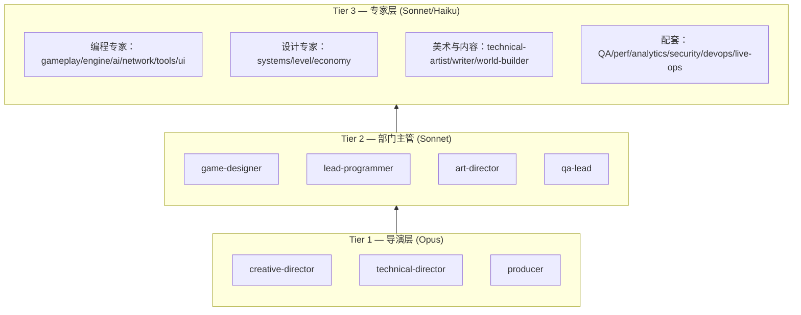

# Claude Code Game Studios：49 个 AI 角色、73 个技能、12 个钩子的多 Agent 游戏开发工作流

一个人用 Claude Code 写游戏，开头很快。可做到第三个功能、第六次重构时，麻烦就来了：设计、代码、测试、发布散落在同一个会话里，没人把你往前推，也没人拦住你走捷径。Claude Code Game Studios 把这种协作组织成一座模拟真实工作室的多角色系统——49 个 AI Agent 各管一摊，73 个命令覆盖从头脑风暴到上线的全流程，12 个钩子在提交、推送、会话切换时自动跑检查。

> **基本信息**
> - **GitHub**: [Donchitos/Claude-Code-Game-Studios](https://github.com/Donchitos/Claude-Code-Game-Studios)
> - **License**: MIT | **形态**: 模板项目（GitHub 标记为 template）
> - **包含**: 49 Agents · 73 Skills · 12 Hooks · 11 路径规则 · 41 文档模板

---

## 背景与动机

### 独自开发游戏的挑战

用 AI 辅助独立开发游戏，确实比纯手写快得多，但做到中后期会撞上几堵墙：

| 问题 | 具体表现 |
|------|------|
| **没有组织架构** | 单个聊天会话里，设计和代码堆在一起，越往后越难回溯 |
| **没有强制规范** | 随时可能硬编码、跳过设计文档，没有人拦住你 |
| **没有审查环节** | 没有 QA、没有设计评审，错误一路漏到运行期才暴露 |
| **没有人追问愿景** | 没人问"这个改动跟游戏的核心体验一致吗" |

### 解决方案

给 AI 会话装上真实工作室的结构——把"一个通用助手"替换成 49 个按层级组织的专业化 Agent，各自负责设计、编程、美术、测试中的一摊。

决定权始终在你手里，但会有一组角色在你往前冲的时候追问对的问题、在早期拦截错误、把项目从头脑风暴到发布的每个环节串起来。

---

## 工作室层级架构

### 三层架构

Agent 按三个层级组织，匹配真实工作室的运作方式：


```mermaid
flowchart BT
    subgraph TIER3["Tier 3 — 专家层 (Sonnet/Haiku)"]
        T3P["编程专家：gameplay/engine/ai/network/tools/ui"]
        T3D["设计专家：systems/level/economy"]
        T3A["美术与内容：technical-artist/writer/world-builder"]
        T3O["配套：QA/perf/analytics/security/devops/live-ops"]
    end

    subgraph TIER2["Tier 2 — 部门主管 (Sonnet)"]
        T2D["game-designer"]
        T2P["lead-programmer"]
        T2A["art-director"]
        T2Q["qa-lead"]
    end

    subgraph TIER1["Tier 1 — 导演层 (Opus)"]
        T1C["creative-director"]
        T1T["technical-director"]
        T1P["producer"]
    end

    TIER1 --> TIER2 --> TIER3
```

```
Tier 1 — 导演 (Opus)
  creative-director    technical-director    producer

Tier 2 — 部门主管 (Sonnet)
  game-designer  lead-programmer  art-director
  audio-director narrative-director qa-lead
  release-manager localization-lead

Tier 3 — 专家 (Sonnet/Haiku)
  gameplay-programmer engine-programmer ai-programmer
  network-programmer  tools-programmer  ui-programmer
  systems-designer    level-designer    economy-designer
  technical-artist    sound-designer    writer        world-builder
  ux-designer         prototyper        performance-analyst
  devops-engineer     analytics-engineer security-engineer
  qa-tester           accessibility-specialist
  live-ops-designer   community-manager
```

### Tier 1：导演层

| Agent | 职责 | 使用模型 |
|-------|------|----------|
| **creative-director** | 守护游戏愿景 | Opus |
| **technical-director** | 技术决策和架构 | Opus |
| **producer** | 跨部门协调和变更传播 | Opus |

### Tier 2：部门主管

| Agent | 职责 | 使用模型 |
|-------|------|----------|
| **game-designer** | 游戏设计和平衡 | Sonnet |
| **lead-programmer** | 编程规范和代码审查 | Sonnet |
| **art-director** | 美术方向和资源管理 | Sonnet |
| **audio-director** | 音效和音乐方向 | Sonnet |
| **narrative-director** | 叙事和对话 | Sonnet |
| **qa-lead** | 测试和质量保证 | Sonnet |
| **release-manager** | 发布和版本管理 | Sonnet |
| **localization-lead** | 本地化和国际化 | Sonnet |

### Tier 3：专家层

**编程专家**：gameplay-programmer（玩法逻辑）、engine-programmer（引擎底层）、ai-programmer（AI 与导航）、network-programmer（多人网络）、tools-programmer（开发工具）、ui-programmer（UI 与 HUD）

**设计专家**：systems-designer（系统设计）、level-designer（关卡设计）、economy-designer（经济系统）

**美术与内容**：technical-artist（技术美术）、sound-designer（音效）、writer（写作）、world-builder（世界构建）、ux-designer（用户体验）、prototyper（原型验证）

**配套专家**：performance-analyst（性能分析）、devops-engineer（CI/CD）、analytics-engineer（数据与埋点）、security-engineer（安全审计）、qa-tester（测试执行）、accessibility-specialist（无障碍设计）、live-ops-designer（运营活动）、community-manager（社区运营）

### 引擎专家

模板为三个主流引擎各配一套专属 Agent，按项目选用：

| 引擎 | 主管 Agent | 子专家 |
|------|-----------|------|
| **Godot 4** | godot-specialist | GDScript, Shaders, GDExtension |
| **Unity** | unity-specialist | DOTS/ECS, Shaders/VFX, Addressables, UI Toolkit |
| **Unreal Engine 5** | unreal-specialist | GAS, Blueprints, Replication, UMG/CommonUI |

不绑定任何引擎的项目同样可用。

---

## 73 个 Skills

在 Claude Code 里输入 `/` 即可调用全部 73 个命令，按工作阶段分类。以下按官方划分摘录：

| 类别 | 示例 |
|------|------|
| **入职与导航** | `/start`, `/help`, `/project-stage-detect`, `/setup-engine`, `/adopt` |
| **游戏设计** | `/brainstorm`, `/map-systems`, `/design-system`, `/quick-design`, `/review-all-gdds`, `/propagate-design-change` |
| **美术与资源** | `/art-bible`, `/asset-spec`, `/asset-audit` |
| **UX 与界面** | `/ux-design`, `/ux-review` |
| **架构** | `/create-architecture`, `/architecture-decision`, `/architecture-review`, `/create-control-manifest` |
| **故事与冲刺** | `/create-epics`, `/create-stories`, `/dev-story`, `/sprint-plan`, `/sprint-status`, `/story-readiness`, `/story-done`, `/estimate` |
| **评审与分析** | `/design-review`, `/code-review`, `/balance-check`, `/content-audit`, `/scope-check`, `/perf-profile`, `/tech-debt`, `/gate-check`, `/consistency-check`, `/security-audit` |
| **QA 与测试** | `/qa-plan`, `/smoke-check`, `/soak-test`, `/regression-suite`, `/test-setup`, `/test-helpers`, `/test-evidence-review`, `/test-flakiness`, `/skill-test`, `/skill-improve` |
| **生产** | `/milestone-review`, `/retrospective`, `/bug-report`, `/bug-triage`, `/reverse-document`, `/playtest-report` |
| **发布** | `/release-checklist`, `/launch-checklist`, `/changelog`, `/patch-notes`, `/hotfix`, `/day-one-patch` |
| **创意与内容** | `/prototype`, `/onboard`, `/localize` |
| **团队编排** | `/team-combat`, `/team-narrative`, `/team-ui`, `/team-release`, `/team-polish`, `/team-audio`, `/team-level`, `/team-live-ops`, `/team-qa` |

### 核心流程

**`/start — 项目启动**：询问你当前所处的阶段（没想法 / 模糊概念 / 清晰设计 / 已有项目），再引导到对应工作流，不做假设。

**`/brainstorm — 头脑风暴**：从零探索游戏想法，触发玩法机制讨论、目标用户分析、竞品对比和风险识别。

**`/setup-engine — 引擎配置**：如 `/setup-engine godot 4.6`、`/setup-engine unity 2023.2`、`/setup-engine unreal 5.4`，快速配置引擎；`/project-stage-detect` 可分析已有工程。

**`/create-epics — 创建史诗**：把游戏拆成大型功能模块，例如核心战斗系统、多人系统、存档系统。

**`/create-stories → /dev-story — 拆解与开发**：把 Epic 拆成可执行的故事卡（如 Story 1.1 角色移动、Story 1.2 攻击动画、Story 1.3 敌人 AI），`/dev-story` 执行具体开发并联动编写测试、更新设计文档。

### 团队编排技能

以 `/team-combat` 为例，它协调 gameplay-programmer、ai-programmer、ui-programmer、qa-tester 等多个 Agent 协同开发战斗系统，让一个功能由多个专业角色并行推进。

---

## 12 个 Hooks

Hooks 在关键事件自动触发验证。注意：`validate-commit.sh`、`validate-assets.sh`、`validate-skill-change.sh` 会在每次 Bash/Write 调用时触发，但与本次操作无关时立刻退出（exit 0）——这是正常行为，不是性能问题。

| Hook | 触发 | 功能 |
|------|------|------|
| `validate-commit.sh` | PreToolUse (Bash) | 检查硬编码、TODO 格式、JSON 有效性、设计文档章节 |
| `validate-push.sh` | PreToolUse (Bash) | 提示推送到受保护分支 |
| `validate-assets.sh` | PostToolUse (Write/Edit) | 校验 `assets/` 命名与 JSON 结构 |
| `session-start.sh` | Session 打开 | 显示当前分支和近期提交 |
| `detect-gaps.sh` | Session 打开 | 检测新项目建议 `/start`、代码存在却缺设计文档 |
| `pre-compact.sh` | 压缩前 | 保存会话进度 |
| `post-compact.sh` | 压缩后 | 提醒从 `active.md` 恢复状态 |
| `notify.sh` | 通知事件 | Windows 系统通知（PowerShell） |
| `session-stop.sh` | Session 关闭 | 归档 `active.md` 并记录 git 活动 |
| `log-agent.sh` | Agent 创建 | 审计起点，记录子 Agent 调用 |
| `log-agent-stop.sh` | Agent 完成 | 审计终点，补全记录 |
| `validate-skill-change.sh` | 修改 `.claude/skills/` | 建议运行 `/skill-test` |

此外，`settings.json` 中的权限规则自动放行安全操作（git status、跑测试），拦截危险操作（force push、`rm -rf`、读取 `.env`）。缺少 jq / Python 时钩子会优雅地降级，只丢失校验，不阻塞工作。

---

## 11 个路径规则

编码标准按文件位置自动执行，模板内置 11 个规则文件。下表为按官方说明整理的示例：

| 覆盖路径 | 强制要点 |
|----------|----------|
| `src/gameplay/**` | 数据驱动、delta time、不引用 UI |
| `src/core/**` | 热路径零分配、线程安全、API 稳定 |
| `src/ai/**` | 性能预算、可调试性、数据驱动参数 |
| `src/networking/**` | 服务器权威、版本化消息、安全 |
| `src/ui/**` | 不持有游戏状态、本地化就绪、无障碍 |
| `design/gdd/**` | 必须 8 章节、公式格式、边界情况 |
| `tests/**` | 测试命名、覆盖率要求、fixture 模式 |
| `prototypes/**` | 宽松标准、必须 README、记录假设 |

`design/gdd/**` 要求每份设计文档包含 Overview、Player Fantasy、Detailed Rules、Formulas、Edge Cases、Dependencies、Tuning Knobs、Acceptance Criteria 这 8 个章节。

---

## 项目结构

```
Claude-Code-Game-Studios/
├── CLAUDE.md                      # 主配置
├── .claude/
│   ├── settings.json              # Hooks、权限、安全规则
│   ├── agents/                   # 49 个 agent 定义
│   ├── skills/                   # 73 个 slash 命令
│   ├── hooks/                    # 12 个 hook 脚本
│   ├── rules/                    # 11 个路径规则
│   ├── statusline.sh             # 状态栏脚本（上下文%、模型、阶段、史诗面包屑）
│   └── docs/
│       ├── workflow-catalog.yaml  # 7 阶段管道定义（/help 读取）
│       └── templates/            # 41 个文档模板
├── src/                         # 游戏源码
├── assets/                      # 美术、音频、特效、数据
├── design/                      # GDD、叙事、关卡
├── docs/                        # 技术文档、ADR
├── tests/                       # 单元/集成/性能/玩法测试
├── tools/                       # 构建工具
├── prototypes/                  # 一次性原型（与 src/ 隔离）
├── production/                  # 冲刺计划、里程碑、发布跟踪
└── CCGS Skill Testing Framework # 技能自测框架
```

---

## 开始使用

### 前置条件

```bash
# Git
git --version

# Claude Code
npm install -g @anthropic-ai/claude-code

# 推荐：jq（hook 验证用）与 Python 3（JSON 验证用）
# 缺省时 hook 优雅降级，不阻塞工作
```

### 初始化

```bash
# 1. 克隆或用作模板
git clone https://github.com/Donchitos/Claude-Code-Game-Studios.git my-game
cd my-game

# 2. 打开 Claude Code 并启动会话
claude

# 3. 运行 /start，或直接跳到指定技能
/start
/brainstorm
/setup-engine godot 4.6
```

---

## Agent 协作机制

### 协作而非自治

这不是自动驾驶系统。每个 Agent 遵循严格的协作协议，先问、给选项、最后由你拍板：

```
1. Ask — 提问先于提案
2. Present options — 给出 2-4 个选项及优缺点
3. You decide — 你做决定
4. Draft — 先展示成果再定稿
5. Approve — 你的签字批准才落盘
```

### 委托模型

```
垂直委托：导演 → 主管 → 专家
水平咨询：同级 Agent 可互相咨询，但不做跨域决定
冲突解决：升级到共同上级（设计归 creative-director，技术归 technical-director）
变更传播：跨部门变更由 producer 协调
域边界：没有明确委托，不得修改域外文件
```

### 典型流转：从想法到可运行原型

上面的层级和协议若不串成一次真实工作流，容易读成一堆静态角色卡。下面是一条典型路径——假设你要做一款 Roguelike 卡牌游戏（示例，非仓库内置案例）。

**阶段 1：确立方向（/start → /brainstorm）**

你输入 `/start`，系统判断你处于"模糊概念"阶段，引导到 `/brainstorm`。creative-director 介入，追问玩法核心循环、目标用户和竞品差异。你决定：做一款以牌组构筑为核心的回合制 Roguelike，强调"敌方 AI 会学习你的出牌习惯"。brainstorm 产出最初的 GDD 草稿。

**阶段 2：拆解工作（/create-epics → /create-stories）**

producer 把结果交给 game-designer，产出 5 个 Epic：核心战斗、牌组系统、地图生成、敌人 AI、UI/HUD。你对牌组系统最没把握，要求先拆它。

`/create-stories epic-2` 生成：
- Story 2.1：牌组数据模型（attack/defend/skill 三类牌）
- Story 2.2：抽牌与弃牌堆逻辑
- Story 2.3：牌效结算（增益/减益/连锁）

technical-director 会插一句：建议牌效结算做成事件驱动的管线，而不是 if-else 嵌套——因为后续 AI 需要重放和预测玩家的出牌序列。

**阶段 3：开发迭代（/dev-story）**

执行 `/dev-story 2.1`。gameplay-programmer 写 `src/gameplay/card_data.gd`，按路径规则限制：数据驱动、delta time、不引用 UI。写完 `/code-review` 触发 lead-programmer 审查，对照 `src/gameplay/` 规则检查硬编码和 UI 引用；technical-director 确认牌组数据模型是否兼容后续的 AI 预测管线。

AI 预测走本地还是网络？engine-programmer 判断：本地推演就够，暂不需要多人网络层，network-programmer 本轮不参与。

**阶段 4：验证与闭环**

一个 Story 开发完，`/smoke-check` 快速过一遍：牌组能初始化、能抽牌、弃牌堆状态正确。`validate-commit.sh` 在 git commit 时自动检查 JSON 有效性、TODO 格式、设计文档章节是否更新。

Session 结束时 `pre-compact.sh` 把进度写进 `active.md`，下次打开 Claude Code 时 `session-start.sh` 恢复上次的分支和近期提交记录——不用手动回忆"上次写到哪了"。

串起来之后，49 个角色和 73 个命令的价值不在数量，而在每一步都有对应角色固定出场——从思路到能运行的版本，设计、实现、验证是结构性地串起来的，不是临时想起来才做。

---

## 设计哲学

模板基于专业游戏开发实践：

| 框架 | 应用 |
|------|------|
| **MDA Framework** | Mechanics/Dynamics/Aesthetics 分析 |
| **Self-Determination Theory** | 自主性/能力/相关性（玩家动机） |
| **Flow State Design** | 挑战-技能平衡 |
| **Bartle Player Types** | 受众定位和验证 |
| **Verification-Driven Development** | 测试优先 |

### 评审强度

可配置评审强度：**full**（所有导演门控）、**lean**（仅阶段门控）、**solo**（无评审）。启动时或编辑 `production/review-mode.txt` 设定，也可临时用 `--review solo` 覆盖。

---

## 自定义指南

项目是模板而非锁死的框架，一切按需裁剪：

```bash
# 删除不需要的 agent
rm .claude/agents/specialists/legacy-programmer.md

# 修改现有 skill
vim .claude/skills/dev-story/SKILL.md

# 调整验证严格度
vim .claude/hooks/validate-commit.sh

# 为项目目录新增路径规则
vim .claude/rules/my-custom-rule.md
```

---

## 平台说明

主开发与测试环境为 **Windows 10 + Git Bash**。所有钩子采用可移植的 POSIX 写法（`grep -E` 而非 `grep -P`），并为缺失工具提供回退，因此多可在 macOS 和 Linux 上运行。`notify.sh` 用 PowerShell 弹 Windows 通知，其他平台为空操作，macOS/Linux 桌面通知尚未接入。跨平台测试仍在推进，遇到平台问题可提交 issue。

---

## 常见问题

**这跟普通用 Claude Code 有什么区别？**

普通 Claude Code 是一个通用助手，所有对话挤在一个会话里。这个项目在上面加了一层工作室结构：角色分工（每个 Agent 只看到自己域内的上下文）、规范约束（路径规则禁止跨域修改）、自动化检查（提交和推送时跑验证）、以及跨角色协作（由 producer 协调跨域变更）。

**需要一直运行吗？**

不需要。Session 关闭时自动归档状态，下次打开恢复。一天结束后关掉 Claude Code，第二天打开时所有角色状态（上次讨论到哪、哪些变更待审查）都还在。

**支持哪些游戏引擎？**

Godot 4、Unity、Unreal Engine 5 各有专属 Agent 集，每个引擎有主管 Agent 和多个子专家。若不用任何引擎，模板同样可用。

**可以只用部分功能吗？**

可以。按需删掉不用的 Agent 目录（比如只做 2D 就别留 UE5 那些）、只启用部分 Hook、自选评审强度即可。

---

## 适用建议

这个模板不是给所有项目和所有人准备的。以下情况值得花时间配：

- 游戏规模超过一个周末能写完——代码量、资源量、设计文档量大到单人管理开始吃力
- 你希望在开发过程中有人持续追问"这个设计跟游戏愿景一致吗""这个改动会影响哪几个模块"
- 你愿意花时间配模板、删不需要的 Agent、调 Hook 和规则，而不是开箱即用

以下情况不急着上：

- 你在做快速原型，代码量和复杂度都不大——一个 Agent 配几个命令就够了
- 你更习惯自己控制所有流程，多 Agent 之间的提问和确认反而打断节奏

采用建议：先跑通 `/start → /brainstorm → /dev-story` 写出一段可运行的玩法逻辑，再按痛点逐步打开更多 Agent 和 Hook。别一口气全开，模板过重会拖慢早期迭代。

---

## 相关资源

| 资源 | 链接 |
|------|------|
| GitHub | https://github.com/Donchitos/Claude-Code-Game-Studios |
| Claude Code 文档 | https://docs.anthropic.com/en/docs/claude-code |
| GitHub Discussions | https://github.com/Donchitos/Claude-Code-Game-Studios/discussions |

**作者：钳岳星君 | 来源：GitHub Donchitos/Claude-Code-Game-Studios**