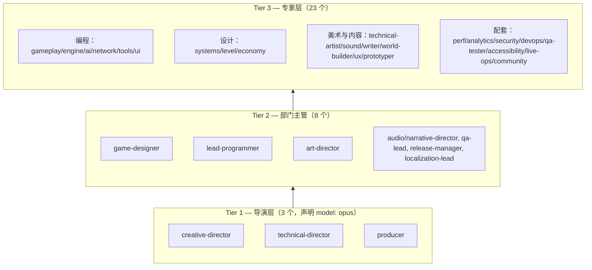

# Claude Code Game Studios：49 个 AI 角色、74 个技能、12 个钩子的多 Agent 游戏开发工作流

一个人用 Claude Code 写游戏，开头很快。可做到第三个功能、第六次重构时，麻烦就来了：设计、代码、测试、发布散落在同一个会话里，没人把你往前推，也没人拦住你走捷径。Claude Code Game Studios 把这种协作组织成一座模拟真实工作室的多角色系统——49 个 AI Agent 各管一摊，74 个技能覆盖从头脑风暴到上线的全流程，12 个事件钩子在提交、推送、压缩前后自动跑检查。

它真正想解决的不是"让 AI 更能干"，而是把流程纪律从人的自觉变成系统的强制：设计文档写几章、提交前查什么、谁有权改哪个目录，都由模板钉死。有意思的是，作者用四局对照实验量过了流程的代价——默认档位选了最轻的那一档，因为更重的档位实测只买到可追溯性，没买到更好的游戏。

> **基本信息**（2026-10-05 核对）
> - **GitHub**: [Donchitos/Claude-Code-Game-Studios](https://github.com/Donchitos/Claude-Code-Game-Studios)， Stars / Forks：25,744 / 3,661
> - **版本**: v1.1.2（2026-09-29 发布），框架版本 1.1.2，建仓 2026-02-12
> - **License**: MIT | **形态**: 模板项目（GitHub 标记为 template）
> - **包含**: 49 Agents · 74 Skills · 12 事件钩子 · 13 路径规则 · 39 文档模板

---

## 背景与动机

### 独自开发游戏的挑战

用 AI 辅助独立开发游戏，速度确实比纯手写快，但做到中后期会撞上几堵墙：

| 问题 | 具体表现 |
|------|------|
| **没有组织架构** | 单个聊天会话里，设计和代码堆在一起，越往后越难回溯 |
| **没有强制规范** | 随时可能硬编码、跳过设计文档，没有人拦住你 |
| **没有审查环节** | 没有 QA、没有设计评审，错误一路漏到运行期才暴露 |
| **没有人追问愿景** | 没人问"这个改动跟游戏的核心体验一致吗" |

### 解决方案

给 AI 会话装上真实工作室的结构——把"一个通用助手"替换成 49 个按层级组织的专业化 Agent，各自负责设计、编程、美术、测试中的一摊。

决定权始终在你手里，但会有一组角色在你往前冲的时候追问对的问题、在早期拦截错误、把项目从头脑风暴到发布的每个环节串起来。

---

## 工作室层级架构

### 三层架构

Agent 按三个层级组织，匹配真实工作室的运作方式。49 个的构成是：3 个导演 + 8 个部门主管 + 23 个专家，外加 15 个引擎专属 Agent（3 个引擎主管 + 12 个子专家）。


```mermaid
flowchart BT
    subgraph TIER3["Tier 3 — 专家层（23 个）"]
        T3P["编程：gameplay/engine/ai/network/tools/ui"]
        T3D["设计：systems/level/economy"]
        T3A["美术与内容：technical-artist/sound/writer/world-builder/ux/prototyper"]
        T3O["配套：perf/analytics/security/devops/qa-tester/accessibility/live-ops/community"]
    end

    subgraph TIER2["Tier 2 — 部门主管（8 个）"]
        T2D["game-designer"]
        T2P["lead-programmer"]
        T2A["art-director"]
        T2Q["audio/narrative-director, qa-lead, release-manager, localization-lead"]
    end

    subgraph TIER1["Tier 1 — 导演层（3 个，声明 model: opus）"]
        T1C["creative-director"]
        T1T["technical-director"]
        T1P["producer"]
    end

    TIER1 --> TIER2 --> TIER3
```

### 模型分配：只有导演层钉死 Opus

模型不是按层级一刀切的，而是每个 Agent 在自己的 YAML frontmatter 里单独声明。49 个里的实际分布：

| 声明 | 数量 | 覆盖的 Agent |
|------|------|------|
| `model: opus` | 3 | 全部 Tier 1 导演（creative-director、technical-director、producer） |
| `model: sonnet` | 16 | lead-programmer，prototyper、devops-engineer、community-manager，以及全部 12 个引擎子专家 |
| `model: inherit` | 30 | 其余全部——7 个部门主管、20 个专家、3 个引擎主管 |

`inherit` 表示跟随主会话当前使用的模型。没有任何 Agent 声明 Haiku；你在 Claude Code 里用什么模型，大部分角色就用什么模型。这个设计把成本决定权留在了会话层，模板只保证"导演层永远用 Opus"这一件事。

### Tier 1：导演层

| Agent | 职责 |
|-------|------|
| **creative-director** | 守护游戏愿景，创意决策的最终裁决 |
| **technical-director** | 技术决策和架构 |
| **producer** | 跨部门协调和变更传播 |

### Tier 2：部门主管

| Agent | 职责 |
|-------|------|
| **game-designer** | 游戏设计和平衡 |
| **lead-programmer** | 编程规范和代码审查 |
| **art-director** | 美术方向和资源管理 |
| **audio-director** | 音效和音乐方向 |
| **narrative-director** | 叙事和对话 |
| **qa-lead** | 测试和质量保证 |
| **release-manager** | 发布和版本管理 |
| **localization-lead** | 本地化和国际化 |

### Tier 3：专家层

**编程专家**：gameplay-programmer（玩法逻辑）、engine-programmer（引擎底层）、ai-programmer（AI 与导航）、network-programmer（多人网络）、tools-programmer（开发工具）、ui-programmer（UI 与 HUD）

**设计专家**：systems-designer（系统设计）、level-designer（关卡设计）、economy-designer（经济系统）

**美术与内容**：technical-artist（技术美术）、sound-designer（音效）、writer（写作）、world-builder（世界构建）、ux-designer（用户体验）、prototyper（原型验证）

**配套专家**：performance-analyst（性能分析）、devops-engineer（CI/CD）、analytics-engineer（数据与埋点）、security-engineer（安全审计）、qa-tester（测试执行）、accessibility-specialist（无障碍设计）、live-ops-designer（运营活动）、community-manager（社区运营）

### 引擎专家

模板为三个主流引擎各配一套专属 Agent，按项目选用。每个引擎一名主管，下辖 4 个子专家：

| 引擎 | 主管 Agent | 子专家（4 个） |
|------|-----------|------|
| **Godot 4** | godot-specialist | GDScript、Shaders、GDExtension、C# |
| **Unity** | unity-specialist | DOTS/ECS、Shaders、Addressables、UI Toolkit |
| **Unreal Engine 5** | unreal-specialist | GAS、Blueprints、Replication、UMG/CommonUI |

不绑定任何引擎的项目同样可用。

---

## 74 个 Skills

在 Claude Code 里输入 `/` 即可调用全部 74 个命令，按工作阶段分类。以下按官方划分摘录：

| 类别 | 示例 |
|------|------|
| **入职与导航** | `/start`, `/help`, `/project-stage-detect`, `/setup-engine`, `/adopt`, `/settings` |
| **游戏设计** | `/brainstorm`, `/map-systems`, `/design-system`, `/quick-design`, `/review-all-gdds`, `/propagate-design-change` |
| **美术与资源** | `/art-bible`, `/asset-spec`, `/asset-audit` |
| **UX 与界面** | `/ux-design`, `/ux-review` |
| **架构** | `/create-architecture`, `/architecture-decision`, `/architecture-review`, `/create-control-manifest` |
| **故事与冲刺** | `/create-epics`, `/create-stories`, `/dev-story`, `/sprint-plan`, `/sprint-status`, `/story-readiness`, `/story-done`, `/estimate` |
| **评审与分析** | `/design-review`, `/code-review`, `/balance-check`, `/content-audit`, `/scope-check`, `/perf-profile`, `/tech-debt`, `/gate-check`, `/consistency-check`, `/security-audit` |
| **QA 与测试** | `/qa-plan`, `/smoke-check`, `/soak-test`, `/regression-suite`, `/test-setup`, `/test-helpers`, `/test-evidence-review`, `/test-flakiness`, `/skill-test`, `/skill-improve` |
| **生产** | `/milestone-review`, `/retrospective`, `/bug-report`, `/bug-triage`, `/reverse-document`, `/playtest-report` |
| **发布** | `/release-checklist`, `/launch-checklist`, `/changelog`, `/patch-notes`, `/hotfix`, `/day-one-patch` |
| **创意与内容** | `/prototype`, `/vertical-slice`, `/onboard`, `/localize` |
| **团队编排** | `/team-combat`, `/team-narrative`, `/team-ui`, `/team-release`, `/team-polish`, `/team-audio`, `/team-level`, `/team-live-ops`, `/team-qa` |

### 核心流程

**`/start — 项目启动`**：询问你当前所处的阶段（没想法 / 模糊概念 / 清晰设计 / 已有项目），再引导到对应工作流，不做假设。它同时负责把 `modes.rigor` 等关键配置写进 `project.yaml`——这是整个模板的配置入口。

**`/brainstorm — 头脑风暴`**：从零探索游戏想法，触发玩法机制讨论、目标用户分析、竞品对比和风险识别。

**`/setup-engine — 引擎配置`**：如 `/setup-engine godot 4.6`、`/setup-engine unity 2023.2`、`/setup-engine unreal 5.4`，快速配置引擎；`/project-stage-detect` 可分析已有工程。

**`/create-epics — 创建史诗`**：把游戏拆成大型功能模块，例如核心战斗系统、多人系统、存档系统。

**`/create-stories → /dev-story — 拆解与开发`**：把 Epic 拆成可执行的故事卡（如 Story 1.1 角色移动、Story 1.2 攻击动画、Story 1.3 敌人 AI），`/dev-story` 执行具体开发并联动编写测试、更新设计文档。

### 团队编排技能

以 `/team-combat` 为例，它协调 gameplay-programmer、ai-programmer、ui-programmer、qa-tester 等多个 Agent 协同开发战斗系统，让一个功能由多个专业角色并行推进。`team-*` 系列技能都接受 `--review` 参数临时覆盖评审强度。

---

## 12 个事件钩子

钩子（Hook）在关键事件自动触发验证。注意：`validate-commit.sh`、`validate-assets.sh`、`validate-skill-change.sh` 会在每次工具调用时触发，但与本次操作无关时立刻退出（exit 0）——这是正常行为，不是性能问题。

`.claude/hooks/` 目录下共 14 个脚本：12 个注册为事件钩子，另有 `yaml-helper.sh`（钩子共用的 YAML 读取辅助）和 `log-instructions.sh`（需自行接线的诊断脚本）。

| Hook | 触发事件 | 功能 |
|------|------|------|
| `validate-commit.sh` | PreToolUse（Bash/PowerShell） | 命令不是 `git commit` 时立即退出；否则检查硬编码值、TODO 格式、JSON 有效性、设计文档章节 |
| `validate-push.sh` | PreToolUse（Bash/PowerShell） | 推送到受保护分支时警告 |
| `validate-assets.sh` | PostToolUse（Write/Edit） | 校验 `assets/`、`Assets/`、`Content/` 下的数据 JSON 与 Godot `assets/` 的资源命名 |
| `session-start.sh` | 会话开始 | 显示当前分支和近期提交，恢复上次上下文 |
| `detect-gaps.sh` | 会话开始 | 检测全新项目（建议 `/start`）、代码存在却缺设计文档 |
| `pre-compact.sh` | 压缩前 | 记录压缩日志（输出不进入模型上下文） |
| `post-compact.sh` | 压缩后 | 仅写 debug 日志提醒（输出不进入模型上下文） |
| `notify.sh` | 通知事件 | PowerShell 弹 Windows toast 通知，其他平台空操作 |
| `session-stop.sh` | 每次响应结束（Stop） | 把 `active.md` 归档进会话日志并记录 git 活动 |
| `log-agent.sh` | 子 Agent 启动 | 审计起点，记录子 Agent 调用 |
| `log-agent-stop.sh` | 子 Agent 结束 | 审计终点，补全记录 |
| `validate-skill-change.sh` | PostToolUse（Write/Edit） | `.claude/skills/` 有改动时建议运行 `/skill-test` |

会话状态的载体是 `production/session-state/active.md`：开发过程中它记录当前进度，`session-stop.sh` 在每轮响应结束后归档，下次 `session-start.sh` 把上下文带回来——压缩（compact）本身不负责恢复，这正是 `pre/post-compact` 的输出被设计成不进入上下文的原因。

`settings.json` 中的权限规则自动放行安全操作（git status、跑测试），拦截危险操作（force push、`rm -rf`、读取 `.env`），Bash 和 PowerShell 两个工具都受管。git 规则匹配 `git` 之后的任意位置，所以一条提交信息里恰好写着 `push + pull` 也会被拒——遇到这种情况改写提交信息即可。

---

## 13 个路径规则

编码标准按文件位置自动执行，模板内置 13 个规则文件。下表的路径是 Godot 布局；每条代码规则同时匹配 Unity（`Assets/**/Gameplay/**/*.cs` 等）和 Unreal（`Source/**/Gameplay/**` 等）的对应目录，数据与着色器规则按文件类型匹配。表中 GDD 指 Game Design Document，游戏设计文档：

| 覆盖路径 | 强制要点 |
|----------|----------|
| `src/gameplay/**` | 数据驱动、delta time、不引用 UI |
| `src/core/**` | 热路径零分配、线程安全、API 稳定 |
| `src/ai/**` | 性能预算、可调试性、数据驱动参数 |
| `src/networking/**` | 服务器权威、版本化消息、安全 |
| `src/ui/**` | 不持有游戏状态、本地化就绪、无障碍 |
| `design/gdd/**` | 必需章节随 rigor 档位变化、公式格式、边界情况 |
| `design/narrative/**` | 设定一致性、角色声音、正典等级 |
| `assets/data/**/*.json` | JSON 有效性、命名约定、schema 规则 |
| `assets/shaders/**` | 命名约定、性能目标、跨平台规则 |
| `tests/**` | 测试命名、覆盖率要求、fixture 模式 |
| `prototypes/**` | 宽松标准、必须 README、记录假设 |

此外还有两条元规则不绑定游戏目录：`agent-memory.md` 管 `.claude/agent-memory/**`（Agent 记忆的读写约定），`skill-authoring.md` 管 `.claude/skills/**`（自己写技能时的规范）。

`design/gdd/**` 的完整标准要求每份设计文档包含 Overview、Player Fantasy、Detailed Rules、Formulas、Edge Cases、Dependencies、Tuning Knobs、Acceptance Criteria 这 8 个章节。要写几章由 `modes.workflow` 决定：`full` 全要，`standard` 要 5 章（系统定义了数值规则时加 Formulas），`minimal` 不要 GDD——设计记录退化为一页 `design/game-brief.md`。

---

## 流程重量：modes.rigor 一个旋钮管六件事

这是 v1.1 配置体系的中枢。`modes.rigor` 有三档——`minimal`、`standard`、`full`——它是六个底层开关的统一入口：`workflow`（GDD 必需章节）、`docs.density`（文档密度）、`qa.level`（QA 证据要求）、`story_granularity`（故事卡粒度）、`review_mode`（评审强度，`full`/`lean`/`solo`）和 `team.size`（团队规模）。`/start` 问你一次，替你把这六项写好。

| rigor 档位 | GDD 章节 | 文档 | QA 证据 | 评审 |
|------|------|------|------|------|
| **`minimal`**（默认） | 不要 GDD，一页 brief | 简短 | 最少 | solo（无评审） |
| **`standard`** | 5 章 | 均衡 | 标准 | lean（阶段门控） |
| **`full`** | 全部 8 章 | 完整 | 每类 story 全量 | full（全部导演门控） |

修改方式：`/settings` 查看与修改 `project.yaml`（团队共享），`/settings --local` 写入 gitignore 掉的 `project.local.yaml`（只影响自己），任何技能上加 `--review solo` 可临时覆盖评审强度。旧版通过 `production/review-mode.txt` 设定的方式已移除。

**默认档为什么是最轻的**：作者跑过一次对照测量。同一个 brief 在不同 rigor 档位下各生成一款游戏，数每款在写出第一行游戏代码之前的文档量：

| `modes.rigor` | 第一行游戏代码前的文档数 | 耗时 |
|---|---:|---:|
| `minimal` | 1（一页 brief） | 0 分钟 |
| `standard` | 30 | 58 分钟 |

所有档位都产出了能运行、有测试的游戏。随后两位盲评人和一次真人试玩把 `standard` 版排在了最后——多出来的 29 份文档买到的是可追溯性，不是更好玩。作者由此把 `minimal` 设为默认：更重的档位成本高几个数量级，试玩质量反而垫底，而且当新开发者接手项目时，这些文档没有带来可测量的收益。项目变重时，一条 `/settings` 命令随时可以升档。

### 改了玩家看得见的东西？跑起来看一眼

这套体系里另一条硬性验收：凡是改变了玩家可见内容的 story，在游戏被真正启动、观察、并把截图存进 `production/qa/evidence/` 之前不算关闭。解析检查不等于运行——一条测试通过说明不了菜单没画到屏幕外面。这条规则在所有 rigor 档位下生效，包括免掉自动化测试的 `minimal`。

---

## 项目结构

```text
Claude-Code-Game-Studios/
├── CLAUDE.md                      # 主配置
├── project.yaml                   # 项目配置的唯一事实源（rigor 六旋钮等）
├── .claude/
│   ├── settings.json              # 钩子、权限、安全规则
│   ├── agents/                    # 49 个 agent 定义（markdown + YAML frontmatter）
│   ├── skills/                    # 74 个 slash 命令（每个技能一个子目录）
│   ├── hooks/                     # 14 个脚本：12 个事件钩子 + 辅助 + 诊断
│   ├── rules/                     # 13 个路径规则
│   ├── statusline.sh              # 状态栏脚本（上下文%、模型、阶段、史诗面包屑）
│   └── docs/
│       ├── workflow-catalog.yaml  # 7 阶段管道定义（/help 读取）
│       └── templates/             # 39 个文档模板（含分节指导）
├── src/                           # 游戏源码（Godot 布局；Unity 只编译 Assets/，
│                                  #   Unreal 从 Source/<Module>/ 构建）
├── assets/                        # 美术、音频、特效、数据
├── design/                        # GDD、叙事、关卡
├── docs/                          # 技术文档、ADR
├── tests/                         # 单元/集成/性能/玩法测试
├── tools/                         # 构建工具
├── prototypes/                    # 一次性原型（与 src/ 隔离）
├── production/                    # 冲刺计划、里程碑、发布跟踪、QA 截图
└── CCGS Skill Testing Framework/  # 技能自测框架（74 技能 + 49 agent 的目录、
                                   #   分类质量标准、行为规格）
```

值得单独一提的是最后那个目录：`CCGS Skill Testing Framework` 是模板给自己做的 QA。你改了某个技能之后，跑 `/skill-test` 就能按分类质量标准复查它是否还成立——模板把自己的"配置即代码"同样当代码对待。

---

## 开始使用

### 前置条件

```bash
# Git
git --version

# Claude Code：推荐原生安装器；npm 方式需要 Node.js 22+
npm install -g @anthropic-ai/claude-code

# Python 3 —— 必需：每个技能和钩子都要读 project.yaml，
# 缺了它所有设置静默回退到默认值
python3 --version

# 推荐：jq（钩子校验用），缺省时钩子优雅降级
```

注意一个例外：其他工具缺失时钩子都只是"丢了校验、不阻塞工作"，唯独没有 Python 时，暂存了数据 JSON 的提交会被直接阻止——因为没法验证 JSON 有效性。

### 初始化

```bash
# 1. 克隆或用作模板
git clone https://github.com/Donchitos/Claude-Code-Game-Studios.git my-game
cd my-game

# 2. 打开 Claude Code 并启动会话
claude

# 3. 运行 /start，或直接跳到指定技能
/start
/brainstorm
/setup-engine godot 4.6
```

---

## Agent 协作机制

### 协作而非自治

这不是自动驾驶系统。每个 Agent 遵循严格的协作协议，先问、给选项、最后由你拍板：

```text
1. Ask — 提问先于提案
2. Present options — 给出 2-4 个选项及优缺点
3. You decide — 你做决定
4. Draft — 先展示成果再定稿
5. Approve — 你的签字批准才落盘
```

### 委托模型

```text
垂直委托：导演 → 主管 → 专家
水平咨询：同级 Agent 可互相咨询，但不做跨域决定
冲突解决：升级到共同上级（设计归 creative-director，技术归 technical-director）
变更传播：跨部门变更由 producer 协调
域边界：没有明确委托，不得修改域外文件
```

### 典型流转：从想法到可运行原型

上面的层级和协议若不串成一次真实工作流，容易读成一堆静态角色卡。下面是一条典型路径——假设你要做一款 Roguelike 卡牌游戏（示例，非仓库内置案例）。

**阶段 1：确立方向（/start → /brainstorm）**

你输入 `/start`，系统判断你处于"模糊概念"阶段，引导到 `/brainstorm`。creative-director 介入，追问玩法核心循环、目标用户和竞品差异。你决定：做一款以牌组构筑为核心的回合制 Roguelike，强调"敌方 AI 会学习你的出牌习惯"。brainstorm 产出最初的 GDD 草稿。

**阶段 2：拆解工作（/create-epics → /create-stories）**

producer 把结果交给 game-designer，产出 5 个 Epic：核心战斗、牌组系统、地图生成、敌人 AI、UI/HUD。你对牌组系统最没把握，要求先拆它。

`/create-stories epic-2` 生成：
- Story 2.1：牌组数据模型（attack/defend/skill 三类牌）
- Story 2.2：抽牌与弃牌堆逻辑
- Story 2.3：牌效结算（增益/减益/连锁）

technical-director 会插一句：建议牌效结算做成事件驱动的管线，而不是 if-else 嵌套——因为后续 AI 需要重放和预测玩家的出牌序列。

**阶段 3：开发迭代（/dev-story）**

执行 `/dev-story 2.1`。gameplay-programmer 写 `src/gameplay/card_data.gd`，按路径规则限制：数据驱动、delta time、不引用 UI。写完 `/code-review` 触发 lead-programmer 审查，对照 `src/gameplay/` 规则检查硬编码和 UI 引用；technical-director 确认牌组数据模型是否兼容后续的 AI 预测管线。

AI 预测走本地还是网络？engine-programmer 判断：本地推演就够，暂不需要多人网络层，network-programmer 本轮不参与。

**阶段 4：验证与闭环**

一个 Story 开发完，`/smoke-check` 快速过一遍：牌组能初始化、能抽牌、弃牌堆状态正确。因为这次改动改了玩家看得见的东西，按规矩还得把游戏跑起来看一眼，截图存进 `production/qa/evidence/`，story 才算关闭。`validate-commit.sh` 在 git commit 时自动检查 JSON 有效性、TODO 格式、设计文档章节是否更新。

Session 结束时 `active.md` 已被 `session-stop.sh` 归档，下次打开 Claude Code 时 `session-start.sh` 恢复上次的分支和近期提交记录——不用手动回忆"上次写到哪了"。

串起来之后，49 个角色和 74 个命令的价值不在数量，而在每一步都有对应角色固定出场——从思路到能运行的版本，设计、实现、验证是结构性地串起来的，不是临时想起来才做。

---

## 设计哲学

模板基于专业游戏开发实践：

| 框架 | 应用 |
|------|------|
| **MDA Framework** | Mechanics/Dynamics/Aesthetics 分析 |
| **Self-Determination Theory** | 自主性/能力/相关性（玩家动机） |
| **Flow State Design** | 挑战-技能平衡 |
| **Bartle Player Types** | 受众定位和验证 |
| **Verification-Driven Development** | 测试优先 |

---

## 自定义指南

项目是模板而非锁死的框架，一切按需裁剪：

```bash
# 删除不需要的 agent（agents 目录是平铺的，直接删文件即可）
rm .claude/agents/community-manager.md

# 修改现有 skill
vim .claude/skills/dev-story/SKILL.md

# 调整验证严格度
vim .claude/hooks/validate-commit.sh

# 为项目目录新增路径规则
vim .claude/rules/my-custom-rule.md
```

改动技能之后别忘了一步：用 `CCGS Skill Testing Framework/` 跑 `/skill-test`，确认改过的技能还满足分类质量标准。

---

## 平台说明

主开发与测试环境为 **Windows 10 + Git Bash**。钩子和脚本也在 **macOS**（原生 bash 3.2 和 BSD 工具链，装不装 jq 都测过）和 **Linux** 上测试过。所有钩子采用可移植的 POSIX 写法（`grep -E` 而非 `grep -P`），并为缺失工具提供回退。`notify.sh` 用 PowerShell 弹 Windows 通知，其他平台为空操作——macOS/Linux 的桌面通知尚未接入。遇到平台特有的问题可提交 issue。

---

## 常见问题

**这跟普通用 Claude Code 有什么区别？**

普通 Claude Code 是一个通用助手，所有对话挤在一个会话里。这个项目在上面加了一层工作室结构：角色分工（每个 Agent 只看到自己域内的上下文）、规范约束（路径规则禁止跨域修改）、自动化检查（提交和推送时跑验证）、以及跨角色协作（由 producer 协调跨域变更）。

**需要一直运行吗？**

不需要。每轮响应结束后 `active.md` 就被归档，下次打开恢复。一天结束后关掉 Claude Code，第二天打开时所有角色状态（上次讨论到哪、哪些变更待审查）都还在。

**支持哪些游戏引擎？**

Godot 4、Unity、Unreal Engine 5 各有专属 Agent 集：一名主管加四名子专家。若不用任何引擎，模板同样可用。

**可以只用部分功能吗？**

可以。按需删掉不用的 Agent 目录（比如只做 2D 就别留 UE5 那些）、只启用部分钩子、用 `/settings` 把 rigor 调到 `minimal` 即可。

---

## 适用建议

这个模板不是给所有项目和所有人准备的。以下情况值得花时间配：

- 游戏规模超过一个周末能写完——代码量、资源量、设计文档量大到单人管理开始吃力
- 你希望在开发过程中有人持续追问"这个设计跟游戏愿景一致吗""这个改动会影响哪几个模块"
- 你愿意花时间裁模板、删不需要的 Agent、调钩子和规则，而不是开箱即用

以下情况不急着上：

- 你在做快速原型，代码量和复杂度都不大——一个 Agent 配几个命令就够了
- 你更习惯自己控制所有流程，多 Agent 之间的提问和确认反而打断节奏

采用建议：保持默认的 `minimal` 档，先跑通 `/start → /setup-engine → /brainstorm → /create-stories → /dev-story` 写出一段可运行的玩法逻辑；感到设计开始失控时，再用一条 `/settings` 命令升到 `standard`。这是模板自己用四局对照实验验证过的路径——流程重量应该是你挣来的，不是预设的。

---

## 相关资源

| 资源 | 链接 |
|------|------|
| GitHub | https://github.com/Donchitos/Claude-Code-Game-Studios |
| Claude Code 文档 | https://code.claude.com/docs/en/setup |
| GitHub Discussions | https://github.com/Donchitos/Claude-Code-Game-Studios/discussions |

**作者：钳岳星君 | 来源：GitHub Donchitos/Claude-Code-Game-Studios**
