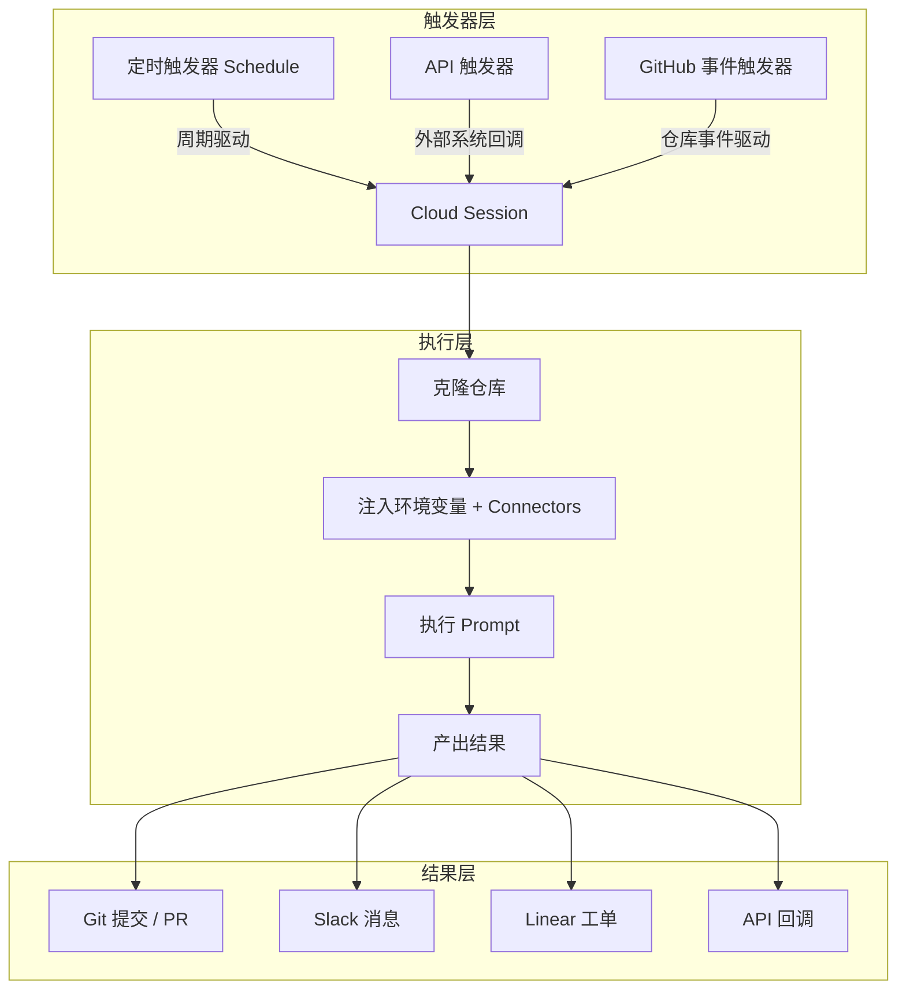

# Claude Code Routines：让 AI Agent 实现无人值守自动化

Routines 的核心变化是**把 Claude Code 从交互式助手变成一台你关上电脑后仍在运转的自动化引擎**。它通过三种不同性质的触发器——定时、API 回调、GitHub 事件——覆盖了从周期性维护到实时响应的自动化需求，背后的执行环境是 Anthropic 托管的云端基础设施。

这篇文章不逐项罗列配置字段。下面先拆开三种触发器的边界和适用场景，用一个完整的告警分级案例把抽象机制串起来，再给出不同团队的采用顺序。

> **目标读者**：Claude Code 用户、DevOps 工程师、AI 自动化实践者
> **前置知识**：Claude Code 基础用法、Git/GitHub 基础、了解过 MCP（Model Context Protocol）连接器
> **预计阅读时间**：45-60 分钟

---

## 1 学习目标

几个问题读完应该有答案：

1. Routine 和本地 Claude Code 的本质区别在哪里？什么时候该用 Routine，什么时候不该用？
2. 三种触发器各自适合什么场景？它们的边界在哪里？
3. 一个 Routine 从触发到产出结果，中间经历了哪些环节？
4. Routine 以谁的身份操作 GitHub、Slack、Linear？权限边界画在哪里？
5. 如果你要为自己的团队设计第一个 Routine，从哪个场景切入最划算？

---

## 2 系统全景：三种触发器 + 一条执行主线

三套触发机制看起来是三个并列选项，但它们背后的适用场景完全不同：



| 触发器 | 驱动方式 | 典型场景 | 关键约束 |
|--------|----------|----------|----------|
| Schedule | 时间到了就执行 | 定期整理、巡检、同步 | 频率固定，不适合实时响应 |
| API | 外部系统主动调用 | 告警分级、部署验证、Webhook 回调 | 需要调用方持有 Token，可传 `text` 数据 |
| GitHub 事件 | 仓库事件触发 | PR 审查、Issue 自动分类、SDK 同步 | 只响应 GitHub 事件，可过滤条件 |

搞清这三者的边界之后，再看具体配置才有意义。

---

## 3 背景与动机：从交互式助手到无人值守 Agent

### 3.1 Claude Code 的两种形态

Claude Code 最初的设计目标是在终端里和人协作——你坐在电脑前，它帮你写代码、调试、解释。你控制它启动和停止。

Routines 把这种关系翻转了：你不再需要坐在电脑前，甚至不需要电脑开机。你定义规则，Claude 在云端自动执行，结果推送给团队。

### 3.2 传统自动化方案为什么不够用

Cron 加脚本能处理"每小时跑一次"这种固定逻辑，但一旦涉及"根据堆栈跟踪找到最近提交并生成修复方案"这种需要理解代码、关联上下文的任务，纯脚本方案就崩了。CI/CD 流水线擅长构建和测试，但不擅长做开放式的代码分析或跨仓库操作。桌面 Agent 的问题更直接：电脑关了它就停了。

Routines 把这些能力拼到了一起：LLM 级别的理解力、云端托管的不间断运行、事件驱动的实时响应，以及 GitHub 的原生集成。它不是在和 Cron 或 CI/CD 竞争，而是在填它们之间的空白地带。

---

## 4 Routine 的构成与执行模型

### 4.1 配置三要素

一个 Routine 不需要写代码，只需要定义三个东西：

| 组件 | 作用 |
|------|------|
| **Prompt** | 任务描述——Claude 要做什么 |
| **Repositories** | 工作范围——在哪些代码库操作 |
| **Connectors** | 外部能力——能调用 Slack、Linear 等哪些服务 |

### 4.2 云端执行是怎么回事

每次 Routine 触发时，Anthropic 的托管基础设施会创建一个新的 Cloud Session。这个 Session 和本地 Claude Code 的关键区别在于：

- 不需要 Permission Mode 选择器，运行过程无审批中断
- 可以执行 shell 命令、使用 skills、调用 connectors
- 访问范围由仓库权限、环境变量和连接器共同决定

Routine 从默认分支克隆仓库，在 `claude/` 前缀的分支上创建更改。如果需要推送到任意分支，需要开启 **Allow unrestricted branch pushes**。

### 4.3 Routine 以谁的身份操作

Routine 属于你的个人账户，不与团队共享。所有操作都以你的身份进行：

| 操作 | 身份标识 |
|------|----------|
| Git 提交 | 你的 GitHub 用户 |
| Pull Request | 你的 GitHub 用户 |
| Slack 消息 | 你关联的 Slack 账户 |
| Linear 工单 | 你关联的 Linear 账户 |

Routine 的权限边界就是你的个人权限边界——它不会获得团队管理员权限，也不会绕过你在 GitHub 上的仓库访问控制。

---

## 5 三种触发器

### 5.1 定时触发器（Schedule）

Schedule 适合"到了某个时间点就该做的事"：

| 频率 | 说明 |
|------|------|
| **Hourly** | 每小时整点运行 |
| **Daily** | 每天固定时间 |
| **Weekdays** | 每个工作日 |
| **Weekly** | 每周一次 |
| **Custom cron** | 自定义 cron 表达式 |

典型场景：每天早上 9 点扫描未处理的 Issue 并打标签；每周一检查文档是否与最近合并的 PR 脱节。

### 5.2 API 触发器

API 触发器让外部系统通过 HTTP POST 唤醒 Routine，适合需要实时响应的场景：

```bash
curl -X POST https://api.claude.ai/routines/{routine-id}/trigger \
  -H "Authorization: Bearer {token}" \
  -H "Content-Type: application/json" \
  -d '{"text": "Alert: Error threshold exceeded in production"}'
```

`text` 字段是 Routine 接收外部数据的入口。监控系统可以把告警内容、堆栈跟踪塞进这个字段，Routine 在 Prompt 里通过 `{{text}}` 引用它。

### 5.3 GitHub 事件触发器

GitHub 触发器直接挂载到仓库事件上，属于最精准的触发方式——只在真正需要响应的时刻执行：

| 事件 | 触发时机 |
|------|----------|
| `pull_request.opened` | 新 PR 打开 |
| `pull_request.closed` | PR 关闭（可筛选已合并） |
| `push` | 代码推送 |
| `issues.opened` | Issue 创建 |
| `workflow_run.completed` | CI/CD 工作流完成 |

可以叠加过滤条件，只处理特定分支或特定标签的 PR。

---

## 6 任务流案例：告警分级 Routine 的完整执行路径

上面讲的是静态结构，现在用场景 2（告警分级）串起来，看看一个 Routine 从触发到产出结果到底经历了什么。

### 6.1 触发阶段

生产环境的监控系统检测到 `payment-service` 的错误率超过阈值，触发告警。监控系统构造一个 HTTP POST 请求：

```json
{
  "text": "Alert: payment-service error rate 12% (threshold: 5%). Stack trace: NullPointerException at PaymentGateway.process(PaymentGateway.java:142). Last deploy: commit a3f2b1c by @alice"
}
```

这个请求到达 Anthropic 的 API 端点后，Routine 引擎创建一个新的 Cloud Session。

### 6.2 执行阶段

Cloud Session 启动后，Claude 按 Prompt 中的指令逐步执行：

1. **克隆仓库**：从默认分支拉取 `payment-service` 的代码
2. **关联上下文**：解析 `text` 中的堆栈跟踪，定位到 `PaymentGateway.java:142`
3. **追溯变更**：`git log` 查看 commit `a3f2b1c` 的改动内容，发现 @alice 在上次部署中修改了 `PaymentGateway` 的异常处理逻辑
4. **分析根因**：对比改动前后的代码，发现新增的 `try-catch` 块在特定条件下吞掉了异常，导致上游调用方拿到 null 引用
5. **生成修复**：在 `claude/fix-payment-gateway-npe` 分支上创建修复代码
6. **推送 PR**：创建 Draft PR，标题为 `fix: restore exception propagation in PaymentGateway.process`，正文包含根因分析、修复说明和受影响范围

### 6.3 结果交付

执行完成后，Routine 通过 Slack connector 向 `#oncall` 频道发送消息：

> 告警 `payment-service error rate 12%` 已分析。根因：commit a3f2b1c 的异常处理导致 NPE。Draft PR 已创建：[链接]。请 @alice review。

整个流程从告警触发到 PR 创建，没有人工介入。工程师打开 Slack 时看到的是已完成的根因分析和待 Review 的修复代码，而不是一条需要从零开始排查的告警消息。

### 6.4 这个案例的关键点

Routine 在这个案例里把**上下文关联、代码理解和变更操作**串成了一条无人值守的链路。监控系统只负责发现异常，Routine 负责把异常翻译成可操作的修复方案。

---

## 7 实战场景

以下 5 个场景都经过验证，按投入产出比从高到低排列：

### 场景 1：Backlog 维护（定时触发）

每个工作日晚间自动整理 Issue 队列：读取自上次运行以来的新 Issue，根据代码区域自动打标签、分配负责人，生成 Slack 摘要。团队每天早上看到的是已分好类的 Issue 列表，而不是原始收件箱。

### 场景 2：代码审查自动化（GitHub 触发）

每个新 PR 自动执行审查清单：安全漏洞扫描、性能反模式检测、代码风格检查。Inline 评论直接贴在 PR 上，人工 Reviewer 可以把精力放在设计审查上，机械性检查交给 Routine。

### 场景 3：部署验证（API 触发）

CD 流水线完成后，部署平台调用 Routine 进行验证：运行冒烟测试、扫描错误日志、检查回归。部署窗口关闭前自动给出"通过/不通过"判断，结果发布到 Slack 发布频道。

### 场景 4：文档漂移检测（定时触发）

每周一扫描过去一周合并的 PR，检查涉及 API 变更的 PR 是否更新了对应文档。未更新的自动创建文档更新 PR。

### 场景 5：SDK 跨语言同步（GitHub 触发）

一个 SDK 仓库的 PR 合并后，Routine 将变更 port 到另一个语言的平行 SDK 仓库，创建匹配的 PR。多语言 SDK 保持同步，不需要人工重复实现。

---

## 8 创建 Routine

### 8.1 三种创建入口

| 入口 | 方式 | 适合场景 |
|------|------|----------|
| **Web** | claude.ai/code/routines → New routine | 可视化配置，适合首次创建和复杂配置 |
| **CLI** | `/schedule daily PR review at 9am` | 对话式引导，适合快速创建 |
| **Desktop** | New task → New remote task | 从桌面端直接创建云端 Routine |

注意：Desktop App 中 **New local task** 创建的是本地定时任务，不是 Routine——它依赖你的电脑在线。

### 8.2 创建流程

1. 命名 Routine + 编写 Prompt
2. 选择仓库（可多选）
3. 选择环境（环境变量注入）
4. 选择触发器类型
5. 检查 Connectors（默认全部包含，建议移除不需要的）
6. 确认创建

---

## 9 仓库、环境与 Connectors

### 9.1 仓库权限

Routine 从默认分支克隆，在 `claude/` 前缀的分支上创建更改。这个设计的好处是：Routine 的改动不会污染你的主分支，你需要手动 Review 后再合并。

如果 Routine 需要直接推送到特定分支（比如自动更新 `gh-pages`），启用 **Allow unrestricted branch pushes**。

### 9.2 环境变量

API Keys、Tokens、其他密钥通过环境变量注入。Routine 的云端环境与本地 Desktop 环境完全隔离——你的本地 `.env` 文件不会自动同步到云端。

### 9.3 Connectors 与权限最小化

Routine 默认包含你所有已连接的 MCP Connectors。但按最小权限原则，你应该移除 Routine 不需要的 Connectors。一个只做代码审查的 Routine 不需要 Slack 写入权限。

---

## 10 配额与限制

Routines 需要 Pro / Max / Team / Enterprise 计划并启用 Claude Code on the Web。Free 计划不可用。Routine 的每次运行计入账户的每日运行配额。

---

## 11 采用指南：从哪个场景开始

如果你刚开始用 Routines，按以下顺序推进会比较稳妥：

### 第一阶段：低风险定时任务

从 **Backlog 维护** 或 **文档漂移检测** 开始。这两个场景的共同特点是：失败成本低，不需要实时响应，产出物（Issue 标签、文档 PR）都有人工 Review 环节。你可以用一周时间观察 Routine 的行为模式，调整 Prompt 直到输出稳定。

### 第二阶段：GitHub 事件驱动

稳定后接入 **代码审查自动化**。这个阶段 Routine 开始直接影响开发流程，但仍然是通过 PR Review 的方式，有天然的 Review 门槛。关键配置：限制 Routine 只在特定标签或特定分支的 PR 上触发，避免对所有 PR 都执行。

### 第三阶段：API 触发 + 实时响应

最后接入 **告警分级** 或 **部署验证**。这类场景要求 Routine 在几分钟内完成分析并产出结果，对 Prompt 的鲁棒性要求最高。建议先在 staging 环境跑一段时间，确认 Routine 不会因为异常输入产生错误操作。

### 什么时候不急着用 Routine

- 任务需要复杂的交互式调试——这种场景本地 Claude Code 更合适
- 一次性任务——不值得为单次执行配置 Routine
- Routine 的操作权限超过了你愿意让它自动执行的边界——先缩小权限范围再上线

---

## 12 Routine vs 本地 Claude Code

| 场景 | 推荐 |
|------|------|
| 复杂调试、需要即时反馈 | 本地 Claude Code |
| 定期整理任务、自动化 | Routine |
| 事件驱动（PR 打开时） | Routine |
| 需要交互式探索 | 本地 Claude Code |
| 24/7 无人值守 | Routine |
| 一次性任务 | 本地 Claude Code |

---

## 13 常见问题

### Q1：Routine 和本地 Desktop Scheduled Task 有什么区别？

Routine 在 Anthropic 云端运行，电脑关机也能执行。Desktop Scheduled Task 运行在你的本地机器上。

### Q2：Routine 的代码变更推送到哪里？

Claude 在 `claude/` 前缀的分支上创建更改，你需要手动合并。开启 Unrestricted branch pushes 后可以直接推送到任意分支。

### Q3：Routine 可以访问哪些数据？

取决于三个因素：你选择的仓库、环境变量中的密钥、以及启用的 Connectors。三者取交集。

### Q4：Routine 失败时会发生什么？

Routine 在你的 Session 列表中显示失败状态，可以查看日志排查。失败不会自动重试。

### Q5：Routine 可以并行运行吗？

可以。每个触发事件创建一个独立的 Cloud Session，互不干扰。

---

## 14 相关资源

| 资源 | 链接 |
|------|------|
| **官方文档** | [code.claude.com/docs/en/routines](https://code.claude.com/docs/en/routines) |
| **Routine 管理** | [claude.ai/code/routines](https://claude.ai/code/routines) |
| **Claude Code 概述** | [code.claude.com/docs/en/overview](https://code.claude.com/docs/en/overview) |
| **MCP 连接器** | [code.claude.com/docs/en/mcp](https://code.claude.com/docs/en/mcp) |
| **云端环境** | [code.claude.com/docs/en/claude-code-on-the-web](https://code.claude.com/docs/en/claude-code-on-the-web) |