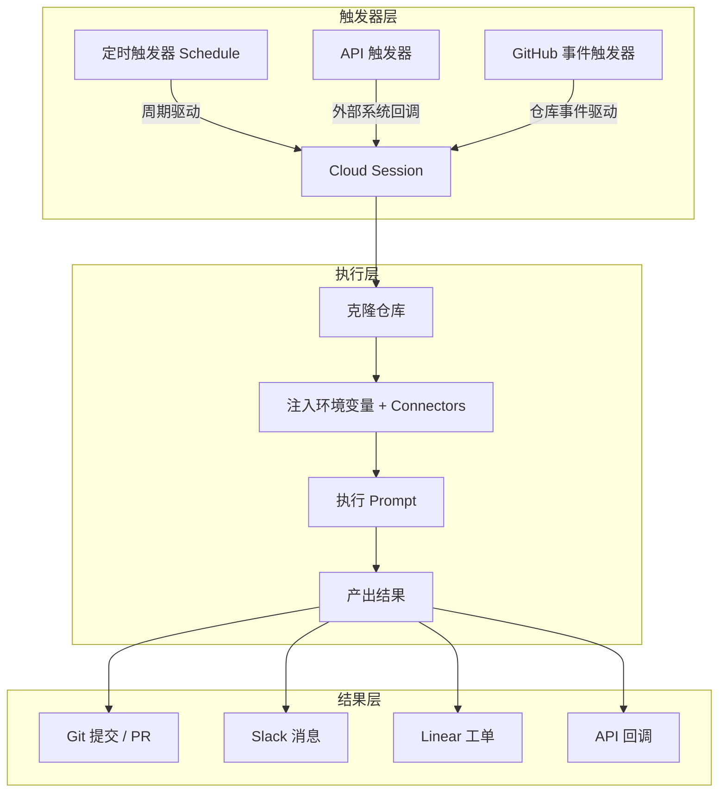

# Claude Code Routines：让 AI Agent 实现无人值守自动化

Routines 把 Claude Code 从终端里的交互式助手变成云端定时执行的 Agent——你关掉电脑，它还在跑。触发方式有三种：定时调度、API 回调、GitHub 事件，分别对应周期性维护、外部系统唤醒和仓库事件响应，执行环境是 Anthropic 托管的 Cloud Session。

正文围绕三条线展开：三种触发器的边界与适用场景、用告警分级案例串起完整执行链路、不同团队的采用顺序。配置字段不逐项罗列，需要时查官方文档即可。

> **快速参考**
> - **GitHub**: [anthropics/claude-code](https://github.com/anthropics/claude-code)
> - **官方文档**: [Claude Code Routines](https://docs.anthropic.com/en/docs/claude-code/routines)
> - **最后更新**: 2026-06-26

## 学习目标

阅读本文后，你将能够：

- 根据任务特性选择正确的触发器类型（Schedule / API / GitHub Events）
- 为一个 Routine 编写 Prompt、配置仓库和 Connectors，使其自主完成端到端任务
- 规划 Routines 的采用顺序，从低风险定时任务逐步扩展到实时响应
- 识别不适合 Routines 的任务类型，避免为一次性交互或复杂调试场景配置自动化

---

## 目录

- [系统全景：三种触发器 + 一条执行主线](#系统全景三种触发器--一条执行主线)
- [从交互式助手到无人值守 Agent](#从交互式助手到无人值守-agent)
- [Routine 的构成与执行模型](#routine-的构成与执行模型)
- [三种触发器](#三种触发器)
- [任务流案例：告警分级 Routine 的完整执行路径](#任务流案例告警分级-routine-的完整执行路径)
- [实战场景](#实战场景)
- [创建 Routine](#创建-routine)
- [仓库、环境与 Connectors](#仓库环境与-connectors)
- [配额与限制](#配额与限制)
- [采用指南：从哪个场景开始](#采用指南从哪个场景开始)
- [Routine vs 本地 Claude Code](#routine-vs-本地-claude-code)
- [常见问题](#常见问题)
- [相关资源](#相关资源)

---

## 系统全景：三种触发器 + 一条执行主线

三套触发机制虽然并列列出，但各自的适用场景完全不同：


```mermaid
graph TD
    subgraph 触发器层
        A[定时触发器 Schedule] --> |周期驱动| E[Cloud Session]
        B[API 触发器] --> |外部系统回调| E
        C[GitHub 事件触发器] --> |仓库事件驱动| E
    end

    subgraph 执行层
        E --> F[克隆仓库]
        F --> G[注入环境变量 + Connectors]
        G --> H[执行 Prompt]
        H --> I[产出结果]
    end

    subgraph 结果层
        I --> J[Git 提交 / PR]
        I --> K[Slack 消息]
        I --> L[Linear 工单]
        I --> M[API 回调]
    end
```

| 触发器 | 驱动方式 | 典型场景 | 关键约束 |
|--------|----------|----------|----------|
| Schedule | 时间到了就执行 | 定期整理、巡检、同步 | 频率固定，不适合实时响应 |
| API | 外部系统主动调用 | 告警分级、部署验证、Webhook 回调 | 需要调用方持有 Token，可传 `text` 数据 |
| GitHub 事件 | 仓库事件触发 | PR 审查、Issue 自动分类、SDK 同步 | 只响应 GitHub 事件，可过滤条件 |

三种触发器共用同一条执行主线：触发后由 Anthropic 托管的 Cloud Session 接管，克隆仓库、注入环境变量与 Connectors、执行 Prompt、产出结果。差异只在"谁来按那个按钮"。搞清这三者的边界之后，再看具体配置才有意义。

---

## 从交互式助手到无人值守 Agent

### Claude Code 的两种形态

Claude Code 最初的设计目标是在终端里和人协作——你坐在电脑前，它帮你写代码、调试、解释。你控制它启动和停止。

Routines 把这种关系对调了：你不再需要坐在电脑前，甚至不需要电脑开机。你定义规则，Claude 在云端自动执行，结果推送给团队。

### 传统自动化方案为什么不够用

Cron 加脚本能处理"每小时跑一次"这种固定逻辑，但一旦涉及"根据堆栈跟踪找到最近提交并生成修复方案"这种需要理解代码、关联上下文的任务，纯脚本方案就崩了。CI/CD 流水线擅长构建和测试，但不擅长做开放式的代码分析或跨仓库操作。桌面 Agent 的问题更直接：电脑关了它就停了。

Routines 把模型对代码的理解、云端不间断运行、事件驱动响应和 GitHub 原生集成拼到了一起。它填的是 Cron、CI/CD 和桌面 Agent 之间的空白地带——这三者各管一段，Routine 把需要理解代码、关联上下文、跨仓库操作的那一段接了过来。

---

## Routine 的构成与执行模型

### 配置三要素

一个 Routine 不需要写代码，只需要定义三个东西：

| 组件 | 作用 |
|------|------|
| **Prompt** | 任务描述——Claude 要做什么 |
| **Repositories** | 工作范围——在哪些代码库操作 |
| **Connectors** | 外部能力——能调用 Slack、Linear 等哪些服务 |

### 云端执行是怎么回事

每次 Routine 触发时，Anthropic 的托管基础设施会创建一个新的 Cloud Session。Cloud Session 是 Routine 的执行环境，和本地 Claude Code 的关键区别在于：

- 不需要 Permission Mode 选择器，运行过程无审批中断
- 可以执行 shell 命令、使用 skills、调用 connectors
- 访问范围由仓库权限、环境变量和连接器共同决定

Cloud Session 的生命周期绑定单次执行：触发时创建，Prompt 执行完毕后销毁。每次执行都是全新的环境，不存在跨次的状态残留——这意味着 Routine 不能依赖文件系统保存中间结果，任何需要跨执行周期保留的数据都必须通过 Git 提交、外部 API 或 Connectors 持久化到外部系统。

Routine 从默认分支克隆仓库，在 `claude/` 前缀的分支上创建更改。如果需要推送到任意分支，需要开启 **Allow unrestricted branch pushes**。

### Routine 以谁的身份操作

Routine 属于你的个人账户，不与团队共享。所有操作都以你的身份进行：

| 操作 | 身份标识 |
|------|----------|
| Git 提交 | 你的 GitHub 用户 |
| Pull Request | 你的 GitHub 用户 |
| Slack 消息 | 你关联的 Slack 账户 |
| Linear 工单 | 你关联的 Linear 账户 |

Routine 的权限边界就是你的个人权限边界——它不会获得团队管理员权限，也不会绕过你在 GitHub 上的仓库访问控制。这一点直接决定了哪些任务适合交给 Routine：任何你不愿个人账号自动执行的操作，都不该配成 Routine。

---

## 三种触发器

### 定时触发器（Schedule）

Schedule 适合"到了某个时间点就该做的事"：

| 频率 | 说明 |
|------|------|
| **Hourly** | 每小时整点运行 |
| **Daily** | 每天固定时间 |
| **Weekdays** | 每个工作日 |
| **Weekly** | 每周一次 |
| **Custom cron** | 自定义 cron 表达式 |

典型场景：每天早上 9 点扫描未处理的 Issue 并打标签；每周一检查文档是否与最近合并的 PR 脱节。

### API 触发器

API 触发器让外部系统通过 HTTP POST 唤醒 Routine，适合需要实时响应的场景：

```bash
curl -X POST https://api.claude.ai/routines/{routine-id}/trigger \
  -H "Authorization: Bearer {token}" \
  -H "Content-Type: application/json" \
  -d '{"text": "Alert: Error threshold exceeded in production"}'
```

> **注意**：上面的 URL 为示例性地址，实际端点需以 [官方文档](https://code.claude.com/docs/en/routines) 为准。`{routine-id}` 在 Routine 创建完成后从管理界面获取；`{token}` 是 Anthropic API 凭证，需在账号设置中生成并妥善保管，不要硬编码到仓库或 CI 配置里。

`text` 字段是 Routine 接收外部数据的入口。监控系统可以把告警内容、堆栈跟踪塞进这个字段，Routine 在 Prompt 里通过 `{{text}}` 引用它。

### GitHub 事件触发器

GitHub 触发器直接挂载到仓库事件上，属于最精准的触发方式——只在真正需要响应的时刻执行：

| 事件 | 触发时机 |
|------|----------|
| `pull_request.opened` | 新 PR 打开 |
| `pull_request.closed` | PR 关闭（可筛选已合并） |
| `push` | 代码推送 |
| `issues.opened` | Issue 创建 |
| `workflow_run.completed` | CI/CD 工作流完成 |

可以叠加过滤条件，只处理特定分支或特定标签的 PR。

---

## 任务流案例：告警分级 Routine 的完整执行路径

以下用告警分级场景把整条链路串起来。

### 触发阶段

生产环境的监控系统检测到 `payment-service` 的错误率超过阈值，触发告警。监控系统构造一个 HTTP POST 请求：

```json
{
  "text": "Alert: payment-service error rate 12% (threshold: 5%). Stack trace: NullPointerException at PaymentGateway.process(PaymentGateway.java:142). Last deploy: commit a3f2b1c by @alice"
}
```

这个请求到达 Anthropic 的 API 端点（具体地址以官方文档为准）后，Routine 引擎创建一个新的 Cloud Session。

### 执行阶段

Cloud Session 启动后，Claude 按 Prompt 中的指令逐步执行：

1. **克隆仓库**：从默认分支拉取 `payment-service` 的代码
2. **关联上下文**：解析 `text` 中的堆栈跟踪，定位到 `PaymentGateway.java:142`
3. **追溯变更**：`git log` 查看 commit `a3f2b1c` 的改动内容，发现 @alice 在上次部署中修改了 `PaymentGateway` 的异常处理逻辑
4. **分析根因**：对比改动前后的代码，发现新增的 `try-catch` 块在特定条件下吞掉了异常，导致上游调用方拿到 null 引用
5. **生成修复**：在 `claude/fix-payment-gateway-npe` 分支上创建修复代码
6. **推送 PR**：创建 Draft PR，标题为 `fix: restore exception propagation in PaymentGateway.process`，正文包含根因分析、修复说明和受影响范围

### 结果交付

执行完成后，Routine 通过 Slack connector 向 `#oncall` 频道发送消息：

> 告警 `payment-service error rate 12%` 已分析。根因：commit a3f2b1c 的异常处理导致 NPE。Draft PR 已创建：[链接]。请 @alice review。

整个流程从告警触发到 PR 创建，没有人工介入。工程师打开 Slack 时看到的是已完成的根因分析和待 Review 的修复代码，而不是一条需要从零开始排查的告警消息。

### 这个案例的关键点

Routine 把三件事压到了同一次执行中：把堆栈跟踪关联到具体代码行、把代码行关联到最近一次提交、把根因分析转换成可 Review 的 Draft PR。监控系统只负责发现异常，Routine 负责把异常翻译成可操作的修复方案。这种链路在纯脚本方案里需要写大量粘合代码，且每次告警模式变化都要改脚本；Routine 用 Prompt 描述任务，模型负责适配输入变化。

---

## 实战场景

以下 5 个场景按投入产出比从高到低排列，每个场景附带 Prompt 结构示意和关键配置，方便直接套用。

### 场景 1：Backlog 维护（定时触发）

每个工作日晚间自动整理 Issue 队列：读取自上次运行以来的新 Issue，根据代码区域自动打标签、分配负责人，生成 Slack 摘要。

**Prompt 结构示意**：
```text
扫描仓库 {repo} 中自 {last_run} 以来新创建的 Issue。
对每个 Issue：
1. 根据标题和正文判断所属模块（frontend/backend/infra/docs）
2. 打上对应标签
3. 如果代码区域匹配，@相关维护者
4. 汇总今日新增 Issue 数量、已打标签分布、未分配 Issue 列表
将摘要发送到 Slack #backlog 频道。
```

**关键配置**：Schedule → Daily，23:00 执行。Connectors 只保留 Slack 写入和 GitHub 读写，移除不需要的 Linear、Jira 等。团队每天早上看到的是已分好类的 Issue 列表，而不是原始收件箱。

### 场景 2：代码审查自动化（GitHub 触发）

每个新 PR 自动执行审查清单：安全漏洞扫描、性能反模式检测、代码风格检查。Inline 评论直接贴在 PR 上。

**Prompt 结构示意**：
```text
PR #{pr_number} 由 @{author} 提交，变更文件 {files}。
执行以下审查清单：
1. 安全检查：是否引入新依赖、是否暴露敏感信息、是否有 SQL 注入风险
2. 性能检查：是否有 N+1 查询、是否在循环中执行 IO 操作
3. 风格检查：是否遵循项目 .eslintrc / .golangci.yml 配置
每条审查意见必须附带文件路径和行号引用。
对严重问题（安全漏洞、性能退化）标记为 BLOCKING。
```

**关键配置**：GitHub 触发器 → `pull_request.opened`，过滤条件只含 `main` 和 `release/*` 分支。人工 Reviewer 可以把精力放在设计审查上，机械性检查交给 Routine。注意：此场景的 Prompt 需要持续迭代——如果 Routine 频繁误报或漏报，先调整审查清单的优先级，而不是增加更多检查项。

### 场景 3：部署验证（API 触发）

CD 流水线完成后，部署平台调用 Routine 进行验证：运行冒烟测试、扫描错误日志、检查回归。

**Prompt 结构示意**：
```text
部署版本 {version} 已推送到 {environment}。
验证步骤：
1. 运行冒烟测试套件（{smoke_test_suite}），记录失败用例
2. 扫描部署后 5 分钟内的错误日志，提取新增异常模式
3. 对比上一个版本的基线指标（响应时间、错误率、P99 延迟）
判定标准：
- 冒烟测试全部通过 + 无新增异常 → 通过
- 冒烟测试失败或错误率上升超过 50% → 不通过，附带失败详情
将结果发布到 Slack #deploy 频道，标注判定结果。
```

**关键配置**：API 触发器，CD 流水线在部署完成后调用。Routine 的 Prompt 通过 `{{text}}` 接收部署版本和环境信息。部署窗口关闭前自动给出"通过/不通过"判断，回滚决策由人工确认。

### 场景 4：文档漂移检测（定时触发）

每周一扫描过去一周合并的 PR，检查涉及 API 变更的 PR 是否更新了对应文档。

**Prompt 结构示意**：
```text
扫描过去一周（{last_week_range}）合并到 main 分支的 PR。
对每个 PR：
1. 判断变更是否涉及公开 API（路由、SDK 方法、配置格式）
2. 如果涉及 API 变更，检查同 PR 是否包含对应文档更新
3. 如果 API 变更但文档未更新，创建一个新的文档 PR
4. 将文档 PR 分配给原 PR 作者 Review
输出报告：已检查 {n} 个 PR，其中 {m} 个存在文档漂移，已创建文档 PR 列表。
```

**关键配置**：Schedule → Weekly，周一 08:00 执行。此场景的收益随着团队规模增长——小型团队靠口头沟通就能覆盖，大型团队每月可能漏掉 5-10 个未同步的 API 变更。

### 场景 5：SDK 跨语言同步（GitHub 触发）

一个 SDK 仓库的 PR 合并后，Routine 将变更 port 到另一个语言的平行 SDK 仓库，创建匹配的 PR。

**Prompt 结构示意**：
```text
PR #{pr_number} 已合并到 {source_repo}，变更涉及 {files}。
任务：
1. 理解 PR 中的逻辑变更，不限于逐行翻译
2. 在 {target_repo} 中找到对应的模块位置
3. 按目标语言的习惯实现等效逻辑（如 TypeScript 的 async/await 对应 Python 的 asyncio）
4. 创建 Draft PR，标题注明 [Port from {source_repo}#{pr_number}]
5. 在 PR 正文中附上源 PR 链接和 Port 说明
```

**关键配置**：GitHub 触发器 → `pull_request.closed`，叠加 `action: merged` 过滤条件。需要配置两个仓库的访问权限。此场景对 Prompt 质量要求最高——逻辑翻译比逐行拷贝更容易出错，建议先在非核心 SDK 模块上跑一段时间再推广。

---

## 创建 Routine

### 三种创建入口

| 入口 | 方式 | 适合场景 |
|------|------|----------|
| **Web** | claude.ai/code/routines → New routine | 可视化配置，适合首次创建和复杂配置 |
| **CLI** | `/schedule daily PR review at 9am` | 对话式引导，适合快速创建 |
| **Desktop** | New task → New remote task | 从桌面端直接创建云端 Routine |

注意：Desktop App 中 **New local task** 创建的是本地定时任务，不是 Routine——它依赖你的电脑在线。

### 创建流程

1. 命名 Routine + 编写 Prompt
2. 选择仓库（可多选）
3. 选择环境（环境变量注入）
4. 选择触发器类型
5. 检查 Connectors（默认全部包含，建议移除不需要的）
6. 确认创建

---

## 仓库、环境与 Connectors

### 仓库权限

Routine 从默认分支克隆，在 `claude/` 前缀的分支上创建更改。Routine 的改动不会污染主分支，需要手动 Review 后再合并。

如果 Routine 需要直接推送到特定分支（比如自动更新 `gh-pages`），启用 **Allow unrestricted branch pushes**。开启后要格外注意触发条件——一旦 Routine 在 `main` 或 `release` 分支上自动提交，回滚成本会比 PR Review 流程高得多。

### 环境变量

API Keys、Tokens、其他密钥通过环境变量注入。Routine 的云端环境与本地 Desktop 环境完全隔离——你的本地 `.env` 文件不会自动同步到云端，需要在 Routine 配置里单独填写。

### Connectors 与权限最小化

Routine 默认包含你所有已连接的 MCP Connectors。一个只做代码审查的 Routine 不需要 Slack 写入权限，移除不需要的 Connectors 既能缩小爆炸半径，也能减少 Prompt 中无关工具的干扰。

---

## 配额与限制

Routines 需要 Pro / Max / Team / Enterprise 计划并启用 Claude Code on the Web。Free 计划不可用。Routine 的每次运行计入账户的每日运行配额。

高频定时任务（如 Hourly）在配额紧张时需要权衡：要么降低频率，要么把多个相关任务合并到一个 Routine 里，让单次执行覆盖更多工作。例如，把 Backlog 维护和文档漂移检测合并到同一个 Routine 中，用 Prompt 区分执行逻辑，而不是拆成两个独立的定时任务。

另一个容易被忽略的限制：单个 Routine 的 Prompt 执行时长没有公开的硬性上限，但 Cloud Session 的创建和销毁有冷启动延迟——首次触发大约需要 10-30 秒的初始化时间。对于需要秒级响应的场景（如实时告警），这个延迟需要纳入 SLA 设计。

---

## 采用指南：从哪个场景开始

Routines 的采用顺序，按风险从低到高分三个阶段。

### 第一阶段：低风险定时任务

从 **Backlog 维护** 或 **文档漂移检测** 开始。这两个场景的共同特点是：失败成本低，不需要实时响应，产出物（Issue 标签、文档 PR）都有人工 Review 环节。可以用一周时间观察 Routine 的行为模式，调整 Prompt 直到输出稳定。判断稳定的标准：连续 3-5 次运行的结果都不需要人工修正，或修正幅度在可接受范围内；如果每次都需要返工，说明 Prompt 还没收敛，先别进入下一阶段。

### 第二阶段：GitHub 事件驱动

稳定后接入 **代码审查自动化**。这个阶段 Routine 开始直接影响开发流程，但仍然是通过 PR Review 的方式，有天然的 Review 门槛。关键配置：限制 Routine 只在特定标签或特定分支的 PR 上触发，避免对所有 PR 都执行。

### 第三阶段：API 触发 + 实时响应

最后接入 **告警分级** 或 **部署验证**。这类场景要求 Routine 在几分钟内完成分析并产出结果，对 Prompt 的鲁棒性要求最高。建议先在 staging 环境跑一段时间，确认 Routine 不会因为异常输入产生错误操作。

### 什么时候不急着用 Routine

- 任务需要复杂的交互式调试——这种场景本地 Claude Code 更合适
- 一次性任务——不值得为单次执行配置 Routine
- Routine 的操作权限超过了你愿意让它自动执行的边界——先缩小权限范围再上线

---

## Routine vs 本地 Claude Code

| 维度 | 本地 Claude Code | Routine |
|------|-----------------|---------|
| 运行位置 | 本地终端 | Anthropic 云端 |
| 是否需要电脑开机 | 是 | 否 |
| 触发方式 | 手动输入命令 | 定时 / API / GitHub 事件 |
| 交互模式 | 实时对话 | 无人值守 |
| 审批流程 | 需 Permission Mode 确认 | 无审批中断 |
| 状态持久化 | 本地文件系统 | 无状态，每次全新环境 |
| 适合任务 | 复杂调试、交互式探索、一次性任务 | 定期整理、自动化、事件驱动 |

---

## 常见问题

### Q1：Routine 和本地 Desktop Scheduled Task 有什么区别？

Routine 在 Anthropic 云端运行，电脑关机也能执行。Desktop Scheduled Task 运行在你的本地机器上，电脑关机即停止。

### Q2：Routine 的代码变更推送到哪里？

Claude 在 `claude/` 前缀的分支上创建更改，你需要手动合并。开启 Unrestricted branch pushes 后可以直接推送到任意分支。

### Q3：Routine 可以访问哪些数据？

取决于三个因素：你选择的仓库、环境变量中的密钥、以及启用的 Connectors。三者取交集。

### Q4：Routine 失败时会发生什么？

Routine 在你的 Session 列表中显示失败状态，可以查看日志排查。失败不会自动重试。如果触发来源是 API 或 GitHub 事件，调用方需要自行实现重试逻辑；定时触发器则要等到下一个周期才会再次执行。

### Q5：Routine 可以并行运行吗？

可以。每个触发事件创建一个独立的 Cloud Session，互不干扰。但要注意配额消耗——并行执行会同时占用多次运行配额。

---

## 相关资源

| 资源 | 链接 |
|------|------|
| **官方文档** | [code.claude.com/docs/en/routines](https://code.claude.com/docs/en/routines) |
| **Routine 管理** | [claude.ai/code/routines](https://claude.ai/code/routines) |
| **Claude Code 概述** | [code.claude.com/docs/en/overview](https://code.claude.com/docs/en/overview) |
| **MCP 连接器** | [code.claude.com/docs/en/mcp](https://code.claude.com/docs/en/mcp) |
| **云端环境** | [code.claude.com/docs/en/claude-code-on-the-web](https://code.claude.com/docs/en/claude-code-on-the-web) |

---

