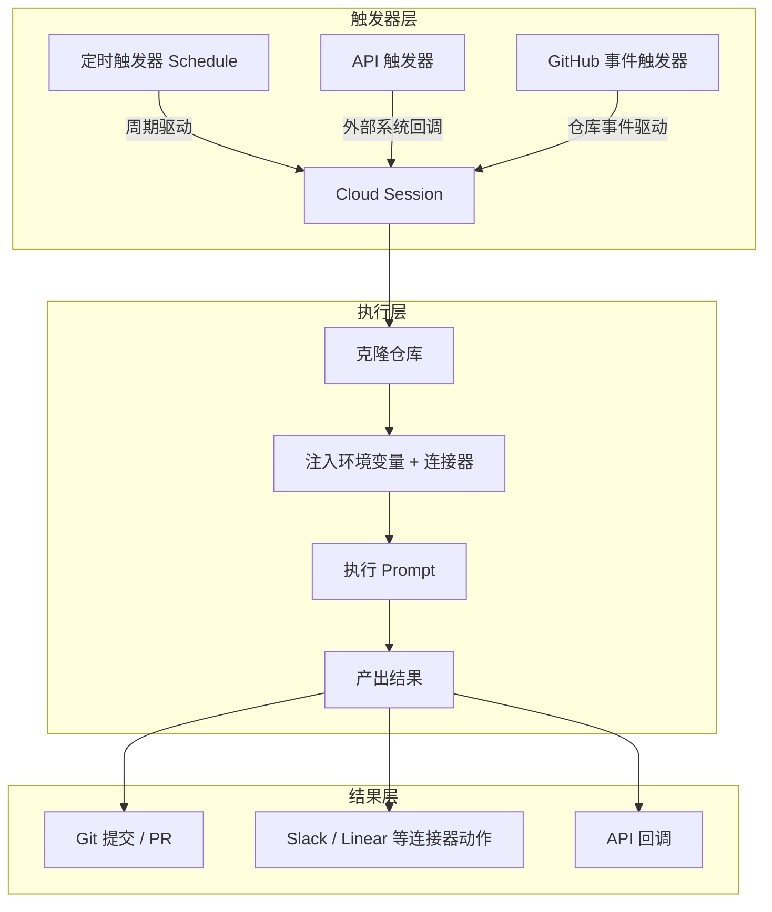

# Claude Code Routines：用三种触发器把 Claude Code 变成云端无人值守 Agent

Routines 把 Claude Code 从终端里陪你干活的助手，改成一份随时能被唤醒的云端配置。它处于研究预览阶段，行为、限制和 API 都可能变，但核心思路已经定型：你定义好 Prompt、仓库和连接器，剩下的交给 Anthropic 托管的云端，电脑关机它也照跑。

一个 Routine 就是一份保存好的配置：一段 Prompt、一个或多个 GitHub 仓库、一组连接器。它可以挂一个或同时挂多个触发器——定时、API、GitHub 事件。三种触发器的驱动方式完全不同，先分清它们各自管什么，再看配置才顺。

| 触发器 | 谁来按按钮 | 典型场景 | 关键约束 |
|--------|------------|----------|----------|
| Schedule | 时间到了就执行 | 定期整理、巡检、同步 | 频率固定，不适合实时响应 |
| API | 外部系统发 HTTP POST | 告警分级、部署验证 | 需要调用方持有该 Routine 专属 Token |
| GitHub 事件 | 仓库事件触发 | PR 审查、Issue 分类、SDK 同步 | 需要安装 Claude GitHub App，只响应仓库事件 |

三种触发器共用同一条执行主线：触发后由云端 Cloud Session 接管，克隆仓库、注入环境变量与连接器、执行 Prompt、产出结果，差异只在"谁来按那个按钮"。


```mermaid
graph TD
    subgraph 触发器层
        A[定时触发器 Schedule] -->|周期驱动| E[Cloud Session]
        B[API 触发器] -->|外部系统回调| E
        C[GitHub 事件触发器] -->|仓库事件驱动| E
    end

    subgraph 执行层
        E --> F[克隆仓库]
        F --> G[注入环境变量 + 连接器]
        G --> H[执行 Prompt]
        H --> I[产出结果]
    end

    subgraph 结果层
        I --> J[Git 提交 / PR]
        I --> K[Slack / Linear 等连接器动作]
        I --> L[API 回调]
    end
```

## Routine 的构成与执行模型

配一个 Routine 不用写代码，只需定义三件事：

| 组件 | 作用 |
|------|------|
| **Prompt** | 任务描述，Claude 每次运行都执行它 |
| **Repositories** | 工作范围，在哪些代码库操作 |
| **Connectors** | 外部能力，能调 Slack、Linear 等哪些服务 |

每次触发，Anthropic 的托管基础设施都会新建一个 Cloud Session。它和本地 Claude Code 的关键区别是没有权限模式选择器、运行过程中不弹审批：Session 可以执行 shell 命令、调用仓库里提交的 skills、使用你勾选的连接器。它能碰到什么，由你选的仓库及其分支推送设置、环境的网络访问与变量、你包含的连接器共同决定，三者的交集就是它的边界。

Session 绑定单次执行，跑完即销毁，没有跨次状态。所以 Routine 不能靠文件系统存中间结果，任何要保留的数据都得通过 Git 提交、外部 API 或连接器持久化到外部系统。

Routine 从默认分支克隆仓库，改动建在 `claude/` 前缀的分支上。要它推送到任意已有分支，需要给对应仓库开启 **Allow unrestricted branch pushes**。

Routine 属于你的个人 claude.ai 账户，不跟队友共享，计入你账户的每日运行配额。它用你的身份做一切事：Git 提交和 PR 带你的 GitHub 用户名，Slack 消息、Linear 工单用你关联的对应账户。它的权限边界就是你的个人权限边界——任何你不愿个人账号自动执行的操作，都不该配成 Routine。Team 和 Enterprise 管理员可以在 claude.ai 的管理设置里用开关禁用全部成员的 Routines，禁用后已有 Routine 停止运行，成员也无法新建。

## 定时触发器（Schedule）

Schedule 适合"到了某个时间点就该做的事"。频率可以是每小时、每天、工作日、每周，也可以安排一次性的单次运行。时间按你的本地时区填写，云端自动换算。

自定义间隔（比如每两小时、每月一日）先选最接近的预设，再在 CLI 里用 `/schedule update` 填具体 cron 表达式。最小间隔是一小时，更频繁的表达式会被拒绝。定时运行可能因 stagger 机制比设定时间晚几分钟开始，这个偏移对每个 Routine 是一致的。

一次性运行不会计入每日 Routine 配额，走的是你订阅的常规用量。触发后会自动禁用，界面标记为 **Ran**，要再跑就编辑 Routine 设新的时间。

典型场景：每天早上 9 点扫描未处理的 Issue 并打标签；每周一检查文档是否和最近合并的 PR 脱节。

## API 触发器

API 触发器给 Routine 一个专属 HTTP 端点。外部系统用它的 bearer token POST 到这个端点，就能启动一个新 Session 并返回 Session 链接。适合接进告警系统、部署流水线、内部工具这类"能发一条带认证的 HTTP 请求"的地方。

API 触发器只能在网页端给已有 Routine 添加，CLI 目前不能创建或吊销 Token。Token 每个 Routine 一个，生成后只在弹窗里显示一次，以后也取不回来，要保管在告警工具的密钥库里；要轮换或吊销，回到同一个弹窗点 **Regenerate** 或 **Revoke**。

触发走 `/fire` 端点，请求体带一个可选的 `text` 字段，随 Routine 已保存的 Prompt 一起传给 Claude：

```bash
curl -X POST https://api.anthropic.com/v1/claude_code/routines/trig_01ABCDEFGHJKLMNOPQRSTUVW/fire \
  -H "Authorization: Bearer sk-ant-oat01-xxxxx" \
  -H "anthropic-beta: experimental-cc-routine-2026-04-01" \
  -H "anthropic-version: 2023-06-01" \
  -H "Content-Type: application/json" \
  -d '{"text": "Sentry 告警 SEN-4521 在生产环境触发，附堆栈跟踪。"}'
```

`text` 是自由文本，不会被解析——你发 JSON 或其他结构化负载，Routine 也按字面字符串接收。更重要的是，这段文本不会作为裸消息到达 Routine：它会被包进一个 `<routine-fire-payload>` 块里，标记为不可信数据，并告诉 Claude 除非 Routine 自己的 Prompt 明确要求，否则不要执行里面的指令。所以在 Prompt 里要显式引用这个块，比如"调查 routine-fire-payload 块里描述的告警"，Routine 才会去处理触发文本。

`/fire` 端点在研究预览期走 `experimental-cc-routine-2026-04-01` 这个 dated beta 头。破坏性变更会挂在新版本的 dated 头后面，同时保留最近两个旧版本头部可用，给调用方时间迁移。这个端点只对 claude.ai 用户开放，不属于 Claude Platform API 的公开面。

## GitHub 事件触发器

GitHub 触发器在有匹配事件时自动启动 Session，每个匹配事件各起一个独立 Session。它要求仓库已安装 Claude GitHub App——在 CLI 里跑 `/web-setup` 只授予克隆的仓库访问权，装不了 App、也不开启 webhook 投递。配置触发器时，如果没装，界面会提示你装。

研究预览期内，GitHub webhook 事件受每个 Routine 和每个账户的小时级上限约束，超出的事件会被丢弃，直到窗口重置。

支持的事件按类别分，每个类别里可以选具体动作（比如 `pull_request.opened`），也可以响应类别下的所有动作。常用的事件包括：

| 事件 | 触发时机 |
|------|----------|
| `pull_request.opened` | 新 PR 打开 |
| `pull_request.closed` | PR 关闭（可叠加"已合并"过滤） |
| `push` | 代码推送 |
| `issues.opened` | Issue 创建 |
| `workflow_run.completed` | CI/CD 工作流完成 |
| `release.published` | 发布新 Release |

可以叠加过滤条件，只处理特定分支或特定标签的 PR——比如只响应进入 `main` 和 `release/*` 的 PR。

## 任务流案例：告警分级

拿告警分级场景把整条链路串起来。这只是个示意，描述的是一次触发从进来到出结果的过程。

生产监控检测到错误率超阈值，向 Routine 的 `/fire` 端点发一个 POST，`text` 里带上告警内容和堆栈跟踪。这个请求到达后，Routine 引擎新建一个 Cloud Session。

Session 启动后，Claude 按 Prompt 逐步执行：

1. **克隆仓库**：从默认分支拉取服务代码
2. **关联上下文**：解析 `text` 里的堆栈跟踪，定位到出错的代码行
3. **追溯变更**：用 `git log` 看最近相关提交，找出改动这段逻辑的那次部署
4. **分析根因**：对比改动前后，判断异常是怎么被引入的
5. **生成修复**：在 `claude/` 前缀的分支上创建修复代码
6. **推送 PR**：建一个 Draft PR，正文附根因分析、修复说明和受影响范围

执行完，Routine 通过 Slack 连接器向值班频道发消息，告诉工程师根因是什么、Draft PR 建在哪、该找谁 review。工程师打开 Slack 看到的是已完成的根因分析和待审的修复代码，而不是一条要从零开始排查的告警。

这套链路把三件事压进同一次执行：堆栈跟踪对到具体代码行、代码行对到最近一次提交、根因分析转成可审的 Draft PR。监控只负责发现异常，Routine 负责把异常翻译成修复方案。纯脚本方案要干这事得写大量粘合代码，而且每次告警模式一变就要改脚本；Routine 用 Prompt 描述任务，模型自己适配输入变化。

## 实战场景

下面 5 个场景按投入产出比从高到低排，每个都给出 Prompt 结构和关键配置，方便直接套用。

### 场景 1：Backlog 维护（定时触发）

每个工作日晚间整理 Issue 队列：读取上次运行以来的新 Issue，按代码区域打标签、分配负责人，生成 Slack 摘要。

```text
扫描仓库 {repo} 中自 {last_run} 以来新创建的 Issue。
对每个 Issue：
1. 根据标题和正文判断所属模块（frontend/backend/infra/docs）
2. 打上对应标签
3. 代码区域匹配时，@相关维护者
4. 汇总今日新增 Issue 数量、标签分布、未分配 Issue 列表
将摘要发送到 Slack #backlog 频道。
```

配置：Schedule → Daily，23:00 执行。Connectors 只留 Slack 写入和 GitHub 读写，去掉用不上的 Linear、Jira。团队早上看到的是分好类的列表，不是原始收件箱。

### 场景 2：代码审查自动化（GitHub 触发）

每个新 PR 自动跑一遍审查清单：安全、性能、风格。Inline 评论直接贴在 PR 上。

```text
PR #{pr_number} 由 @{author} 提交，变更文件 {files}。
执行以下审查清单：
1. 安全检查：是否引入新依赖、是否暴露敏感信息、是否有 SQL 注入风险
2. 性能检查：是否有 N+1 查询、是否在循环里做 IO 操作
3. 风格检查：是否遵循项目 .eslintrc / .golangci.yml 配置
每条意见必须附文件路径和行号。
严重问题（安全漏洞、性能退化）标记为 BLOCKING。
```

配置：GitHub 触发器 → `pull_request.opened`，过滤条件只含 `main` 和 `release/*` 分支。人工 Reviewer 省下机械检查，专注设计审查。这个场景的 Prompt 要持续迭代——频繁误报或漏报时，先调审查清单的优先级，别急着加检查项。

### 场景 3：部署验证（API 触发）

CD 流水线部署完成后调用 Routine 验证：跑冒烟测试、扫错误日志、查回归。

```text
部署版本 {version} 已推送到 {environment}。
验证步骤：
1. 运行冒烟测试套件（{smoke_test_suite}），记录失败用例
2. 扫描部署后 5 分钟内的错误日志，提取新增异常模式
3. 对比上一版本的基线指标（响应时间、错误率、P99 延迟）
判定标准：
- 冒烟测试全过 + 无新增异常 → 通过
- 冒烟测试失败或错误率上升超 50% → 不通过，附失败详情
将结果发布到 Slack #deploy 频道，标注判定结果。
```

配置：API 触发器，CD 流水线在部署完成后调用，Prompt 通过触发文本接收版本和环境信息。部署窗口关闭前给出"通过/不通过"判断，回滚决策留给人。

### 场景 4：文档漂移检测（定时触发）

每周一扫描过去一周合并的 PR，检查涉及 API 变更的 PR 是否更新了对应用档。

```text
扫描过去一周（{last_week_range}）合并到 main 分支的 PR。
对每个 PR：
1. 判断变更是否涉及公开 API（路由、SDK 方法、配置格式）
2. 涉及 API 变更时，检查同 PR 是否包含对应用档更新
3. API 变了但文档没更新，就新建一个文档 PR
4. 文档 PR 分配给原 PR 作者 Review
输出报告：已检查 {n} 个 PR，其中 {m} 个存在文档漂移，已创建的文档 PR 列表。
```

配置：Schedule → Weekly，周一 08:00 执行。收益随团队规模增长——小团队靠口头就够，大团队每月容易漏掉未同步的 API 变更。

### 场景 5：SDK 跨语言同步（GitHub 触发）

一个语言的 SDK 仓库 PR 合并后，Routine 把变更 port 到另一个语言的平行仓库，创建匹配的 PR。

```text
PR #{pr_number} 已合并到 {source_repo}，变更涉及 {files}。
任务：
1. 理解 PR 里的逻辑变更，不是逐行翻译
2. 在 {target_repo} 找到对应模块位置
3. 按目标语言习惯实现等效逻辑（如 TypeScript 的 async/await 对应 Python 的 asyncio）
4. 创建 Draft PR，标题注明 [Port from {source_repo}#{pr_number}]
5. 正文附源 PR 链接和 Port 说明
```

配置：GitHub 触发器 → `pull_request.closed`，叠加"已合并"过滤。需要给两个仓库都配访问权限。这个场景对 Prompt 质量要求最高，逻辑翻译比逐行拷贝容易出错，建议先在非核心模块上跑一段时间再推广。

## 创建 Routine

三个入口都写进同一个云账户，在哪建了，别处立刻能看到：

| 入口 | 方式 | 适合场景 |
|------|------|----------|
| **Web** | claude.ai/code/routines → New routine | 可视化配置，适合首次创建和复杂配置 |
| **CLI** | `/schedule` | 对话式引导，只创建定时 Routine |
| **Desktop** | 侧边栏 Routines → New routine → Remote | 从桌面端直接建云端 Routine |

Desktop 里选 **Local** 建的是本地定时任务，跑在你机器上，不是云端 Routine。CLI 的 `/schedule` 只建定时类 Routine，要加 API 或 GitHub 触发器得去网页端编辑；管理现有 Routine 用 `/schedule list`、`/schedule update`、`/schedule run`。

创建流程：命名并写 Prompt → 选仓库（可多选）→ 选环境 → 选触发器 → 复查 Connectors 和权限 → 创建。Prompt 是整份配置里最重要的一块——Routine 无人值守，Prompt 必须自包含，说清楚要做什么、成功长什么样，还可以给每次运行指定模型。

## 仓库、环境与 Connectors

### 仓库权限

Routine 从默认分支克隆，改动建在 `claude/` 前缀分支，不污染主分支，合并前由人 Review。要它直接推送到特定分支（比如自动更新 `gh-pages`），给那个仓库开 **Allow unrestricted branch pushes**。开了之后要格外小心触发条件——一旦它自动提交到 `main` 或 `release`，回滚成本比走 PR Review 高得多。

### 环境

环境控制云端 Session 能碰到什么：网络访问级别、注入的环境变量（API Key、Token 等密钥）、以及安装依赖和工具的 setup 脚本。setup 脚本的结果会缓存，不会每次运行都重跑。默认提供一个 **Default** 环境，要自定义得先建好环境再建 Routine。云端环境和本地 Desktop 完全隔离，本地 `.env` 不会自动同步上去。

### Connectors 与权限最小化

Connectors 标签页默认包含你所有已连接的 MCP 连接器，Claude 在运行中能用里面每个工具，包括写操作，且不弹授权。一个只做代码审查的 Routine 不需要 Slack 写入权限，把用不到的连接器去掉，既缩小爆炸半径，也减少无关工具对 Prompt 的干扰。

## 配额与限制

Routines 需要 Pro / Max / Team / Enterprise 任一计划并启用 Claude Code on the web，Free 计划不可用。每次运行计入账户的每日运行配额；一次性定时运行不计入，走常规订阅用量。

高频定时任务（如 Hourly）在配额紧张时要权衡：要么降频率，要么把几个相关任务并进一个 Routine，用 Prompt 区分执行逻辑，让单次运行覆盖更多工作——比如把 Backlog 维护和文档漂移检测合成一个 Routine。

研究预览期还有两个要留意的限制：GitHub webhook 事件有每小时上限，超出直接丢弃；Routine 的 API 端点和行为可能随 dated beta 头变化。对需要秒级响应的场景，要接受触发到 Session 就绪之间有一段初始化延迟，把它算进 SLA。

## 采用指南：从哪个场景开始

按风险从低到高分三个阶段切。

**第一阶段：低风险定时任务。** 从 Backlog 维护或文档漂移检测开始。两者失败成本低、不要求实时响应、产出物都有人工 Review。用一周观察行为，调到输出稳定再往下走。判断稳定的标准：连续 3-5 次运行几乎不需要人工修正；如果每次都要返工，说明 Prompt 没收敛，别急着进入下一阶段。

**第二阶段：GitHub 事件驱动。** 稳定后接代码审查自动化。这个阶段 Routine 开始直接影响开发流程，但仍然走 PR Review，有天然门槛。关键是把触发限制在特定标签或分支的 PR 上，别对所有 PR 都跑。

**第三阶段：API 触发 + 实时响应。** 最后接告警分级或部署验证。这类场景要求 Routine 在几分钟内完成分析，对 Prompt 鲁棒性要求最高。先在 staging 跑一段时间，确认它不会因为异常输入做出错误操作。

什么时候不急着用 Routine：任务需要复杂交互式调试（本地 Claude Code 更合适）；一次性任务（不值得配一次）；Routine 的操作权限超过你愿意让它自动执行的边界（先缩小权限再上线）。

## Routine vs 本地 Claude Code

| 维度 | 本地 Claude Code | Routine |
|------|-----------------|---------|
| 运行位置 | 本地终端 | Anthropic 云端的 Cloud Session |
| 是否需要电脑开机 | 是 | 否 |
| 触发方式 | 手动输入命令 | 定时 / API / GitHub 事件 |
| 交互模式 | 实时对话 | 无人值守，无审批中断 |
| 状态持久化 | 本地文件系统 | 无状态，每次全新环境 |
| 适合任务 | 复杂调试、交互式探索、一次性任务 | 定期整理、自动化、事件驱动 |

## 常见问题

**Routine 和本地 Desktop Scheduled Task 有什么区别？**

Routine 在 Anthropic 云端跑，电脑关机照常执行；Desktop Scheduled Task 在本地机器上跑，关机即停。

**Routine 的改动推到哪里？**

Claude 在 `claude/` 前缀分支上建改动，需要你手动合并。开启 unrestricted branch pushes 才能直接推任意分支。

**Routine 能访问哪些数据？**

取决于三个因素的交集：你选的仓库、环境变量里的密钥、启用的连接器。

**Routine 失败会怎样？**

在 Session 列表里显示失败状态，可查日志排查，不会自动重试。API 或 GitHub 事件触发的，调用方要自己实现重试；定时触发要等下一个周期。

**可以并行运行吗？**

可以。每个触发事件建独立 Session，互不干扰，但并行会同时消耗多次运行配额。

## 相关资源

| 资源 | 链接 |
|------|------|
| **官方文档** | [code.claude.com/docs/en/routines](https://code.claude.com/docs/en/routines) |
| **API 参考** | [Trigger a routine via API](https://platform.claude.com/docs/en/api/claude-code/routines-fire) |
| **Routine 管理** | [claude.ai/code/routines](https://claude.ai/code/routines) |
| **Claude Code on the web** | [code.claude.com/docs/en/claude-code-on-the-web](https://code.claude.com/docs/en/claude-code-on-the-web) |
| **MCP 连接器** | [code.claude.com/docs/en/mcp](https://code.claude.com/docs/en/mcp) |