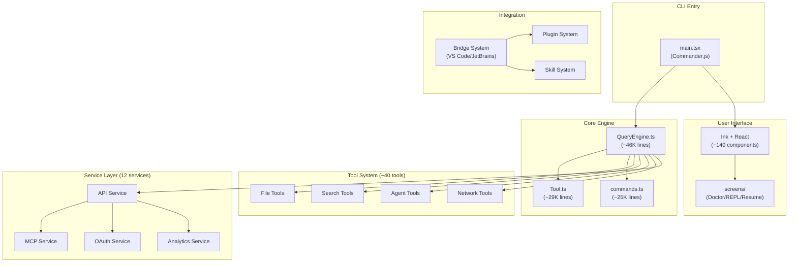
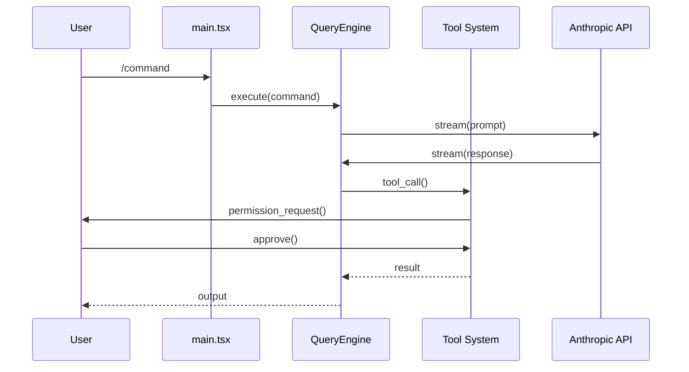

# Claude Code 源码架构深度解析

## §1 学习目标

完成本文档后，你将能够：

- ✅ 理解 Claude Code 源码的泄露背景与研究价值
- ✅ 掌握 Claude Code 的整体架构设计
- ✅ 深入理解 Tool System（40+工具）的实现机制
- ✅ 理解 Command System（50+命令）的设计
- ✅ 了解 Service Layer（12个服务）的职责划分
- ✅ 掌握 Bridge System 的 IDE 集成原理
- ✅ 理解 Permission System 的权限控制模型
- ✅ 了解 Feature Flags 的条件编译机制
- ✅ 理解 Agent Swarms 多智能体协作机制
- ✅ 掌握 Claude Code 的核心技术栈

---

## §2 项目概述

### 2.1 什么是 instructkr/claude-code？

**instructkr/claude-code**（[GitHub 仓库](https://github.com/instructkr/claude-code)）是一个 Claude Code 源码的镜像仓库，于 **2026年3月31日** 通过 npm 分发的 source map 文件意外暴露而公开。

**官方描述**：

> This repository mirrors a publicly exposed Claude Code source snapshot that became accessible on March 31, 2026 through a source map exposure in the npm distribution. It is maintained for educational, defensive security research, and software supply-chain analysis.

**翻译**：本仓库是 Claude Code 源码的镜像快照，于2026年3月31日通过 npm 分发的 .map 文件暴露而可访问。维护目的是教育、保护性安全研究和软件供应链分析。

### 2.2 事件背景

2026年3月31日，Twitter 用户 [@Fried_rice (Chaofan Shou)](https://x.com/Fried_rice) 首次公开报道：

> "Claude code source code has been leaked via a map file in their npm registry!"

发布的 source map 引用了托管在 Anthropic R2 存储桶中的未混淆 TypeScript 源码，使得 src/ 快照可以公开下载。

### 2.3 核心数据

| 指标 | 数值 |
|------|------|
| **Stars** | 3,500 (3.5k) |
| **Forks** | 5,900 (5.9k) |
| **Watchers** | 6 |
| **贡献者** | 1 (sigridjineth) |
| **提交数** | 1 (仅镜像提交) |
| **最新提交** | 2026-03-31 (5分钟前) |
| **语言** | TypeScript 100% |
| **运行时** | Bun |
| **代码规模** | ~1,900 文件, 512,000+ 行代码 |

### 2.4 研究背景

本仓库由一名**大学生**维护，研究方向包括：

- 软件供应链暴露与构建产物泄露
- 安全软件开发实践
- 智能体开发者工具架构
- 真实世界 CLI 系统的防御性分析

### 2.5 重要声明

⚠️ **免责声明**：
- 本仓库是**教育与防御性安全研究**档案
- 原始 Claude Code 源码**版权归 Anthropic 所有**
- 本仓库**不归 Anthropic 所有、赞助或维护**
- 不应被视为官方 Anthropic 仓库

---

## §3 技术栈全景

### 3.1 技术栈总览

| 类别 | 技术 | 说明 |
|------|------|------|
| **运行时** | Bun | JavaScript/TypeScript 运行时 |
| **语言** | TypeScript (strict) | 强类型 JavaScript 超集 |
| **终端 UI** | React + Ink | 命令行 UI 框架 |
| **CLI 解析** | Commander.js | 命令行参数解析 |
| **模式验证** | Zod v4 | TypeScript 模式验证 |
| **代码搜索** | ripgrep | 高性能搜索工具 |
| **协议** | MCP SDK, LSP | 模型上下文协议、语言服务器 |
| **API** | Anthropic SDK | Claude API 调用 |
| **遥测** | OpenTelemetry + gRPC | 可观测性 |
| **特性开关** | GrowthBook | 功能标志管理 |
| **认证** | OAuth 2.0, JWT, macOS Keychain | 安全认证 |

### 3.2 为什么选择 Bun？

Bun 在 Claude Code 中的应用：

1. **启动优化**：并行预取 MDM 设置、Keychain 读取、API 预连接
2. **打包优化**：Dead code elimination (DCE) 通过 `bun:bundle` 实现
3. **性能**：原生 TypeScript 支持，更快的启动时间
4. **兼容性**：与 Node.js API 完全兼容

### 3.3 Ink + React 的 Terminal UI

Claude Code 使用 **Ink**（由 Vadim Demedes 创建）构建命令行 UI：

```typescript
// Ink 组件示例结构
import { render, Text, Box } from 'ink'

const UI = () => (
  <Box flexDirection="column">
    <Text>Claude Code</Text>
    <Text color="green">Ready</Text>
  </Box>
)

render(<UI />)
```

优势：
- 完整的 React 组件模型
- 实时更新支持
- 键盘事件处理
- 自动化测试支持

---

## §4 目录结构深度解析

### 4.1 源码目录树

```
src/
├── main.tsx                    # 入口点编排 (Commander.js-based CLI)
├── commands.ts                 # 命令注册表 (~25K 行)
├── tools.ts                   # 工具注册表
├── Tool.ts                    # 工具类型定义 (~29K 行)
├── QueryEngine.ts             # LLM 查询引擎 (~46K 行)
├── context.ts                 # 系统/用户上下文收集
├── cost-tracker.ts            # Token 成本跟踪
│
├── commands/                  # 斜杠命令实现 (~50)
├── tools/                    # Agent 工具实现 (~40)
├── components/                # Ink UI 组件 (~140)
├── hooks/                    # React hooks
├── services/                 # 外部服务集成
├── screens/                  # 全屏 UI (Doctor, REPL, Resume)
├── types/                    # TypeScript 类型定义
├── utils/                    # 工具函数
│
├── bridge/                   # IDE 和远程控制桥接
├── coordinator/              # 多智能体协调器
├── plugins/                 # 插件系统
├── skills/                  # 技能系统
├── keybindings/              # 键绑定配置
├── vim/                     # Vim 模式
├── voice/                   # 语音输入
├── remote/                  # 远程会话
├── server/                  # 服务器模式
├── memdir/                  # 持久化内存目录
├── tasks/                   # 任务管理
├── state/                   # 状态管理
├── migrations/              # 配置迁移
├── schemas/                 # Zod 配置模式
├── entrypoints/             # 初始化逻辑
├── ink/                     # Ink 渲染器包装
├── buddy/                   # 伙伴精灵
├── native-ts/               # 原生 TypeScript 工具
├── outputStyles/            # 输出样式
├── query/                   # 查询管道
└── upstreamproxy/           # 代理配置
```

### 4.2 核心文件详解

| 文件 | 行数 | 职责 |
|------|------|------|
| **QueryEngine.ts** | ~46,000 | LLM API 调用核心，处理流式响应、工具调用循环、思考模式、重试逻辑、Token 计数 |
| **Tool.ts** | ~29,000 | 定义所有工具的基类类型和接口 — 输入模式、权限模型、进度状态类型 |
| **commands.ts** | ~25,000 | 管理所有斜杠命令的注册和执行，使用条件导入按环境加载不同命令集 |
| **main.tsx** | - | Commander.js CLI 解析器和 React/Ink 渲染器初始化 |

---

## §5 工具系统 (Tool System)

### 5.1 工具架构概览

Claude Code 的工具系统是其核心能力，约 **40 个自包含模块**，每个工具定义其输入模式、权限模型和执行逻辑。

### 5.2 核心工具列表

| 工具 | 类型 | 描述 |
|------|------|------|
| **BashTool** | 执行 | Shell 命令执行 |
| **FileReadTool** | 文件 | 文件读取（图片、PDF、笔记本） |
| **FileWriteTool** | 文件 | 文件创建/覆盖 |
| **FileEditTool** | 文件 | 局部文件修改（字符串替换） |
| **GlobTool** | 搜索 | 文件模式匹配搜索 |
| **GrepTool** | 搜索 | 基于 ripgrep 的内容搜索 |
| **WebFetchTool** | 网络 | URL 内容获取 |
| **WebSearchTool** | 网络 | Web 搜索 |
| **AgentTool** | 智能体 | 子智能体生成 |
| **SkillTool** | 技能 | 技能执行 |
| **MCPTool** | 协议 | MCP 服务器工具调用 |
| **LSPTool** | 协议 | 语言服务器协议集成 |
| **NotebookEditTool** | 笔记本 | Jupyter 笔记本编辑 |
| **TaskCreateTool / TaskUpdateTool** | 任务 | 任务创建和管理 |
| **SendMessageTool** | 通信 | 智能体间消息 |
| **TeamCreateTool / TeamDeleteTool** | 团队 | 团队智能体管理 |
| **EnterPlanModeTool / ExitPlanModeTool** | 模式 | 计划模式切换 |
| **EnterWorktreeTool / ExitWorktreeTool** | Git | Git worktree 隔离 |
| **ToolSearchTool** | 发现 | 延迟工具发现 |
| **CronCreateTool** | 调度 | 定时触发器创建 |
| **RemoteTriggerTool** | 远程 | 远程触发器 |
| **SleepTool** | 控制 | 主动模式等待 |
| **SyntheticOutputTool** | 输出 | 结构化输出生成 |

### 5.3 工具执行流程

```typescript
// 工具调用流程
async function executeTool(toolCall: ToolCall) {
  // 1. 权限检查
  const permission = await checkPermission(toolCall)
  if (!permission.granted) {
    return { status: 'denied', reason: permission.reason }
  }

  // 2. 输入验证
  const validated = ToolInputSchema.parse(toolCall.input)

  // 3. 执行工具
  const result = await tool.execute(validated)

  // 4. 结果序列化
  return serializeResult(result)
}
```

### 5.4 权限模式

Claude Code 支持多种权限模式：

| 模式 | 行为 |
|------|------|
| `default` | 每次提示用户批准/拒绝 |
| `plan` | 仅在计划模式询问 |
| `bypassPermissions` | 自动批准所有（CI 模式）|
| `auto` | 根据规则自动决定 |

---

## §6 命令系统 (Command System)

### 6.1 斜杠命令

用户通过 `/` 前缀调用斜杠命令，Claude Code 支持约 **50 个命令**：

| 命令 | 描述 |
|------|------|
| `/commit` | 创建 git 提交 |
| `/review` | 代码审查 |
| `/compact` | 上下文压缩 |
| `/mcp` | MCP 服务器管理 |
| `/config` | 设置管理 |
| `/doctor` | 环境诊断 |
| `/login` / `/logout` | 认证 |
| `/memory` | 持久化内存管理 |
| `/skills` | 技能管理 |
| `/tasks` | 任务管理 |
| `/vim` | Vim 模式切换 |
| `/diff` | 查看更改 |
| `/cost` | 检查使用成本 |
| `/theme` | 更改主题 |
| `/context` | 上下文可视化 |
| `/pr_comments` | 查看 PR 评论 |
| `/resume` | 恢复上一个会话 |
| `/share` | 分享会话 |
| `/desktop` | 桌面应用交接 |
| `/mobile` | 移动应用交接 |

### 6.2 命令注册机制

```typescript
// commands.ts 中的条件导入
export function registerCommands(context: CommandContext) {
  // 根据环境加载不同命令集
  if (isCI) {
    registerCICommands(context)
  } else {
    registerInteractiveCommands(context)
  }

  // 动态导入重型模块
  if (feature('VOICE_MODE')) {
    registerVoiceCommands(context)
  }
}
```

---

## §7 服务层 (Service Layer)

### 7.1 服务架构

Service Layer 包含 **12 个核心服务**：

| 服务 | 描述 |
|------|------|
| **api/** | Anthropic API 客户端、文件 API、引导 |
| **mcp/** | Model Context Protocol 服务器连接和管理 |
| **oauth/** | OAuth 2.0 认证流程 |
| **lsp/** | 语言服务器协议管理器 |
| **analytics/** | GrowthBook 特性标志和分析 |
| **plugins/** | 插件加载器 |
| **compact/** | 对话上下文压缩 |
| **policyLimits/** | 组织策略限制 |
| **remoteManagedSettings/** | 远程托管设置 |
| **extractMemories/** | 自动记忆提取 |
| **tokenEstimation.ts** | Token 计数估算 |
| **teamMemorySync/** | 团队记忆同步 |

### 7.2 API 服务

```typescript
// api/ 服务结构
export class AnthropicAPIService {
  async createMessage(prompt: Prompt): Promise<Message>
  async streamMessage(prompt: Prompt): AsyncIterable<Delta>
  async uploadFile(path: string): Promise<FileHandle>
  async getBootstrap(): Promise<BootstrapConfig>
}
```

### 7.3 上下文压缩服务

当对话上下文接近 Token 限制时，compact 服务会自动压缩历史：

```typescript
// compact/ 服务
export class ContextCompactor {
  async compact(conversation: Conversation): Promise<CompressedConversation> {
    // 1. 识别关键信息
    const keyInfo = this.extractKeyInformation(conversation)

    // 2. 生成摘要
    const summary = await this.summarize(keyInfo)

    // 3. 保留最近上下文
    const recent = conversation.slice(-N)

    return { summary, recent }
  }
}
```

---

## §8 桥接系统 (Bridge System)

### 8.1 Bridge 架构

Bridge System 是双向通信层，连接 IDE 扩展（VS Code、JetBrains）与 Claude Code CLI：

```
IDE Extension ←→ Bridge ←→ Claude Code CLI
   (VS Code)     │         │
   (JetBrains)   │         │
                 ↓         ↓
            bridgeMain.ts  main.tsx
            bridgeMessaging.ts
            bridgePermissionCallbacks.ts
            replBridge.ts
            jwtUtils.ts
            sessionRunner.ts
```

### 8.2 核心文件

| 文件 | 职责 |
|------|------|
| **bridgeMain.ts** | 桥接主循环 |
| **bridgeMessaging.ts** | 消息协议 |
| **bridgePermissionCallbacks.ts** | 权限回调 |
| **replBridge.ts** | REPL 会话桥接 |
| **jwtUtils.ts** | JWT 认证 |
| **sessionRunner.ts** | 会话执行管理 |

### 8.3 通信协议

```typescript
// Bridge 消息格式
interface BridgeMessage {
  type: 'tool_call' | 'permission_request' | 'result' | 'error'
  id: string
  payload: unknown
  timestamp: number
}

// JWT 认证
async function authenticate(token: string): Promise<Session> {
  const decoded = jwt.verify(token, publicKey)
  return createSession(decoded.userId)
}
```

---

## §9 权限系统 (Permission System)

### 9.1 权限检查点

权限系统在**每次工具调用**时进行检查：

```typescript
// src/hooks/toolPermission/
export async function checkToolPermission(
  toolCall: ToolCall,
  context: ExecutionContext
): Promise<PermissionResult> {
  // 1. 检查权限模式
  switch (context.permissionMode) {
    case 'bypassPermissions':
      return { granted: true }

    case 'auto':
      return autoResolve(toolCall)

    case 'default':
      return promptUser(toolCall)

    case 'plan':
      return context.isPlanMode
        ? promptUser(toolCall)
        : { granted: true }
  }
}
```

### 9.2 权限决策流程

```
Tool Call → Permission Check → [Auto-Resolve / User Prompt / Bypass]
                                    ↓
                            [Approve / Deny]
                                    ↓
                            [Execute / Abort]
```

---

## §10 特性开关 (Feature Flags)

### 10.1 Dead Code Elimination

Claude Code 使用 Bun 的 `bun:bundle` 实现 DCE：

```typescript
// 未启用代码在构建时完全剥离
import { feature } from 'bun:bundle'

const voiceCommand = feature('VOICE_MODE')
  ? require('./commands/voice/index.js').default
  : null
```

### 10.2 重要特性标志

| 标志 | 描述 |
|------|------|
| `PROACTIVE` | 主动模式 |
| `KAIROS` | 时间相关 |
| `BRIDGE_MODE` | IDE 桥接模式 |
| `DAEMON` | 守护进程模式 |
| `VOICE_MODE` | 语音输入模式 |
| `AGENT_TRIGGERS` | 智能体触发器 |
| `MONITOR_TOOL` | 工具监控 |

---

## §11 核心设计模式

### 11.1 并行预取

启动时间通过并行预取优化：

```typescript
// main.tsx — 在重型模块评估前作为副作用触发
MdmRawRead()
startKeychainPrefetch()
apiPreconnect()
GrowthBookInit()
```

### 11.2 惰性加载

重型模块通过动态 `import()` 延迟加载：

```typescript
// 条件导入示例
let openTelemetry: OpenTelemetry | null = null

async function getTelemetry(): Promise<OpenTelemetry> {
  if (!openTelemetry) {
    openTelemetry = await import('./services/telemetry')
  }
  return openTelemetry
}
```

### 11.3 智能体群 (Agent Swarms)

子智能体通过 `AgentTool` 生成：

```typescript
// 智能体协作
const team = await coordinator.createTeam({
  agents: [
    { role: 'planner', model: 'claude-opus' },
    { role: 'coder', model: 'claude-sonnet' },
    { role: 'reviewer', model: 'claude-haiku' }
  ],
  task: 'Build full-stack app'
})

await team.execute()
```

### 11.4 技能系统

可重用工作流定义在 `skills/` 目录，通过 `SkillTool` 执行：

```typescript
// 技能执行
const result = await skillSystem.execute({
  skill: 'code-review',
  target: './src',
  options: { verbose: true }
})
```

---

## §12 架构总结

### 12.1 系统架构图



### 12.2 数据流



### 12.3 技术优势

| 优势 | 说明 |
|------|------|
| **模块化** | 高度解耦的工具和服务 |
| **类型安全** | TypeScript strict + Zod 验证 |
| **性能优化** | 并行预取 + 惰性加载 |
| **安全** | 多层权限控制 |
| **可扩展** | 插件和技能系统 |
| **可观测** | OpenTelemetry 集成 |

---

## §13 研究价值与伦理说明

### 13.1 研究价值

1. **架构学习**：大规模 TypeScript 项目组织
2. **安全研究**：供应链安全分析
3. **最佳实践**：CLI 工具设计模式
4. **智能体开发**：多智能体协作机制

### 13.2 伦理边界

⚠️ **禁止**：
- 将源码用于商业目的
- 声称拥有原始代码
- 创建钓鱼或恶意工具
- 绕过安全控制

✅ **允许**：
- 教育目的学习
- 安全研究
- 防御性分析
- 供应链安全讨论

---

## §14 相关信息

### 14.1 项目信息

| 项目 | 信息 |
|------|------|
| **Stars** | 3.5k |
| **Forks** | 5.9k |
| **语言** | TypeScript 100% |
| **运行时** | Bun |
| **规模** | ~1,900 文件, 512,000+ 行 |

### 14.2 相关链接

| 资源 | 链接 |
|------|------|
| GitHub | https://github.com/instructkr/claude-code |
| Twitter 报道 | https://x.com/Fried_rice/status/2038894956459290963 |
| Ink 框架 | https://github.com/vadimdemedes/ink |
| Bun 运行时 | https://bun.sh |
| Claude Code | https://docs.anthropic.com/claude-code |

---

*文档版本 1.0 | 撰写日期：2026-03-31 | 基于 instructkr/claude-code (3.5k Stars) | 仅供教育研究用途*