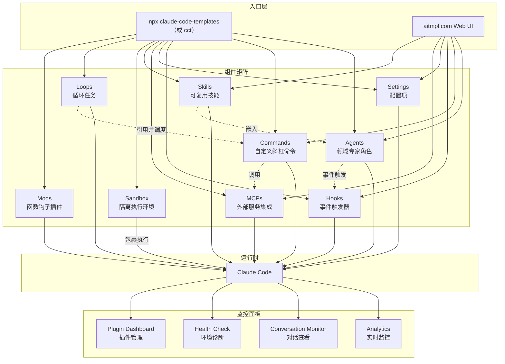

[Claude Code Templates](https://github.com/davila7/claude-code-templates)（Web 站点 [aitmpl.com](https://aitmpl.com)）把散在各处的 Claude Code 配置收拢成一套可搜索、可一键安装、装完还能看效果的系统。`settings.json`、MCP 配置、Agent 定义这些原本要手动写的文件，它按模块打包，用 CLI 或 Web UI 装进项目。

与多数只解决"怎么装"的配置方案不同，它多管了一层"装了之后怎么看"——Analytics 监控、对话查看、健康检查打包在同一个 CLI 里。

适用对象是已经跑通 Claude Code、想统一管理组件库并观察实际使用情况的团队。还没在本地跑通过的话，建议先走完官方 Quick Start 再来。

这篇文章基于 2026-04-28 发文时的仓库状态写成，2026-10-05 按现行仓库复核更新。五个月里项目动了 638 次提交，最大的变化是组件从七类扩到九类（新增 loops、mods），安装核心出了一个 Rust 重写版。

## 组件地图

Templates 的九类组件在 Claude Code 的运行时里各司其职，下面这张图展示它们怎么协作：


```mermaid
flowchart TB
 subgraph 入口层
  CLI["npx claude-code-templates（或 cct）"]
  WebUI["aitmpl.com Web UI"]
  end

 subgraph 组件矩阵
  Agents["Agents<br/>领域专家角色"]
  Commands["Commands<br/>自定义斜杠命令"]
  Hooks["Hooks<br/>事件触发器"]
  Settings["Settings<br/>配置项"]
  MCPs["MCPs<br/>外部服务集成"]
  Skills["Skills<br/>可复用技能"]
  Sandbox["Sandbox<br/>隔离执行环境"]
  Loops["Loops<br/>循环任务"]
  Mods["Mods<br/>函数钩子插件"]
  end

 subgraph 运行时
  CC["Claude Code"]
  end

 subgraph 监控面板
  Analytics["Analytics<br/>实时监控"]
  ConvMonitor["Conversation Monitor<br/>对话查看"]
  HealthCheck["Health Check<br/>环境诊断"]
  Plugins["Plugin Dashboard<br/>插件管理"]
  end

  CLI --> Agents
  CLI --> Commands
  CLI --> Hooks
  CLI --> Settings
  CLI --> MCPs
  CLI --> Skills
  CLI --> Sandbox
  CLI --> Loops
  CLI --> Mods
  WebUI --> Agents
  WebUI --> Commands
  WebUI --> Hooks
  WebUI --> Settings
  WebUI --> MCPs
  WebUI --> Skills

  Agents --> CC
  Commands --> CC
  Hooks --> CC
  Settings --> CC
  MCPs --> CC
  Skills --> CC
  Loops --> CC
  Mods --> CC
  Sandbox -->|包裹执行| CC

  CC --> Analytics
  CC --> ConvMonitor
  CC --> HealthCheck
  CC --> Plugins

  Agents -.->|事件触发| Hooks
  Commands -.->|调用| MCPs
  Skills -.->|嵌入| Agents
  Loops -.->|引用并调度| Commands
```

入口有两条：CLI 适合脚本化和自动化，Web UI 适合浏览发现。组件装好后注入 Claude Code 运行时，运行时再通过监控面板反向暴露状态、性能和诊断。图中虚线表示关联：Hooks 可以挂载在 Agent 的事件上，Commands 可以调用 MCPs 访问外部服务，Skills 可以嵌进 Agent 作为递进式暴露的能力模块，Loops 则把 Commands 和 Hooks 打包成按间隔循环执行的任务。

## 九类组件

README 的主表一直列六类，目录和 CLI 的实际口径是九类——sandbox 发文时就有，loops 和 mods 是这五个月里新增的。按目录当前数量（2026-10-05，共约 1,900 个）：

| 组件类型 | 做什么 | 例子 | 数量 |
|----------|--------|---------|------|
| **Agents** | 把 Claude Code 切换成特定领域的专家角色。安装后以该角色的视角和知识边界响应。 | 安全审计员、React 性能优化师、数据库架构师 | 422 |
| **Commands** | 注册自定义斜杠命令，可以封装任意复杂逻辑。 | `/generate-tests`、`/optimize-bundle`、`/check-security` | 288 |
| **MCPs** | 通过 Model Context Protocol 接入外部服务。 | GitHub、PostgreSQL、Stripe、AWS、OpenAI | 105 |
| **Settings** | 覆盖 Claude Code 的默认配置，比如超时、内存、输出格式。 | 超时设置、内存配置、输出样式 | 72 |
| **Hooks** | 在特定事件前后自动执行脚本，做检查、通知、记录。 | Pre-commit 验证、Post-completion 行动 | 62 |
| **Skills** | 带递进式暴露能力的可复用模块，比 Agent 轻量，比 Command 结构化。 | PDF 处理、Excel 自动化、科学计算 | 890 |
| **Sandbox** | 在隔离环境里执行 Claude Code，三个 provider：Docker、Cloudflare、E2B。 | `--sandbox e2b` 在云端沙箱跑任务 | 3 |
| **Loops** | 6 月新增。一份 Markdown 定义循环任务：执行间隔、停止条件、引用的 command/hook 组件。 | ticket-to-pr（每 30 分钟把一条 issue 变成 PR）、nightly-changelog | 18 |
| **Mods** | 9 月新增。Anthropic function-hooks 形态的插件，用 `register(on, options)` 钩住引擎事件。Claude Code 2.1.287 起默认开启，2.1.259–2.1.286 需设置 `CLAUDE_CODE_ENABLE_FUNCTION_HOOKS=1`。 | 棋盘对弈、模型路由、会话时间线回溯 | 39 |

这些组件聚合自多个上游仓库，每个保留原始许可和归属：K-Dense-AI 的 139 个科学计算 skills、Anthropic 官方 skills（21 个）与 claude-code 开发指南（10 个）、obra/superpowers 的 14 个工作流 skills、alirezarezvani 的 36 个角色 skills、wshobson 的 48 个 agents，以及 awesome-claude-code 的 21 个 commands 等社区来源。这组数字在发文时的 README 里就是这些，至今没变。

## 安装

两种途径：CLI 一键安装和 Web UI 交互式浏览。二者都写进项目的 `.claude/` 目录（或用户级 `~/.claude/`），不改变 Claude Code 本身的运行方式。

### CLI

```bash
npx claude-code-templates@latest --agent development-team/frontend-developer --command testing/generate-tests --mcp development/github-integration --yes

npx claude-code-templates@latest

npx claude-code-templates@latest --agent development-tools/code-reviewer --yes
npx claude-code-templates@latest --command performance/optimize-bundle --yes
npx claude-code-templates@latest --setting performance/mcp-timeouts --yes
npx claude-code-templates@latest --hook git/pre-commit-validation --yes
npx claude-code-templates@latest --mcp database/postgresql-integration --yes
npx claude-code-templates@latest --skill creative-design/algorithmic-art --yes
```

不带参数运行会进入交互式浏览模式，逐个选择要装的组件。带上 `--yes` 跳过确认，适合脚本化部署。每类组件的参数都支持逗号分隔批量安装，比如 `--agent a,b --command c`。npm 包还注册了短命令 `cct`，`npx cct@latest` 等价于长名。另外几个参数值得先知道：

- `--loop <loop>`：安装一个 loop 及其引用的组件（6 月新增）；
- `--mod <mod>`：安装一个 mod 插件到 `.claude/skills/`（9 月新增）；
- `--dry-run`：只打印将要安装的组件清单，不实际写入，用来在动手前核对路径；
- `--directory`：把组件装进指定目录而不是当前项目；
- `--help`：列出全部可选参数。

```bash
npx claude-code-templates@latest --loop engineering/ticket-to-pr-loop --yes
npx claude-code-templates@latest --dry-run
npx claude-code-templates@latest --directory /path/to/project
npx claude-code-templates@latest --help
```

### Web UI

打开 [aitmpl.com](https://aitmpl.com) 是一个带搜索和分类筛选的组件目录。每个组件有独立页面展示描述、安装命令和依赖关系，点击安装按钮会生成对应的 CLI 命令。发文时站点的 Dashboard 还标着 beta，现在 README 里这行字已经去掉，算是转正了。

Web UI 的价值在浏览阶段——不用记住将近两千个组件的路径，搜索 "security" 就能看到所有相关的 agents、commands 和 hooks。

## 一次安装怎么穿过这套系统

下面用一个示意流程说明组件从选到用的路径。组件路径和命令来自目录，具体参数以你装的组件为准。

团队要搭一条代码审查流水线：

```bash
npx claude-code-templates@latest --agent development-tools/code-reviewer --yes
npx claude-code-templates@latest --command testing/generate-tests --yes
npx claude-code-templates@latest --hook git/pre-commit-validation --yes
```

三条命令分别把 code-reviewer agent、`/generate-tests` 命令、pre-commit 校验 hook 写进 Claude Code 的配置目录。下次在项目里启动会话，agent 就以审查员角色运行；执行 `git commit` 时，hook 会在提交前触发一次自动审查。审查报告的具体覆盖点取决于该 agent 的 SKILL 定义，通常是安全、风格或效率相关的检查项。

`/generate-tests` 这类命令是对代码的操作入口，作用范围是你当前改动的文件。hooks 和 commands 一个挂在事件上、一个挂在斜杠命令上，两者解决的是不同的触发方式。

想再进一步，可以把这条流水线换成 loop 跑法。目录里的 `engineering/ticket-to-pr-loop` 定义了一个 30 分钟一轮的循环：读下一条可执行的 issue，在独立分支实现修复并补测试，测试通过就开一条带 conventional commit 的 PR，需要人工决策的 issue 打标跳过，直到队列清空。`--loop` 安装时会把这个 loop 引用的两个 command（fix-github-issue、create-pr）和一个 hook（conventional-commits）一并装上——loop 是对已有组件的调度封装，跑起来的还是那几个 command 和 hook。

### 组件落在哪个目录

安装的本质是把组件文件写进 Claude Code 的配置目录，位置决定了它对当前项目生效还是对所有项目生效：

| 组件类型 | 项目级位置 | 用户级位置 |
|----------|-----------|-----------|
| Agents | `.claude/agents/*.md` | `~/.claude/agents/*.md` |
| Commands | `.claude/commands/*.md` | `~/.claude/commands/*.md` |
| Skills / Mods | `.claude/skills/<name>/` | `~/.claude/skills/<name>/` |
| Settings / Hooks | `.claude/settings.json` | `~/.claude/settings.json` |
| MCPs | `.mcp.json` | — |

Settings 和 Hooks 安装时会问一层：写入用户级（所有项目生效）、项目级（随仓库共享）还是本地档 `.claude/settings.local.json`（只在本机、不入库）。hook 的脚本文件本体写在 `.claude/hooks/` 下。

MCP 是个例外：CLI 只往目标目录的 `.mcp.json` 深合并配置，没有用户级选项。想全局生效，得用 Claude Code 自带的 `claude mcp add --scope user`，或者手动把条目挪进用户配置——`~/.claude.json` 是 Claude Code 自己维护的文件，Templates 不写它。

用 `--directory` 指定了目标目录，组件就落在该目录下；不指定则写进当前项目。判断组件到底装没装对，先看文件落点是否符合预期，再跑 `--health-check` 校验一致性。

## 监控面板：装完怎么知道有没有用

Templates 的差异化能力在监控，所有面板都挂在同一个 CLI 上。README 重点列了四个：

### Analytics

```bash
npx claude-code-templates@latest --analytics
```

在本地起一个监控服务，实时检测 Claude Code 会话状态并采集性能指标，用一个面板展示。它回答的是"团队到底在哪些任务上花时间、token 烧在哪"这类问题。具体指标和解读口径以 [docs.aitmpl.com](https://docs.aitmpl.com) 为准，这里不代拟阈值。

### 对话监控器

```bash
npx claude-code-templates@latest --chats
```

移动端适配的界面，实时查看 Claude Code 的对话内容，适合在手机或平板上盯远程开发机上的会话。加 `--tunnel` 通过 Cloudflare Tunnel 从外网安全访问：

```bash
npx claude-code-templates@latest --chats --tunnel
```

### 健康检查

```bash
npx claude-code-templates@latest --health-check
```

做一次全面诊断，检查 Claude Code 安装是否处于优化状态——版本兼容性、Node.js 版本、已装组件一致性、MCP 连接状态、配置文件语法。组件之间有版本冲突或配置错误时，会直接指出来。

### 插件面板

```bash
npx claude-code-templates@latest --plugins
```

在一个界面里查看已安装的插件、可用市场和权限状态。当你从多个来源装了组件后，用它理清哪些来自哪个源、当前是否启用、有没有权限冲突。

### 面板不止这四个

`--help` 里还有一批面板入口：`--agents`（对话直达的 agents 面板）、`--skills-manager`（已装 skills 浏览）、`--teams`（多智能体协作会话复盘）、`--studio`（本地与云端执行的工作台）、`--command-stats` / `--hook-stats` / `--mcp-stats`（对已装组件做使用统计和优化建议）。这些入口大多在发文前就有，README 没有一一列出，按需 `--help` 查看当前版本的全部参数即可。

## 安装核心的 Rust 重写版

6 月起仓库里多了个 `cli-rust/` 目录：用 Rust 重写了组件安装的核心路径（agents、commands、mcps、settings、hooks、skills 六类的安装），官方声明与 Node 版做到逐字节一致的产出，以 v0.1.0 预览版从 GitHub Releases 独立发布（tag 前缀 `cli-rust-v*`），不改动现有 npm 包。安装走 shell 脚本或 `cargo binstall`；面板、沙箱、全局 agent、统计、健康检查这些功能仍然委托给 Node CLI。匿名遥测可用 `CCT_NO_TRACKING=1` 关闭，CI 环境下自动关闭。

对这个项目的读者来说，Rust 版目前是"快一点的安装器"，不改变任何使用方式。等它覆盖更多路径、发布渠道稳定后，才值得作为默认入口考虑。

## 常见问题与排查

### 组件装了但没生效

先看落盘位置（见"组件落在哪个目录"）：当前项目启动会话时只加载 `.claude/` 下的组件，想全局生效要装到 `~/.claude/`。位置没错的话，重启 Claude Code 会话再试——新装的 agent、command 和 hook 在已有会话里不会热加载。装的是 mod 的话还有一层版本前置：Claude Code 2.1.287 起默认支持，2.1.259–2.1.286 要设置 `CLAUDE_CODE_ENABLE_FUNCTION_HOOKS=1` 才加载得出来。

### 装了一堆组件后担心冲突

跑一次 `--health-check`。它会检查已装组件的一致性、MCP 连接状态和配置文件语法，组件之间有版本冲突或配置错误会直接指出来。多个来源混装后，用 `--plugins` 面板按来源理清已装项和权限状态。

### 不确定某个组件要不要装

先 `--dry-run` 看它实际会写哪些文件，再决定。这会列出将要安装的组件清单而不写入任何东西，比在 Web UI 里反复对比描述更直接。

### CLI 提示命令不存在或行为异常

确认用的是 `npx claude-code-templates@latest`（带 `@latest`），避免本地缓存了旧版本——这个仓库五个月推了 638 次提交，本地缓存的旧版很可能缺新参数；`--help` 可查看当前版本支持的全部参数。仍异常时参考 [docs.aitmpl.com](https://docs.aitmpl.com) 的故障排查章节。

## 生态里的位置

Claude Code 生态里已经有不少配置类项目，Templates 和它们各有分工，也能配合。

### 与 Anthropic 官方 Plugins

[anthropics/claude-plugins-official](https://github.com/anthropics/claude-plugins-official) 是 Anthropic 官方维护的插件目录（2025 年 11 月创建；原文引用的 `anthropics/claude-plugins` 是个不存在的仓库名，Wayback 上从无有效记录，官方另有社区向的 [claude-plugins-community](https://github.com/anthropics/claude-plugins-community)）。它定义插件规范和上架机制。Templates 做的是聚合——在官方规范的基础上，把社区贡献的 agents、commands、hooks、skills 和 MCPs 收进一个可搜索目录，并提供 CLI 和 Web UI 两种安装途径。类比一下：官方 Plugins 定标准和上架通道，Templates 是筛选分类好的合集。

### 与 ECC

[ECC](https://github.com/affaan-m/ECC) 是社区维护的 Claude Code 资源大全，涵盖文章、视频、工具、skills 和 MCPs。差别在发力点：ECC 是索引，告诉你有什么资源并给链接；Templates 是分发，你不只知道有什么，还能一键装。两者互补，实践中常先在 ECC 里发现工具，再去 Templates 里搜安装命令。

### 与 superpowers

[obra/superpowers](https://github.com/obra/superpowers) 是独立的 Claude Code skills 仓库，Templates 聚合了它的 14 个工作流 skills，并额外统一了安装入口、处理组件间的依赖冲突、提供可视化管理界面。已经在用 superpowers 的，迁到 Templates 不会丢功能，换来的是统一安装和监控；不迁也完全可以，superpowers 本身就是能独立使用的仓库。

## 什么时候值得用

判断依据是"你是不是已经有一批 Claude Code 配置要管"。

**值得用的场景**：团队已经跑通 Claude Code，组件数量开始超过手动维护的承受范围；想统一安装入口、理清多个来源的依赖冲突；想观察每次会话到底花在哪、token 烧在哪。监控层的收益在这里才体现得出来。

**可以先不用的场景**：只想要一两个组件，直接找到对应文件复制即可；Claude Code 本身还没配置好，这时候先跑官方 Quick Start 更实际。

**建议的切入顺序**：先在 Web UI 搜索浏览，确认你要的组件存在；再按需用 CLI 安装，`--yes` 做脚本化；装完跑一次 `--health-check` 校验；有固定节奏的重复工作（每日例行任务、issue 队列消化）再看 loops 里有没有现成定义；最后用 `--analytics` 观察一段时间，再决定要不要长期挂监控。

项目当前在 GitHub 上有 32,375 Stars 和 3,703 Forks（GitHub API 2026-10-05 验证；发文当天的 Wayback 快照为 26,113 Stars），MIT 协议，GitHub 语言标签为 Python，经 npm 包 `claude-code-templates` 分发（npm 最新版 1.29.6，2026-09-17 发布），持续更新。浏览全部组件：[aitmpl.com](https://aitmpl.com)；完整文档：[docs.aitmpl.com](https://docs.aitmpl.com)。
