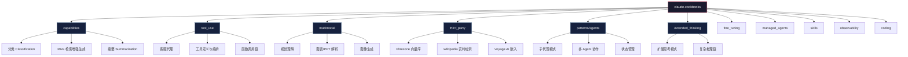

# Claude Cookbooks：Anthropic 官方 Claude 应用食谱库

正在构建基于 Claude 的应用——无论是智能客服、文档分析工具还是多模态内容理解系统——Anthropic 维护的 [Claude Cookbooks](https://github.com/anthropics/claude-cookbooks) 仓库可能是绕过坑、快速上手的高效路径。这个仓库在 GitHub 上积累了超过 40,000 个 Star，540 余次提交，73 位贡献者，代码主体是 Jupyter Notebook（约 95.7%）加上少量 Python 脚本。仓库采用 MIT 许可证，最后更新于 2026-06-26。

它和官方 API 文档的关系：**文档告诉你 API 能做什么，Cookbooks 示范你拿这个 API 能搭出什么**。文档是说明书，Cookbooks 是菜谱——每个条目都是一道可以直接下锅的完整菜式，附带预期输出和调参建议。

## 仓库全景


```mermaid
graph TD
    A[claude-cookbooks] --> B[capabilities]
    A --> C[tool_use]
    A --> D[multimodal]
    A --> E[third_party]
    A --> F[patterns/agents]
    A --> G[extended_thinking]
    A --> H[fine_tuning]
    A --> I[managed_agents]
    A --> J[skills]
    A --> K[observability]
    A --> L[coding]

    B --> B1["分类 Classification"]
    B --> B2["RAG 检索增强生成"]
    B --> B3["摘要 Summarization"]

    C --> C1["客服代理"]
    C --> C2["工具定义与编排"]
    C --> C3["函数调用链"]

    D --> D1["视觉理解"]
    D --> D2["图表/PPT 解析"]
    D --> D3["图像生成"]

    E --> E1["Pinecone 向量库"]
    E --> E2["Wikipedia 实时检索"]
    E --> E3["Voyage AI 嵌入"]

    F --> F1["子代理模式"]
    F --> F2["多 Agent 协作"]
    F --> F3["状态管理"]

    G --> G1["扩展思考模式"]
    G --> G2["复杂推理链"]

    style A fill:#1a1a2e,color:#fff,stroke:#e94560
    style B fill:#16213e,color:#eee,stroke:#0f3460
    style C fill:#16213e,color:#eee,stroke:#0f3460
    style D fill:#16213e,color:#eee,stroke:#0f3460
    style E fill:#16213e,color:#eee,stroke:#0f3460
    style F fill:#16213e,color:#eee,stroke:#0f3460
    style G fill:#16213e,color:#eee,stroke:#0f3460
```

仓库结构遵循一条清晰的进阶路径：先从 `capabilities` 入手掌握单次 API 调用的基础能力，再进入 `tool_use` 学会让 Claude 调用外部工具，接着用 `multimodal` 解锁视觉输入，最后通过 `patterns/agents` 和 `extended_thinking` 把整个系统串联成复杂的 Agent 工作流。

## 实战案例：构建一个带退款能力的智能客服 Agent

下面以 Cookbooks 中 `tool_use/customer_service_agent.ipynb` 的核心思路为蓝本，走一遍从零构建智能客服的流程。这个案例同时涉及**工具定义、多轮对话状态管理、外部 API 调用和错误回退**，涵盖了 Cookbooks 中最常用的几种模式。

### 场景定义

假设你经营一个电商平台，需要让 Claude 充当客服：
- 用户报出订单号后，自动查询订单状态
- 用户要求退款时，校验订单是否符合退款条件，符合则执行退款
- 退款失败时给出明确原因（如订单已发货、超过退款期限）

### Step 1：定义工具 Schema

Claude 的工具调用遵循 JSON Schema 规范。先定义两个工具：

```python
from anthropic import Anthropic
from anthropic.types import MessageParam

client = Anthropic()

tools = [
    {
        "name": "lookup_order",
        "description": "根据订单号查询订单的当前状态、金额和退款资格",
        "input_schema": {
            "type": "object",
            "properties": {
                "order_id": {
                    "type": "string",
                    "description": "用户提供的订单号，格式为 ORD- 开头"
                }
            },
            "required": ["order_id"]
        }
    },
    {
        "name": "process_refund",
        "description": "对符合条件的订单发起退款",
        "input_schema": {
            "type": "object",
            "properties": {
                "order_id": {"type": "string"},
                "amount": {"type": "number", "description": "退款金额"},
                "reason": {"type": "string", "description": "退款原因"}
            },
            "required": ["order_id", "amount", "reason"]
        }
    }
]
```

### Step 2：实现工具执行逻辑

Claude 只会返回它想调用哪个工具、传什么参数，实际执行由你的代码完成。这里用模拟数据演示：

```python
import json

ORDERS_DB = {
    "ORD-2024-001": {
        "status": "delivered",
        "amount": 299.00,
        "refundable": False,
        "refund_deadline": "2024-03-15"
    },
    "ORD-2024-002": {
        "status": "processing",
        "amount": 159.50,
        "refundable": True,
        "refund_deadline": "2024-04-20"
    },
    "ORD-2024-003": {
        "status": "shipped",
        "amount": 89.00,
        "refundable": False,
        "refund_deadline": "2024-03-28"
    }
}

def execute_tool(tool_name: str, tool_input: dict) -> str:
    if tool_name == "lookup_order":
        order = ORDERS_DB.get(tool_input["order_id"])
        if not order:
            return json.dumps({"error": "订单不存在"})
        return json.dumps(order, ensure_ascii=False)

    if tool_name == "process_refund":
        order = ORDERS_DB.get(tool_input["order_id"])
        if not order:
            return json.dumps({"error": "订单不存在"})
        if not order["refundable"]:
            return json.dumps({
                "error": "该订单不可退款",
                "reason": f"订单状态为 {order['status']}，退款截止日期为 {order['refund_deadline']}"
            })
        return json.dumps({
            "status": "refund_initiated",
            "order_id": tool_input["order_id"],
            "amount": tool_input["amount"]
        }, ensure_ascii=False)
```

### Step 3：构建多轮对话循环

这是整个 Agent 的核心——Claude 可能连续调用多个工具，需要循环处理直到它给出最终文本回复：

```python
def run_customer_service_agent(user_query: str) -> str:
    system_prompt = (
        "你是一个电商客服助手。用户会提供订单号或提出退款请求。"
        "请使用工具查询订单信息，然后根据查询结果给用户清晰的回复。"
        "如果订单不可退款，请温和地解释原因。"
    )

    messages: list[MessageParam] = [
        {"role": "user", "content": user_query}
    ]

    while True:
        response = client.messages.create(
            model="claude-sonnet-4-20250514",
            max_tokens=1024,
            system=system_prompt,
            tools=tools,
            messages=messages
        )

        if response.stop_reason == "end_turn":
            return response.content[0].text

        if response.stop_reason == "tool_use":
            for block in response.content:
                if block.type == "tool_use":
                    tool_result = execute_tool(block.name, block.input)

                    messages.append({
                        "role": "assistant",
                        "content": [block.model_dump()]
                    })
                    messages.append({
                        "role": "user",
                        "content": [
                            {
                                "type": "tool_result",
                                "tool_use_id": block.id,
                                "content": tool_result
                            }
                        ]
                    })

            continue

        return "处理异常：未预期的 stop_reason"
```

### Step 4：实际运行

```python
print(run_customer_service_agent("我的订单 ORD-2024-002 还没收到，我要退款"))
```

Claude 会先调用 `lookup_order` 查询订单状态，发现 `refundable: True` 后向用户确认退款金额和原因，再调用 `process_refund` 完成退款。整个过程在一次对话循环中自动完成。

这个案例展示的模式——**定义工具 Schema -> 实现执行函数 -> 构建对话循环**——几乎适用于所有需要 Claude 与外部系统交互的场景。

## 能力模块详解

### 文本分类、检索增强生成与摘要

这三个是 `capabilities` 目录下的基础模块，也是大多数应用的起点：

```python
from anthropic import Anthropic

client = Anthropic()

response = client.messages.create(
    model="claude-sonnet-4-20250514",
    max_tokens=200,
    messages=[{
        "role": "user",
        "content": "将以下评论分类为正面、负面或中性：'产品还不错，但包装太差了'"
    }]
)
print(response.content[0].text)

response = client.messages.create(
    model="claude-sonnet-4-20250514",
    max_tokens=300,
    messages=[{
        "role": "user",
        "content": f"用200字概括以下内容：\n\n{long_document}"
    }]
)
print(response.content[0].text)
```

RAG 部分值得单独展开。Cookbooks 提供了 Pinecone 和 Voyage AI 两套完整的嵌入与检索示例。核心流程可以归纳为三步：

```python
from pinecone import Pinecone
from anthropic import Anthropic

pc = Pinecone(api_key="...")
index = pc.Index("knowledge-base")

query_embedding = get_embedding(user_question)
results = index.query(vector=query_embedding, top_k=5)

context = "\n\n".join([match["metadata"]["text"] for match in results["matches"]])

client = Anthropic()
response = client.messages.create(
    model="claude-sonnet-4-20250514",
    max_tokens=1024,
    messages=[{
        "role": "user",
        "content": f"参考以下资料回答问题：\n\n{context}\n\n问题：{user_question}"
    }]
)
```

对于检索质量，`top_k` 不要设得过大（3-5 通常足够），`chunk` 大小要与问题粒度匹配——回答具体问题时 512 token 的 chunk 往往比 2048 token 的大块更精准。

### 多模态：图像理解与文档解析

Claude 的视觉能力在 Cookbooks 中有大量示例，从基础的图片描述到 PPT 数据提取：

```python
import base64
from pathlib import Path
from anthropic import Anthropic

client = Anthropic()
image_data = base64.b64encode(Path("slide.png").read_bytes()).decode()

response = client.messages.create(
    model="claude-sonnet-4-20250514",
    max_tokens=1024,
    messages=[{
        "role": "user",
        "content": [
            {
                "type": "image",
                "source": {
                    "type": "base64",
                    "media_type": "image/png",
                    "data": image_data
                }
            },
            {
                "type": "text",
                "text": "这张幻灯片中的核心数据是什么？请用表格呈现，保留原始数值。"
            }
        ]
    }]
)
```

实际使用中有一个经常被忽略的细节：Claude 对图片的分辨率有最小要求，过小的图片可能导致 OCR 或图表识别效果显著下降。Cookbooks 建议图片短边不低于 200 像素。

### 扩展思考与子代理

当单次推理不够时，Cookbooks 提供了两种增强手段。

**扩展思考（Extended Thinking）** 让 Claude 在内部展开更长的推理链：

```python
response = client.messages.create(
    model="claude-sonnet-4-20250514",
    max_tokens=4096,
    thinking={
        "type": "enabled",
        "budget_tokens": 2000
    },
    messages=[{
        "role": "user",
        "content": "分析以下代码的性能瓶颈并提出优化方案：\n\n" + code_snippet
    }]
)
```

`budget_tokens` 设置的越大，Claude 在内部推理上花的时间越长，但不会计入 output token 计费。简单问题用 1024，复杂推理用 4000 以上。

**子代理模式（Sub-agents）** 的核心思路是用便宜的模型（如 Haiku）做预处理，昂贵的模型（如 Opus）做最终决策：

```python
haiku_response = client.messages.create(
    model="claude-haiku-4-20250514",
    max_tokens=1024,
    messages=[{
        "role": "user",
        "content": f"从以下文档中提取所有日期和金额：\n\n{long_report}"
    }]
)

extracted = haiku_response.content[0].text

opus_response = client.messages.create(
    model="claude-opus-4-20250514",
    max_tokens=2048,
    messages=[{
        "role": "user",
        "content": f"基于以下提取数据，分析该公司的财务趋势：\n\n{extracted}"
    }]
)
```

这种模式在 Cookbooks 的 `patterns/agents/` 目录下有多个变体，包括并行子代理、流水线子代理和带 fallback 的子代理编排。

## 第三方集成一览

`third_party` 目录覆盖了与外部服务的集成示例：

| 集成方 | 应用方向 | 关键能力 |
|--------|----------|----------|
| Pinecone | 向量存储与语义检索 | 构建 RAG 知识库，支持百万级文档 |
| Voyage AI | 嵌入向量生成 | Anthropic 推荐的嵌入模型，与 Claude 生态紧密配合 |
| Wikipedia API | 实时知识获取 | 零成本扩展 Claude 的事实性知识边界 |
| AWS Bedrock | 云端部署 | 通过 AWS 托管 Claude 模型，满足企业合规需求 |

## 从开发到生产：三个关键细节

**模型选择策略。** Cookbooks 各示例中使用不同模型遵循明确的成本-能力匹配原则：文本分类和简单提取用 Haiku（每百万 token 约 $1），对话和中等复杂度推理用 Sonnet（每百万 token 约 $15），只有在涉及多步推理、代码生成或复杂 Agent 编排时才上 Opus（每百万 token 约 $75）。在不必要的地方使用 Opus 会多花 50 倍成本。

**错误处理与重试。** Anthropic API 的速率限制和临时故障是不可避免的。Cookbooks 中推荐的最小可行重试策略如下：

```python
import time
from anthropic import Anthropic, RateLimitError, APIStatusError

client = Anthropic()
max_retries = 3

for attempt in range(max_retries):
    try:
        response = client.messages.create(
            model="claude-sonnet-4-20250514",
            max_tokens=1024,
            messages=[{"role": "user", "content": prompt}]
        )
        break
    except RateLimitError:
        if attempt < max_retries - 1:
            wait = 2 ** attempt
            time.sleep(wait)
        else:
            raise
    except APIStatusError as e:
        if e.status_code >= 500 and attempt < max_retries - 1:
            time.sleep(2 ** attempt)
        else:
            raise
```

**Prompt Caching。** 对于需要反复发送相同系统提示或长文档的场景，启用缓存可以显著降低延迟和成本。缓存命中率超过 50% 的场景都值得开启：

```python
response = client.messages.create(
    model="claude-sonnet-4-20250514",
    max_tokens=1024,
    system=[
        {
            "type": "text",
            "text": "你是一个熟悉公司全部产品的技术支持工程师。",
            "cache_control": {"type": "ephemeral"}
        },
        {
            "type": "text",
            "text": product_catalog_text,
            "cache_control": {"type": "ephemeral"}
        }
    ],
    messages=[{"role": "user", "content": user_query}]
)
```

`cache_control: ephemeral` 标记的内容会在 5 分钟内保持缓存，后续请求只需传入同样的标记即可命中缓存，cache 读取费用仅为正常 input token 费用的 10%。

## 相关资源

- [Claude Cookbooks GitHub 仓库](https://github.com/anthropics/claude-cookbooks)
- [Anthropic 官方文档](https://docs.anthropic.com/)
- [Anthropic Courses（结构化教程）](https://github.com/anthropics/courses)
- [API Key 申请](https://console.anthropic.com/)
- [Anthropic Discord 社区](https://www.anthropic.com/contact)