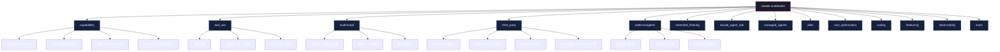

# Claude Cookbooks：Anthropic 官方 Claude 应用食谱库

Anthropic 维护的 [Claude Cookbooks](https://github.com/anthropics/claude-cookbooks) 仓库，截至 2026 年 9 月底有 53.1k 星、641 次提交、87 位贡献者，代码主体是 Jupyter Notebook（约 95%），另有少量 Python 和 TypeScript 脚本。仓库采用 MIT 许可证，2026-09-28 仍有提交。

它和官方 API 文档的分工很清楚：文档说明能用什么，Cookbooks 示范拿 API 能搭出什么。每个 notebook 是一道完整的菜式，附带运行输出和参数取舍的说明，可以直接拷进自己的项目改。

## 仓库全景


```mermaid
graph TD
    A[claude-cookbooks] --> B[capabilities]
    A --> C[tool_use]
    A --> D[multimodal]
    A --> E[third_party]
    A --> F[patterns/agents]
    A --> G[extended_thinking]
    A --> H[claude_agent_sdk]
    A --> I[managed_agents]
    A --> J[skills]
    A --> K[cost_optimization]
    A --> L[coding]
    A --> M[finetuning]
    A --> N[observability]
    A --> O[evals]

    B --> B1["分类 Classification"]
    B --> B2["RAG 检索增强生成"]
    B --> B3["摘要 Summarization"]
    B --> B4["text_to_sql 等其余模块"]

    C --> C1["客服代理"]
    C --> C2["结构化 JSON 提取"]
    C --> C3["并行工具与记忆"]

    D --> D1["视觉入门与最佳实践"]
    D --> D2["图表/PPT 解析"]
    D --> D3["转写与裁剪"]

    E --> E1["Pinecone 向量库"]
    E --> E2["Wikipedia 实时检索"]
    E --> E3["Voyage AI 嵌入"]
    E --> E4["MongoDB、LlamaIndex 等"]

    F --> F1["编排者-工作者"]
    F --> F2["评估器-优化器"]
    F --> F3["异步多代理编排"]

    classDef root fill:#1a1a2e,color:#fff,stroke:#e94560
    classDef branch fill:#16213e,color:#eee,stroke:#0f3460
    class A root
    class B,C,D,E,F,G,H,I,J,K,L,M,N,O branch
```

图里没展开的几个目录值得单独一看：`claude_agent_sdk` 是一套 9 个 notebook 的 Agent SDK 教程，从一行代码的研究代理写到托管上线；`cost_optimization` 用通过率和单任务成本两个指标走一遍成本优化清单，找 Pareto 最优配置；`evals` 收录 agentic search 的评估方案；`managed_agents` 是托管代理（CMA 系列）教程，覆盖会话控费、人工介入、从 issue 到 PR 的编排等场景；`skills` 则是一个完整的 Agent Skills 子项目，含自定义技能示例。另有 `misc`、`tool_evaluation`、`tests` 等辅助目录。

仓库结构自带一条进阶路径：先从 `capabilities` 掌握单次 API 调用的基础能力，再到 `tool_use` 学习让 Claude 调用外部工具，然后用 `multimodal` 处理视觉输入，接着用 `extended_thinking` 和 `patterns/agents` 把调用串成推理链与 Agent 工作流，最后由 `claude_agent_sdk` 和 `managed_agents` 接手生产化。

## 实战案例：构建一个带退款能力的智能客服 Agent

下面这个客服 Agent 改编自 `tool_use/customer_service_agent.ipynb`。原版用 `get_customer_info`、`get_order_details`、`cancel_order` 三个工具演示查询客户、查询订单和取消订单；这里保留它"工具定义、模拟数据、多轮对话循环"的骨架，把场景换成退款，以便展示校验失败时的错误回退。案例涉及**工具定义、多轮对话状态管理和错误回退**，覆盖了 Cookbooks 里最常用的几种模式。

### 场景定义

假设你经营一个电商平台，需要让 Claude 充当客服：
- 用户报出订单号后，自动查询订单状态
- 用户要求退款时，校验订单是否符合退款条件，符合则执行退款
- 退款失败时给出明确原因（如订单已发货、超过退款期限）

### Step 1：定义工具 Schema

Claude 的工具调用遵循 JSON Schema 规范。先定义两个工具：

```python
from anthropic import Anthropic
from anthropic.types import MessageParam

client = Anthropic()

tools = [
    {
        "name": "lookup_order",
        "description": "根据订单号查询订单的当前状态、金额和退款资格",
        "input_schema": {
            "type": "object",
            "properties": {
                "order_id": {
                    "type": "string",
                    "description": "用户提供的订单号，格式为 ORD- 开头"
                }
            },
            "required": ["order_id"]
        }
    },
    {
        "name": "process_refund",
        "description": "对符合条件的订单发起退款",
        "input_schema": {
            "type": "object",
            "properties": {
                "order_id": {"type": "string"},
                "amount": {"type": "number", "description": "退款金额"},
                "reason": {"type": "string", "description": "退款原因"}
            },
            "required": ["order_id", "amount", "reason"]
        }
    }
]
```

### Step 2：实现工具执行逻辑

Claude 只会返回它想调用哪个工具、传什么参数，实际执行由你的代码完成。这里用模拟数据演示：

```python
import json

ORDERS_DB = {
    "ORD-2024-001": {
        "status": "delivered",
        "amount": 299.00,
        "refundable": False,
        "refund_deadline": "2024-03-15"
    },
    "ORD-2024-002": {
        "status": "processing",
        "amount": 159.50,
        "refundable": True,
        "refund_deadline": "2024-04-20"
    },
    "ORD-2024-003": {
        "status": "shipped",
        "amount": 89.00,
        "refundable": False,
        "refund_deadline": "2024-03-28"
    }
}

def execute_tool(tool_name: str, tool_input: dict) -> str:
    if tool_name == "lookup_order":
        order = ORDERS_DB.get(tool_input["order_id"])
        if not order:
            return json.dumps({"error": "订单不存在"})
        return json.dumps(order, ensure_ascii=False)

    if tool_name == "process_refund":
        order = ORDERS_DB.get(tool_input["order_id"])
        if not order:
            return json.dumps({"error": "订单不存在"})
        if not order["refundable"]:
            return json.dumps({
                "error": "该订单不可退款",
                "reason": f"订单状态为 {order['status']}，退款截止日期为 {order['refund_deadline']}"
            })
        return json.dumps({
            "status": "refund_initiated",
            "order_id": tool_input["order_id"],
            "amount": tool_input["amount"]
        }, ensure_ascii=False)
```

注意 `execute_tool` 永远返回 JSON 字符串，包括失败的情况。把错误原因也结构化地喂回给模型，它才能向用户解释清楚，而不是自己猜。

### Step 3：构建多轮对话循环

这是 Agent 的核心——Claude 可能连续调用多个工具，需要循环处理直到它给出最终文本回复：

```python
def run_customer_service_agent(user_query: str) -> str:
    system_prompt = (
        "你是一个电商客服助手。用户会提供订单号或提出退款请求。"
        "请使用工具查询订单信息，然后根据查询结果给用户清晰的回复。"
        "如果订单不可退款，请温和地解释原因。"
    )

    messages: list[MessageParam] = [
        {"role": "user", "content": user_query}
    ]

    while True:
        response = client.messages.create(
            model="claude-sonnet-5-5",
            max_tokens=1024,
            system=system_prompt,
            tools=tools,
            messages=messages
        )

        if response.stop_reason == "end_turn":
            return response.content[0].text

        if response.stop_reason == "tool_use":
            for block in response.content:
                if block.type == "tool_use":
                    tool_result = execute_tool(block.name, block.input)

                    messages.append({
                        "role": "assistant",
                        "content": [block.model_dump()]
                    })
                    messages.append({
                        "role": "user",
                        "content": [
                            {
                                "type": "tool_result",
                                "tool_use_id": block.id,
                                "content": tool_result
                            }
                        ]
                    })

            continue

        return "处理异常：未预期的 stop_reason"
```

循环的退出条件是 `stop_reason`：`end_turn` 表示模型给完了最终回复，`tool_use` 表示它要调工具，把结果以 `tool_result` 塞回消息列表再进下一轮。生产环境还应加一个最大轮数上限，防止模型陷入工具调用死循环。

### Step 4：实际运行

```python
print(run_customer_service_agent("我的订单 ORD-2024-002 还没收到，我要退款"))
```

Claude 会先调用 `lookup_order` 查询订单，拿到 `refundable: true` 的结果后接着调用 `process_refund`，最后一次调用生成给用户的确认文字。三次模型调用都在 `run_customer_service_agent` 的循环里完成，中间不需要人工介入。如果把订单号换成 `ORD-2024-001`（已签收、不可退款），`execute_tool` 返回的错误信息会被模型转述成一段解释拒绝理由的回复。

凡是让 Claude 读写外部系统的需求——查数据库、发邮件、操作工单——骨架都是这三步：定义工具 Schema、实现执行函数、构建对话循环。

## 能力模块详解

### 文本分类、检索增强生成与摘要

这三个是 `capabilities` 目录下的基础模块，也是大多数应用的起点。同一目录下还有 `text_to_sql`（自然语言转 SQL）、`knowledge_graph`（知识图谱构建）、`content_moderation`（内容审核）和 `contextual-embeddings`（上下文嵌入）：

```python
from anthropic import Anthropic

client = Anthropic()

response = client.messages.create(
    model="claude-sonnet-5-5",
    max_tokens=200,
    messages=[{
        "role": "user",
        "content": "将以下评论分类为正面、负面或中性：'产品还不错，但包装太差了'"
    }]
)
print(response.content[0].text)

response = client.messages.create(
    model="claude-sonnet-5-5",
    max_tokens=300,
    messages=[{
        "role": "user",
        "content": f"用200字概括以下内容：\n\n{long_document}"
    }]
)
print(response.content[0].text)
```

RAG 部分值得单独展开。`capabilities/retrieval_augmented_generation/` 下是一份带评估的完整指南（`guide.ipynb` 配 `evaluation/` 目录），`third_party/` 里则是 Pinecone 和 Voyage AI 的单点示例。检索的核心流程分三步：嵌入问题、取回最相关的片段、把片段塞进提示词：

```python
from pinecone import Pinecone
from anthropic import Anthropic

pc = Pinecone(api_key="...")
index = pc.Index("knowledge-base")

# get_embedding 需按所用嵌入服务实现，参考 third_party/VoyageAI/how_to_create_embeddings.md
query_embedding = get_embedding(user_question)
results = index.query(vector=query_embedding, top_k=5)

context = "\n\n".join([match["metadata"]["text"] for match in results["matches"]])

client = Anthropic()
response = client.messages.create(
    model="claude-sonnet-5-5",
    max_tokens=1024,
    messages=[{
        "role": "user",
        "content": f"参考以下资料回答问题：\n\n{context}\n\n问题：{user_question}"
    }]
)
```

检索质量的两个经验值：`top_k` 不要贪大，3–5 通常足够，召回太多片段反而稀释重点；chunk 大小要和问题粒度匹配，回答具体问题时 512 token 的块比 2048 token 的大块更精准。

### 多模态：图像理解与文档解析

`multimodal` 目录从基础的图片描述一路覆盖到 PPT 数据提取：`getting_started_with_vision` 入门、`best_practices_for_vision` 讲提示技巧（比如把问题直接画进图片里）、`reading_charts_graphs_powerpoints` 解析图表和幻灯片、`how_to_transcribe_text` 做表单转写、`crop_tool` 让模型自己裁剪关注区域，`documents/` 下还有 PDF 文档处理：

```python
import base64
from pathlib import Path
from anthropic import Anthropic

client = Anthropic()
image_data = base64.b64encode(Path("slide.png").read_bytes()).decode()

response = client.messages.create(
    model="claude-sonnet-5-5",
    max_tokens=1024,
    messages=[{
        "role": "user",
        "content": [
            {
                "type": "image",
                "source": {
                    "type": "base64",
                    "media_type": "image/png",
                    "data": image_data
                }
            },
            {
                "type": "text",
                "text": "这张幻灯片中的核心数据是什么？请用表格呈现，保留原始数值。"
            }
        ]
    }]
)
```

图片尺寸有几条硬约束，来自官方 Vision 文档：小于 200 像素的图片容易出现幻觉或识别错误；单图上限 8000×8000 像素、10 MB；单个请求超过 20 张图时，所有图片会被要求缩到 2000 像素以内。模型处理时会先把长边压到 1568 像素（标准档），所以竖长横宽的截图不必手工裁到极限，但也别指望模型看清超过这个分辨率的细节。

### 扩展思考与子代理

单次推理不够用时，Cookbooks 提供了两种增强手段。

**扩展思考（Extended Thinking）** 让 Claude 在回答前先在内部展开更长的推理链：

```python
response = client.messages.create(
    model="claude-sonnet-5-5",
    max_tokens=4096,
    thinking={
        "type": "enabled",
        "budget_tokens": 2000
    },
    messages=[{
        "role": "user",
        "content": "分析以下代码的性能瓶颈并提出优化方案：\n\n" + code_snippet
    }]
)
```

要用好它得记住三条账目规则：thinking token 按**输出 token 计费**，不是免费的；预算挤占 `max_tokens` 额度，所以 `budget_tokens` 必须小于 `max_tokens`；最小值是 1024，API 会直接拒绝更小的值。简单问题给 1024 就够，复杂推理可以放宽到几千，`max_tokens` 相应调大。

**子代理模式（Sub-agents）** 的思路是用便宜的模型做预处理，昂贵的模型做最终决策。`multimodal/using_sub_agents.ipynb` 演示的正是 Haiku 加 Opus 的组合：

```python
haiku_response = client.messages.create(
    model="claude-haiku-4-5-20251001",
    max_tokens=1024,
    messages=[{
        "role": "user",
        "content": f"从以下文档中提取所有日期和金额：\n\n{long_report}"
    }]
)

extracted = haiku_response.content[0].text

opus_response = client.messages.create(
    model="claude-opus-5-5",
    max_tokens=2048,
    messages=[{
        "role": "user",
        "content": f"基于以下提取数据，分析该公司的财务趋势：\n\n{extracted}"
    }]
)
```

更完整的编排模式在 `patterns/agents/` 下：`orchestrator_workers`（编排者把任务拆给工作者代理）、`evaluator_optimizer`（生成与评审循环迭代）、`async_multi_agent_orchestration`（异步多代理编排）、`latency_multi_agent`（压低延迟的多代理方案）和 `basic_workflows`（基础工作流）。

## 第三方集成一览

`third_party` 目录的集成示例按服务分目录存放：

| 集成方 | 应用方向 | 仓库内示例 |
|--------|----------|------------|
| Pinecone | 向量存储与语义检索 | `rag_using_pinecone.ipynb`、`claude_3_rag_agent.ipynb` |
| Voyage AI | 嵌入向量生成 | `how_to_create_embeddings.md` |
| Wikipedia | 实时知识获取 | `wikipedia-search-cookbook.ipynb` |
| MongoDB | 向量检索与文档存储 | `third_party/MongoDB/` |
| LlamaIndex | 数据框架接入 | `third_party/LlamaIndex/` |
| Deepgram、ElevenLabs | 语音转写与合成 | `third_party/Deepgram/`、`third_party/ElevenLabs/` |
| WolframAlpha | 计算与事实查询 | `third_party/WolframAlpha/` |

想在 Claude 的答案里接入实时事实，Wikipedia 示例是零成本的起点；要建正式的知识库，Pinecone 加 Voyage AI 的组合是仓库里的推荐路径。

## 从开发到生产：三个关键细节

**模型选择策略。** 各示例选模型遵循成本-能力匹配：文本分类、简单提取这类高频调用交给 Haiku 4.5（每百万 token 输入 $1、输出 $5），对话和中等复杂度推理用 Sonnet 5.5（$2/$10），多步推理、代码生成或复杂 Agent 编排才用 Opus 5.5（$4/$20）。按官方牌价算，同一批流量全跑在 Opus 上，输入输出都是 Haiku 方案的 4 倍——先问这个环节配不配，再谈模型。

**错误处理与重试。** 限流（429）和 5xx 在生产里躲不开。Anthropic Python SDK 已内置重试：默认重试 2 次，覆盖 408、409、429 和 5xx 响应，退避从 0.5 秒起指数增长、上限 8 秒，用 `Anthropic(max_retries=N)` 即可调整。需要自定义逻辑时再手写，比如区分业务错误和基础设施错误、记录重试指标：

```python
import time
from anthropic import Anthropic, RateLimitError, APIStatusError

client = Anthropic()
max_retries = 3

for attempt in range(max_retries):
    try:
        response = client.messages.create(
            model="claude-sonnet-5-5",
            max_tokens=1024,
            messages=[{"role": "user", "content": prompt}]
        )
        break
    except RateLimitError:
        if attempt < max_retries - 1:
            wait = 2 ** attempt
            time.sleep(wait)
        else:
            raise
    except APIStatusError as e:
        if e.status_code >= 500 and attempt < max_retries - 1:
            time.sleep(2 ** attempt)
        else:
            raise
```

**Prompt Caching。** 需要反复发送相同系统提示或长文档时，先查一下官方文档列出的适用场景：带大量示例的提示词、大段背景资料、指令固定的重复任务、多轮长对话、每步都要重新发上下文的 Agent 工具调用循环。命中这几种之一，就值得加缓存：

```python
response = client.messages.create(
    model="claude-sonnet-5-5",
    max_tokens=1024,
    system=[
        {
            "type": "text",
            "text": "你是一个熟悉公司全部产品的技术支持工程师。",
            "cache_control": {"type": "ephemeral"}
        },
        {
            "type": "text",
            "text": product_catalog_text,
            "cache_control": {"type": "ephemeral"}
        }
    ],
    messages=[{"role": "user", "content": user_query}]
)
```

`cache_control: ephemeral` 标记的内容默认缓存 5 分钟，每次命中还会免费续期。计费上，缓存写入按输入价的 1.25 倍，命中读取只要 0.1 倍——省的是重复发送长上下文的那部分钱。注意各模型有最低可缓存长度（512 到 4096 token 不等），内容不够长时不报错、只是不生效，可以检查响应里的 `cache_read_input_tokens` 是否为 0 来确认。

## 相关资源

- [Claude Cookbooks GitHub 仓库](https://github.com/anthropics/claude-cookbooks)
- [Anthropic 官方文档](https://platform.claude.com/)
- [Anthropic Courses（结构化教程）](https://github.com/anthropics/courses)，其中 [Claude API Fundamentals](https://github.com/anthropics/courses/tree/master/anthropic_api_fundamentals) 适合作为 Cookbooks 的前置课
- [API Key 申请](https://console.anthropic.com/)
- [Anthropic Discord 社区](https://www.anthropic.com/discord)
