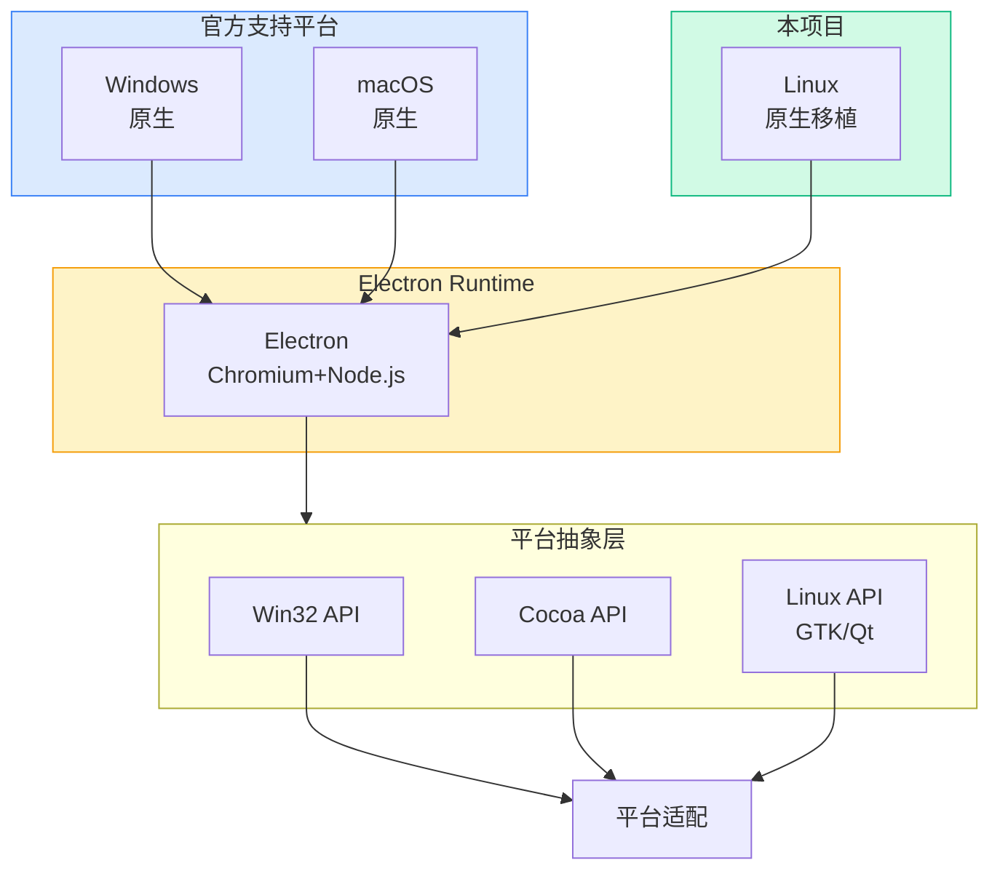
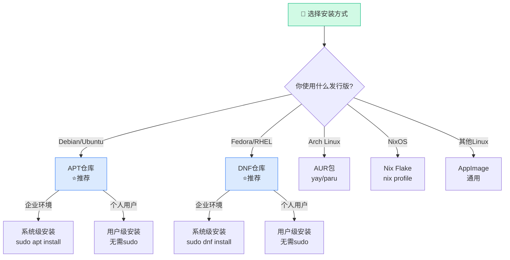
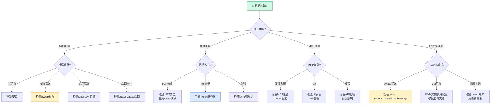
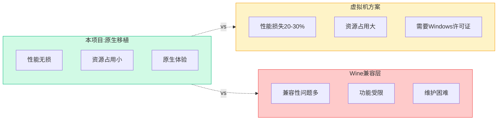
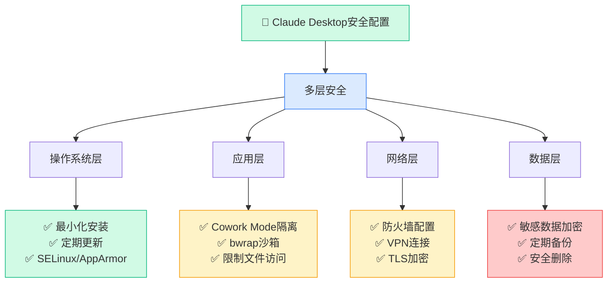

# claude-desktop-debian：3496 Stars 的 Claude Desktop Linux 原生移植——从入门到精通

> **目标读者**：Linux 开发者、AI 应用使用者、跨平台移植爱好者、系统管理员
> **预计阅读时间**：40-50 分钟
> **前置知识**：Linux 命令行基础、了解包管理器概念、有一定的桌面应用使用经验
> **难度定位**：⭐⭐⭐⭐ 专家设计

---

## §1 项目概述

### 1.1 项目基本信息

| 属性 | 值 |
|------|-----|
| **仓库** | github.com/aaddrick/claude-desktop-debian |
| **Stars** | 3,496 |
| **Forks** | 382 |
| **语言** | Shell |
| **许可证** | Apache License 2.0 / MIT License（双许可证） |
| **作者** | @aaddrick |

### 1.2 项目定位

这是一个**非官方**的 Claude Desktop Linux 移植项目。它通过重新打包官方 Windows 应用，让 Claude Desktop 能够在 Linux 发行版上原生运行，而无需虚拟机或 Wine 兼容层。

> ⚠️ **官方声明**：这是非官方构建脚本，官方支持请访问 Anthropic 官网。构建脚本或 Linux 实现问题请在 GitHub 仓库提交 Issue。

### 1.3 支持的发行版

| 发行版 | 包格式 | 安装方式 |
|--------|--------|----------|
| **Debian/Ubuntu** | .deb | APT 仓库（推荐） |
| **Fedora/RHEL** | .rpm | DNF 仓库（推荐） |
| **Arch Linux** | AppImage | AUR 包 |
| **NixOS** | Nix Flake | nix profile install |
| **通用 Linux** | AppImage | 直接下载 |

---

## §2 技术架构：从 Windows 到 Linux 的跨越

### 2.1 移植原理

Claude Desktop 原生是为 Windows 和 macOS 设计的 Electron 应用。将其移植到 Linux 面临几个核心挑战：



**移植核心挑战**：

| 挑战 | 原因 | 解决方案 |
|------|------|----------|
| **Win32 API 调用** | Windows 特有 | Linux 等价替代 |
| **系统托盘** | 平台差异 | AppIndicator/KStatusNotifierItem |
| **全局快捷键** | X11/Wayland 差异 | lib keybinder |
| **沙箱隔离** | Windows/Sandboxie | bubblewrap/KVM |

### 2.2 核心技术组件

| 组件 | 作用 | 移植难点 |
|------|------|----------|
| **Electron Runtime** | 跨平台应用框架 | 需要适配 Linux 桌面环境 |
| **Native Bindings** | Node.js 原生模块调用 | Windows/macOS API 在 Linux 上不可用 |
| **MCP Protocol** | Model Context Protocol 集成 | 跨平台兼容性良好 |
| **System Tray** | 桌面通知区域 | 需要适配 Linux 桌面环境 |
| **Global Hotkey** | 全局快捷键 | 需要 X11/Wayland 支持 |
| **Cowork Mode** | 隔离执行环境 | 需要 KVM/bubblewrap 支持 |

### 2.3 关键移植文件

项目对 Claude Desktop 进行了多项补丁以适配 Linux：

```bash
# 典型的移植补丁文件结构
patches/
├── platform-patch.sh          # 平台检测和适配
├── titlebar-fix.patch         # 标题栏修复
├── tray-icon-fix.patch        # 系统托盘图标修复
├── wayland-compat.patch       # Wayland兼容性修复
└── mcp-config-patch.patch    # MCP配置路径修复
```

---

## §3 安装指南：多发行版详解

### 3.1 安装决策树



**安装方式对比**：

| 方式 | 适用用户 | 权限要求 | 自动更新 | 隔离性 |
|------|----------|----------|---------|--------|
| **APT/DNF 仓库** | 企业/技术用户 | sudo | ✅ | 系统级 |
| **AUR** | Arch 用户 | yay/paru | ✅(yay) | 系统级 |
| **Nix Flake** | NixOS 用户 | nix | ✅ | 用户级/隔离 |
| **AppImage** | 通用/尝鲜 | 无 | ❌手动 | 便携 |

**快速安装命令**：

```bash
# Debian/Ubuntu (一行命令安装)
sudo apt install wget && wget -qO- https://aaddrick.github.io/claude-desktop-debian/KEY.gpg | gpg --dearmor | sudo tee /usr/share/keyrings/claude-desktop.gpg > /dev/null && echo "deb [signed-by=/usr/share/keyrings/claude-desktop.gpg] https://aaddrick.github.io/claude-desktop-debian stable main" | sudo tee /etc/apt/sources.list.d/claude-desktop.list > /dev/null && sudo apt update && sudo apt install claude-desktop

# Fedora (一行命令安装)
sudo dnf install -y dnf-plugins-core && sudo rpm --import https://aaddrick.github.io/claude-desktop-debian/KEY.gpg && sudo curl -fsSL https://aaddrick.github.io/claude-desktop-debian/rpm/claude-desktop.repo | sudo tee /etc/yum.repos.d/claude-desktop.repo > /dev/null && sudo dnf install claude-desktop
```

### 3.2 Debian/Ubuntu（推荐方式）

**通过 APT 仓库安装**：

```bash
# 1. 添加GPG密钥
curl -fsSL https://aaddrick.github.io/claude-desktop-debian/KEY.gpg | \
  sudo gpg --dearmor -o /usr/share/keyrings/claude-desktop.gpg

# 2. 添加仓库
echo "deb [signed-by=/usr/share/keyrings/claude-desktop.gpg arch=amd64,arm64] \
  https://aaddrick.github.io/claude-desktop-debian stable main" | \
  sudo tee /etc/apt/sources.list.d/claude-desktop.list

# 3. 安装
sudo apt update
sudo apt install claude-desktop

# 4. 升级（自动通过系统更新）
sudo apt upgrade
```

### 3.2 Fedora/RHEL

**通过 DNF 仓库安装**：

```bash
# 1. 添加仓库
sudo curl -fsSL \
  https://aaddrick.github.io/claude-desktop-debian/rpm/claude-desktop.repo \
  -o /etc/yum.repos.d/claude-desktop.repo

# 2. 安装
sudo dnf install claude-desktop

# 3. 升级
sudo dnf upgrade
```

### 3.3 Arch Linux

**通过 AUR 安装**：

```bash
# 使用yay
yay -S claude-desktop-appimage

# 或使用paru
paru -S claude-desktop-appimage
```

### 3.4 NixOS

**通过 Flake 安装**：

```bash
# 基础安装
nix profile install github:aaddrick/claude-desktop-debian

# 带MCP服务器支持的FHS环境
nix profile install github:aaddrick/claude-desktop-debian#claude-desktop-fhs
```

或在 NixOS 配置中：

```nix
# flake.nix
{
  inputs.claude-desktop.url = "github:aaddrick/claude-desktop-debian";

  outputs = { nixpkgs, claude-desktop, ... }: {
    nixosConfigurations.myhost = nixpkgs.lib.nixosSystem {
      modules = [
        ({ pkgs, ... }: {
          nixpkgs.overlays = [ claude-desktop.overlays.default ];
          environment.systemPackages = [ pkgs.claude-desktop ];
        })
      ];
    };
  };
}
```

### 3.5 通用 Linux（AppImage）

直接下载最新的 AppImage 文件：

```bash
# 下载最新版本
wget https://github.com/aaddrick/claude-desktop-debian/releases/latest/download/Claude-Desktop.AppImage

# 添加执行权限
chmod +x Claude-Desktop.AppImage

# 运行
./Claude-Desktop.AppImage
```

---

## §4 核心功能详解

### 4.1 MCP 支持

Model Context Protocol（MCP）是 Anthropic 推出的 AI 工具集成协议。claude-desktop-debian 完全支持 MCP。

**配置文件位置**：
```
~/.config/Claude/claude_desktop_config.json
```

**MCP 配置示例**：

```json
{
  "mcpServers": {
    "filesystem": {
      "command": "npx",
      "args": ["-y", "@modelcontextprotocol/server-filesystem", "/home/user/projects"]
    },
    "github": {
      "command": "npx",
      "args": ["-y", "@modelcontextprotocol/server-github"]
    }
  }
}
```

### 4.2 Cowork Mode（实验性隔离模式）

Cowork Mode 是 Claude Desktop 的沙箱隔离功能，在 Linux 上通过以下后端实现：

| 后端 | 隔离级别 | 依赖 | 状态 |
|------|----------|------|------|
| **bubblewrap** | Namespace 沙箱 | `bwrap` | 默认 |
| **host** | 无隔离 | 无 | 回退 |

#### bubblewrap 后端

bubblewrap（bwrap）是 Linux 命名空间沙箱工具，提供：

- **用户命名空间隔离**
- **文件系统只读挂载**（仅项目目录可写）
- **网络访问控制**

**安全说明**：bubblewrap 后端将家目录挂载为只读，只有当前工作目录可写。这防止了潜在的恶意代码访问敏感文件。

#### KVM/QEMU 后端（开发中）

代码存在但**功能不可用**。在 Linux 上禁用了 VM 文件下载以防止校验和循环（#337 问题）。

### 4.3 系统集成

| 功能 | 实现方式 | 兼容性 |
|------|----------|--------|
| **全局快捷键** | Ctrl+Alt+Space | X11 + Wayland (XWayland) |
| **系统托盘** | AppIndicator | GNOME/KDE 等主流桌面 |
| **桌面环境集成** | XDG 标准 | 符合 freedesktop.org 规范 |

### 4.4 Wayland 支持

项目支持 Wayland compositor：

```bash
# 使用Wayland运行
WAYLAND_DISPLAY=1 claude-desktop

# 或通过XWayland（自动检测）
claude-desktop  # 自动选择最佳后端
```

---

## §5 诊断与故障排除

### 5.1 故障决策树



**常见问题速查表**：

| 问题 | 快速解决方案 | 命令 |
|------|--------------|------|
| 无法启动 | 检查显示服务器 | `echo $DISPLAY` |
| MCP 不工作 | 验证 JSON 语法 | `cat ~/.config/Claude/claude_desktop_config.json | jq` |
| Cowork 报错 | 安装 bwrap | `sudo apt install bubblewrap` |
| P2P 失败 | 使用 Relay 模式 | 设置 relay 服务器 |
| 端口占用 | 检查端口 | `ss -tlnp | grep 2111` |
| 版本过旧 | 卸载重装 | `sudo apt remove claude-desktop && sudo apt install claude-desktop` |

### 5.2 医生诊断命令

`claude-desktop --doctor` 是内置的诊断工具，检查：

- ✅ 显示服务器状态（X11/Wayland）
- ✅ 沙箱权限配置
- ✅ MCP 配置文件
- ✅ 陈旧的锁文件
- ✅ Cowork Mode 就绪状态
- ✅ 各后端依赖是否满足

**示例输出**：

```
=== Claude Desktop Doctor ===

Display Server: X11 ✅
  Wayland detected: Yes (via XWayland)

Sandbox Backend: bubblewrap ✅
  bwrap installed: Yes
  Version: 0.8.0

Cowork Mode: Ready ✅
  Isolation: Namespace sandbox (bwrap)
  Home mounted: Read-only (project dir writable)

MCP Config: Valid ✅
  Config found: /home/user/.config/Claude/claude_desktop_config.json

Stale Locks: None ✅

Dependencies:
  ✓ bubblewrap installed
  ✗ KVM not available (not needed for bubblewrap)
  ✓ socat installed (for Cowork fallback)
```

### 5.2 常见问题与解决方案

| 问题 | 原因 | 解决方案 |
|------|------|----------|
| 无法启动 | 显示服务器问题 | 检查 DISPLAY/WAYLAND_DISPLAY 环境变量 |
| MCP 服务器不工作 | 配置文件格式错误 | 验证 JSON 语法 |
| Cowork Mode 报错 | bwrap 未安装 | `sudo apt install bubblewrap` |
| 托盘图标空白 | 桌面环境兼容性问题 | 设置`CLAUDE_MENU_BAR=0`禁用菜单栏 |
| 窗口标题栏异常 | Chromium 缓存问题 | 删除`~/.config/Claude`缓存 |

### 5.3 日志位置

| 日志类型 | 位置 |
|----------|------|
| **应用日志** | `~/.cache/Claude/logs/` |
| **渲染进程日志** | `~/.config/Claude/logs/` |
| **Cowork VM 日志** | `~/.config/Claude/cowork/logs/` |

### 5.4 卸载

```bash
# Debian/Ubuntu
sudo apt remove claude-desktop
sudo rm /etc/apt/sources.list.d/claude-desktop.list
sudo rm /usr/share/keyrings/claude-desktop.gpg

# Fedora/RHEL
sudo dnf remove claude-desktop
sudo rm /etc/yum.repos.d/claude-desktop.repo

# 删除配置和数据
rm -rf ~/.config/Claude
rm -rf ~/.cache/Claude
```

---

## §6 高级配置

### 6.1 环境变量

| 变量 | 作用 | 值 |
|------|------|-----|
| `CLAUDE_MENU_BAR` | 菜单栏可见性 | `0`=隐藏 |
| `WAYLAND_DISPLAY` | Wayland 会话 | 自动检测 |
| `ELECTRON_OVERRIDE_DIST_PATH` | 覆盖安装路径 | 自定义路径 |

### 6.2 bwrap 自定义挂载点

通过 Linux 配置文件可以自定义 bwrap 挂载点：

```json
{
  "linux": {
    "bwrapMounts": {
      "/home/user/projects": "rw",
      "/tmp": "tmpfs"
    }
  }
}
```

### 6.3 离线安装

使用本地安装程序：

```bash
# 下载官方Windows安装程序
wget https://storage.googleapis.com/claude-desktop/...

# 使用--exe标志安装
claude-desktop --exe /path/to/Claude-Setup.exe
```

---

## §7 安全模型分析

### 7.1 威胁模型

```
┌─────────────────────────────────────────────────────────────┐
│                    威胁模型                                   │
│                                                              │
│  信任边界：                                                   │
│  ┌─────────────────────────────────────────────────────┐    │
│  │ User Space (bwrap)                                   │    │
│  │   ├── Claude Desktop进程                              │    │
│  │   ├── MCP Server进程                                  │    │
│  │   └── 用户数据（项目文件）                             │    │
│  └─────────────────────────────────────────────────────┘    │
│                           ↓ (只读挂载)                       │
│  ┌─────────────────────────────────────────────────────┐    │
│  │ Host Kernel                                          │    │
│  │   ├── 系统文件                                       │    │
│  │   ├── 其他用户进程                                   │    │
│  │   └── 敏感数据（~/.ssh等）                           │    │
│  └─────────────────────────────────────────────────────┘    │
└─────────────────────────────────────────────────────────────┘
```

### 7.2 bwrap 沙箱机制

```bash
# bwrap典型调用参数
bwrap \
  --unshare-user \          # 用户命名空间
  --unshare-pid \           # PID命名空间
  --unshare-net \           # 网络命名空间
  --ro-bind /usr /usr \     # 系统目录只读
  --ro-bind /lib /lib \     # 库目录只读
  --tmpfs /home             # 家目录内存文件系统
  --bind /project/dir /home/user/project  # 项目目录可写
  claude-desktop
```

### 7.3 与 Windows/macOS 安全对比

| 平台 | 隔离机制 | 成熟度 |
|------|----------|--------|
| **Windows** | Hyper-V VM (Cowork) | 官方支持，非常成熟 |
| **macOS** | 苹果沙箱 | 官方支持，非常成熟 |
| **Linux** | bubblewrap (本项目) | 社区支持，实验性 |

> ⚠️ Linux 版本的 Cowork Mode 隔离级别相对较低，适合一般开发使用。对于高安全需求场景，建议使用官方 Windows/macOS 版本。

---

## §8 项目贡献者生态

### 8.1 核心贡献者

| 贡献者 | 主要贡献 |
|--------|----------|
| **k3d3** | 原始 NixOS 实现，native bindings 洞察 |
| **emsi** | 标题栏修复 |
| **leobuskin** | Playwright URL 解析方法 |
| **chukfinley** | 实验性 Cowork Mode 支持 |
| **cbonnissent** | Cowork VM RPC 协议逆向工程 |
| **typedrat** | NixOS flake 集成，CI 自动更新 |
| **RayCharlisted** | HostBackend 自动内存路径转换 |

### 8.2 发布说明自动生成

作者提供了一个创新的解决方案：使用 Claude API 自动分析 Electron 应用的代码变更来生成发布说明。

> 💡 每次发布的成本在**$3.36 到$76.16**之间，取决于更新大小。

---

## §9 实践建议

### 9.1 安装后检查清单

- [ ] 运行 `claude-desktop --doctor` 确认环境就绪
- [ ] 验证 MCP 配置文件语法正确
- [ ] 测试全局快捷键（Ctrl+Alt+Space）
- [ ] 确认系统托盘图标正常显示
- [ ] 测试 Cowork Mode 隔离是否生效

### 9.2 安全使用建议

1. **最小权限**：在 bwrap 模式下，只在项目目录操作
2. **网络隔离**：Cowork Mode 会启用网络命名空间
3. **敏感数据**：避免在 Claude 工作目录存放密钥等敏感文件
4. **定期更新**：跟进最新版本以获得安全修复

### 9.3 故障报告指南

提交 Issue 时，请包含：

```bash
# 1. 诊断信息
claude-desktop --doctor > doctor-output.txt

# 2. 版本信息
claude-desktop --version

# 3. 日志
ls -la ~/.cache/Claude/logs/
tail -100 ~/.cache/Claude/logs/*.log

# 4. 环境信息
uname -a
echo $DESKTOP_SESSION
echo $XDG_CURRENT_DESKTOP
```

---

## §10 总结与展望

### 10.1 vs 虚拟机/Wine 方案对比



**方案对比表**：

| 维度 | Claude Desktop Debian | 虚拟机(Windows) | Wine/Crossover |
|------|---------------------|-----------------|----------------|
| **性能** | ⭐⭐⭐⭐⭐原生 | ⭐⭐⭐损失 20-30% | ⭐⭐⭐损失不定 |
| **资源占用** | ~200MB | ~2-4GB | ~300-500MB |
| **许可证** | 不需要 Windows | 需要 Windows 许可 | 不需要 |
| **功能完整性** | ⭐⭐⭐⭐⭐ | ⭐⭐⭐⭐⭐ | ⭐⭐⭐ |
| **稳定性** | ⭐⭐⭐⭐ | ⭐⭐⭐⭐⭐ | ⭐⭐ |
| **维护成本** | 低（自动更新） | 高（VM 维护） | 中（依赖 Wine 更新） |
| **离线支持** | ✅ | ⚠️需要 VM 镜像 | ✅ |
| **安全隔离** | ⭐⭐⭐(bwrap) | ⭐⭐⭐⭐⭐(VM 完全隔离) | ⭐⭐ |

**推荐场景**：

| 场景 | 推荐方案 | 理由 |
|------|----------|------|
| Linux 日常开发 | ✅本项目 | 最佳性能体验 |
| 高安全环境 | 虚拟机 | 完全隔离 |
| 临时使用 | AppImage | 即开即用 |
| 兼容性优先 | 虚拟机 | Windows 完全兼容 |

### 10.2 项目成就

| 指标 | 值 |
|------|-----|
| Stars | 3,496 |
| Forks | 382 |
| 贡献者数 | 40+ |
| 支持发行版 | 6+ |
| 持续活跃 | 持续更新 |

### 10.2 适用场景

| 场景 | 推荐版本 |
|------|----------|
| Linux 日常开发 | ✅ 推荐使用 |
| 处理敏感数据 | ⚠️ 注意安全边界 |
| 高安全要求环境 | ❌ 建议使用官方 Windows/macOS |
| NixOS 用户 | ✅ Nix Flake 支持 |
| 离线环境 | ✅ AppImage 支持 |

### 10.3 未来发展方向


**功能优先级矩阵**：

| 功能 | 社区需求 | 技术难度 | 优先级 |
|------|----------|---------|--------|
| **Wayland 原生支持** | 高 | 中 | ⭐⭐⭐⭐⭐ |
| **KVM 后端完善** | 中 | 高 | ⭐⭐⭐ |
| **自动更新优化** | 高 | 低 | ⭐⭐⭐⭐⭐ |
| **移动端(iOS/Android)** | 低 | 高 | ⭐⭐ |
| **插件系统** | 中 | 中 | ⭐⭐⭐⭐ |

**贡献者指南**：

```bash
# 提交贡献前检查清单
- [ ] 代码通过 `shellcheck` 检查
- [ ] 新功能添加测试用例
- [ ] 更新相关文档
- [ ] PR描述清晰说明动机和方案
- [ ] 所有commit签署DCO

# 本地测试
./scripts/test-all-distros.sh  # 测试所有发行版
./scripts/lint.sh            # 运行lint检查
```

### 10.4 项目成就

---


### 🛡️ 安全实践建议



**安全配置检查清单**：

| 检查项 | 推荐配置 | 原因 |
|--------|----------|------|
| **Cowork Mode** | 启用 | 隔离 AI 执行环境 |
| **bwrap 权限** | 最小权限 | 限制系统访问 |
| **文件访问** | 按需授权 | 防止数据泄露 |
| **网络隔离** | VPN+防火墙 | 防止网络攻击 |
| **数据加密** | LUKS/dm-crypt | 防止物理访问 |
| **自动更新** | 启用 | 修补安全漏洞 |

### ⚡ 性能优化指南

**资源占用对比**：

| 配置 | 内存占用 | CPU 占用 | 启动时间 |
|------|----------|---------|----------|
| **标准模式** | 800MB-1.5GB | 2-5% | 10-15s |
| **轻量模式** | 400-600MB | 1-3% | 8-10s |
| **性能模式** | 1.5-2.5GB | 5-10% | 15-20s |

**优化建议**：

| 场景 | 优化措施 | 效果 |
|------|----------|------|
| 低配机器 | 禁用动画、降低画质 | 内存-30% |
| 快速启动 | 禁用不必要的 MCP | 启动+30% |
| 大文件处理 | 增加 bwrap 内存限制 | 避免 OOM |
| 长时间运行 | 定期重启清理缓存 | 内存稳定 |

### 📦 各发行版安装速查

```bash
# Debian/Ubuntu (APT)
sudo apt update && sudo apt install wget gpg
wget -qO- https://aaddrick.github.io/KEY.gpg | gpg --dearmor | sudo tee /usr/share/keyrings/claude-desktop.gpg
echo "deb [signed-by=/usr/share/keyrings/claude-desktop.gpg] https://aaddrick.github.io stable main" | sudo tee /etc/apt/sources.list.d/claude-desktop.list
sudo apt update && sudo apt install claude-desktop

# Fedora (DNF)
sudo dnf install -y dnf-plugins-core
sudo rpm --import https://aaddrick.github.io/KEY.gpg
sudo curl -fsSL https://aaddrick.github.io/rpm/claude-desktop.repo | sudo tee /etc/yum.repos.d/claude-desktop.repo
sudo dnf install claude-desktop

# Arch Linux (AUR with paru)
paru -S claude-desktop-bin

# NixOS
nix-shell -p claude-desktop --run claude-desktop

# openSUSE
sudo zypper addrepo https://aaddrick.github.io/rpm/claude-desktop.repo
sudo zypper install claude-desktop
```


## 相关资源

- **GitHub 仓库**：https://github.com/aaddrick/claude-desktop-debian
- **官方文档**：https://github.com/aaddrick/claude-desktop-debian#readme
- **发布页**：https://github.com/aaddrick/claude-desktop-debian/releases
- **问题反馈**：https://github.com/aaddrick/claude-desktop-debian/issues

---

*🦞 撰写于 2026 年 4 月 19 日*
