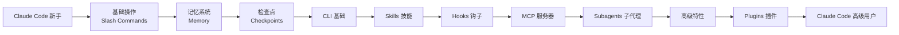
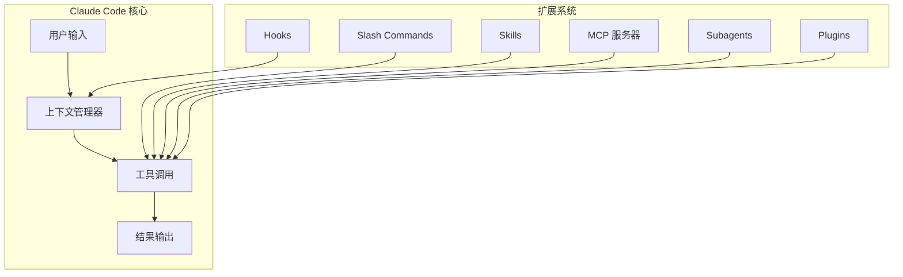
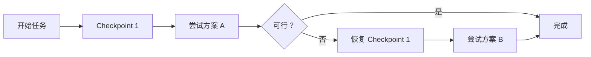
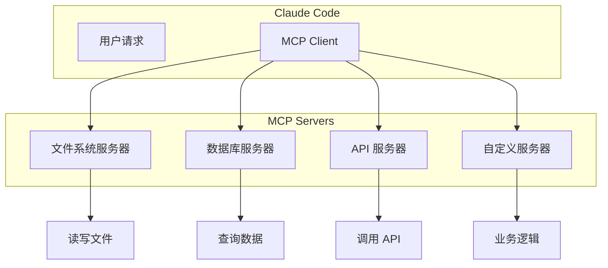
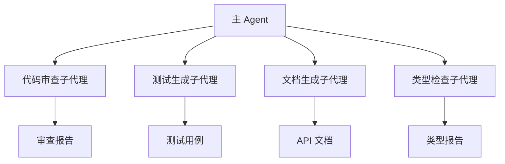
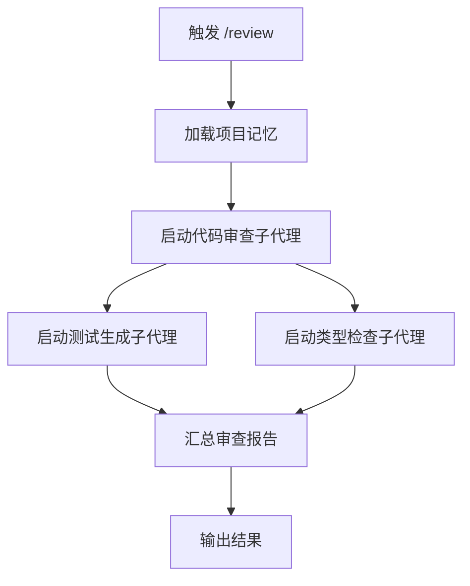
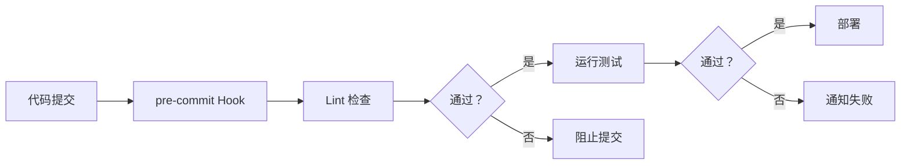

# Claude How To：从入门到精通：Claude Code 终极指南

> **目标读者**：希望掌握 Claude Code 的开发者，从零基础到高级用户
> **前置知识**：命令行基础、了解 AI/LLM 概念
> **预计学习时间**：11-13 小时（可分模块学习）

---

## 🎯 学习目标

完成本文档后，你将掌握：

- ✅ 理解 Claude Code 的核心设计理念与解决问题
- ✅ 从零开始搭建 Claude Code 开发环境（15 分钟）
- ✅ 掌握 Slash Commands 的使用与自定义（30 分钟）
- ✅ 构建项目记忆系统（Memory）（45 分钟）
- ✅ 开发自定义 Skills 技能（1 小时）
- ✅ 配置 MCP 服务器实现工具扩展（1 小时）
- ✅ 使用 Hooks 自动化工作流（1 小时）
- ✅ 掌握 Subagents 子代理并行开发（1.5 小时）
- ✅ 理解 Checkpoints 检查点机制（45 分钟）
- ✅ 部署 Plugins 插件扩展（2 小时）
- ✅ 精通 CLI 命令行接口（30 分钟）
- ✅ 组合所有功能构建生产级工作流

---

## 一、项目概述与背景

### 1.1 什么是 Claude How To？

Claude How To（[luongnv89/claude-howto](https://github.com/luongnv89/claude-howto)）是一个**结构化、可视化、示例驱动**的 Claude Code 学习指南。与官方文档不同，它不教你每个功能是什么，而是教你**如何组合这些功能**构建真实的生产级工作流。

**核心定位**：让开发者在 11-13 小时内，从 Claude Code 新手成长为高级用户。



### 1.2 项目数据

| 指标 | 数值 |
|------|------|
| GitHub Stars | **9.3k** |
| GitHub Forks | **941** |
| 许可证 | MIT |
| 最新版本 | v2.2.0（2026年3月） |
| Commits | 125 |
| 维护状态 | 活跃（每次 Claude Code 更新同步） |

### 1.3 它解决了什么问题？

| 问题 | Claude How To 的方案 |
|------|---------------------|
| 官方文档只描述功能，不展示如何组合 | 可视化教程 + Mermaid 图表 + 生产级模板 |
| 不知道该按什么顺序学习 | 渐进式学习路径（初学者→高级） |
| 示例太基础，无法用于生产 | 开箱即用的生产级模板 |
| 没有清晰的上手路径 | 15 分钟快速入门，11-13 小时精通 |

### 1.4 你将获得什么？

- **10 个教程模块**：覆盖 Claude Code 全部功能
- **可复制粘贴的配置**：Slash Commands、CLAUDE.md 模板、Hook 脚本、MCP 配置、Subagent 定义
- **Mermaid 架构图**：理解每个功能的工作原理
- **引导式学习路径**：带时间估算的渐进式教程
- **内置自测**：运行 `/self-assessment` 或 `/lesson-quiz` 找到知识盲点

---

## 二、快速开始：15 分钟入门

### 2.1 环境要求

- Claude Code 已安装（v2.1+）
- Git 已安装
- 命令行基础

### 2.2 安装步骤

**第一步：克隆指南仓库**

```bash
git clone https://github.com/luongnv89/claude-howto.git
cd claude-howto
```

**第二步：复制第一个 Slash Command**

```bash
# 创建你的项目目录
mkdir -p /path/to/your-project/.claude/commands

# 复制优化命令模板
cp 01-slash-commands/optimize.md /path/to/your-project/.claude/commands/
```

**第三步：在 Claude Code 中试用**

```bash
# 进入你的项目
cd /path/to/your-project

# 启动 Claude Code
claude

# 在 Claude Code 中输入：
/optimize
```

**第四步：设置项目记忆（可选）**

```bash
cp 02-memory/project-CLAUDE.md /path/to/your-project/CLAUDE.md
```

**第五步：安装一个 Skill（可选）**

```bash
cp -r 03-skills/code-review ~/.claude/skills/
```

### 2.3 1 小时速成方案

如果想更快上手，可以一次性安装核心组件：

```bash
# 1. 安装 Slash Commands（15 分钟）
cp 01-slash-commands/*.md .claude/commands/

# 2. 设置项目记忆（15 分钟）
cp 02-memory/project-CLAUDE.md ./CLAUDE.md

# 3. 安装代码审查 Skill（15 分钟）
cp -r 03-skills/code-review ~/.claude/skills/
```

---

## 三、核心概念深度解析

### 3.1 Claude Code 的核心理念

Claude Code 不是另一个 AI 聊天机器人，而是一个**程序员友好的开发助手**。它的设计哲学是：

1. **命令行优先**：直接在终端运行，无需切换上下文
2. **工具增强**：通过 Bash、Read、Write、Edit 等工具与文件系统交互
3. **状态保持**：通过 Memory 系统记住项目上下文
4. **可扩展性**：支持 Skills、MCP、Plugins 扩展



### 3.2 Slash Commands 斜杠命令

Slash Commands 是预定义的提示词模板，通过 `/` 触发。例如 `/optimize` 会启动代码优化流程。

**为什么需要 Slash Commands？**

- 标准化工作流程
- 团队共享最佳实践
- 减少重复输入

**常用 Slash Commands 列表**：

| 命令 | 功能 | 使用场景 |
|------|------|----------|
| `/optimize` | 代码优化 | 性能调优、重构建议 |
| `/test` | 生成测试 | TDD 开发 |
| `/review` | 代码审查 | PR 检查 |
| `/explain` | 解释代码 | 学习源码 |
| `/fix` | 修复 Bug | 错误调试 |

### 3.3 Memory 记忆系统

Memory 是 Claude Code 保持项目上下文的能力。通过 CLAUDE.md 文件注入项目知识。

**CLAUDE.md 的结构**：

```markdown
# 项目名称

## 技术栈
- 前端：React 18
- 后端：Node.js + Express
- 数据库：PostgreSQL

## 代码规范
- 使用 ESLint + Prettier
- Git commit 格式：feat|fix|docs|style|refactor|test|chore

## 项目结构
/src
  /components  # React 组件
  /routes      # API 路由
  /services    # 业务逻辑
  /models      # 数据模型
```

**为什么重要？**

- 让 Claude Code 理解项目背景
- 保持多轮对话的上下文一致性
- 避免每次都要解释项目结构

### 3.4 Checkpoints 检查点机制

Checkpoints 是 Claude Code 的"存档"功能，让你可以在任意时刻保存状态，并在之后恢复。

**使用场景**：
- 复杂重构前保存进度
- 实验性修改不怕丢失
- 多分支开发时快速切换



### 3.5 Skills 技能系统

Skills 是可配置的、预打包的知识和工具集。它们可以被 Claude Code 加载，并在对话中激活。

**Skill 的结构**：

```
~/.claude/skills/<skill-name>/
├── SKILL.md       # 技能定义
├── README.md      # 使用文档
├── commands/      # 关联的 Slash Commands
├── agents/       # 子代理定义
├── rules/        # 规则文件
└── tools/        # 自定义工具
```

**内置 Skill 示例**：
- `code-review`：自动化代码审查
- `test-generator`：测试生成
- `docs-writer`：文档编写

### 3.6 MCP 服务器

MCP（Model Context Protocol）是一种让 Claude 与外部工具和服务交互的协议。通过 MCP，你可以让 Claude 访问数据库、API、文件系统等。

**MCP 的架构**：



**常用 MCP 服务器**：
- **Filesystem**：读写本地文件
- **Git**：版本控制操作
- **Puppeteer**：浏览器自动化
- **SQL Database**：数据库查询

### 3.7 Hooks 钩子系统

Hooks 是在特定事件触发时自动执行的脚本。它们让你自动化工作流程的各个阶段。

**Hook 类型**：

| Hook | 触发时机 | 使用场景 |
|------|----------|----------|
| `pre-tool-use` | 工具调用前 | 确认敏感操作 |
| `post-tool-use` | 工具调用后 | 记录日志 |
| `on-error` | 错误发生时 | 发送通知 |
| `on-context-expired` | 上下文过期前 | 保存进度 |

**示例：自动保存检查点**

```bash
#!/bin/bash
# .claude/hooks/post-tool-use/save-checkpoint.sh

# 当工具调用成功后自动保存检查点
if [ "$TOOL_NAME" = "Bash" ]; then
    claude checkpoint create "Auto-save before $1"
fi
```

### 3.8 Subagents 子代理

Subagents 是 Claude Code 启动的子任务，它们可以并行执行，专门负责特定领域。

**使用场景**：
- 代码审查 + 单元测试 + 文档生成 并行执行
- 多文件重构
- 大型项目的模块化处理



---

## 四、学习路径详解

### 4.1 初学者路径（Beginner）

**目标**：能够日常使用 Claude Code

**时间**：约 2.5 小时

| 顺序 | 模块 | 内容 | 时间 |
|------|------|------|------|
| 1 | Slash Commands | 学会使用和创建斜杠命令 | 30 min |
| 2 | Memory | 设置项目上下文 | 45 min |
| 4 | CLI Basics | 掌握命令行接口 | 30 min |

**推荐起点**：

```bash
# 安装第一个 Slash Command
cp 01-slash-commands/optimize.md ~/.claude/commands/

# 设置项目记忆
cp 02-memory/project-CLAUDE.md ./CLAUDE.md
```

### 4.2 中级路径（Intermediate）

**目标**：能够自动化工作流程

**时间**：约 3.5 小时

| 顺序 | 模块 | 内容 | 时间 |
|------|------|------|------|
| 3 | Checkpoints | 保存和恢复进度 | 45 min |
| 5 | Skills | 开发自定义技能 | 1 hour |
| 6 | Hooks | 自动化工作流 | 1 hour |

**推荐起点**：

```bash
# 复制 Skill
cp -r 03-skills/code-review ~/.claude/skills/

# 设置 Hook
mkdir -p .claude/hooks/post-tool-use
cp 06-hooks/examples/* .claude/hooks/
```

### 4.3 高级路径（Advanced）

**目标**：构建生产级自动化系统

**时间**：约 5 小时

| 顺序 | 模块 | 内容 | 时间 |
|------|------|------|------|
| 7 | MCP | 集成外部工具 | 1 hour |
| 8 | Subagents | 并行任务处理 | 1.5 hours |
| 9 | Advanced Features | 高级特性组合 | 2-3 hours |

**推荐起点**：

```bash
# 配置 MCP 服务器
cp 05-mcp/configs/* ./.claude/

# 复制子代理模板
cp -r 04-subagents/* .claude/agents/
```

### 4.4 专家路径（Expert）

**目标**：搭建团队级开发平台

**时间**：约 2 小时

| 顺序 | 模块 | 内容 | 时间 |
|------|------|------|------|
| 10 | Plugins | 打包和分发技能 | 2 hours |

---

## 五、实战模板库

### 5.1 自动化代码审查工作流

组合使用：Slash Commands + Subagents + Memory + MCP



**部署步骤**：

```bash
# 1. 复制 Slash Commands
cp 01-slash-commands/review.md ~/.claude/commands/

# 2. 设置项目记忆
cp 02-memory/code-review-CLAUDE.md ./CLAUDE.md

# 3. 安装代码审查 Skill
cp -r 03-skills/code-review ~/.claude/skills/

# 4. 配置 MCP 服务器
cp 05-mcp/puppeteer-mcp.json ./.claude/mcp.json
```

### 5.2 CI/CD 自动化工作流

组合使用：CLI + Hooks + Background Tasks



### 5.3 团队知识库工作流

组合使用：Memory + Skills + Plugins

**部署团队知识库**：

```bash
# 1. 安装知识库 Skill
cp -r 03-skills/knowledge-base ~/.claude/skills/

# 2. 复制团队规范
cp 02-memory/team-CLAUDE.md ./CLAUDE.md

# 3. 配置只读 Hook
cp 06-hooks/read-only-mode.sh .claude/hooks/pre-tool-use/
```

---

## 六、常见问题

### Q1：这个教程免费吗？

**是的**。MIT 许可证，永久免费。可以用于个人项目、工作、团队，没有任何限制（只需保留许可证声明）。

### Q2：这个项目还在维护吗？

**是的**，活跃维护中。每次 Claude Code 发布更新时，这个指南也会同步更新。当前版本 v2.2.0（2026年3月），兼容 Claude Code 2.1+。

### Q3：与官方文档有什么区别？

| 维度 | 官方文档 | Claude How To |
|------|----------|---------------|
| 格式 | 功能参考 | 可视化教程 |
| 深度 | 功能描述 | 内部原理 |
| 示例 | 基础片段 | 生产级模板 |
| 结构 | 按功能组织 | 渐进式学习路径 |
| 自测 | 无 | 内置测验 |

### Q4：学完需要多长时间？

完整学习路径 11-13 小时。但**15 分钟就能获得立竿见影的效果**——只需复制一个 Slash Command 模板并试用。

### Q5：支持 Claude Sonnet/Haiku/Opus 吗？

**支持**。所有模板兼容 Claude Sonnet 4.6、Claude Opus 4.6 和 Claude Haiku 4.5。

### Q6：可以贡献代码吗？

**欢迎**！参见 [CONTRIBUTING.md](https://github.com/luongnv89/claude-howto/blob/main/CONTRIBUTING.md)。我们欢迎新的示例、Bug 修复、文档改进和社区模板。

---

## 七、可构建的实战项目

### 7.1 自动化代码审查

**组合功能**：Slash Commands + Subagents + Memory + MCP

```yaml
工作流：
1. 开发者触发 /review
2. Claude 加载项目规范（Memory）
3. 启动并行子代理：
   - 代码风格审查
   - 安全漏洞扫描
   - 性能分析
   - 测试覆盖率检查
4. 汇总所有报告
5. 输出结构化审查结果
```

### 7.2 团队代码规范化

**组合功能**：Memory + Slash Commands + Hooks + Plugins

```yaml
工作流：
1. 开发者提交代码
2. pre-commit Hook 触发
3. 自动检查：
   - Commit 格式规范
   - 代码风格（ESLint/Prettier）
   - 类型检查（TypeScript）
   - 秘密密钥扫描
4. 不符合规范的提交被阻止
5. 符合规范的提交通过并运行测试
```

### 7.3 智能文档生成

**组合功能**：Skills + Subagents + Plugins

```yaml
工作流：
1. 开发者触发 /generate-docs
2. 启动文档生成子代理：
   - API 文档生成
   - README 更新
   - CHANGELOG 维护
3. Skill 自动格式化输出
4. Plugin 提交 PR
```

### 7.4 安全审计自动化

**组合功能**：Subagents + Skills + Hooks（只读模式）

```yaml
工作流：
1. 触发 /security-audit
2. 以只读模式启动（防止误操作）
3. 并行扫描：
   - 依赖漏洞检查
   - SQL 注入检测
   - XSS 向量扫描
   - 敏感数据暴露检查
4. 生成安全报告
```

### 7.5 复杂重构项目管理

**组合功能**：Checkpoints + Planning Mode + Hooks

```yaml
工作流：
1. 触发 /refactor <target-module>
2. Claude 创建重构计划
3. 每次重大修改前创建检查点
4. 用户确认后继续
5. 完成后运行完整测试套件
6. 如有问题，恢复到上一个检查点
```

---

## 八、最佳实践

### 8.1 项目结构推荐

```
your-project/
├── .claude/
│   ├── commands/           # Slash Commands
│   │   ├── optimize.md
│   │   ├── review.md
│   │   └── test.md
│   ├── skills/            # Skills
│   │   └── code-review/
│   ├── agents/            # Subagents
│   │   └── reviewer.md
│   ├── hooks/             # Hooks
│   │   ├── pre-tool-use/
│   │   └── post-tool-use/
│   ├── mcp.json          # MCP 配置
│   └── .cspell.json      # 拼写检查
├── CLAUDE.md             # 项目记忆
├── CLAUDE.local.md       # 本地覆盖（不被 Git 跟踪）
└── ...
```

### 8.2 团队协作规范

1. **统一 CLAUDE.md**：团队共享项目上下文
2. **版本控制 Skill**：将 Skill 放在 Git 中管理
3. **代码审查流程**：使用 Subagents 并行审查
4. **CI/CD 集成**：使用 Hooks 自动化检查

### 8.3 性能优化

1. **减少上下文大小**：定期清理对话历史
2. **使用 Checkpoints**：避免重复工作
3. **选择性加载**：不要一次性加载所有 Skills
4. **缓存常用响应**：使用 Memory 记住常见答案

---

## 九、总结

Claude How To 是目前最完整的 Claude Code 学习指南。它的独特价值在于：

| 优势 | 说明 |
|------|------|
| 🗺️ **清晰路径** | 从 15 分钟到 11 小时，覆盖所有级别 |
| 📊 **可视化** | Mermaid 图表让你看得懂原理 |
| 🛠️ **生产就绪** | 所有模板可直接用于真实项目 |
| 🔄 **活跃维护** | 每次 Claude Code 更新同步更新 |
| 🤝 **社区驱动** | 690+ Fork，开发者贡献真实配置 |

**下一步推荐**：

1. [快速开始](#二快速开始15-分钟入门)：克隆仓库，15 分钟体验
2. [学习路径](#四学习路径详解)：按级别选择适合的模块
3. [实战模板](#五实战模板库)：选择一个模板开始使用
4. [贡献代码](#q6可以贡献代码吗)：成为贡献者

---

**文档信息**

- 难度：⭐⭐⭐⭐（专家级）
- 类型：完整教程
- 更新日期：2026-03-30
- 预计学习时间：11-13 小时
- GitHub：https://github.com/luongnv89/claude-howto

🦞 由钳岳星君撰写 | 项目源码：https://github.com/luongnv89/claude-howto