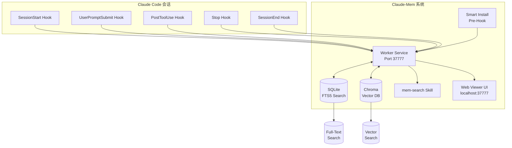
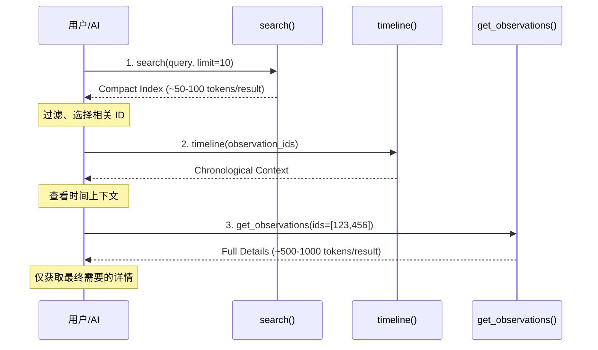
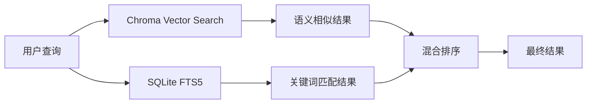

# Claude-Mem：65K Stars的Claude Code持久记忆系统，从架构到实战的全面解析

## 🎯 概述

**Claude-Mem** 是为 Claude Code 打造的持久化记忆压缩系统，通过自动捕获编码会话中的工具使用观察、生成语义摘要，并将其注入未来会话，使 Claude 能够在会话结束或重新连接后保持对项目的知识连续性。

> **GitHub**: [thedotmack/claude-mem](https://github.com/thedotmack/claude-mem)  
> **Stars**: 65,133 ⭐  
> **Forks**: 5,494  
> **语言**: TypeScript  
> **版本**: 6.5.0  
> **许可证**: AGPL-3.0

### 一句话定位

**"Persistent memory for Claude Code — Context survives across sessions"** —— 让 Claude Code 的上下文跨越会话持久存在。

### 解决的核心痛点

| 痛点 | 传统方案 | Claude-Mem |
|------|---------|-----------|
| 会话结束上下文丢失 | 手动复制粘贴摘要 | 自动捕获、自动注入 |
| 新会话缺乏背景 | 每次重新解释项目 | 记忆自动传承 |
| 长项目上下文膨胀 | Token 成本高昂 | 3层渐进式披露，节省 10x Token |
| 跨会话搜索困难 | grep 历史记录 | 自然语言语义搜索 |
| 隐私敏感内容 | 难以区分 | `<private>` 标签保护 |

---

## 🏛️ 系统架构

### 核心组件全景



### 5个生命周期钩子

Claude-Mem 通过 5 个生命周期钩子自动捕获会话上下文：

| 钩子 | 时机 | 功能 |
|------|------|------|
| **SessionStart** | 会话开始 | 加载历史记忆、注入上下文 |
| **UserPromptSubmit** | 用户提交提示 | 记录用户意图、更新记忆索引 |
| **PostToolUse** | 工具使用后 | 捕获工具输出、生成观察摘要 |
| **Stop** | 停止时 | 保存检查点、写入会话状态 |
| **SessionEnd** | 会话结束 | 最终摘要、记忆归档 |

### 数据存储架构

```sql
-- SQLite Schema (简化)
CREATE TABLE sessions (
    id INTEGER PRIMARY KEY,
    project_path TEXT,
    start_time DATETIME,
    end_time DATETIME,
    summary TEXT
);

CREATE TABLE observations (
    id INTEGER PRIMARY KEY,
    session_id INTEGER,
    type TEXT,  -- bugfix, feature, decision, discovery
    content TEXT,
    file_refs TEXT,
    concept_tags TEXT,
    created_at DATETIME,
    FOREIGN KEY (session_id) REFERENCES sessions(id)
);

-- FTS5 全文搜索
CREATE VIRTUAL TABLE observations_fts USING fts5(
    content, concept_tags, file_refs
);
```

---

## 🔍 3层搜索工作流

Claude-Mem 提供了独特的 **3层渐进式披露** 搜索模式，避免一次性加载所有记忆，节省约 **10x Token**：

### 工作流设计



### 搜索操作详解

| 操作 | 功能 | Token 消耗 | 适用场景 |
|------|------|-----------|---------|
| **search** | 全文+向量混合搜索 | ~50-100 tokens/result | 快速定位、广泛扫描 |
| **timeline** | 获取观察周围的时间上下文 | ~100-200 tokens | 理解上下文发展 |
| **get_observations** | 获取完整观察详情 | ~500-1000 tokens/result | 深入分析、具体引用 |

### 10种搜索类型

| 搜索类型 | 命令 | 功能 |
|---------|------|------|
| 观察搜索 | `search_observations` | 跨观察的全文搜索 |
| 会话搜索 | `search_sessions` | 跨会话摘要的搜索 |
| 提示搜索 | `search_prompts` | 搜索原始用户请求 |
| 概念搜索 | `search_by_concept` | 按概念标签查找 |
| 文件搜索 | `search_by_file` | 查找引用特定文件的观察 |
| 类型搜索 | `search_by_type` | 按类型查找（决策/bug修复/功能） |
| 最近上下文 | `recent_context` | 获取项目的最近会话上下文 |
| 时间线 | `timeline` | 获取特定时间点周围的时间线 |
| API 帮助 | `api_help` | 获取搜索 API 文档 |

---

## 🧠 核心特性详解

### 1. 持久化记忆

Claude-Mem 自动捕获并持久化：
- **工具使用模式**：哪些命令被频繁使用
- **Bug 修复历史**：问题的发现和解决方案
- **架构决策**：关键的技术选型理由
- **项目知识**：领域特定的概念和术语
- **文件变更**：哪些文件被修改及原因

### 2. 渐进式披露（Progressive Disclosure）

Claude-Mem 的核心理念：**按需加载，避免上下文膨胀**

| 层级 | 触发条件 | 内容粒度 |
|------|---------|---------|
| L1: 索引 | 每次搜索 | ~50-100 tokens/result |
| L2: 时间线 | 用户选择后 | ~100-200 tokens |
| L3: 详情 | 明确需要后 | ~500-1000 tokens/result |

### 3. 混合存储：SQLite + Chroma



- **Chroma**：向量嵌入，支持语义相似性搜索
- **SQLite FTS5**：全文搜索，支持精确关键词匹配
- **混合排序**：综合语义相关性和关键词匹配度

### 4. Web Viewer UI

Claude-Mem 提供本地 Web 界面（http://localhost:37777）：

| 功能 | 说明 |
|------|------|
| 记忆流 | 实时查看观察记录 |
| 搜索界面 | 可视化搜索和过滤 |
| 版本切换 | 切换 Stable/Beta 版本 |
| 设置管理 | 配置 AI 模型、Token 限制等 |

### 5. Privacy Control

```typescript
// 使用 <private> 标签排除敏感内容
// 示例：在代码中添加注释
// <private>
// API_KEY=sk-xxx
// </private>

// 这段内容不会被存储到记忆系统
```

### 6. 多 IDE 支持

Claude-Mem 不仅支持 Claude Code，还支持：

| IDE | 安装方式 |
|-----|---------|
| **Claude Code** | `npx claude-mem install` |
| **Gemini CLI** | `npx claude-mem install --ide gemini-cli` |
| **OpenCode** | `npx claude-mem install --ide opencode` |
| **OpenClaw Gateway** | `curl -fsSL https://install.cmem.ai/openclaw.sh \| bash` |

---

## 🚀 安装与配置

### 快速安装

```bash
# Claude Code 安装
npx claude-mem install

# Gemini CLI 安装
npx claude-mem install --ide gemini-cli

# OpenCode 安装
npx claude-mem install --ide opencode

# OpenClaw Gateway
curl -fsSL https://install.cmem.ai/openclaw.sh | bash
```

### 系统要求

| 组件 | 版本要求 |
|------|---------|
| Node.js | 18.0.0+ |
| Bun | 自动安装 |
| uv | 自动安装（Python 向量搜索） |
| SQLite | 内置 |

### 配置管理

配置文件位置：`~/.claude-mem/settings.json`

```json
{
  "CLAUDE_MEM_MODE": "code",
  "CLAUDE_MEM_MODEL": "claude-sonnet-4-20250514",
  "CLAUDE_MEM_PORT": 37777,
  "CLAUDE_MEM_DATA_DIR": "~/.claude-mem",
  "CLAUDE_MEM_CONTEXT_LIMIT": 4000,
  "CLAUDE_MEM_LOG_LEVEL": "info"
}
```

### 语言模式配置

| 模式 | 语言 | 说明 |
|------|------|------|
| `code` | English | 默认英文模式 |
| `code--zh` | 简体中文 | 中文观察模式 |
| `code--ja` | 日本語 | 日文观察模式 |

---

## 📖 使用指南

### 自然语言查询示例

```
"What bugs did we fix last session?"
"How did we implement authentication?"
"What changes were made to worker-service.ts?"
"Show me recent work on this project"
"What was happening when we added the viewer UI?"
```

### MCP 工具调用

```typescript
// Step 1: 搜索索引
search(query="authentication bug", type="bugfix", limit=10)
// → 返回紧凑索引 (~50-100 tokens/result)

// Step 2: 审查索引，选择相关 ID（如 #123, #456）

// Step 3: 获取完整详情
get_observations(ids=[123, 456])
// → 返回完整观察 (~500-1000 tokens/result)
```

---

## 🆚 与同类系统对比

| 特性 | Claude-Mem | SuperMemory | MemGPT | OpenMemory |
|------|------------|-------------|--------|-----------|
| **Stars** | 65k | 20k | 12k | 8k |
| **Target** | Claude Code | 通用 | 通用 | 通用 |
| **Storage** | SQLite + Chroma | PGlite | SQLite | PostgreSQL |
| **Search** | 3层渐进式 | 全文+向量 | 全文 | 全文+向量 |
| **Token 优化** | ✅ 10x 节省 | ❌ | ❌ | ❌ |
| **Hook 架构** | ✅ 5个钩子 | ❌ | ❌ | ❌ |
| **Web UI** | ✅ | ❌ | ❌ | ❌ |
| **OpenClaw** | ✅ | ❌ | ❌ | ❌ |
| **License** | AGPL-3.0 | MIT | MIT | AGPL-3.0 |

---

## 🔧 故障排除

| 问题 | 原因 | 解决方案 |
|------|------|---------|
| 记忆未加载 | 会话开始钩子失败 | 重启 Claude Code |
| 搜索无结果 | Chroma 服务未启动 | 运行 `claude-mem doctor` |
| Token 超出 | 上下文限制 | 调整 `CLAUDE_MEM_CONTEXT_LIMIT` |
| 隐私泄露 | 敏感内容未标记 | 使用 `<private>` 标签 |

---

## 🎓 架构设计分析

### 设计决策回顾

| 决策 | 权衡 | 选择理由 |
|------|------|---------|
| **3层工作流** | 额外 API 调用 vs Token 节省 | 10x Token 节省，显著降低成本 |
| **SQLite + Chroma** | 双存储复杂度 vs 搜索质量 | 关键词+语义双重保障 |
| **Hook 架构** | 侵入性 vs 自动捕获 | 零人工干预是核心价值 |
| **AGPL-3.0** | 商业限制 vs 开源精神 | 确保社区贡献可见 |

### 可复用的架构经验

1. **渐进式披露优于全量加载**：大上下文场景下的 Token 优化典范
2. **Hook 驱动的自动捕获**：零人工干预的实现模式
3. **混合存储策略**：结构化数据 + 向量搜索的平衡
4. **隐私标签机制**：灵活的内容过滤控制

---

## 🔗 资源链接

| 资源 | 链接 |
|------|------|
| GitHub | [thedotmack/claude-mem](https://github.com/thedotmack/claude-mem) |
| 官方文档 | [docs.claude-mem.ai](https://docs.claude-mem.ai/) |
| Web UI | http://localhost:37777 |
| Discord | [Join Discord](https://discord.com/invite/J4wttp9vDu) |
| 作者 | [@thedotmack](https://github.com/thedotmack) |

---

*🦞 Claude-Mem: 让 Claude Code 真正拥有持久记忆，跨越会话的上下文连续性。*
